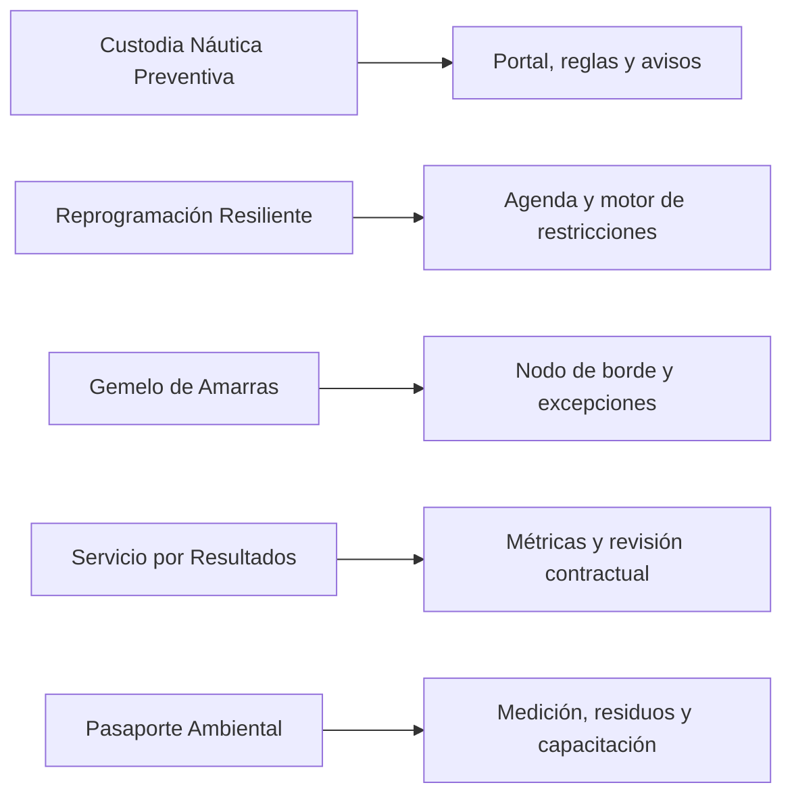

# Portada

**PROPUESTA TÉCNICA**

**Proyecto Puerto Deportivo**

Solución tecnológica para operaciones, datos y decisiones

Septiembre 2026

# subdoc. 1: Presentación de la empresa

# 1. Presentación de la empresa

Synaptix presenta su actividad, organización y forma de gobierno para el proyecto Puerto Deportivo Bahía Panitao. La experiencia y los antecedentes habilitantes se documentan en los formularios de la oferta; este capítulo describe las capacidades y responsabilidades que sustentan los subdocumentos técnicos siguientes.

## 1.1 Presentación de la empresa

Synaptix Ingeniería de Software desarrolla plataformas operacionales para organizaciones que administran activos físicos. Su oferta comprende arquitectura de software, integración entre sistemas y equipos de terreno, gestión de datos, trazabilidad y servicios de operación tecnológica. Para Bahía Panitao, estas disciplinas se aplican a una plataforma híbrida que debe mantener las funciones críticas del recinto durante interrupciones de conectividad.

La empresa opera bajo la razón social **Synaptix Ingeniería de Software SpA**, RUT **76.913.482-4**, constituida en 2019. Su domicilio comercial y de representación es Avenida Costanera 1250, oficina 402, Valparaíso, Región de Valparaíso. Su representante legal es **Ignacio Silva**, quien ejerce la Dirección General y cuenta con facultades para representar a la sociedad en esta licitación y suscribir el contrato. Synaptix es el nombre comercial utilizado en la propuesta y en los formularios asociados.

Synaptix mantuvo patrimonio positivo y resultados operacionales positivos en los ejercicios 2023, 2024 y 2025. Su actividad se financia mediante capital propio e ingresos provenientes de contratos de desarrollo, integración y servicios gestionados. La empresa mantiene una reserva de tesorería para remuneraciones, infraestructura de trabajo y continuidad de sus servicios, y dispone de capacidad bancaria para constituir las garantías de seriedad de la oferta, fiel cumplimiento y correcto funcionamiento exigidas por las Bases Administrativas.

Estos antecedentes sustentan la capacidad de mantener el equipo y los servicios durante la ejecución del contrato. Su acreditación se entregará en el Sobre N° 1 mediante los estados financieros auditados de los tres ejercicios, el certificado bancario de capacidad de emisión de garantías y los antecedentes tributarios, comerciales y laborales exigidos. El Formulario A-5 y el índice del sobre identificarán la ubicación de cada documento (Bases Administrativas, arts. 34.1 y 39, pp. 22 y 25; Formulario T-7, p. 57).

## 1.2 Estructura organizacional

La estructura funcional de Synaptix articula Dirección general y gestión contractual; Arquitectura e Ingeniería; Operaciones y Servicios Gestionados; Datos y Seguridad; y Calidad y Conocimiento. La dotación nominal del proyecto se presenta por separado en el Formulario T-8.

Arquitectura e Ingeniería reúne el diseño de aplicaciones, interfaces y componentes de borde. Operaciones administra despliegues, observabilidad, respaldo, atención y continuidad. Datos y Seguridad define reglas para acceso, conservación, intercambio y protección de información. Calidad y Conocimiento revisa la trazabilidad de requisitos, registra no conformidades y prepara la transferencia al cliente. Dirección resuelve las decisiones que afectan alcance, plazo, costo o compromisos contractuales. **[PENDIENTE: dotación por unidad y responsable titular de cada función.]**

## 1.3 Gobierno interno de calidad, seguridad y conocimiento

Para este proyecto, Synaptix establecerá una línea base de requisitos y decisiones técnicas. La jefatura del proyecto aprobará cambios de alcance; Arquitectura mantendrá el registro de decisiones y revisará las interfaces; Calidad contrastará entregables con requisitos y criterios de aceptación antes de cada hito. Las actas de revisión, la matriz de trazabilidad y el registro de incidencias serán las evidencias de aplicación de este control.

Seguridad definirá perfiles de acceso, revisión de privilegios, tratamiento de incidentes y controles para el trabajo sin conexión. Las excepciones se registrarán con responsable, plazo y medida compensatoria. Operaciones revisará eventos, respaldos y pruebas de recuperación; las conclusiones se incorporarán al registro de riesgos y al plan de mejora del servicio.

El conocimiento técnico se conservará en documentación versionada: arquitectura, procedimientos de operación, inventario de integraciones y manuales de uso. Antes del traspaso de cada etapa, Calidad comprobará que esos documentos correspondan a la versión desplegada y que la contraparte pueda ejecutar los procedimientos acordados. **[PENDIENTE: responsables nominales, periodicidad aprobada de las revisiones y repositorios de evidencia.]**

## 1.4 Experiencia y certificaciones

Synaptix presentará su experiencia comparable mediante el Formulario T-6 independiente, con tres proyectos finalizados y en operación dentro del plazo exigido. La ficha debe incluir cliente, fechas, alcance, arquitectura, nivel de servicio, volumen, rol y contraparte de referencia. Al menos un proyecto debe demostrar arquitectura híbrida y otro, disponibilidad comprometida igual o superior a 99,5 % (Bases Administrativas, art. 34.1, p. 22; Formulario T-6, p. 56). **[PENDIENTE: completar las tres fichas T-6 con antecedentes comprobables y cartas de referencia.]**

La certificación institucional ISO/IEC 27001 se presenta mediante certificado vigente o plan formal de certificación con hitos verificables, según la alternativa prevista en las Bases (art. 34.1, p. 22). Cualquier otra certificación institucional o individual se informará con su titular, alcance, vigencia y medio de verificación. **[PENDIENTE: certificados institucionales, plan formal cuando proceda y nómina de certificaciones individuales.]**

Los estados financieros, la capacidad de constituir garantías y los certificados laborales corresponden a la documentación administrativa de la oferta (Bases Administrativas, art. 34.1, p. 22). **[PENDIENTE: incorporar los antecedentes exigidos en el Sobre N° 1.]**

## 1.5 Estructura para el proyecto

La organización del proyecto separa dirección contractual, construcción de la plataforma y operación del servicio. La jefatura de proyecto concentra la relación formal con Bahía Panitao y coordina hitos, presupuesto y cambios. Arquitectura de Solución define los componentes y sus interfaces; los equipos de desarrollo, datos e integración implementan y prueban las funciones. Seguridad revisa los controles de acceso y tratamiento de datos. Calidad verifica los criterios de aceptación y Operaciones prepara el paso a producción y el servicio continuo.

El Formulario T-8 individualiza a las personas que cubrirán los roles clave, su dedicación y sus compromisos. Este organigrama funcional no sustituye esa nómina. **[PENDIENTE: asignación nominal, dedicaciones, currículos y cartas de compromiso del equipo clave en T-8.]**

La coordinación con la marina se realizará mediante una contraparte técnica para decisiones de alcance y aceptación, y responsables operacionales para validar procesos de muelle, escuela, varadero y administración. Los mecanismos de implantación y la dotación por etapa se desarrollan en los subdocumentos de solución y planificación.

## 1.6 Alianzas

Synaptix mantiene una alianza tecnológica con Amazon Web Services (AWS), proveedor de nube utilizado en la arquitectura propuesta para Bahía Panitao. La relación forma parte de sus capacidades institucionales y respalda las líneas de negocio de Plataforma y Arquitectura y de Servicios Gestionados, al facilitar la actualización de competencias y el uso de recursos técnicos del proveedor.

Desde 2025, Synaptix Ingeniería de Software SpA pertenece a AWS Partner Network (APN) en la categoría **AWS Select Tier Services Partner**, vigente a la fecha de presentación de la oferta. AWS describe este nivel como una categoría de socios de servicios con personal formado y certificado y experiencia con clientes (Amazon Web Services, s. f., [AWS Services Partner Tiers](https://aws.amazon.com/partners/services-tiers/)). La trayectoria de Synaptix en plataformas híbridas y servicios gestionados, resumida en la sección 1.4 y detallada en el Formulario T-6, constituye el antecedente empresarial de esta relación; las credenciales del equipo se desarrollan en el Capítulo 12 y en el Formulario T-8.

El alcance de la alianza comprende el acceso a formación del programa, arquitecturas de referencia y recursos de implementación de AWS. Arquitectura e Ingeniería utiliza estos recursos para revisar las decisiones de despliegue, integración y automatización de infraestructura; Operaciones y Servicios Gestionados los incorpora a la actualización de sus procedimientos y a la preparación del equipo que administra los servicios en nube. Su aporte al proyecto es mantener estas prácticas alineadas con los servicios utilizados y transferir ese conocimiento al diseño y a la operación de la plataforma.

Para acreditar el requisito habilitante de capacidad del proveedor de nube, Synaptix adopta la modalidad de participación directa como socio de AWS prevista en el artículo 34.1. En el Sobre N° 1 se entregará el certificado del proveedor que identifique la razón social Synaptix Ingeniería de Software SpA, la categoría Select Tier y su vigencia a la fecha de la oferta. El Formulario A-5 y el índice del sobre identificarán este respaldo dentro de los antecedentes técnicos habilitantes (Bases Administrativas, arts. 34.1 y 39, numeral 4, pp. 22 y 25).

El Arquitecto de Solución es responsable técnico de la alianza: mantiene el registro de competencias, selecciona los recursos aplicables y documenta su uso en las decisiones de arquitectura. La Dirección General gestiona la permanencia en el programa y conserva la acreditación vigente. Ambos revisan trimestralmente el estado de la relación y antes de cada paso a producción; cualquier cambio que afecte la categoría o su vigencia se informa a la contraparte contractual y se gestiona mediante el gobierno del proyecto.

La participación de AWS en este contrato, los servicios que se consumirán y los compromisos de apoyo se desarrollan en la sección 12.3, en concordancia con el Subdocumento 4 y el Formulario T-11. Synaptix mantiene la responsabilidad contractual por la integración, configuración, seguridad y operación de la solución. Los niveles de servicio se sustentan en ese diseño y en los contratos de apoyo de los proveedores declarados, con seguimiento a cargo del Líder de Operación / SRE.

El Formulario T-6 se entrega por separado en `Subdocumentos_LATEX/Subdocumento_1___SYNAPTIX/SYNAPTIX-Formulario-T-6.tex`.

# subdoc 2: Resumen ejecutivo y comprensión

# **SUBDOCUMENTO 2: RESUMEN EJECUTIVO Y COMPRENSIÓN DE LA NECESIDAD**

| Parámetro | Detalle |
| :---- | :---- |
| **Proponente** | Synaptix Ingeniería de Software |
| **Proyecto** | Plataforma de Gestión Integral y Borde Operacional para Puerto Deportivo Bahía Panitao |
| **Licitación** | N° TFEP-01/2026 |
| **Instancia de Entrega** | Informe Preparatorio 1 (Conforme a Artículo 46° y Formulario T-22) |
| **Subdocumento Oficial** | Subdocumento 2 de la Propuesta Técnica (Formulario T-7) |
| **Ponderación Informe 1** | 11 % (Conforme a Formulario T-21) |
| **Fecha de Entrega** | 7 de septiembre de 2026 |
| **Institución** | Escuela de Informática, Pontificia Universidad Católica de Valparaíso |
| **Asignatura** | Taller de Formulación de Proyectos Informáticos (ICI-5444) |
| **Docente** | Antonio Moya |
| **Equipo de Trabajo** | José Lara Arce (P1), Ulysses Barreto (P2), Nikolai Navea (P3), Fernando Guerrero (P4), Ignacio Silva (P5), Nicolás Torfan (P6), Davor Serey (P7), Bruno Toro (P8) |

[**SUBDOCUMENTO 2: RESUMEN EJECUTIVO Y COMPRENSIÓN DE LA NECESIDAD	1**](#subdocumento-2:-resumen-ejecutivo-y-comprensiÓn-de-la-necesidad)

[**2\. Resumen ejecutivo y comprensión del problema	5**](#2.-resumen-ejecutivo-y-comprensión-del-problema)

[2.1 Resumen ejecutivo	5](#2.1-resumen-ejecutivo)

[2.2 Contexto de la organización	6](#2.2-contexto-de-la-organización)

[2.3 Situación actual	6](#2.3-situación-actual)

[2.4 Línea base cuantitativa del problema	8](#2.4-línea-base-cuantitativa-del-problema)

[2.5 Causas y consecuencias	12](#2.5-causas-y-consecuencias)

[2.6 Actores afectados y necesidades	14](#2.6-actores-afectados-y-necesidades)

[2.7 Contradicciones y vacíos de las entrevistas	17](#2.7-contradicciones-y-vacíos-de-las-entrevistas)

[2.8 Objetivos de negocio	21](#2.8-objetivos-de-negocio)

[2.8.1 Factores Críticos de Éxito (FCE) del Proyecto	26](#2.8.1-factores-críticos-de-Éxito-\(fce\)-del-proyecto)

[2.8.2 Riesgos Estratégicos del Proyecto	27](#2.8.2-riesgos-estratégicos-del-proyecto)

[2.9 Investigación sectorial y normativa	28](#2.9-investigación-sectorial-y-normativa)

[2.9.1 Régimen de concesiones marítimas en Chile	28](#2.9.1-régimen-de-concesiones-marítimas-en-chile)

[2.9.1.1 Obligaciones del Concesionario	28](#2.9.1.1-obligaciones-del-concesionario)

[2.9.1.2 Uso del Borde Costero	28](#2.9.1.2-uso-del-borde-costero)

[2.9.1.3 Reporte a la Autoridad Marítima	28](#2.9.1.3-reporte-a-la-autoridad-marítima)

[2.9.2 Naves menores deportivas: registro, zarpe, licencias y seguridad	29](#2.9.2-naves-menores-deportivas:-registro,-zarpe,-licencias-y-seguridad)

[2.9.2.1 Matrícula y Registro	29](#2.9.2.1-matrícula-y-registro)

[2.9.2.2 Tramitación del Zarpe	29](#2.9.2.2-tramitación-del-zarpe)

[2.9.2.3 Títulos y Licencias de Patrón	29](#2.9.2.3-títulos-y-licencias-de-patrón)

[2.9.2.4 Equipamiento de Seguridad Exigible	30](#2.9.2.4-equipamiento-de-seguridad-exigible)

[2.9.3 Búsqueda y Salvamento Marítimo (SAR)	30](#2.9.3-búsqueda-y-salvamento-marítimo-\(sar\))

[Activación del Protocolo SAR	30](#activación-del-protocolo-sar)

[Antecedentes Requeridos para la Alerta	31](#antecedentes-requeridos-para-la-alerta)

[El Puerto Deportivo como Último Punto de Contacto	31](#el-puerto-deportivo-como-Último-punto-de-contacto)

[2.9.4 Planes de Navegación	31](#2.9.4-planes-de-navegación)

[Contenido Estándar Internacional	31](#contenido-estándar-internacional)

[Mecanismo de Apertura y Cierre	32](#mecanismo-de-apertura-y-cierre)

[Alcance de Responsabilidad de la Marina	32](#alcance-de-responsabilidad-de-la-marina)

[2.9.5  Sistemas de Gestión de Marinas (Marina Management Systems \- MMS)	32](#2.9.5-sistemas-de-gestión-de-marinas-\(marina-management-systems---mms\))

[Funciones Principales	32](#funciones-principales)

[Modelado de Dominios y Entidades Principales	33](#modelado-de-dominios-y-entidades-principales)

[1\. Amarra / Pantalán (Berth / Slip)	33](#1.-amarra-/-pantalán-\(berth-/-slip\))

[2\. Embarcación (Vessel / Boat)	33](#2.-embarcación-\(vessel-/-boat\))

[3\. Contrato (Contract / Agreement)	33](#3.-contrato-\(contract-/-agreement\))

[4\. Estadía (Stay / Berthage Event)	33](#4.-estadía-\(stay-/-berthage-event\))

[5\. Servicio (Service)	33](#5.-servicio-\(service\))

[2.9.6  Identificación de Embarcaciones Menores	33](#2.9.6-identificación-de-embarcaciones-menores)

[Matrícula, Nombre y Numeral de Pintado	33](#matrícula,-nombre-y-numeral-de-pintado)

[Sistemas de Identificación Automática (AIS) en Naves Menores	34](#sistemas-de-identificación-automática-\(ais\)-en-naves-menores)

[2.9.7 Detección del Estado de Ocupación de una Amarra	35](#2.9.7-detección-del-estado-de-ocupación-de-una-amarra)

[Tecnologías Aplicadas en Marinas	35](#tecnologías-aplicadas-en-marinas)

[Desempeño en Agua Salada	35](#desempeño-en-agua-salada)

[Comportamiento en Estructuras Móviles	35](#comportamiento-en-estructuras-móviles)

[2.9.8 Instalación Eléctrica y de Datos en Pantalanes Flotantes	36](#2.9.8-instalación-eléctrica-y-de-datos-en-pantalanes-flotantes)

[Normativa Aplicable	36](#normativa-aplicable)

[Cableado Sometido a Flexión	36](#cableado-sometido-a-flexión)

[Protecciones Diferenciales y Corrosión Galvánica	36](#protecciones-diferenciales-y-corrosión-galvánica)

[2.9.9 Nota de alcance y validación técnica	37](#2.9.9-nota-de-alcance-y-validación-técnica)

[2.9.10 Submedición de Energía y Agua y Traspaso de Costos a Ocupantes en Chile	37](#2.9.10-submedición-de-energía-y-agua-y-traspaso-de-costos-a-ocupantes-en-chile)

[Marco Regulatorio Chileno	37](#marco-regulatorio-chileno)

[2.9.11 Maniobra de Izaje con Travelift	37](#2.9.11-maniobra-de-izaje-con-travelift)

[Puntos de Eslingado y Planes de Izaje	37](#puntos-de-eslingado-y-planes-de-izaje)

[Prácticas de la Industria	38](#prácticas-de-la-industria)

[Régimen de Responsabilidad por Daño a la Embarcación	38](#régimen-de-responsabilidad-por-daño-a-la-embarcación)

[2.9.12 Manejo de Residuos Peligrosos (RESPEL) en Varaderos y Astilleros Menores	38](#2.9.12-manejo-de-residuos-peligrosos-\(respel\)-en-varaderos-y-astilleros-menores)

[Tipología de Residuos	38](#tipología-de-residuos)

[Normativa y Almacenamiento (Chile)	38](#normativa-y-almacenamiento-\(chile\))

[Declaración y Trazabilidad	39](#declaración-y-trazabilidad)

[2.9.13 Prevención de la Contaminación Marina en Marinas	39](#2.9.13-prevención-de-la-contaminación-marina-en-marinas)

[Aguas de Sentina	39](#aguas-de-sentina)

[Instalaciones de Recepción	39](#instalaciones-de-recepción)

[Respuesta a Derrames Menores	39](#respuesta-a-derrames-menores)

[2.9.14 Esquemas Internacionales de Certificación Ambiental de Playas y Marinas	40](#2.9.14-esquemas-internacionales-de-certificación-ambiental-de-playas-y-marinas)

[Esquemas Principales	40](#esquemas-principales)

[Criterios e Indicadores Exigidos	40](#criterios-e-indicadores-exigidos)

[Metodología de Medición y Proceso de Auditoría	40](#metodología-de-medición-y-proceso-de-auditoría)

[2.9.15 Normativa de Almacenamiento y Expendio de Combustibles Líquidos y Clasificación de Recintos para Equipamiento Eléctrico y Electrónico	41](#2.9.15-normativa-de-almacenamiento-y-expendio-de-combustibles-líquidos-y-clasificación-de-recintos-para-equipamiento-eléctrico-y-electrónico)

[Normativa de Almacenamiento y Expendio de Combustibles Líquidos	41](#normativa-de-almacenamiento-y-expendio-de-combustibles-líquidos)

[Clasificación de Recintos (Atmósferas Explosivas)	41](#clasificación-de-recintos-\(atmósferas-explosivas\))

[2.9.16 Actividad Deportiva con Menores de Edad: Autorizaciones, Ratios, Certificación y Protección de Datos	42](#2.9.16-actividad-deportiva-con-menores-de-edad:-autorizaciones,-ratios,-certificación-y-protección-de-datos)

[Autorizaciones del Apoderado y Consentimiento	42](#autorizaciones-del-apoderado-y-consentimiento)

[Razón Monitor-Alumno (Ratios de Seguridad)	42](#razón-monitor-alumno-\(ratios-de-seguridad\))

[Certificación de Monitores e Instructores	42](#certificación-de-monitores-e-instructores)

[Tratamiento Reforzado de Datos Personales de Menores	43](#tratamiento-reforzado-de-datos-personales-de-menores)

[2.9.17 Comunicaciones Marítimas: Radio VHF y Mensajería Satelital de Baja Capacidad	43](#2.9.17-comunicaciones-marítimas:-radio-vhf-y-mensajería-satelital-de-baja-capacidad)

[Uso de la Radio en Banda Marina VHF (156 – 174 MHz)	43](#uso-de-la-radio-en-banda-marina-vhf-\(156-–-174-mhz\))

[Mensajería Satelital de Baja Capacidad para Embarcaciones Menores	44](#mensajería-satelital-de-baja-capacidad-para-embarcaciones-menores)

[2.9.18  Régimen de Custodia, Derecho de Retención y Embarcaciones Abandonadas	45](#2.9.18-régimen-de-custodia,-derecho-de-retención-y-embarcaciones-abandonadas)

[Régimen de Custodia de Bienes Ajenos	45](#régimen-de-custodia-de-bienes-ajenos)

[Derecho de Retención	45](#derecho-de-retención)

[Procedimiento para Embarcaciones Abandonadas	45](#procedimiento-para-embarcaciones-abandonadas)

[2.9.19 Modelos de Servicio Gestionado (MSP) para Organizaciones sin Área de TI	46](#2.9.19-modelos-de-servicio-gestionado-\(msp\)-para-organizaciones-sin-Área-de-ti)

[Alcance del Servicio Gestionado	46](#alcance-del-servicio-gestionado)

[Niveles de Servicio (SLA) y Gobierno del Servicio	46](#niveles-de-servicio-\(sla\)-y-gobierno-del-servicio)

[Criterio para el análisis de costo total de propiedad (TCO)	46](#criterio-para-el-análisis-de-costo-total-de-propiedad-\(tco\))

[2.10 Referencias Bibliográficas y Normativas	47](#2.10-referencias-bibliográficas-y-normativas)

# 

# 2\. Resumen ejecutivo y comprensión del problema

## 2.1	Resumen ejecutivo

La Marina y Club Náutico Bahía Panitao S.A. opera una actividad portuaria deportiva de alta concentración estacional sin personal propio de tecnologías de información. Administra 320 amarras, 180 puestos de invernada y 40 boyas; mantiene 296 contratos permanentes de amarras (para efectos de dimensionamiento, se considera una población de 296 armadores), tramita aproximadamente 4.800 zarpes y 1.900 recaladas al año, ejecuta 1.150 movimientos de \*travelift\*, recibe a 640 alumnos de vela —470 menores— y trabaja con 62 empresas contratistas. Esta escala convive con pantalanes flotantes, conectividad irregular, una zona de combustibles, cargas suspendidas, datos personales de menores y obligaciones de trazabilidad ambiental.

El problema central no es sólo la ausencia de una aplicación. La operación se distribuye entre papel, cuadernos, planillas, correos, mensajes, radio y un sistema adquirido en 2014 que no tiene soporte desde 2021\. Esa fragmentación impide mantener un estado común y demostrable de las embarcaciones, alumnos, reservas, maniobras, contratistas, residuos, consumos y hechos facturables. La línea base muestra, entre otros efectos, 18 minutos promedio para tramitar un zarpe, correcciones manuales en el 34 % de los casos, ausencia de registro sistemático de regreso, contacto efectivo con sólo 190 de 296 armadores durante la marejada del 8 de julio de 2026, 40 minutos para aclarar un incidente de la escuela, cero planes de izaje documentados, 38 % de costos de agua y energía no recuperados y diez días-persona mensuales destinados a consolidar antecedentes para facturar.

La necesidad de negocio consiste en lograr una operación trazable, segura y sostenible durante 36 meses, sin trasladar a la marina la administración especializada que hoy no puede asumir. La propuesta de valor inicial de Synaptix es ordenar los hechos operacionales y la evidencia asociada para que la organización pueda decidir y actuar con información oportuna: conocer salidas y regresos sin convertir el servicio en seguimiento permanente de posición, responder por alumnos sin cámaras ni dispositivos a bordo, asignar amarras compatibles, documentar maniobras y residuos, medir consumos sólo después de validar el marco aplicable, y reducir el reproceso administrativo.

El resultado esperado no se expresa como una promesa de automatización total. Se espera contar con procesos verificables, datos con responsables y evidencia auditable, una operación que tolere al menos 24 horas desconectada en los procesos críticos y una sincronización automática posterior que no supere 30 minutos tras 24 horas de desconexión, conforme al parámetro RT-03.13 del Caso 07\. La continuidad técnica, la disponibilidad extremo a extremo, el respaldo, la privacidad, la atribución de la Autoridad Marítima y la gestión del servicio deberán verificarse contra los requisitos transversales y los criterios de aceptación, sin anticipar aquí la arquitectura que los implementará.

Las restricciones principales son la autoridad exclusiva de terceros sobre el zarpe, la voluntariedad del plan de navegación, la protección reforzada de los datos de menores, la exposición marina y la falta de energía o conectividad en las boyas, la prohibición de exigir interacción durante maniobras críticas, la necesidad de conservar la radio y la incertidumbre jurídica de algunos mecanismos de cobro, retención y seguimiento. Por ello, este resumen delimita el problema y el resultado esperado; las decisiones de arquitectura, interfaces, instrumentación y operación gestionada se desarrollan y validan en las secciones posteriores.

## 2.2	Contexto de la organización

La Marina y Club Náutico Bahía Panitao S.A. es una sociedad anónima cerrada que opera desde 1998 en el Seno de Reloncaví, comuna de Puerto Montt. Su actividad se desarrolla en un recinto portuario deportivo fiscalizado por la autoridad marítima y bajo una concesión marítima vigente hasta 2044\. La compañía registra ingresos anuales por $4.200 millones y reúne en un mismo recinto cinco líneas de actividad interdependientes: amarras permanentes y de visita, invernada y varadero, expendio de combustible, escuela de vela y servicios de club. Esta combinación hace que su operación no sea comparable con un simple arriendo de espacios, porque involucra custodia de embarcaciones, seguridad de personas, manejo de combustibles, residuos peligrosos y compromisos ambientales (Pontificia Universidad Católica de Valparaíso \[PUCV\], 2026b, caps. 2 y 3).

La escala operacional es significativa para una organización de este tamaño. La marina administra 320 amarras distribuidas entre cinco pantalanes y un muelle de espera y visitas; este último dispone de 28 puestos y forma parte de ese total. También cuenta con 180 puestos de invernada y 40 boyas de fondeo en Bahía Ilque. Mantiene 296 contratos permanentes de amarra, atiende aproximadamente 1.900 recaladas y tramita cerca de 4.800 zarpes al año. Además, ejecuta 1.150 movimientos anuales de travelift, expende 1.900.000 litros de combustible y recibe a 640 alumnos de vela, de los cuales 470 son menores de edad. En el varadero trabajan 62 empresas contratistas que reúnen cerca de 140 personas externas. El 68 % de la actividad anual se concentra entre el 15 de noviembre y el 31 de marzo, lo que genera picos de demanda y una alta dependencia de personal de temporada (PUCV, 2026b, seccs. 2.2-2.4).

La dotación propia aumenta desde 39 personas en temporada baja hasta 78 en temporada alta, pero la compañía no posee personal dedicado a tecnologías de información. El soporte actual depende de un proveedor externo que realiza dos visitas mensuales de cuatro horas. Esta condición no constituye únicamente una limitación técnica: determina la capacidad real de la organización para administrar accesos, verificar respaldos, mantener equipamiento, gestionar incidentes y coordinar proveedores. Por ello, cualquier cambio debe poder incorporarse a una operación con alta rotación estacional y sin trasladar al cliente funciones que requieran una capacidad informática interna inexistente (PUCV, 2026b, seccs. 2.4 y 9.11).

El contexto físico también condiciona el proyecto. Los pantalanes son estructuras flotantes expuestas a lluvia, salinidad, oleaje y flexión permanente del cableado; el campo de boyas carece de energía y conectividad; y el surtidor es un recinto clasificado que restringe la instalación de equipamiento eléctrico y electrónico. Las maniobras de amarre exponen al personal a cabos en tensión, mientras que las de izaje involucran cargas suspendidas de hasta 75 toneladas. La radio marítima es el medio efectivo de coordinación y debe conservarse. Estas características obligan a tratar la seguridad operacional, la conectividad intermitente y la facilidad de uso como condiciones del negocio, no como detalles tecnológicos posteriores (PUCV, 2026b, caps. 3, 6 y 10).

## 2.3	Situación actual

La operación actual depende de registros fragmentados en papel, cuadernos, planillas, correos electrónicos, mensajes directos y conocimiento tácito de personas con larga experiencia. El plano de amarras se mantiene con lápiz graso; las reservas de visitantes llegan por cuatro canales sin registro común; la agenda del travelift es un cuaderno; los planes de navegación se archivan sin revisión posterior; y la asistencia de la escuela no refleja retiros, cambios de bote ni la composición efectiva de cada salida. Como resultado, cada área conoce una parte del proceso, pero la organización carece de una visión común, actualizada y demostrable de su operación (PUCV, 2026b, cap. 4).

En la gestión de amarras, el conocimiento de eslora, manga, calado y disponibilidad reside principalmente en la experiencia del jefe de operaciones y en un plano físico. En este contexto, el 22 % de las amarras está ocupado por una embarcación cuya eslora no corresponde al tramo contratado, mientras existen 90 embarcaciones en lista de espera para esloras superiores a 15 metros. Para una embarcación visitante, confirmar un puesto disponible requiere consultar el plano, comunicarse por radio con los marineros y volver a responder, con un tiempo medio de 11 minutos. El 9 % de las recaladas no queda registrado como servicio facturable (PUCV, 2026b, seccs. 4.1, 4.2 y 7.1).

La gestión de salidas presenta una asimetría crítica. La marina tramita aproximadamente 4.800 zarpes al año y cada trámite tarda en promedio 18 minutos, aunque gran parte de los antecedentes ya existe en los contratos. Sin embargo, no se registra de forma sistemática el regreso de las embarcaciones. Para confirmar si una embarcación está en su amarra, una persona debe recorrer físicamente el pantalán. Los planes de navegación voluntarios quedan en una carpeta y no generan revisión ni advertencia cuando vence la fecha estimada de retorno. Esta ausencia de estado verificable impide responder con certeza ante familiares, armadores o situaciones de emergencia (PUCV, 2026b, seccs. 4.3, 4.4 y 7.2).

La misma debilidad se manifiesta en la gestión de incidentes y personas. Durante la marejada del 8 de julio de 2026 se contactó efectivamente a 190 de 296 armadores, pero no existe un registro trazable de los destinatarios, horarios, canales, resultados e instrucciones. El 47 % de los contratos vigentes contiene al menos un dato de contacto obsoleto. En la escuela de vela, el 12 de enero de 2026 se necesitaron 40 minutos para determinar que un alumno supuestamente faltante nunca había salido al agua, porque su retiro se registró en portería y no llegó a la escuela. La organización tampoco registra qué alumno salió, en qué embarcación, con qué monitor, a qué hora y si regresó (PUCV, 2026b, seccs. 4.5, 4.9 y 7.2).

En el varadero, la programación depende de un cuaderno y el conocimiento sobre los puntos de izaje de cada embarcación se concentra en dos operadores. Ninguna de las 296 embarcaciones posee un plan de izaje documentado, pese a que durante los últimos cinco años ocurrieron cuatro siniestros con daños por $96 millones. Sólo el 41 % de las 62 empresas contratistas tiene su acreditación documental completa y vigente. Tampoco es posible trazar los residuos peligrosos desde la embarcación que los genera hasta el gestor autorizado que los recibe, lo que forma parte de las no conformidades ambientales abiertas (PUCV, 2026b, seccs. 4.6, 4.7 y 7.3).

La administración se sostiene sobre un sistema adquirido en 2014 cuyo proveedor dejó de operar en 2021\. El sistema no tiene soporte, actualizaciones ni documentación del modelo de datos, y sólo una persona sabe ejecutar el cierre mensual. Dos personas emplean cinco días al mes en reunir registros dispersos para facturar, y el 6 % de los documentos emitidos termina en nota de crédito por error. Paralelamente, el 11 % de los contratos está en mora, la deuda acumulada alcanza $214 millones y existen 14 embarcaciones abandonadas con 26 meses de deuda promedio (PUCV, 2026b, seccs. 4.11 y 7.4; cap. 5).

La infraestructura disponible no entrega una base confiable para la continuidad. El recinto cuenta con un único enlace de fibra sin respaldo; la red inalámbrica no cubre los pantalanes; socios, administración, cámaras y el sistema heredado comparten el mismo segmento; y el respaldo depende de conectar manualmente un disco externo los viernes, sin evidencia registrada de restauración. Un corte de energía también afecta el suministro de agua a los pantalanes. En consecuencia, la situación actual combina fragmentación de información, dependencia de personas clave y una infraestructura que no refleja la criticidad de la operación (PUCV, 2026b, caps. 5-7).

El problema central, por tanto, no se limita a la ausencia de una aplicación. La compañía no puede reconstruir de manera oportuna y verificable quién hizo qué, qué ocurrió con una embarcación o una persona, qué servicio debe cobrarse ni qué evidencia debe entregarse ante una auditoría o un incidente. Esta distinción es esencial: primero deben identificarse las necesidades, restricciones, procesos, datos, volúmenes y controles; sólo después corresponde definir los requisitos y la solución que los satisface (PUCV, 2026e, secc. 2).

## 2.4	Línea base cuantitativa del problema

Para facilitar la trazabilidad, se utiliza la sigla BT para identificar capítulos y secciones de las Bases Técnicas del Caso 07\. Los valores siguientes corresponden principalmente al ejercicio 2025 y a la temporada 2025-2026; los episodios del 12 de enero y del 8 de julio de 2026 conservan sus fechas; no representan metas propuestas por Synaptix.

| Ámbito | Indicador o hecho | Situación actual | Fuente | Consecuencia observada |
| :---- | :---- | :---- | :---- | :---- |
| Amarras | Ocupación media anual | 84 %, frente a una referencia superior a 92 % | BT-7.1 | Capacidad disponible que no se transforma plenamente en ingresos. |
| Amarras | Ocupación en temporada alta | 98 % | BT-7.1 | Margen mínimo para absorber demanda estacional y contingencias. |
| Amarras | Lista de espera para esloras sobre 15 m | 90 embarcaciones | BT-7.1 | Demanda insatisfecha mientras existen asignaciones incompatibles. |
| Amarras | Amarras ocupadas por una eslora distinta del tramo contratado | 22 % | BT-4.1; BT-7.1 | Cobros incorrectos y uso ineficiente de puestos de mayor valor. |
| Visitantes | Tiempo medio para asignar una amarra por radio | 11 minutos | BT-4.2; BT-7.1 | Espera y maniobra innecesaria frente a la entrada del recinto. |
| Visitantes | Recaladas no registradas como servicio facturable | 9 % | BT-4.2; BT-7.1 | Pérdida de ingresos y ausencia de trazabilidad del servicio. |
| Visitantes | Canales de reserva sin registro común | 4 | BT-4.2; BT-7.1 | Duplicidad, omisiones y falta de una disponibilidad consolidada. |
| Navegación | Zarpes tramitados | Aproximadamente 4.800 al año; hasta 90 en un fin de semana largo | BT-2.2; BT-7.2 | Carga concentrada y filas en las horas punta. |
| Navegación | Tiempo medio de tramitación de un zarpe | 18 minutos | BT-4.3; BT-7.2 | Retrabajo por volver a digitar antecedentes ya disponibles. |
| Navegación | Zarpes con corrección manual de al menos un dato | 34 % | BT-4.3; BT-7.2 | Demoras y riesgo de información inconsistente. |
| Navegación | Registro de regreso a la amarra | Inexistente | BT-4.4; BT-7.2 | No es posible conocer oportunamente si una embarcación regresó. |
| Marejadas | Armadores contactados el 8 de julio de 2026 | 190 de 296, equivalentes al 64 % | BT-4.5; BT-7.2 | Cobertura incompleta de un aviso crítico. |
| Marejadas | Contratos con al menos un contacto obsoleto | 47 % | BT-4.5; BT-7.2 | Dificultad para ubicar a los responsables de una embarcación. |
| Marejadas | Evidencia auditable del aviso | Inexistente | BT-1; BT-7.2 | Imposibilidad de demostrar la diligencia ante seguros y autoridad. |
| Escuela de vela | Menores que navegan cada año | 470 | BT-2.2; BT-7.2 | Alta exposición operacional y obligación de protección reforzada. |
| Escuela de vela | Tiempo para aclarar el incidente del 12 de enero de 2026 | 40 minutos | BT-4.9; BT-7.2 | Incapacidad de responder oportunamente quién está en el agua. |
| Varadero | Movimientos de travelift | 1.150 al año; 62 % en dos campañas de seis semanas | BT-2.2; BT-7.3 | Alta concentración de trabajo y poca tolerancia al retraso. |
| Varadero | Embarcaciones con plan de izaje documentado | 0 de 296 | BT-4.6; BT-7.3 | Dependencia del conocimiento tácito y riesgo durante la maniobra. |
| Varadero | Siniestros con daños durante maniobras | 4 en cinco años, por $96 millones | BT-4.6; BT-7.3 | Daño económico, aumento de prima y exposición reputacional. |
| Contratistas | Empresas con acreditación completa y vigente | 41 % de 62 | BT-4.7; BT-7.3 | Ingreso de terceros con antecedentes incompletos o vencidos. |
| Medio ambiente | Trazabilidad de residuos por embarcación | Inexistente | BT-4.7; BT-7.3 | No conformidad ambiental y falta de evidencia del destino final. |
| Medio ambiente | Derrames menores con acta y seguimiento | 2 de 7 | BT-7.3 | Seguimiento incompleto de incidentes ambientales. |
| Consumos | Amarras con medición individual de agua y energía | 0 de 320 | BT-4.12; BT-7.3 | No se puede facturar ni medir ambientalmente el consumo real. |
| Consumos | Costo de servicios no recuperado | 38 % | BT-4.12; BT-7.3 | Subsidio cruzado y pérdida económica sostenida. |
| Medio ambiente | No conformidades ambientales abiertas | 3; plazo de cierre: temporada 2029 | BT-1; BT-7.3 | Riesgo para la certificación y para la relación con el cliente de charter. |
| Administración | Personal dedicado a tecnologías de información | 0 personas | BT-2.4; BT-7.4 | No existe capacidad interna para asumir tareas especializadas de administración técnica. |
| Administración | Antigüedad sin soporte del sistema principal | 5 años, desde 2021 | BT-5; BT-7.4 | Riesgo de continuidad, seguridad y migración. |
| Administración | Personas capaces de ejecutar el cierre mensual | 1 | BT-5; BT-7.4 | Punto único de conocimiento y riesgo para la facturación. |
| Facturación | Esfuerzo mensual para consolidar antecedentes | 10 días-persona | BT-4.11; BT-7.4 | Alto costo administrativo y dependencia de registros manuales. |
| Facturación | Documentos que terminan en nota de crédito por error | 6 % | BT-4.11; BT-7.4 | Retrabajo y pérdida de confianza en la información. |
| Cobranza | Contratos de amarra en mora | 11 % | BT-4.11; BT-7.4 | Deterioro de liquidez y carga administrativa. |
| Cobranza | Deuda acumulada | $214 millones | BT-4.11; BT-7.4 | Exposición financiera relevante para la escala de la compañía. |
| Cobranza | Embarcaciones abandonadas | 14, con 26 meses de deuda promedio | BT-4.11; BT-7.4 | Ocupación de capacidad vendible y necesidad de expediente legal. |
| Continuidad | Verificación registrada de restauración de respaldos | No existe | BT-6; BT-7.4 | No hay evidencia de que la información pueda recuperarse. |
| Seguridad | Segmentación entre socios, administración, cámaras y sistemas | Ninguna | BT-6; BT-7.4 | Una falla o compromiso puede propagarse por toda la red. |

## 

## 2.5 Causas y consecuencias

La evidencia permite distinguir los síntomas visibles de sus causas estructurales. Los once minutos para asignar una amarra, las notas de crédito o los cuarenta minutos del incidente de la escuela son manifestaciones de un problema común: la información operacional se captura tarde, en registros aislados y sin un estado compartido. Esto obliga a reconciliar manualmente lo ocurrido y dificulta demostrar decisiones, autorizaciones y resultados. La falta de una plataforma no explica por sí sola el problema; también intervienen procesos no estandarizados, responsabilidades distribuidas entre áreas y terceros, dependencia de conocimiento tácito y controles que no fueron diseñados para el volumen y la criticidad actuales.

| Causa estructural | Evidencia en la situación actual | Consecuencias principales |
| :---- | :---- | :---- |
| Fragmentación de registros y canales | Cuadernos, planillas, papel, correo, mensajes directos y sistemas aislados se utilizan como registros paralelos. | Omisiones de cobro, información contradictoria, reprocesos y dificultad para reconstruir un evento. |
| Ausencia de una fuente común de estado operacional | No existe un registro consolidado de ocupación, salidas, regresos, alumnos en el agua, trabajos, residuos o consumos. | Respuestas tardías, decisiones basadas en memoria y baja capacidad para anticipar incidentes. |
| Datos desactualizados y calidad no gestionada | El 47 % de los contratos tiene contactos obsoletos y el 34 % de los zarpes requiere corregir datos. | Avisos que no llegan, trámites lentos y pérdida de confianza en los antecedentes disponibles. |
| Dependencia de personas clave | Una persona cierra el sistema; dos operadores concentran el conocimiento de izaje; la asignación de puestos depende de experiencia individual. | Puntos únicos de falla, dificultad para incorporar personal estacional y continuidad vulnerable ante ausencias. |
| Procesos y controles desconectados entre áreas | Portería registra retiros que la escuela no ve; pantalán, administración y torre conservan registros separados; los residuos se reciben sin asociarlos a su origen. | Pérdida de trazabilidad de personas, servicios y obligaciones ambientales. |
| Tecnología heredada e infraestructura insuficiente | Sistema sin soporte desde 2021, enlace único, red sin segmentación, respaldos manuales no probados y cobertura limitada. | Riesgos de seguridad, pérdida de datos, interrupción y dificultad para sostener una operación crítica. |
| Restricciones físicas y ambientales | Pantalanes móviles, humedad, salinidad, manos ocupadas, cargas suspendidas, zona de combustibles y boyas sin energía ni datos. | Las actividades de registro pueden ser inseguras o impracticables si no respetan el momento y el entorno de trabajo. |
| Gobernanza compleja y objetivos en tensión | Algunos clientes son también accionistas; la marina custodia bienes ajenos; intervienen autoridad, aseguradoras, apoderados, contratistas y certificadores. | Decisiones de control, privacidad, cobranza y evidencia no pueden resolverse únicamente desde una perspectiva técnica. |
| Ausencia de capacidad informática interna | No existe personal TI y el apoyo externo actual se limita a ocho horas mensuales. | Cualquier solución que requiera administración local especializada sería difícil de operar y sostener. |

## 

Estas causas producen cuatro grupos de efectos. En seguridad y custodia, la marina no puede establecer oportunamente el estado de embarcaciones o alumnos. En desempeño económico, se pierden ingresos por asignaciones incorrectas, servicios no registrados, consumos no recuperados y mora. En cumplimiento, faltan evidencias ante la autoridad marítima, aseguradoras y auditorías ambientales. Finalmente, en continuidad, la dependencia de personas, sistemas obsoletos y respaldos no verificados expone a la organización a interrupciones que su dotación no podría resolver por sí sola. Las clases de requisitos y arquitectura indican que estas restricciones organizacionales, económicas, técnicas y ambientales deben conservarse explícitamente porque condicionarán más adelante el alcance, los atributos de calidad y las decisiones de diseño (PUCV, 2026d, seccs. 1 y 11; PUCV, 2026e, secc. 2).

## 2.6 Actores afectados y necesidades

La identificación de actores se construye a partir de su participación efectiva en los procesos, los datos que producen o utilizan y su capacidad para aceptar, restringir o fiscalizar los cambios. Se separan las necesidades observadas de las soluciones sugeridas durante las entrevistas, siguiendo el criterio de extracción expuesto en la clase de requisitos (PUCV, 2026e, secc. 2).

| Actor | Relación con la operación | Necesidad o expectativa | Problema actual | Influencia o poder de decisión |
| :---- | :---- | :---- | :---- | :---- |
| Directorio y gerencia general | Define prioridades, aprueba inversiones y responde por la continuidad, reputación y sostenibilidad económica. | Obtener evidencia de la operación y disponer de una solución pagable y operable durante 36 meses sin área TI propia. | No puede demostrar avisos ni controles; enfrenta pérdidas económicas, reclamos y riesgos estratégicos. | Muy alta: aprueba alcance, presupuesto y políticas internas. |
| Jefatura de operaciones marítimas y torre de control | Coordina maniobras, radio, zarpes, avisos y estado de las embarcaciones. | Conocer salidas, regresos, ocupación y vencimientos de planes sin sustituir a la autoridad marítima ni a la radio. | Registra salidas pero no regresos; depende de recorridos físicos, papel y comunicaciones repetidas. | Alta en procesos operacionales y criterios de seguridad. |
| Marineros de pantalán | Reciben embarcaciones, asisten amarres y observan su condición cotidiana. | Consultar y registrar información breve fuera del momento crítico de la maniobra. | Trabajan mojados, con manos ocupadas y alta rotación estacional; la radio sigue siendo el medio operacional y sus observaciones no quedan registradas de forma común. | Media-alta: su adopción determina la viabilidad del proceso en terreno. |
| Operadores de travelift y equipo de varadero | Programan y ejecutan maniobras con cargas suspendidas y organizan la explanada. | Disponer antes de la maniobra de antecedentes confiables sobre puntos de izaje y secuencia de trabajo. | El conocimiento reside en la memoria de dos personas y no puede registrarse mientras la carga está suspendida. | Alta en seguridad de izaje; pueden detener una práctica insegura. |
| Escuela de vela y monitores | Autoriza y conduce actividades con 640 alumnos al año, incluidos 470 menores. | Saber quién está autorizado, quién salió, en qué bote, con qué monitor y si regresó, mediante una interacción apta para terreno. | La asistencia matinal queda obsoleta y no se integra con retiros registrados en portería. | Alta respecto de la operación de clases y protección de alumnos. |
| Apoderados y alumnos | Entregan autorizaciones y datos sensibles; reciben información sobre la participación y el regreso. | Confirmación de la situación del alumno y protección reforzada de datos personales y de salud. | No existe una vista actualizada; las fichas sensibles están en papel y se rechazan cámaras o dispositivos en los niños. | Alta en consentimiento, privacidad y aceptación de los mecanismos de control. |
| Armadores, socios y accionistas | Contratan amarras, utilizan servicios y entregan antecedentes de embarcación y navegación. Algunos son además propietarios de la sociedad. | Servicios ágiles, información confiable, avisos demostrables y respeto por la privacidad y la custodia de su embarcación. | Datos obsoletos, cobros que no reflejan consumo o tramo, trámites repetitivos y temor al seguimiento de la navegación. | Muy alta: combinan poder comercial, societario y capacidad de aceptación o rechazo. |
| Administración, contratos y cobranza | Mantiene contratos, estados de cuenta, facturación y expedientes de deuda. | Consolidar hechos facturables, reducir errores, gestionar mora y preservar antecedentes históricos. | Depende de registros dispersos, un sistema sin soporte y una única persona para el cierre mensual. | Alta sobre datos contractuales, reglas de cobro e integración contable. |
| Empresas contratistas y trabajadores externos | Ejecutan trabajos en el varadero y generan residuos bajo control de acceso de la marina. | Acreditación y registro proporcionales a su capacidad, sin imponer herramientas que no utilizarán. | Sólo el 41 % mantiene antecedentes completos; la trazabilidad ambiental se pierde en la entrega de residuos. | Media: baja autoridad formal, pero alta capacidad de afectar adopción y cumplimiento. |
| Control de acceso y portería | Autoriza el ingreso de socios, apoderados, contratistas, proveedores y visitas. | Recibir estados de habilitación vigentes y comunicar eventos relevantes a las áreas correspondientes. | Revisa carpetas y mantiene registros separados, como los retiros de alumnos que la escuela no ve. | Media-alta: constituye un punto efectivo de control operacional. |
| Operadora internacional de charter y sus tripulaciones | Mantiene 14 embarcaciones en la marina, contrata servicios y coordina tripulaciones extranjeras. | Reserva y contratación en línea, confirmación escrita, interfaz bilingüe, consumo real y certificación ambiental vigente. | Coordina por correo con varias personas y no obtiene una confirmación consolidada. | Alta por su aporte del 22 % de los ingresos por amarra y por las condiciones de renovación de su contrato marco. |
| Visitantes y sus tripulaciones | Solicitan amarras de paso, con o sin reserva previa, y utilizan servicios del recinto. | Obtener una asignación rápida, información y atención en español o inglés, y un registro claro de los servicios contratados. | La respuesta por radio tarda 11 minutos en promedio y las reservas se dispersan entre cuatro canales. | Media: su adopción y experiencia afectan el servicio y el registro facturable, pero no definen las políticas internas. |
| Autoridad marítima | Fiscaliza el recinto y conserva la facultad exclusiva de otorgar el zarpe. | Recibir información y evidencia confiable sin que la solución invada sus atribuciones. | Los antecedentes se completan manualmente y la evidencia de avisos es insuficiente. | Muy alta en cumplimiento sectorial y restricciones del proceso de zarpe. |
| Aseguradoras | Evalúan siniestros, diligencia, registros y medidas de control. | Evidencia verificable de avisos, autorizaciones, maniobras y seguimiento de incidentes. | Existen recuerdos, marcas manuales y registros incompletos que no permiten reconstruir los hechos. | Alta por cobertura, primas, condiciones de renovación y gestión de reclamos. |
| Auditor ambiental y organismo certificador | Evalúan los indicadores, la trazabilidad y la evidencia exigida por el esquema de certificación. | Evidencia por embarcación, medición por amarra y acreditación de capacitación ambiental. | Hay tres no conformidades abiertas y no existe una cadena de evidencia completa. | Alta en la renovación de la certificación ambiental. |
| Gestor autorizado de residuos | Recibe los residuos peligrosos retirados desde la marina y acredita su destino. | Registros que permitan vincular cada entrega con su origen y conservar la evidencia del destino final. | La marina entrega residuos al gestor, pero no puede asociarlos con la embarcación que los generó. | Media-alta: es un tercero necesario para cerrar la cadena de trazabilidad. |

## 

## 2.7 Contradicciones y vacíos de las entrevistas

Las entrevistas no deben tratarse como especificaciones aisladas. Cada persona describe su parte de la operación, pero algunas necesidades entran en conflicto con la privacidad, la seguridad física, la autoridad formal o la capacidad de adopción de otros actores. La clase de requisitos recomienda analizar y negociar estos conflictos antes de especificar, mientras que la clase de arquitectura exige registrar las decisiones y sus consecuencias. Además, las Bases Administrativas indican que la presentación del problema no debe mezclarse con la solución. Por ello, esta sección registra las restricciones y los parámetros confirmados en los capítulos 10 y 15 del Caso 07, junto con las decisiones que su numeral 16.1 mantiene pendientes, pero no define todavía el diseño que las resolverá (PUCV, 2026a, Formulario T-22; PUCV, 2026b, caps. 10 y 15, y secc. 16.1; PUCV, 2026d, seccs. 1 y 11; PUCV, 2026e, secc. 2).

Los siguientes vacíos corresponden al estado observado al cierre del levantamiento. El hecho de que existan decisiones de línea base DEC-01 a DEC-22 no significa que el problema esté resuelto: las decisiones documentan una respuesta provisional, sus supuestos y sus validaciones pendientes.

Sus consecuencias se incorporan en el Subdocumento 3 y el registro completo de decisiones se mantiene en el Subdocumento 4 (sección 4.8); las decisiones clasificadas como LB-V siguen sujetas a la validación expresamente indicada. Esta sección no convierte una decisión de diseño en evidencia de la situación actual.

| Tema | Posiciones o antecedentes | Impacto | Restricciones y vacíos al cierre del levantamiento  |
| :---- | :---- | :---- | :---- |
| Estado de salida y regreso frente a privacidad | La torre necesita saber si una embarcación salió y regresó. Los armadores aceptan ese estado, pero rechazan el seguimiento de su ubicación mientras navegan sin consentimiento. | Confundir ambos datos puede vulnerar la privacidad y provocar rechazo; no registrar el estado mantiene el vacío de seguridad. | Condición confirmada: el registro de salida y regreso debe distinguirse del seguimiento de posición. El plan de navegación y los datos aportados por el armador deben ser voluntarios y contar con consentimiento revocable. El mecanismo para establecer el estado sigue pendiente. |
| Cobranza frente a acceso y custodia | Administración propone bloquear el acceso de morosos, pero varios son accionistas y la marina mantiene la embarcación bajo custodia. Las bases prohíben impedir el acceso sin una decisión formal y fundada. | Una automatización directa podría generar conflictos legales, societarios y de seguridad. | Restricción confirmada: no puede aplicarse un bloqueo automático. Sigue pendiente definir qué medida es admisible, quién la autoriza y con qué criterio. |
| Control de alumnos frente a privacidad | La escuela y los apoderados requieren saber quién salió y volvió, pero rechazan cámaras y dispositivos a bordo de las embarcaciones menores. | El control debe ser oportuno sin producir vigilancia desproporcionada ni exponer datos de menores. | Restricción confirmada: no se permiten cámaras dirigidas a los alumnos ni dispositivos a bordo de las embarcaciones menores. Sigue pendiente definir cómo registrar y conciliar autorizaciones, retiros, salidas y regresos. |
| Trazabilidad ambiental frente a adopción de contratistas | El varadero debe asociar residuos a cada embarcación, pero el encargado advierte que los contratistas, muchos de ellos unipersonales, no instalarán ni mantendrán una aplicación. | Si el control depende exclusivamente de terceros, la evidencia seguirá incompleta. | Decisión pendiente: determinar quién registra y valida cada entrega y en qué punto del proceso la marina posee control efectivo sobre el contratista. |
| Plan de izaje frente a seguridad de la maniobra | Se requiere documentar los puntos de eslingado, pero el operador no puede interactuar con un dispositivo mientras una carga está suspendida. | Exigir captura durante la maniobra introduce un riesgo mayor que el que se intenta controlar. | Restricción confirmada: no se exigirá ninguna interacción durante el izaje. El plan debe estar disponible antes de la maniobra y registrarse en segundos cuando la embarcación esté apoyada en los calzos; aún deben definirse la captura, la validación y la responsabilidad sobre el dato. |
| Respuesta inmediata frente a condiciones del pantalán | Los visitantes necesitan una asignación rápida, pero los marineros trabajan con manos mojadas, cabos y radio; además, la radio debe mantenerse. | Una interfaz extensa o el reemplazo de la radio sería impracticable y podría retrasar una maniobra. | Restricciones confirmadas: la radio se mantiene y ninguna interacción puede exigirse durante la maniobra. La operación en terreno debe ser breve, funcionar con guantes y admitir falta de conexión; el mecanismo concreto sigue pendiente. |
| Medición real frente a infraestructura inexistente | La operadora de charter, la administración y la certificación ambiental exigen consumo por amarra, pero ninguna de las 320 amarras tiene medición individual y el equipamiento estará expuesto a ambiente marino. | La expectativa no puede cumplirse sólo con software y requiere una decisión de instrumentación, integración, reposición y costo. | Condición confirmada: el CLIENTE adquiere el hardware y el PROPONENTE debe especificarlo. Sigue pendiente decidir cómo medir, integrar y mantener los 640 puntos requeridos actualmente, con crecimiento proyectado hasta 760, considerando su resistencia ambiental. |
| Continuidad frente a conectividad y energía actuales | La operación no puede detenerse cuando se corta el enlace, pero existe una sola fibra, no hay generación de respaldo y la cobertura es irregular. | Una solución dependiente exclusivamente de servicios remotos incumpliría una restricción no negociable. | Requisito confirmado: el recinto debe sostener al menos 24 horas de operación desconectada en los procesos críticos definidos por el Caso 07 y sincronizarse en un máximo de 30 minutos tras la reconexión. Sigue pendiente el diseño del modo degradado y de la reconciliación. |
| Avisos demostrables frente a datos obsoletos | La gerencia necesita acreditar a quién se avisó, pero el 47 % de los contratos contiene datos desactualizados y existen 14 embarcaciones sin propietario contactable. | Automatizar el envío no garantiza cobertura ni elimina la responsabilidad sobre datos inválidos. | Requisito confirmado: la notificación de emergencia debe utilizar al menos tres canales simultáneos, registrar el acuse por destinatario y escalar a una llamada registrada cuando no exista respuesta. Sigue pendiente definir el proceso de actualización de contactos y el tratamiento de destinatarios no localizables. |
| Alcance amplio frente a capacidad operativa | Las áreas solicitan mejoras simultáneas, pero la compañía no posee personal TI y el directorio exige una solución sostenible económicamente. | Una arquitectura o proceso demasiado complejo puede cumplir en el papel y fracasar durante los 36 meses de operación. | Restricción confirmada: toda función que requiera especialistas debe ofrecerse como servicio y costearse por los 36 meses de operación. Sigue pendiente asignar y dimensionar la administración funcional. |
| Integración del zarpe frente a atribución de la autoridad | La torre desea evitar la redigitación, pero el otorgamiento y el formato del zarpe pertenecen a la autoridad marítima. | La solución no puede sustituir ni simular un acto que corresponde a un tercero. | Restricción confirmada: el alcance se limita a preparar, validar, reutilizar y trazar la información; la autoridad marítima conserva el otorgamiento y el formato del zarpe. |

Al cierre del levantamiento se identificaron, además, aspectos que requerían decisiones explícitas o verificación posterior: el mecanismo exacto para confirmar el regreso; la disponibilidad efectiva de interfaces de sistemas externos; la clasificación técnica detallada de la zona de combustibles; el estado, volumen y formato de los datos del sistema de 2014; la base jurídica de cada tratamiento de datos; y los criterios formales para adoptar medidas de cobranza. Los plazos de retención establecidos expresamente en el parámetro RT-05.10 del Caso 07 no constituyen un vacío; sólo queda por resolver la retención de información no cubierta por ese parámetro. Estos puntos deben trasladarse al registro de decisiones y consultas de la sección 8, indicando las secciones afectadas y el tratamiento provisional. Las Bases Técnicas Transversales exigen que cada requisito se vincule con el componente que lo satisface, su ubicación en la oferta y la evidencia que permitirá verificarlo, por lo que ninguna incertidumbre relevante debe permanecer implícita (PUCV, 2026b, cap. 15; PUCV, 2026c, seccs. 1.4-1.5).

## 2.8 Objetivos de negocio

Los objetivos de negocio traducen los problemas, necesidades y resultados esperados identificados en las secciones anteriores en condiciones de éxito para el proyecto. Se formulan con independencia de una tecnología específica y establecen el cambio que la Marina y Club Náutico Bahía Panitao S.A. espera observar respecto de su situación actual. Su cumplimiento será evaluado mediante los criterios de aceptación del capítulo 18 del Caso 07 y los requerimientos verificables desarrollados en el Formulario T-12 (Catálogo Consolidado de Requerimientos, sección 3.16 del Subdocumento 3).

| N.º | Objetivo de negocio | Resultado esperado | Línea base | Criterios de aceptación relacionados |
| ----- | ----- | ----- | ----- | ----- |
| 1 | Disponer de un estado operacional confiable de las embarcaciones y mejorar el control de sus salidas y regresos | Conocer oportunamente qué embarcaciones se encuentran en su amarra, cuáles registraron una salida, cuáles regresaron y cuáles mantienen un regreso pendiente; reducir la redigitación en la preparación del zarpe y permitir la declaración voluntaria de planes de navegación, sin convertir el proceso en seguimiento permanente de posición ni sustituir las atribuciones de la autoridad marítima. | Se tramitan aproximadamente 4.800 zarpes anuales, con un tiempo medio de 18 minutos y correcciones manuales en el 34 % de los casos. No existe un registro sistemático de regreso ni una alerta asociada a la ausencia de un retorno comprometido. | **CA-01:** estado de embarcaciones; **CA-02:** registro y alerta de regreso; **CA-03:** plan de navegación voluntario; **CA-13:** preparación del zarpe. |
| 2 | Asegurar la notificación oportuna y demostrable de avisos de marejada | Notificar a los armadores afectados dentro del plazo comprometido, utilizando los canales establecidos y conservando evidencia verificable de los destinatarios, horarios, canales, resultados, acuses y escalamientos. Mantener, además, un proceso permanente para detectar y corregir datos de contacto obsoletos. | En la marejada del 8 de julio de 2026 se logró contactar a 190 de 296 armadores, equivalente al 64 %, sin evidencia consolidada del aviso. El 47 % de los contratos mantiene al menos un dato de contacto obsoleto. | **CA-04:** aviso de marejada demostrable; **CA-05:** contactos vigentes. |
| 3 | Responder oportunamente por la situación de los alumnos de la escuela de vela | Conocer quién se encuentra autorizado para navegar, quién salió, en qué embarcación, bajo la responsabilidad de qué monitor y si regresó; hacer visibles para la escuela los retiros anticipados registrados en portería y entregar a los apoderados una confirmación comprensible, sin utilizar cámaras ni dispositivos instalados en los menores o en las embarcaciones de la escuela. | La asistencia se registra al comienzo de la jornada y no se actualiza consistentemente ante retiros o cambios. Durante el incidente del 12 de enero de 2026 se necesitaron 40 minutos para determinar que un alumno aparentemente faltante nunca había salido al agua. | **CA-06:** situación de alumnos; **CA-07:** retiro anticipado; **CA-23:** información al apoderado. |
| 4 | Agilizar la atención de embarcaciones visitantes y asegurar el registro de los servicios prestados | Reducir el tiempo requerido para asignar una amarra compatible a un visitante, consolidar las solicitudes provenientes de distintos canales y asegurar que toda recalada efectiva quede relacionada con una estadía y con los hechos facturables o excepciones que correspondan. | La asignación de una amarra a un visitante demora 11 minutos en promedio. Actualmente las reservas llegan por cuatro canales sin un registro común y el 9 % de las aproximadamente 1.900 recaladas anuales no queda registrado como servicio facturable. | **CA-10:** respuesta al visitante; **CA-11:** recalada facturable; **CA-12:** registro común de reservas. |
| 5 | Optimizar y transparentar la asignación de amarras permanentes | Asignar embarcaciones a puestos compatibles con sus dimensiones y condiciones operacionales, registrar y autorizar las excepciones y gestionar las vacantes mediante una política explicable que considere compatibilidad y antigüedad en la lista de espera. | El 22 % de las 320 amarras está ocupado por embarcaciones cuya eslora no corresponde al tramo contratado, mientras 90 embarcaciones de más de 15 metros permanecen en lista de espera. La asignación depende principalmente del plano físico y del conocimiento de una persona. | **CA-08:** compatibilidad de amarras; **CA-09:** lista de espera. |
| 6 | Reducir el riesgo de las maniobras de varadero y transferir el conocimiento necesario para ejecutarlas | Disponer de un plan de izaje vigente, documentado y validado antes de cada maniobra; asegurar que operadores con distinta experiencia accedan a los mismos antecedentes y facilitar la reprogramación de la agenda frente a condiciones meteorológicas u operacionales adversas, sin exigir interacción con dispositivos durante el izaje. | Ninguna de las 296 embarcaciones permanentes posee un plan de izaje documentado. El conocimiento se concentra en dos operadores y durante los últimos cinco años se registraron cuatro siniestros con daños por $96 millones. La agenda del travelift se administra en un cuaderno. | **CA-14:** plan de izaje; **CA-15:** reprogramación del travelift; **CA-24:** ficha de izaje disponible. |
| 7 | Recuperar los costos asociados al consumo de servicios y demostrar el desempeño ambiental de la marina | Disponer de mediciones atribuibles a cada amarra que permitan calcular consumos, generar antecedentes comerciales sujetos a validación regulatoria y utilizar la misma información para los indicadores ambientales. Mantener, además, la trazabilidad de los residuos peligrosos, la acreditación de contratistas y la evidencia necesaria para cerrar las tres no conformidades antes de la temporada 2029\. | Ninguna de las 320 amarras posee medición individual de agua o energía y no se recupera el 38 % del costo de estos servicios. Sólo el 41 % de las empresas contratistas mantiene su acreditación completa, no existe trazabilidad de residuos por embarcación y permanecen abiertas tres no conformidades ambientales. | **CA-16:** trazabilidad de residuos; **CA-17:** contratistas y capacitación; **CA-18:** medición y cobro por consumo; **CA-19:** cierre de no conformidades ambientales. |
| 8 | Mantener información confiable sobre la ocupación de las boyas y el estado de sus trenes de fondeo | Conocer el estado operacional de cada boya, la embarcación asociada, la fuente y antigüedad de la observación y las discrepancias pendientes; mantener el inventario e historial de los componentes del tren de fondeo y evaluar progresivamente la captura automática mediante un piloto que demuestre su confiabilidad antes de cualquier despliegue general. | El campo de 40 boyas se encuentra a seis millas náuticas, sin energía ni conectividad. Su ocupación y condición se registran en una libreta a partir de visitas realizadas aproximadamente dos veces por semana, sin un historial consolidado de inspecciones. | **CA-20:** boyas, ocupación e inspecciones. |
| 9 | Reducir el esfuerzo administrativo y mejorar la gestión de hechos facturables, mora y embarcaciones abandonadas | Consolidar los servicios y consumos que deben convertirse en hechos facturables, validarlos y transferirlos al sistema contable que mantiene la emisión tributaria; disminuir errores y trabajo manual y disponer de expedientes completos para apoyar las actuaciones que el cliente autorice respecto de la mora y de las embarcaciones abandonadas. | Dos personas destinan en conjunto diez días-persona al mes a consolidar antecedentes para facturar y el 6 % de los documentos emitidos termina en nota de crédito. La mora alcanza al 11 % de los contratos, la deuda acumulada es de $214 millones y existen 14 embarcaciones abandonadas sin expediente consolidado. | **CA-21:** facturación sin cuadernos; **CA-22:** expedientes de embarcaciones abandonadas. |
| 10 | Sostener la operación de la solución durante 36 meses sin crear un área interna de tecnologías de información | Mantener una responsabilidad funcional identificable dentro de la marina y proporcionar mediante un servicio gestionado las capacidades técnicas especializadas de administración, seguridad, infraestructura, soporte y continuidad. La operación ordinaria deberá ser comprensible para perfiles de negocio y no depender de una única persona ni de conocimientos técnicos inexistentes en el cliente. | La marina no posee personal de tecnologías de información. El sistema principal se encuentra sin soporte desde 2021, una sola persona sabe ejecutar el cierre mensual y el proveedor actual presta únicamente dos visitas de cuatro horas al mes. | **CA-25:** operación durante 36 meses sin área interna de TI. |

Los diez objetivos cubren conjuntamente los veinticinco criterios de aceptación del Caso 07\. La correspondencia detallada entre necesidad, objetivo, capacidad y requerimiento se formaliza en las secciones 3.14 y 3.15 del Subdocumento 3, mientras que los comportamientos, restricciones, reglas y umbrales que permiten verificar su cumplimiento se formalizan en el Catálogo de Requerimientos y Matriz T-12 (secciones 3.16 y 3.18). Esta separación evita convertir los objetivos de negocio en una descripción anticipada de la arquitectura o de la implementación.

### 2.8.1	Factores Críticos de Éxito (FCE) del Proyecto

* FCE-01: Autonomía local estricta de 24 horas sin enlace (RT-03.10). El recinto debe mantener ininterrumpidas las operaciones críticas de seguridad marítima, salidas, regresos y varadero incluso ante cortes totales de Starlink y enlaces celulares.  
* FCE-02: Usabilidad de fricción cero para personal estacional y monitores de vela. Debido a la renovación anual del 100% de los monitores y de más del 50% del personal de temporada, la plataforma debe permitir completar las tareas en terreno en menos de 2 interacciones y sin requerir capacitación técnica especializada previa.  
* FCE-03: Neutralidad y alineación con la Autoridad Marítima (DIRECTEMAR). La solución debe articular el zarpe y la custodia voluntaria de navegación como un soporte digital riguroso sin invadir jamás las potestades privativas e indelegables de la Capitanía de Puerto de Puerto Montt.  
* FCE-04: Trazabilidad ambiental inobjetable para el cierre de no conformidades. El sistema debe proporcionar la evidencia auditable de retiro de residuos peligrosos (RESPEL), control de aguas de sentina y submedición de consumos para asegurar la certificación y el levantamiento de observaciones ambientales antes de la temporada 2029\\.  
* FCE-05: Sostenibilidad mediante Servicio Gestionado (MSP) sin personal interno de TI. La marina no cuenta con personal informático; el éxito depende de que Synaptix absorba integralmente la administración de plataforma, seguridad, observabilidad y soporte 24x7.

| ID | Factor Crítico de Éxito (Gobernanza y Operación) | Riesgo Asociado si no se Cumple | Evidencia o Validación Requerida |
| :---- | :---- | :---- | :---- |
| **FCS-01** | Gobierno conjunto entre gerencia, operaciones, escuela y administración | Las áreas mantienen registros paralelos y rechazan las reglas comunes. | Responsable de cada proceso y actas de validación de criterios. |
| **FCS-02** | Operación segura en terreno y adopción por personal estacional | La captura exige tiempo durante maniobras; se vuelve al papel o radio. | Pruebas en pantalán, varadero y escuela con guantes y lluvia. |
| **FCS-03** | Calidad, actualización y trazabilidad de datos | Contactos obsoletos provocan avisos de marejada fallidos y cobros erróneos. | Inventario de fuentes y conciliación de datos históricos. |
| **FCS-04** | Cumplimiento jurídico y respeto de atribuciones marítimas | El sistema invade el zarpe de DIRECTEMAR o trata datos de menores sin base. | Revisión jurídica, consentimiento y deslinde de responsabilidad SAR. |
| **FCS-05** | Continuidad con infraestructura marina limitada | Corte de energía o enlace deja inoperantes procesos críticos. | Pruebas de 24 horas desconectado en el NBR y sincronización posterior. |
| **FCS-06** | Capacidad operativa sostenible sin área de TI | La solución degrada su operación durante los 36 meses de vigencia. | Mesa de ayuda MSP 24x7 y administración funcional delegada. |
| **FCS-07** | Viabilidad de instrumentación en ambiente salino hostil | Sensores en torretas y boyas no resisten corrosión o vibración. | Gabinetes NEMA 4X / IP66 y modelo multifuente con nivel de confianza. |

### 2.8.2	Riesgos Estratégicos del Proyecto

| ID | Riesgo Estratégico | Impacto de Negocio | Estrategia de Mitigación Preliminar |
| :---- | :---- | :---- | :---- |
| **R-EST-01** | Colapso imprevisto del sistema legado de 2014 antes de la migración definitiva. | Pérdida de datos históricos de facturación, contratos y estados de cuenta. | Ejecución inmediata de un volcado forense y congelamiento del servidor legado en modo lectura desde el hito 1 de la Etapa 1 (DEC-02). |
| **R-EST-02** | Resistencia de contratistas externos al control de acceso y acreditación ambiental en portería. | Ingreso no autorizado, siniestros no cubiertos por seguros y multas ambientales. | Validación ágil en portería mediante código QR y cédula de identidad, sin obligar a los contratistas a instalar aplicaciones en sus dispositivos personales (DEC-14, DEC-15). |
| **R-EST-03** | Falsa sensación de seguridad en armadores respecto al plan de navegación voluntario. | Confusión legal en caso de incidentes en alta mar atribuyendo responsabilidad de rescate al club. | Deslinde contractual explícito en el portal y aplicación: el plan es un registro de cortesía operacional que no reemplaza el zarpe formal ni activa por sí solo el servicio SAR (DEC-04). |
| **R-EST-04** | Corrosión acelerada e interferencias salinas en torretas y boyas de fondeo.. | Pérdida de telemetría de consumos y lecturas erráticas de ocupación de amarras.. | Modelo multifuente basado en niveles de confianza (DEC-01), combinando telemetría con verificación de marinería y gabinetes NEMA 4X / IP66. |

## 2.9	Investigación sectorial y normativa

### 2.9.1	Régimen de concesiones marítimas en Chile

El régimen de concesiones marítimas en Chile constituye el marco legal mediante el cual el Estado otorga a particulares el derecho de uso y goce exclusivo sobre bienes nacionales de uso público ubicados en el borde costero, terrenos de playa, playas de mar, fondos de mar y porciones de agua (Ministerio de Defensa Nacional, 1960).

#### 2.9.1.1	Obligaciones del Concesionario

De acuerdo con el Decreto con Fuerza de Ley N° 340 (Ministerio de Defensa Nacional, 1960\) y el Decreto Supremo N° 112 (Subsecretaría para las Fuerzas Armadas, 2018):

* **Pago de Canon / Renta:** Abonar semestralmente al Fisco la tarifa fijada por la ocupación del bien nacional.

* **Mantenimiento y Conservación:** Mantener las obras, muelles, pantalanes e infraestructura en óptimas condiciones de operatividad, seguridad y estética.

* **Objeto de la Concesión:** Destinar la concesión exclusivamente a los fines autorizados (p. ej., marina deportiva, atracadero de recreo). Cualquier cambio de giro requiere modificación del decreto concesional.

* **Seguridad y Medio Ambiente:** Dar cumplimiento estricto a los planes de contingencia contra la contaminación marina, manejo de residuos y medidas de protección civil dictadas por la Dirección General del Territorio Marítimo y de Marina Mercante (DIRECTEMAR).

#### 2.9.1.2	Uso del Borde Costero

La Política Nacional de Uso del Borde Costero (Ministerio de Defensa Nacional, 1994\) establece la zonificación prioritaria para evitar conflictos de uso entre la pesca artesanal, la industria náutica, el turismo y la conservación. Los puertos deportivos deben respetar el libre acceso público a las playas contiguas y garantizar la compatibilidad ambiental en la franja mar-tierra.

#### 2.9.1.3	Reporte a la Autoridad Marítima

El concesionario está sujeto a la fiscalización de la Capitanía de Puerto local. Debe reportar:

1. Modificaciones o daños estructurales en obras marítimas.

2. Incidentes de contaminación o derrames en la porción de agua concedida.

3. Actualización de los planes de emergencia, evacuación y seguridad operacional.

### 2.9.2 Naves menores deportivas: registro, zarpe, licencias y seguridad

La referencia principal para deportes náuticos y buceo deportivo es el D.S. N° 214/2015 del Ministerio de Defensa Nacional, publicado en 2017 y vigente con sus modificaciones; dicho reglamento sustituyó al D.S. N° 87/1997. El D.S. N° 1.340/1941 se conserva sólo como antecedente histórico general y no se usa aquí como fuente suficiente para definir licencias, zarpe o equipamiento. La clasificación de una embarcación y sus exigencias dependen de la categoría, el área de navegación y la autoridad competente; por eso no se adopta en este informe un umbral de AB/TRG como única regla de decisión.

La investigación siguiente sirve para identificar antecedentes que deberían verificarse con la Capitanía de Puerto y con la normativa vigente antes de convertirlos en requisitos del sistema. La plataforma propuesta no otorgará zarpes ni reemplazará las atribuciones de la Autoridad Marítima.

#### 2.9.2.1	Matrícula y Registro

La matrícula, el registro y la señal distintiva aplicables deben verificarse para cada embarcación ante la Capitanía de Puerto competente. El sistema puede conservar esos antecedentes y su vigencia, pero no puede asumir que una ficha interna sustituye el registro oficial.

#### 2.9.2.2 Tramitación del Zarpe

* La necesidad, modalidad y antecedentes de la \*\*autorización de zarpe\*\* deben verificarse según la categoría de la nave y el procedimiento vigente de la Autoridad Marítima. El caso permite preparar y reutilizar antecedentes, pero el sistema no otorgará, simulará ni reemplazará el zarpe.

* La modalidad de presentación —presencial, ante la Capitanía/Alcaldía de Mar o mediante una plataforma habilitada por DIRECTEMAR— debe confirmarse para el puerto y el tipo de nave.

* Como antecedentes de investigación pueden considerarse la identificación de la nave, el patrón, las personas a bordo, el destino y los horarios; su obligatoriedad y formato deben validarse antes de incorporarlos al alcance.

#### 2.9.2.3 Títulos y Licencias de Patrón

El D.S. N° 214/2015 distingue licencias deportivas náuticas; los nombres y habilitaciones deben citarse según la versión vigente y la categoría de la actividad. Como referencia de trabajo, no como catálogo exhaustivo del sistema:

* Patrón Deportivo de Bahía: alcance y condiciones definidos por el reglamento vigente.

* Capitán Deportivo Costero: alcance y condiciones definidos por el reglamento vigente.

* Capitán Deportivo de Alta Mar: alcance y condiciones definidos por el reglamento vigente.

#### 2.9.2.4 Equipamiento de Seguridad Exigible

El equipamiento depende de la categoría de la embarcación, el área de navegación y las instrucciones de la Autoridad Marítima. La tabla es una lista de investigación y no un catálogo normativo cerrado:

| Categoría de Equipo | Elementos a verificar según categoría y área de navegación |
| :---- | :---- |
| **Salvamento** | Chalecos salvavidas aprobados, salvavidas circular y otros elementos que correspondan a la categoría. |
| **Comunicaciones** | Radio VHF marina u otro medio exigible según la navegación y la autoridad. |
| **Señalización** | Señales y elementos de señalización que correspondan al área y a la categoría. |
| **Navegación y Achique** | Compás, linterna, bomba de achique, remos, ancla y otros elementos sujetos a verificación. |
| **Primeros Auxilios** | Botiquín y equipamiento que determine la normativa aplicable. |

### 2.9.3 Búsqueda y Salvamento Marítimo (SAR)

El Servicio de Búsqueda y Salvamento Marítimo en Chile se organiza bajo la estructura del Convenio Internacional SAR 1979 (International Maritime Organization \[IMO\], 2019). Esta sección identifica la información que una marina podría tener disponible para colaborar con la autoridad; no atribuye a la marina funciones de coordinación SAR ni convierte una alerta interna en una declaración de emergencia.

### **Activación del Protocolo SAR**

La activación de un procedimiento SAR corresponde a la autoridad competente. Como antecedentes de investigación, suelen distinguirse:

1. Recepción de una señal de socorro explícita por los canales reconocidos por la Autoridad Marítima.

2. Un incumplimiento del ETA declarado o la falta de confirmación de arribo puede activar una verificación interna y, según las circunstancias, una comunicación con la autoridad; no constituye por sí solo una emergencia SAR.

### **Antecedentes Requeridos para la Alerta**

Ante una emergencia o extravío, estos son antecedentes útiles para preparar una comunicación con la autoridad. La lista exacta y el canal de entrega deben ser confirmados por DIRECTEMAR:

* Identificación: Nombre de la nave, matrícula, tipo, color de casco/cubierta y características físicas distintivas.

* Personas a Bordo (POB): Cantidad exacta, nombres, edades, condición médica relevante y nivel de experiencia.

* Datos de Navegación: Última posición conocida (latitud/longitud o referencia visual), hora del último contacto, ruta planificada y punto de destino.

* Equipos de Emergencia: Disponibilidad de radio VHF, baliza RLS/EPIRB, telefonía satelital, número de chalecos salvavidas, balsas y pirotecnia.

* Autonomía: Cantidad de combustible a bordo y provisiones de agua/alimentos.

### **El Puerto Deportivo como Último Punto de Contacto**

El puerto deportivo cumple una función clave en la cadena de seguridad marítima:

* Verificación de salida/regreso: Puede mantener un registro operacional de las naves que declaran una salida o un regreso, sin asumir seguimiento permanente de su posición.

* Detección de anomalías: Puede señalar que venció un horario declarado y solicitar una verificación, sin declarar por sí sola una emergencia.

* Enlace con la autoridad: Puede preparar antecedentes para una comunicación con la Capitanía de Puerto, respetando que la coordinación SAR y las decisiones de emergencia corresponden a la autoridad competente.

### 2.9.4 Planes de Navegación

El plan de navegación (float plan o cruising plan) es un instrumento declarativo de referencia mediante el cual el patrón puede informar la ruta, los tiempos y las condiciones de una travesía antes de hacerse a la mar (U.S. Coast Guard, 2020). En el Caso 07 su declaración es voluntaria: no debe tratarse como requisito universal ni confundirse con el zarpe de la Autoridad Marítima.

### **Contenido Estándar Internacional**

Un plan de navegación completo debe incluir:

1. **Datos de la Embarcación:** Nombre, matrícula, eslora, manga, calado, tipo de motor y capacidad de combustible.

2. **Nómina de Ocupantes:** Lista completa de POB y datos de contacto de emergencia en tierra para cada tripulante.

3. **Itinerario de Travesía:** Puerto de origen, hora prevista de salida (ETD), ruta planificada con puntos de paso (*waypoints*), puerto de destino y hora prevista de llegada (ETA).

4. **Plan de Comunicaciones:** Frecuencias de radio monitoreadas, números de teléfonos satelitales o móviles a bordo y equipos de localización personal (PLB/EPIRB).

### **Mecanismo de Apertura y Cierre**

* **Apertura:** Si se adopta el plan, el momento, los datos y el responsable de abrirlo deben definirse y validarse con la marina. La eventual declaración ante la Autoridad Marítima sólo se incorporará cuando corresponda al procedimiento vigente; no se presume como efecto del sistema.

* **Cierre:** El plan de navegación es voluntario. El mecanismo de cierre, quién lo ejecuta y el margen de tolerancia deben definirse como decisión de diseño y validarse con la marina y la autoridad competente; no se debe tratar el cierre como un requisito universal ni confundirlo con el zarpe.

### **Alcance de Responsabilidad de la Marina**

* **Rol de Custodio de Información:** La marina actúa como receptora y depositaria del plan de navegación. No asume la responsabilidad del mando marítimo ni garantiza la maniobrabilidad de la nave en la mar (función exclusiva del patrón).

* **Responsabilidades por definir:** La marina puede mantener el registro y escalar una inconsistencia conforme a la regla que se acuerde; el Caso 07 no fija que deba notificar automáticamente a la Capitanía de Puerto ante todo plan vencido. El alcance, el margen de tolerancia y la interacción con la autoridad deben definirse y validarse.

### 2.9.5  Sistemas de Gestión de Marinas (Marina Management Systems \- MMS)

Un Sistema de Gestión de Marinas (MMS) es una solución de software especializada para coordinar las operaciones administrativas, logísticas y de seguridad de un puerto deportivo (Adie, 2021).

### **Funciones Principales**

* **Gestión de Amarras y Ocupación:** Asignación visual e interactiva de puestos de atracadero en pantalanes o marina seca.

* **Administración de Clientes y Contratos:** Control de miembros, propietarios, pólizas de seguro, vencimiento de matrículas y cobranza de cánones.

* **Control de Accesos y Seguridad:** Integración con torniquetes, portones e identidades de tripulantes.

* **Tarificación y Suministros:** Registro de consumos de electricidad, agua potable, combustible y servicios de varadero, sujeto a las reglas del caso y a la integración con el sistema contable.

### **Modelado de Dominios y Entidades Principales**

#### **1\. Amarra / Pantalán (*Berth / Slip*)**

Representa el espacio físico individual del atracadero.

* **Atributos:** Identificador único, pantalán de pertenencia, eslora máxima admisible, manga máxima admisible, calado mínimo, disponibilidad (libre, ocupada, reservada, en mantenimiento) y tipo de suministro eléctrico disponible (amperaje/voltaje).

#### **2\. Embarcación (*Vessel / Boat*)**

Representa la nave física alojada o en tránsito.

* **Atributos:** Matrícula, nombre, tipo de embarcación (velero, yate a motor, catamarán), eslora total, manga, calado, tonelaje, datos del seguro (compañía, número de póliza, fecha de vencimiento) y copia de la matrícula vigente.

#### **3\. Contrato (*Contract / Agreement*)**

Establece los términos jurídicos y comerciales entre la marina y el cliente.

* **Atributos:** Fecha de inicio, fecha de término, modalidad (anual, estacional, mensual, diario/tránsito), tarifa aplicada, estado del contrato (activo, suspendido, finalizado) y cláusulas de responsabilidad aplicables.

#### **4\. Estadía (*Stay / Berthage Event*)**

Registra la permanencia efectiva de una embarcación en una amarra determinada.

* **Atributos:** Fecha y hora de *check-in*, fecha y hora de *check-out*, estado operacional (en amarra, navegando/zarpe abierto, en varadero) y registro de historial de movimientos.

#### **5\. Servicio (*Service*)**

Encapsula las prestaciones adicionales consumidas durante la estadía.

* **Atributos:** Tipo de servicio (electricidad, agua potable, asistencia en maniobra, varadero, Wi-Fi, suministro de combustible), unidad de medida, cantidad consumida, fecha de prestación y estado de facturación.

### 2.9.6  Identificación de Embarcaciones Menores

#### **Matrícula, Nombre y Numeral de Pintado**

En el marco del derecho marítimo chileno (Ley de Navegación DL 2.222 y reglamentos de la Dirección General del Territorio Marítimo y de Marina Mercante \- DIRECTEMAR), las **embarcaciones menores** son aquellas de **50 o menos Toneladas de Registro Grueso (TRG)**.

* **Matrícula**: Identificador alfanumérico único otorgado por la Capitanía de Puerto al momento de su inscripción en el Registro de Naves Menores. Su formato indica el puerto de registro, la actividad o categoría (pesca, deportiva, transporte menor) y un número correlativo (ej. *VAL-1234*) **\[Reglamento de Inscripción de Naves y Artefactos Navales \- DIRECTEMAR\]**.

* **Nombre y Numeral**: Toda nave debe llevar su nombre registrado y su número de matrícula pintados en lugares visibles: en ambas amuras (proa) y en el espejo de popa. La reglamentación exige un contraste cromático adecuado sobre el casco y un tamaño mínimo de letra/número para permitir la identificación visual a distancia por unidades de la Autoridad Marítima o de rescate.

#### **Sistemas de Identificación Automática (AIS) en Naves Menores**

El sistema AIS (*Automatic Identification System*) transmite posición GPS, rumbo, velocidad e identidad vía VHF marino en las frecuencias 161.975 MHz (Canal 87B) y 162.025 MHz (Canal 88B) .

* **Sistemas AIS Clase B (CSTDMA vs. SOTDMA \- B+)**:

  * **Clase B CSTDMA**: Utiliza acceso múltiple por división de tiempo con detección de portadora (*Carrier Sense TDMA*). Transmite con una potencia reducida (2 W) e intervalos de actualización de 30 segundos a 3 minutos según la velocidad.

  * **Clase B+ SOTDMA**: Utiliza *Self-Organizing TDMA* (igual que la Clase A de naves mayores) con potencia de 5 W. Reserva franjas horarias (*slots*) garantizadas, ofreciendo actualizaciones más frecuentes (cada 5 segundos a mayor velocidad) y mejor prioridad frente al tráfico congestionado.

* **Alcance de la Señal**:

  * Al operar en bandas de VHF, el alcance del AIS terrestre se rige por la línea de visión de radio (*radio horizon*). Con antenas en embarcaciones menores situadas a baja altura (2 a 4 metros sobre el nivel del mar), el alcance efectivo típicamente oscila entre **8 y 15 millas náuticas**.

  * Para el seguimiento vía satélite (*Satellite AIS*), las señales de Clase B (2 W) sufren una tasa de detección significativamente menor debido al apantallamiento de mensajes (*slot collision*) generado por la alta densidad de buques de Clase A.

* **Límites Técnicos y Operacionales**:

  * **Saturación del canal**: En zonas de alta densidad náutica (marinas, bahías o puertos con gran concentración de naves), los transceptores Clase B CSTDMA pueden perder *slots* de transmisión frente a la prioridad otorgada a los transceptores Clase A.

  * **Apantallamiento topográfico e infraestructura**: Las estructuras metálicas de muelles, grúas o embarcaciones de gran porte en marinas generan zonas de sombra electromagnética, interrumpiendo la visibilidad AIS en maniobras de dársena.

  * **Falsa sensación de seguridad**: El AIS Clase B no reemplaza la guardia visual y de radar, ya que muchas embarcaciones de menor calado o de pesca artesanal no cuentan con equipos AIS activos.

### 2.9.7 Detección del Estado de Ocupación de una Amarra

#### **Tecnologías Aplicadas en Marinas**

La monitorización del estado de ocupación de amarras (presencia o ausencia de embarcación) recurre a una combinación de tecnologías ópticas, electromagnéticas y acústicas:

* **Sensores de ultrasonido y radares de ondas milimétricas (mmWave):** Montados en las estructuras de los pedestales o fingers. Miden la distancia a la superficie reflectante (el casco) para determinar la presencia de la embarcación (Martínez et al., 2022).

* **Cámaras con procesamiento de imágenes y visión por computador (AI/OCR):** Instaladas en báculos o torres. Permiten la detección de ocupación y el reconocimiento automático de la matrícula de la embarcación (PIANC, 2017).

* **Sistemas de Identificación por Radiofrecuencia:** Lectores instalados en la amarra que detectan la presencia de un tag activo o pasivo fijado en el barco cuando este entra en el radio de alcance (ISO, 2020). Esta alternativa sólo puede evaluarse para embarcaciones cuyos armadores hayan otorgado consentimiento expreso, revocable y con finalidad informada; no es un requisito general.

#### **Desempeño en Agua Salada**

El ambiente marino impone altas exigencias operativas a los dispositivos electrónicos:

* **Atmósfera salina y humedad:** Corroe las superficies metálicas e inutilizan componentes expuestos. Requieren envolventes con grado de protección IP68 o IP69K, fabricadas en acero inoxidable 316L, polímeros de grado marino (ABS/Policarbonato con protección UV) y conectores sellados con resinas epóxicas (ISO, 2020).

* **Incrustación biológica (*biofouling*):** En sensores sumergidos u ópticos expuestos a rociado marino, la acumulación de microalgas, moluscos y capa salina atenuará las señales. Exige recubrimientos antiincrustantes compatibles con las frecuencias de trabajo o ventanas con autolimpieza hidrofóbica (Martínez et al., 2022).

#### **Comportamiento en Estructuras Móviles**

Los pantalanes flotantes experimentan movimientos continuos por oleaje, viento y variación de mareas:

* **Alineación dinámica y falsos positivos:** Las fluctuaciones verticales y el balanceo (*roll/pitch*) modifican el ángulo de incidencia de sensores ultrasónicos o radares, lo que puede causar falsos negativos si el haz incidente se desvía del casco (PIANC, 2017).

* **Estrategias de mitigación:** Filtrado digital de señal (mediante algoritmos como el Filtro de Kalman o promediado temporal) para descartar oscilaciones repentinas, e integración de Unidades de Medida Inercial (IMU) en los nodos para compensar la inclinación del pantalán antes de procesar la lectura del sensor (Martínez et al., 2022).

### 2.9.8 Instalación Eléctrica y de Datos en Pantalanes Flotantes

#### **Normativa Aplicable**

* **Internacional:** IEC 60364-7-709 (*Electrical installations of ships and of mobile and fixed offshore units \- Marinas and similar locations*) y NFPA 303 (*Fire Protection Standard for Marinas and Boatyards*).

* **Chile:** Pliego Técnico Normativo RIC N° 12 (*Instalaciones en ambientes especiales*) emitido por la Superintendencia de Electricidad y Combustibles (SEC, 2020), en conjunto con las disposiciones de la DIRECTEMAR sobre seguridad en recintos portuarios.

#### **Cableado Sometido a Flexión**

En el punto de articulación entre el muelle fijo y la pasarela móvil hacia el pantalán flotante, los cables sufren fatiga mecánica constante por la marea y la marea astronómica/meteorológica:

* **Tipología de cable:** Conductores extraflexibles de cobre recubierto, con aislamiento de caucho etileno-propileno (EPR) y cubierta externa de poliuretano (PUR) o neopreno (clase H07RN-F o equivalente), resistentes a la torsión, radiación UV e hidrocarburos (IEC, 2017).

* **Instalación:** Uso de cadenas portacables articuladas, guitarras de flexión con bucles de expansión (*service loops*) e independización estricta de las canalizaciones de corriente débil (datos/fibra óptica) respecto a la baja tensión, manteniendo una separación mínima según la norma para evitar interferencias electromagnéticas.

#### **Protecciones Diferenciales y Corrosión Galvánica**

* **Protecciones diferenciales (RCD/GFCI):** La protección, sensibilidad, selectividad y configuración de cada toma deben definirse y verificarse mediante la normativa eléctrica aplicable y un profesional competente. No se fija por sí solo una sensibilidad de 30 mA ni una configuración única para todos los pedestales (ABYC, 2021; SEC, 2020).

* **Corrosión galvánica y protección catódica:** Se origina cuando embarcaciones con metales disímiles (p. ej., casco de aluminio y hélice de bronce) se conectan al mismo conductor de protección de tierra (PE) a través del pedestal de alimentación shore-power, formando una celda galvánica a través del agua de mar (electrolito) (ABYC, 2021).

* **Soluciones:** Instalación de **aisladores galvánicos** en la línea del conductor de protección de cada toma o el uso de **transformadores de aislamiento** en los pantalanes. Adicionalmente, las estructuras metálicas del pantalán deben incorporar protección catódica mediante ánodos de sacrificio (aluminio o zinc) o sistemas de corriente impresa (ICCP) regulados (IEC, 2017).

### 2.9.9	Nota de alcance y validación técnica

En particular, los valores de disponibilidad, respaldo, retención, desconexión, sensores, certificaciones, cobros, seguridad eléctrica y tratamiento de datos deben ser confirmados en las bases del Caso 07, las Bases Técnicas Transversales, la autoridad competente y, cuando corresponda, un especialista habilitado. Las citas de fuentes secundarias o de proveedores no sustituyen esa validación.

### 2.9.10 Submedición de Energía y Agua y Traspaso de Costos a Ocupantes en Chile

#### **Marco Regulatorio Chileno**

* **Energía Eléctrica:** Regida por la Ley General de Servicios Eléctricos (D.F.L. N° 4 del Ministerio de Energía) y las resoluciones de la SEC.

* **Agua Potable:** Regida por el D.F.L. N° 382 (Ley General de Servicios Sanitarios) y fiscalizada por la Superintendencia de Servicios Sanitarios (SISS).

  **Límites del Traspaso de Costos**

* Preguntas jurídicas y comerciales abiertas: debe determinarse si el cobro corresponde a una tarifa contractual, un reembolso, un servicio accesorio u otra figura, y qué límites imponen el contrato de suministro y la regulación aplicable.

* Submedición como alternativa técnica: la instalación de submedidores puede evaluarse para obtener datos por amarra, pero la precisión, homologación, instalación, mantenimiento y aceptación de cada instrumento deben ser confirmados por SEC/SISS o por el organismo que corresponda.

* Alcance del sistema: mientras no se cierre la decisión, la plataforma sólo debe contemplar la captura, calidad y trazabilidad de lecturas; no debe fijar automáticamente una tarifa, un margen, un reembolso ni una consecuencia contable.

### **2.9.11 Maniobra de Izaje con Travelift**

#### **Puntos de Eslingado y Planes de Izaje**

* **Puntos de eslingado (*Sling Points*):** Deben levantarse y validarse en la ficha de cada casco, con antecedentes del fabricante, inspección y procedimiento del varadero. No se debe asumir que una marcación adhesiva sea una exigencia universal; si se usa, será un control operativo por definir. Es crítico evitar presionar sobre ejes de transmisión, saildrives, arbotantes, bocinas o áreas frágiles del casco (sándwich de fibra) (OSHA, 2020).

* **Plan de izaje (*Lifting Plan*):** Procedimiento documentado previa maniobra que especifica: desplazamiento real de la embarcación, posición del centro de gravedad, longitud y capacidad de carga de las eslingas, ajuste de las vigas separadoras (*spreader bars*) para evitar esfuerzos de compresión sobre las amuras/bordas, y la configuración del pozo de izaje (PIANC, 2019).

#### **Prácticas de la Industria**

* Inspección visual y certificación vigente de las eslingas textiles (descarte por deshilachamiento, corte o exposición química).

* Utilización de fundas protectoras deslizantes sobre las eslingas para evitar la abrasión y el daño en la pintura del gelcoat o antifouling.

* Delimitación estricta del perímetro del travelift (*zona de exclusión de personal*) durante el izaje y la maniobra de traslado hacia el varadero (OSHA, 2020).

#### **Régimen de Responsabilidad por Daño a la Embarcación**

* **Marco Legal:** En Chile, la maniobra de izaje y varado se encuadra en el contrato de arrendamiento de servicios y depósito del Código de Comercio (Libro III, *De la Navegación*) y, subsidiariamente, la Ley N° 19.496 sobre Protección de los Derechos de los Consumidores (Código de Comercio de Chile, 1988).

* **Carga de la prueba y negligencia:** El operador del travelift (varadero/marina) asume un deber de custodia y cuidado diligente (obligación de medio y resultado sobre la maniobra). Las cláusulas contractuales de "exoneración total de responsabilidad por daños durante el izaje" se consideran nulas de pleno derecho si hay culpa grave o dolo del operador. El operador responde por daños estructurales si no respetó los puntos de eslingado establecidos o si operó equipos sin mantención certificada (PIANC, 2019).

### 2.9.12 Manejo de Residuos Peligrosos (RESPEL) en Varaderos y Astilleros Menores

#### **Tipología de Residuos**

* **Pinturas antiincrustantes (*antifouling*):** Contienen biocidas (óxido cuproso, biocidas orgánicos) que son altamente tóxicos para la biota marina. Los lodos de lavado a presión, lijado y astillas de pintura son clasificados como RESPEL por toxicidad extramuros (IMO, 2018).

* **Aceites usados, filtros y solventes:** Aceites de cárter, fluido hidráulico, aguarrás, acetona y estireno derivados de la reparación de fibra de vidrio.

#### **Normativa y Almacenamiento (Chile)**

* Regido por el **Decreto Supremo N° 148/2003 del Ministerio de Salud (MINSAL)** (*Reglamento Sanitario sobre Manejo de Residuos Peligrosos*).

* **Bodega de almacenamiento temporal de RESPEL:** Debe ser un recinto cerrado, con piso impermeable resistente a químicos, estanqueidad, sistema de contención de derrames (pretil con capacidad de al menos el 110% del contenedor de mayor volumen), ventilación natural o forzada, señalética de acuerdo con la norma NCh 2190, y distanciamiento de zonas de riesgo de incendio (MINSAL, 2004).

#### **Declaración y Trazabilidad**

* **Registro RETC y SIDREP:** Todo astillero o varadero que genere más de 12 kg de residuos tóxicos agudos o más de 12 toneladas de RESPEL al año debe estar registrado como generador e ingresar las declaraciones en el **Sistema de Declaración y Registro de Residuos Peligrosos (SIDREP)** del Ministerio del Medio Ambiente (MMA, 2016).

* **Trazabilidad:** Proceso cerrado mediante la emisión de la Hoja de Datos de Seguridad y el Manifiesto de Transporte de RESPEL. El retiro únicamente puede ser realizado por transportistas autorizados por el SEREMI de Salud, con destino final a plantas de tratamiento, incineración o depósitos de seguridad legalmente constituidos (MINSAL, 2004).

### 2.9.13 Prevención de la Contaminación Marina en Marinas

#### **Aguas de Sentina**

El agua de sentina es el líquido que se acumula en las partes bajas de una embarcación por filtraciones, condensación, derrames y operaciones de mantenimiento; puede contener hidrocarburos, lubricantes, agua de mar, sedimentos y otros contaminantes (GEA, 2026).

* **Composición y Restricción:** Contienen mezclas de hidrocarburos, lubricantes, agua de mar, surfactantes y metales pesados.

* **Prohibición:** La Ley de Navegación (D.L. N° 2.222) y el Reglamento para el Control de la Contaminación Acuática (D.S. N° 1/1992 de la DIRECTEMAR) prohíben estrictamente el achique o descarga directa de sentinas en aguas sometidas a la jurisdicción nacional (DIRECTEMAR, 2015; D.L. 2.222, 1978).

#### **Instalaciones de Recepción**

* En concordancia con el Convenio MARPOL 73/78 (Anexo I), las marinas deben disponer de **estaciones fijas o móviles de bombeo (*pump-out stations*)** para la extracción de agua de sentina y aguas servidas de las embarcaciones (IMO, 2019).

* El efluente de sentina extraído debe ser derivado a estanques de acumulación provistos de **separadores agua-aceite (separadores coalescentes)** antes de cualquier tratamiento, depositando la fase hidrocarburada en contenedores de RESPEL para su gestión final.

#### **Respuesta a Derrames Menores**

* **Plan de Contingencia contra Derrames:** Aprobado obligatoriamente por la Capitanía de Puerto / DIRECTEMAR respectiva.

* **Equipamiento mínimo exigido:**

  * Barreras flotantes de contención de hidrocarburos para cercar la zona del derrame.

  * Materiales absorbentes selectivos (paños, cordones y almohadillas hidrofóbicas que repelen el agua y absorben únicamente el aceite).

  * Skimmers portátiles (recuperadores mecánicos) y contenedores para el acopio del residuo recolectado.

  * Prohibición del uso de dispersantes químicos en zonas someras o de baja dinámica sin autorización expresa y puntual de la Autoridad Marítima (DIRECTEMAR, 2015).

### 2.9.14 Esquemas Internacionales de Certificación Ambiental de Playas y Marinas

#### **Esquemas Principales**

* **Bandera Azul (*Blue Flag*):** Administrado globalmente por la Foundation for Environmental Education (FEE).

* **Clean Marina Program:** Promovido por la International Marina Institute (IMI) y la Marina Industries Association (MIA).

#### **Criterios e Indicadores Exigidos**

Los criterios de Blue Flag se organizan en áreas ambientales, de información, seguridad y servicios, pero el número, el carácter imperativo y la evidencia de cada criterio dependen de la versión y del programa nacional vigente (FEE, 2023):

1. **Educación e Información Ambiental:** Exposición del código de conducta marina, información sobre ecosistemas locales y actividades educativas ambientales conforme a la versión vigente del programa que la marina adopte.

2. **Gestión Ambiental:** Existencia de un plan de gestión ambiental integral, disponibilidad de instalaciones para la recogida selectiva de residuos (reciclaje) y contenedores específicos para RESPEL, prohibición de vertidos al agua y disponibilidad de sistemas operativos de bombeo de sentinas y aguas negras (pump-out).

3. **Calidad del Agua:** Ausencia visual de hidrocarburos, basuras flotantes u otros signos de contaminación en la poza del puerto. Muestreos y monitoreos analíticos de parámetros microbiológicos y físico-químicos en el agua del puerto (FEE, 2023; MIA, 2021).

4. **Seguridad y Servicios:** Equipos de salvamento, extintores operativos, plan de emergencia ante catástrofes y derrames, señalética clara de seguridad, agua potable disponible y accesibilidad para personas con discapacidad.

#### **Metodología de Medición y Proceso de Auditoría**

* **Autoevaluación de Postulación:** La marina completa una revisión contra los criterios imperativos y opcionales de la versión vigente del programa.

* **Auditoría Nacional:** Un Jurado Nacional (compuesto por autoridades ambientales, marítimas y turísticas del país) realiza inspecciones en terreno para verificar las evidencias técnicas e indicadores (FEE, 2023).

* **Aprobación e Inspección Internacional:** El proceso, la composición del jurado, las inspecciones y la renovación deben verificarse con el programa que la marina decida adoptar.

### 2.9.15 Normativa de Almacenamiento y Expendio de Combustibles Líquidos y Clasificación de Recintos para Equipamiento Eléctrico y Electrónico

#### **Normativa de Almacenamiento y Expendio de Combustibles Líquidos**

El almacenamiento y surtido de combustibles marítimos (gasolina y diésel) en recintos portuarios deportivos se rige por regulaciones técnicas e higiénicas estrictas para prevenir explosiones y contaminación hídrica:

* **Marco Regulatorio Chileno:** El **Decreto Supremo N° 160/2009** del Ministerio de Economía, Fomento y Reconstrucción (*Reglamento de Seguridad para las Instalaciones y Operaciones de Combustibles Líquidos*) establece los requisitos para instalaciones de expendio marítimo (SEC, 2009).

* **Diseño e Infraestructura:**

  * **Estanques:** Deben ser de doble pared (acero o polímero reforzado con fibra de vidrio) provistos de un sistema de detección intersticial de fugas. En zonas costeras se prioriza la instalación subterránea o en bóvedas sobre el nivel del terreno (*vaulted tanks*) con contención secundaria estanca capaz de albergar el 110% del volumen del estanque (SEC, 2009).

  * **Tuberías y Surtidores:** Se exige el uso de tuberías flexibles no metálicas de doble pared con monitoreo de vacío/presión. Las líneas de suministro que alimentan cabezales de surtido en pantalanes flotantes deben incorporar **válvulas de corte de emergencia por impacto y fusibles térmicos (*shear valves*)**, además de juntas de expansión articuladas para absorber los movimientos de marea (NFPA, 2021).

  * **Surtidores Marítimos:** Deben contar con pistolas de corte automático, dispositivos antigoteo y mangueras con acoples de desprendimiento de seguridad (*breakaway couplings*) que sellen la línea en caso de que una embarcación zarpare sin desconectar la manguera (NFPA, 2021).

#### **Clasificación de Recintos (Atmósferas Explosivas)**

La presencia de vapores inflamables de hidrocarburos requiere la clasificación de áreas bajo estándares de seguridad contra explosiones:

* **Normativa Aplicable:** Código Eléctrico Nacional (NFPA 70 / NEC Art. 500 y 505), norma IEC 60079-10-1 y el Pliego Técnico Normativo **RIC N° 12** de la SEC (IEC, 2020; SEC, 2020).

* **Zonificación Técnica en Marinas:**

  * **Zona 0 / Clase I, Div 1:** Espacios interiores de los tanques de combustible, pozos de tuberías y el interior del dispensador. Exige equipos de seguridad intrínseca (*Ex i*) operados a muy bajas tensiones (IEC, 2020).

  * **Zona 1 / Clase I, Div 1:** El radio de 1,5 metros alrededor de los pozos de llenado, venteos del estanque y la envolvente exterior del surtidor hasta el nivel del muelle/pantalán. Exige componentes a prueba de explosión (*Ex d*) o envolventes presurizadas (*Ex p*) (NFPA, 2021; SEC, 2020).

  * **Zona 2 / Clase I, Div 2:** La franja entre los 1,5 metros y 6 metros proyectados desde el surtidor y sobre la superficie del agua o pantalán en un radio operacional de maniobra. En esta zona los equipos eléctricos no deben generar chispas ni arcos en operación normal (*Ex n* / *Ex e*) (IEC, 2020).

* **Exigencias de Instalación:** Todo canalizado eléctrico dentro del área clasificada debe poseer sellos cortafuegos (*sealing fittings*) aprobados para evitar la migración de vapores de gasolina a través de los conductos hacia tableros generales o salas de control (SEC, 2020).

### 2.9.16 Actividad Deportiva con Menores de Edad: Autorizaciones, Ratios, Certificación y Protección de Datos

#### **Autorizaciones del Apoderado y Consentimiento**

* **Patria Potestad y Representación Legal:** La participación de niños, niñas y adolescentes (NNA) en actividades deportivas náuticas requiere la autorización previa, expresa y por escrito de sus padres o tutores legales, en cumplimiento con el Código Civil chileno y la **Ley N° 21.430** sobre Garantías y Protección Integral de los Derechos de la Niñez y Adolescencia (11.430, 2022).

* **Consentimiento Informado Ponderado:** El documento debe detallar expresamente la naturaleza del deporte marítimo, los riesgos inherentes (como caídas al agua, hipotermia o volcamiento de embarcaciones), los protocolos de emergencia, el uso obligatorio de Chalecos Salvavidas Personalizados (PFD Clase III/V) y las fichas médicas del menor (alergias, condición física y capacidad de nado comprobada) (World Sailing, 2019).

#### **Razón Monitor-Alumno (Ratios de Seguridad)**

Las directrices operativas fijadas por organizaciones internacionales de vela y canotaje establecen los siguientes límites para la instrucción infantil (Royal Yachting Association \[RYA\], 2021; World Sailing, 2019):

* **Vela Ligera Inicial (p. ej., Clase Optimist / Cadet):** Máximo **1 monitor por cada 6 menores** en el agua, acompañado obligatoriamente por una embarcación de apoyo a motor (*safety boat*) con sistema de paro de emergencia (*kill-cord*) operativo.

* **Navegación Colectiva (p. ej., Dragones o embarcaciones de pasaje):** Máximo **1 monitor por cada 8 a 10 menores**, debiendo haber un mínimo de dos adultos calificados a bordo.

* **Kayaking y Stand Up Paddle (SUP):** Máximo **1 monitor por cada 5 alumnos** en zonas de aguas protegidas (poza del puerto), reduciéndose a **1:3** en mar abierto o condiciones de viento superior a 12 nudos (RYA, 2021).

#### **Certificación de Monitores e Instructores**

* **Exigencias Marítimas Nacionales:** Los instructores deben contar con la matrícula vigente de **Patrón de Navegación Menor** e **Instructor de Deportes Náuticos** otorgada por la Dirección General del Territorio Marítimo y de Marina Mercante (DIRECTEMAR).

* **Competencias Complementarias:** Certificación obligatoria y actualizada en **Soporte Vital Básico (SVB/RCP)**, Primeros Auxilios en Áreas Remotas (WAFA/WFR) y Salvamento Acuático Acreditado. Adicionalmente, el personal debe someterse a revisiones periódicas de antecedentes en el Registro Nacional de Condenas por Delitos Sexuales contra Menores (Ley 21.430, 2022).

#### **Tratamiento Reforzado de Datos Personales de Menores**

* **Regulación:** Enmarcado en la **Ley N° 19.628** sobre Protección de la Vida Privada (Chile), la **Ley N° 21.719** y los estándares internacionales del GDPR (Art. 8\) aplicados a plataformas de gestión deportiva (Ley 19.628, 1999; Ley 21.719, 2026).

* **Principios Operativos:**

  * **Minimización de Datos:** Recopilar exclusivamente la información técnica y médica estrictamente necesaria para garantizar la seguridad durante la navegación.

  * **Derechos de Imagen:** Prohibición absoluta de capturar, almacenar o publicar fotografías/videos de menores en la marina o redes sociales sin un consentimiento explícito, separado e independiente otorgado por el apoderado (Ley 19.628, 1999).

  * **Seguridad Digital:** Base de datos con encriptación en reposo (AES-256) y en tránsito (TLS 1.3), con acceso restringido bajo perfiles estrictos y trazables exclusivamente para el personal médico/operativo autorizado.

### **2.9.17 Comunicaciones Marítimas: Radio VHF y Mensajería Satelital de Baja Capacidad**

#### **Uso de la Radio en Banda Marina VHF (156 – 174 MHz)**

La banda marina operada en FM es el pilar de la seguridad náutica costera. Su utilización está regulada por el Reglamento de Radiocomunicaciones de la Unión Internacional de Telecomunicaciones (UIT) y la normativa TM-023 de DIRECTEMAR (DIRECTEMAR, 2018; UIT, 2020).

| Canal VHF | Frecuencia (MHz) | Clasificación y Uso Exclusivo |
| :---- | :---- | :---- |
| **Canal 16** | 156.800 | **Socorro, Urgencia y Llamada:** Escucha permanente. Prioridad absoluta para tráfico *MAYDAY*, *PAN PAN* y *SECURITE* (International Maritime Organization \[IMO\], 2020). |
| **Canal 70** | 156.525 | **Llamada Selectiva Digital (DSC/ASN):** Transmisión exclusiva de datos digitales automáticos y alertas de socorro con posición GPS (IMO, 2020). Prohibido el tráfico de voz. |
| **Canal 09** | 156.450 | **Operaciones de Marinas y Deportes:** Frecuencia habitual de trabajo para coordinación de amarras, servicios de marinera y escuelas de vela (DIRECTEMAR, 2018). |
| **Canal 13** | 156.650 | **Seguridad de la Navegación Interbarco:** Comunicaciones puente a puente para maniobras de cruce y abordaje en pasos estrechos (DIRECTEMAR, 2018). |
| **Canales 06 y 08** | 156.300 / 156.400 | **Coordinación Interbarco en la Mar:** Trabajo y comunicación operacional entre embarcaciones deportivas en travesía (UIT, 2020). |

#### 

#### **Mensajería Satelital de Baja Capacidad para Embarcaciones Menores**

En zonas costeras o travesías donde la cobertura de telefonía celular y VHF costero es inexistente, las embarcaciones menores recurren a dispositivos satelitales portátiles de baja tasa de datos (Short Burst Data \- SBD):

**Tecnologías y Constelaciones:**

* **Iridium (p. ej., Garmin inReach, ZOLEO):** Utiliza una red LEO (Low Earth Orbit) de 66 satélites con cobertura global polo a polo. Permite mensajería bidireccional (SMS/email), seguimiento en tiempo real (*tracking*) mediante pings periódicos e integración de botón SOS conectado al centro IERCC (Garmin / International Emergency Response Coordination Center) (Cospas-Sarsat, 2021).

* **Globalstar (p. ej., SPOT Gen4/Trace):** Red satelital LEO orientada a la mensajería unidireccional y geolocalización. Envía alertas de emergencia y coordenadas a contactos predefinidos con bajo consumo energético (Cospas-Sarsat, 2021).

* **Radiobalizas Cospas-Sarsat (PLB y EPIRB en 406 MHz):** Dispositivos puramente de socorro. Al activarse, transmiten la identidad de la nave y las coordenadas GNSS a través de satélites MEOSAT directamente a la sala de guardia SAR de DIRECTEMAR (Cospas-Sarsat, 2021; IMO, 2020).

### **2.9.18  Régimen de Custodia, Derecho de Retención y Embarcaciones Abandonadas**

#### **Régimen de Custodia de Bienes Ajenos**

* **Naturaleza del Contrato de Amarre/Varado:** Constituye un contrato mercantil complejo que combina la locación de un espacio (infraestructura del pantalán o cuna) con el **depósito y custodia de un bien ajeno** (Código Civil de Chile, Art. 2211 y ss.; Puelma, 2015).

* **Obligaciones del Depositario (La Marina):** Asume el deber de cuidado diligente (responder por culpa leve). Debe mantener la embarcación en el estado en que la recibió, garantizando la vigilancia, el correcto amarre y la respuesta ante eventualidades meteorológicas dentro del recinto portuario (PIANC, 2018; Puelma, 2015).

#### **Derecho de Retención**

* **Sustento Legal:** Conforme al Código Civil (Art. 2234\) y el Código de Comercio de Chile, el depositario (marina o varadero) posee la facultad de **retener la embarcación** prestada en custodia si el propietario (depositante) adeuda los pagos de estancia, servicios de varado, agua, energía o reparaciones ejecutadas sobre el bien (Código Civil, 2000; Puelma, 2015).

* **Límites de Aplicación:** El derecho de retención no permite el uso o venta arbitraria de la nave por parte de la marina (prohibición de la autotutela). La retención debe ser solicitada o judicialmente declarada, o bien ejercida bajo las cláusulas del contrato de amarre previamente validado por las partes, manteniendo la embarcación como garantía prendaria hasta la liquidación del saldo moroso (Puelma, 2015).

#### **Procedimiento para Embarcaciones Abandonadas**

Cuando una embarcación es desatendida por su dueño de forma prolongada, generando riesgos operacionales, acumulando deudas imparables o amenazando con el hundimiento en la poza del puerto, se activa el procedimiento de la **Ley de Navegación (D.L. N° 2.222)** (D.L. 2.222, 1978):

**Constatación de Abandono:** La administración del puerto reporta la nave a la Capitanía de Puerto tras verificar la falta de mantención, la morosidad y la imposibilidad de contactar al armador/propietario registrado (D.L. 2.222, 1978; PIANC, 2018).

**Notificación y Apercibimiento:** La Autoridad Marítima notifica formalmente al propietario (o mediante publicaciones en el Diario Oficial si se desconoce su paradero) fijando un plazo perentorio para que retire la nave o exponga sus descargos (D.L. 2.222, 1978).

**Declaración de Abandono a Favor del Estado:** Transcurrido el plazo sin respuesta, el Estado declara el abandono de la embarcación.

**Pública Subasta / Desguace:** La nave es enajenada en remate público por la Autoridad Marítima. Del producto de la subasta se deducen prioritariamente las deudas causadas por las tarifas portuarias de amarre y los costos de maniobras de extracción o conservación asumidos por la marina (D.L. 2.222, 1978; Puelma, 2015).

### **2.9.19 Modelos de Servicio Gestionado (MSP) para Organizaciones sin Área de TI**

Para un puerto deportivo o marina sin departamento informático propio, un Proveedor de Servicios Gestionados (MSP — Managed Service Provider) es una alternativa de operación que puede cubrir soporte, monitoreo, seguridad, continuidad y administración especializada. En este punto se presenta como hipótesis de servicio; no como una decisión cerrada ni como una justificación para declarar capacidades o ahorros no demostrados.

#### **Alcance del Servicio Gestionado**

* **Soporte de Infraestructura y Mantenimiento:** Mesa de ayuda, gestión remota/presencial, parches, inventario y soporte a los usuarios, con horarios y niveles definidos por el contrato.

* **Gestión de Red y Comunicaciones:** Monitoreo, segmentación y administración de los componentes que queden dentro del alcance; no se debe suponer que todos los dispositivos de los pantalanes o de terceros serán administrados por el MSP. 

* **Ciberseguridad y Respaldo:** Controles de acceso, gestión de vulnerabilidades, monitoreo y copias verificables. La estrategia de respaldo deberá contrastarse con la regla transversal \*\*3-2-1-1-0\*\* y con pruebas de restauración, no sólo con la existencia de copias.

#### **Niveles de Servicio (SLA) y Gobierno del Servicio**

El Acuerdo de Nivel de Servicio (SLA) puede apoyarse en marcos de buenas prácticas como ITIL 4, pero debe medir el servicio que recibe el negocio y no sólo la disponibilidad de una infraestructura (AXELOS, 2019):

* Métricas de severidad y tiempos: Los tiempos de respuesta, recuperación y resolución deben derivarse de la criticidad de cada proceso y validarse con el cliente; los valores de 15 minutos, 2 horas, 1 hora, 6 horas o 24 horas son ejemplos de parametrización, no compromisos del caso.  
* Disponibilidad extremo a extremo: Las Bases Técnicas Transversales fijan como referencia del servicio una disponibilidad de 99,9 % extremo a extremo, que debe medirse sobre los componentes y transacciones definidos en la oferta. No corresponde sustituirla por un 99,5 % de servidores o red sin justificar el alcance y las exclusiones.  
* Gobierno: Una matriz RACI, revisiones operacionales, gestión de cambios, incidentes y problemas y evidencias de cumplimiento deben delimitar responsabilidades entre la marina, el MSP y otros proveedores. La matriz no elimina la responsabilidad del cliente de aprobar reglas de negocio.

#### **Criterio para el análisis de costo total de propiedad (TCO)**

El horizonte de 36 meses sí está asociado a la operación del Caso 07, pero los supuestos de una marina de 150 amarras, 15 usuarios, un ingeniero interno, los montos de USD 140.000 y USD 91.800 y el ahorro de 30–35 % no provienen de las bases ni están respaldados por una cotización o por datos históricos de Synaptix. Se retiran como cifras del caso para no convertir una ilustración en un hecho.

El TCO deberá estimarse posteriormente con el tamaño real de Bahía Panitao y separar, como mínimo, licencias, nube, conectividad, hardware de medición, instalación marina, soporte, seguridad, respaldos, migración, capacitación, operación, reemplazos, impuestos, costos de terceros y contingencia. La comparación entre personal interno y MSP sólo será válida si ambos modelos cubren el mismo alcance, niveles de servicio, disponibilidad, respaldo, seguridad y responsabilidades durante los 36 meses. Sin esos datos, el informe no declara ahorro ni preferencia económica.

## 2.10	Referencias Bibliográficas y Normativas

* Pontificia Universidad Católica de Valparaíso, Escuela de Informática. (2026a). *Bases administrativas TFEP-01/2026: Bases para la preparación de la propuesta técnico-económica*.  
* Pontificia Universidad Católica de Valparaíso, Escuela de Informática. (2026b). *Bases técnicas: Caso 07, Servicio de Puerto Deportivo*.  
* Pontificia Universidad Católica de Valparaíso, Escuela de Informática. (2026c). *Bases técnicas transversales TFEP-01/2026: Requisitos técnicos comunes a las trece industrias del llamado*.  
* Pontificia Universidad Católica de Valparaíso, Escuela de Informática. (2026d). *Introducción a la arquitectura de software \[Material de clases\]*.  
* Pontificia Universidad Católica de Valparaíso, Escuela de Informática. (2026e). *Requisitos, alcance y planificación \[Material de clases\]*.  
* Adie, B. A. (2021). Marina management and development: Principles and practice. *Journal of Coastal Research*, 37(4), 850–858.  
* Dirección General del Territorio Marítimo y de Marina Mercante \[DIRECTEMAR\]. (1997). Decreto Supremo N° 87: Reglamento de deportes náuticos. Armada de Chile.  
* Dirección General del Territorio Marítimo y de Marina Mercante \[DIRECTEMAR\]. (2021). Ordinario N° 12.600/01/2021: Procedimientos de zarpe y seguridad para naves menores deportivas. Armada de Chile.  
* International Maritime Organization \[IMO\]. (2019). *International Aeronautical and Maritime Search and Rescue Manual (IAMSAR Manual)* (Vol. II: Mission Co-ordination). IMO Publishing.  
* Ministerio de Defensa Nacional. (1941). Decreto Supremo N° 1.340: Reglamento general de orden, seguridad y disciplina en las naves y litorales de la República. Biblioteca del Congreso Nacional de Chile.  
* Ministerio de Defensa Nacional. (1960). Decreto con Fuerza de Ley N° 340 sobre Concesiones Marítimas. Biblioteca del Congreso Nacional de Chile.  
* Ministerio de Defensa Nacional. (1994). Decreto Supremo N° 475: Establece Política Nacional de Uso del Borde Costero del Litoral de la República. Biblioteca del Congreso Nacional de Chile.  
* Subsecretaría para las Fuerzas Armadas. (2018). Decreto Supremo N° 112: Reglamento sobre Concesiones Marítimas. Ministerio de Defensa Nacional de Chile.  
* GEA Group. (s. f.). Tratamiento del agua de sentina. GEA. Recuperado el 3 de septiembre de 2026, de [https://www.gea.com/es/marine/protecting-seas-oceans/bilge-water-treatment/](https://www.gea.com/es/marine/protecting-seas-oceans/bilge-water-treatment/)  
* U.S. Coast Guard. (2020). *Float Plan Central: Official USCG Auxiliary Float Plan Standard*. United States Department of Homeland Security.  
* American Boat and Yacht Council. (2021). *E-11: AC and DC electrical systems on boats*. ABYC.  
* Código de Comercio de Chile. (1988). Libro III: De la navegación (Ley N° 18.680). Editorial Jurídica de Chile.  
* Decreto Ley N° 2.222. (1978). Sustituye Ley de Navegación. Ministerio de Defensa Nacional, Subsecretaría de Marina. Biblioteca del Congreso Nacional de Chile. [https://www.bcn.cl/leychile/navegar?idNorma=6838](https://www.bcn.cl/leychile/navegar?idNorma=6838)  
* Dirección General del Territorio Marítimo y de Marina Mercante. (2015). Reglamento para el control de la contaminación acuática (D.S. N° 1/1992 modificado). Armada de Chile.  
* Foundation for Environmental Education. (2023). *Blue Flag marina criteria and explanatory notes 2023–2024*. FEE International. [https://www.blueflag.global](https://www.blueflag.global)  
* International Electrotechnical Commission. (2017). *Electrical installations of ships and of mobile and fixed offshore units \- Special features \- Marinas and similar locations* (IEC Standard N° 60364-7-709:2007+AMD1:2012+AMD2:2017). IEC.  
* International Maritime Organization. (2018). *Code of safety for small commercial vessels operating in the Caribbean (SCV Code)*. IMO Publishing.  
* International Maritime Organization. (2019). *MARPOL Annex I: Regulations for the prevention of pollution by oil*. IMO Publishing.  
* International Organization for Standardization. (2020). *Small craft \- Anchor chains* (ISO Standard N° 13929:2020). ISO.  
* Marina Industries Association. (2021). *International Clean Marina Program standard*. MIA. [https://www.marinas.net.au](https://www.marinas.net.au)  
* Martínez, J., López, R., & Gómez, F. (2022). Implementación de sensores de estado de ocupación e IoT en infraestructuras portuarias recreativas. *Revista de Ingeniería Marítima y Portuaria*, 14(2), 45–58.  
* Ministerio de Energía. (2019). *Guía explicativa para la aplicación de la submedición en clientes finales*. Gobierno de Chile.  
* Ministerio de Salud. (2004). Decreto Supremo N° 148: Reglamento sanitario sobre manejo de residuos peligrosos. Biblioteca del Congreso Nacional de Chile. [https://www.bcn.cl/leychile/navegar?idNorma=226577](https://www.bcn.cl/leychile/navegar?idNorma=226577)  
* Ministerio del Medio Ambiente. (2016). Ley N° 20.920: Marco para la gestión de residuos, la responsabilidad extendida del productor y fomento al reciclaje. Biblioteca del Congreso Nacional de Chile.  
* Occupational Safety and Health Administration. (2020). *Rigging equipment for material handling* (29 CFR 1926.251). U.S. Department of Labor.  
* Superintendencia de Electricidad y Combustibles. (2020). Pliego Técnico Normativo RIC N° 12: Instalaciones en ambientes especiales. SEC, Gobierno de Chile.  
* Superintendencia de Servicios Sanitarios. (2018). *Manual de normas técnicas para instalaciones domiciliarias de agua potable y alcantarillado*. SISS, Gobierno de Chile.  
* World Association for Waterborne Transport Infrastructure. (2017). *Design principles for small craft harbors* (MarCom WG Report N° 149). PIANC General Secretariat.  
* World Association for Waterborne Transport Infrastructure. (2019). *Guidelines for marina haul-out facilities* (MarCom WG Report N° 168). PIANC General Secretariat.  
* AXELOS. (2019). *ITIL Foundation: ITIL 4 Edition*. TSO (The Stationery Office).  
* Código Civil de Chile. (2000). De los contratos de arrendamiento y depósito (Artículos 1915 y 2211 y siguientes). Editorial Jurídica de Chile.  
* Cospas-Sarsat. (2021). *Introduction to the Cospas-Sarsat system* (Doc C/S T.001). International Cospas-Sarsat Programme. [https://www.cospas-sarsat.int](https://www.cospas-sarsat.int)  
* Dirección General del Territorio Marítimo y de Marina Mercante. (2018). Reglamento de radiocomunicaciones marítimas (TM-023). Armada de Chile.  
* Gartner. (2022). *Magic quadrant for managed IT services and cloud infrastructure*. Gartner Research.  
* International Electrotechnical Commission. (2020). *Explosive atmospheres \- Part 10-1: Classification of areas \- Explosive gas atmospheres* (IEC Standard N° 60079-10-1:2020). IEC.  
* International Maritime Organization. (2020). *GMDSS manual* (2020 ed.). IMO Publishing.  
* Ley N° 19.628. (1999). Sobre protección de la vida privada. Biblioteca del Congreso Nacional de Chile. [https://www.bcn.cl/leychile/navegar?idNorma=141597](https://www.bcn.cl/leychile/navegar?idNorma=141597)  
* Ley N° 21.719. (2026). Sobre protección de datos personales. Biblioteca del Congreso Nacional de Chile.  
* Ley N° 21.430. (2022). Sobre garantías y protección integral de los derechos de la niñez y adolescencia. Biblioteca del Congreso Nacional de Chile. [https://www.bcn.cl/leychile/navegar?idNorma=1173518](https://www.bcn.cl/leychile/navegar?idNorma=1173518)  
* National Fire Protection Association. (2021). *Code for motor fuel dispensing facilities and repair garages* (NFPA Standard N° 30A). NFPA.  
* Puelma, A. (2015). *Contratos marítimos y responsabilidad en la navegación*. Editorial Jurídica de Chile.  
* Remenyi, D., & Sherwood-Smith, M. (2018). Total cost of ownership and IT outsourcing governance. *Information Systems Management*, 35(3), 210–225.  
* Royal Yachting Association. (2021). *RYA guidance on instructor to student ratios and safety boat cover in dinghy sailing*. RYA Publications.  
* Software Engineering Institute. (2020). *CMMI for services (CMMI-SVC) version 2.0*. Carnegie Mellon University.  
* Superintendencia de Electricidad y Combustibles. (2009). Decreto Supremo N° 160: Reglamento de seguridad para las instalaciones y operaciones de producción y refinación, transporte, almacenamiento, distribución y expendio de combustibles líquidos. SEC, Gobierno de Chile. [https://www.sec.cl](https://www.sec.cl)  
* Unión Internacional de Telecomunicaciones. (2020). *Reglamento de Radiocomunicaciones* (Edición de 2020). UIT. [https://www.itu.int](https://www.itu.int)  
* World Association for Waterborne Transport Infrastructure. (2018). *Legal and administrative management of marinas* (MarCom WG Report N° 160). PIANC General Secretariat.

World Sailing. (2019). *World Sailing training and development guidelines*. World Sailing Executive Office. [https://www.sailing.org](https://www.sailing.org)

# subdoc 3: Esquema de solución y alcance

# **SUBDOCUMENTO 3: ESQUEMA DE SOLUCIÓN Y ALCANCE**

| Parámetro | Detalle |
| :---- | :---- |
| **Proponente** | Synaptix Ingeniería de Software |
| **Proyecto** | Plataforma de Gestión Integral y Borde Operacional para Puerto Deportivo Bahía Panitao |
| **Licitación** | N° TFEP-01/2026 |
| **Instancia de Entrega** | Informe Preparatorio 1 (Conforme a Artículo 46° y Formulario T-22) |
| **Subdocumento Oficial** | Subdocumento 3 de la Propuesta Técnica (Formulario T-7) |
| **Ponderación Informe 1** | 21 % (Conforme a Formulario T-21) |
| **Fecha de Entrega** | 7 de septiembre de 2026 |
| **Institución** | Escuela de Informática, Pontificia Universidad Católica de Valparaíso |
| **Asignatura** | Taller de Formulación de Proyectos Informáticos (ICI-5444) |
| **Docente** | Antonio Moya |
| **Equipo de Trabajo** | José Lara Arce (P1), Ulysses Barreto (P2), Nikolai Navea (P3), Fernando Guerrero (P4), Ignacio Silva (P5), Nicolás Torfan (P6), Davor Serey (P7), Bruno Toro (P8) |

[**SUBDOCUMENTO 3: ESQUEMA DE SOLUCIÓN Y ALCANCE	1**](#subdocumento-3:-esquema-de-soluciÓn-y-alcance)

[**3\. Esquema de solución y alcance	4**](#3.-esquema-de-solución-y-alcance)

[3.1 Visión de la solución y objetivos abordados	4](#3.1-visión-de-la-solución-y-objetivos-abordados)

[3.2 Principios rectores de la solución	6](#3.2-principios-rectores-de-la-solución)

[3.3 Contexto y frontera funcional	8](#3.3-contexto-y-frontera-funcional)

[3.4 Organización funcional por dominios	11](#3.4-organización-funcional-por-dominios)

[A. Dominio de Seguridad y Operación Marítima (Crítico Offline)	11](#a.-dominio-de-seguridad-y-operación-marítima-\(crítico-offline\))

[C. Dominio Logístico y Ambiental	11](#c.-dominio-logístico-y-ambiental)

[C. Dominio Comercial, Administrativo y Portales	12](#c.-dominio-comercial,-administrativo-y-portales)

[3.5 Procesos objetivos y escenarios críticos	12](#3.5-procesos-objetivos-y-escenarios-críticos)

[3.6 Criterios de experiencia de usuario	12](#3.6-criterios-de-experiencia-de-usuario)

[3.7 Estrategia de adopción y apoyo de los involucrados	14](#3.7-estrategia-de-adopción-y-apoyo-de-los-involucrados)

[3.8 Alcance del producto	16](#3.8-alcance-del-producto)

[Qué INCLUYE la Propuesta de Software:	16](#qué-incluye-la-propuesta-de-software:)

[Qué NO INCLUYE la Propuesta (Exclusiones Explícitas):	17](#qué-no-incluye-la-propuesta-\(exclusiones-explícitas\):)

[3.9 Alcance del proyecto y entregables	17](#3.9-alcance-del-proyecto-y-entregables)

[3.10 Criterios generales de aceptación	18](#3.10-criterios-generales-de-aceptación)

[3.11 Dependencias y responsabilidades	20](#3.11-dependencias-y-responsabilidades)

[3.12 Supuestos y restricciones	23](#3.12-supuestos-y-restricciones)

[3.12.1 Matriz de supuestos adoptados del proyecto (SUP-01 a SUP-15)	23](#3.12.1-matriz-de-supuestos-adoptados-del-proyecto-\(sup-01-a-sup-15\))

[3.12.2 Supuestos adoptados	26](#3.12.2-supuestos-adoptados)

[3.13 Distribución preliminar entre Etapa 1 y Etapa 2	28](#3.13-distribución-preliminar-entre-etapa-1-y-etapa-2)

[3.14 Cobertura y trazabilidad	30](#3.14-cobertura-y-trazabilidad)

[3.14.1 Cobertura y trazabilidad	31](#3.14.1-cobertura-y-trazabilidad)

[3.14.1.1 Cobertura por capítulo transversal	31](#3.14.1.1-cobertura-por-capítulo-transversal)

[3.14.1.2  Requisitos «Según caso» y su registro en el catálogo	35](#3.14.1.2-requisitos-«según-caso»-y-su-registro-en-el-catálogo)

[3.14.2 Anclaje en las decisiones de diseño arquitectónico	37](#3.14.2-anclaje-en-las-decisiones-de-diseño-arquitectónico)

[3.15 Cobertura y Compromiso de los 25 Criterios de Aceptación (Caso 07\)	39](#3.15-cobertura-y-compromiso-de-los-25-criterios-de-aceptación-\(caso-07\))

[3.15.1 Reparto entre etapas de implementación	40](#3.15.1-reparto-entre-etapas-de-implementación)

[3.15.2 Compromiso por criterio	40](#3.15.2-compromiso-por-criterio)

[3.15.3 Análisis detallado de los Criterios 23, 24 y 25	44](#3.15.3-análisis-detallado-de-los-criterios-23,-24-y-25)

[3.16 Catálogo Consolidado de Requerimientos y Reglas de Negocio	45](#3.16-catálogo-consolidado-de-requerimientos-y-reglas-de-negocio)

[3.16.1 Convenciones, clasificación y estados	45](#3.16.1-convenciones,-clasificación-y-estados)

[3.16.1.1 Propósito y alcance	45](#3.16.1.1-propósito-y-alcance)

[3.16.1.2 Fuentes y precedencia	45](#3.16.1.2-fuentes-y-precedencia)

[3.16.1.3 Clasificación de los registros	46](#3.16.1.3-clasificación-de-los-registros)

[3.16.1.4 Identificación	46](#3.16.1.4-identificación)

[3.16.1.5 Criterio SMART	47](#3.16.1.5-criterio-smart)

[3.16.1.6 Prioridad	48](#3.16.1.6-prioridad)

[3.16.1.7 Estados	48](#3.16.1.7-estados)

[3.16.1.8 Campos del catálogo	49](#3.16.1.8-campos-del-catálogo)

[3.16.2 Catálogo de requerimientos funcionales	50](#3.16.2-catálogo-de-requerimientos-funcionales)

[3.16.2.1 Operación marítima, salida, regreso y zarpe	50](#3.16.2.1-operación-marítima,-salida,-regreso-y-zarpe)

[3.16.2.2 Alertas, marejadas y comunicaciones	53](#3.16.2.2-alertas,-marejadas-y-comunicaciones)

[3.16.2.3 Escuela de vela y protección de menores	55](#3.16.2.3-escuela-de-vela-y-protección-de-menores)

[3.16.2.4 Amarras, reservas y visitantes	59](#3.16.2.4-amarras,-reservas-y-visitantes)

[3.16.2.5 Varadero, travelift e invernada	62](#3.16.2.5-varadero,-travelift-e-invernada)

[3.16.2.6 Contratistas y control de acceso	64](#3.16.2.6-contratistas-y-control-de-acceso)

[3.16.2.7 Gestión ambiental y residuos	66](#3.16.2.7-gestión-ambiental-y-residuos)

[3.16.2.8 Consumos, servicios y combustible	68](#3.16.2.8-consumos,-servicios-y-combustible)

[3.16.2.9 Boyas y trenes de fondeo	70](#3.16.2.9-boyas-y-trenes-de-fondeo)

[3.16.2.10 Hechos facturables, estados de cuenta y cobranza	72](#3.16.2.10-hechos-facturables,-estados-de-cuenta-y-cobranza)

[3.16.2.11 Administración funcional, documentos y datos maestros	75](#3.16.2.11-administración-funcional,-documentos-y-datos-maestros)

[3.16.2.12 Portales, consultas y autoatención	77](#3.16.2.12-portales,-consultas-y-autoatención)

[3.16.3 Catálogo de requerimientos no funcionales	81](#3.16.3-catálogo-de-requerimientos-no-funcionales)

[3.16.3.1 Desempeño y capacidad	82](#3.16.3.1-desempeño-y-capacidad)

[3.16.3.2 Disponibilidad, continuidad y sincronización	83](#3.16.3.2-disponibilidad,-continuidad-y-sincronización)

[3.16.3.3 Seguridad, identidad y privacidad	84](#3.16.3.3-seguridad,-identidad-y-privacidad)

[3.16.3.4 Usabilidad, accesibilidad y multiidioma	85](#3.16.3.4-usabilidad,-accesibilidad-y-multiidioma)

[3.16.3.5 Escalabilidad, interoperabilidad y operabilidad	86](#3.16.3.5-escalabilidad,-interoperabilidad-y-operabilidad)

[3.16.3.6 Retención de información	87](#3.16.3.6-retención-de-información)

[3.16.3.7 Servicio y soporte	88](#3.16.3.7-servicio-y-soporte)

[3.16.4 Restricciones de la solución	89](#3.16.4-restricciones-de-la-solución)

[3.16.5 Reglas de negocio	91](#3.16.5-reglas-de-negocio)

[3.16.5.1 Estados de embarcaciones, salidas y regresos	91](#3.16.5.1-estados-de-embarcaciones,-salidas-y-regresos)

[3.16.5.2 Compatibilidad, asignación y lista de espera	92](#3.16.5.2-compatibilidad,-asignación-y-lista-de-espera)

[3.16.5.3 Escuela de vela	92](#3.16.5.3-escuela-de-vela)

[3.16.5.4 Varadero y travelift	93](#3.16.5.4-varadero-y-travelift)

[3.16.5.5 Contratistas y residuos	93](#3.16.5.5-contratistas-y-residuos)

[3.16.5.6 Consumos y facturación	94](#3.16.5.6-consumos-y-facturación)

[3.16.5.7 Cobranza y embarcaciones abandonadas	94](#3.16.5.7-cobranza-y-embarcaciones-abandonadas)

[3.16.5.8 Boyas, sincronización y administración	95](#3.16.5.8-boyas,-sincronización-y-administración)

[3.17 Materias abiertas, consultas y vacíos declarados	95](#3.17-materias-abiertas,-consultas-y-vacíos-declarados)

[3.17.1 Consultas y materias sujetas a confirmación	96](#3.17.1-consultas-y-materias-sujetas-a-confirmación)

[3.17.2 Vacíos que no admiten consulta	99](#3.17.2-vacíos-que-no-admiten-consulta)

[**Anexos	101**](#anexos)

[Anexo A: MATRIZ DE CUMPLIMIENTO TÉCNICO Y TRAZABILIDAD (Formulario T-12)	101](#anexo-a:-matriz-de-cumplimiento-tÉcnico-y-trazabilidad-\(formulario-t-12\))

# **3\. Esquema de solución y alcance**

## 3.1 Visión de la solución y objetivos abordados

Synaptix propone una plataforma operacional integrada para la Marina y Club Náutico Bahía Panitao S.A., concebida como una fuente común y verificable de los hechos que intervienen en la custodia de embarcaciones, la coordinación de operaciones marítimas, la gestión de amarras, la escuela de vela, el varadero, los servicios prestados, la gestión ambiental y la administración contractual. La solución busca reemplazar la fragmentación actual entre cuadernos, formularios en papel, planillas, correos electrónicos y conocimiento personal por procesos coordinados, trazables y sostenibles durante todo el período contractual. 

La visión de la solución no consiste solamente en digitalizar los registros existentes. Su propósito es establecer una continuidad verificable entre el hecho operacional, la persona o fuente que lo declara, la decisión que se adopta, la evidencia que se conserva y, cuando corresponda, su consecuencia administrativa, ambiental o facturable. Un registro de salida deberá poder relacionarse con la embarcación, el patrón, los antecedentes disponibles y el eventual cierre de regreso; una reserva deberá desembocar en una recalada identificada y en hechos facturables completos; una orden de trabajo deberá vincularse con el contratista autorizado, la embarcación intervenida y los residuos generados; y una medición deberá servir simultáneamente como antecedente operacional, ambiental y comercial.

La solución se orientará a la operación real del recinto. Esto implica considerar pantalanes flotantes, lluvia, exposición marina, conectividad irregular, personal con guantes o manos ocupadas, maniobras que no pueden interrumpirse, equipos de temporada con alta rotación, personas usuarias externas y un cliente que no dispone de un área interna de tecnologías de información. En consecuencia, la plataforma deberá combinar interfaces breves, operación desconectada, automatización controlada, integración con los sistemas que permanecen vigentes y un servicio gestionado que sostenga su funcionamiento durante los treinta y seis meses de operación.

La plataforma será un apoyo a la coordinación, al control y a la toma de decisiones, pero no reemplazará las competencias de la autoridad marítima ni las decisiones que deben adoptar personas calificadas. Tampoco realizará seguimiento permanente de las embarcaciones, impondrá dispositivos a bordo, utilizará cámaras para controlar a los alumnos, emitirá documentos tributarios ni ejecutará automáticamente medidas de cobranza que afecten el acceso de los armadores a bienes bajo custodia. Estas delimitaciones forman parte de la visión de la solución y no constituyen limitaciones accidentales de su implementación.

La propuesta aborda los objetivos de negocio de la sección 2.8 mediante los siguientes resultados integrados:

| Objetivo abordado | Contribución de la solución |
| ----- | ----- |
| Conocer el estado operacional de las embarcaciones y apoyar la preparación del zarpe | Mantener estados diferenciados de ocupación, salida y regreso; registrar planes de navegación voluntarios; detectar cierres pendientes; y preparar los antecedentes que la marina posee, sin sustituir el acto de la autoridad marítima. |
| Demostrar los avisos de marejada y mantener contactos vigentes | Ejecutar notificaciones multicanal, registrar destinatarios, canales, fechas, respuestas y escalamientos, y detectar datos de contacto que requieran actualización. |
| Responder oportunamente por la situación de los alumnos | Mantener una nómina operacional compartida que relacione autorizaciones, alumnos, embarcaciones, monitores, salidas, regresos y retiros anticipados, preservando la privacidad de los menores. |
| Agilizar la atención de visitantes y registrar sus servicios | Consolidar solicitudes provenientes de distintos canales, apoyar la asignación inmediata de una amarra compatible y mantener continuidad entre reserva, recalada, estadía, servicios utilizados y hechos facturables. |
| Optimizar la ocupación de amarras y transparentar la lista de espera | Aplicar reglas parametrizables de compatibilidad física, registrar excepciones autorizadas y gestionar la asignación de puestos disponibles según una política aprobada. |
| Reducir el riesgo en las maniobras de varadero y facilitar la reprogramación | Mantener planes de izaje previamente preparados y validados, ponerlos a disposición antes de la maniobra y apoyar la reprogramación de la agenda cuando existan restricciones meteorológicas u operacionales. |
| Recuperar costos de servicios y demostrar el desempeño ambiental | Registrar mediciones de agua y energía por amarra, generar antecedentes para el tratamiento comercial y mantener la trazabilidad de residuos, contratistas, capacitaciones y evidencias ambientales. |
| Mantener visibilidad operacional sobre boyas y trenes de fondeo | Consolidar observaciones sobre ocupación y condición, mantener inventarios e historiales de inspección y evaluar progresivamente la incorporación de captura automática conforme a DEC-19 y DEC-20. |
| Reducir el trabajo administrativo y mejorar la gestión de mora | Consolidar hechos facturables, transferirlos al sistema contable vigente, detectar situaciones de mora y mantener expedientes completos y trazables para las embarcaciones abandonadas. |
| Operar sosteniblemente sin crear un área interna de TI | Proporcionar administración funcional comprensible para el negocio y entregar como servicio gestionado las tareas técnicas especializadas, de acuerdo con el modelo combinado establecido en DEC-22. |

Los objetivos serán abordados mediante una solución común y no mediante aplicaciones aisladas por área. Esta visión permitirá reutilizar la información autorizada, evitar la doble digitación, aplicar reglas homogéneas, conservar evidencia de extremo a extremo y entregar a cada actor solamente la información y las acciones que corresponden a su responsabilidad.

Las veintidós decisiones solicitadas por el Caso 07 fueron consideradas para establecer esta visión. Su formulación, clasificación, fundamento y consecuencias se formalizan en el Subdocumento 4, sección 4.8 (Registro de Decisiones DEC-01 a DEC-22). En el cuerpo de la propuesta se incorporan sus efectos funcionales.

## 3.2 Principios rectores de la solución

La solución se regirá por principios funcionales y operacionales que deberán mantenerse consistentes durante el diseño, construcción, implantación y operación. Estos principios permiten resolver conflictos entre automatización, seguridad, privacidad, continuidad, experiencia de usuario y sostenibilidad operacional. No describen una tecnología o arquitectura específica, sino condiciones obligatorias que cualquier decisión posterior deberá respetar.

**Seguridad de las personas y custodia de los bienes por sobre la conveniencia administrativa:** la marina custodia embarcaciones de terceros, coordina actividades con menores de edad, ejecuta maniobras con cargas suspendidas y participa en operaciones relacionadas con combustibles y residuos peligrosos. Por ello, ninguna mejora administrativa podrá introducir un riesgo adicional para las personas, las embarcaciones o el medioambiente. Cuando exista conflicto entre registrar información y ejecutar una maniobra con seguridad, prevalecerá la maniobra. La captura deberá desplazarse al momento seguro anterior o posterior, o realizarse automáticamente cuando su confiabilidad se encuentre acreditada.

**Cero interacción obligatoria durante maniobras críticas:** no se exigirá que una persona opere un teléfono, tableta, lector u otro dispositivo durante una maniobra de amarre, izaje o expendio de combustible cuando ello pueda distraer o interferir con el procedimiento. Los antecedentes necesarios deberán prepararse antes de la operación y su resultado deberá registrarse cuando la embarcación, la carga y el entorno se encuentren en condición segura. En particular, el plan de izaje deberá estar disponible antes de levantar la embarcación y cualquier ajuste observado durante la operación se registrará después de apoyarla de forma estable, conforme a DEC-12.

**Estados operacionales sustentados en evidencia identificable:** la plataforma diferenciará entre estado físico, estado operacional y situación declarada. Una embarcación puede encontrarse físicamente en una amarra, tener registrada una salida o mantener un regreso pendiente; estas condiciones no se presumirán equivalentes. Cada observación deberá indicar su fuente, fecha, hora, responsable o dispositivo, evidencia asociada y eventual nivel de confianza. Cuando existan antecedentes contradictorios, el sistema hará visible la discrepancia y la someterá a conciliación, sin resolverla mediante una actualización silenciosa. Este principio materializa el enfoque multifuente adoptado en DEC-01, DEC-05 y DEC-19.

**Privacidad, consentimiento y visibilidad mínima:** sólo se tratarán los datos necesarios para una finalidad operacional, contractual, legal o de seguridad previamente identificada. Los planes de navegación y demás antecedentes voluntarios entregados por los armadores requerirán consentimiento gestionable y revocable, sin que la negativa impida utilizar las funciones básicas de la marina, conforme a DEC-04. No se instalarán dispositivos de seguimiento en las embarcaciones de los armadores sin consentimiento, ni cámaras dirigidas a los alumnos, ni dispositivos a bordo de las embarcaciones menores. En el caso de datos de salud, los monitores accederán únicamente a la condición operacional relevante, la acción necesaria y el contacto de emergencia; la ficha completa quedará restringida a los perfiles autorizados y toda consulta será auditada, de acuerdo con DEC-08.

**Continuidad operacional y degradación controlada:** la pérdida de conectividad hacia el exterior no deberá detener las funciones críticas definidas para el recinto. La recepción de embarcaciones, la asignación de amarras, el registro de salida y regreso, la preparación de antecedentes para el zarpe, el expendio de combustible y la operación de la escuela de vela deberán continuar durante un mínimo de veinticuatro horas. Los dispositivos utilizados en terreno deberán conservar los registros durante sus respectivos períodos de autonomía y sincronizarlos automáticamente después de la reconexión. La conciliación deberá ser determinista y auditable, sin pérdida de hechos ni aplicación indiscriminada de la regla de última escritura, conforme a DEC-21.

**Una fuente común de hechos, sin duplicar las competencias institucionales:** la plataforma mantendrá un registro operacional compartido para evitar que cada área reconstruya la misma información desde cuadernos, correos o planillas. Sin embargo, una fuente común de hechos no significa absorber las atribuciones de otros sistemas o instituciones. El sistema contable seguirá siendo el único emisor de documentos tributarios; la autoridad marítima conservará el otorgamiento del zarpe y la definición de sus formatos; la radio se mantendrá como medio de coordinación; y los gestores, certificadores y especialistas externos conservarán sus responsabilidades.

**Trazabilidad, integridad y no repudio:** todo hecho relevante deberá permitir reconstruir quién actuó, qué ocurrió, cuándo ocurrió, desde qué canal o ubicación se originó, qué valores existían antes y después, qué regla se aplicó y quién autorizó una excepción. La trazabilidad comprenderá tanto las modificaciones como las consultas a información sensible. Las decisiones de cobranza, las excepciones de asignación, los cambios en planes de izaje, la recepción de residuos y las acciones sobre expedientes deberán conservar responsable, fundamento, vigencia y evidencia.

**Automatización con responsabilidad humana identificable:** la automatización se utilizará para reducir tiempos, detectar vencimientos, prevenir omisiones, recomendar alternativas y generar evidencia. No se utilizará para eliminar la responsabilidad humana en decisiones sensibles. La plataforma podrá recomendar una amarra, priorizar una lista de espera, proponer una reprogramación, preparar una medida de cobranza o identificar una condición crítica, pero la decisión que afecte la seguridad, la custodia, los derechos de una persona o la continuidad de una operación deberá quedar asociada a un responsable autorizado. En particular, no se bloqueará automáticamente el acceso de un armador por una deuda, conforme a DEC-17.

**Parametrización antes que dependencia técnica:** las reglas ordinarias del negocio, tales como compatibilidad de amarras, prioridades, plazos, responsables, textos, categorías y canales, deberán administrarse mediante mecanismos comprensibles para perfiles funcionales. Su modificación autorizada no deberá requerir recompilar la solución ni depender rutinariamente de personal especialista. Todo cambio deberá quedar versionado, auditado y sujeto a los permisos correspondientes.

**Administración sostenible sin área interna de TI:** la solución se diseñará para una organización que no posee y no incorpora personal especializado en tecnologías de información. La marina mantendrá la propiedad de sus procesos, reglas, prioridades y autorizaciones; Synaptix proporcionará la administración técnica, seguridad, soporte, infraestructura y configuración asistida. Existirá un responsable funcional titular y un reemplazante, con delegación registrada para cubrir vacaciones, licencias y rotación, de acuerdo con el DEC-22.

**Implantación gradual, conciliable y reversible:** la adopción de cada proceso deberá realizarse mediante períodos controlados de convivencia con los registros vigentes. Ningún mecanismo anterior se retirará antes de demostrar que su reemplazo mantiene información completa, consistente y aceptada. Cada paso a producción deberá incluir indicadores de avance, conciliación, acompañamiento, estabilización y un procedimiento de reversión probado. La migración del sistema de 2014 respetará este principio y conservará el sistema anterior como fuente de consulta de sólo lectura después del corte, conforme a DEC-02.

Estos principios serán utilizados como criterios de consistencia para las decisiones posteriores. Una alternativa que contradiga cualquiera de ellos deberá ser descartada o sometida formalmente a control de cambios, explicitando sus consecuencias sobre el alcance, el riesgo, la aceptación y el costo.

## 3.3 Contexto y frontera funcional

La solución propuesta se sitúa en el centro de una operación donde confluyen funciones marítimas, comerciales, deportivas, ambientales y administrativas. Su frontera funcional comprende la captura, validación, relación, consulta, seguimiento y conservación de los hechos que la marina necesita para coordinar dicha operación, demostrar el cumplimiento de sus obligaciones y transferir información confiable a los sistemas y organizaciones que permanecen fuera de la plataforma.

La sección 2.6 identifica a los actores afectados y describe sus necesidades, problemas e influencia. Por ello, esta subsección no repite dicho análisis. Su finalidad es establecer cómo estos actores y sistemas se relacionan con la solución y determinar en qué punto termina la responsabilidad funcional de la plataforma.

Dentro de la frontera se encuentra el tratamiento de los hechos operacionales desde que son declarados, observados, recibidos mediante integración o capturados por un dispositivo autorizado. La solución validará esos hechos según las reglas aplicables, los relaciona con las entidades correspondientes, conservará su evidencia, notificará situaciones relevantes y permitirá utilizarlos posteriormente en procesos operacionales, administrativos, ambientales o comerciales. La frontera comprende también la administración de reglas, permisos, catálogos, plazos, responsables y mecanismos de conciliación necesarios para mantener esa información consistente.

La frontera se extiende funcionalmente a las zonas donde se originan o utilizan estos hechos: administración, portería, torre de control, pantalanes, muelle de espera y visitas, escuela de vela, varadero, explanada de invernada, surtidor de combustible, bodega de residuos y campo de boyas de Bahía Ilque. Que una zona se encuentre dentro del contexto de operación no significa que toda su infraestructura o actividad pase a formar parte del producto. La frontera incluye el tratamiento de la información y los controles comprometidos, mientras que las obras, maniobras físicas y actuaciones propias de terceros conservan su régimen de responsabilidad.

Los principales intercambios a través de la frontera serán los siguientes:

| Entidad o contexto externo | Información que ingresa a la solución | Información o resultado que entrega la solución |
| ----- | ----- | ----- |
| Gerencia y directorio | Políticas, prioridades, autorizaciones y decisiones formales | Indicadores, excepciones, evidencia y antecedentes para la toma de decisiones |
| Operaciones marítimas y torre de control | Declaraciones, observaciones, avisos y antecedentes disponibles | Estado operacional, alertas, información preparada y trazabilidad |
| Personal de pantalán | Confirmaciones y observaciones realizadas en momentos operacionalmente seguros | Asignaciones, antecedentes de recepción y situaciones pendientes |
| Administración | Contratos, reglas comerciales, validaciones y decisiones de cobranza | Hechos facturables, estados consolidados, alertas y expedientes |
| Escuela de vela y portería | Autorizaciones, nóminas, cambios, retiros, salidas y regresos | Situación operacional compartida y notificaciones autorizadas |
| Varadero y especialistas de izaje | Planes, validaciones, resultados y reprogramaciones | Agenda coordinada, ficha vigente y evidencia de la maniobra |
| Armadores, apoderados, visitantes y contratistas | Solicitudes, antecedentes, consentimientos y declaraciones | Consultas, confirmaciones, avisos y mecanismos de autoatención |
| Equipos y dispositivos autorizados | Mediciones, lecturas y eventos técnicos | Configuración, estado de procesamiento y alertas de calidad o discrepancia |
| Sistema contable | Confirmaciones o resultados de procesamiento, cuando la interfaz lo permita | Hechos facturables completos y trazables |
| Sistema de control de acceso | Eventos o estados técnicamente disponibles | Condiciones de habilitación y alertas, sin adoptar decisiones jurídicas autónomas |
| Autoridad marítima | Formatos, avisos y antecedentes que determine la autoridad | Información preparada por la marina, sin otorgar ni simular el zarpe |
| Gestores, auditores y certificadores | Constancias, observaciones y resultados emitidos por terceros | Evidencia y antecedentes que la marina esté autorizada a proporcionar |

La plataforma no dirigirá las maniobras marítimas ni reemplazará el juicio de operadores calificados. Tampoco otorgará zarpes, emitirá documentos tributarios, ejecutará acciones judiciales, realizará mantenimiento físico de boyas, certificará ambientalmente la marina, administrará el restaurante concesionado ni sustituirá a los gestores autorizados de residuos. Su responsabilidad será preparar, relacionar, validar, comunicar y conservar la información necesaria para que los responsables competentes realicen dichas actuaciones.

La radio marítima permanecerá fuera de la solución como canal operacional, aunque los hechos informados por radio podrán ser registrados en la plataforma. De igual forma, el sistema contable permanecerá como emisor tributario, pero recibirá hechos facturables preparados por la solución. La autoridad marítima conservará su sistema, formatos y facultades, mientras la plataforma apoyará a la marina con antecedentes vigentes y trazables. Esta convivencia evita confundir integración con sustitución.

Los equipos de medición, lectores, dispositivos de terreno, instrumentación del surtidor y demás hardware adquirido por el cliente interactuarán con la solución, pero su adquisición y las obras necesarias para su instalación no se confunden con la función de la plataforma. Synaptix deberá especificar sus características, cantidades, interfaces y condiciones de integración; el cliente será responsable de adquirirlos y ejecutar las obras que las bases le asignan.

La frontera funcional también reconoce que algunas capacidades dependen de la disponibilidad de interfaces o servicios externos. Cuando una integración no se encuentre disponible, la solución deberá disponer de un tratamiento alternativo que mantenga el registro y permita una posterior conciliación. La indisponibilidad de un tercero no podrá justificar la pérdida de los hechos que sí se originan bajo control de la marina.

Esta delimitación establece una plataforma responsable por la continuidad y trazabilidad de la información, sin atribuirle competencias jurídicas, operacionales o físicas que corresponden al cliente, a una autoridad o a un tercero especializado.

## 3.4 Organización funcional por dominios

La solución de Synaptix organiza las capacidades del puerto deportivo en tres dominios funcionales cohesivos y desacoplados:

### **A. Dominio de Seguridad y Operación Marítima (Crítico Offline)**

* **Gestión de Amarres y Pantalanes:** Asignación dinámica de amarras por compatibilidad física (eslora, manga, calado), control de ocupación en tiempo real y administración de listas de espera (DEC-09, DEC-10).

* **Control de Salidas, Zarpes y Regresos:** Tramitación guiada del plan de navegación voluntario, verificación de condiciones de seguridad y registro expedito del regreso a amarra mediante marinería o autoatención (DEC-04, DEC-05).

* **Alertas Tempranas y Comunicaciones de Emergencia:** Emisión omnicanal inmediata de avisos de marejada y meteorología adversa a armadores y tripulaciones, con acuse de recibo y registro auditable.

* **Escuela de Vela y Protección Reforzada de Menores:** Nómina digital por clase náutica, control coordinado de asistencia entre portería y muelle, validación médica mínima y retiros autorizados (DEC-06, DEC-07, DEC-08).

### **C. Dominio Logístico y Ambiental**

* **Varadero, Izaje e Invernada:** Programación de maniobras de travelift, asignación de cunas, registro fotográfico de casco y cumplimiento estricto del plan de izaje documentado antes de la maniobra (DEC-12, DEC-13).

* **Acreditación y Control de Contratistas:** Validación en portería de identidad, inducción de seguridad vigente y orden de trabajo aprobada mediante códigos QR de un solo uso (DEC-14, DEC-15).

* **Gestión Ambiental, RESPEL y Derrames:** Trazabilidad integral de residuos peligrosos por embarcación, pesaje, registro en ventanilla SIDREP y activación de protocolos de contingencia ante derrames menores.

### **C. Dominio Comercial, Administrativo y Portales**

* **Telemetría y Submedición de Consumos:** Captura automatizada de consumos de agua potable y energía eléctrica en torretas flotantes, con imputación individualizada y transparente a la cuenta de la amarra (DEC-03).

* **Hechos Facturables y Gestión de Cobranza:** Conversión automática de servicios, estadías de visitantes y consumos en hechos facturables consolidados, con conciliación mensual y control de mora (DEC-18).

* **Portales de Autoatención:** Interfaz web responsiva y adaptada para armadores (revisión de cuenta, planes de navegación, solicitud de servicios) y apoderados de la escuela de vela.

* **Administración Funcional Delegada:** Parametrización de tarifas, reglas de asignación, gestión documental de concesión y reportes normativos para DIRECTEMAR.

## 3.5 Procesos objetivos y escenarios críticos

**1\. Escenario 1: Tramitación de Salida a Navegar y Regreso Seguro.** El armador o patrón ingresa su plan voluntario desde el portal o en el tótem de portería en menos de 2 minutos. La torre de control valida el estado de la nave y la dotación. Al zarpe, la amarra pasa a estado 'Salida Confirmada'. Al retornar, el marinero o el armador registra el regreso en la app móvil mediante confirmación de amarra, cerrando el evento de forma inmediata.

**2\. Escenario 2: Activación de Alerta de Marejada y Evacuación.** Ante notificación de marejada emitida por la Autoridad Marítima, el operador activa el protocolo con un solo cliC. La plataforma dispara 296 mensajes prioritarios vía WhatsApp Business API y SMS, monitorea la tasa de confirmación en tiempo real y genera una lista de embarcaciones sin respuesta para inspección presitaria en pantalanes.

**3\. Escenario 3: Continuidad Operacional en Modo Desconectado (24 Horas).** Ante la caída simultánea del enlace satelital y móvil, el Nodo de Borde en Recinto (NBR) asume el 100% de las operaciones de muelle, portería y varadero. Se siguen registrando salidas, regresos e izajes localmente en SQLite/PostgreSQL Edge. Al restaurarse el enlace WAN, la cola transaccional Outbox reconcilia los datos con la nube de forma idempotente y determinista.

**4\. Escenario 4: Maniobra de Izaje y Varado con Travelift.** El jefe de varadero verifica en su tablet rugerizada el plan de izaje predefinido para la embarcación (puntos de eslingado, sensores de casco, posición de hélice). Se captura fotografía inicial del casco y se autoriza la maniobra. Sin necesidad de conexión a internet, el sistema valida la disponibilidad de la cuna en explanada y registra el hecho facturable.

**5\. Escenario 5: Submedición y Conciliación de Consumos sin Sobrefacturación.** Cada torreta de amarra transmite pulsos telemétricos validados al NBR. Al término de la estadía o en el cierre mensual, el sistema totaliza los kWh y litros consumidos efectivamente, calcula el costo según la tarifa base de la concesión y genera el pre-balance sin subsidios cruzados.

## 3.6 Criterios de experiencia de usuario

La experiencia de usuario se diseñará a partir de las condiciones reales de operación y no exclusivamente desde un entorno administrativo de escritorio. La solución será utilizada en pantalanes flotantes, espacios mojados, embarcaciones de servicio, cabinas de operación, puntos de acceso, oficinas con atención presencial y dispositivos compartidos por turno. También será utilizada por personas externas con distintos niveles de familiaridad tecnológica, idiomas y frecuencia de acceso.

El primer criterio será la seguridad operacional. Ninguna interfaz podrá exigir atención durante una maniobra crítica ni desplazar la atención visual o física de quien trabaja con cabos en tensión, embarcaciones en movimiento, cargas suspendidas o combustibles. Las interacciones deberán ubicarse antes o después del momento crítico y permitir que la persona complete el registro cuando la situación sea segura. Los controles deberán evitar activaciones accidentales y presentar confirmaciones proporcionales a la consecuencia de cada acción.

Las interfaces de terreno deberán poder utilizarse con guantes, pantalla mojada, lluvia, luz solar directa y movimiento de la superficie. Los elementos accionables deberán ser visibles y suficientemente amplios; los textos deberán ser breves; las acciones principales deberán distinguirse de las secundarias; y la persona usuaria deberá recibir confirmación clara de si el registro fue guardado localmente, sincronizado o dejado pendiente. La ausencia de conectividad no deberá presentarse como una falla genérica, sino como un estado operacional comprensible.

Las transacciones críticas deberán reducir al mínimo la carga de interacción. El registro de una salida o regreso deberá completarse en un máximo de diez segundos y dos interacciones; la asignación de una amarra a un visitante que consulta por radio deberá resolverse dentro del umbral operacional de cuarenta y cinco segundos; la conformación de la nómina y antecedentes para un zarpe no deberá superar noventa segundos; y la salida de una clase de hasta dieciocho embarcaciones deberá registrarse en no más de sesenta segundos. Estos tiempos deberán comprobarse con personas usuarias representativas y bajo condiciones equivalentes a las de operación.

La interfaz deberá adaptarse al rol y al momento. Un marinero de pantalán visualizará asignaciones, observaciones y acciones breves; un monitor gestionará una nómina de clase y sus cambios; el operador de varadero accede al plan de izaje antes de la maniobra; el personal de portería comprobará estados de habilitación y registrará retiros; y la administración trabajará con vistas consolidadas, documentos y excepciones. No se expondrán funciones, datos ni decisiones que no correspondan a la responsabilidad de cada perfil.

En la escuela de vela, la experiencia deberá proteger simultáneamente la seguridad y la privacidad. Los monitores deberán conocer qué alumno está autorizado, en qué embarcación participa, con qué monitor se encuentra y qué condición operacional requiere atención, sin acceder innecesariamente a la ficha completa de salud. Los apoderados recibirán una confirmación comprensible de salida y regreso, sin convertir el proceso en vigilancia audiovisual ni exigir dispositivos a los menores. Los retiros anticipados registrados en portería deberán reflejarse inmediatamente en la nómina operacional compartida, de acuerdo con DEC-06, DEC-07 y DEC-08.

Para los armadores, el sistema distinguirá claramente entre información obligatoria y voluntaria. La declaración de un plan de navegación deberá explicar su finalidad, alcance, período de vigencia y posibilidad de revocar el consentimiento. La interfaz no deberá sugerir que la marina realiza seguimiento permanente ni que reemplaza a los servicios de búsqueda y salvamento. Los estados declarados, confirmados, inferidos o discrepantes deberán identificarse mediante lenguaje comprensible y no solamente mediante códigos técnicos.

Las interfaces destinadas a visitantes, tripulaciones extranjeras y la operadora de charter estarán disponibles, como mínimo, en español e inglés. El contenido traducido abarca navegación, formularios, validaciones, mensajes de error, confirmaciones, notificaciones y ayuda operacional. El cambio de idioma deberá mantenerse durante toda la interacción.

La solución aplicará criterios de accesibilidad de manera transversal, incluyendo navegación mediante teclado cuando corresponda, contraste suficiente, etiquetas comprensibles, compatibilidad con tecnologías de asistencia y uso del color acompañado por texto o símbolos. Los errores deberán explicar qué ocurrió y cómo corregirlo, sin exponer datos internos o información sensible.

La consistencia será prioritaria para una organización con alta rotación estacional. Las acciones equivalentes deberán utilizar nombres, ubicación y comportamiento equivalentes en todos los módulos. Los conceptos empleados por el sistema deberán corresponder al vocabulario de la marina y mantenerse iguales en las interfaces, documentos, capacitación y soporte. La plataforma deberá favorecer reconocimiento por sobre memorización y proporcionar ayuda contextual para tareas infrecuentes.

La experiencia también deberá contemplar excepciones y degradación. La persona usuaria deberá poder distinguir entre una operación completada, guardada localmente, pendiente de validación, pendiente de sincronización o rechazada. La reconciliación posterior no podrá modificar silenciosamente un hecho crítico. Cuando se requiera intervención, el sistema deberá presentar el conflicto, sus fuentes y las acciones autorizadas para resolverlo.

Estos criterios serán comprobados mediante pruebas con perfiles representativos, en escritorio y en terreno. La evaluación considerará no sólo que una función exista, sino que pueda utilizarse de manera segura, oportuna y comprensible bajo las condiciones reales de la marina.

## 3.7 Estrategia de adopción y apoyo de los involucrados

La adopción se gestionará como una transformación operacional y no como una actividad limitada a impartir capacitaciones antes del paso a producción. La marina presenta procesos sostenidos por conocimiento tácito, registros manuales, comunicaciones informales y personas con experiencia acumulada durante años. Además, más de la mitad del personal de temporada se renueva anualmente, los monitores de la escuela cambian cada temporada y los contratistas poseen capacidades tecnológicas heterogéneas. Por ello, la implantación deberá acompañar el cambio de prácticas, responsabilidades y fuentes de información.

La estrategia comenzará con la identificación de responsables funcionales por proceso. Cada dominio contará con personas del cliente facultadas para validar reglas, datos, excepciones y resultados. Synaptix facilitará el levantamiento, configuración y prueba, pero no sustituirá la responsabilidad del cliente sobre sus políticas y decisiones. El responsable funcional general y su reemplazante coordinarán las prioridades, resolverán conflictos entre áreas y mantendrán la relación operativa con el servicio gestionado, conforme a DEC-22.

La participación de los involucrados se organizará según su capacidad de afectar o ser afectados por el cambio:

| Grupo | Enfoque de adopción |
| ----- | ----- |
| Gerencia y directorio | Validación de políticas, prioridades, indicadores, excepciones y decisiones que requieran autorización formal. |
| Operaciones marítimas y torre | Diseño y prueba de estados operacionales, alertas, planes voluntarios, preparación de antecedentes y convivencia con la radio. |
| Marineros de pantalán | Pruebas en terreno, reducción de interacciones y validación del momento seguro para registrar salidas, regresos y recepción de embarcaciones. |
| Escuela de vela y portería | Ensayo de nóminas compartidas, retiros anticipados, salidas, regresos, privacidad y comunicación con apoderados. |
| Varadero y travelift | Captura del conocimiento tácito, validación de planes de izaje y prueba de la reprogramación sin interacción durante maniobras. |
| Administración | Conciliación de datos migrados, contratos, hechos facturables, estados de cuenta, mora y expedientes. |
| Contratistas | Inducción proporcional, acreditación en el punto de acceso y procesos que no dependan de instalar o mantener una aplicación propia. |
| Armadores, apoderados y visitantes | Comunicación clara de beneficios, límites, consentimientos, privacidad, autoatención y canales de apoyo. |

La implantación se realizará de manera gradual, manteniendo períodos de convivencia y conciliación con los mecanismos vigentes. Cada grupo utilizará la solución con datos y condiciones reales antes de retirar el registro anterior. El avance se autorizará cuando la información producida sea íntegra, las discrepancias estén explicadas, las personas usuarias puedan completar las tareas y exista un procedimiento de reversión probado.

La capacitación será diferenciada por rol. Se combinarán sesiones presenciales, formación en línea sincrónica, contenidos de autoformación y acompañamiento en el puesto de trabajo durante la marcha blanca. Los contenidos se organizan por tareas reales y no por recorridos genéricos de pantallas. Cada participante practicará los escenarios normales, las excepciones, la operación desconectada, la recuperación posterior y los canales de soporte.

Debido a la renovación del personal, los materiales deberán ser reutilizables y mantenerse actualizados. Se dispondrá de guías breves por tarea, ayudas contextuales, procedimientos de contingencia y material de inducción para incorporaciones posteriores. Las modificaciones funcionales relevantes deberán actualizar simultáneamente la configuración, documentación, capacitación y base de conocimiento.

La planificación de capacitación respetará las ventanas protegidas del recinto. No se programan intervenciones entre el 15 de diciembre y el 15 de marzo ni durante las demás fechas y campañas restringidas cuando afecten la operación correspondiente. La preparación del personal de temporada deberá ejecutarse antes del congelamiento, complementandose con acompañamiento en terreno durante las instancias contractualmente autorizadas.

La adopción de armadores y apoderados requerirá transparencia sobre el uso de la información. Las comunicaciones deberán explicar qué datos son obligatorios, cuáles son voluntarios, para qué se utilizan, quién puede consultarlos y cómo se revoca un consentimiento. La solución deberá demostrar que el registro de salida y regreso no implica seguimiento permanente, y que el control de la escuela no utiliza cámaras ni dispositivos instalados en los menores.

Para los contratistas se evitará una estrategia basada en exigir el uso permanente de una aplicación. La marina utilizará el punto donde posee capacidad efectiva de control: la autorización del trabajo y el acceso al recinto. En esa instancia se comprobarán antecedentes, capacitación y orden de trabajo, y se entregarán los elementos necesarios para mantener la trazabilidad ambiental, según DEC-14, DEC-15 y DEC-16.

El soporte a la adopción continuará durante la operación. Synaptix proporcionará atención en español e inglés en los horarios comprometidos, un canal de emergencia con cobertura permanente para los eventos críticos definidos y mecanismos de escalamiento según impacto. Los incidentes recurrentes y las consultas frecuentes se utilizarán como evidencia para mejorar interfaces, materiales y configuraciones.

El seguimiento de la adopción considerará, al menos, uso efectivo por proceso, proporción de registros completados digitalmente, tiempos de ejecución, discrepancias con registros anteriores, solicitudes de ayuda, errores de usuario, tareas abandonadas y satisfacción por perfil. Estos indicadores no se utilizarán para responsabilizar individualmente a las personas, sino para identificar fricciones, necesidades de capacitación y mejoras de configuración.

La transferencia al cliente se entenderá cumplida cuando los responsables funcionales puedan administrar las reglas ordinarias que les corresponden, interpretar los indicadores, autorizar excepciones y solicitar cambios mediante el procedimiento establecido. Las tareas técnicas especializadas permanecerán bajo el servicio gestionado de Synaptix, evitando que la sostenibilidad de la solución dependa de capacidades que la organización no posee.

## 3.8 Alcance del producto

El alcance del producto de software suministrado se delimita explícitamente a continuación conforme a las Bases Técnicas:

### **Qué INCLUYE la Propuesta de Software:**

* **Plataforma Centralizada en Nube:** Aplicación web empresarial modular para administración, finanzas, contratos, reportería y analítica.  
* **Nodo de Borde en Recinto (NBR):** Servidor industrial de borde instalado en edificio de administración, con persistencia transaccional local, broker de eventos y capacidad de operar autónomamente durante 24 horas sin enlace.  
* **Aplicación Móvil de Terreno (Android):** Aplicación optimizada para trabajo en muelle e intemperie (uso con guantes, pantallas mojadas, alto contraste), con soporte desconectado total (Room/SQLite).  
* **Portal y PWA de Autoatención:** Portal web responsivo para armadores, visitantes y apoderados, con acceso a estados de cuenta, reserva de amarras y planes de navegación.  
* **Módulos de Integración IoT:** Controladores e interfaces de ingesta telemétrica para torretas de pantalán (agua y energía) y balizas de fondeo.  
* **Herramientas de Migración y Auditoría:** Utilidades de extracción, limpieza, transformación y carga (ETL) para la base de datos del sistema 2014\.

### **Qué NO INCLUYE la Propuesta (Exclusiones Explícitas):**

* **Autorización Privativa de Zarpe:** El trámite oficial de zarpe y fiscalización de matrículas sigue siendo potestad exclusiva de la Capitanía de Puerto (DIRECTEMAR); el software sólo provee la plataforma de apoyo y el plan de navegación voluntario.  
* **Obras Civiles y Tendido Eléctrico Mayor:** No incluye dragado, reparación estructural de pantalanes flotantes, anclajes de fondo marino ni obras de empalme eléctrico de alta/media tensión.  
* **Mantenimiento Mecánico de Embarcaciones:** La solución gestiona las órdenes de trabajo y autorizaciones de varadero, pero no presta servicios mecánicos, soldadura o pintura.  
* **Certificación Náutica Deportiva Oficial:** La escuela de vela administra alumnos, asistencias y clases, pero la emisión de licencias de patrón es privativa de la Autoridad Marítima.

## 

## 3.9 Alcance del proyecto y entregables

El proyecto se estructura contractualmente en dos etapas de implementación y una fase de operación, conforme a los Artículos 16° y 17° de las Bases Administrativas:

* **Etapa 1 (Meses 1 al 16): Núcleo Operacional y de Seguridad**

  * Entregable 1.1: Documento de arquitectura detallada, catálogo de datos y planes de prueba.

  * Entregable 1.2: Plataforma base en nube y despliegue del Nodo de Borde en Recinto (NBR).

  * Entregable 1.3: Módulos críticos operativos: Amarres, Salidas/Regresos, Alertas de Marejada, Escuela de Vela y Portería.

  * Entregable 1.4: Migración inicial de datos maestros desde el sistema 2014\.

  * Entregable 1.5: Marcha blanca Etapa 1 (1 mes) y certificación de usuarios administradores.

* **Etapa 2 (Meses 13 al 21): Automatización Integral y Telemetría**

  * Entregable 2.1: Módulos de Varadero, Travelift, Gestión Ambiental (RESPEL) y Contratistas.

  * Entregable 2.2: Telemetría de submedición en torretas de amarra y motor de hechos facturables.

  * Entregable 2.3: Portales completos de autoatención para armadores y apoderados.

  * Entregable 2.4: Marcha blanca Etapa 2 (2 meses) e integración total con pasarela de pago.

* **Fase de Operación y Servicio Gestionado (Meses 21 al 56 — 36 Meses):**

  * Operación continua 24x7x365 de los componentes críticos en nube y borde.

  * Mesa de ayuda bilingüe (niveles 1, 2 y 3\) conforme al SLA comprometido.

  * Mantenimiento preventivo, parches de seguridad y actualización tecnológica de software.

## 3.10 Criterios generales de aceptación

La aceptación se basará en evidencia objetiva y verificable. Una funcionalidad no se considerará aceptada por el solo hecho de encontrarse implementada o demostrada en un ambiente controlado; deberá satisfacer el resultado comprometido, operar bajo las condiciones reales del caso y conservar la trazabilidad necesaria para comprobar su comportamiento.

Cada entregable sometido a aceptación deberá incluir el documento o artefacto correspondiente, la evidencia de su verificación, la trazabilidad hacia los requerimientos que satisface y el registro de las observaciones anteriores resueltas. La aceptación será formalizada mediante el acta suscrita por la Contraparte Técnica del cliente, conforme a los artículos 17 y 18 de las Bases Administrativas.

Los criterios generales serán los siguientes:

**Conformidad funcional:**

La solución deberá ejecutar las capacidades comprometidas y producir los resultados esperados en los escenarios normales, alternativos y de excepción. La verificación utilizará datos representativos del Caso 07 y considerará los veinticinco criterios de aceptación de su capítulo 18\.

**Cumplimiento no funcional:**

Las funciones deberán satisfacer los umbrales aplicables de desempeño, capacidad, disponibilidad, resiliencia, seguridad, privacidad, usabilidad, accesibilidad, observabilidad, mantenibilidad y operación. Los requisitos señalados como “según caso” deberán evaluarse con los valores establecidos en el capítulo 15 del Caso 07\.

**Trazabilidad demostrable:** Toda prueba deberá relacionarse con el requerimiento, criterio de aceptación, componente y entregable correspondiente. La evidencia permitirá identificar versión, ambiente, datos utilizados, responsable de ejecución, resultado obtenido, fecha y observaciones. La declaración detallada de cumplimiento se mantendrá en el Formulario T-12 y se complementará con el plan y los resultados de prueba aplicables.

**Validación con personas usuarias representativas:**

Las funciones operacionales serán sometidas a pruebas de aceptación de usuario con representantes de los perfiles que efectivamente las utilizarán. Las tareas de terreno se comprobarán bajo condiciones equivalentes de uso, incluyendo guantes, humedad, luz exterior, dispositivos compartidos y pérdida de conectividad cuando corresponda.

**Verificación de los tiempos críticos:**

La aceptación comprobará los umbrales operacionales definidos para la asignación de visitantes, los registros de salida y regreso, la preparación de antecedentes para el zarpe, la salida de una clase, el envío de notificaciones y la generación de alertas. La medición deberá realizarse de extremo a extremo desde la acción de la persona usuaria hasta la confirmación del resultado.

**Continuidad y recuperación:**

Se verificará que los procesos críticos continúen durante un mínimo de veinticuatro horas sin enlace hacia el exterior, que los dispositivos mantengan la autonomía exigida y que la sincronización posterior se complete dentro del plazo comprometido, sin pérdida de información. Las pruebas deberán incluir discrepancias y demostrar el funcionamiento de la conciliación y de la bitácora de decisiones.

**Seguridad y privacidad:**

La aceptación requerirá evidencia de autenticación, autorización, segregación de funciones, cifrado, auditoría, gestión de sesiones, protección de datos personales y control de accesos a información sensible. Se comprobará especialmente la visibilidad mínima de datos de salud, el registro de consultas, la gestión de consentimientos y la imposibilidad de que perfiles no autorizados accedan a información de menores, armadores o trabajadores.

**Integridad de las integraciones:**

Cada interfaz deberá demostrar validación de datos, tratamiento de errores, idempotencia cuando corresponda, reintentos controlados, trazabilidad y procedimientos alternativos ante indisponibilidad. El sistema contable deberá continuar como emisor tributario y la solución deberá acreditar la entrega consistente de hechos facturables sin duplicidades ni pérdidas.

**Calidad de la migración:**

La aceptación de los datos migrados requerirá conciliación con la fuente de origen, evidencia de las transformaciones aplicadas y tratamiento documentado de registros incompletos, duplicados o inconsistentes. Los antecedentes cuya migración se exige en su totalidad, especialmente los relacionados con las embarcaciones abandonadas, no podrán aceptarse mediante muestreo parcial.

**Documentación y preparación operacional:**

Ningún componente se considerará aceptado sin documentación actualizada, procedimientos de operación y contingencia, configuración registrada, materiales de capacitación y mecanismos de soporte. La documentación deberá corresponder a la versión efectivamente desplegada.

**Capacitación y certificación:**

Las personas definidas en el plan deberán completar las actividades y evaluaciones correspondientes. El cierre de la marcha blanca requerirá que el personal del cliente haya sido capacitado y certificado conforme al plan aprobado.

**Ausencia de incidentes críticos o altos abiertos:**

Una marcha blanca no podrá cerrarse mientras existan incidentes de severidad crítica o alta atribuibles a la solución. Las observaciones restantes deberán estar clasificadas, contar con tratamiento aprobado y no impedir el cumplimiento de los resultados comprometidos.

**Operación sostenida en condiciones reales:**

Durante al menos las últimas cuatro semanas de cada marcha blanca deberá alcanzarse el volumen real comprometido y mantenerse de forma sostenida los indicadores de disponibilidad y tiempo de respuesta. La conciliación con el sistema o registro anterior no deberá presentar diferencias sin explicación.

**Reversibilidad comprobada:**

Antes de cada paso a producción deberá probarse el procedimiento de reversión y demostrarse que su ejecución no pierde hechos ni deja procesos en estados inconsistentes. La reversión deberá ser compatible con las ventanas operacionales protegidas y con la continuidad de los procesos críticos.

La aceptación de un entregable no liberará a Synaptix de su responsabilidad por defectos posteriores ni convalida incumplimientos detectados después de la aprobación. Cuando una condición de marcha blanca no se satisfaga, ésta deberá extenderse en los términos establecidos por las Bases Administrativas, sin trasladar el incumplimiento a las fases posteriores.

## 3.11 Dependencias y responsabilidades

La ejecución y operación de la solución requiere la coordinación de Synaptix, el cliente, las autoridades, los proveedores de sistemas externos y diversos especialistas. Estas dependencias no transfieren automáticamente la responsabilidad de una parte a otra. Cada actor deberá responder por los antecedentes, decisiones, habilitaciones o actividades que se encuentren bajo su control.

La distribución general de responsabilidades será la siguiente:

| Parte | Responsabilidades principales |
| ----- | ----- |
| Marina y Club Náutico Bahía Panitao S.A. | Designar contraparte y responsables funcionales; aprobar reglas, prioridades, políticas y excepciones; proporcionar acceso a instalaciones, personas, datos y sistemas; adquirir el hardware; ejecutar las obras físicas asignadas; validar resultados; gestionar consentimientos y fundamentos jurídicos; y adoptar las decisiones operacionales, comerciales o societarias que le correspondan. |
| Synaptix | Diseñar, construir, integrar, probar, implantar y operar la solución; especificar el hardware y las condiciones técnicas de instalación; ejecutar la migración; proporcionar seguridad, monitoreo, soporte y administración técnica; mantener documentación; capacitar; gestionar incidentes; y conservar la trazabilidad contractual y técnica. |
| Autoridad marítima | Mantener sus formatos, canales y facultades; otorgar el zarpe; emitir avisos oficiales; y definir los antecedentes que requiera conforme a sus atribuciones. |
| Sistema y proveedor contable | Mantener la emisión tributaria y las interfaces que se encuentren disponibles; recibir o procesar los hechos facturables según el mecanismo acordado. |
| Especialistas de operación y seguridad | Validar planes, condiciones y decisiones que requieran competencia técnica, incluyendo izaje, combustibles, prevención de riesgos, fondeos y demás materias especializadas. |
| Empresas contratistas | Entregar antecedentes vigentes, cumplir las condiciones de acceso y capacitación, respetar las órdenes de trabajo y proporcionar la información necesaria sobre los residuos generados. |
| Gestores autorizados, auditores y certificadores | Emitir constancias, resultados y documentos dentro de sus respectivas competencias; validar o recibir la evidencia que corresponda. |
| Armadores, apoderados, visitantes y demás personas externas | Proporcionar antecedentes correctos y vigentes, gestionar sus consentimientos, utilizar los canales habilitados y responder por las declaraciones efectuadas con su identidad. |

El cliente deberá designar un responsable funcional titular y un reemplazante con autoridad suficiente para coordinar áreas, aprobar configuraciones, resolver prioridades y escalar decisiones. Se estima inicialmente una dedicación de 4 horas-persona mensual como jornada equivalente, sujeta a la validación prevista en DEC-22. Las ausencias deberán cubrirse mediante delegación registrada, sin entregar credenciales personales ni utilizar cuentas compartidas.

La marina conservará la propiedad sobre sus procesos, datos, reglas y decisiones. Synaptix podrá configurar, recomendar y asistir, pero no decidirá por el cliente materias societarias, comerciales, jurídicas o de seguridad que requieran una autorización formal. Cuando una regla sea ambigua o dos áreas sostengan criterios incompatibles, la configuración se mantendrá pendiente hasta recibir una decisión del responsable facultado.

El cliente será responsable de proporcionar acceso oportuno al sistema de 2014, sus datos, respaldos disponibles y a la persona que conoce su operación. Synaptix será responsable de perfilar, extraer, transformar, migrar y conciliar la información. La ausencia de documentación del sistema de origen deberá gestionarse mediante análisis y pruebas, pero no habilitará a omitir los datos cuya migración completa exigen las bases.

El hardware será adquirido por el cliente. Synaptix deberá entregar especificaciones verificables sobre cantidades, características, compatibilidad, interfaces, resistencia ambiental, certificaciones y condiciones de instalación. El cliente ejecutará las canalizaciones, obras eléctricas, torretas, postación y demás infraestructura física que le corresponde. Synaptix deberá revisar la conformidad técnica de dichas instalaciones antes de integrar o aceptar los equipos, informando oportunamente cualquier desviación.

Las funciones que interactúen con la autoridad marítima dependen de la disponibilidad de sus formatos y canales. Synaptix preparará, validará, utilizará y trazará los antecedentes bajo control de la marina, pero no garantizará una integración automática que la autoridad no proporcione ni simulará el otorgamiento del zarpe.

La transferencia de hechos facturables dependerá de las capacidades de integración del sistema contable. Synaptix será responsable de producir información completa, consistente e identificable; el cliente y el proveedor contable deberán habilitar accesos, ambientes y mecanismos de prueba. Si no existe una interfaz disponible, se utilizará un mecanismo alternativo controlado, manteniendo la trazabilidad y evitando que la plataforma emita directamente documentos tributarios.

La notificación depende parcialmente de la vigencia de los datos de contacto y de la disponibilidad de los canales externos. La plataforma deberá detectar antecedentes obsoletos, registrar intentos y escalar según las reglas, pero el cliente deberá ejecutar o autorizar las campañas de actualización correspondientes. La evidencia de envío no se presentará como garantía de recepción cuando el canal externo no la proporcione.

Los procesos ambientales dependen de contratistas, gestores autorizados y certificadores. La marina deberá exigir los antecedentes en los puntos donde posee control efectivo, especialmente al autorizar trabajos y permitir el acceso. Synaptix deberá mantener la cadena de trazabilidad, pero no reemplazará las obligaciones materiales del generador, transportista, gestor o auditor.

La implantación dependerá del respeto de las ventanas protegidas, del acceso por mar al campo de boyas, de las campañas de varada, de los avisos de marejada y de la disponibilidad de personas clave. Synaptix deberá incorporar estas condiciones en la planificación y mantener holguras y alternativas; el cliente deberá comunicar oportunamente eventos, restricciones y cambios que afecten el acceso a las áreas.

Toda dependencia deberá contar con responsable, fecha requerida, evidencia esperada, impacto y mecanismo de escalamiento. Cuando una dependencia no se cumpla, la parte responsable deberá ser notificada y el efecto deberá registrarse en el control de riesgos y cambios, evitando que una omisión permanezca implícita hasta afectar un hito contractual.

## 3.12 Supuestos y restricciones

### 3.12.1 Matriz de supuestos adoptados del proyecto (SUP-01 a SUP-15)

| ID | Supuesto   | Fuente  | Responsable de validación  | Consecuencia si no se cumple  |
| :---: | :---: | :---: | :---: | :---: |
| SUP-01    | El cliente adquiere el hardware y ejecuta las obras físicas,canalizaciones, obras eléctricas, torretas y postación, dentro de las ventanas que la planificación requiera.   | RST-ALC-05; Capítulo 11 del caso    | Gerencia General  | Desplazamiento de la instrumentación de amarras y del piloto de boyas; afecta CA-18, CA-19 y CA-20.  |
| SUP-02   | La autoridad marítima dispone de un canal, formato o mecanismo utilizable para recibir los antecedentes del zarpe.  | RT-05.23; RF-NAV-12   | Synaptix, con confirmación del cliente   | El legajo se prepara y traza, pero la entrega permanece manual; CA-13 conserva su meta de tiempo sólo hasta la presentación.  |
| SUP-03  | El sistema contable expone una interfaz o mecanismo controlado para recibir hechos facturables y devolver aceptación, rechazo o corrección.  | RST-INS-02; RF-FAC-03, RF-FAC-04  | Administración de la marina  | La transferencia se realiza por archivo con conciliación manual; degrada la meta de esfuerzo de CA-21.  |
| SUP-04  | El motor del sistema de 2014 permite extraer los datos exigidos por RT-05.15 pese a carecer de proveedor y documentación.  | DEC-02; 2.3  | Administración de la marina  | Aumenta el esfuerzo de saneamiento y puede exigir reconstrucción manual de reglas; afecta el corte de Etapa 2\.  |
| SUP-05  | Existe una única persona capaz de operar el cierre mensual del sistema anterior y estará disponible durante la migración.  | 2.3; DEC-02  | Administración de la marina  | Pérdida de conocimiento del modelo de datos y extensión del período de convivencia.  |
| SUP-06  | El traspaso del costo de agua y energía al armador resulta admisible conforme al marco de submedición aplicable.  | DEC-03; 2.9.10  | Gerencia General y asesoría jurídica  | La medición se mantiene como evidencia ambiental y de gestión; la meta comercial de CA-18 se sustituye por la ambiental de CA-19.  |
| SUP-07  | La gracia inicial de treinta minutos del plan de navegación es operacionalmente adecuada para el patrón de salidas de la marina  | DEC-04  | Jefe de operaciones marítimas  | Se ajusta por parametrización sin desarrollo; sólo cambia el volumen de alertas y la carga de la torre.  |
| SUP-08  | El plazo de setenta y dos horas para responder una oferta de amarra es aceptable para la lista de espera.  | DEC-10  | Directorio  | Se ajusta por parametrización; una política distinta puede alterar el flujo de ofrecimiento de CA-09.  |
| SUP-09  | La vigencia de doce meses de la capacitación ambiental es compatible con la regulación y con la rotación de contratistas.  | DEC-16  | Responsable ambiental  | Las renovaciones más frecuentes aumentan el volumen de credenciales y la carga de portería.  |
| SUP-10  | Las periodicidades propuestas de inspección del tren de fondeo, superficial en cada visita, documentada mensual, sumergida anual y extraordinaria tras marejada,  son las exigibles.  | DEC-20  | Especialista competente y fabricante  | Una exigencia mayor incrementa las salidas al campo de boyas, que RT-21.16 obliga a absorber en plazo y costo.  |
| SUP-11  | Existe cobertura de comunicaciones suficiente en Bahía Ilque para sostener el piloto de sensorización de boyas.  | DEC-19; 2.2  | Synaptix  | El piloto no valida y la Etapa 2 mantiene el estado operacional multifuente, sin ampliación sensórica.  |
| SUP-12  | La dedicación de 4 horas-persona mensuales del responsable funcional de la marina es suficiente para la administración funcional durante los 36 meses.  | DEC-22  | Gerencia General  | Compromete directamente CA-25: si se requiere más, el cliente deberá asumir dedicación adicional o Synaptix ampliar el servicio.  |
| SUP-13  | La renovación anual de los 296 contratos de amarra sirve como ventana natural para actualizar los datos de contacto.  | 2.4; CA-05  | Administración de la marina  | La meta de reducir el 47 % de contactos obsoletos al 5 % requiere una campaña específica no considerada.  |
| SUP-14  | Las 62 empresas contratistas están dispuestas a entregar antecedentes documentales por un canal digital sin instalar una aplicación.  | DEC-14, DEC-15  | Responsable ambiental y portería  | Aumenta la carga de digitación en portería y compromete la meta de CA-17.  |
| SUP-15  | Las ventanas de intervención disponibles fuera del congelamiento, de las campañas de varada y de las catorce fechas náuticas alcanzan para la implantación en los plazos comprometidos.  | RST-TEM-01 a RST-TEM-03; 3.12  | Synaptix y Gerencia General  | La holgura se agota y obliga a control formal de cambios sin desplazar los hitos de los meses 16 y 21\.  |

## 

La solución se formula sobre restricciones obligatorias establecidas por las bases y sobre decisiones de línea base adoptadas por Synaptix para resolver las materias que el Caso 07 dejó deliberadamente abiertas. Ambos conceptos se mantendrán separados: una restricción limita las alternativas disponibles y no puede modificarse unilateralmente; un supuesto o decisión de línea base establece cómo se continuará ante información incompleta y deberá controlarse si cambia el antecedente que lo sustenta.

La propuesta reconoce como restricciones no negociables las siguientes condiciones:

1. Ninguna función podrá retrasar o interferir una maniobra de amarre o izaje, ni exigir interacción con dispositivos durante su ejecución.

2. No se instalarán dispositivos de seguimiento en embarcaciones de armadores sin consentimiento expreso, gestionable y revocable.

3. No se utilizarán cámaras dirigidas a alumnos ni dispositivos instalados en las embarcaciones menores de la escuela.

4. La radio marítima continuará como medio de coordinación operacional.

5. El zarpe seguirá siendo otorgado exclusivamente por la autoridad marítima y en los formatos que ésta determine.

6. El sistema contable continuará como único emisor de documentos tributarios.

7. El cliente no contará con personal especializado en tecnologías de información; toda función que requiera especialistas deberá proporcionarse como servicio durante los treinta y seis meses de operación.

8. Los procesos críticos deberán continuar cuando se pierda la conectividad hacia el exterior.

9. El equipamiento de pantalanes deberá ser apto para estructuras flotantes, flexión permanente, humedad, salinidad y corrosión, y contar con reposición costeada.

10. Todo equipamiento instalado en la zona del surtidor deberá acreditar idoneidad para la clasificación aplicable al almacenamiento y manipulación de combustibles.

11. Se respetarán el congelamiento general entre el 15 de diciembre y el 15 de marzo, las fechas del calendario náutico y las campañas de varada en las áreas afectadas.

12. Las actividades programadas deberán suspenderse ante avisos de marejada de la autoridad, sin desplazar los hitos contractuales.

13. Las interfaces y comunicaciones destinadas a visitantes y tripulaciones extranjeras deberán estar disponibles, como mínimo, en español e inglés.

14. Los datos personales y de salud de menores recibirán tratamiento reforzado, con acceso mínimo, cifrado y auditoría de consultas.

15. Ninguna medida de cobranza podrá impedir el acceso de un armador a su embarcación sin una decisión formal, fundada y registrada de la compañía.

También se consideran restricciones los umbrales del capítulo 15 del Caso 07, incluyendo la operación desconectada durante veinticuatro horas, la autonomía de los dispositivos de terreno, la sincronización posterior, los tiempos máximos de las transacciones críticas, la retención diferenciada de datos, la migración obligatoria de antecedentes históricos y la ampliación futura hasta 380 amarras y 70 boyas mediante parametrización.

### 3.12.2 Supuestos adoptados

Las veintidós materias planteadas en el numeral 16.1 del Caso 07 fueron respondidas y no se mantienen como interrogantes abiertas. Su registro formal completo se presenta en el Subdocumento 4, sección 4.8 (Registro de Decisiones DEC-01 a DEC-22). En esta sección se sintetizan únicamente las consecuencias que condicionan transversalmente la solución:

* Los estados de ocupación, salida y regreso se determinarán mediante evidencia multifuente, diferenciando declaraciones, observaciones confirmadas, inferencias automáticas y discrepancias. No existirá seguimiento permanente de las embarcaciones (DEC-01, DEC-04 y DEC-05).

* El sistema de 2014 será reemplazado progresivamente, sus datos obligatorios serán migrados y la fuente anterior se conservará como consulta de solo lectura después del corte (DEC-02).

* Se utilizará submedición por amarra, con equipamiento apto para instalación en torretas flotantes y con una misma fuente de medición para efectos operacionales, ambientales y comerciales (DEC-03).

* La escuela utilizará una nómina operacional compartida con portería; los monitores visualizarán sólo la información de salud necesaria para actuar durante la actividad (DEC-06, DEC-07 y DEC-08).

* La asignación de amarras aplicará compatibilidad parametrizable y registrará las excepciones; la lista de espera combinará compatibilidad y antigüedad mediante una política aprobada (DEC-09 y DEC-10).

* La atención de visitantes privilegiará reserva y pago anticipado, manteniendo un procedimiento provisional para llegadas sin reserva o fuera del horario administrativo (DEC-11).

* Cada embarcación contará con un plan de izaje preparado y validado antes de la maniobra; las reprogramaciones meteorológicas serán asistidas por la solución y aprobadas por el responsable del varadero (DEC-12 y DEC-13).

* La trazabilidad ambiental comenzará en la orden de trabajo y utilizará la portería como punto efectivo de control, sin depender de que cada contratista instale una aplicación. La capacitación ambiental será proporcionada como servicio gestionado y conservará evidencia de vigencia (DEC-14, DEC-15 y DEC-16).

* La mora podrá generar alertas, antecedentes y flujos de autorización, pero no un bloqueo automático de acceso. Las embarcaciones abandonadas mantendrán un expediente probatorio íntegro y trazable (DEC-17 y DEC-18).

* La ocupación de boyas se determinará inicialmente mediante fuentes múltiples y un piloto de sensores; cualquier despliegue posterior dependerá de la validación del piloto. Cada tren de fondeo tendrá inventario, condición e historial de inspecciones (DEC-19 y DEC-20).

* Los procesos críticos continuarán localmente durante la pérdida de conectividad y se reconciliarán después de la recuperación del enlace mediante reglas auditables (DEC-21).

* La administración seguirá un modelo combinado: responsabilidad funcional parcial del cliente y administración técnica gestionada por Synaptix (DEC-22).

Las decisiones clasificadas como LB se incorporan como línea base firme. Las clasificadas como LB-V también se utilizan para construir la propuesta, pero requieren la validación especificada en el Subdocumento 4, sección 4.8 (DEC-01 a DEC-22). Esa validación no implica que permanezcan sin respuesta: establece un punto de control para confirmar parámetros, criterios jurídicos, viabilidad física o aceptación de los involucrados antes de su aplicación definitiva.

Se asume que el cliente proporcionará acceso oportuno a las instalaciones, personas responsables, datos, documentación disponible y sistemas necesarios para el levantamiento, migración, integración, prueba y aceptación. También se asume que designará una contraparte con capacidad para resolver prioridades y que las decisiones que requieran autorización societaria, jurídica u operacional serán emitidas dentro de los plazos del proyecto.

Se asume que los sistemas externos permitirán, como mínimo, los mecanismos de intercambio que sus responsables autoricen. Mientras su disponibilidad efectiva no haya sido validada, ninguna integración automática se considerará garantizada. La solución deberá admitir procedimientos alternativos controlados y una conciliación posterior.

Se asume que el hardware y las obras a cargo del cliente serán adquiridos y ejecutados conforme a las especificaciones y fechas acordadas. La integración, prueba o puesta en servicio de una capacidad dependiente de dicho equipamiento quedará condicionada a su disponibilidad y conformidad técnica.

Se asume que el cliente facilitará la participación de personal representativo en levantamientos, validaciones, pruebas de aceptación, capacitación y marcha blanca, respetando las restricciones de temporada. Cuando una persona clave no se encuentre disponible, deberá designarse un reemplazante facultado.

Todo supuesto deberá mantener su fuente, fundamento, impacto si resulta incorrecto, responsable de validación y fecha de revisión. Si un supuesto es invalidado o una decisión LB-V no supera su validación, se analizarán sus efectos sobre alcance, arquitectura, datos, seguridad, planificación, riesgos y costo antes de adoptar una alternativa.

Las restricciones obligatorias sólo podrán modificarse mediante una aclaración formal del cliente o un procedimiento contractual de control de cambios. Ninguna decisión de diseño, solicitud informal o limitación técnica podrá dejarlas sin efecto.

## 3.13 Distribución preliminar entre Etapa 1 y Etapa 2

La distribución entre etapas se deriva del Catálogo de Requerimientos (sección 3.16) y Formulario T-12, considerando la prioridad operacional declarada por el comité, las dependencias entre capacidades, los riesgos de seguridad, el plazo ambiental de la temporada 2029, las restricciones de implantación y la capacidad de absorción de una organización que no dispone de personal de tecnologías de información. No corresponde a una separación entre dos productos independientes: ambas etapas utilizarán una misma plataforma, datos maestros comunes, mecanismos compartidos de identidad, auditoría, integración y continuidad.

La Etapa 1 comprenderá los meses 1 a 12 de desarrollo, los meses 13 a 15 de marcha blanca y el paso a producción del mes 16\. La Etapa 2 se desarrollará entre los meses 13 y 18, realizará su marcha blanca durante los meses 19 y 20 y pasará a producción en el mes 21\. El solapamiento entre ambas etapas deberá administrarse sin degradar la estabilización, disponibilidad ni integridad de la Etapa 1\.

**Criterios utilizados para la distribución**

La Etapa 1 prioriza las capacidades vinculadas con seguridad de las personas, custodia de embarcaciones y continuidad operacional. Incluye el registro de salidas y regresos, los planes de navegación voluntarios, las alertas de marejada, la operación de la escuela de vela, las capacidades comunes necesarias para que estos procesos funcionen durante una pérdida de conectividad y el canal autenticado mínimo para declarar/cerrar plan y consultar información operacional necesaria.

También se incorporan en la Etapa 1 el inventario y compatibilidad básica de amarras, porque no es posible determinar consistentemente el regreso o la ocupación de una embarcación sin establecer primero la relación entre embarcación, puesto y estado operacional. De esta manera se responde a la dependencia advertida por la jefatura de operaciones marítimas y resuelta mediante DEC-01, DEC-05 y DEC-09.

Durante la Etapa 1 se realizará el levantamiento, digitalización y estructuración inicial de los planes de izaje, junto con la definición del perfil del operador calificado y los criterios de validación. La cobertura integral de planes vigentes y validados como condición previa para habilitar las maniobras se completará en la Etapa 2, conforme a CA-14 y CA-24. 

La captura, validación y conservación de las mediciones de agua y energía comenzarán en la Etapa 1\. Esta decisión modifica justificadamente el orden general de preferencia del comité, porque el cierre de las no conformidades ambientales exige una serie histórica anterior a la temporada 2029\. Durante la Etapa 1 deberán especificarse los equipos, verificarse su funcionamiento en estructuras flotantes, integrar las lecturas y comenzar la acumulación de la serie requerida. La generación del hecho facturable a partir del consumo se completará en la Etapa 2, una vez validadas las reglas regulatorias y contractuales aplicables.

Respecto del campo de boyas, la Etapa 1 establecerá el inventario, el registro de inspecciones, la determinación multifuente de ocupación y el piloto sensórico. Conforme a DEC-19, la ampliación de sensores durante la Etapa 2 sólo procederá si el piloto demuestra precisión, autonomía, resistencia al ambiente marino, viabilidad de comunicaciones y costo sostenible. Si el piloto no satisface estos criterios, la solución mantendrá el estado operacional mediante reservas, declaraciones, radio e inspecciones desconectadas, sin afirmar una ocupación física automática en tiempo real.

La Etapa 2 completará el ordenamiento comercial, administrativo y ambiental: lista de espera, reservas y estadías de visitantes, agenda completa del varadero, contratistas, residuos, hechos facturables, cobranza, expedientes de embarcaciones abandonadas y portales generales de autoatención. Estas capacidades se construirán sobre los datos maestros, identidad, documentos, auditoría, integración y continuidad establecidos en la Etapa 1\.

**Alcance funcional por etapa**

| Etapa | Capacidades principales | Requerimientos (Formulario T-12) |
| ----- | ----- | ----- |
| Etapa 1 | Estados de embarcaciones; salida, regreso y plan voluntario; preparación de antecedentes de zarpe; notificaciones y marejadas; escuela de vela y coordinación con portería; inventario y compatibilidad inicial de amarras; planes de izaje; captura y validación de consumos; combustible desconectado; inventario, inspecciones y estado multifuente de boyas; datos maestros, documentos, identidad, auditoría, migración inicial y conciliación; canales autenticados para armadores y apoderados. | RF-NAV-01 a RF-NAV-13; RF-ALE-01 a RF-ALE-07; RF-ESC-01 a RF-ESC-13; RF-AMA-01 a RF-AMA-05; RF-VAR-04 a RF-VAR-07; RF-CON-01 a RF-CON-04 y RF-CON-06 a RF-CON-08; RF-BOY-01 a RF-BOY-03 y RF-BOY-05 a RF-BOY-07; RF-ADM-01 a RF-ADM-06 y RF-ADM-08; RF-AUT-04, RF-AUT-05 y RF-AUT-07. |
| Progresivo E1–E2 | Piloto de sensorización de boyas en la Etapa 1 y eventual ampliación en la Etapa 2, condicionada a la validación de DEC-19. | RF-BOY-04. |
| Etapa 2 | Lista de espera; atención integral de visitantes; agenda y reprogramación del varadero; posición en explanada; acreditación de contratistas y control de acceso; trazabilidad de residuos y no conformidades; generación de hechos facturables de consumo; integración contable completa; estados de cuenta, mora y expedientes; corte final del sistema anterior y portales público, de armadores, visitantes y contratistas. | RF-AMA-06 a RF-AMA-12; RF-VAR-01 a RF-VAR-03 y RF-VAR-08; RF-CTR-01 a RF-CTR-07; RF-AMB-01 a RF-AMB-07; RF-CON-05; RF-FAC-01 a RF-FAC-09; RF-ADM-07; RF-AUT-01 a RF-AUT-03 y RF-AUT-06. |

La migración del sistema de 2014 comenzará en la Etapa 1 mediante perfilado, saneamiento, ensayos y conciliación de los datos necesarios para los procesos iniciales. La convivencia se mantendrá mientras el sistema anterior continúe participando en funciones administrativas aún no reemplazadas. El corte definitivo y su paso a consulta de sólo lectura se efectuarán en la Etapa 2, después de validar la integración contable, los estados de cuenta y la ausencia de diferencias no explicadas.

Los requerimientos no funcionales, las restricciones y las reglas de negocio no se postergan íntegramente a una etapa determinada. Serán exigibles desde la primera etapa en que opere la capacidad afectada. La continuidad desconectada, seguridad, privacidad, auditoría, usabilidad de terreno, accesibilidad, multi idioma y operabilidad sin personal técnico deberán demostrarse durante la marcha blanca de la Etapa 1 y volver a verificarse cuando la Etapa 2 amplíe el alcance o la carga.

La asignación se considera preliminar porque algunas capacidades dependen de validaciones LB-V, disponibilidad de interfaces externas, adquisición de hardware y ejecución de obras a cargo del cliente. Una validación pendiente podrá modificar el mecanismo específico de cumplimiento, pero no eliminar el resultado comprometido ni desplazar los hitos obligatorios de los meses 16 y 21\\. Cualquier cambio en la distribución deberá registrarse mediante control formal de cambios y actualizar simultáneamente el Catálogo de Requerimientos y Matriz T-12 (sección 3.18), la arquitectura, la planificación, las pruebas, los riesgos y el costo.

## 3.14 Cobertura y trazabilidad

La solución asegura trazabilidad bidireccional entre las necesidades del negocio identificadas en el Subdocumento 2, los requisitos de las Bases Técnicas Transversales (FEP02.26) y los requerimientos específicos del Caso 07\. A continuación se presenta la matriz de cumplimiento consolidada.

Esta sección declara dónde queda acreditado cada bloque de requisitos de la licitación y con qué meta, hito y verificación se compromete Synaptix frente a los veinticinco resultados.

La cobertura se declara con tres estados:

* Cubierto (C): El requisito queda resuelto y acreditado en una sección de este informe.  
* Parcial (P): La decisión de diseño está tomada y declarada, pero su desarrollo no corresponde a este informe.  
* Pendiente (X): No corresponde a este informe. Se declara aquí su destino para que no quede sin asignación.

### 3.14.1 Cobertura y trazabilidad

Las Bases Técnicas Transversales contienen 374 requisitos codificados distribuidos en 26 capítulos. Lo que sigue es la cobertura declarada a nivel de capítulo, con el destino de cada bloque dentro de esta propuesta.

#### 3.14.1.1 Cobertura por capítulo transversal

| Cap. | Materia | N° | Estado | Dónde se acredita | Observación |
| :---: | :---- | :---: | :---: | :---- | :---- |
| **01** | Objeto, ámbito y régimen de cumplimiento | \- | C | 3.14, 3.15, Subdoc 4 (4.8) | Sin requisitos codificados. Rige por los puntos 1.4 a 1.7. Versión y fin de soporte de cada componente en 4.8. |
| **02** | Modelo de arquitectura de referencia | 14 | C | 4.1, 4.2, 4.4, 4.8 | Monolito modular desacoplado por eventos con nodo de borde, justificado en 4.2 frente a RT-02.02. RNF-ESCAL-01 en 4.7.8. |
| **03** | Modelo híbrido: nube y on-premise | 24 | C | 4.7.1 – 4.7.6 | RNF-CONT-01 a RNF-CONT-06 gobiernan el conjunto. DEC-21 fija la conciliación explícita. |
| **04** | Ambientes, entrega continua y configuración | 14 | P | 4.7.1 | Los ambientes obligatorios en 4.7.1. La cadena de entrega y la gestión de configuración, en el Informe 2\. |
| **05** | Datos, integración e interoperabilidad | 30 | C | 5.1 – 5.8 | RNF-RET-01 a RNF-RET-08 en 5.7; migración en 5.4 con DEC-02; RNF-INT-01 y RNF-INT-02 en 5.8. |
| **06** | Site principal on-premise | 34 | P | 4.7.3, 4.7.7 | RNF-OPE-03 redefine la tipología: no hay sala de equipos ni quién la administre. Los requisitos de obra, energía, climatización, extinción, seguridad física y custodia de medios se declaran sin aplicación con su fundamento en 4.7.7. |
| **07** | Site secundario y recuperación ante desastres | 14 | C | 4.7.6 | RTO de 4 h y RPO de 15 min; sitio secundario resuelto por segunda región de nube. |
| **08** | Hardware, puestos y equipamiento de terreno | 19 | P | 4.7.3, 4.7.8 | RST-ALC-05 traslada la adquisición al cliente; la especificación exacta es del proponente. RST-FIS-01 y RST-FIS-02 condicionan el equipamiento de pantalán y surtidor. |
| **09** | Desempeño, capacidad y escalabilidad | 10 | C | 4.6, 4.7.8 | Los diez umbrales de 3.16.3.1 se adoptan como escenarios de diseño en 4.6. |
| **10** | Disponibilidad, continuidad y resiliencia | 9 | C | 4.7.5, 4.7.6 | RST-TEM-01 a RST-TEM-03 acotan la ventana de intervención; su holgura se cuantifica en el Informe 2\. |
| **11** | Seguridad de la información | 28 | P | 4.4.5, 5.6, 5.7 | RNF-SEG-01 a RNF-SEG-07 en 5.6 y 5.7. El plan de pruebas de seguridad ofensiva, en el Informe 2\. |
| **12** | Observabilidad y gestión del servicio | 13 | C | 4.4.5, 5.6 | RF-AUT-07 resuelve el alta de las ocho poblaciones externas sin administrador de identidades en el cliente, conforme a RST-ORG-01 |
| **13** | Usabilidad, accesibilidad y experiencia de usuario | 12 | P | 3.6, 4.6 | RNF-USA-01 a RNF-USA-04 y RNF-IDM-01. La acreditación visual corresponde al prototipo en el Capítulo 25\. |
| **14** | Observabilidad y gestión del servicio | 9 | P | 4.4.2, 4.8 | Instrumentación OpenTelemetry definida en la capa de observabilidad transversal de 4.4.2. El modelo de servicio, en el Informe 2\. |
| **15** | Sostenibilidad, eficiencia y certificaciones | 9 | C | 2.9.14, 3.8 | RF-AMB-06 y RF-AMB-07 producen la evidencia; RST-ALC-03 acota el alcance a dejar la marina en condiciones de certificar. |
| **16** | Módulos transversales obligatorios | 34 | C | 3.4, 4.4.1 | Notificación multicanal en RF-ALE-03 y RF-ALE-05; firma electrónica en RF-ADM-04; auditoría de consultas en RF-ADM-05 y RF-ESC-12; portal en 3.16.2.12. |
| **17** | Canales digitales y movilidad | 8 | C | 3.4, 4.4.1, 4.6 | Los perfiles móviles se derivan de RF-NAV-13, RF-ESC-13, RF-BOY-05 y RF-CON-08. Periféricos en 4.5 y RF-CTR-07. |
| **18** | Inteligencia artificial y automatización | 10 | P | Subdoc 13 | Se acredita por la vía de la cartera de innovaciones, con la trazabilidad del Artículo 29°. |
| **19** | Estructura y gobierno del proyecto | 10 | X | Informe 2 | Organización, roles, contraparte y comités, junto con la EDT y el cronograma. |
| **20** | Implantación, pruebas y criterios de aceptación | 8 | P | 3.10, 3.13, 3.15 | El reparto E1/E2 se propone en 3.13 y se formaliza en 3.15. El plan de implantación por sitio y perfil, en el Informe 2\. |
| **21** | Operación, mantención y soporte | 22 | P | 3.12, 3.13 | RNF-SOP-01 a RNF-SOP-03 y RNF-OPE-01 ya operan como restricción de diseño. El modelo de operación de los 36 meses, en el Informe 2\. |
| **22** | Capacitación y transferencia de conocimiento | 9 | X | Informe 2 | La rotación estacional y la imposibilidad de capacitar durante el congelamiento quedan registradas en 3.13. |
| **23** | Información corporativa y presencia digital | 10 | P | 1.1, 1.2 | La presencia digital del cliente comparte componente con RF-AUT-01 y se cierra junto con él. |
| **24** | Video de presentación de la propuesta | 6 | X | Entregable independiente | Se entrega junto con la Oferta Técnica. |
| **25** | Prototipo interactivo de interfaz y diseño UX/UI | 10 | X | Entregable independiente | RNF-USA-01 condiciona su demostración: pantalán mojado, cabina de travelift y luz solar directa. |
| **26** | Innovaciones | 8 | C | Subdoc. 13 (13.1–13.5) y Formulario T-19 independiente | Cartera de cinco innovaciones conforme al Artículo 28° (Formulario T-19). |

#### 3.14.1.2	 Requisitos «Según caso» y su registro en el catálogo

27 requisitos transversales reciben su valor del Capítulo 15 de las Bases Técnicas del caso. Cada uno queda convertido en un registro verificable del catálogo de requerimientos (sección 3.16), evitando contabilizar dos veces la misma obligación conforme a la sección 3.16.3 (Requerimientos No Funcionales).

| Código RT | Materia | Registro en el catálogo | Sección |
| :---- | :---- | :---- | :---- |
| RT-02.12 | Replicación a nuevas unidades | RNF-ESCAL-01, RNF-ESCAL-02 | 4.7.8 |
| RT-03.10 | Operación desconectada | RNF-CONT-01, RNF-CONT-02, RNF-CONT-03 | 4.7.5 |
| RT-03.13 | Sincronización tras reconexión | RNF-CONT-04, RNF-CONT-05 | 4.7.5 |
| RT-03.24 | Red de sitios operacionales | 4.7.4; RST-FIS-01 | 4.7.4 |
| RT-05.10 | Retención de la información | RNF-RET-01 a RNF-RET-08 | 5.7 |
| RT-05.15 | Datos históricos a migrar | RF-ADM-06, RF-ADM-07; DEC-02 | 5.4 |
| RT-05.23 | Estándares sectoriales | RNF-INT-01, RNF-INT-02 | 5.8 |
| RT-05.29 | Latencia analítica | RNF-DES-07 a RNF-DES-10 | 5.1, 4.6 |
| RT-06.01 | Tipología del emplazamiento | RNF-OPE-03; RST-ORG-01 | 4.7.3, 4.7.7 |
| RT-09.01 | Transacción operacional crítica | RNF-DES-01 a RNF-DES-06 | 4.6 |
| RT-09.02 | Concurrencia y volumen | 4.7.8, sobre la volumetría de BT-14.1 | 4.7.8 |
| RT-10.05 | Ventana operacional protegida | RST-TEM-01, RST-TEM-02, RST-TEM-03 | 3.13, 4.7.5 |
| RT-11.10 | Cifrado a nivel de campo | RNF-SEG-04, RNF-SEG-05 | 5.6 |
| RT-12.11 | Autenticación operacional | RNF-USA-01, RNF-USA-02; RST-OPE-01, RST-OPE-02 | 4.4.5 |
| RT-12.12 | Usuarias y usuarios externos | RF-AUT-07; RNF-SEG-01, RNF-SEG-02 | 4.4.5, 5.6 |
| RT-13.08 | Interfaces de terreno | RNF-USA-01, RNF-USA-02, RNF-USA-03 | 3.6 |
| RT-13.12 | Multiidioma | RNF-IDM-01, RNF-IDM-02; RST-IDM-01 | 3.6 |
| RT-15.02 | Certificaciones del adjudicatario | 1.3, 1.4 | 1.3, 1.4 |
| RT-16.09 | Registro de consultas | RF-ADM-05, RF-ESC-12; RNF-SEG-05 | 5.7 |
| RT-16.14 | Firma electrónica | RF-ADM-04, RF-ESC-02 | 4.4.1 |
| RT-16.21 | Canales de notificación | RF-ALE-03, RF-ALE-04, RF-ALE-05 | 4.4.1, 4.6 |
| RT-16.30 | Portal público y autenticado | RF-AUT-01 a RF-AUT-06 | 3.4, 4.4.1 |
| RT-17.01 | Aplicación móvil | RF-NAV-13, RF-ESC-13, RF-BOY-05, RF-CON-08 | 4.4.1 |
| RT-17.06 | Periféricos a integrar | RF-CON-01, RF-CON-02, RF-CTR-07, RF-BOY-04 | 4.5, 4.7.3 |
| RT-21.06 | Horario del centro de atención | RNF-SOP-01, RNF-SOP-02 | 3.12 |
| RT-21.16 | Traslado a sitios alejados | RF-BOY-05; RST-ALC-04 | 3.13, 4.7.8 |
| RT-22.04 | Restricción de la capacitación | 3.13; RNF-OPE-01 | 3.13 |

### 3.14.2 Anclaje en las decisiones de diseño arquitectónico

Las decisiones de diseño arquitectónico (Subdocumento 4, DEC-01 a DEC-22) sostienen la cobertura declarada. Las que se encuentran en estado LB-V requieren validación formal, jurídica, normativa o sectorial antes de la puesta en producción, y esa condición se traslada a la meta del criterio correspondiente.

| Decisión | Reglas que origina | Requerimientos | Criterios |
| :---- | :---- | :---- | :---- |
| **DEC-01** · Modelo multifuente de estado | RN-EST-01 a RN-EST-04 | RF-NAV-01 | CA-01, CA-02 |
| **DEC-02** · Reemplazo del sistema de 2014 y migración acotada | \- | RF-ADM-06, RF-ADM-07 | CA-21, CA-22 |
| **DEC-03** · Submedición individual por amarra y servicio | RN-CON-02, RN-CON-03 | RF-CON-01, RF-CON-04 | CA-18, CA-19 |
| **DEC-04** · Plan de navegación voluntario | RN-NAV-03, RN-NAV-04 | RF-NAV-03, RF-NAV-08, RF-NAV-09, RF-AUT-04 | CA-02, CA-03 |
| **DEC-05** · Cierre del regreso por persona autorizada | RN-NAV-02, RN-EST-03 | RF-NAV-04, RF-NAV-05 | CA-02 |
| **DEC-06** · Nómina digital por clase | RN-ESC-01, RN-ESC-04, RN-ESC-05 | RF-ESC-01 a RF-ESC-06, RF-ESC-09, RF-ESC-10 | CA-06, CA-23 |
| **DEC-07** · Estado único entre portería y escuela | RN-ESC-02 | RF-ESC-07 | CA-07 |
| **DEC-08** · Visibilidad mínima de información de salud | RN-ESC-03 | RF-ESC-11, RF-ESC-12 | CA-06 |
| **DEC-09** · Regla de compatibilidad de embarcación–amarra | RN-AMA-01, RN-AMA-02 | RF-AMA-02 a RF-AMA-05 | CA-08 |
| **DEC-10** · Prelación de la lista de espera | RN-AMA-03, RN-AMA-04 | RF-AMA-06, RF-AMA-07 | CA-09 |
| **DEC-11** · Tratamiento de reservas de visitantes | RN-AMA-05, RN-AMA-06 | RF-AMA-10, RF-AUT-02 | CA-11, CA-12 |
| **DEC-12** · Plan de izaje por embarcación | RN-VAR-01, RN-VAR-02 | RF-VAR-04, RF-VAR-05, RF-VAR-07 | CA-14, CA-24 |
| **DEC-13** · Reprogramación del varadero | RN-VAR-03 | RF-VAR-02, RF-VAR-03 | CA-15 |
| **DEC-14** · Trazabilidad del residuo desde la orden de trabajo | RN-AMB-01, RN-AMB-02 | RF-AMB-01, RF-AMB-02, RF-CTR-04 | CA-16 |
| **DEC-15** · Verificación de acceso en portería | RN-CTR-01, RN-CTR-02 | RF-CTR-05, RF-CTR-06, RF-AUT-06 | CA-17 |
| **DEC-16** · Capacitación ambiental de contratistas | RN-AMB-04 | RF-CTR-03 | CA-17 |
| **DEC-17** · Tratamiento de la mora | RN-COB-01, RN-COB-02, RN-COB-03 | RF-FAC-06, RF-FAC-07 | CA-21 |
| **DEC-18** · Expediente de embarcación abandonada | RN-COB-04, RN-COB-05 | RF-FAC-08, RF-FAC-09 | CA-22 |
| **DEC-19** · Ocupación de boyas y piloto sensórico | RN-BOY-01 | RF-BOY-02, RF-BOY-03, RF-BOY-04 | CA-20 |
| **DEC-20** · Historial del tren de fondeo | RN-BOY-02, RN-BOY-03 | RF-BOY-01, RF-BOY-06, RF-BOY-07 | CA-20 |
| **DEC-21** · Conciliación explícita de la sincronización | RN-SIN-01, RN-SIN-02 | RF-NAV-13, RF-ESC-13, RF-BOY-05, RF-CON-08, RF-ADM-08 | CA-01, CA-06, CA-20 |
| **DEC-22** · Parametrización de rules por el responsable funcional | RN-ADM-01 a RN-ADM-04 | RF-ADM-02, RF-ADM-03 | CA-25 |

## 3.15 Cobertura y Compromiso de los 25 Criterios de Aceptación (Caso 07\)

El Capítulo 18 de las Bases Técnicas del caso exige comprometerse con cada resultado, proponer la meta cuando el documento no la fije, indicar el momento del cronograma en que se alcanzará y declarar cómo se medirá.

### 3.15.1 Reparto entre etapas de implementación

| Etapa | Producción | Criterios |
| :---: | :---: | :---: |
| **E1** | Mes 16 | CA-01 a CA-08, CA-10, CA-13, CA-23 |
| **E1–E2** | Mes 16 y mes 21 | CA-18 |
| **E2** | Mes 21 | CA-09, CA-11, CA-12, CA-14 a CA-17, CA-19 a CA-22, CA-24 |
| **Operación** | Meses 21 – 56 | CA-25 |

### 3.15.2 Compromiso por criterio

| CA | Meta comprometida | Etapa | Requerimientos y reglas | Verificación |
| :---- | :---- | :---: | :---- | :---- |
| **CA-01** | 320 de 320 amarras con estado consultable, actualizado en 60 s o menos y con exactitud igual o superior al 98 % sobre el estado confirmado. | E1 | RF-NAV-01, RF-NAV-02, RNF-DES-07; RN-EST-01, RN-EST-03 | Contraste automático contra la ronda de pantalán, con muestreo diario y registro de discrepancias. |
| **CA-02** | 100 % de las salidas con regreso registrado o alerta emitida; la ETA inicia una gracia de 30 minutos y, si no hay cierre, la alerta se emite dentro de los 15 minutos siguientes al vencimiento de esa gracia (máximo 45 minutos desde la ETA). | E1 | RF-NAV-04, RF-NAV-06, RF-NAV-07, RNF-DES-06; RN-NAV-02, RN-NAV-04 | Conciliación diaria de salidas, regresos y alertas, con registro de tiempos de emisión. |
| **CA-03** | Declaración y cierre del plan desde el canal del armador, con consentimiento revocable. Adopción de 50 % de las salidas al mes 16 y de 80 % al mes 21\. | E1 | RF-NAV-08, RF-NAV-09, RF-AUT-04; RN-NAV-03 | Proporción mensual de salidas con plan declarado sobre el total registrado. |
| **CA-04** | 296 de 296 armadores notificados por tres canales, con último intento inicial en 10 min o menos, acuse por destinatario y tarea de llamada a los sin acuse. | E1 | RF-ALE-01 a RF-ALE-05, RF-ALE-07, RNF-DES-05 | Simulacro trimestral con acta, más el registro de envíos, acuses y escalamientos. Línea base: 190 de 296\. |
| **CA-05** | Contratos con al menos un dato de contacto obsoleto: de 47 % a 5 % o menos al mes 21\. | E1 | RF-ALE-06 | Marca de calidad del contacto y tareas de actualización cerradas, informadas mensualmente. |
| **CA-06** | Respuesta en tiempo real sobre autorización, salida, embarcación, monitor y regreso; salida de una clase de hasta 18 embarcaciones registrada en 60 s o menos. | E1 | RF-ESC-01, RF-ESC-03, RF-ESC-04, RF-ESC-09, RF-ESC-11, RNF-DES-04; RN-ESC-01, RN-ESC-04 | Cronometraje en terreno durante la marcha blanca y verificación de que ninguna clase cierra con un participante sin estado explicado. Línea base: 40 minutos. |
| **CA-07** | 100 % de los retiros anticipados registrados en portería disponibles para la escuela en 1 min o menos, con bloqueo de la salida ante discrepancia. | E1 | RF-ESC-07, RF-ESC-08; RN-ESC-02 | Conciliación diaria portería–escuela, con cero diferencias no explicadas como condición de cierre. |
| **CA-08** | Asignaciones incompatibles entre embarcación, puesto y tramo contratado: de 22 % a 2 % o menos; toda excepción con autorización y fundamento registrados. | E1 | RF-AMA-02 a RF-AMA-05; RN-AMA-01, RN-AMA-02 | Auditoría de compatibilidad sobre el 100 % de las amarras, contrastada contra contrato vigente y eslora real. |
| **CA-09** | 100 % de las vacancias con candidatos compatibles identificados y ofrecimiento generado en 24 h o menos, bajo prelación explicable. | E2 | RF-AMA-06, RF-AMA-07; RN-AMA-03, RN-AMA-04 | Registro de vacancias, ofrecimientos y respuestas, con informe de excepciones y su autorización. |
| **CA-10** | Asignación y confirmación de amarra a un visitante que consulta por radio en 45 s o menos. | E1 | RF-AMA-09, RNF-DES-01 | Tiempo entre consulta y confirmación en torre, medido sobre el total de recaladas. Línea base: 11 minutos. |
| **CA-11** | Recaladas registradas sin hecho facturable asociado: de 9 % a 1 % o menos, y toda excepción justificada. | E2 | RF-AMA-11, RF-AMA-12; RN-AMA-06 | Conciliación mensual entre estadías cerradas, hechos facturables y excepciones. |
| **CA-12** | 100 % de las solicitudes de visitantes en una bandeja única, cualquiera sea el canal de origen. | E2 | RF-AMA-08, RF-AMA-10, RF-AUT-02; RN-AMA-05 | Recuento por canal contra el registro único, con cero registros paralelos como condición de aceptación. |
| **CA-13** | Legajo de zarpe conformado en 90 s o menos, sin redigitar antecedentes vigentes; correcciones a mano de 34 % a 5 % o menos. | E1 | RF-NAV-10, RF-NAV-11, RF-NAV-12, RNF-DES-03; RST-INS-01 | Cronometraje en mostrador y recuento de trámites con corrección manual. Línea base: 18 minutos. |
| **CA-14** | 296 de 296 embarcaciones con plan de izaje vigente y validado por operador calificado antes de su primera maniobra. | E2 | RF-VAR-04, RF-VAR-05; RN-VAR-01 | Verificación de plan validado como condición para habilitar la maniobra. Línea base: 0 de 296\. |
| **CA-15** | Reprogramación aprobada y notificada a todos los afectados en 15 min o menos desde la cancelación. | E2 | RF-VAR-02, RF-VAR-03; RN-VAR-03 | Registro de propuestas, aprobaciones, destinatarios y acuses, medido en campaña de varada. |
| **CA-16** | 100 % de los lotes de residuos peligrosos trazados desde la orden de trabajo y la embarcación generadora hasta el gestor autorizado receptor. | E2 | RF-AMB-01 a RF-AMB-06; RN-AMB-01, RN-AMB-02, RN-AMB-03 | Reconciliación entre lotes de origen, cadena de custodia y documento de recepción del gestor. |
| **CA-17** | Contratistas con documentación y capacitación ambiental vigentes verificadas en el acceso: de 41 % a 100 %; cero ingresos autorizados sin excepción registrada. | E2 | RF-CTR-01 a RF-CTR-06; RN-CTR-01, RN-CTR-02 | Verificación en portería con registro de rechazos, causas y excepciones autorizadas. |
| **CA-18** | 320 de 320 amarras con medidor asociado inequívocamente y serie continua desde el mes 16\. Costo de consumo no recuperado: de 38 % a 5 % o menos, sujeto a que el traspaso resulte admisible conforme a 2.9.10. | E1–E2 | RF-CON-01 a RF-CON-06; RN-CON-01, RN-CON-02, RN-CON-03 | Contraste entre consumo medido por amarra, consumo del empalme y hechos facturables generados, con conciliación mensual. |
| **CA-19** | Las 3 no conformidades cerradas antes de la temporada 2029, con al menos 24 meses de serie continua acumulada y proveniente de la misma fuente validada que el uso comercial. | E2 | RF-AMB-06, RF-AMB-07, RF-CON-06; RN-CON-03 | Serie histórica sin interrupciones e informe de indicadores del esquema de certificación, auditables. |
| **CA-20** | 40 de 40 boyas con última observación de ocupación y última inspección de su tren de fondeo registradas, sin discrepancias sobrescritas. | E2 | RF-BOY-01 a RF-BOY-07, RNF-CONT-03; RN-BOY-01, RN-BOY-03 | Inspección capturada en terreno desconectado y sincronizada en 30 min o menos tras la reconexión. |
| **CA-21** | Emisión de la facturación mensual: de 10 días-persona a 2 o menos. Notas de crédito: de 6 % a 1 % o menos. | E2 | RF-FAC-01 a RF-FAC-05; RN-FAC-01, RN-FAC-02, RN-FAC-03 | Registro de esfuerzo del ciclo, tasa de rechazo del sistema contable y proporción de notas de crédito. |
| **CA-22** | 14 de 14 embarcaciones abandonadas con expediente completo, exportable, fechado y verificable. | E2 | RF-FAC-08, RF-FAC-09; RN-COB-04, RN-COB-05 | Revisión de completitud documental contra la lista de antecedentes exigidos, con acta de la administración. |
| **CA-23** | 100 % de las salidas de la escuela con notificación de salida y regreso al apoderado en 5 min o menos, sin exponer ubicación individual y sin que deba llamar. | E1 | RF-ESC-10, RF-AUT-05; RN-ESC-05; RST-PRI-02 | Notificaciones emitidas y acusadas contra salidas y regresos registrados, más encuesta de apoderados al cierre de la marcha blanca. |
| **CA-24** | 100 % de las maniobras de izaje con plan vigente presentado antes de iniciar y con contenido idéntico para todo operador, sin captura durante la carga suspendida. | E2 | RF-VAR-04, RF-VAR-06, RF-VAR-07; RN-VAR-02; RST-OPE-01, RST-OPE-02 | Registro de presentación previa del plan, verificado como condición de ejecución de la maniobra. |
| **CA-25** | Operación de 36 meses sin que el cliente constituya un área de informática: cero tareas de administración de plataforma a su cargo y no más de 4 horas-persona al mes de administración funcional. | Operación | RNF-OPE-01, RNF-OPE-02, RNF-OPE-03, RNF-SOP-03; RN-ADM-01, RN-ADM-02, RN-ADM-03 | Registro de tareas del servicio gestionado, medición del esfuerzo del cliente e informe trimestral de niveles de servicio. |

### 3.15.3 Análisis detallado de los Criterios 23, 24 y 25

**CA-23**: Se compromete en la Etapa 1 por su dependencia del registro de la escuela de vela, y su meta se expresa como notificación emitida y acusada, no como disponibilidad de una consulta: RN-ESC-05 acota además la información al apoderado a autorización, salida y regreso.

**CA-24**: Obliga a que el plan de izaje se presente antes de la maniobra y no únicamente a que exista, y RN-VAR-02 traslada el registro de observaciones al momento posterior al apoyo seguro de la embarcación, de modo que la captura nunca compita con la carga suspendida.

**CA-25**: Se fija un techo de esfuerzo del cliente de cuatro horas-persona al mes en administración funcional, verificable en el informe trimestral de niveles de servicio. RN-ADM-01 y RN-ADM-02 delimitan quién es dueño de qué: la marina conserva reglas, prioridades y autorizaciones; Synaptix asume plataforma, infraestructura, seguridad y soporte.

## 3.16 Catálogo Consolidado de Requerimientos y Reglas de Negocio 

### 3.16.1 Convenciones, clasificación y estados

#### 3.16.1.1 Propósito y alcance

La presente sección 3.16 y el Anexo A contienen la línea base de requerimientos de la solución propuesta para la Marina y Club Náutico Bahía Panitao S.A. Su propósito es traducir las necesidades, problemas, restricciones, indicadores, decisiones y resultados esperados de las bases en obligaciones específicas, verificables y trazables.

El catálogo constituye el vínculo entre:

* Las necesidades y objetivos identificados en la sección 2;  
* La visión, los dominios, los procesos y el alcance definidos en la sección 3;  
* Las decisiones DEC-01 a DEC-22 documentadas en el registro de decisiones (Subdocumento 4, sección 4.8);  
* La arquitectura lógica y física;  
* Los entregables del proyecto;  
* Los casos y resultados de prueba;  
* La declaración de cumplimiento del Formulario T-12.

La sección 3 resume y organiza los compromisos de la solución, y el Anexo A (Formulario T-12) formaliza su verificación contractual. En caso de modificación, deberá actualizarse el requerimiento correspondiente y analizar su efecto sobre alcance, arquitectura, planificación, riesgos, pruebas y costos.

#### 3.16.1.2 Fuentes y precedencia

El catálogo se deriva de las siguientes fuentes:

* Bases Administrativas TFEP-01/2026.  
* Bases Técnicas Transversales TFEP-01/2026.  
* Bases Técnicas del Caso 07, Puerto Deportivo.  
* Aclaraciones formales emitidas por el cliente.  
* Decisiones DEC-01 a DEC-22 documentadas en el registro de decisiones (Subdocumento 4, sección 4.8).  
* Necesidades, problemas, actores, restricciones y objetivos de negocio documentados en la sección 2\.

El catálogo constituye la línea base desde la cual se definen posteriormente la visión funcional, los dominios, los procesos, el alcance del producto, las exclusiones y la distribución entre etapas de la sección 3\.

Cuando una condición general de las Bases Técnicas Transversales sea particularizada o endurecida por el capítulo 15 del Caso 07, se aplicará el valor más exigente. Cuando exista una diferencia entre el código citado por el Caso 07 y la materia asociada a ese código en las Bases Técnicas Transversales, se conservarán ambas referencias, se aplicará la condición textual exigida por el caso y la discrepancia se registrará para aclaración. No se corregirá silenciosamente un código contractual.

Las decisiones DEC-01 a DEC-22 se utilizarán como fuente únicamente para resolver las materias deliberadamente abiertas por el Caso 07\\. Una decisión no podrá eliminar ni reducir un requisito obligatorio de las bases. Las decisiones clasificadas como LB-V originarán requerimientos incorporados en la línea base, pero sujetos a la validación indicada en el registro de decisiones (Subdocumento 4, sección 4.8).

#### 3.16.1.3 Clasificación de los registros

El catálogo y la matriz distinguen cuatro tipos de registros:

| Tipo | Definición | Ubicación |
| :---- | :---- | :---- |
| **Requerimiento funcional** | Comportamiento, servicio o resultado que la solución deberá proporcionar | 3.16.2 |
| **Requerimiento no funcional** | Umbral o atributo que determina con qué nivel de calidad deberá ejecutarse una función | 3.16.3 |
| **Restricción** | Condición que limita o prohíbe una alternativa de solución | 3.16.4 |
| **Regla de negocio** | Lógica propia de la marina que determina cómo debe comportarse un proceso | 3.16.5 |

Un mismo antecedente puede originar registros relacionados en más de una categoría. Por ejemplo, la necesidad de registrar salidas genera una función; el máximo de dos interacciones genera un requisito de usabilidad; la prohibición de interactuar durante la maniobra genera una restricción; y la forma de determinar el estado de regreso genera una regla de negocio.

#### 3.16.1.4 Identificación

Los requerimientos funcionales utilizarán la nomenclatura:

RF-\[DOMINIO\]-\[NÚMERO\]

| Código | Dominio |
| :---: | :---- |
| **NAV** | Operación marítima, salida, regreso y zarpe |
| **ALE** | Alertas, marejadas y comunicaciones |
| **ESC** | Escuela de vela y protección de menores |
| **AMA** | Amarras, reservas y visitantes |
| **VAR** | Varadero, travelift e invernada |
| **CTR** | Contratistas y control de acceso |
| **AMB** | Gestión ambiental y residuos |
| **CON** | Consumos, servicios y combustible |
| **BOY** | Boyas y trenes de fondeo |
| **FAC** | Hechos facturables, estados de cuenta y cobranza |
| **ADM** | Administración funcional, documentos y datos maestros |
| **AUT** | Portales, consultas y autoatención |

Los requerimientos no funcionales utilizarán RNF-\[ATRIBUTO\]-\[NÚMERO\]. Las restricciones utilizarán RST-\[ÁMBITO\]-\[NÚMERO\] y las reglas de negocio RN-\[ÁMBITO\]-\[NÚMERO\].

Los requisitos provenientes directamente de las Bases Técnicas Transversales conservarán sus códigos RT-CC.NN. Su declaración código por código se realizará en el Formulario T-12.

En los requerimientos no funcionales se utilizarán abreviaturas distintas de las empleadas por los dominios funcionales. En particular, RNF-\[CONT\] identificará continuidad operacional y sincronización, mientras que RNF-\[ESCAL\] identificará escalabilidad. De esta manera, no se confundirán con RF-\[CON\], correspondiente a consumos, ni con RF-\[ESC\], correspondiente a escuela de vela.

Los identificadores CA-01 a CA-25 corresponden exactamente a los veinticinco resultados esperados establecidos en el capítulo 18 de las Bases Técnicas del Caso 07\\. Estos identificadores no crean requerimientos adicionales: se utilizan como puntos de trazabilidad entre el resultado de negocio esperado, los requerimientos del catálogo, las pruebas y la declaración de cumplimiento.

La distribución se identificará mediante los valores E1, E2 y E1–E2. E1 indica que el requerimiento deberá encontrarse aceptado para la puesta en producción de la Etapa 1, en el mes 16; E2 indica que deberá encontrarse aceptado para la puesta en producción de la Etapa 2, en el mes 21; y E1–E2 identifica una capacidad cuyo piloto o línea base se acepta en la Etapa 1 y cuya ampliación condicionada se completa en la Etapa 2\.

#### 3.16.1.5 Criterio SMART

Los requerimientos se redactan siguiendo el criterio SMART:

* Específico: Identifica un comportamiento o resultado sin términos abiertos.  
* Medible: Posee un criterio objetivo de verificación.  
* Alcanzable: No presupone capacidades incompatibles con las restricciones del caso.  
* Orientado a resultados: Expresa un estado observable, no una actividad del proyecto.  
* Temporal: Establece un plazo cuando las bases lo proporcionan o vincula el resultado a un evento o condición claramente identificable.

Los plazos de construcción pertenecen al cronograma y no se incorporan artificialmente en cada requerimiento. La temporalidad funcional se expresa mediante condiciones como “al registrarse una salida”, “antes de la maniobra”, “después de la reconexión” o mediante los umbrales explícitos de las bases.

#### 3.16.1.6 Prioridad

Se utilizará MoSCoW como prioridad contractual:

| Prioridad | Significado |
| :---- | :---- |
| **Debe** | Obligatorio para satisfacer las bases o una decisión de línea base |
| **Debería** | Alto valor, pero admite validación o implementación condicionada |
| **Podría** | Capacidad complementaria que no compromete el resultado mínimo |
| **No será por ahora** | Elemento identificado, pero excluido de la línea base vigente |

Adicionalmente, se identifica la prioridad de negocio:

* P1: Seguridad, continuidad, protección de menores y episodios que originaron la licitación.  
* P2: Ordenamiento comercial, administrativo y de custodia.  
* P3: Medición, gestión ambiental, analítica y autoatención complementaria.

La prioridad de negocio no determina por sí sola la etapa contractual.

#### 3.16.1.7 Estados

| Estado | Significado |
| :---- | :---- |
| **BASE** | Incorporado en la línea base del Informe 1 |
| **VAL** | Incorporado, pero con un parámetro o mecanismo sujeto a validación |
| **EXT** | Su mecanismo definitivo depende de una interfaz, formato o decisión de un tercero |
| **RET** | Retirado mediante control formal de cambios; se conserva para trazabilidad |

Los estados de esta sección no sustituyen los estados LB y LB-V del registro de decisiones (Subdocumento 4, sección 4.8). Una decisión LB-V puede originar un requerimiento VAL, pero ambos registros mantienen identidad y trazabilidad independientes.

#### 3.16.1.8 Campos del catálogo

| Campo | Contenido |
| :---- | :---- |
| **ID** | Identificador único y estable del requerimiento. |
| **Enunciado SMART** | Obligación específica y verificable expresada como resultado de la solución. |
| **Actor** | Rol que inicia, administra, valida o recibe el resultado. |
| **Precondición** | Estado previo o evento que habilita la ejecución. |
| **Resultado y verificación** | Estado observable esperado y procedimiento general para comprobarlo. |
| **Prioridad** | Clasificación MoSCoW y prioridad de negocio P1, P2 o P3. |
| **Estado** | Situación de línea base: BASE, VAL, EXT o RET. |
| **Etapa** | Momento contractual de aceptación: E1, E2 o E1–E2. |
| **Origen y vínculos** | Fuente del requerimiento y relaciones con criterios de aceptación, decisiones y reglas de negocio. |

La etapa no representa la fecha en que comienza el análisis o construcción del requerimiento, sino el momento en que su resultado debe estar disponible y aceptado en producción. Un requerimiento asignado a E2 puede necesitar actividades de diseño, adquisición, integración o preparación durante la Etapa 1 debido a sus dependencias técnicas o a las ventanas operacionales del recinto.

### 3.16.2 Catálogo de requerimientos funcionales

#### 3.16.2.1 Operación marítima, salida, regreso y zarpe

| ID | Enunciado SMART | Actor | Precondición | Resultado y verificación | Prioridad | Estado | Etapa | Origen y vínculos |
| :---- | :---- | :---- | :---- | :---- | :---- | :---- | :---- | :---- |
| **RF-NAV-01** | La solución deberá mantener un estado operacional diferenciado para cada embarcación: en amarra, salida registrada, regreso pendiente o discrepancia. | Torre y operaciones marítimas | Embarcación registrada | Consultar una embarcación en cada estado y comprobar fuente, fecha y evidencia. | Debe · P1 | VAL | E1 | Caso 07 sec. 4.3–4.4 y 9.1; CA-01; DEC-01; RN-EST-01 |
| **RF-NAV-02** | La solución deberá registrar la salida de una embarcación identificando embarcación, fecha, hora, fuente y responsable. | Personal de pantalán o torre | Embarcación habilitada y usuario autenticado | Registrar una salida y comprobar el cambio de estado y la auditoría. | Debe · P1 | BASE | E1 | Caso 07 sec.4.3; CA-01; RN-NAV-01 |
| **RF-NAV-03** | La solución deberá asociar a una salida las personas a bordo y los antecedentes que la marina esté autorizada a conservar. | Patrón, armador o torre | Salida en preparación | Consultar la salida y comprobar la nómina y sus fuentes. | Debe · P1 | VAL | E1 | Caso 07 sec. 4.3 y 9.1; DEC-04 |
| **RF-NAV-04** | La solución deberá registrar el regreso mediante declaración del armador o patrón o mediante confirmación posterior del personal autorizado. | Armador, patrón o personal de pantalán | Salida abierta | Cerrar una salida con cada fuente permitida y comprobar responsable y hora. | Debe · P1 | VAL | E1 | Caso 07 sec.4.4; CA-02; DEC-05; RN-NAV-02 |
| **RF-NAV-05** | La solución deberá permitir confirmar o rectificar un regreso cuando la embarcación ya se encuentre amarrada en condición segura. | Personal de pantalán | Maniobra terminada | Registrar la confirmación o rectificación sin alterar el evento original. | Debe · P1 | VAL | E1 | Restricción 1; DEC-05 |
| **RF-NAV-06** | Cuando una salida o plan alcance su regreso comprometido sin cierre, la solución deberá generar una alerta y asignarla al responsable definido. | Torre de control | Salida o plan abierto y plazo vencido | Simular el vencimiento y comprobar alerta, destinatario y trazabilidad. | Debe · P1 | BASE | E1 | Caso 07 sec.9.1; CA-02; RN-NAV-04 |
| **RF-NAV-07** | La solución deberá registrar los contactos, respuestas, escalamientos y cierre asociados a una alerta de regreso pendiente. | Torre de control | Alerta activa | Ejecutar un flujo de atención y reconstruir todas sus actuaciones. | Debe · P1 | BASE | E1 | Caso 07 sec.4.4; CA-02 |
| **RF-NAV-08** | La solución deberá permitir crear, modificar y cerrar voluntariamente un plan de navegación asociado a una embarcación. | Armador o patrón | Identidad y embarcación verificadas | Ejecutar el ciclo completo conservando las versiones. | Debe · P1 | VAL | E1 | Caso 07 sec.9.1; CA-03; DEC-04 |
| **RF-NAV-09** | La solución deberá gestionar el consentimiento aplicable a los datos voluntarios del plan, incluyendo otorgamiento y revocación. | Armador o patrón | Identidad verificada | Otorgar y revocar el consentimiento y comprobar sus efectos de acceso. | Debe · P1 | VAL | E1 | Restricción 2; DEC-04; RN-NAV-03 |
| **RF-NAV-10** | La solución deberá preparar los antecedentes que la marina ya posee para apoyar la tramitación del zarpe. | Torre de control | Embarcación y patrón identificados | Generar un legajo sin redigitar los datos vigentes. | Debe · P1 | EXT | E1 | Caso 07 sec.9.6; CA-13 |
| **RF-NAV-11** | La solución deberá validar la presencia y vigencia conocida de los documentos administrados por la marina antes de presentar el legajo. | Torre de control | Legajo solicitado | Comprobar que los antecedentes faltantes y vencimientos sean advertidos. | Debe · P1 | EXT | E1 | Caso 07 sec.4.3; CA-13 |
| **RF-NAV-12** | La solución deberá conservar la versión y resultado de los antecedentes entregados por los canales que disponga la autoridad marítima. | Torre de control | Legajo validado | Consultar qué se preparó, quién lo entregó y cuál fue su resultado. | Debe · P1 | EXT | E1 | Restricción 5; CA-13 |
| **RF-NAV-13** | La solución deberá permitir registrar salidas y regresos durante la indisponibilidad del enlace y sincronizarlos después de la reconexión. | Torre y personal de pantalán | Enlace externo interrumpido | Ejecutar operaciones desconectadas y comprobar su posterior incorporación. | Debe · P1 | BASE | E1 | RT-03.10; DEC-21; RN-SIN-01 |

#### 3.16.2.2 Alertas, marejadas y comunicaciones

| ID | Enunciado SMART | Actor | Precondición | Resultado y verificación | Prioridad | Estado | Etapa | Origen y vínculos |
| :---- | :---- | :---- | :---- | :---- | :---- | :---- | :---- | :---- |
| **RF-ALE-01** | La solución deberá registrar cada aviso oficial con fuente, contenido, vigencia, fecha, hora y responsable de recepción. | Torre de control | Aviso recibido | Registrar un aviso y comprobar sus metadatos. | Debe · P1 | EXT | E1 | Caso 07 sec.4.5; CA-04 |
| **RF-ALE-02** | La solución deberá determinar los destinatarios afectados utilizando contratos, embarcaciones y contactos vigentes. | Administración y torre | Aviso registrado | Generar una población y justificar la inclusión de cada destinatario. | Debe · P1 | BASE | E1 | Caso 07 sec.9.2; CA-04 |
| **RF-ALE-03** | La solución deberá ejecutar la notificación de emergencia mediante los canales simultáneos exigidos. | Administración o torre | Mensaje aprobado y población generada | Comprobar intentos por mensaje de texto, mensajería instantánea y correo electrónico. | Debe · P1 | EXT | E1 | RT-16.21; CA-04 |
| **RF-ALE-04** | La solución deberá registrar por destinatario y canal el envío, resultado, acuse y respuesta disponibles. | Administración | Notificación iniciada | Reconstruir el estado de cada destinatario. | Debe · P1 | EXT | E1 | Caso 07 sec.7.2; CA-04 |
| **RF-ALE-05** | La solución deberá generar una tarea de llamada para los destinatarios sin acuse dentro del plazo definido. | Operador designado | Vencimiento sin acuse | Comprobar la creación, asignación y cierre de la tarea. | Debe · P1 | BASE | E1 | RT-16.21; CA-04; RN-ALE-01 |
| **RF-ALE-06** | La solución deberá detectar contactos faltantes, inválidos, rechazados u obsoletos y generar una tarea de actualización. | Administración | Revisión contractual o fallo de comunicación | Comprobar la marca de calidad y la tarea asignada. | Debe · P1 | BASE | E1 | Caso 07 sec.7.2; CA-05 |
| **RF-ALE-07** | La solución deberá conservar el mensaje enviado, población, reglas de selección y evidencia consolidada de la campaña. | Gerencia y administración | Campaña ejecutada | Exportar evidencia que permita reconstruir qué se comunicó, a quién y por qué. | Debe · P1 | BASE | E1 | Caso 07 sec.9.2; CA-04 |

#### 3.16.2.3 Escuela de vela y protección de menores

| ID | Enunciado SMART | Actor | Precondición | Resultado y verificación | Prioridad | Estado | Etapa | Origen y vínculos |
| :---- | :---- | :---- | :---- | :---- | :---- | :---- | :---- | :---- |
| **RF-ESC-01** | La solución deberá mantener alumnos, apoderados, autorizaciones, contactos de emergencia y vigencias necesarias para determinar la habilitación para navegar. | Administración de la escuela | Alumno matriculado | Consultar el estado de autorización y sus antecedentes. | Debe · P1 | BASE | E1 | Caso 07 sec.4.9; CA-06; DEC-06 |
| **RF-ESC-02** | La solución deberá registrar la autorización del apoderado con alcance, vigencia, versión y evidencia de firma. | Apoderado | Identidad y vínculo acreditados | Registrar y verificar una autorización vigente. | Debe · P1 | BASE | E1 | RT-16.14; DEC-06 |
| **RF-ESC-03** | La solución deberá generar la nómina de una clase a partir de alumnos autorizados, embarcaciones y monitores. | Jefatura de escuela | Clase programada | Generar una nómina sin incluir alumnos inhabilitados. | Debe · P1 | BASE | E1 | Caso 07 sec.9.3; CA-06 |
| **RF-ESC-04** | La solución deberá relacionar en la salida efectiva cada alumno con una embarcación y un monitor. | Monitor | Nómina abierta | Consultar la relación alumno–embarcación–monitor. | Debe · P1 | BASE | E1 | CA-06; DEC-06; RN-ESC-01 |
| **RF-ESC-05** | La solución deberá registrar grupalmente la salida al agua de una clase. | Monitor | Nómina validada | Registrar la salida y comprobar participantes y responsable. | Debe · P1 | BASE | E1 | RT-09.01; DEC-06 |
| **RF-ESC-06** | La solución deberá registrar ausencias, llegadas tardías, cambios de embarcación y reemplazos de monitor conservando el historial. | Monitor o jefatura | Clase abierta | Modificar una nómina y reconstruir su versión anterior. | Debe · P1 | BASE | E1 | Entrevista a Marisol Ovando; DEC-06 |
| **RF-ESC-07** | La solución deberá compartir con la escuela los retiros anticipados registrados en portería. | Portería | Alumno registrado para el día | Registrar un retiro y comprobar su disponibilidad para la escuela. | Debe · P1 | BASE | E1 | CA-07; DEC-07 |
| **RF-ESC-08** | La solución deberá impedir una salida no advertida de un alumno registrado como retirado, salvo rectificación autorizada. | Escuela y portería | Retiro vigente | Intentar incluir al alumno y comprobar el bloqueo o advertencia controlada. | Debe · P1 | BASE | E1 | Incidente del 12 de enero; RN-ESC-02 |
| **RF-ESC-09** | La solución deberá cerrar la clase identificando el estado de regreso, retiro o excepción de cada participante. | Monitor o jefatura | Clase con salida registrada | Impedir el cierre mientras exista una persona sin estado explicado. | Debe · P1 | BASE | E1 | CA-06; DEC-06 |
| **RF-ESC-10** | La solución deberá notificar y permitir al apoderado consultar la salida y regreso del alumno sin exponer su ubicación. | Apoderado | Clase registrada y vínculo acreditado | Consultar y recibir los estados autorizados. | Debe · P1 | BASE | E1 | CA-23; DEC-06 |
| **RF-ESC-11** | La solución deberá mostrar al monitor sólo la condición de salud relevante, la acción necesaria y el contacto de emergencia. | Monitor | Alumno asignado a su clase | Comprobar la visibilidad mínima y denegación de la ficha completa. | Debe · P1 | VAL | E1 | Restricción 14; DEC-08; RN-ESC-03 |
| **RF-ESC-12** | La solución deberá auditar toda consulta o modificación de datos sensibles de menores. | Auditor o responsable autorizado | Acceso a información sensible | Reconstruir identidad, fecha, finalidad y registro consultado. | Debe · P1 | BASE | E1 | RT-16.09; DEC-08 |
| **RF-ESC-13** | La solución deberá permitir preparar, modificar y cerrar la nómina sin conectividad y sincronizarla posteriormente. | Monitor | Dispositivo sin cobertura | Ejecutar el ciclo desconectado y comprobar su conciliación. | Debe · P1 | BASE | E1 | RT-03.10; DEC-21 |

#### 3.16.2.4 Amarras, reservas y visitantes

| ID | Enunciado SMART | Actor | Precondición | Resultado y verificación | Prioridad | Estado | Etapa | Origen y vínculos |
| :---- | :---- | :---- | :---- | :---- | :---- | :---- | :---- | :---- |
| **RF-AMA-01** | La solución deberá mantener el inventario de amarras con dimensiones, ubicación, exposición, servicios, tramo y estado. | Operaciones | Amarra identificada | Consultar y modificar sus atributos con auditoría. | Debe · P2 | BASE | E1 | Caso 07 sec.4.1 y 7.1 |
| **RF-AMA-02** | La solución deberá mantener eslora, manga, calado, tipo y demás características necesarias de cada embarcación. | Administración | Embarcación registrada | Consultar los atributos utilizados por la compatibilidad. | Debe · P2 | BASE | E1 | DEC-09 |
| **RF-AMA-03** | La solución deberá evaluar la compatibilidad entre una embarcación y una amarra según la regla vigente. | Torre y operaciones | Embarcación y amarra identificadas | Probar casos compatibles e incompatibles con explicación. | Debe · P2 | VAL | E1 | CA-08; DEC-09; RN-AMA-01 |
| **RF-AMA-04** | La solución deberá recomendar puestos compatibles y registrar la asignación seleccionada. | Torre y operaciones | Solicitud de asignación | Obtener alternativas y conservar la decisión. | Debe · P2 | VAL | E1 | Caso 07 sec.9.4; DEC-09 |
| **RF-AMA-05** | La solución deberá exigir autorización y fundamento cuando se asigne una amarra incompatible o se omita la recomendación. | Responsable autorizado | Excepción solicitada | Comprobar autorización, vigencia y auditoría. | Debe · P2 | VAL | E1 | DEC-09; RN-AMA-02 |
| **RF-AMA-06** | La solución deberá mantener la lista de espera con embarcación, compatibilidad, fecha de ingreso, estado y antecedentes de contacto. | Administración | Solicitud aceptada | Consultar el orden y justificación de cada posición. | Debe · P2 | VAL | E2 | CA-09; DEC-10 |
| **RF-AMA-07** | Cuando una amarra quede disponible, la solución deberá identificar candidatos compatibles y generar el flujo de ofrecimiento. | Administración | Vacancia registrada | Comprobar los candidatos y tareas generadas. | Debe · P2 | VAL | E2 | CA-09; DEC-10; RN-AMA-03 |
| **RF-AMA-08** | La solución deberá consolidar en un único registro las solicitudes de visitantes recibidas por web, teléfono, correo, radio o mensajería. | Torre y administración | Solicitud recibida | Ingresar solicitudes por distintos canales y consultar una bandeja común. | Debe · P2 | BASE | E2 | CA-12 |
| **RF-AMA-09** | La solución deberá apoyar la asignación inmediata de una amarra compatible a un visitante que consulta por radio. | Torre | Solicitud con dimensiones mínimas | Obtener y confirmar una asignación compatible. | Debe · P2 | BASE | E2 | CA-10 |
| **RF-AMA-10** | La solución deberá gestionar reserva, confirmación, pago anticipado y llegada sin reserva mediante los tratamientos aprobados. | Visitante y administración | Solicitud de estadía | Ejecutar los flujos anticipado y provisional. | Debe · P2 | VAL | E2 | DEC-11; RN-AMA-05 |
| **RF-AMA-11** | La solución deberá registrar llegada, asignación, permanencia, salida y servicios utilizados por cada visitante. | Torre y administración | Visitante identificado | Reconstruir la estadía completa. | Debe · P2 | BASE | E2 | CA-11 |
| **RF-AMA-12** | La solución deberá identificar toda recalada registrada que no cuente con un hecho facturable asociado. | Administración | Recalada cerrada | Generar una excepción por recalada no facturable. | Debe · P2 | BASE | E2 | CA-11 |

#### 3.16.2.5 Varadero, travelift e invernada

| ID | Enunciado SMART | Actor | Precondición | Resultado y verificación | Prioridad | Estado | Etapa | Origen y vínculos |
| :---- | :---- | :---- | :---- | :---- | :---- | :---- | :---- | :---- |
| **RF-VAR-01** | La solución deberá gestionar la agenda de varada, botadura y trabajos asociados. | Encargado de varadero | Solicitud registrada | Consultar disponibilidad, reserva y estado. | Debe · P1 | BASE | E2 | Caso 07 sec.4.6 |
| **RF-VAR-02** | La solución deberá proponer una reprogramación cuando el clima o una contingencia cancele una jornada. | Encargado de varadero | Cancelación registrada | Generar una propuesta que respete restricciones y prioridades. | Debe · P1 | BASE | E2 | CA-15; DEC-13 |
| **RF-VAR-03** | La solución deberá registrar la aprobación de la reprogramación y notificar a los afectados. | Encargado de varadero | Propuesta disponible | Comprobar la autorización y comunicaciones. | Debe · P1 | BASE | E2 | DEC-13; RN-VAR-03 |
| **RF-VAR-04** | La solución deberá mantener un plan de izaje por embarcación con puntos de eslingado, precauciones y evidencia disponible. | Operador calificado | Embarcación registrada | Consultar el plan vigente y su historial. | Debe · P1 | VAL | E1 | CA-14; CA-24; DEC-12 |
| **RF-VAR-05** | La solución deberá exigir la validación del plan por un operador calificado antes de habilitar la maniobra. | Operador calificado | Plan preparado | Intentar habilitar un plan no validado y comprobar el control. | Debe · P1 | VAL | E1 | DEC-12; RN-VAR-01 |
| **RF-VAR-06** | La solución deberá presentar el plan vigente antes del izaje sin exigir captura durante la carga suspendida. | Operador de travelift | Maniobra programada | Consultar la ficha antes de iniciar. | Debe · P1 | BASE | E1 | Restricción 1; CA-24 |
| **RF-VAR-07** | La solución deberá permitir registrar observaciones y correcciones después de apoyar la embarcación de forma segura. | Operador de travelift | Maniobra terminada | Actualizar el plan conservando versión y responsable. | Debe · P1 | VAL | E1 | DEC-12; RN-VAR-02 |
| **RF-VAR-08** | La solución deberá mantener la posición y secuencia de movimiento de las embarcaciones en la explanada. | Encargado de varadero | Embarcación ingresada | Consultar su ubicación y los movimientos necesarios para retirarla. | Debe · P2 | BASE | E2 | Entrevista a Ítalo Bianchi |

#### 3.16.2.6 Contratistas y control de acceso

| ID | Enunciado SMART | Actor | Precondición | Resultado y verificación | Prioridad | Estado | Etapa | Origen y vínculos |
| :---- | :---- | :---- | :---- | :---- | :---- | :---- | :---- | :---- |
| **RF-CTR-01** | La solución deberá mantener empresas contratistas, trabajadores, documentos y vigencias. | Varadero y portería | Empresa registrada | Consultar el estado documental completo. | Debe · P2 | BASE | E2 | CA-17 |
| **RF-CTR-02** | La solución deberá detectar documentos vencidos o próximos a vencer y generar avisos. | Varadero | Documento registrado | Modificar su vigencia y comprobar la alerta. | Debe · P2 | BASE | E2 | CA-17 |
| **RF-CTR-03** | La solución deberá registrar capacitaciones ambientales con contenido, fecha, vigencia, proveedor y participante. | Proveedor de capacitación | Actividad realizada | Comprobar la habilitación individual y su evidencia. | Debe · P3 | VAL | E2 | DEC-16; CA-17 |
| **RF-CTR-04** | La solución deberá asociar cada trabajo autorizado con empresa, trabajadores, embarcación, actividad, fechas y riesgos declarados. | Encargado de varadero | Solicitud de trabajo | Consultar una orden de trabajo completa. | Debe · P2 | BASE | E2 | DEC-14 |
| **RF-CTR-05** | Portería deberá poder verificar identidad, documentos, capacitación y orden de trabajo antes de autorizar el ingreso. | Portería | Persona solicita acceso | Obtener el estado de habilitación y los motivos de rechazo. | Debe · P2 | VAL | E2 | DEC-15; RN-CTR-01 |
| **RF-CTR-06** | La solución deberá registrar toda excepción de ingreso con responsable, fundamento y vigencia. | Responsable autorizado | Requisito incumplido | Autorizar una excepción y comprobar su auditoría. | Debe · P2 | VAL | E2 | DEC-15; RN-CTR-02 |
| **RF-CTR-07** | La solución deberá intercambiar estados de habilitación con el sistema de acceso cuando exista una interfaz disponible. | Portería | Integración habilitada | Comprobar la actualización y tratamiento de indisponibilidad. | Debe · P2 | EXT | E2 | RT-17.06 |

#### 3.16.2.7 Gestión ambiental y residuos

| ID | Enunciado SMART | Actor | Precondición | Resultado y verificación | Prioridad | Estado | Etapa | Origen y vínculos |
| :---- | :---- | :---- | :---- | :---- | :---- | :---- | :---- | :---- |
| **RF-AMB-01** | La solución deberá asociar todo residuo generado en el varadero con una orden de trabajo y una embarcación generadora. | Varadero | Orden de trabajo vigente | Registrar un residuo y comprobar su origen. | Debe · P3 | VAL | E2 | CA-16; DEC-14 |
| **RF-AMB-02** | La solución deberá asignar un identificador trazable al recipiente o lote entregado para acopio. | Varadero | Residuo declarado | Consultar el lote y su embarcación de origen. | Debe · P3 | VAL | E2 | DEC-14; RN-AMB-01 |
| **RF-AMB-03** | La solución deberá registrar tipo, cantidad, fecha, responsable y punto de recepción del residuo. | Encargado de bodega | Entrega recibida | Comprobar la integridad del registro. | Debe · P3 | BASE | E2 | Caso 07 sec.4.7 |
| **RF-AMB-04** | La solución deberá mantener la cadena de custodia durante traslados, consolidaciones y entrega al gestor. | Bodega y gestor autorizado | Lote recibido | Reconstruir todos los cambios de custodia. | Debe · P3 | VAL | E2 | CA-16 |
| **RF-AMB-05** | La solución deberá registrar el documento de recepción y destino emitido por el gestor autorizado. | Gestor autorizado | Entrega efectuada | Vincular la constancia final con los lotes de origen. | Debe · P3 | EXT | E2 | Caso 07 sec.12 |
| **RF-AMB-06** | La solución deberá generar evidencia e indicadores por embarcación, contratista, período y tipo de residuo. | Responsable ambiental | Datos registrados | Generar un reporte conciliable con las entregas. | Debe · P3 | BASE | E2 | CA-16; CA-19 |
| **RF-AMB-07** | La solución deberá mantener hallazgos, acciones correctivas, responsables, evidencias y cierre de las no conformidades ambientales. | Gerencia y responsable ambiental | Hallazgo registrado | Consultar el avance y evidencia de cierre. | Debe · P3 | BASE | E2 | CA-19 |

#### 3.16.2.8 Consumos, servicios y combustible

| ID | Enunciado SMART | Actor | Precondición | Resultado y verificación | Prioridad | Estado | Etapa | Origen y vínculos |
| :---- | :---- | :---- | :---- | :---- | :---- | :---- | :---- | :---- |
| **RF-CON-01** | La solución deberá mantener la asociación inequívoca entre cada medidor, amarra, servicio y período de vigencia. | Administración | Medidor instalado | Consultar la relación histórica medidor–amarra. | Debe · P3 | VAL | E1 | DEC-03 |
| **RF-CON-02** | La solución deberá recibir y conservar lecturas de agua y energía con fecha, unidad, calidad y fuente. | Dispositivo de medición | Medidor integrado | Ingresar lecturas y comprobar la serie histórica. | Debe · P3 | VAL | E1 | CA-18 |
| **RF-CON-03** | La solución deberá detectar lecturas faltantes, duplicadas, fuera de rango o incompatibles con el historial. | Administración | Lectura recibida | Inyectar anomalías y comprobar su clasificación. | Debe · P3 | BASE | E1 | RN-CON-01 |
| **RF-CON-04** | La solución deberá calcular el consumo por amarra y período aplicando la regla vigente. | Administración | Lecturas válidas disponibles | Reproducir el cálculo con ejemplos aprobados. | Debe · P3 | VAL | E1 | DEC-03; RN-CON-02 |
| **RF-CON-05** | La solución deberá transformar el consumo validado en un hecho facturable sin emitir el documento tributario. | Administración | Período cerrado | Generar el hecho y comprobar su trazabilidad. | Debe · P2 | BASE | E2 | CA-18; restricción 6 |
| **RF-CON-06** | La solución deberá utilizar la misma serie validada para el tratamiento comercial y los indicadores ambientales. | Administración y responsable ambiental | Serie consolidada | Comparar ambos resultados y comprobar su origen común. | Debe · P3 | BASE | E1 | CA-18; CA-19 |
| **RF-CON-07** | La solución deberá registrar cada despacho de combustible con embarcación, producto, cantidad, responsable, fecha y hecho facturable. | Operador del surtidor | Embarcación y surtidor habilitados | Reconstruir el despacho y su consecuencia comercial. | Debe · P2 | VAL | E1 | Caso 07 sec.4.8 |
| **RF-CON-08** | La solución deberá permitir registrar despachos durante una pérdida de conectividad y conciliarlos posteriormente. | Operador del surtidor | Enlace externo interrumpido | Registrar en modo desconectado y comprobar su sincronización sin duplicados. | Debe · P1 | BASE | E1 | RT-03.10; DEC-21 |

#### 3.16.2.9 Boyas y trenes de fondeo

| ID | Enunciado SMART | Actor | Precondición | Resultado y verificación | Prioridad | Estado | Etapa | Origen y vínculos |
| :---- | :---- | :---- | :---- | :---- | :---- | :---- | :---- | :---- |
| **RF-BOY-01** | La solución deberá mantener el inventario de boyas y componentes de cada tren de fondeo. | Operaciones marítimas | Elementos identificados | Consultar composición, instalación y vigencia. | Debe · P3 | VAL | E1 | DEC-20 |
| **RF-BOY-02** | La solución deberá registrar observaciones de ocupación indicando boya, embarcación, fuente, fecha y responsable. | Personal de inspección | Inspección o declaración disponible | Consultar la última observación y su origen. | Debe · P3 | VAL | E1 | CA-20; DEC-19 |
| **RF-BOY-03** | La solución deberá consolidar las fuentes de ocupación y mostrar las discrepancias pendientes. | Torre de control | Dos o más observaciones disponibles | Generar un conflicto y comprobar que no sea sobrescrito. | Debe · P3 | VAL | E1 | DEC-19; RN-BOY-01 |
| **RF-BOY-04** | La solución deberá recibir los eventos del piloto de sensores y compararlos con observaciones autorizadas. | Operaciones y Synaptix | Piloto instalado | Obtener métricas de coincidencia, omisión y falsa detección. | Debe · P3 | VAL | E1–E2 | DEC-19 |
| **RF-BOY-05** | La solución deberá permitir ejecutar y registrar inspecciones sin cobertura durante la salida al campo de boyas. | Equipo de inspección | Ruta asignada y dispositivo preparado | Completar la inspección desconectada y sincronizarla posteriormente. | Debe · P3 | BASE | E1 | RT-03.10; DEC-21 |
| **RF-BOY-06** | La solución deberá registrar condición, fotografías, observaciones y mantenimiento informado para cada componente. | Equipo de inspección | Componente identificado | Consultar el historial completo del tren. | Debe · P3 | VAL | E1 | DEC-20 |
| **RF-BOY-07** | La solución deberá generar una alerta cuando una inspección venza o un componente alcance una condición de intervención. | Operaciones | Regla de inspección o condición configurada | Simular un vencimiento y comprobar la alerta. | Debe · P3 | VAL | E1 | DEC-20; RN-BOY-02 |

#### 3.16.2.10 Hechos facturables, estados de cuenta y cobranza

| ID | Enunciado SMART | Actor | Precondición | Resultado y verificación | Prioridad | Estado | Etapa | Origen y vínculos |
| :---- | :---- | :---- | :---- | :---- | :---- | :---- | :---- | :---- |
| **RF-FAC-01** | La solución deberá consolidar los hechos facturables originados en amarras, visitantes, varadero, consumos, combustible y otros servicios incluidos. | Administración | Servicio operacional registrado | Consultar todos los hechos de un período y su fuente. | Debe · P2 | BASE | E2 | Caso 07 sec.21 |
| **RF-FAC-02** | La solución deberá validar integridad, período, contrato, tarifa, duplicidad y autorización antes de transferir un hecho. | Administración | Hecho generado | Ejecutar casos válidos e inválidos y comprobar su resultado. | Debe · P2 | VAL | E2 | RN-FAC-01 |
| **RF-FAC-03** | La solución deberá transferir los hechos validados al sistema contable mediante la interfaz o mecanismo controlado disponible. | Administración | Lote aprobado | Comprobar envío, reintento e idempotencia. | Debe · P2 | EXT | E2 | Restricción 6; CA-21 |
| **RF-FAC-04** | La solución deberá registrar la aceptación, rechazo o corrección informada por el sistema contable. | Administración | Transferencia ejecutada | Conciliar cada hecho con su resultado. | Debe · P2 | EXT | E2 | CA-21 |
| **RF-FAC-05** | La solución deberá proporcionar el estado de cuenta consolidado de cada armador utilizando la información recibida del sistema contable. | Administración y armador | Integración o actualización disponible | Consultar saldo, movimientos y fecha de actualización. | Debe · P2 | EXT | E2 | Caso 07 sec.9.10 |
| **RF-FAC-06** | La solución deberá detectar el cumplimiento de las condiciones de mora y generar el flujo administrativo correspondiente. | Administración | Saldo vencido disponible | Simular una situación de mora y comprobar tareas y avisos. | Debe · P2 | VAL | E2 | DEC-17; RN-COB-01 |
| **RF-FAC-07** | La solución deberá registrar toda medida de cobranza autorizada con responsable, fundamento, vigencia y evidencia. | Gerencia y administración | Medida aprobada formalmente | Consultar el historial y comprobar la autorización. | Debe · P2 | VAL | E2 | DEC-17; RN-COB-02 |
| **RF-FAC-08** | La solución deberá mantener un expediente trazable por cada embarcación abandonada. | Administración y asesoría jurídica | Embarcación identificada | Comprobar la presencia y origen de los antecedentes exigidos. | Debe · P2 | VAL | E2 | CA-22; DEC-18 |
| **RF-FAC-09** | La solución deberá permitir exportar el expediente en una versión íntegra, fechada y verificable para la actuación que decida el cliente. | Administración | Expediente conformado | Generar una copia y verificar su integridad y versión. | Debe · P2 | VAL | E2 | DEC-18 |

#### 3.16.2.11 Administración funcional, documentos y datos maestros

| ID | Enunciado SMART | Actor | Precondición | Resultado y verificación | Prioridad | Estado | Etapa | Origen y vínculos |
| :---- | :---- | :---- | :---- | :---- | :---- | :---- | :---- | :---- |
| **RF-ADM-01** | La solución deberá mantener datos maestros comunes para personas, organizaciones, embarcaciones, contratos, instalaciones y servicios. | Responsable funcional | Entidad identificada | Crear, modificar y consultar sin duplicidad no controlada. | Debe · P1 | BASE | E1 | Caso 07, capítulos 4 y 5 |
| **RF-ADM-02** | La solución deberá permitir administrar reglas, catálogos, responsables, textos y plazos autorizados sin recompilar. | Responsable funcional | Permiso vigente | Modificar un parámetro y comprobar su aplicación y auditoría. | Debe · P1 | BASE | E1 | DEC-22 |
| **RF-ADM-03** | La solución deberá aplicar roles y permisos diferenciados por función y necesidad de acceso. | Responsable funcional y Synaptix | Identidad aprovisionada | Probar permisos permitidos y denegados. | Debe · P1 | BASE | E1 | RT-12.05 |
| **RF-ADM-04** | La solución deberá mantener documentos, versiones, vigencias, firmas y relaciones con los procesos correspondientes. | Usuarios autorizados | Documento incorporado | Recuperar la versión vigente y su historial. | Debe · P1 | BASE | E1 | RT-16.14 |
| **RF-ADM-05** | La solución deberá auditar acciones, consultas sensibles, decisiones, excepciones y cambios de configuración. | Auditor autorizado | Evento ejecutado | Reconstruir quién actuó, qué ocurrió, cuándo ocurrió y cuáles eran los valores anteriores y posteriores. | Debe · P1 | BASE | E1 | RT-16.09 |
| **RF-ADM-06** | La solución deberá migrar los datos exigidos del sistema de 2014, conservar su origen y registrar las transformaciones aplicadas. | Synaptix y administración | Fuente accesible | Conciliar cantidades, saldos y registros obligatorios. | Debe · P1 | VAL | E1 | RT-05.15; DEC-02 |
| **RF-ADM-07** | Después del corte, la solución deberá permitir consultar el sistema anterior o su repositorio preservado en modo de sólo lectura. | Administración | Migración aceptada | Comprobar la consulta sin capacidad de modificación. | Debe · P2 | VAL | E2 | DEC-02 |
| **RF-ADM-08** | La solución deberá administrar discrepancias de sincronización sin sobrescribir silenciosamente hechos críticos. | Responsable funcional | Conflicto detectado | Resolver un caso conservando sus fuentes y la decisión adoptada. | Debe · P1 | BASE | E1 | DEC-21; RN-SIN-01 |

#### 3.16.2.12 Portales, consultas y autoatención

| ID | Enunciado SMART | Actor | Precondición | Resultado y verificación | Prioridad | Estado | Etapa | Origen y vínculos |
| :---- | :---- | :---- | :---- | :---- | :---- | :---- | :---- | :---- |
| **RF-AUT-01** | La solución deberá publicar sin autenticación disponibilidad general, tarifas de visita, condiciones de acceso, estado del recinto y avisos vigentes. | Público | Portal disponible | Consultar el contenido en español e inglés. | Debe · P3 | BASE | E2 | RT-16.30 |
| **RF-AUT-02** | El visitante deberá poder solicitar, reservar y pagar una amarra mediante el portal cuando los servicios externos estén disponibles. | Visitante | Identidad y disponibilidad confirmadas | Completar la reserva y comprobar su confirmación. | Debe · P2 | EXT | E2 | RT-16.30; DEC-11 |
| **RF-AUT-03** | El armador deberá poder consultar contrato, documentación, consumos, estado de cuenta y eventos autorizados de su embarcación. | Armador | Identidad y vínculo acreditados | Consultar exclusivamente información propia y autorizada. | Debe · P2 | BASE | E2 | RT-16.30 |
| **RF-AUT-04** | El armador deberá poder declarar y cerrar voluntariamente su plan de navegación desde el canal autenticado. | Armador | Consentimiento gestionado | Ejecutar la creación y cierre del plan. | Debe · P1 | VAL | E1 | DEC-04 |
| **RF-AUT-05** | El apoderado deberá poder gestionar autorizaciones y consultar la salida y regreso del alumno vinculado. | Apoderado | Identidad y vínculo acreditados | Ejecutar la autorización y consulta acotada. | Debe · P1 | BASE | E1 | CA-23 |
| **RF-AUT-06** | El contratista deberá poder entregar antecedentes documentales y consultar su estado sin quedar obligado a utilizar una aplicación durante el trabajo. | Contratista | Empresa registrada | Cargar antecedentes y consultar sus vigencias. | Debe · P2 | VAL | E2 | RT-16.30; DEC-15 |
| **RF-AUT-07** | Las personas externas deberán disponer de registro, verificación de identidad y recuperación segura de acceso. | Usuario externo | Solicitud de cuenta | Completar el alta y recuperación con controles de seguridad. | Debe · P1 | BASE | E1 | RT-12.12 |

| ID | Enunciado SMART | Actor | Precondición | Resultado y verificación | Prioridad | Estado | Etapa | Origen y vínculos |
| :---- | :---- | :---- | :---- | :---- | :---- | :---- | :---- | :---- |
| **RF-ADM-01** | La solución deberá mantener datos maestros comunes para personas, organizaciones, embarcaciones, contratos, instalaciones y servicios. | Responsable funcional | Entidad identificada | Crear, modificar y consultar sin duplicidad no controlada. | Debe · P1 | BASE | E1 | Caso 07, capítulos 4 y 5 |
| **RF-ADM-02** | La solución deberá permitir administrar reglas, catálogos, responsables, textos y plazos autorizados sin recompilar. | Responsable funcional | Permiso vigente | Modificar un parámetro y comprobar su aplicación y auditoría. | Debe · P1 | BASE | E1 | DEC-22 |
| **RF-ADM-03** | La solución deberá aplicar roles y permisos diferenciados por función y necesidad de acceso. | Responsable funcional y Synaptix | Identidad aprovisionada | Probar permisos permitidos y denegados. | Debe · P1 | BASE | E1 | RT-12.05 |
| **RF-ADM-04** | La solución deberá mantener documentos, versiones, vigencias, firmas y relaciones con los procesos correspondientes. | Usuarios autorizados | Documento incorporado | Recuperar la versión vigente y su historial. | Debe · P1 | BASE | E1 | RT-16.14 |
| **RF-ADM-05** | La solución deberá auditar acciones, consultas sensibles, decisiones, excepciones y cambios de configuración. | Auditor autorizado | Evento ejecutado | Reconstruir quién actuó, qué ocurrió, cuándo ocurrió y cuáles eran los valores anteriores y posteriores. | Debe · P1 | BASE | E1 | RT-16.09 |
| **RF-ADM-06** | La solución deberá migrar los datos exigidos del sistema de 2014, conservar su origen y registrar las transformaciones aplicadas. | Synaptix y administración | Fuente accesible | Conciliar cantidades, saldos y registros obligatorios. | Debe · P1 | VAL | E1 | RT-05.15; DEC-02 |
| **RF-ADM-07** | Después del corte, la solución deberá permitir consultar el sistema anterior o su repositorio preservado en modo de sólo lectura. | Administración | Migración aceptada | Comprobar la consulta sin capacidad de modificación. | Debe · P2 | VAL | E2 | DEC-02 |
| **RF-ADM-08** | La solución deberá administrar discrepancias de sincronización sin sobrescribir silenciosamente hechos críticos. | Responsable funcional | Conflicto detectado | Resolver un caso conservando sus fuentes y la decisión adoptada. | Debe · P1 | BASE | E1 | DEC-21; RN-SIN-01 |

### 

### 3.16.3 Catálogo de requerimientos no funcionales

Esta sección particulariza los atributos de calidad y umbrales que afectan directamente al Caso 07\\\\. Sus registros convierten las obligaciones transversales y los parámetros del caso en condiciones comprobables mediante pruebas, inspecciones o revisión de evidencias.

La sección 3.16.3 no reemplaza el pronunciamiento sobre los 374 códigos RT de las Bases Técnicas Transversales. Cada código RT deberá responderse individualmente en el Formulario T-12, indicando cumplimiento, componente y sección de acreditación. Cuando un requerimiento de la sección 3.16.3 corresponda a la aplicación de uno o más códigos RT, ambos registros deberán vincularse, evitando contabilizar dos veces una misma obligación.

Salvo que un requerimiento indique expresamente una aplicación progresiva, los requisitos no funcionales serán transversales: deberán cumplirse desde la primera etapa en que se utilice la función o componente afectado y volverán a verificarse cuando la Etapa 2 modifique, amplíe o incremente la carga sobre dicho componente.

#### 3.16.3.1 Desempeño y capacidad

| ID | Requerimiento y umbral | Método de verificación | Prioridad/estado | Origen |
| ----- | ----- | ----- | ----- | ----- |
| RNF-DES-01 | La asignación de amarra a un visitante deberá completarse en un máximo de 45 segundos desde la consulta. | Prueba de extremo a extremo bajo carga representativa | Debe · BASE | Parámetro RT-09.01 |
| RNF-DES-02 | El registro de una salida o regreso deberá completarse en un máximo de 10 segundos y dos interacciones. | Prueba de usabilidad en terreno | Debe · BASE | Parámetro RT-09.01 |
| RNF-DES-03 | La conformación de la nómina y antecedentes para el zarpe no deberá superar 90 segundos. | Prueba cronometrada con datos reales anonimizados | Debe · BASE | Parámetro RT-09.01 |
| RNF-DES-04 | La salida de una clase de hasta 18 embarcaciones deberá registrarse en un máximo de 60 segundos. | Prueba con nómina representativa | Debe · BASE | Parámetro RT-09.01 |
| RNF-DES-05 | El último intento inicial de notificación a 296 armadores deberá producirse en un máximo de 10 minutos. | Prueba multicanal con dobles controlados | Debe · EXT | Parámetro RT-09.01 |
| RNF-DES-06 | La ETA inicia una ventana de gracia de 30 minutos. Si al finalizar esa gracia no existe cierre de regreso, el vencimiento se considera ocurrido y la alerta deberá estar disponible dentro de los 15 minutos siguientes. Por ejemplo, para una ETA de 18:00, la alerta deberá emitirse a más tardar a las 18:45. | Prueba con fecha controlada | Debe · BASE | Parámetro RT-09.01 |
| RNF-DES-07 | El estado de ocupación de una amarra deberá actualizarse en un máximo de 60 segundos desde el evento recibido. | Medición de extremo a extremo | Debe · VAL | RT-05.29 |
| RNF-DES-08 | El consumo acumulado por amarra deberá actualizarse al menos cada hora. | Revisión de series y marcas temporales | Debe · VAL | RT-05.29 |
| RNF-DES-09 | El estado de cuenta deberá reflejar en tiempo real la última información confirmada por el sistema contable. | Prueba de integración y latencia | Debe · EXT | RT-05.29 |
| RNF-DES-10 | Los indicadores ambientales deberán consolidarse diariamente. | Verificación de ejecución y fecha de corte | Debe · BASE | RT-05.29 |

### 3.16.3.2 Disponibilidad, continuidad y sincronización

### 

| ID | Requerimiento y umbral | Método de verificación | Prioridad/estado | Origen |
| ----- | ----- | ----- | ----- | ----- |
| RNF-CONT-01 | Los procesos críticos deberán operar al menos 24 horas sin enlace exterior. | Prueba de desconexión controlada de 24 horas | Debe · BASE | RT-03.10; DEC-21 |
| RNF-CONT-02 | Los dispositivos de pantalán, varadero y escuela deberán conservar 12 horas de operación sin cobertura. | Prueba de autonomía y persistencia local | Debe · BASE | RT-03.10 |
| RNF-CONT-03 | El dispositivo de inspección de boyas deberá operar 8 horas sin cobertura. | Prueba de jornada desconectada | Debe · BASE | RT-03.10 |
| RNF-CONT-04 | La sincronización posterior a 24 horas desconectado deberá completarse en un máximo de 30 minutos. | Prueba de reconexión y conciliación | Debe · BASE | Parámetro de sincronización del Caso 07 |
| RNF-CONT-05 | La desconexión y reconexión no deberá perder ni duplicar registros críticos. | Conciliación del 100 % de los eventos de prueba | Debe · BASE | DEC-21 |
| RNF-CONT-06 | Los conflictos de asistencia, seguridad, deuda o combustible deberán resolverse mediante conciliación explícita, no por última escritura. | Prueba con eventos contradictorios | Debe · BASE | DEC-21; RN-SIN-01 |

#### 3.16.3.3 Seguridad, identidad y privacidad

| ID | Requerimiento y umbral | Método de verificación | Prioridad/estado | Origen |
| ----- | ----- | ----- | ----- | ----- |
| RNF-SEG-01 | La identidad deberá gestionarse centralizadamente y aplicar inicio de sesión único conforme a los requisitos transversales. | Inspección y prueba de autenticación | Debe · BASE | RT-12.01–RT-12.02 |
| RNF-SEG-02 | Se exigirá autenticación multifactor para administración, privilegios y acceso externo según las bases. | Pruebas por perfil | Debe · BASE | RT-12.03 |
| RNF-SEG-03 | Los permisos deberán aplicar roles y segregación de funciones documentada. | Matriz de accesos y pruebas positivas y negativas | Debe · BASE | RT-12.05 |
| RNF-SEG-04 | Los datos personales, de salud y de posición consentida deberán cifrarse conforme al parámetro del caso. | Inspección de configuración y prueba técnica | Debe · BASE | RT-11.10 |
| RNF-SEG-05 | Toda consulta de salud, datos de menores, posición consentida y deuda deberá quedar auditada. | Revisión de trazas de acceso | Debe · BASE | RT-16.09 |
| RNF-SEG-06 | Los registros técnicos no deberán contener credenciales ni datos personales sensibles. | Inspección automatizada y muestreo | Debe · BASE | RT-14.07 |
| RNF-SEG-07 | El consentimiento deberá ser demostrable, específico y revocable. | Prueba de alta, consulta y revocación | Debe · VAL | Restricción 2; DEC-04 |

#### 3.16.3.4 Usabilidad, accesibilidad y multiidioma

### 

| ID | Requerimiento y umbral | Método de verificación | Prioridad/estado | Origen |
| ----- | ----- | ----- | ----- | ----- |
| RNF-USA-01 | Las interfaces de terreno deberán funcionar con guantes, pantalla mojada, lluvia y luz solar directa. | Prueba presencial en condiciones representativas | Debe · BASE | RT-13.08 |
| RNF-USA-02 | Ninguna interacción deberá incrementar la exposición al riesgo ni exigirse durante una maniobra crítica. | Observación de pruebas y análisis de tareas | Debe · BASE | Restricción 1 |
| RNF-USA-03 | Las interfaces deberán indicar si un registro quedó sincronizado, guardado localmente, pendiente o discrepante. | Pruebas de estados de conectividad | Debe · BASE | DEC-21 |
| RNF-USA-04 | Las interfaces deberán satisfacer los requisitos transversales de accesibilidad aplicables. | Auditoría de accesibilidad y pruebas asistidas | Debe · BASE | Capítulo 13 transversal |
| RNF-IDM-01 | Las interfaces y comunicaciones para visitantes y tripulaciones extranjeras deberán estar en español e inglés. | Revisión completa de navegación y mensajes | Debe · BASE | RT-13.12; restricción 13 |
| RNF-IDM-02 | La atención de soporte deberá estar disponible en español e inglés durante los horarios exigidos. | Prueba de canal y revisión de dotación | Debe · BASE | RT-21.06 |

#### 3.16.3.5 Escalabilidad, interoperabilidad y operabilidad

| ID | Requerimiento y umbral | Método de verificación | Prioridad/estado | Origen |
| ----- | ----- | ----- | ----- | ----- |
| RNF-ESCAL-01 | La solución deberá admitir hasta 380 amarras y 70 boyas mediante parametrización. | Prueba de configuración y capacidad | Debe · BASE | RT-02.12 |
| RNF-ESCAL-02 | La medición deberá admitir hasta 760 puntos de agua y energía sin rediseño funcional. | Prueba de capacidad y dimensionamiento | Debe · VAL | Caso 07 sec.14–15; DEC-03 |
| RNF-INT-01 | Las interfaces deberán aplicar validación, autenticación, trazabilidad, control de errores e idempotencia cuando corresponda. | Pruebas de contrato e integración | Debe · BASE | Bases transversales |
| RNF-INT-02 | Toda integración externa deberá disponer de tratamiento alternativo documentado ante indisponibilidad. | Simulación de caída del tercero | Debe · EXT | Principios 3.1.2 |
| RNF-OPE-01 | La operación normal no deberá requerir personal técnico del cliente. | Prueba operativa y revisión de procedimientos | Debe · VAL | Restricción 7; DEC-22 |
| RNF-OPE-02 | Las reglas funcionales ordinarias deberán modificarse mediante parametrización autorizada y auditada. | Prueba de cambio sin despliegue | Debe · BASE | DEC-22 |
| RNF-OPE-03 | Los componentes on-premise deberán autoadministrarse en operación normal. | Prueba de continuidad y revisión operativa | Debe · VAL | Parámetro de emplazamiento del Caso 07 |

#### 3.16.3.6 Retención de información

| ID | Requerimiento y umbral | Método de verificación | Prioridad/estado | Origen |
| :---- | :---- | :---- | :---- | :---- |
| RNF-RET-01 | Los registros de la escuela de vela relativos a menores de edad, incluidas autorizaciones y fichas de salud, deberán conservarse hasta que el alumno cumpla 18 años y durante 5 años adicionales, con un período mínimo total de 10 años. | Inspección de la política por categoría, prueba controlada del cálculo de expiración y revisión del mecanismo de archivo y eliminación. | Debe · BASE | Caso 07, parámetro RT-05.10 |
| RNF-RET-02 | Los registros de salida y regreso de embarcaciones y los antecedentes de zarpe deberán conservarse durante un mínimo de 5 años. | Inspección de la política, prueba de consulta histórica y prueba controlada de expiración. | Debe · BASE | Caso 07, parámetro RT-05.10 |
| RNF-RET-03 | Los contratos de amarra, antecedentes de custodia y estados de cuenta deberán conservarse durante un mínimo de 6 años. | Inspección de la política, consulta de antecedentes archivados y prueba controlada de disposición. | Debe · BASE | Caso 07, parámetro RT-05.10 |
| RNF-RET-04 | Los registros de trazabilidad de residuos peligrosos y las actas de derrames deberán conservarse durante un mínimo de 6 años. | Reconstrucción de una cadena de trazabilidad histórica y revisión de su conservación documental. | Debe · BASE | Caso 07, parámetro RT-05.10 |
| RNF-RET-05 | Las series de consumo por amarra deberán conservarse durante un mínimo de 5 años. | Consulta de series archivadas, comprobación de continuidad temporal y prueba de recuperación. | Debe · BASE | Caso 07, parámetro RT-05.10 |
| RNF-RET-06 | Los registros de inspección de cada componente de un tren de fondeo deberán conservarse durante toda su vida útil y durante 5 años adicionales. | Revisión del historial de un componente dado de baja y prueba del cálculo de su fecha de disposición. | Debe · BASE | Caso 07, parámetro RT-05.10 |
| RNF-RET-07 | Los registros de despacho de combustible deberán conservarse durante un mínimo de 5 años. | Consulta histórica, conciliación con hechos facturables y prueba controlada de expiración. | Debe · BASE | Caso 07, parámetro RT-05.10 |
| RNF-RET-08 | Los registros de videovigilancia deberán conservarse durante 6 meses y eliminarse o anonimizarse al término de dicho plazo, salvo retención debidamente autorizada por una investigación o procedimiento vigente. | Inspección de configuración, prueba controlada de expiración y revisión de excepciones de conservación. | Debe · BASE | Caso 07, parámetro RT-05.10 |

La ejecución de los plazos de retención deberá suspenderse cuando exista una obligación jurídica, investigación, incidente, litigio o procedimiento formal que exija preservar la información. Toda suspensión deberá registrar alcance, fundamento, responsable, fecha de inicio y condición de levantamiento. Finalizada la causa de conservación extraordinaria, se reanudará el ciclo de disposición correspondiente.

#### 3.16.3.7 Servicio y soporte

| ID | Requerimiento y umbral | Método de verificación | Prioridad/estado | Origen |
| ----- | ----- | ----- | ----- | ----- |
| RNF-SOP-01 | La atención deberá cubrir de 06:00 a 24:00 en temporada y de 08:00 a 20:00 el resto del año. | Revisión de turnos y pruebas de contacto | Debe · BASE | Parámetro de soporte del Caso 07 |
| RNF-SOP-02 | El canal de emergencia y la recepción de alertas por plan vencido deberán operar 24×7×365. | Pruebas fuera de horario y revisión de monitoreo | Debe · BASE | Parámetro de soporte del Caso 07 |
| RNF-SOP-03 | Synaptix deberá sostener administración técnica, seguridad, soporte e infraestructura durante 36 meses. | Revisión contractual, dotación y evidencias mensuales | Debe · VAL | DEC-22; CA-25 |

### 3.16.4 Restricciones de la solución

| ID | Restricción | Origen | Consecuencia |
| ----- | ----- | ----- | ----- |
| RST-OPE-01 | Ninguna función podrá retrasar o interferir maniobras de amarre o izaje. | Restricción 1 | La captura se realizará antes o después del momento crítico |
| RST-OPE-02 | No se exigirá interacción con dispositivos durante una maniobra crítica. | Restricción 1 | Afecta el diseño de RF-NAV, RF-VAR y RF-CON |
| RST-PRI-01 | No se instalarán dispositivos de seguimiento en embarcaciones sin consentimiento expreso y revocable. | Restricción 2 | Se prohíbe el seguimiento obligatorio |
| RST-PRI-02 | No se utilizarán cámaras dirigidas a alumnos ni dispositivos en embarcaciones menores. | Restricción 3 | El control se realizará mediante nóminas y eventos |
| RST-OPE-03 | La radio marítima permanecerá como canal operacional. | Restricción 4 | La solución convivirá con la radio y registrará hechos posteriores |
| RST-INS-01 | La solución no otorgará ni simulará el zarpe. | Restricción 5 | La autoridad marítima conserva su competencia |
| RST-INS-02 | El sistema contable seguirá siendo el único emisor tributario. | Restricción 6 | La solución generará hechos facturables |
| RST-ORG-01 | El cliente no tendrá personal interno de TI. | Restricción 7 | Las funciones técnicas se entregarán como servicio gestionado |
| RST-CON-01 | La operación crítica no podrá depender del enlace exterior. | Restricción 8 | Se exige operación desconectada y reconciliación |
| RST-FIS-01 | El equipamiento de pantalán deberá ser apto para flexión, humedad, salinidad y corrosión. | Restricción 9 | Condiciona especificación, instalación y reposición |
| RST-FIS-02 | El equipamiento del surtidor deberá ser apto para el recinto clasificado por combustibles. | Restricción 10 | No podrá instalarse instrumentación no certificada |
| RST-TEM-01 | No se intervendrán sistemas entre el 15 de diciembre y el 15 de marzo. | Restricción 11 | Condiciona implantación y capacitación |
| RST-TEM-02 | Se respetarán las 14 fechas náuticas y las campañas de varada en las áreas afectadas. | Restricción 11 | Condiciona ventanas de cambio |
| RST-TEM-03 | Toda actividad programada se suspenderá ante aviso de marejada. | Restricción 12 | La planificación deberá absorber cancelaciones |
| RST-IDM-01 | Las interfaces y comunicaciones externas serán, como mínimo, bilingües. | Restricción 13 | Español e inglés obligatorios |
| RST-PRI-03 | Los datos personales y de salud de menores tendrán tratamiento reforzado. | Restricción 14 | Acceso mínimo, cifrado y auditoría |
| RST-COB-01 | Ninguna medida automática de cobranza impedirá el acceso a una embarcación. | Restricción 15 | Toda restricción requerirá decisión formal y fundada |
| RST-ALC-01 | La solución no realizará búsqueda y salvamento. | Exclusiones del Caso 07 | Sólo registra y escala antecedentes |
| RST-ALC-02 | La solución no ejecutará cobranza judicial ni disposición de embarcaciones abandonadas. | Exclusiones del Caso 07 | Mantendrá el expediente probatorio |
| RST-ALC-03 | La solución no certificará ambientalmente la marina. | Exclusiones del Caso 07 | Proporcionará datos y evidencia |
| RST-ALC-04 | La solución no realizará mantenimiento físico de boyas o fondeos. | Exclusiones del Caso 07 | Registrará estado e inspecciones |
| RST-ALC-05 | El cliente adquirirá el hardware y ejecutará las obras físicas. | Exclusiones del Caso 07 | Synaptix especificará, dimensionará e integrará |
| RST-ALC-06 | La solución no administrará el restaurante ni la gestión interna de contratistas. | Exclusiones del Caso 07 | Sólo gestionará relaciones, consumos y controles de acceso |

### 3.16.5 Reglas de negocio

#### 3.16.5.1 Estados de embarcaciones, salidas y regresos

| ID | Regla |
| ----- | ----- |
| RN-EST-01 | Toda observación de estado se clasificará como declaración, confirmación autorizada o inferencia automática según su fuente. |
| RN-EST-02 | El estado físico de una amarra y el estado operacional de una embarcación se mantendrán separados. |
| RN-EST-03 | Una lectura automática aislada no confirmará el regreso seguro de una embarcación. |
| RN-EST-04 | Las fuentes contradictorias producirán una discrepancia visible y no una sobrescritura silenciosa. |
| RN-NAV-01 | Una salida sólo se considerará registrada cuando estén identificados embarcación, fecha, hora, fuente y responsable. |
| RN-NAV-02 | El regreso podrá ser declarado por armador o patrón y confirmado posteriormente por personal autorizado. |
| RN-NAV-03 | El plan de navegación será voluntario y su consentimiento podrá revocarse sin impedir el servicio básico de amarra. |
| RN-NAV-04 | El vencimiento de un plan sin cierre generará una alerta, pero no declarará automáticamente una emergencia ni iniciará búsqueda y salvamento. |

#### 3.16.5.2 Compatibilidad, asignación y lista de espera

| ID | Regla |
| ----- | ----- |
| RN-AMA-01 | La compatibilidad considerará, al menos, eslora, manga, calado, tipo de embarcación, características del puesto y exposición operacional. |
| RN-AMA-02 | Toda asignación incompatible requerirá responsable autorizado, fundamento y vigencia. |
| RN-AMA-03 | Ante una vacancia, se identificarán primero las embarcaciones compatibles y luego se aplicará la antigüedad de la lista de espera. |
| RN-AMA-04 | La posición en la lista deberá ser explicable y no podrá modificarse sin dejar evidencia. |
| RN-AMA-05 | La reserva anticipada utilizará preferentemente pago previo; la llegada sin reserva podrá generar una estadía provisional conforme a la autorización vigente. |
| RN-AMA-06 | Toda recalada efectiva deberá relacionarse con una estadía y con al menos un hecho facturable o una excepción justificada. |

#### 3.16.5.3 Escuela de vela

| ID | Regla |
| ----- | ----- |
| RN-ESC-01 | Cada alumno que salga deberá quedar relacionado con una embarcación y un monitor. |
| RN-ESC-02 | Un retiro registrado en portería prevalecerá sobre la nómina preparada, salvo rectificación autorizada. |
| RN-ESC-03 | El monitor visualizará únicamente condición operacional relevante, acción necesaria y contacto de emergencia. |
| RN-ESC-04 | Una clase no podrá cerrarse mientras exista un participante sin regreso, retiro o excepción explicada. |
| RN-ESC-05 | La información al apoderado se limitará a autorización, salida y regreso, sin exponer ubicación individual. |

#### 3.16.5.4 Varadero y travelift

| ID | Regla |
| ----- | ----- |
| RN-VAR-01 | Ninguna maniobra de izaje se habilitará sin un plan vigente validado por una persona calificada. |
| RN-VAR-02 | Las observaciones surgidas durante el izaje se registrarán después de apoyar la embarcación de forma segura. |
| RN-VAR-03 | La solución propondrá reprogramaciones, pero el responsable del varadero aprobará la decisión. |
| RN-VAR-04 | Los movimientos de explanada deberán conservar la secuencia y responsable que los autoriza. |

#### 3.16.5.5 Contratistas y residuos

| ID | Regla |
| ----- | ----- |
| RN-CTR-01 | La portería será el punto efectivo para comprobar acreditación, capacitación y orden de trabajo. |
| RN-CTR-02 | Toda excepción de ingreso será temporal, fundada y autorizada. |
| RN-AMB-01 | La trazabilidad del residuo comenzará en la orden de trabajo y no dependerá de que el contratista utilice una aplicación. |
| RN-AMB-02 | Todo lote deberá mantener relación con la embarcación generadora durante toda su cadena de custodia. |
| RN-AMB-03 | La recepción del gestor cerrará la cadena sólo cuando exista evidencia vinculada con los lotes entregados. |
| RN-AMB-04 | La capacitación ambiental tendrá contenido aprobado, vigencia definida y evidencia por persona. |

#### 3.16.5.6 Consumos y facturación

| ID | Regla |
| ----- | ----- |
| RN-CON-01 | Una lectura anómala no se utilizará automáticamente para facturar hasta ser validada o tratada según la regla aprobada. |
| RN-CON-02 | El consumo imputable se calculará a partir de lecturas asociadas inequívocamente con la amarra y el período correspondiente. |
| RN-CON-03 | La misma serie validada será utilizada para el hecho facturable y para el indicador ambiental. |
| RN-FAC-01 | Un hecho facturable deberá tener servicio, contrato o cliente, período, cantidad, tarifa aplicable, origen y clave de idempotencia. |
| RN-FAC-02 | El rechazo del sistema contable no eliminará el hecho original; generará una excepción trazable. |
| RN-FAC-03 | La emisión del documento tributario corresponderá exclusivamente al sistema contable. |

#### 3.16.5.7 Cobranza y embarcaciones abandonadas

| ID | Regla |
| ----- | ----- |
| RN-COB-01 | La mora generará avisos y tareas administrativas según la política aprobada. |
| RN-COB-02 | Toda medida que afecte al armador requerirá autorización formal, fundamento y registro. |
| RN-COB-03 | La solución no bloqueará automáticamente el acceso por la sola existencia de deuda. |
| RN-COB-04 | El expediente de embarcación abandonada conservará identificación, propiedad, contrato, deuda, comunicaciones, seguros, fotografías, decisiones y demás evidencia disponible. |
| RN-COB-05 | La existencia del expediente no autoriza automáticamente traslado, retención, remate o acción judicial. |

#### 3.16.5.8 Boyas, sincronización y administración

| ID | Regla |
| ----- | ----- |
| RN-BOY-01 | El estado de ocupación de una boya se determinará mediante fuentes múltiples hasta validar la confiabilidad del piloto sensórico. |
| RN-BOY-02 | Una boya con condición crítica no volverá a estado disponible sin autorización de una persona competente. |
| RN-BOY-03 | Cada componente del tren de fondeo conservará historial durante su vida útil y el período adicional exigido. |
| RN-SIN-01 | Los conflictos de sincronización en seguridad, asistencia, deuda o combustible requerirán conciliación explícita; no se utilizará última escritura gana. |
| RN-SIN-02 | Los eventos sincronizados serán idempotentes y conservarán su identidad de origen. |
| RN-ADM-01 | La marina será propietaria de reglas, prioridades, decisiones y autorizaciones. |
| RN-ADM-02 | Synaptix administrará plataforma, infraestructura, seguridad, soporte y configuración asistida. |
| RN-ADM-03 | El responsable funcional tendrá un reemplazante y toda delegación quedará registrada. |
| RN-ADM-04 | Todo cambio de regla conservará versión, responsable, aprobación, vigencia y procesos afectados. |

## 

## 3.17 Materias abiertas, consultas y vacíos declarados

Esta sección declara las materias que se dejan deliberadamente abiertas o que dependen de un antecedente que el cliente, la autoridad marítima o un tercero deben proporcionar. Synaptix no las presenta como indefiniciones de la propuesta; para cada una se adoptó un tratamiento provisional que permite construir sin bloqueo, se identificó a quién corresponde la respuesta y se declara qué cambiaría si esa respuesta difiere del supuesto adoptado. Doce materias admiten consulta o confirmación formal y tres constituyen vacíos que ningún antecedente disponible puede resolver, por lo que se tratan mediante medición o piloto instrumentado. Las materias abiertas de esta sección se corresponden con las decisiones en estado LB-V del Subdocumento 4, sección 4.8, y con los supuestos SUP-01 a SUP-15 de la sección 3.12.2. 

### 3.17.1 Consultas y materias sujetas a confirmación

| ID | Materia abierta y origen | Responsable | Tratamiento provisional  | Efecto si la respuesta difiere | Dónde impacta |
| :---: | :---: | :---: | :---: | :---: | :---: |
| CON-01     | ¿Qué constituye una confirmación operacional válida del regreso y quién puede realizarla en cada zona del recinto?  DEC-05; RN-NAV-02 |    Jefe de operaciones marítimas | Se habilitan armador, patrón, marinero de pantalán y torre; el marinero sólo una vez finalizada la maniobra. Toda fuente queda parametrizable.  | Si se restringen las fuentes habilitadas, aumenta la carga de la torre y se revisa la meta de tiempo de CA-02. El ajuste es por parametrización, sin desarrollo.  | Subdoc 4  sec.4.6; Subdoc 3 sec.3.16 (3.16.2.1)  |
| CON-02  | ¿Qué canales, formatos y disponibilidad efectiva ofrece la autoridad marítima para la entrega de antecedentes de zarpe?  RT-05.23; RF-NAV-12  | Autoridad marítima, gestionado por la Administración de la marina  | Se prepara y valida el legajo y se conserva la versión entregada, sin suponer integración automática.  | Si existe canal formal, se incorpora la integración y mejora CA-13. Si no existe, la entrega permanece manual y CA-13 conserva su meta sólo hasta la preparación del legajo.  | Subdoc 5 sec.5.8; Subdoc 3 sec.3.16 (3.16.2.1) |
| CON-03  | ¿Qué mecanismo de intercambio ofrece el sistema contable y bajo qué condiciones de soporte?  RST-INS-02; RF-FAC-03 | Administración de la marina, con el proveedor contable  | Se diseña la transferencia con idempotencia y reintento, y se declara un mecanismo alternativo por archivo.  | Sin interfaz disponible, la transferencia se realiza por archivo con conciliación manual: degrada la meta de esfuerzo de CA-21 y aumenta la dotación de operación en la Etapa 2\.  | Subdoc 5 sec.5.8; Subdoc 3 sec.3.16  (3.16.2.10) |
| CON-04  | ¿Cuál es la clasificación exacta del recinto del surtidor y qué equipamiento resulta admisible en él?  RST-FIS-02; Subdoc 2 sec.2.9.15  | Gerencia General, ante la autoridad competente | Se especifica instrumentación apta para atmósfera explosiva conforme al criterio más exigente identificado.  | Si la clasificación resulta más exigente, cambia la especificación del equipamiento de terreno y su plazo de adquisición, que recae en el CLIENTE conforme a RST-ALC-05. Si es menos exigente, se mantiene la especificación adoptada.  | Subdoc 4 sec.4.5 y sec.4.7.3  |
| CON-05  | ¿Se dispone de acceso al motor del sistema de 2014, de su modelo de datos y de la persona que ejecuta el cierre mensual?  DEC-02; SUP-04, SUP-05  | Administración de la marina  | Se planifica perfilado, saneamiento, dos ensayos y conciliación cuantitativa, con reversión probada.  | Sin acceso o sin la persona, se extiende el período de convivencia, aumenta el esfuerzo de saneamiento y se desplaza el corte del sistema anterior en la Etapa 2\.  | Subdoc 5 sec.5.4, Subdoc 3 sec.3.16 (3.16.2.11) |
| CON-06  | ¿Cuál es la base de licitud aplicable al tratamiento de datos de salud de menores y qué matriz de visibilidad resulta procedente?  DEC-08; RST-PRI-03  | Gerencia General y asesoría jurídica  | Se aplica visibilidad mínima al monitor, cifrado de campo, auditoría de consultas y consentimiento por finalidad y temporada.  | Una base de licitud más estricta reduce la matriz de visibilidad del monitor y puede exigir consentimiento explícito por temporada. La arquitectura de seguridad no cambia: está dimensionada al criterio más exigente.  | Subdoc 5 sec.5.6 y sec.5.7  |
| CON-07  | ¿Qué política societaria rige las medidas de cobranza cuando el deudor es accionista de la sociedad?  DEC-17; RST-COB-01  | Directorio | No hay bloqueo automático. Toda medida exige decisión formal registrada, con doble autorización propuesta.  | Una política distinta se absorbe ajustando el flujo de autorización por parametrización y versionamiento, sin desarrollo. La ausencia de bloqueo automático se mantiene como restricción.  | Subdoc 3 sec.3.16 (3.16.2.10, 3.16.5.7) |
| CON-08  | ¿Es admisible el traspaso del costo de agua y energía al armador bajo el marco de submedición vigente? DEC-03; SUP-06   | Gerencia General y asesoría jurídica  | Se instrumenta y se conserva la serie; el hecho facturable se habilita sólo tras la validación.  | Si el traspaso no resulta admisible, la submedición se conserva como evidencia ambiental y de gestión, y la meta comercial de CA-18 se sustituye por la ambiental de CA-19.  | Subdoc 3 sec.3.15  (CA-18) y sec.3.16 (3.16.2.8) |
| CON-09  | ¿Aprueba el directorio la prelación de la lista de espera por compatibilidad y antigüedad?  DEC-10; SUP-08  | Directorio  | Se implementa la política propuesta con versionamiento sin desarrollo, de modo que un cambio no requiera construcción  | Una prelación distinta se aplica reemplazando la política versionada, sin desarrollo ni impacto en el cronograma.  | Subdoc 3 sec.3.15 (CA-09) y sec.3.16 (3.16.2.4) |
| CON-10  | ¿Cuáles son las catorce fechas del calendario náutico del período contractual y qué áreas afectan las campañas de varada? RST-TEM-02; sec.3.12   | Administración de la marina  | Se asume el patrón estacional descrito en el caso y se reserva holgura para su confirmación.  | Si las fechas o las áreas difieren, se recalcula la holgura de implantación. Si la holgura se agota, se activa control formal de cambios sin desplazar los hitos de los meses 16 y 21\.  | Subdoc 3 sec.3.13; Subdoc 4  sec.4.7.5  |
| CON-11  | ¿Qué régimen de responsabilidad asume la marina al recibir y custodiar un plan de navegación voluntario?  DEC-04; RST-ALC-01  | Gerencia General y asesoría jurídica  | Se declara expresamente que la marina recibe, custodia, recuerda y escala, y que no realiza búsqueda y salvamento.  | Un régimen distinto modifica el alcance declarado del servicio y las advertencias al usuario, y condiciona el diseño de la innovación 1, Custodia Náutica Preventiva.  | Subdoc 3 sec.3.5 y sec.3.16 (3.16.2.1); Subdoc 13 sec.6.2  |
| CON-12  | ¿Qué procedimiento diferenciado aplica al ingreso de servicios de emergencia por portería?  DEC-15  | Jefe de operaciones marítimas y portería  | Se habilita una excepción registrada con responsable, motivo y vigencia.  | Un procedimiento distinto se absorbe ajustando la regla de excepción por parametrización, conservando el registro probatorio.  | Subdoc 3  sec.3.16 (3.16.2.6, 3.16.5.5) |

### 3.17.2 Vacíos que no admiten consulta

Las siguientes materias no se resuelven mediante consulta porque el cliente no dispone del antecedente ni puede producirlo. Su tratamiento es la generación del dato durante la ejecución, con criterios de aceptación declarados antes de comprometer el alcance dependiente.

| ID | Vacío  | Por qué no admite consulta   | Tratamiento  | Dónde impacta |
| :---: | :---: | :---: | :---: | :---: |
| VAC-01 | Ausencia de mediciones de la red del recinto: cobertura, latencia, disponibilidad y estado del cableado en los cinco pantalanes.     | El cliente no dispone del dato y no puede producirlo.   | Medición en terreno con marea completa durante los primeros meses, como condición previa al despliegue de dispositivos de pantalán.     | Subdoc 4 sec.4.7.4 |
| VAC-02 | Desconocimiento del comportamiento real de la sensorización de ocupación en agua salada y sobre estructura flotante.  | Ningún antecedente disponible resuelve la incertidumbre.  | Piloto instrumentado conforme a DEC-19, con criterios de aceptación declarados antes de comprometer la ampliación.  | Subdoc 3 sec.3.13;   Subdoc 13 sec.6.4 |
| VAC-03 | Inexistencia de documentación del modelo de datos del sistema de 2014\.  | El proveedor desapareció en el 2021 y no hay a quién requerirla.  | Ingeniería inversa con conciliación cuantitativa y dos ensayos de migración, conforme a DEC-02.  | Subdoc 5 sec.5.4 |

## 

# 

# Anexos

## Anexo A: MATRIZ DE CUMPLIMIENTO TÉCNICO Y TRAZABILIDAD (Formulario T-12)

Alcance: 106 RF y 47 RNF de SD3, sec.3.16, sin cambios en sus enunciados. Esta actualización cubre el bloque RF/RNF; las 374 respuestas RT siguen fuera de este archivo.

Localización: SD \= subdocumento.,  sec  \= sección.

| Id requerimiento | Descripción | Cumple(si-no) | Componente que lo satisface | Sección de la propuesta |
| :---- | :---- | ----- | :---- | :---- |
| RF-NAV-01 | La solución deberá mantener un estado operacional diferenciado para cada embarcación: en amarra, salida registrada, regreso pendiente o discrepancia. | Sí | C-03 Registro de salida y regreso | SD3, sec. 3.16.2.1 (RF-NAV-01).SD4, sec. 4.7.3 (C-03). SD4, sec. 4.4.4.C. |
| RF-NAV-02 | La solución deberá registrar la salida de una embarcación identificando embarcación, fecha, hora, fuente y responsable. | Sí | C-03 Registro de salida y regreso | SD3, sec. 3.16.2.1 (RF-NAV-02).SD4, sec. 4.7.3 (C-03). SD4, sec. 4.6.1. |
| RF-NAV-03 | La solución deberá asociar a una salida las personas a bordo y los antecedentes que la marina esté autorizada a conservar. | Sí | C-03 Registro de salida y regreso; C-16 Gestión documental y firma | SD3, sec. 3.16.2.1 (RF-NAV-03).SD4, sec. 4.7.3 (C-03 / C-16). SD4, sec. 4.6.1. |
| RF-NAV-04 | La solución deberá registrar el regreso mediante declaración del armador o patrón o mediante confirmación posterior del personal autorizado. | Sí | C-03 Registro de salida y regreso | SD3, sec. 3.16.2.1 (RF-NAV-04).SD4, sec. 4.7.3 (C-03). SD4, sec. 4.6.1. |
| RF-NAV-05 | La solución deberá permitir confirmar o rectificar un regreso cuando la embarcación ya se encuentre amarrada en condición segura. | Sí | C-03 Registro de salida y regreso | SD3, sec. 3.16.2.1 (RF-NAV-05).SD4, sec. 4.7.3 (C-03). SD4, sec. 4.6.1. |
| RF-NAV-06 | Cuando una salida o plan alcance su regreso comprometido sin cierre, la solución deberá generar una alerta y asignarla al responsable definido. | Sí | C-04 Plan voluntario y escalamiento | SD3, sec. 3.16.2.1 (RF-NAV-06).SD4, sec. 4.7.3 (C-04). SD4, sec. 4.6.1. |
| RF-NAV-07 | La solución deberá registrar los contactos, respuestas, escalamientos y cierre asociados a una alerta de regreso pendiente. | Sí | C-04 Plan voluntario y escalamiento  | SD3, sec. 3.16.2.1 (RF-NAV-07).SD4, sec. 4.7.3 (C-04). SD4, sec. 4.6.1. |
| RF-NAV-08 | La solución deberá permitir crear, modificar y cerrar voluntariamente un plan de navegación asociado a una embarcación. | Sí | C-04 Plan voluntario y escalamiento | SD3, sec. 3.16.2.1 (RF-NAV-08).SD4, sec. 4.7.3 (C-04). SD4, sec. 4.6.1.SD13, sec. 13.1 (complemento). |
| RF-NAV-09 | La solución deberá gestionar el consentimiento aplicable a los datos voluntarios del plan, incluyendo otorgamiento y revocación. | Sí | C-04 Plan voluntario y escalamiento | SD3, sec. 3.16.2.1 (RF-NAV-09).SD4, sec. 4.7.3 (C-04). SD5, sec. 5.6.SD13, sec. 13.1 (complemento). |
| RF-NAV-10 | La solución deberá preparar los antecedentes que la marina ya posee para apoyar la tramitación del zarpe. | Sí | C-03 Registro de salida y regreso; C-16 Gestión documental y firma | SD3, sec. 3.16.2.1 (RF-NAV-10).SD4, sec. 4.7.3 (C-03 / C-16). SD4, sec. 4.5 (INT-02).SD3, sec. 3.15.2, CA-13. |
| RF-NAV-11 | La solución deberá validar la presencia y vigencia conocida de los documentos administrados por la marina antes de presentar el legajo. | Sí | C-03 Registro de salida y regreso; C-16 Gestión documental y firma | SD3, sec. 3.16.2.1 (RF-NAV-11).SD4, sec. 4.7.3 (C-03 / C-16). SD4, sec. 4.5 (INT-02).SD3, sec. 3.15.2, CA-13. |
| RF-NAV-12 | La solución deberá conservar la versión y resultado de los antecedentes entregados por los canales que disponga la autoridad marítima. | Sí | C-03 Registro de salida y regreso; C-16 Gestión documental y firma | SD3, sec. 3.16.2.1 (RF-NAV-12).SD4, sec. 4.7.3 (C-03 / C-16). SD4, sec. 4.5 (INT-02).SD3, sec. 3.15.2, CA-13. |
| RF-NAV-13 | La solución deberá permitir registrar salidas y regresos durante la indisponibilidad del enlace y sincronizarlos después de la reconexión. | Sí | C-03 Registro de salida y regreso | SD3, sec. 3.16.2.1 (RF-NAV-13).SD4, sec. 4.7.3 (C-03). SD4, sec. 4.7.5. |
| RF-ALE-01 | La solución deberá registrar cada aviso oficial con fuente, contenido, vigencia, fecha, hora y responsable de recepción. | Sí | C-13 Notificación y acuse por destinatario | SD3, sec. 3.16.2.2 (RF-ALE-01).SD4, sec. 4.7.3 (C-13). SD4, sec. 4.6.3. |
| RF-ALE-02 | La solución deberá determinar los destinatarios afectados utilizando contratos, embarcaciones y contactos vigentes. | Sí | C-13 Notificación y acuse por destinatario | SD3, sec. 3.16.2.2 (RF-ALE-02).SD4, sec. 4.7.3 (C-13). SD4, sec. 4.6.3. |
| RF-ALE-03 | La solución deberá ejecutar la notificación de emergencia mediante los canales simultáneos exigidos. | Sí | C-13 Notificación y acuse por destinatario | SD3, sec. 3.16.2.2 (RF-ALE-03).SD4, sec. 4.7.3 (C-13). SD4, sec. 4.6.3. |
| RF-ALE-04 | La solución deberá registrar por destinatario y canal el envío, resultado, acuse y respuesta disponibles. | Sí | C-13 Notificación y acuse por destinatario | SD3, sec. 3.16.2.2 (RF-ALE-04).SD4, sec. 4.7.3 (C-13). SD4, sec. 4.6.3. |
| RF-ALE-05 | La solución deberá generar una tarea de llamada para los destinatarios sin acuse dentro del plazo definido. | Sí | C-13 Notificación y acuse por destinatario | SD3, sec. 3.16.2.2 (RF-ALE-05).SD4, sec. 4.7.3 (C-13). SD4, sec. 4.6.3. |
| RF-ALE-06 | La solución deberá detectar contactos faltantes, inválidos, rechazados u obsoletos y generar una tarea de actualización. | Sí | C-01 Registro maestro; C-13 Notificación y acuse por destinatario | SD3, sec. 3.16.2.2 (RF-ALE-06).SD4, sec. 4.7.3 (C-01 / C-13). SD5, sec. 5.5.SD4, sec. 4.5 (INT-12).SD3, sec. 3.15.2, CA-05. |
| RF-ALE-07 | La solución deberá conservar el mensaje enviado, población, reglas de selección y evidencia consolidada de la campaña. | Sí | C-13 Notificación y acuse por destinatario | SD3, sec. 3.16.2.2 (RF-ALE-07).SD4, sec. 4.7.3 (C-13). SD4, sec. 4.6.3. |
| RF-ESC-01 | La solución deberá mantener alumnos, apoderados, autorizaciones, contactos de emergencia y vigencias necesarias para determinar la habilitación para navegar. | Sí | C-05 Nómina de escuela de vela | SD3, sec. 3.16.2.3 (RF-ESC-01).SD4, sec. 4.7.3 (C-05). SD4, sec. 4.6.2. |
| RF-ESC-02 | La solución deberá registrar la autorización del apoderado con alcance, vigencia, versión y evidencia de firma. | Sí | C-05 Nómina de escuela de vela; C-16 Gestión documental y firma | SD3, sec. 3.16.2.3 (RF-ESC-02).SD4, sec. 4.7.3 (C-05 / C-16). SD5, sec. 5.2–5.3. |
| RF-ESC-03 | La solución deberá generar la nómina de una clase a partir de alumnos autorizados, embarcaciones y monitores. | Sí | C-05 Nómina de escuela de vela | SD3, sec. 3.16.2.3 (RF-ESC-03).SD4, sec. 4.7.3 (C-05). SD4, sec. 4.6.2. |
| RF-ESC-04 | La solución deberá relacionar en la salida efectiva cada alumno con una embarcación y un monitor. | Sí | C-05 Nómina de escuela de vela | SD3, sec. 3.16.2.3 (RF-ESC-04).SD4, sec. 4.7.3 (C-05). SD4, sec. 4.6.2. |
| RF-ESC-05 | La solución deberá registrar grupalmente la salida al agua de una clase. | Sí | C-05 Nómina de escuela de vela | SD3, sec. 3.16.2.3 (RF-ESC-05).SD4, sec. 4.7.3 (C-05). SD4, sec. 4.6.2. |
| RF-ESC-06 | La solución deberá registrar ausencias, llegadas tardías, cambios de embarcación y reemplazos de monitor conservando el historial. | Sí | C-05 Nómina de escuela de vela | SD3, sec. 3.16.2.3 (RF-ESC-06).SD4, sec. 4.7.3 (C-05). SD3, sec. 3.16.5.3; sec. 3.15.2, CA-06. |
| RF-ESC-07 | La solución deberá compartir con la escuela los retiros anticipados registrados en portería. | Sí | C-05 Nómina de escuela de vela; C-08 Acreditación y control en portería | SD3, sec. 3.16.2.3 (RF-ESC-07).SD4, sec. 4.7.3 (C-05 / C-08). SD4, sec. 4.6.2. |
| RF-ESC-08 | La solución deberá impedir una salida no advertida de un alumno registrado como retirado, salvo rectificación autorizada. | Sí | C-05 Nómina de escuela de vela; C-08 Acreditación y control en portería | SD3, sec. 3.16.2.3 (RF-ESC-08).SD4, sec. 4.7.3 (C-05 / C-08). SD4, sec. 4.6.2. |
| RF-ESC-09 | La solución deberá cerrar la clase identificando el estado de regreso, retiro o excepción de cada participante. | Sí | C-05 Nómina de escuela de vela | SD3, sec. 3.16.2.3 (RF-ESC-09).SD4, sec. 4.7.3 (C-05). SD3, sec. 3.16.5.3; sec. 3.15.2, CA-06. |
| RF-ESC-10 | La solución deberá notificar y permitir al apoderado consultar la salida y regreso del alumno sin exponer su ubicación. | Sí | C-05 Nómina de escuela de vela; C-13 Notificación y acuse por destinatario; C-14 Portal público y autoatención | SD3, sec. 3.16.2.3 (RF-ESC-10).SD4, sec. 4.7.3 (C-05 / C-13 / C-14). SD4, sec. 4.6.2.SD3, sec. 3.6; sec. 3.15.2, CA-23. |
| RF-ESC-11 | La solución deberá mostrar al monitor sólo la condición de salud relevante, la acción necesaria y el contacto de emergencia. | Sí | C-06 Vista operacional de salud de alumnos; C-20 Identidad, acceso y sesiones | SD3, sec. 3.16.2.3 (RF-ESC-11).SD4, sec. 4.7.3 (C-06 / C-20). SD4, sec. 4.4.5.C.SD5, sec. 5.6. |
| RF-ESC-12 | La solución deberá auditar toda consulta o modificación de datos sensibles de menores. | Sí | C-17 Auditoría de consultas y modificaciones | SD3, sec. 3.16.2.3 (RF-ESC-12).SD4, sec. 4.7.3 (C-17). SD5, sec. 5.6–5.7. |
| RF-ESC-13 | La solución deberá permitir preparar, modificar y cerrar la nómina sin conectividad y sincronizarla posteriormente. | Sí | C-05 Nómina de escuela de vela | SD3, sec. 3.16.2.3 (RF-ESC-13).SD4, sec. 4.7.3 (C-05). SD4, sec. 4.7.5. |
| RF-AMA-01 | La solución deberá mantener el inventario de amarras con dimensiones, ubicación, exposición, servicios, tramo y estado. | Sí | C-02 Compatibilidad y asignación de amarras | SD3, sec. 3.16.2.4 (RF-AMA-01).SD4, sec. 4.7.3 (C-02). SD4, sec. 4.4.1 (AMA). |
| RF-AMA-02 | La solución deberá mantener eslora, manga, calado, tipo y demás características necesarias de cada embarcación. | Sí | C-01 Registro maestro | SD3, sec. 3.16.2.4 (RF-AMA-02).SD4, sec. 4.7.3 (C-01). SD4, sec. 4.4.1 (AMA). |
| RF-AMA-03 | La solución deberá evaluar la compatibilidad entre una embarcación y una amarra según la regla vigente. | Sí | C-02 Compatibilidad y asignación de amarras | SD3, sec. 3.16.2.4 (RF-AMA-03).SD4, sec. 4.7.3 (C-02). SD4, sec. 4.4.1 (AMA).SD3, sec. 3.16.5.2; sec. 3.15.2, CA-08. |
| RF-AMA-04 | La solución deberá recomendar puestos compatibles y registrar la asignación seleccionada. | Sí | C-02 Compatibilidad y asignación de amarras | SD3, sec. 3.16.2.4 (RF-AMA-04).SD4, sec. 4.7.3 (C-02). SD4, sec. 4.4.1 (AMA).SD3, sec. 3.16.5.2; sec. 3.15.2, CA-08. |
| RF-AMA-05 | La solución deberá exigir autorización y fundamento cuando se asigne una amarra incompatible o se omita la recomendación. | Sí | C-02 Compatibilidad y asignación de amarras | SD3, sec. 3.16.2.4 (RF-AMA-05).SD4, sec. 4.7.3 (C-02). SD4, sec. 4.4.1 (AMA).SD3, sec. 3.16.5.2; sec. 3.15.2, CA-08. |
| RF-AMA-06 | La solución deberá mantener la lista de espera con embarcación, compatibilidad, fecha de ingreso, estado y antecedentes de contacto. | Sí | C-02 Compatibilidad y asignación de amarras | SD3, sec. 3.16.2.4 (RF-AMA-06).SD4, sec. 4.7.3 (C-02). SD4, sec. 4.4.1 (AMA).SD3, sec. 3.16.5.2; sec. 3.15.2, CA-09. |
| RF-AMA-07 | Cuando una amarra quede disponible, la solución deberá identificar candidatos compatibles y generar el flujo de ofrecimiento. | Sí | C-02 Compatibilidad y asignación de amarras | SD3, sec. 3.16.2.4 (RF-AMA-07).SD4, sec. 4.7.3 (C-02). SD4, sec. 4.4.1 (AMA).SD3, sec. 3.16.5.2; sec. 3.15.2, CA-09. |
| RF-AMA-08 | La solución deberá consolidar en un único registro las solicitudes de visitantes recibidas por web, teléfono, correo, radio o mensajería. (Solución consolida canal web) | Sí | C-02 Compatibilidad y asignación de amarras | SD3, sec. 3.16.2.4 (RF-AMA-08).SD4, sec. 4.7.3 (C-02). SD4, sec. 4.4.1 (AMA); sec. 4.6.4. |
| RF-AMA-09 | La solución deberá apoyar la asignación inmediata de una amarra compatible a un visitante que consulta por radio. | Sí | C-02 Compatibilidad y asignación de amarras | SD3, sec. 3.16.2.4 (RF-AMA-09).SD4, sec. 4.7.3 (C-02). SD4, sec. 4.4.1 (AMA); sec. 4.6.4. |
| RF-AMA-10 | La solución deberá gestionar reserva, confirmación, pago anticipado y llegada sin reserva mediante los tratamientos aprobados. | Sí | C-02 Compatibilidad y asignación de amarras; C-14 Portal público y autoatención; C-15 Hechos facturables e integración contable | SD3, sec. 3.16.2.4 (RF-AMA-10).SD4, sec. 4.7.3 (C-02 / C-14 / C-15). SD4, sec. 4.4.1 (AMA); sec. 4.6.4.SD4, sec. 4.5 (INT-10). |
| RF-AMA-11 | La solución deberá registrar llegada, asignación, permanencia, salida y servicios utilizados por cada visitante. | Sí | C-02 Compatibilidad y asignación de amarras; C-15 Hechos facturables e integración contable | SD3, sec. 3.16.2.4 (RF-AMA-11).SD4, sec. 4.7.3 (C-02 / C-15). SD4, sec. 4.4.1 (AMA); sec. 4.6.4.SD3, sec. 3.15.2, CA-11. |
| RF-AMA-12 | La solución deberá identificar toda recalada registrada que no cuente con un hecho facturable asociado. | Sí | C-02 Compatibilidad y asignación de amarras; C-15 Hechos facturables e integración contable | SD3, sec. 3.16.2.4 (RF-AMA-12).SD4, sec. 4.7.3 (C-02 / C-15). SD4, sec. 4.4.1 (AMA); sec. 4.6.4.SD3, sec. 3.15.2, CA-11. |
| RF-VAR-01 | La solución deberá gestionar la agenda de varada, botadura y trabajos asociados. | Sí | C-07 Agenda, plan de izaje y evidencia | SD3, sec. 3.16.2.5 (RF-VAR-01).SD4, sec. 4.7.3 (C-07). SD4, sec. 4.6.5. |
| RF-VAR-02 | La solución deberá proponer una reprogramación cuando el clima o una contingencia cancele una jornada. | Sí | C-07 Agenda, plan de izaje y evidencia | SD3, sec. 3.16.2.5 (RF-VAR-02).SD4, sec. 4.7.3 (C-07). SD4, sec. 4.6.5.SD13, sec. 13.2 (complemento). |
| RF-VAR-03 | La solución deberá registrar la aprobación de la reprogramación y notificar a los afectados. | Sí | C-07 Agenda, plan de izaje y evidencia | SD3, sec. 3.16.2.5 (RF-VAR-03).SD4, sec. 4.7.3 (C-07). SD4, sec. 4.6.5.SD13, sec. 13.2 (complemento). |
| RF-VAR-04 | La solución deberá mantener un plan de izaje por embarcación con puntos de eslingado, precauciones y evidencia disponible. | Sí | C-07 Agenda, plan de izaje y evidencia. | SD3, sec. 3.16.2.5 (RF-VAR-04).SD4, sec. 4.7.3 (C-07). SD4, sec. 4.6.5. |
| RF-VAR-05 | La solución deberá exigir la validación del plan por un operador calificado antes de habilitar la maniobra. | Sí | C-07 Agenda, plan de izaje y evidencia | SD3, sec. 3.16.2.5 (RF-VAR-05).SD4, sec. 4.7.3 (C-07). SD4, sec. 4.6.5. |
| RF-VAR-06 | La solución deberá presentar el plan vigente antes del izaje sin exigir captura durante la carga suspendida. | Sí | C-07 Agenda, plan de izaje y evidencia | SD3, sec. 3.16.2.5 (RF-VAR-06).SD4, sec. 4.7.3 (C-07). SD4, sec. 4.6.5. |
| RF-VAR-07 | La solución deberá permitir registrar observaciones y correcciones después de apoyar la embarcación de forma segura. | Sí | C-07 Agenda, plan de izaje y evidencia | SD3, sec. 3.16.2.5 (RF-VAR-07).SD4, sec. 4.7.3 (C-07). SD4, sec. 4.6.5. |
| RF-VAR-08 | La solución deberá mantener la posición y secuencia de movimiento de las embarcaciones en la explanada. | Sí | C-07 Agenda, plan de izaje y evidencia | SD3, sec. 3.16.2.5 (RF-VAR-08).SD4, sec. 4.7.3 (C-07). SD4, sec. 4.6.5. |
| RF-CTR-01 | La solución deberá mantener empresas contratistas, trabajadores, documentos y vigencias. | Sí | C-08 Acreditación y control en portería | SD3, sec. 3.16.2.6 (RF-CTR-01).SD4, sec. 4.7.3 (C-08). SD4, sec. 4.4.1 (CTR/AMB).SD3, sec. 3.16.5.5; sec. 3.15.2, CA-17. |
| RF-CTR-02 | La solución deberá detectar documentos vencidos o próximos a vencer y generar avisos. | Sí | C-08 Acreditación y control en portería | SD3, sec. 3.16.2.6 (RF-CTR-02).SD4, sec. 4.7.3 (C-08). SD4, sec. 4.4.1 (CTR/AMB).SD3, sec. 3.16.5.5; sec. 3.15.2, CA-17. |
| RF-CTR-03 | La solución deberá registrar capacitaciones ambientales con contenido, fecha, vigencia, proveedor y participante. | Sí | C-08 Acreditación y control en portería | SD3, sec. 3.16.2.6 (RF-CTR-03).SD4, sec. 4.7.3 (C-08). SD4, sec. 4.4.1 (CTR/AMB).SD3, sec. 3.16.5.5; sec. 3.15.2, CA-17.SD13, sec. 13.5 (complemento). |
| RF-CTR-04 | La solución deberá asociar cada trabajo autorizado con empresa, trabajadores, embarcación, actividad, fechas y riesgos declarados. | Sí | C-08 Acreditación y control en portería | SD3, sec. 3.16.2.6 (RF-CTR-04).SD4, sec. 4.7.3 (C-08). SD4, sec. 4.4.1 (CTR/AMB).SD3, sec. 3.16.5.5; sec. 3.15.2, CA-17. |
| RF-CTR-05 | Portería deberá poder verificar identidad, documentos, capacitación y orden de trabajo antes de autorizar el ingreso. | Sí | C-08 Acreditación y control en portería | SD3, sec. 3.16.2.6 (RF-CTR-05).SD4, sec. 4.7.3 (C-08). SD4, sec. 4.4.1 (CTR/AMB).SD3, sec. 3.16.5.5; sec. 3.15.2, CA-17. |
| RF-CTR-06 | La solución deberá registrar toda excepción de ingreso con responsable, fundamento y vigencia. | Sí | C-08 Acreditación y control en portería | SD3, sec. 3.16.2.6 (RF-CTR-06).SD4, sec. 4.7.3 (C-08). SD4, sec. 4.4.1 (CTR/AMB).SD3, sec. 3.16.5.5; sec. 3.15.2, CA-17. |
| RF-CTR-07 | La solución deberá intercambiar estados de habilitación con el sistema de acceso cuando exista una interfaz disponible. | Sí | C-08 Acreditación y control en portería | SD3, sec. 3.16.2.6 (RF-CTR-07).SD4, sec. 4.7.3 (C-08). SD4, sec. 4.5 (INT-05); sec. 4.7.5. |
| RF-AMB-01 | La solución deberá asociar todo residuo generado en el varadero con una orden de trabajo y una embarcación generadora. | Sí | C-09 Cadena de custodia de residuos | SD3, sec. 3.16.2.7 (RF-AMB-01).SD4, sec. 4.7.3 (C-09). SD4, sec. 4.5 (INT-14).SD3, sec. 3.16.5.5; sec. 3.15.2, CA-16. |
| RF-AMB-02 | La solución deberá asignar un identificador trazable al recipiente o lote entregado para acopio. | Sí | C-09 Cadena de custodia de residuos | SD3, sec. 3.16.2.7 (RF-AMB-02).SD4, sec. 4.7.3 (C-09). SD4, sec. 4.5 (INT-14).SD3, sec. 3.16.5.5; sec. 3.15.2, CA-16. |
| RF-AMB-03 | La solución deberá registrar tipo, cantidad, fecha, responsable y punto de recepción del residuo. | Sí | C-09 Cadena de custodia de residuos | SD3, sec. 3.16.2.7 (RF-AMB-03).SD4, sec. 4.7.3 (C-09). SD4, sec. 4.5 (INT-14).SD3, sec. 3.16.5.5; sec. 3.15.2, CA-16. |
| RF-AMB-04 | La solución deberá mantener la cadena de custodia durante traslados, consolidaciones y entrega al gestor. | Sí | C-09 Cadena de custodia de residuos | SD3, sec. 3.16.2.7 (RF-AMB-04).SD4, sec. 4.7.3 (C-09). SD4, sec. 4.5 (INT-14).SD3, sec. 3.16.5.5; sec. 3.15.2, CA-16. |
| RF-AMB-05 | La solución deberá registrar el documento de recepción y destino emitido por el gestor autorizado. | Sí | C-09 Cadena de custodia de residuos | SD3, sec. 3.16.2.7 (RF-AMB-05).SD4, sec. 4.7.3 (C-09). SD4, sec. 4.5 (INT-14).SD3, sec. 3.16.5.5; sec. 3.15.2, CA-16. |
| RF-AMB-06 | La solución deberá generar evidencia e indicadores por embarcación, contratista, período y tipo de residuo. | Sí | C-09 Cadena de custodia de residuos; C-18 Analítica e indicadores ambientales | SD3, sec. 3.16.2.7 (RF-AMB-06).SD4, sec. 4.7.3 (C-09 / C-18). SD13, sec. 13.5 (complemento).SD3, sec. 3.15.2, CA-16/CA-19. |
| RF-AMB-07 | La solución deberá mantener hallazgos, acciones correctivas, responsables, evidencias y cierre de las no conformidades ambientales. | Sí | C-09 Cadena de custodia de residuos; C-18 Analítica e indicadores ambientales | SD3, sec. 3.16.2.7 (RF-AMB-07).SD4, sec. 4.7.3 (C-09 / C-18). SD13, sec. 13.5 (complemento).SD3, sec. 3.15.2, CA-16/CA-19. |
| RF-CON-01 | La solución deberá mantener la asociación inequívoca entre cada medidor, amarra, servicio y período de vigencia. | Sí | C-10 Ingesta y agregación de submedición | SD3, sec. 3.16.2.8 (RF-CON-01).SD4, sec. 4.7.3 (C-10). SD4, sec. 4.5 (INT-07).SD3, sec. 3.16.5.6. |
| RF-CON-02 | La solución deberá recibir y conservar lecturas de agua y energía con fecha, unidad, calidad y fuente. | Sí | C-10 Ingesta y agregación de submedición | SD3, sec. 3.16.2.8 (RF-CON-02).SD4, sec. 4.7.3 (C-10). SD4, sec. 4.5 (INT-07).SD3, sec. 3.16.5.6. |
| RF-CON-03 | La solución deberá detectar lecturas faltantes, duplicadas, fuera de rango o incompatibles con el historial. | Sí | C-10 Ingesta y agregación de submedición | SD3, sec. 3.16.2.8 (RF-CON-03).SD4, sec. 4.7.3 (C-10). SD4, sec. 4.5 (INT-07).SD3, sec. 3.16.5.6. |
| RF-CON-04 | La solución deberá calcular el consumo por amarra y período aplicando la regla vigente. | Sí | C-10 Ingesta y agregación de submedición | SD3, sec. 3.16.2.8 (RF-CON-04).SD4, sec. 4.7.3 (C-10). SD4, sec. 4.5 (INT-07).SD3, sec. 3.16.5.6. |
| RF-CON-05 | La solución deberá transformar el consumo validado en un hecho facturable sin emitir el documento tributario. | Sí | C-10 Ingesta y agregación de submedición; C-15 Hechos facturables e integración contable | SD3, sec. 3.16.2.8 (RF-CON-05).SD4, sec. 4.7.3 (C-10 / C-15). SD5, sec. 5.5 y 5.8. |
| RF-CON-06 | La solución deberá utilizar la misma serie validada para el tratamiento comercial y los indicadores ambientales. | Sí | C-10 Ingesta y agregación de submedición; C-18 Analítica e indicadores ambientales | SD3, sec. 3.16.2.8 (RF-CON-06).SD4, sec. 4.7.3 (C-10 / C-18). SD4, sec. 4.5 (INT-07).SD3, sec. 3.16.5.6.SD13, sec. 13.5 (complemento). |
| RF-CON-07 | La solución deberá registrar cada despacho de combustible con embarcación, producto, cantidad, responsable, fecha y hecho facturable. | Sí | C-11 Captura de despacho de combustible; C-15 Hechos facturables e integración contable. | SD3, sec. 3.16.2.8 (RF-CON-07).SD4, sec. 4.7.3 (C-11 / C-15). SD4, sec. 4.5 (INT-08); sec. 4.7.5.SD5, sec. 5.1 y 5.8. |
| RF-CON-08 | La solución deberá permitir registrar despachos durante una pérdida de conectividad y conciliarlos posteriormente. | Sí | C-11 Captura de despacho de combustible | SD3, sec. 3.16.2.8 (RF-CON-08).SD4, sec. 4.7.3 (C-11). SD4, sec. 4.5 (INT-08); sec. 4.7.5.SD5, sec. 5.1 y 5.8. |
| RF-BOY-01 | La solución deberá mantener el inventario de boyas y componentes de cada tren de fondeo. | Sí | C-12 Estado, inspección y tren de fondeo de boyas | SD3, sec. 3.16.2.9 (RF-BOY-01).SD4, sec. 4.7.3 (C-12). SD4, sec. 4.8.2 (DEC-19/20).SD3, sec. 3.16.5.8; sec. 3.15.2, CA-20. |
| RF-BOY-02 | La solución deberá registrar observaciones de ocupación indicando boya, embarcación, fuente, fecha y responsable. | Sí | C-12 Estado, inspección y tren de fondeo de boyas | SD3, sec. 3.16.2.9 (RF-BOY-02).SD4, sec. 4.7.3 (C-12). SD4, sec. 4.8.2 (DEC-19/20).SD3, sec. 3.16.5.8; sec. 3.15.2, CA-20.SD4, sec. 4.5 (INT-09). |
| RF-BOY-03 | La solución deberá consolidar las fuentes de ocupación y mostrar las discrepancias pendientes. | Sí | C-12 Estado, inspección y tren de fondeo de boyas | SD3, sec. 3.16.2.9 (RF-BOY-03).SD4, sec. 4.7.3 (C-12). SD4, sec. 4.8.2 (DEC-19/20).SD3, sec. 3.16.5.8; sec. 3.15.2, CA-20.SD4, sec. 4.5 (INT-09). |
| RF-BOY-04 | La solución deberá recibir los eventos del piloto de sensores y compararlos con observaciones autorizadas. | Sí | C-12 Estado, inspección y tren de fondeo de boyas | SD3, sec. 3.16.2.9 (RF-BOY-04).SD4, sec. 4.7.3 (C-12). SD4, sec. 4.8.2 (DEC-19/20).SD3, sec. 3.16.5.8; sec. 3.15.2, CA-20.SD4, sec. 4.5 (INT-09). |
| RF-BOY-05 | La solución deberá permitir ejecutar y registrar inspecciones sin cobertura durante la salida al campo de boyas. | Sí | C-12 Estado, inspección y tren de fondeo de boyas | SD3, sec. 3.16.2.9 (RF-BOY-05).SD4, sec. 4.7.3 (C-12). SD4, sec. 4.7.5. |
| RF-BOY-06 | La solución deberá registrar condición, fotografías, observaciones y mantenimiento informado para cada componente. | Sí | C-12 Estado, inspección y tren de fondeo de boyas | SD3, sec. 3.16.2.9 (RF-BOY-06).SD4, sec. 4.7.3 (C-12). SD4, sec. 4.8.2 (DEC-19/20).SD3, sec. 3.16.5.8; sec. 3.15.2, CA-20. |
| RF-BOY-07 | La solución deberá generar una alerta cuando una inspección venza o un componente alcance una condición de intervención. | Sí | C-12 Estado, inspección y tren de fondeo de boyas | SD3, sec. 3.16.2.9 (RF-BOY-07).SD4, sec. 4.7.3 (C-12). SD4, sec. 4.8.2 (DEC-19/20).SD3, sec. 3.16.5.8; sec. 3.15.2, CA-20. |
| RF-FAC-01 | La solución deberá consolidar los hechos facturables originados en amarras, visitantes, varadero, consumos, combustible y otros servicios incluidos. | Sí | C-15 Hechos facturables e integración contable | SD3, sec. 3.16.2.10 (RF-FAC-01).SD4, sec. 4.7.3 (C-15). SD4, sec. 4.4.1 (FAC); sec. 4.5 (INT-01).SD5, sec. 5.5 y 5.8. |
| RF-FAC-02 | La solución deberá validar integridad, período, contrato, tarifa, duplicidad y autorización antes de transferir un hecho. | Sí | C-15 Hechos facturables e integración contable | SD3, sec. 3.16.2.10 (RF-FAC-02).SD4, sec. 4.7.3 (C-15). SD4, sec. 4.4.1 (FAC); sec. 4.5 (INT-01).SD5, sec. 5.5 y 5.8. |
| RF-FAC-03 | La solución deberá transferir los hechos validados al sistema contable mediante la interfaz o mecanismo controlado disponible. | Sí | C-15 Hechos facturables e integración contable | SD3, sec. 3.16.2.10 (RF-FAC-03).SD4, sec. 4.7.3 (C-15). SD4, sec. 4.4.1 (FAC); sec. 4.5 (INT-01).SD5, sec. 5.5 y 5.8. |
| RF-FAC-04 | La solución deberá registrar la aceptación, rechazo o corrección informada por el sistema contable. | Sí | C-15 Hechos facturables e integración contable | SD3, sec. 3.16.2.10 (RF-FAC-04).SD4, sec. 4.7.3 (C-15). SD4, sec. 4.4.1 (FAC); sec. 4.5 (INT-01).SD5, sec. 5.5 y 5.8. |
| RF-FAC-05 | La solución deberá proporcionar el estado de cuenta consolidado de cada armador utilizando la información recibida del sistema contable. | Sí | C-15 Hechos facturables e integración contable | SD3, sec. 3.16.2.10 (RF-FAC-05).SD4, sec. 4.7.3 (C-15). SD4, sec. 4.4.1 (FAC); sec. 4.5 (INT-01).SD5, sec. 5.5 y 5.8. |
| RF-FAC-06 | La solución deberá detectar el cumplimiento de las condiciones de mora y generar el flujo administrativo correspondiente. | Sí | C-15 Hechos facturables e integración contable | SD3, sec. 3.16.2.10 (RF-FAC-06).SD4, sec. 4.7.3 (C-15). SD3, sec. 3.16.5.7.SD5, sec. 5.2 y 5.6. |
| RF-FAC-07 | La solución deberá registrar toda medida de cobranza autorizada con responsable, fundamento, vigencia y evidencia. | Sí | C-15 Hechos facturables e integración contable | SD3, sec. 3.16.2.10 (RF-FAC-07).SD4, sec. 4.7.3 (C-15). SD3, sec. 3.16.5.7.SD5, sec. 5.2 y 5.6. |
| RF-FAC-08 | La solución deberá mantener un expediente trazable por cada embarcación abandonada. | Sí | C-15 Hechos facturables e integración contable; C-16 Gestión documental y firma | SD3, sec. 3.16.2.10 (RF-FAC-08).SD4, sec. 4.7.3 (C-15 / C-16). SD4, sec. 4.4.1 (FAC).SD3, sec. 3.16.5.7; sec. 3.15.2, CA-22.SD5, sec. 5.4. |
| RF-FAC-09 | La solución deberá permitir exportar el expediente en una versión íntegra, fechada y verificable para la actuación que decida el cliente. | Sí | C-15 Hechos facturables e integración contable; C-16 Gestión documental y firma | SD3, sec. 3.16.2.10 (RF-FAC-09).SD4, sec. 4.7.3 (C-15 / C-16). SD4, sec. 4.4.1 (FAC).SD3, sec. 3.16.5.7; sec. 3.15.2, CA-22.SD5, sec. 5.4. |
| RF-ADM-01 | La solución deberá mantener datos maestros comunes para personas, organizaciones, embarcaciones, contratos, instalaciones y servicios. | Sí | C-01 Registro maestro | SD3, sec. 3.16.2.11 (RF-ADM-01).SD4, sec. 4.7.3 (C-01). SD5, sec. 5.1–5.3. |
| RF-ADM-02 | La solución deberá permitir administrar reglas, catálogos, responsables, textos y plazos autorizados sin recompilar. | Sí | C-22 Administración funcional; C-17 Auditoría de consultas y modificaciones | SD3, sec. 3.16.2.11 (RF-ADM-02).SD4, sec. 4.7.3 (C-22 / C-17). SD3, sec. 3.16.5.8. |
| RF-ADM-03 | La solución deberá aplicar roles y permisos diferenciados por función y necesidad de acceso. | Sí | C-20 Identidad, acceso y sesiones | SD3, sec. 3.16.2.11 (RF-ADM-03).SD4, sec. 4.7.3 (C-20). SD4, sec. 4.4.5.C. |
| RF-ADM-04 | La solución deberá mantener documentos, versiones, vigencias, firmas y relaciones con los procesos correspondientes. | Sí | C-16 Gestión documental y firma | SD3, sec. 3.16.2.11 (RF-ADM-04).SD4, sec. 4.7.3 (C-16). SD5, sec. 5.3. |
| RF-ADM-05 | La solución deberá auditar acciones, consultas sensibles, decisiones, excepciones y cambios de configuración. | Sí | C-17 Auditoría de consultas y modificaciones | SD3, sec. 3.16.2.11 (RF-ADM-05).SD4, sec. 4.7.3 (C-17). SD4, sec. 4.4.5.D.SD5, sec. 5.6–5.7. |
| RF-ADM-06 | La solución deberá migrar los datos exigidos del sistema de 2014, conservar su origen y registrar las transformaciones aplicadas. | Sí | C-01 Registro maestro; C-16 Gestión documental y firma; Proceso de migración y consulta histórica | SD3, sec. 3.16.2.11 (RF-ADM-06).SD4, sec. 4.7.3 (C-01 / C-16). SD5, sec. 5.4–5.5. |
| RF-ADM-07 | Después del corte, la solución deberá permitir consultar el sistema anterior o su repositorio preservado en modo de sólo lectura. | Sí | C-16 Gestión documental y firma; Proceso de migración y consulta histórica | SD3, sec. 3.16.2.11 (RF-ADM-07).SD4, sec. 4.7.3 (C-16). SD5, sec. 5.4. |
| RF-ADM-08 | La solución deberá administrar discrepancias de sincronización sin sobrescribir silenciosamente hechos críticos. | Sí | C-17 Auditoría de consultas y modificaciones; C-22 Administración funcional | SD3, sec. 3.16.2.11 (RF-ADM-08).SD4, sec. 4.7.3 (C-17 / C-22). SD4, sec. 4.6.6; sec. 4.7.5.SD5, sec. 5.8. |
| RF-AUT-01 | La solución deberá publicar sin autenticación disponibilidad general, tarifas de visita, condiciones de acceso, estado del recinto y avisos vigentes. | Sí | C-14 Portal público y autoatención; C-20 Identidad, acceso y sesiones | SD3, sec. 3.16.2.12 (RF-AUT-01).SD4, sec. 4.7.3 (C-14 / C-20). SD4, sec. 4.4.2.SD3, sec. 3.6. |
| RF-AUT-02 | El visitante deberá poder solicitar, reservar y pagar una amarra mediante el portal cuando los servicios externos estén disponibles. | Sí | C-14 Portal público y autoatención; C-20 Identidad, acceso y sesiones; C-15 Hechos facturables e integración contable | SD3, sec. 3.16.2.12 (RF-AUT-02).SD4, sec. 4.7.3 (C-14 / C-20 / C-15). SD4, sec. 4.4.2.SD3, sec. 3.6.SD4, sec. 4.5 (INT-10). |
| RF-AUT-03 | El armador deberá poder consultar contrato, documentación, consumos, estado de cuenta y eventos autorizados de su embarcación. | Sí | C-14 Portal público y autoatención; C-20 Identidad, acceso y sesiones | SD3, sec. 3.16.2.12 (RF-AUT-03).SD4, sec. 4.7.3 (C-14 / C-20). SD4, sec. 4.4.2.SD3, sec. 3.6.SD5, sec. 5.6. |
| RF-AUT-04 | El armador deberá poder declarar y cerrar voluntariamente su plan de navegación desde el canal autenticado. | Sí | C-14 Portal público y autoatención; C-20 Identidad, acceso y sesiones; C-04 Plan voluntario y escalamiento | SD3, sec. 3.16.2.12 (RF-AUT-04).SD4, sec. 4.7.3 (C-14 / C-20 / C-04). SD4, sec. 4.6.1.SD5, sec. 5.6. |
| RF-AUT-05 | El apoderado deberá poder gestionar autorizaciones y consultar la salida y regreso del alumno vinculado. | Sí | C-14 Portal público y autoatención; C-20 Identidad, acceso y sesiones; C-05 Nómina de escuela de vela | SD3, sec. 3.16.2.12 (RF-AUT-05).SD4, sec. 4.7.3 (C-14 / C-20 / C-05). SD3, sec. 3.6; sec. 3.15.2, CA-23.SD4, sec. 4.6.2. |
| RF-AUT-06 | El contratista deberá poder entregar antecedentes documentales y consultar su estado sin quedar obligado a utilizar una aplicación durante el trabajo. | Sí | C-14 Portal público y autoatención; C-20 Identidad, acceso y sesiones; C-08 Acreditación y control en portería | SD3, sec. 3.16.2.12 (RF-AUT-06).SD4, sec. 4.7.3 (C-14 / C-20 / C-08). SD3, sec. 3.16.5.5; sec. 3.12.2 (DEC-15). |
| RF-AUT-07 | Las personas externas deberán disponer de registro, verificación de identidad y recuperación segura de acceso. | Sí | C-14 Portal público y autoatención; C-20 Identidad, acceso y sesiones | SD3, sec. 3.16.2.12 (RF-AUT-07).SD4, sec. 4.7.3 (C-14 / C-20). SD4, sec. 4.4.5.A. |

## B. Requerimientos no funcionales

| ID requerimiento | Descripción | Cumple (Sí/No) | Componente que lo satisface | Sección de la propuesta |
| :---- | :---- | ----- | :---- | :---- |
| RNF-DES-01 | La asignación de amarra a un visitante deberá completarse en un máximo de 45 segundos desde la consulta. | Sí | C-02 Compatibilidad y asignación de amarras | SD3, sec. 3.16.3.1 (RNF-DES-01).SD4, sec. 4.7.3 (C-02). SD4, sec. 4.6.4.SD3, sec. 3.6; sec. 3.15.2, CA-10. |
| RNF-DES-02 | El registro de una salida o regreso deberá completarse en un máximo de 10 segundos y dos interacciones. | Sí | C-03 Registro de salida y regreso | SD3, sec. 3.16.3.1 (RNF-DES-02).SD4, sec. 4.7.3 (C-03). SD3, sec. 3.6.SD4, sec. 4.6.1. |
| RNF-DES-03 | La conformación de la nómina y antecedentes para el zarpe no deberá superar 90 segundos. | Sí | C-03 Registro de salida y regreso; C-16 Gestión documental y firma | SD3, sec. 3.16.3.1 (RNF-DES-03).SD4, sec. 4.7.3 (C-03 / C-16). SD3, sec. 3.6; sec. 3.15.2, CA-13.SD4, sec. 4.6.1. |
| RNF-DES-04 | La salida de una clase de hasta 18 embarcaciones deberá registrarse en un máximo de 60 segundos. | Sí | C-05 Nómina de escuela de vela | SD3, sec. 3.16.3.1 (RNF-DES-04).SD4, sec. 4.7.3 (C-05). SD4, sec. 4.6.2. |
| RNF-DES-05 | El último intento inicial de notificación a 296 armadores deberá producirse en un máximo de 10 minutos. | Sí | C-13 Notificación y acuse por destinatario | SD3, sec. 3.16.3.1 (RNF-DES-05).SD4, sec. 4.7.3 (C-13). SD4, sec. 4.6.3. |
| RNF-DES-06 | La ETA inicia una ventana de gracia de 30 minutos. Si al finalizar esa gracia no existe cierre de regreso, el vencimiento se considera ocurrido y la alerta deberá estar disponible dentro de los 15 minutos siguientes. Por ejemplo, para una ETA de 18:00, la alerta deberá emitirse a más tardar a las 18:45. | Sí | C-04 Plan voluntario y escalamiento | SD3, sec. 3.16.3.1 (RNF-DES-06).SD4, sec. 4.7.3 (C-04). SD3, sec. 3.15.2, CA-02.SD4, sec. 4.6.1 (consistencia temporal). |
| RNF-DES-07 | El estado de ocupación de una amarra deberá actualizarse en un máximo de 60 segundos desde el evento recibido. | Sí | C-02 Compatibilidad y asignación de amarras | SD3, sec. 3.16.3.1 (RNF-DES-07).SD4, sec. 4.7.3 (C-02). SD4, sec. 4.7.8. |
| RNF-DES-08 | El consumo acumulado por amarra deberá actualizarse al menos cada hora. | Sí | C-10 Ingesta y agregación de submedición; C-18 Analítica e indicadores ambientales | SD3, sec. 3.16.3.1 (RNF-DES-08).SD4, sec. 4.7.3 (C-10 / C-18). SD4, sec. 4.4.1; sec. 4.7.8. |
| RNF-DES-09 | El estado de cuenta deberá reflejar en tiempo real la última información confirmada por el sistema contable. | Sí | C-15 Hechos facturables e integración contable; C-14 Portal público y autoatención | SD3, sec. 3.16.3.1 (RNF-DES-09).SD4, sec. 4.7.3 (C-15 / C-14). SD5, sec. 5.5 y 5.8. |
| RNF-DES-10 | Los indicadores ambientales deberán consolidarse diariamente. | Sí | C-18 Analítica e indicadores ambientales | SD3, sec. 3.16.3.1 (RNF-DES-10).SD4, sec. 4.7.3 (C-18). SD4, sec. 4.7.3 (C-18). |
| RNF-CONT-01 | Los procesos críticos deberán operar al menos 24 horas sin enlace exterior. | Sí | C-03 Registro de salida y regreso; C-05 Nómina de escuela de vela; C-11 Captura de despacho de combustible; C-12 Estado, inspección y tren de fondeo de boyas; NBR, persistencia local y agente de sincronización | SD3, sec. 3.16.3.2 (RNF-CONT-01).SD4, sec. 4.7.3 (C-03 / C-05 / C-11 / C-12). SD4, sec. 4.7.5. |
| RNF-CONT-02 | Los dispositivos de pantalán, varadero y escuela deberán conservar 12 horas de operación sin cobertura. | Sí | C-03 Registro de salida y regreso; C-05 Nómina de escuela de vela; C-11 Captura de despacho de combustible; C-12 Estado, inspección y tren de fondeo de boyas; NBR, persistencia local y agente de sincronización | SD3, sec. 3.16.3.2 (RNF-CONT-02).SD4, sec. 4.7.3 (C-03 / C-05 / C-11 / C-12). SD4, sec. 4.7.5. |
| RNF-CONT-03 | El dispositivo de inspección de boyas deberá operar 8 horas sin cobertura. | Sí | C-03 Registro de salida y regreso; C-05 Nómina de escuela de vela; C-11 Captura de despacho de combustible; C-12 Estado, inspección y tren de fondeo de boyas; NBR, persistencia local y agente de sincronización | SD3, sec. 3.16.3.2 (RNF-CONT-03).SD4, sec. 4.7.3 (C-03 / C-05 / C-11 / C-12). SD4, sec. 4.7.5. |
| RNF-CONT-04 | La sincronización posterior a 24 horas desconectado deberá completarse en un máximo de 30 minutos. | Sí | NBR, persistencia local y agente de sincronización | SD3, sec. 3.16.3.2 (RNF-CONT-04). SD4, sec. 4.7.5.SD4, sec. 4.6.6; sec. 4.7.8.SD5, sec. 5.8. |
| RNF-CONT-05 | La desconexión y reconexión no deberá perder ni duplicar registros críticos. | Sí | NBR, persistencia local y agente de sincronización | SD3, sec. 3.16.3.2 (RNF-CONT-05). SD4, sec. 4.7.5.SD4, sec. 4.6.6; sec. 4.7.8.SD5, sec. 5.8. |
| RNF-CONT-06 | Los conflictos de asistencia, seguridad, deuda o combustible deberán resolverse mediante conciliación explícita, no por última escritura. | Sí | NBR, persistencia local y agente de sincronización | SD3, sec. 3.16.3.2 (RNF-CONT-06). SD4, sec. 4.7.5.SD4, sec. 4.6.6; sec. 4.7.8.SD5, sec. 5.8. |
| RNF-SEG-01 | La identidad deberá gestionarse centralizadamente y aplicar inicio de sesión único conforme a los requisitos transversales. | Sí | C-20 Identidad, acceso y sesiones | SD3, sec. 3.16.3.3 (RNF-SEG-01).SD4, sec. 4.7.3 (C-20). SD4, sec. 4.4.5.A. |
| RNF-SEG-02 | Se exigirá autenticación multifactor para administración, privilegios y acceso externo según las bases. | Sí | C-20 Identidad, acceso y sesiones  | SD3, sec. 3.16.3.3 (RNF-SEG-02).SD4, sec. 4.7.3 (C-20). SD4, sec. 4.4.5.A. |
| RNF-SEG-03 | Los permisos deberán aplicar roles y segregación de funciones documentada. | Sí | C-20 Identidad, acceso y sesiones | SD3, sec. 3.16.3.3 (RNF-SEG-03).SD4, sec. 4.7.3 (C-20). SD4, sec. 4.4.5.C.SD5, sec. 5.6. |
| RNF-SEG-04 | Los datos personales, de salud y de posición consentida deberán cifrarse conforme al parámetro del caso. | Sí | C-06 Vista operacional de salud de alumnos; C-20 Identidad, acceso y sesiones | SD3, sec. 3.16.3.3 (RNF-SEG-04).SD4, sec. 4.7.3 (C-06 / C-20). SD4, sec. 4.4.5.C.SD5, sec. 5.6. |
| RNF-SEG-05 | Toda consulta de salud, datos de menores, posición consentida y deuda deberá quedar auditada. | Sí | C-17 Auditoría de consultas y modificaciones | SD3, sec. 3.16.3.3 (RNF-SEG-05).SD4, sec. 4.7.3 (C-17). SD4, sec. 4.4.5.D.SD5, sec. 5.6–5.7. |
| RNF-SEG-06 | Los registros técnicos no deberán contener credenciales ni datos personales sensibles. | Sí | C-21 Observabilidad y gestión del servicio | SD3, sec. 3.16.3.3 (RNF-SEG-06).SD4, sec. 4.7.3 (C-21). SD4, sec. 4.4.2 (observabilidad; filtrado, anonimización y exclusión de credenciales y datos sensibles antes de la persistencia ). |
| RNF-SEG-07 | El consentimiento deberá ser demostrable, específico y revocable. | Sí | C-04 Plan voluntario y escalamiento; C-20 Identidad, acceso y sesiones | SD3, sec. 3.16.3.3 (RNF-SEG-07).SD4, sec. 4.7.3 (C-04 / C-20). SD4, sec. 4.4.5.E.SD5, sec. 5.6. |
| RNF-USA-01 | Las interfaces de terreno deberán funcionar con guantes, pantalla mojada, lluvia y luz solar directa. | Sí | C-14 Portal público y autoatención; PWA y terminales de terreno (SD4, sec. 4.4.2) | SD3, sec. 3.16.3.4 (RNF-USA-01).SD4, sec. 4.7.3 (C-14). SD3, sec. 3.6. |
| RNF-USA-02 | Ninguna interacción deberá incrementar la exposición al riesgo ni exigirse durante una maniobra crítica. | Sí | C-14 Portal público y autoatención; PWA y terminales de terreno (SD4, sec. 4.4.2) | SD3, sec. 3.16.3.4 (RNF-USA-02).SD4, sec. 4.7.3 (C-14). SD3, sec. 3.6. |
| RNF-USA-03 | Las interfaces deberán indicar si un registro quedó sincronizado, guardado localmente, pendiente o discrepante. | Sí | C-14 Portal público y autoatención; PWA y terminales de terreno (SD4, sec. 4.4.2) | SD3, sec. 3.16.3.4 (RNF-USA-03).SD4, sec. 4.7.3 (C-14). SD3, sec. 3.6.SD4, sec. 4.7.5. |
| RNF-USA-04 | Las interfaces deberán satisfacer los requisitos transversales de accesibilidad aplicables. | Sí | C-14 Portal público y autoatención; PWA y terminales de terreno (SD4, sec. 4.4.2)Validación de accesibilidad pendiente en prototipo y pruebas. | SD3, sec. 3.16.3.4 (RNF-USA-04).SD4, sec. 4.7.3 (C-14). SD3, sec. 3.6. |
| RNF-IDM-01 | Las interfaces y comunicaciones para visitantes y tripulaciones extranjeras deberán estar en español e inglés. | Sí | C-14 Portal público y autoatención; Interfaces y comunicaciones bilingües | SD3, sec. 3.16.3.4 (RNF-IDM-01).SD4, sec. 4.7.3 (C-14). SD3, sec. 3.6. |
| RNF-IDM-02 | La atención de soporte deberá estar disponible en español e inglés durante los horarios exigidos. | Sí | C-21 Observabilidad y gestión del servicio; Mesa de ayuda con dos agentes bilingües | SD3, sec. 3.16.3.4 (RNF-IDM-02).SD4, sec. 4.7.3 (C-21). SD4, sec. 4.7.8. |
| RNF-ESCAL-01 | La solución deberá admitir hasta 380 amarras y 70 boyas mediante parametrización. | Sí | C-02 Compatibilidad y asignación de amarras; C-12 Estado, inspección y tren de fondeo de boyas; C-22 Administración funcional | SD3, sec. 3.16.3.5 (RNF-ESCAL-01).SD4, sec. 4.7.3 (C-02 / C-12 / C-22). SD4, sec. 4.1; sec. 4.7.8. |
| RNF-ESCAL-02 | La medición deberá admitir hasta 760 puntos de agua y energía sin rediseño funcional. | Sí | C-10 Ingesta y agregación de submedición | SD3, sec. 3.16.3.5 (RNF-ESCAL-02).SD4, sec. 4.7.3 (C-10). SD4, sec. 4.1; sec. 4.7.8. |
| RNF-INT-01 | Las interfaces deberán aplicar validación, autenticación, trazabilidad, control de errores e idempotencia cuando corresponda. | Sí | Adaptadores INT-01 a INT-14, contratos de interfaz, colas y reintentos | SD3, sec. 3.16.3.5 (RNF-INT-01). SD4, sec. 4.5.SD5, sec. 5.8. |
| RNF-INT-02 | Toda integración externa deberá disponer de tratamiento alternativo documentado ante indisponibilidad. | Sí | Adaptadores INT-01 a INT-14, contratos de interfaz, colas y reintentos | SD3, sec. 3.16.3.5 (RNF-INT-02). SD4, sec. 4.5.SD5, sec. 5.8. |
| RNF-OPE-01 | La operación normal no deberá requerir personal técnico del cliente. | Sí | C-21 Observabilidad y gestión del servicio; C-22 Administración funcional | SD3, sec. 3.16.3.5 (RNF-OPE-01).SD4, sec. 4.7.3 (C-21 / C-22). SD4, sec. 4.1; sec. 4.7.8.SD3, sec. 3.16.5.8. |
| RNF-OPE-02 | Las reglas funcionales ordinarias deberán modificarse mediante parametrización autorizada y auditada. | Sí | C-21 Observabilidad y gestión del servicio; C-22 Administración funcional | SD3, sec. 3.16.3.5 (RNF-OPE-02).SD4, sec. 4.7.3 (C-21 / C-22). SD4, sec. 4.1; sec. 4.7.8.SD3, sec. 3.16.5.8. |
| RNF-OPE-03 | Los componentes on-premise deberán autoadministrarse en operación normal. | Sí | C-21 Observabilidad y gestión del servicio; C-22 Administración funcional | SD3, sec. 3.16.3.5 (RNF-OPE-03).SD4, sec. 4.7.3 (C-21 / C-22). SD4, sec. 4.1; sec. 4.7.8.SD4, sec. 4.7.5. |
| RNF-RET-01 | Los registros de la escuela de vela relativos a menores de edad, incluidas autorizaciones y fichas de salud, deberán conservarse hasta que el alumno cumpla 18 años y durante 5 años adicionales, con un período mínimo total de 10 años. | Sí | C-16 Gestión documental y firma; Política de retención y disposición por dominio | SD3, sec. 3.16.3.6 (RNF-RET-01).SD4, sec. 4.7.3 (C-16). SD5, sec. 5.7. |
| RNF-RET-02 | Los registros de salida y regreso de embarcaciones y los antecedentes de zarpe deberán conservarse durante un mínimo de 5 años. | Sí | C-16 Gestión documental y firma; Política de retención y disposición por dominio | SD3, sec. 3.16.3.6 (RNF-RET-02).SD4, sec. 4.7.3 (C-16). SD5, sec. 5.7. |
| RNF-RET-03 | Los contratos de amarra, antecedentes de custodia y estados de cuenta deberán conservarse durante un mínimo de 6 años. | Sí | C-16 Gestión documental y firma; Política de retención y disposición por dominio | SD3, sec. 3.16.3.6 (RNF-RET-03).SD4, sec. 4.7.3 (C-16). SD5, sec. 5.7. |
| RNF-RET-04 | Los registros de trazabilidad de residuos peligrosos y las actas de derrames deberán conservarse durante un mínimo de 6 años. | Sí | C-16 Gestión documental y firma; Política de retención y disposición por dominio | SD3, sec. 3.16.3.6 (RNF-RET-04).SD4, sec. 4.7.3 (C-16). SD5, sec. 5.7. |
| RNF-RET-05 | Las series de consumo por amarra deberán conservarse durante un mínimo de 5 años. | Sí | C-16 Gestión documental y firma; Política de retención y disposición por dominio | SD3, sec. 3.16.3.6 (RNF-RET-05).SD4, sec. 4.7.3 (C-16). SD5, sec. 5.7. |
| RNF-RET-06 | Los registros de inspección de cada componente de un tren de fondeo deberán conservarse durante toda su vida útil y durante 5 años adicionales. | Sí | C-16 Gestión documental y firma; Política de retención y disposición por dominio | SD3, sec. 3.16.3.6 (RNF-RET-06).SD4, sec. 4.7.3 (C-16). SD5, sec. 5.7. |
| RNF-RET-07 | Los registros de despacho de combustible deberán conservarse durante un mínimo de 5 años. | Sí | C-16 Gestión documental y firma; Política de retención y disposición por dominio | SD3, sec. 3.16.3.6 (RNF-RET-07).SD4, sec. 4.7.3 (C-16). SD5, sec. 5.7. |
| RNF-RET-08 | Los registros de videovigilancia deberán conservarse durante 6 meses y eliminarse o anonimizarse al término de dicho plazo, salvo retención debidamente autorizada por una investigación o procedimiento vigente. | Sí | C-19 Videovigilancia y grabador existente; Política de retención y disposición por dominio | SD3, sec. 3.16.3.6 (RNF-RET-08).SD4, sec. 4.7.3 (C-19). SD5, sec. 5.7.SD4, sec. 4.5 (INT-06). |
| RNF-SOP-01 | La atención deberá cubrir de 06:00 a 24:00 en temporada y de 08:00 a 20:00 el resto del año. | Sí | C-21 Observabilidad y gestión del servicio; Mesa de ayuda y disponibilidad de emergencia | SD3, sec. 3.16.3.7 (RNF-SOP-01).SD4, sec. 4.7.3 (C-21). SD4, sec. 4.7.8. |
| RNF-SOP-02 | El canal de emergencia y la recepción de alertas por plan vencido deberán operar 24×7×365. | Sí | C-21 Observabilidad y gestión del servicio; Mesa de ayuda y disponibilidad de emergencia | SD3, sec. 3.16.3.7 (RNF-SOP-02).SD4, sec. 4.7.3 (C-21). SD4, sec. 4.7.8. |
| RNF-SOP-03 | Synaptix deberá sostener administración técnica, seguridad, soporte e infraestructura durante 36 meses. | Sí | C-21 Observabilidad y gestión del servicio; Mesa de ayuda y disponibilidad de emergencia | SD3, sec. 3.16.3.7 (RNF-SOP-03).SD4, sec. 4.7.3 (C-21). SD4, sec. 4.7.8.SD4, sec. 4.1.SD13, sec. 13.4 (complemento). |

.

## C. Requisitos técnicos transversales

Resumen RT: 78 Sí; 221 Parcial; 75 No acreditado en el material revisado. Total: 374\. Las dos alertas contradictorias del bloque RF/RNF se mantienen como Parcial.

C.02 · Arquitectura de referencia

| ID requerimiento | Descripción | Cumple¹ | Componente y justificación | Sección de la propuesta |
| :---- | :---- | :---- | :---- | :---- |
| RT-02.01 | La solución se organizará en las ocho capas del numeral 2.1. El PROPONENTE presentará el diagrama de la arquitectura lógica identificando cada capa, sus componentes y las interfaces entre ellas.Carácter transversal: Obligatorio. | Parcial | Arquitectura modular; ECS/Fargate y Spring Boot 3.5 / Modulith 1.x.Se describen ocho capas; la capa de terreno figura como PWA y T-11 la cambia a Kotlin nativo. Unificar ambos diseños. | Respaldo parcial o contexto:SD4, sec. 4.4.2, pp. 194–196. |
| RT-02.02 | La arquitectura será modular, con límites de contexto explícitos y acoplamiento débil. Se rechazará toda arquitectura monolítica que no permita desplegar de forma independiente sus componentes críticos.Carácter transversal: Obligatorio. | Sí | Arquitectura modular; ECS/Fargate y Spring Boot 3.5 / Modulith 1.x.Tres servicios ECS/Fargate separados permiten desplegar componentes críticos; Spring Modulith controla las fronteras internas. | SD4, sec. 4.2, pp. 187–188.SD4, sec. 4.7.9, pp. 240–246. |
| RT-02.03 | La descripción de la arquitectura se ajustará a ISO/IEC/IEEE 42010, con vistas lógica, de procesos, de despliegue, de datos y de seguridad.Carácter transversal: Obligatorio. | Parcial | Arquitectura modular; ECS/Fargate y Spring Boot 3.5 / Modulith 1.x.Existen cinco vistas, pero falta el Anexo C anunciado y completar el modelo de datos; cerrar correspondencias y puntos de vista. | Respaldo parcial o contexto:SD4, sec. 4.4, pp. 189–205.SD4, sec. 4.6, pp. 210–219.SD4, sec. 4.7.2, p. 222\. |
| RT-02.04 | El PROPONENTE mantendrá un registro de decisiones de arquitectura (ADR) fechado, con la alternativa escogida, las alternativas descartadas y el criterio de decisión. El registro es entregable contractual y se actualizará durante toda la ejecución.Carácter transversal: Obligatorio. | Parcial | Arquitectura modular; ECS/Fargate y Spring Boot 3.5 / Modulith 1.x.DEC-01 a DEC-22 registran alternativas y responsables; añadir fecha, versión e historial de cada ADR. | Respaldo parcial o contexto:SD4, sec. 4.8.2, pp. 248–252. |
| RT-02.05 | La capa de servicios de negocio será sin estado. El estado de sesión y el estado de proceso residirán en almacenes externos con alta disponibilidad.Carácter transversal: Obligatorio. | Sí | Arquitectura modular; ECS/Fargate y Spring Boot 3.5 / Modulith 1.x.Servicios sin estado local con sesión externa en ElastiCache/Valkey y persistencia PostgreSQL; verificar HA de los almacenes. | SD4, sec. 4.4.2, pp. 194–196.SD4, sec. 4.7.9, pp. 240–246. |
| RT-02.06 | Toda operación de escritura expuesta a reintentos será idempotente, con clave de idempotencia declarada por el cliente y ventana de deduplicación documentada.Carácter transversal: Obligatorio. | Parcial | Arquitectura modular; ECS/Fargate y Spring Boot 3.5 / Modulith 1.x.Se usa UUID e Idempotency-Key con descarte de duplicados; falta declarar la duración de la ventana de deduplicación. | Respaldo parcial o contexto:SD4, sec. 4.4.3, pp. 196–198. |
| RT-02.07 | Los flujos de eventos garantizarán entrega al menos una vez, con deduplicación en el consumidor y orden garantizado dentro de la partición o del agregado cuando el proceso lo exija.Carácter transversal: Obligatorio. | Parcial | Arquitectura modular; ECS/Fargate y Spring Boot 3.5 / Modulith 1.x.Bus con entrega al menos una vez y deduplicación; falta concretar clave de partición y garantía de orden por agregado. | Respaldo parcial o contexto:SD4, sec. 4.4.2, pp. 194–196.SD4, sec. 4.4.3, pp. 196–198. |
| RT-02.08 | La solución implementará patrones de resiliencia demostrables: reintento con retroceso exponencial y variación aleatoria, cortacircuitos, mamparos de aislamiento, límites de tasa y tiempo de espera explícito en toda llamada remota. No se admiten llamadas remotas sin tiempo de espera.Carácter transversal: Obligatorio. | Parcial | Arquitectura modular; ECS/Fargate y Spring Boot 3.5 / Modulith 1.x.Se fijan tres fallos para abrir el circuito y timeout síncrono de 3 s; detallar mamparos y límites en todas las dependencias. | Respaldo parcial o contexto:SD4, sec. 4.4.3, pp. 196–198. |
| RT-02.09 | La solución degradará de forma elegante: ante la indisponibilidad de un componente no crítico deberá continuar operando en modo reducido, informando la degradación a la persona usuaria, y nunca fallar de forma total.Carácter transversal: Obligatorio. | Sí | Arquitectura modular; ECS/Fargate y Spring Boot 3.5 / Modulith 1.x.NBR mantiene funciones críticas, muestra modo desconectado y declara funciones no disponibles. | SD4, sec. 4.7.5, pp. 229–230. |
| RT-02.10 | Las capas de aplicación e integración escalarán horizontalmente de forma automática, con umbrales, límites superiores y costo asociado declarados en la oferta.Carácter transversal: Obligatorio. | Parcial | Arquitectura modular; ECS/Fargate y Spring Boot 3.5 / Modulith 1.x.Fargate permite escalado; faltan umbrales, topes y costo por política de escalado. | Respaldo parcial o contexto:SD4, sec. 4.7.8, pp. 235–240.SD4, sec. 4.7.9, pp. 240–246. |
| RT-02.11 | El PROPONENTE declarará explícitamente los puntos únicos de falla que subsistan en su arquitectura y justificará por qué son aceptables. Omitir esta declaración cuando existan puntos únicos de falla se evaluará como observación grave.Carácter transversal: Obligatorio. | Parcial | Arquitectura modular; ECS/Fargate y Spring Boot 3.5 / Modulith 1.x.Se describen redundancias; falta inventario explícito de puntos únicos de falla aceptados y riesgo residual. | Respaldo parcial o contexto:SD4, sec. 4.7.4, pp. 226–229.SD4, sec. 4.7.6, pp. 230–233. |
| RT-02.12 | La solución admitirá su replicación a nuevas unidades, sitios, sucursales o filiales del CLIENTE sin rediseño arquitectónico, mediante parametrización o multi-tenencia.Carácter transversal: Según caso.Caso 07, cap. 15: Exigible. La compañía evalúa ampliar a 380 amarras y a 70 boyas entre 2031 y 2033\. La solución debe admitir nuevos pantalanes, amarras, puestos de invernada y boyas por parametrización, sin rediseño y sin intervención de un especialista. | Sí | Arquitectura modular; ECS/Fargate y Spring Boot 3.5 / Modulith 1.x.C-22 permite crecer a 380 amarras, 70 boyas y 760 puntos mediante parametrización. | SD4, sec. 4.7.8, pp. 235–240. |
| RT-02.13 | El PROPONENTE presentará un modelo de dominio del negocio del caso, con las entidades principales, sus relaciones y los eventos de negocio que las modifican.Carácter transversal: Obligatorio. | Parcial | Arquitectura modular; ECS/Fargate y Spring Boot 3.5 / Modulith 1.x.Se listan entidades y eventos, pero faltan cardinalidades y correspondencia completa evento-entidad. | Respaldo parcial o contexto:SD4, sec. 4.4.3, pp. 196–198.SD5, sec. 5.1, pp. 256–257.SD5, sec. 5.2, pp. 257–258. |
| RT-02.14 | Se valorará la aplicación documentada de patrones de arquitectura evolutiva que permitan sustituir un componente sin reescribir la solución: capa anticorrupción frente a sistemas heredados, estrangulamiento progresivo y abstracción de proveedores.Carácter transversal: Deseable. | Sí | Arquitectura modular; ECS/Fargate y Spring Boot 3.5 / Modulith 1.x.Adaptadores anticorrupción aíslan terceros y la separación modular permite sustituir componentes. | SD4, sec. 4.5, pp. 205–210.SD4, sec. 4.7.9, pp. 240–246. |

C.03 · Modelo híbrido y redes

| ID requerimiento | Descripción | Cumple¹ | Componente y justificación | Sección de la propuesta |
| :---- | :---- | :---- | :---- | :---- |
| RT-03.01 | El PROPONENTE declarará el proveedor de nube pública, la región primaria y la región secundaria utilizadas. El proveedor deberá contar con presencia de región o zona en Chile o en Sudamérica.Carácter transversal: Obligatorio. | Parcial | NBR y plataforma híbrida AWS; PostgreSQL 17 y red operacional.Se declara AWS Chile primario y São Paulo secundario; Chile queda condicionado a habilitación y la contingencia concentra ambos en São Paulo. Precisar la pareja efectiva. | Respaldo parcial o contexto:SD4, sec. 4.7.1.2, pp. 220–221. |
| RT-03.02 | Todos los componentes con requisito de alta disponibilidad se desplegarán en al menos dos zonas de disponibilidad. No se aceptará un diseño en una sola zona.Carácter transversal: Obligatorio. | Parcial | NBR y plataforma híbrida AWS; PostgreSQL 17 y red operacional.Se comprometen dos zonas para servicios críticos/altos; confirmar zonas efectivas y compatibilidad con la región finalmente elegida. | Respaldo parcial o contexto:SD4, sec. 4.7.1.2, pp. 220–221. |
| RT-03.03 | La totalidad de la infraestructura se definirá como código, versionada en el repositorio del CLIENTE, revisable y reproducible. No se admite infraestructura creada manualmente por consola, salvo la cuenta raíz inicial, cuya creación deberá documentarse.Carácter transversal: Obligatorio. | Sí | NBR y plataforma híbrida AWS; PostgreSQL 17 y red operacional.Se declara infraestructura como código en repositorio del cliente, salvo cuenta raíz documentada. | SD4, sec. 4.7.1.2, pp. 220–221. |
| RT-03.04 | La red se segmentará por capas, con subredes privadas para aplicación y datos, y exposición pública restringida a la capa de borde. Ningún componente de datos será alcanzable desde Internet.Carácter transversal: Obligatorio. | Sí | NBR y plataforma híbrida AWS; PostgreSQL 17 y red operacional.Aplicación y datos en subredes privadas; exposición sólo por la capa de borde. | SD4, sec. 4.7.1.2, pp. 220–221. |
| RT-03.05 | El PROPONENTE privilegiará servicios administrados por sobre servicios autoadministrados cuando ello reduzca el riesgo operacional, y justificará cada excepción.Carácter transversal: Obligatorio. | Sí | NBR y plataforma híbrida AWS; PostgreSQL 17 y red operacional. | SD4, sec. 4.7.9, pp. 240–246.SD4, sec. 4.7.10, pp. 246–247. |
| RT-03.06 | Se aplicarán prácticas FinOps: etiquetado obligatorio de todos los recursos por ambiente, módulo y centro de costo; presupuestos con alertas de desviación; y reporte mensual de consumo desglosado entregado al CLIENTE.Carácter transversal: Obligatorio. | Sí | NBR y plataforma híbrida AWS; PostgreSQL 17 y red operacional.Se comprometen etiquetas por ambiente/módulo/costo, presupuestos y reporte mensual FinOps. | SD4, sec. 4.7.1.2, pp. 220–221. |
| RT-03.07 | El PROPONENTE declarará su estrategia de reversibilidad y de mitigación del bloqueo por proveedor, identificando qué componentes son portables, cuáles no lo son y cuál sería el esfuerzo estimado de una migración.Carácter transversal: Obligatorio. | Parcial | NBR y plataforma híbrida AWS; PostgreSQL 17 y red operacional.PostgreSQL y contenedores favorecen portabilidad; faltan inventario de dependencias propietarias y esfuerzo de salida. | Respaldo parcial o contexto:SD4, sec. 4.7.9, pp. 240–246. |
| RT-03.08 | La solución empleará instancias reservadas, planes de ahorro o capacidad comprometida cuando el perfil de carga lo justifique, y lo reflejará en la estructura de costos.Carácter transversal: Deseable. | Parcial | NBR y plataforma híbrida AWS; PostgreSQL 17 y red operacional.Capacidad comprometida a 36 meses declarada; falta comparativa y reflejo cuantificado en la oferta económica. | Respaldo parcial o contexto:SD4, sec. 4.7.1.2, pp. 220–221. |
| RT-03.09 | Se valorará el uso de cómputo sin servidor o de contenedores administrados para las cargas de perfil variable, con el análisis comparativo de costo frente a instancias permanentes.Carácter transversal: Deseable. | Parcial | NBR y plataforma híbrida AWS; PostgreSQL 17 y red operacional.Fargate se justifica por carga variable; falta análisis numérico frente a instancias permanentes. | Respaldo parcial o contexto:SD4, sec. 4.7.9, pp. 240–246. |
| RT-03.10 | El componente on-premise operará de forma autónoma y degradada ante la pérdida total del enlace con la nube, durante un período mínimo de 24 horas continuas o el mayor que fije el caso.Carácter transversal: Obligatorio.Caso 07, cap. 15: Recinto 24 h; terminales de pantalán, varadero y escuela 12 h; inspección de boyas 8 h sin cobertura. Seis procesos críticos deben permanecer operativos. | Sí | NBR y plataforma híbrida AWS; PostgreSQL 17 y red operacional.Se comprometen 24 h en NBR, 12 h en terreno y 8 h en boyas; seis procesos críticos permanecen locales. | SD4, sec. 4.7.5, pp. 229–230. |
| RT-03.11 | Durante la operación desconectada, la solución continuará registrando las transacciones operacionales críticas de forma local, con integridad garantizada y sin pérdida de datos.Carácter transversal: Obligatorio. | Sí | NBR y plataforma híbrida AWS; PostgreSQL 17 y red operacional.Cola persistente y eventos inmutables conservan transacciones durante la caída del enlace. | SD4, sec. 4.7.5, pp. 229–230. |
| RT-03.12 | Restablecido el enlace, la sincronización será automática, con reconciliación determinista de conflictos, regla de resolución documentada y bitácora auditable de las decisiones aplicadas.Carácter transversal: Obligatorio. | Sí | NBR y plataforma híbrida AWS; PostgreSQL 17 y red operacional.Sincronización automática con reglas deterministas y bitácora; conflictos sensibles requieren conciliación explícita. | SD4, sec. 4.7.5, pp. 229–230. |
| RT-03.13 | El PROPONENTE declarará qué funciones NO estarán disponibles en modo desconectado y qué procedimiento manual las suple. La ausencia de esta declaración se evaluará como observación grave.Carácter transversal: Obligatorio.Caso 07, cap. 15: Además, sincronización automática en ≤30 min tras 24 h de desconexión, sin perder salidas, regresos, combustible ni asistencia. | Parcial | NBR y plataforma híbrida AWS; PostgreSQL 17 y red operacional.Se declaran funciones indisponibles y sincronización objetivo de 20 min, inferior a 30 min del caso; precisar que la transferencia no depende del cierre manual de discrepancias. | Respaldo parcial o contexto:SD4, sec. 4.7.5, pp. 229–230.SD4, sec. 4.6.6, pp. 215–217. |
| RT-03.14 | Los equipos on-premise críticos serán redundantes. El almacenamiento local tolerará la falla de al menos un disco; el PROPONENTE declarará el nivel RAID escogido y lo justificará frente a las alternativas.Carácter transversal: Obligatorio. | Parcial | NBR y plataforma híbrida AWS; PostgreSQL 17 y red operacional.NBR redundante y PostgreSQL replicado; completar RAID y justificación frente a alternativas. | Respaldo parcial o contexto:SD4, sec. 4.7.6, pp. 230–233.SD4, sec. 4.7.10, pp. 246–247. |
| RT-03.15 | Los sistemas on-premise se endurecerán conforme a los CIS Benchmarks aplicables, con gestión centralizada de parches y ventana de aplicación acordada con el CLIENTE.Carácter transversal: Obligatorio. | Parcial | NBR y plataforma híbrida AWS; PostgreSQL 17 y red operacional.Ubuntu Pro y actualización semestral se especifican; falta perfil CIS, excepciones y reporte de endurecimiento. | Respaldo parcial o contexto:SD4, sec. 4.7.10, pp. 246–247. |
| RT-03.16 | El monitoreo del componente on-premise se integrará a la misma plataforma de observabilidad que la nube, con alertamiento unificado.Carácter transversal: Obligatorio. | Sí | NBR y plataforma híbrida AWS; PostgreSQL 17 y red operacional.C-21 y OpenTelemetry unifican observabilidad de nube y borde. | SD4, sec. 4.4.2, pp. 194–196.SD4, sec. 4.7.3, pp. 222–226. |
| RT-03.17 | El enlace entre el sitio on-premise y la nube será redundante, con caminos físicos y proveedores distintos, y conmutación automática con tiempo de conmutación declarado.Carácter transversal: Obligatorio. | Sí | NBR y plataforma híbrida AWS; PostgreSQL 17 y red operacional.Se definen caminos/proveedores distintos y conmutación automática; validar trazas físicas en terreno. | SD4, sec. 4.7.4, pp. 226–229. |
| RT-03.18 | Los dispositivos de borde y de terreno se administrarán de forma remota y centralizada: inventario, configuración, actualización de firmware y de aplicación, bloqueo y borrado remoto.Carácter transversal: Obligatorio. | Sí | NBR y plataforma híbrida AWS; PostgreSQL 17 y red operacional.Android Enterprise y administración remota cubren inventario, actualización, bloqueo y borrado. | SD4, sec. 4.7.10, pp. 246–247. |
| RT-03.19 | Se valorará el procesamiento en el borde de las cargas que lo admitan —filtrado, agregación previa, inferencia local— reduciendo el volumen transferido y la dependencia del enlace.Carácter transversal: Deseable. | Sí | NBR y plataforma híbrida AWS; PostgreSQL 17 y red operacional.NBR agrega consumos por hora y filtra telemetría antes de transferirla. | SD4, sec. 4.7.8, pp. 235–240. |
| RT-03.20 | El PROPONENTE dimensionará el ancho de banda requerido por sitio, en régimen normal y en peak, y lo justificará con el cálculo de volumen de transacciones y de datos.Carácter transversal: Obligatorio. | Sí | NBR y plataforma híbrida AWS; PostgreSQL 17 y red operacional.Se dimensionan enlaces y volumen de sincronización, con supuestos de carga normal y máxima. | SD4, sec. 4.7.4, pp. 226–229.SD4, sec. 4.7.8, pp. 235–240. |
| RT-03.21 | La conexión entre la red del CLIENTE y la nube se establecerá mediante enlace privado dedicado o red privada virtual con cifrado, según lo que el volumen y la criticidad justifiquen.Carácter transversal: Obligatorio. | Sí | NBR y plataforma híbrida AWS; PostgreSQL 17 y red operacional.Túnel WireGuard protege el enlace de NBR a nube dentro de la red redundante. | SD4, sec. 4.7.4, pp. 226–229.SD4, sec. 4.7.10, pp. 246–247. |
| RT-03.22 | El acceso remoto de las personas trabajadoras del CLIENTE, incluido el trabajo desde el hogar, se resolverá con acceso a la red de confianza cero, con verificación de postura del dispositivo. No se admite exponer servicios internos directamente a Internet.Carácter transversal: Obligatorio. | Parcial | NBR y plataforma híbrida AWS; PostgreSQL 17 y red operacional.La identidad centralizada no define por sí sola ZTNA ni evaluación de postura del dispositivo remoto. | Respaldo parcial o contexto:SD4, sec. 4.4.5, pp. 201–205.SD4, sec. 4.7.4, pp. 226–229. |
| RT-03.23 | La red inalámbrica de los sitios operacionales, cuando el caso la requiera, contará con segmentación por tipo de dispositivo, autenticación por certificado o credencial de empresa y cobertura verificada mediante estudio de sitio.Carácter transversal: Según caso. | Parcial | NBR y plataforma híbrida AWS; PostgreSQL 17 y red operacional.Se plantea segregación y cobertura de pantalanes; completar autenticación empresarial y estudio de cobertura con marea. | Respaldo parcial o contexto:SD4, sec. 4.7.4, pp. 226–229. |
| RT-03.24 | El PROPONENTE declarará la calidad de servicio y la priorización de tráfico aplicada a las transacciones operacionales críticas frente al tráfico administrativo.Carácter transversal: Deseable.Caso 07, cap. 15: Además de QoS: cubrir cinco pantalanes y varadero, verificar marea/flexión, segregar socios/administración/cámaras/operación y disponer de enlace de respaldo. | Parcial | NBR y plataforma híbrida AWS; PostgreSQL 17 y red operacional.Se prioriza tráfico crítico y se plantea segregación; verificar además los cinco pantalanes, varadero, flexión y respaldo exigidos por el caso. | Respaldo parcial o contexto:SD4, sec. 4.7.4, pp. 226–229. |

C.04 · Ambientes y entrega continua

| ID requerimiento | Descripción | Cumple¹ | Componente y justificación | Sección de la propuesta |
| :---- | :---- | :---- | :---- | :---- |
| RT-04.01 | Los cinco ambientes del numeral 4.1 estarán habilitados y operativos como condición del hito H3 del Formulario E-25.Carácter transversal: Obligatorio. | Parcial | Ambientes y canalizaciones de entrega; herramienta de CI por especificar.Se contemplan ambientes y formación; completar declaración de los cinco operativos al hito H3. | Respaldo parcial o contexto:SD4, sec. 4.7.3, pp. 222–226. |
| RT-04.02 | Preproducción será equivalente a producción en topología, versiones de componentes y configuración. Las diferencias que subsistan por costo se declararán expresamente y se justificarán.Carácter transversal: Obligatorio. | Parcial | Ambientes y canalizaciones de entrega; herramienta de CI por especificar.Preproducción está contemplada; documentar equivalencias y excepciones de topología, versiones y escala. | Respaldo parcial o contexto:SD4, sec. 4.7.3, pp. 222–226. |
| RT-04.03 | El código residirá en un sistema de control de versiones con ramas protegidas, revisión obligatoria por pares y prohibición de escritura directa sobre la rama principal.Carácter transversal: Obligatorio. | No¹ | Componente o práctica por especificar/acreditar.Falta desarrollar gobierno del repositorio con ramas protegidas y revisión obligatoria. Incorporar en metodología de desarrollo. | Sin desarrollo específico acreditado en el PDF revisado. Incorporación requerida; no se asigna una sección inexistente. |
| RT-04.04 | Existirá trazabilidad completa entre requerimiento, incidencia, cambio de código, prueba ejecutada y despliegue realizado.Carácter transversal: Obligatorio. | Parcial | Ambientes y canalizaciones de entrega; herramienta de CI por especificar.La matriz vincula necesidades y diseño; completar enlaces a incidencias, commits, pruebas y despliegues. | Respaldo parcial o contexto:SD3, sec. 3.14, pp. 92–101. |
| RT-04.05 | El flujo de integración continua ejecutará, como mínimo: compilación, pruebas unitarias, análisis estático de código, análisis de composición de software, escaneo de secretos y escaneo de imágenes de contenedor, con criterios de bloqueo automático del despliegue.Carácter transversal: Obligatorio. | No¹ | Componente o práctica por especificar/acreditar.Falta definir pipeline completo con escaneo de composición, secretos e imágenes y puertas bloqueantes. | Sin desarrollo específico acreditado en el PDF revisado. Incorporación requerida; no se asigna una sección inexistente. |
| RT-04.06 | Los despliegues serán automatizados y reproducibles, con reversión automatizada y sin intervención manual en el paso a producción.Carácter transversal: Obligatorio. | Parcial | Ambientes y canalizaciones de entrega; herramienta de CI por especificar.Se mencionan canalizaciones por servicio; falta procedimiento reproducible de despliegue y rollback automático. | Respaldo parcial o contexto:SD4, sec. 4.7.9, pp. 240–246. |
| RT-04.07 | La estrategia de despliegue permitirá liberar sin interrupción del servicio: azul-verde, canario o despliegue progresivo. Se declarará cuál se emplea y se demostrará en Preproducción antes de cada paso a producción.Carácter transversal: Obligatorio. | No¹ | Componente o práctica por especificar/acreditar.Falta seleccionar y desarrollar la estrategia azul-verde, canario o progresiva. | Sin desarrollo específico acreditado en el PDF revisado. Incorporación requerida; no se asigna una sección inexistente. |
| RT-04.08 | Toda configuración estará externalizada del artefacto y gestionada por ambiente. Un mismo artefacto deberá poder promoverse de QA a Preproducción y a Producción sin recompilación.Carácter transversal: Obligatorio. | No¹ | Componente o práctica por especificar/acreditar.Falta describir configuración externa por ambiente y promoción del mismo artefacto. | Sin desarrollo específico acreditado en el PDF revisado. Incorporación requerida; no se asigna una sección inexistente. |
| RT-04.09 | Los secretos residirán en un gestor de secretos con rotación automática y auditoría de acceso. Queda prohibida toda credencial embebida en código, imágenes o archivos de configuración.Carácter transversal: Obligatorio. | Parcial | Ambientes y canalizaciones de entrega; herramienta de CI por especificar.Secrets Manager contempla rotación de 90 días; completar auditoría y prohibición explícita de credenciales embebidas. | Respaldo parcial o contexto:SD4, sec. 4.7.9, pp. 240–246. |
| RT-04.10 | Las migraciones de esquema de base de datos serán versionadas, reversibles y ejecutadas de forma automatizada, con estrategia de compatibilidad que permita convivir dos versiones de la aplicación durante el despliegue.Carácter transversal: Obligatorio. | No¹ | Componente o práctica por especificar/acreditar.Falta mecanismo versionado y reversible de migración de esquemas con convivencia de versiones. | Sin desarrollo específico acreditado en el PDF revisado. Incorporación requerida; no se asigna una sección inexistente. |
| RT-04.11 | La cobertura de pruebas automatizadas del código de lógica de negocio será de al menos 70 %, con umbral bloqueante en el flujo de integración continua.Carácter transversal: Obligatorio. | No¹ | Componente o práctica por especificar/acreditar.Falta comprometer cobertura bloqueante de al menos 70 % de lógica de negocio. | Sin desarrollo específico acreditado en el PDF revisado. Incorporación requerida; no se asigna una sección inexistente. |
| RT-04.12 | El PROPONENTE declarará su frecuencia de despliegue objetivo, su tiempo desde el compromiso de código hasta producción, su tasa de cambios fallidos y su tiempo de restauración, y los medirá durante la Operación.Carácter transversal: Obligatorio. | No¹ | Componente o práctica por especificar/acreditar.Faltan metas de frecuencia, lead time, cambios fallidos y restauración. | Sin desarrollo específico acreditado en el PDF revisado. Incorporación requerida; no se asigna una sección inexistente. |
| RT-04.13 | Los ambientes no productivos se apagarán o reducirán fuera del horario de uso, con el ahorro reflejado en la estructura de costos.Carácter transversal: Deseable. | Parcial | Ambientes y canalizaciones de entrega; herramienta de CI por especificar.Se declara apagado no productivo fuera de uso; falta ahorro valorizado y tratamiento de formación permanente. | Respaldo parcial o contexto:SD4, sec. 4.7.8, pp. 235–240. |
| RT-04.14 | Se valorará la existencia de ambientes efímeros por rama o por incidencia, creados y destruidos automáticamente.Carácter transversal: Deseable. | No¹ | Componente o práctica por especificar/acreditar.No se desarrolla oferta de ambientes efímeros; es deseable, requiere decisión expresa de incorporación. | Sin desarrollo específico acreditado en el PDF revisado. Incorporación requerida; no se asigna una sección inexistente. |

C.05 · Datos e interoperabilidad

| ID requerimiento | Descripción | Cumple¹ | Componente y justificación | Sección de la propuesta |
| :---- | :---- | :---- | :---- | :---- |
| RT-05.01 | El PROPONENTE entregará el modelo de datos documentado y un diccionario de datos con el nombre, el tipo, el dominio de valores, la obligatoriedad, el propietario y la sensibilidad de cada atributo.Carácter transversal: Obligatorio. | Parcial | Datos PostgreSQL 17, S3 y adaptadores INT-01 a INT-14.Hay dominios y metadatos previstos; faltan modelos detallados y diccionario por atributo. | Respaldo parcial o contexto:SD5, sec. 5.1, pp. 256–257.SD5, sec. 5.2, pp. 257–258.SD5, sec. 5.3, pp. 258–259. |
| RT-05.02 | El PROPONENTE justificará la selección del paradigma y del motor de persistencia: relacional o no relacional, garantías transaccionales, y la posición escogida entre consistencia y disponibilidad conforme al teorema CAP, para cada dominio de datos.Carácter transversal: Obligatorio. | Sí | Datos PostgreSQL 17, S3 y adaptadores INT-01 a INT-14.Se justifica ACID/CAP por dominio y PostgreSQL 17, objetos S3 y analítica separada. | SD4, sec. 4.4.4, pp. 198–201.SD4, sec. 4.7.9, pp. 240–246. |
| RT-05.03 | Toda operación de negocio será trazable: la solución permitirá reconstruir quién, qué, cuándo, desde qué dispositivo y con qué valores anteriores y posteriores, para cualquier registro y en cualquier momento del período de retención.Carácter transversal: Obligatorio. | Sí | Datos PostgreSQL 17, S3 y adaptadores INT-01 a INT-14.C-17 registra actor, dispositivo, correlación y valores previos/posteriores para reconstruir operaciones. | SD4, sec. 4.4.5, pp. 201–205.SD5, sec. 5.2, pp. 257–258. |
| RT-05.04 | La calidad de datos se gestionará conforme a ISO/IEC 25012, con validación en el punto de captura, indicadores de completitud, exactitud y consistencia, y tablero de calidad disponible para el CLIENTE.Carácter transversal: Obligatorio. | Parcial | Datos PostgreSQL 17, S3 y adaptadores INT-01 a INT-14.Se describen calidad y conciliación; completar alineación ISO 25012, métricas y tablero del cliente. | Respaldo parcial o contexto:SD5, sec. 5.5, p. 261\. |
| RT-05.05 | El almacenamiento transaccional y el analítico estarán separados. Ninguna consulta analítica podrá degradar el desempeño de la operación.Carácter transversal: Obligatorio. | Sí | Datos PostgreSQL 17, S3 y adaptadores INT-01 a INT-14.Réplica de lectura y Athena/Parquet separan consultas analíticas del núcleo PostgreSQL. | SD4, sec. 4.4.4, pp. 198–201.SD4, sec. 4.7.9, pp. 240–246. |
| RT-05.06 | La solución permitirá exportar la totalidad de la información del CLIENTE en formatos abiertos y documentados, en cualquier momento del Contrato, sin costo adicional y sin intervención del ADJUDICATARIO.Carácter transversal: Obligatorio. | Parcial | Datos PostgreSQL 17, S3 y adaptadores INT-01 a INT-14.Se prevén exportaciones; explicitar cobertura total, autoservicio y ausencia de costo adicional. | Respaldo parcial o contexto:SD5, sec. 5.8, pp. 264–265.SD3, sec. 3.16, pp. 106–159. |
| RT-05.07 | El PROPONENTE declarará la política de retención, archivado y eliminación por cada dominio de datos, coherente con la normativa aplicable al caso, e implementará un procedimiento verificable de eliminación segura.Carácter transversal: Obligatorio. | Sí | Datos PostgreSQL 17, S3 y adaptadores INT-01 a INT-14.Se establece retención por dominio y tratamiento de excepciones legales; verificar eliminación al vencimiento. | SD5, sec. 5.7, pp. 263–264. |
| RT-05.08 | Los datos personales se tratarán conforme al Artículo 85° de las Bases Administrativas, con seudonimización o cifrado a nivel de campo para las categorías sensibles que el caso identifique.Carácter transversal: Obligatorio. | Sí | Datos PostgreSQL 17, S3 y adaptadores INT-01 a INT-14.Cifrado de campo y control de acceso protegen categorías sensibles; completar verificación en ejecución. | SD5, sec. 5.6, pp. 261–263.SD4, sec. 4.4.5, pp. 201–205. |
| RT-05.09 | El PROPONENTE presentará una estrategia de gestión de datos maestros que evite la duplicación de entidades compartidas entre módulos y con sistemas externos.Carácter transversal: Obligatorio. | Sí | Datos PostgreSQL 17, S3 y adaptadores INT-01 a INT-14.C-01 y claves compartidas evitan duplicar personas, organizaciones y embarcaciones entre módulos. | SD5, sec. 5.1, pp. 256–257.SD5, sec. 5.2, pp. 257–258. |
| RT-05.10 | Se valorará la implementación de un catálogo de datos con linaje automatizado, que permita rastrear el origen de cada indicador de negocio hasta su fuente.Carácter transversal: Deseable.Caso 07, cap. 15: Además, retención: menores hasta 18+5 años, mínimo 10; salidas/zarpe, consumo y combustible 5 años; contratos/custodia/cuenta y residuos 6; fondeo vida útil+5; vídeo 6 meses. | Parcial | Datos PostgreSQL 17, S3 y adaptadores INT-01 a INT-14.El caso exige retenciones específicas y están desarrolladas; el linaje automatizado del requisito transversal aún no se concreta. | Respaldo parcial o contexto:SD5, sec. 5.2, pp. 257–258.SD5, sec. 5.7, pp. 263–264. |
| RT-05.11 | El PROPONENTE presentará un plan de migración con alcance, origen, volumen, reglas de transformación, criterios de calidad, estrategia de ejecución y plan de reversión.Carácter transversal: Obligatorio. | Parcial | Migración del sistema de 2014 y repositorio histórico de consulta.Se describe migración de legado y alcance; completar plan ejecutable con volumen validado y reversión. | Respaldo parcial o contexto:SD5, sec. 5.4, pp. 259–261. |
| RT-05.12 | La migración incluirá una etapa de perfilado y saneamiento previo, con informe de los defectos detectados en los datos de origen y la decisión adoptada sobre cada uno.Carácter transversal: Obligatorio. | Sí | Migración del sistema de 2014 y repositorio histórico de consulta.Se prevén perfilado, saneamiento y conciliación con responsables de negocio. | SD5, sec. 5.4, pp. 259–261.SD5, sec. 5.5, p. 261\. |
| RT-05.13 | Se ejecutarán al menos dos ensayos completos de migración sobre Preproducción antes de la migración definitiva, con medición del tiempo total y del resultado de la conciliación.Carácter transversal: Obligatorio. | Parcial | Migración del sistema de 2014 y repositorio histórico de consulta.Se declaran dos ciclos completos en Preproducción; completar medición del tiempo total y resultados de cada ensayo. | Respaldo parcial o contexto:SD5, sec. 5.4, pp. 259–261. |
| RT-05.14 | La conciliación posterior a la migración será cuantitativa y verificable: recuentos, sumas de control y muestreo dirigido. Toda diferencia deberá quedar explicada.Carácter transversal: Obligatorio. | Sí | Migración del sistema de 2014 y repositorio histórico de consulta.Se contemplan recuentos, controles y validación de discrepancias con el mandante. | SD5, sec. 5.4, pp. 259–261.SD5, sec. 5.5, p. 261\. |
| RT-05.15 | Los datos históricos que no se migren quedarán accesibles en un repositorio de consulta durante el período de retención que fije el caso.Carácter transversal: Según caso.Caso 07, cap. 15: Migrar padrones y contratos vigentes completos; pagos/saldos 6 años; 14 expedientes abandonados completos; embarcaciones/invernadas completas y escuela 3 años. Mantener acceso al histórico no migrado. | Sí | Migración del sistema de 2014 y repositorio histórico de consulta.Se cubren seis años de pagos, 14 expedientes abandonados, tres años de escuela y consulta del histórico no migrado. | SD5, sec. 5.4, pp. 259–261.SD5, sec. 5.7, pp. 263–264. |
| RT-05.16 | Los servicios síncronos se documentarán en OpenAPI 3.1 y los flujos dirigidos por eventos en AsyncAPI 2.6 o superior. La documentación se generará desde el código y se mantendrá actualizada automáticamente.Carácter transversal: Obligatorio. | Sí | Adaptadores INT; OpenAPI 3.1 / AsyncAPI 2.6 o superior, según oferta.Se comprometen contratos OpenAPI 3.1 y AsyncAPI con generación y actualización desde código. | SD4, sec. 4.5, pp. 205–210. |
| RT-05.17 | Los contratos de interfaz se versionarán semánticamente, con compatibilidad hacia atrás y política de obsolescencia con preaviso mínimo de seis meses.Carácter transversal: Obligatorio. | Parcial | Adaptadores INT; OpenAPI 3.1 / AsyncAPI 2.6 o superior, según oferta.Versionado semántico declarado; falta preaviso mínimo de seis meses y prueba de compatibilidad. | Respaldo parcial o contexto:SD4, sec. 4.5, pp. 205–210. |
| RT-05.18 | La autenticación entre sistemas empleará OAuth 2.1 con credenciales de cliente o autenticación mutua TLS. Queda prohibida la autenticación por clave estática en la ruta de la dirección weC.Carácter transversal: Obligatorio. | Parcial | Adaptadores INT; OpenAPI 3.1 / AsyncAPI 2.6 o superior, según oferta.M2M se plantea con OAuth/mTLS; unificar la versión OAuth ofertada y prohibición de claves en URL. | Respaldo parcial o contexto:SD4, sec. 4.5, pp. 205–210. |
| RT-05.19 | Toda integración registrará la transacción de entrada y de salida, con identificador de correlación común que permita seguir una operación de negocio a través de todos los sistemas involucrados.Carácter transversal: Obligatorio. | Sí | Adaptadores INT; OpenAPI 3.1 / AsyncAPI 2.6 o superior, según oferta.Correlation-ID relaciona entrada y salida de los adaptadores de integración. | SD4, sec. 4.5, pp. 205–210. |
| RT-05.20 | Las integraciones con sistemas heredados o de terceros se aislarán mediante una capa anticorrupción, de modo que un cambio en el sistema externo no propague su modelo al núcleo de la solución.Carácter transversal: Obligatorio. | Sí | Adaptadores INT; OpenAPI 3.1 / AsyncAPI 2.6 o superior, según oferta.Adaptadores anticorrupción mantienen el modelo externo fuera del dominio central. | SD4, sec. 4.5, pp. 205–210. |
| RT-05.21 | El PROPONENTE declarará, por cada integración, el modo (síncrono o asíncrono), el volumen esperado, la ventana de disponibilidad del sistema contraparte y el comportamiento de la solución cuando ese sistema no responde.Carácter transversal: Obligatorio. | Parcial | Adaptadores INT; OpenAPI 3.1 / AsyncAPI 2.6 o superior, según oferta.Catálogo INT detalla modos y alternativas; completar volumen y ventana de cada contraparte. | Respaldo parcial o contexto:SD4, sec. 4.5, pp. 205–210.SD5, sec. 5.8, pp. 264–265. |
| RT-05.22 | La solución soportará la carga y descarga masiva de información en formatos abiertos, con validación previa, informe de errores por registro y procesamiento parcial.Carácter transversal: Obligatorio. | Parcial | Adaptadores INT; OpenAPI 3.1 / AsyncAPI 2.6 o superior, según oferta.Se contemplan cargas y controles; especificar errores por fila y procesamiento parcial en autoservicio. | Respaldo parcial o contexto:SD5, sec. 5.4, pp. 259–261.SD5, sec. 5.8, pp. 264–265. |
| RT-05.23 | Se emplearán los estándares sectoriales de intercambio que las Bases Técnicas del caso identifiquen.Carácter transversal: Según caso.Caso 07, cap. 15: Verificar formatos de autoridad marítima, residuos, certificación ambiental y mensajería de baja capacidad; no asumir APIs disponibles. | Parcial | Adaptadores INT; OpenAPI 3.1 / AsyncAPI 2.6 o superior, según oferta.Se identifican autoridades y canales; faltan formatos confirmados y disponibilidad efectiva de cada integración sectorial. | Respaldo parcial o contexto:SD4, sec. 4.5, pp. 205–210.SD5, sec. 5.8, pp. 264–265. |
| RT-05.24 | Se valorará la publicación de un portal de servicios para desarrolladores con documentación navegable, ambiente de pruebas y credenciales de prueba autoservidas.Carácter transversal: Deseable. | No¹ | Componente o práctica por especificar/acreditar.No se desarrolla portal para desarrolladores con sandbox y credenciales autoservidas; es deseable. | Sin desarrollo específico acreditado en el PDF revisado. Incorporación requerida; no se asigna una sección inexistente. |
| RT-05.25 | La solución proveerá una capa analítica con tableros operacionales y de gestión, construidos sobre los indicadores que las Bases Técnicas del caso definan.Carácter transversal: Obligatorio. | Sí | C-18; QuickSight, Athena y PostgreSQL 17; analítica de la marina.C-18, Athena y QuickSight soportan indicadores operacionales y ambientales del caso. | SD4, sec. 4.7.3, pp. 222–226.SD4, sec. 4.7.9, pp. 240–246. |
| RT-05.26 | Los tableros permitirán filtrar por período, unidad organizacional y dimensiones propias del caso, y profundizar desde el indicador agregado hasta la transacción de origen.Carácter transversal: Obligatorio. | Parcial | C-18; QuickSight, Athena y PostgreSQL 17; analítica de la marina.Modelo analítico planteado; detallar filtros por período/unidad y navegación al registro origen. | Respaldo parcial o contexto:SD4, sec. 4.7.9, pp. 240–246.SD5, sec. 5.2, pp. 257–258. |
| RT-05.27 | El CLIENTE podrá construir sus propios informes sin intervención del ADJUDICATARIO, mediante una herramienta de autoservicio con modelo semántico documentado.Carácter transversal: Obligatorio. | Sí | C-18; QuickSight, Athena y PostgreSQL 17; analítica de la marina.QuickSight se ofrece para autoservicio con modelo semántico documentado. | SD4, sec. 4.7.9, pp. 240–246. |
| RT-05.28 | Todo informe será exportable en formatos abiertos y programable para envío automático por calendario.Carácter transversal: Obligatorio. | Parcial | C-18; QuickSight, Athena y PostgreSQL 17; analítica de la marina.La reportería está prevista; falta precisar formatos abiertos y programación de envíos. | Respaldo parcial o contexto:SD4, sec. 4.7.9, pp. 240–246. |
| RT-05.29 | La latencia máxima entre la ocurrencia de una transacción y su disponibilidad en la capa analítica será la que fije el caso y, en su defecto, no superará las 4 horas.Carácter transversal: Según caso.Caso 07, cap. 15: Ocupación ≤60 s; consumo al menos horario; cuenta de armador y escuela en tiempo real; indicadores ambientales diarios. | Parcial | C-18; QuickSight, Athena y PostgreSQL 17; analítica de la marina.Se fijan ocupación 60 s y consumo horario; precisar actualización inmediata de cuenta/escuela y conciliación contable. | Respaldo parcial o contexto:SD4, sec. 4.7.8, pp. 235–240.SD5, sec. 5.8, pp. 264–265. |
| RT-05.30 | Se valorará la incorporación de analítica predictiva pertinente al proceso del caso, con el modelo, sus variables, su métrica de desempeño y su plan de reentrenamiento documentados.Carácter transversal: Deseable. | Parcial | C-18; QuickSight, Athena y PostgreSQL 17; analítica de la marina.El gemelo propone inferencia preliminar; faltan modelo predictivo, variables, métrica y reentrenamiento. | Respaldo parcial o contexto:SD13, sec. 13.3 [PENDIENTE: página]. |

C.06 · Emplazamiento on-premise

| ID requerimiento | Descripción | Cumple¹ | Componente y justificación | Sección de la propuesta |
| :---- | :---- | :---- | :---- | :---- |
| RT-06.01 | El espacio asignado será de uso exclusivo de la solución y estará aislado de otras dependencias del CLIENTE, con acceso independiente.Carácter transversal: Obligatorio.Caso 07, cap. 15: Gabinete mínimo autónomo en administración y bordes aptos para intemperie marina; no existe sala ni personal TI del cliente. | Sí | Gabinete técnico y bordes de sitio; modelos de equipamiento por especificar.Se adopta gabinete autónomo de sitio con mínimo cómputo local, proporcional a la marina sin TI. | SD4, sec. 4.7.1.1, p. 220\.SD4, sec. 4.7.7, pp. 233–235. |
| RT-06.02 | Los muros no estructurales del recinto contarán con blindaje perimetral; el PROPONENTE especificará el material y la resistencia.Carácter transversal: Obligatorio. | Parcial | Gabinete técnico y bordes de sitio; modelos de equipamiento por especificar.La tipología evita sala principal; documentar protección equivalente del gabinete y material/resistencia, sin exención genérica. | Respaldo parcial o contexto:SD4, sec. 4.7.1.1, p. 220\. |
| RT-06.03 | El PROPONENTE entregará el plano de distribución interna del recinto, con la separación de las zonas de generadores, baterías, climatización, servidores, comunicaciones, trabajo y respaldo.Carácter transversal: Obligatorio. | Parcial | Gabinete técnico y bordes de sitio; modelos de equipamiento por especificar.Se describen sistemas de gabinete; falta plano de distribución de energía, baterías, equipos y comunicaciones. | Respaldo parcial o contexto:SD4, sec. 4.7.2, p. 222\.SD4, sec. 4.7.7, pp. 233–235. |
| RT-06.04 | El piso técnico, la canalización, el cableado estructurado y el etiquetado se ejecutarán conforme a norma, con documentación de la certificación de cada enlace.Carácter transversal: Obligatorio. | Parcial | Gabinete técnico y bordes de sitio; modelos de equipamiento por especificar.Se especifica separación y flexión de cableado; completar certificación y etiquetado de enlaces y adecuación de piso/canalización. | Respaldo parcial o contexto:SD4, sec. 4.7.7, pp. 233–235. |
| RT-06.05 | Los racks de servidores serán independientes de los racks de equipos de comunicación. Se declarará la ocupación proyectada de cada rack y su margen de crecimiento.Carácter transversal: Obligatorio. | Parcial | Gabinete técnico y bordes de sitio; modelos de equipamiento por especificar.El gabinete mínimo exige justificar separación interna y ocupación; no basta omitir racks por tipología. | Respaldo parcial o contexto:SD4, sec. 4.7.1.1, p. 220\.SD4, sec. 4.7.8, pp. 235–240. |
| RT-06.06 | La obra civil de separación de las instalaciones es de cargo del CLIENTE; su especificación técnica y su coordinación son de cargo del PROPONENTE.Carácter transversal: Obligatorio. | Sí | Gabinete técnico y bordes de sitio; modelos de equipamiento por especificar.Cliente ejecuta obra; Synaptix especifica, dimensiona, coordina y supervisa. | SD4, sec. 4.7.7, pp. 233–235. |
| RT-06.07 | El suministro eléctrico de los equipos será ininterrumpido, con sistema de alimentación ininterrumpida dimensionado para una autonomía mínima de 30 minutos a plena carga.Carácter transversal: Obligatorio. | Sí | UPS 2N, generación autónoma y distribución eléctrica; modelos por precisar.UPS 2N con 60 min a plena carga supera mínimo de 30 min. | SD4, sec. 4.7.7, pp. 233–235. |
| RT-06.08 | La capacidad de generación autónoma asegurará un rango mínimo de 24 horas continuas de operación, con estanque de combustible dimensionado y contrato de reabastecimiento declarado.Carácter transversal: Obligatorio. | Parcial | UPS 2N, generación autónoma y distribución eléctrica; modelos por precisar.Generador con ATS y estanque para 24 horas de carga crítica, más contrato de reabastecimiento. Su capacidad final dependerá del dimensionamiento eléctrico.  | Respaldo parcial o contexto:SD4, sec. 4.7.7, pp. 233–235. |
| RT-06.09 | La instalación eléctrica del recinto será independiente de la del resto del edificio y cumplirá la normativa eléctrica chilena vigente, incluida la NCh EleC. 2777 sobre sistemas de puesta a tierra.Carácter transversal: Obligatorio. | Sí | UPS 2N, generación autónoma y distribución eléctrica; modelos por precisar.Instalación independiente y puesta a tierra se declaran en diseño eléctrico. | SD4, sec. 4.7.7, pp. 233–235. |
| RT-06.10 | Se efectuará revisión y medición semestral de las instalaciones eléctricas del recinto, con informe entregable al CLIENTE.Carácter transversal: Obligatorio. | Sí | UPS 2N, generación autónoma y distribución eléctrica; modelos por precisar.Se compromete revisión y medición semestral con informe al cliente. | SD4, sec. 4.7.7, pp. 233–235. |
| RT-06.11 | El PROPONENTE declarará la carga eléctrica proyectada en kW, el factor de potencia y la eficiencia en el uso de la energía (PUE) estimada del recinto.Carácter transversal: Obligatorio. | Parcial  | UPS 2N, generación autónoma y distribución eléctrica; modelos por precisar. Hardware por precisar. Falta declarar carga en kW (régimen/peak), factor de potencia y PUE (RT-06.11)  | SD4, sec. 4.7.8, pp. 235–240. |
| RT-06.12 | Se valorará la redundancia de alimentación en configuración 2N o N+1 con doble acometida y transferencia automática.Carácter transversal: Deseable. | Sí | UPS 2N, generación autónoma y distribución eléctrica; modelos por precisar.Se declara alimentación 2N/N+1 y transferencia automática. | SD4, sec. 4.7.7, pp. 233–235. |
| RT-06.13 | El recinto contará con climatización de precisión para operación continua, redundante en configuración N+1, con control de temperatura y de humedad relativa dentro de los rangos que recomienda el fabricante del equipamiento.Carácter transversal: Obligatorio. | Sí | Climatización N+1, sensores y protección de incendio del gabinete.Climatización dedicada N+1 regula temperatura y humedad del gabinete. | SD4, sec. 4.7.7, pp. 233–235. |
| RT-06.14 | Se monitorearán en línea la temperatura, la humedad y la presencia de agua, con alertamiento integrado a la plataforma de observabilidad.Carácter transversal: Obligatorio. | Sí | Climatización N+1, sensores y protección de incendio del gabinete.Sensores de temperatura, humedad y agua se integran a observabilidad. | SD4, sec. 4.7.7, pp. 233–235. |
| RT-06.15 | El PROPONENTE declarará la estrategia de contención de pasillo frío o caliente y su efecto en la eficiencia energética.Carácter transversal: Deseable. | Parcial | Climatización N+1, sensores y protección de incendio del gabinete.Un gabinete no requiere pasillo de sala; justificar circulación y eficiencia térmica equivalente. | Respaldo parcial o contexto:SD4, sec. 4.7.1.1, p. 220\.SD4, sec. 4.7.7, pp. 233–235. |
| RT-06.16 | El recinto contará con detección temprana por aspiración de aire con tecnología láser, tipo AnaLASER o equivalente de prestaciones iguales o superiores.Carácter transversal: Obligatorio. | Parcial | Climatización N+1, sensores y protección de incendio del gabinete.Se propone aspiración dentro del gabinete por proporcionalidad; acreditar prestaciones y sensibilidad equivalentes. | Respaldo parcial o contexto:SD4, sec. 4.7.7, pp. 233–235. |
| RT-06.17 | La extinción será automática mediante agente limpio tipo FM-200 o equivalente, con aprobación UL e instalación conforme a norma NFPA.Carácter transversal: Obligatorio. | Parcial | Climatización N+1, sensores y protección de incendio del gabinete.Agente limpio y NFPA declarados; falta individualizar cartucho y aprobación UL/equivalencia. | Respaldo parcial o contexto:SD4, sec. 4.7.7, pp. 233–235. |
| RT-06.18 | Se proveerá un sistema secundario de extintores portátiles habilitados, con mantención y certificación vigentes.Carácter transversal: Obligatorio. | Sí | Climatización N+1, sensores y protección de incendio del gabinete.Extintores habilitados con mantenimiento vigente en administración y zonas de gabinete. | SD4, sec. 4.7.7, pp. 233–235. |
| RT-06.19 | El sistema de detección y extinción se integrará al monitoreo en línea y notificará al NOC y a la contraparte del CLIENTE.Carácter transversal: Obligatorio. | Sí | Climatización N+1, sensores y protección de incendio del gabinete.Detección/extinción avisan al centro de operaciones y contraparte. | SD4, sec. 4.7.7, pp. 233–235. |
| RT-06.20 | El ingreso al recinto se controlará mediante seguridad física y control de acceso biométrico basado principalmente en biometría facial, con AFIS como respaldo. Se admite proponer sistemas de mayor seguridad.Carácter transversal: Obligatorio. | Parcial | Control de acceso físico y videovigilancia local del gabinete.Cerradura, credencial y segundo factor sustituyen biometría por tipología; justificar equivalencia del control concreto. | Respaldo parcial o contexto:SD4, sec. 4.7.7, pp. 233–235. |
| RT-06.21 | Todo ingreso y egreso quedará registrado en una bitácora auditable, con identificación de la persona, fecha, hora y motivo, conservada por el período de retención declarado.Carácter transversal: Obligatorio. | Parcial | Control de acceso físico y videovigilancia local del gabinete.Se registra identidad, fecha, hora y motivo; falta período específico de retención del acceso físico. | Respaldo parcial o contexto:SD4, sec. 4.7.7, pp. 233–235. |
| RT-06.22 | Entre el acceso principal y el término del pasillo de la zona de control se dispondrá un espacio para la atención de personas en proceso de enrolamiento. Se evaluará mejor la existencia de una estación de enrolamiento fuera de las instalaciones del recinto técnico.Carácter transversal: Obligatorio. | Sí | Control de acceso físico y videovigilancia local del gabinete.Enrolamiento en portería fuera del recinto técnico adapta la exigencia al gabinete. | SD4, sec. 4.7.7, pp. 233–235. |
| RT-06.23 | Al término del pasillo se instalará un acceso que impida el paso de más de una persona a la vez, con nueva verificación de identidad previa al ingreso.Carácter transversal: Obligatorio. | Parcial | Control de acceso físico y videovigilancia local del gabinete.Se descarta esclusa por tipología de gabinete; documentar control equivalente y prevención de acceso no autorizado. | Respaldo parcial o contexto:SD4, sec. 4.7.7, pp. 233–235. |
| RT-06.24 | El recinto contará con videovigilancia y monitoreo IP, con imágenes en línea y disponibles para visualización de al menos los últimos 30 días. Las grabaciones anteriores se respaldarán en un medio secundario recuperable y auditable.Carácter transversal: Obligatorio. | Parcial | Control de acceso físico y videovigilancia local del gabinete.Cámara dedicada y retención local de seis meses; precisar acceso en línea de 30 días y recuperación del archivo. | Respaldo parcial o contexto:SD4, sec. 4.7.7, pp. 233–235.SD5, sec. 5.7, pp. 263–264. |
| RT-06.25 | El PROPONENTE declarará el procedimiento de acceso de terceros —fabricantes, mantenedores, auditores— con acompañamiento obligatorio y registro.Carácter transversal: Obligatorio. | Sí | Control de acceso físico y videovigilancia local del gabinete.Terceros requieren autorización previa, acompañamiento y registro. | SD4, sec. 4.7.7, pp. 233–235. |
| RT-06.26 | Se habilitará un servicio de custodia de medios de respaldo para el sitio primario, en un medio físico transportable a otro lugar cuando el CLIENTE lo determine. Se admite proponer una solución más segura y eficiente, debidamente justificada.Carácter transversal: Obligatorio. | Parcial | Gabinete técnico y bordes de sitio; modelos de equipamiento por especificar.Copias fuera de sitio e inmutables planteadas; justificar equivalencia a medio transportable y entrega al cliente. | Respaldo parcial o contexto:SD4, sec. 4.7.6, pp. 230–233. |
| RT-06.27 | El recinto de custodia cumplirá exigencias de luminosidad, humedad, ventilación y cualquier otro factor que pueda afectar la calidad y la disponibilidad de los medios.Carácter transversal: Obligatorio. | Parcial | Gabinete técnico y bordes de sitio; modelos de equipamiento por especificar.La custodia externa se apoya en nube; falta acreditar condiciones ambientales y alcance del custodio. | Respaldo parcial o contexto:SD4, sec. 4.7.6, pp. 230–233. |
| RT-06.28 | Se llevará un inventario de medios con rotación, verificación periódica de legibilidad y registro de todo movimiento de entrada y de salida.Carácter transversal: Obligatorio. | Parcial | Gabinete técnico y bordes de sitio; modelos de equipamiento por especificar.Se prueban restauraciones; completar inventario, rotación y registro de movimientos de copias/medios. | Respaldo parcial o contexto:SD4, sec. 4.7.6, pp. 230–233. |
| RT-06.29 | El PROPONENTE habilitará el espacio físico necesario para el personal encargado de la operación y administración de la plataforma, con estaciones de trabajo, telefonía, conexión a Internet y todo elemento que permita realizar la labor en condiciones adecuadas.Carácter transversal: Obligatorio. | Parcial | Gabinete técnico y bordes de sitio; modelos de equipamiento por especificar.Se dimensiona personal gestionado; falta espacio y equipamiento de operación/administración. | Respaldo parcial o contexto:SD4, sec. 4.7.8, pp. 235–240. |
| RT-06.30 | El espacio de operación estará separado de la sala de equipos y no requerirá el ingreso al recinto técnico para las labores habituales de operación.Carácter transversal: Obligatorio. | Parcial | Gabinete técnico y bordes de sitio; modelos de equipamiento por especificar.Gabinete cerrado reduce ingreso operativo; declarar ubicación separada de puestos habituales. | Respaldo parcial o contexto:SD4, sec. 4.7.1.1, p. 220\.SD4, sec. 4.7.7, pp. 233–235. |
| RT-06.31 | Las instalaciones sanitarias, las zonas de seguridad ante emergencia y las áreas exteriores existentes en el edificio del CLIENTE podrán utilizarse y no deben implementarse nuevamente. El PROPONENTE declarará de cuáles hará uso.Carácter transversal: Obligatorio. | No¹ | Componente o práctica por especificar/acreditar.Falta identificar instalaciones sanitarias, zonas seguras y áreas existentes que utilizará el servicio. | Sin desarrollo específico acreditado en el PDF revisado. Incorporación requerida; no se asigna una sección inexistente. |
| RT-06.32 | El acceso a las redes de comunicaciones estará provisto a través de rutas físicas distintas, con ingreso al edificio por puntos separados.Carácter transversal: Obligatorio. | Sí | Gabinete técnico y bordes de sitio; modelos de equipamiento por especificar.Se declaran ingresos separados y rutas distintas de comunicaciones. | SD4, sec. 4.7.4, pp. 226–229. |
| RT-06.33 | El PROPONENTE proveerá toda la conectividad, la seguridad y las canalizaciones, cañerías o ductos requeridos para cumplir los niveles de servicio comprometidos.Carácter transversal: Obligatorio. | Parcial | Gabinete técnico y bordes de sitio; modelos de equipamiento por especificar.Se describe conectividad y canalización; conciliar provisión/costo con obras asignadas al cliente. | Respaldo parcial o contexto:SD4, sec. 4.7.4, pp. 226–229.SD4, sec. 4.7.7, pp. 233–235. |
| RT-06.34 | Se privilegiará al PROPONENTE que ofrezca o provea especificaciones nuevas o mejores que las aquí establecidas, debidamente fundamentadas.Carácter transversal: Deseable. | Parcial | Gabinete técnico y bordes de sitio; modelos de equipamiento por especificar.UPS de 60 min y protección marina mejoran mínimos; completar comparativa cuantificada y costo. | Respaldo parcial o contexto:SD4, sec. 4.7.7, pp. 233–235. |

C.07 · Recuperación y respaldos

| ID requerimiento | Descripción | Cumple¹ | Componente y justificación | Sección de la propuesta |
| :---- | :---- | :---- | :---- | :---- |
| RT-07.01 | El PROPONENTE declarará la modalidad escogida —activo-activo o activo-pasivo— y la justificará frente al costo, al RTO comprometido y a la complejidad operacional que introduce.Carácter transversal: Obligatorio. | Sí | Recuperación activo-pasivo; PostgreSQL 17 y respaldos S3/Object Lock.Activo-pasivo tibio se justifica por costo, menor complejidad y RTO de 4 h. | SD4, sec. 4.7.6, pp. 230–233. |
| RT-07.02 | El sitio secundario estará emplazado a una distancia suficiente del principal para no verse afectado por el mismo evento de fuerza mayor. El PROPONENTE declarará la distancia y el análisis de amenazas comunes considerado.Carácter transversal: Obligatorio. | Parcial | Recuperación activo-pasivo; PostgreSQL 17 y respaldos S3/Object Lock.Chile/São Paulo se identifican; falta distancia y amenazas comunes, incluida contingencia de ambas funciones en São Paulo. | Respaldo parcial o contexto:SD4, sec. 4.7.1.3, pp. 221–222. |
| RT-07.03 | La replicación de datos será continua, con medición y alertamiento del retraso de replicación.Carácter transversal: Obligatorio. | Sí | Recuperación activo-pasivo; PostgreSQL 17 y respaldos S3/Object Lock.Replicación continua con alerta de retraso de 60 s. | SD4, sec. 4.7.6, pp. 230–233. |
| RT-07.04 | El objetivo de tiempo de recuperación (RTO) no superará el límite de 4 horas y el objetivo de punto de recuperación (RPO) no superará el límite de 15 minutos para los servicios críticos, salvo exigencia superior del caso.Carácter transversal: Obligatorio. | Sí | Recuperación activo-pasivo; PostgreSQL 17 y respaldos S3/Object Lock.Se compromete RTO ≤ 4 h y RPO ≤ 15 min para críticos, superiores al mínimo. | SD4, sec. 4.7.6, pp. 230–233. |
| RT-07.05 | El procedimiento de conmutación estará documentado, automatizado en la mayor medida posible y ejecutable por el personal del CLIENTE tras la transferencia de conocimiento.Carácter transversal: Obligatorio. | Sí  | Recuperación activo-pasivo; PostgreSQL 17 y respaldos S3/Object Lock.Conmutación documentada mediante runbook, operada por el servicio gestionado y ejecutable en contingencia por contraparte del cliente capacitada mediante procedimiento guiado.  | Respaldo parcial o contexto:SD4, sec. 4.7.6, pp. 230–233. |
| RT-07.06 | Existirá un procedimiento de retorno al sitio principal igualmente documentado y probado, con reconciliación de los datos generados durante la contingencia.Carácter transversal: Obligatorio. | Sí | Recuperación activo-pasivo; PostgreSQL 17 y respaldos S3/Object Lock.Se compromete retorno probado con conciliación de datos de contingencia. | SD4, sec. 4.7.6, pp. 230–233. |
| RT-07.07 | El plan de recuperación ante desastres se probará al menos dos veces al año mediante conmutación real, con informe de resultados, medición del RTO y del RPO efectivamente alcanzados y plan de corrección de las brechas detectadas.Carácter transversal: Obligatorio. | Sí | Recuperación activo-pasivo; PostgreSQL 17 y respaldos S3/Object Lock.Dos pruebas reales anuales con RTO/RPO y plan de correcciones. | SD4, sec. 4.7.6, pp. 230–233. |
| RT-07.08 | Se valorará que la conmutación sea automática ante la detección de indisponibilidad, con criterio de disparo declarado y protección contra conmutación innecesaria.Carácter transversal: Deseable. | Parcial | Recuperación activo-pasivo; PostgreSQL 17 y respaldos S3/Object Lock.Recuperación prevista; falta disparador automático y protección contra falso failover. | Respaldo parcial o contexto:SD4, sec. 4.7.6, pp. 230–233. |
| RT-07.09 | La política de respaldo seguirá el esquema 3-2-1-1-0: tres copias, en dos medios distintos, una fuera de sitio, una inmutable o fuera de línea y cero errores de verificación de restauración.Carácter transversal: Obligatorio. | Sí | Recuperación activo-pasivo; PostgreSQL 17 y respaldos S3/Object Lock.Política 3-2-1-1-0 declarada con copia fuera de sitio e inmutable. | SD4, sec. 4.7.6, pp. 230–233. |
| RT-07.10 | Los respaldos estarán cifrados en reposo y en tránsito, con clave gestionada de forma independiente de la infraestructura respaldada.Carácter transversal: Obligatorio. | Sí | Recuperación activo-pasivo; PostgreSQL 17 y respaldos S3/Object Lock.Cifrado de copias con claves separadas de infraestructura respaldada. | SD4, sec. 4.7.6, pp. 230–233. |
| RT-07.11 | Las copias inmutables estarán protegidas contra borrado y contra modificación durante su período de retención, incluso frente a credenciales administrativas comprometidas.Carácter transversal: Obligatorio. | Sí | Recuperación activo-pasivo; PostgreSQL 17 y respaldos S3/Object Lock.Object Lock en modo cumplimiento protege copias de administradores comprometidos. | SD4, sec. 4.7.6, pp. 230–233.SD4, sec. 4.7.9, pp. 240–246. |
| RT-07.12 | Se ejecutará y documentará una prueba de restauración al menos mensual, sobre una muestra representativa, con medición del tiempo efectivo de restauración.Carácter transversal: Obligatorio. | Sí | Recuperación activo-pasivo; PostgreSQL 17 y respaldos S3/Object Lock.Prueba mensual representativa con tiempo e informe se compromete. | SD4, sec. 4.7.6, pp. 230–233. |
| RT-07.13 | El PROPONENTE declarará, por cada dominio de datos, la frecuencia de respaldo, el período de retención y el tiempo estimado de restauración completa.Carácter transversal: Obligatorio. | Parcial | Recuperación activo-pasivo; PostgreSQL 17 y respaldos S3/Object Lock.Tabla detalla frecuencia, retención y tiempos; concretar recuperación de videovigilancia indicada como no aplicable. | Respaldo parcial o contexto:SD4, sec. 4.7.6, pp. 230–233. |
| RT-07.14 | Los respaldos permitirán la restauración granular: un registro, una tabla, un módulo o el sistema completo.Carácter transversal: Deseable. | Sí | Recuperación activo-pasivo; PostgreSQL 17 y respaldos S3/Object Lock.Se declara restauración de registro, tabla, módulo y sistema. | SD4, sec. 4.7.6, pp. 230–233. |

C.08 · Hardware y terreno

| ID requerimiento | Descripción | Cumple¹ | Componente y justificación | Sección de la propuesta |
| :---- | :---- | :---- | :---- | :---- |
| RT-08.01 | El PROPONENTE especificará el equipamiento de cómputo con su marca, modelo de referencia, procesador, memoria, almacenamiento local, interfaces y consumo, junto con el cálculo de dimensionamiento que lo sustenta.Carácter transversal: Obligatorio. | Parcial | NBR y dispositivos de terreno; modelos y cantidades por completar en T-11.Se dimensiona NBR; completar marca/modelo y ficha de CPU, RAM, discos, interfaces y consumo. | Respaldo parcial o contexto:SD4, sec. 4.7.8, pp. 235–240.SD4, sec. 4.7.10, pp. 246–247. |
| RT-08.02 | El almacenamiento será redundante, con tolerancia declarada a la falla de discos, control de errores y monitoreo predictivo de salud de los medios.Carácter transversal: Obligatorio. | Parcial | NBR y dispositivos de terreno; modelos y cantidades por completar en T-11.Se prevé nodo replicado; falta tolerancia de discos y monitoreo predictivo concreto. | Respaldo parcial o contexto:SD4, sec. 4.7.10, pp. 246–247. |
| RT-08.03 | Los conmutadores de núcleo, los cortafuegos y los balanceadores de carga estarán en configuración de alta disponibilidad, sin punto único de falla.Carácter transversal: Obligatorio. | Parcial | NBR y dispositivos de terreno; modelos y cantidades por completar en T-11.Hay redundancia de enlaces; individualizar HA de switches, firewall y balanceadores. | Respaldo parcial o contexto:SD4, sec. 4.7.4, pp. 226–229. |
| RT-08.04 | Todo el equipamiento contará con fuentes de poder redundantes y conexión a circuitos eléctricos distintos.Carácter transversal: Obligatorio. | Sí | NBR y dispositivos de terreno; modelos y cantidades por completar en T-11.Se declaran fuentes redundantes en circuitos distintos para equipamiento activo. | SD4, sec. 4.7.7, pp. 233–235. |
| RT-08.05 | El PROPONENTE declarará el margen de crecimiento del dimensionamiento propuesto, expresado como porcentaje sobre la carga proyectada del caso, y el procedimiento de ampliación.Carácter transversal: Obligatorio. | Parcial | NBR y dispositivos de terreno; modelos y cantidades por completar en T-11.Se calcula crecimiento y carga; consolidar margen porcentual y pasos de ampliación por recurso. | Respaldo parcial o contexto:SD4, sec. 4.7.8, pp. 235–240. |
| RT-08.06 | El equipamiento será nuevo, sin uso previo, con garantía de fábrica vigente desde la recepción conforme.Carácter transversal: Obligatorio. | No¹ | Componente o práctica por especificar/acreditar.Falta declaración expresa de equipos nuevos y garantía desde recepción conforme. | Sin desarrollo específico acreditado en el PDF revisado. Incorporación requerida; no se asigna una sección inexistente. |
| RT-08.07 | El PROPONENTE especificará las estaciones de trabajo requeridas para la operación y la administración de la plataforma, en la cantidad que determine el dimensionamiento del caso, con monitores duales.Carácter transversal: Obligatorio. | Parcial | NBR y dispositivos de terreno; modelos y cantidades por completar en T-11.Se describen perfiles; falta cantidad y especificación de estaciones con monitores duales. | Respaldo parcial o contexto:SD4, sec. 4.7.8, pp. 235–240. |
| RT-08.08 | Los puestos de trabajo cumplirán las condiciones ergonómicas de la NCh 2527 y los equipos contarán con certificación de eficiencia energética.Carácter transversal: Obligatorio. | No¹ | Componente o práctica por especificar/acreditar.Falta desarrollar ergonomía y certificación energética de puestos. | Sin desarrollo específico acreditado en el PDF revisado. Incorporación requerida; no se asigna una sección inexistente. |
| RT-08.09 | Las estaciones estarán gestionadas de forma centralizada, con cifrado de disco, control de dispositivos extraíbles, antivirus con detección y respuesta y actualización automatizada.Carácter transversal: Obligatorio. | Parcial | NBR y dispositivos de terreno; modelos y cantidades por completar en T-11.Gestión centralizada móvil no cubre por sí sola estaciones de escritorio, cifrado, EDR y extraíbles. | Respaldo parcial o contexto:SD4, sec. 4.7.10, pp. 246–247. |
| RT-08.10 | El PROPONENTE especificará cada dispositivo de terreno con marca, modelo de referencia, cantidad, características mínimas, accesorios, consumibles y costo unitario estimado, aun cuando su compra sea de cargo del CLIENTE.Carácter transversal: Obligatorio. | Parcial | NBR y dispositivos de terreno; modelos y cantidades por completar en T-11.Hay condiciones de dispositivos por perfil; completar marcas, modelos, cantidades, accesorios y precios. | Respaldo parcial o contexto:SD4, sec. 4.7.10, pp. 246–247. |
| RT-08.11 | La especificación considerará las condiciones reales de uso del caso: intemperie, humedad, polvo, vibración, temperatura, uso con guantes, luminosidad y autonomía de batería requerida por turno.Carácter transversal: Obligatorio. | Sí | NBR y dispositivos de terreno; modelos y cantidades por completar en T-11.Se especifican guantes, humedad, brillo, vibración y autonomía por perfil de terreno. | SD4, sec. 4.7.10, pp. 246–247. |
| RT-08.12 | Los dispositivos declararán su grado de protección contra polvo y agua y su resistencia a caídas, coherentes con el entorno de operación.Carácter transversal: Obligatorio. | Sí | NBR y dispositivos de terreno; modelos y cantidades por completar en T-11.Se declaran IP67/IP68 y resistencia a caída según uso; acreditar modelos finales. | SD4, sec. 4.7.10, pp. 246–247. |
| RT-08.13 | El PROPONENTE indicará el ciclo de vida esperado de cada dispositivo, la disponibilidad de repuestos y el plan de reposición durante los 56 meses del Contrato.Carácter transversal: Obligatorio. | Parcial | NBR y dispositivos de terreno; modelos y cantidades por completar en T-11.Stock del 10 % planteado; falta vida útil, repuestos y reposición a 56 meses por modelo. | Respaldo parcial o contexto:SD4, sec. 4.7.10, pp. 246–247. |
| RT-08.14 | Los dispositivos se integrarán a la gestión centralizada de flota exigida en RT-03.18.Carácter transversal: Obligatorio. | Sí | NBR y dispositivos de terreno; modelos y cantidades por completar en T-11.Dispositivos se integran a Android Enterprise y administración remota. | SD4, sec. 4.7.10, pp. 246–247. |
| RT-08.15 | El PROPONENTE proveerá una unidad de cada tipo de dispositivo especificado para pruebas de aceptación por parte del CLIENTE, antes de la compra masiva.Carácter transversal: Deseable. | No¹ | Componente o práctica por especificar/acreditar.No se declara unidad de muestra por tipo antes de compra masiva; es deseable. | Sin desarrollo específico acreditado en el PDF revisado. Incorporación requerida; no se asigna una sección inexistente. |
| RT-08.16 | El PROPONENTE presentará el plan de ciclo de vida del equipamiento: recepción, puesta en servicio, mantención, actualización, retiro y disposición final.Carácter transversal: Obligatorio. | Parcial | NBR y dispositivos de terreno; modelos y cantidades por completar en T-11.Actualización y reemplazo previstos; completar recepción, retiro y disposición final. | Respaldo parcial o contexto:SD4, sec. 4.7.10, pp. 246–247. |
| RT-08.17 | Todo medio de almacenamiento que salga de servicio será borrado de forma segura y verificable, con certificado de destrucción o de sanitización entregado al CLIENTE.Carácter transversal: Obligatorio. | No¹ | Componente o práctica por especificar/acreditar.El borrado remoto no sustituye el procedimiento certificado de sanitización al retirar medios. | Sin desarrollo específico acreditado en el PDF revisado. Incorporación requerida; no se asigna una sección inexistente. |
| RT-08.18 | La disposición final de equipamiento electrónico se realizará con gestor autorizado, conforme a la normativa de residuos aplicable, con certificado de disposición.Carácter transversal: Obligatorio. | No¹ | Componente o práctica por especificar/acreditar.Falta definir gestor autorizado y procedimiento de disposición de equipos retirados. | Sin desarrollo específico acreditado en el PDF revisado. Incorporación requerida; no se asigna una sección inexistente. |
| RT-08.19 | Se valorará una estrategia de reacondicionamiento o de extensión de vida útil que reduzca el impacto ambiental, cuantificada en la propuesta.Carácter transversal: Deseable. | No¹ | Componente o práctica por especificar/acreditar.No se cuantifica reacondicionamiento o extensión de vida útil del hardware propio; es deseable. | Sin desarrollo específico acreditado en el PDF revisado. Incorporación requerida; no se asigna una sección inexistente. |

C.09 · Desempeño y capacidad

| ID requerimiento | Descripción | Cumple¹ | Componente y justificación | Sección de la propuesta |
| :---- | :---- | :---- | :---- | :---- |
| RT-09.01 | El PROPONENTE presentará el cálculo de capacidad que sustenta su dimensionamiento, con los supuestos de usuarios concurrentes, transacciones por segundo, volumen de datos y crecimiento anual, tomados de la volumetría del caso.Carácter transversal: Obligatorio.Caso 07, cap. 15: Además: amarra ≤45 s; salida/regreso ≤10 s y dos interacciones; legajo ≤90 s; clase de hasta 18 botes ≤60 s; emergencia a 296 armadores ≤10 min; alerta de plan ≤15 min desde vencimiento. | Parcial | Capacidad del NBR y ECS/Fargate; observabilidad C-21.Existe cálculo de capacidad y umbrales; el escenario de alerta de 45 min contradice los 15 min desde vencimiento exigidos por el caso. | Respaldo parcial o contexto:SD4, sec. 4.7.8, pp. 235–240.SD4, sec. 4.6.1, pp. 210–211. |
| RT-09.02 | La solución soportará la concurrencia y el volumen de transacciones que fije el caso, y mantendrá los umbrales del numeral 9.1 bajo esa carga.Carácter transversal: Según caso.Caso 07, cap. 15: El PROPONENTE lo deriva de la volumetría del numeral 14.1, considerando la concentración descrita en la mañana de un fin de semana largo de temporada, y lo declara conforme al numeral 14.2. | Parcial | Capacidad del NBR y ECS/Fargate; observabilidad C-21.Se estiman concurrentes y TPS; resolver la contradicción de alerta y contrastar todos los umbrales bajo carga conjunta. | Respaldo parcial o contexto:SD4, sec. 4.7.8, pp. 235–240.SD4, sec. 4.6.7, pp. 217–219. |
| RT-09.03 | La solución soportará, sin rediseño, un crecimiento de al menos tres veces la volumetría inicial del caso en un horizonte de tres años.Carácter transversal: Obligatorio. | Parcial | Capacidad del NBR y ECS/Fargate; observabilidad C-21.Se estudia crecimiento a tres veces la demanda; demostrar que la capacidad configurada y cada recurso cubren ese escenario sin rediseño. | Respaldo parcial o contexto:SD4, sec. 4.7.8, pp. 235–240. |
| RT-09.04 | El escalamiento de las capas de aplicación e integración será horizontal y automático, con tiempo de reacción declarado y sin pérdida de transacciones en curso.Carácter transversal: Obligatorio. | Parcial | Capacidad del NBR y ECS/Fargate; observabilidad C-21.Fargate contempla escalado horizontal; faltan tiempo de reacción y conservación de transacciones en curso. | Respaldo parcial o contexto:SD4, sec. 4.7.9, pp. 240–246. |
| RT-09.05 | El PROPONENTE identificará el componente que primero se convertirá en cuello de botella al crecer la carga y explicará cómo lo detectará y cómo lo resolverá.Carácter transversal: Obligatorio. | Parcial | Capacidad del NBR y ECS/Fargate; observabilidad C-21.Se analiza carga; individualizar primer cuello de botella, umbral de alerta y medida correctiva. | Respaldo parcial o contexto:SD4, sec. 4.7.8, pp. 235–240. |
| RT-09.06 | Se ejecutarán pruebas de carga sobre Preproducción con un volumen equivalente a 1,5 veces el peak declarado, y pruebas de estrés hasta identificar el punto de quiebre de la solución.Carácter transversal: Obligatorio. | Parcial | Capacidad del NBR y ECS/Fargate; observabilidad C-21.Se dimensiona a dos veces el pico, superior a 1,5; falta formalizar pruebas de carga y estrés hasta quiebre en Preproducción. | Respaldo parcial o contexto:SD4, sec. 4.7.8, pp. 235–240. |
| RT-09.07 | El informe de pruebas de carga incluirá la curva de tiempo de respuesta frente a carga, el punto de saturación, el consumo de recursos y el comportamiento durante y después del peak.Carácter transversal: Obligatorio. | No¹ | Componente o práctica por especificar/acreditar.Falta especificar contenido del informe de desempeño y curvas de saturación/recuperación. | Sin desarrollo específico acreditado en el PDF revisado. Incorporación requerida; no se asigna una sección inexistente. |
| RT-09.08 | La solución degradará de forma controlada al superarse la capacidad: encolamiento, limitación de tasa y mensaje explícito a la persona usuaria, nunca error genérico ni pérdida silenciosa de transacciones.Carácter transversal: Obligatorio. | Sí | Capacidad del NBR y ECS/Fargate; observabilidad C-21.Colas, límites de tasa y avisos explícitos permiten degradación controlada sin descartar transacciones silenciosamente. | SD4, sec. 4.4.3, pp. 196–198.SD4, sec. 4.7.4, pp. 226–229. |
| RT-09.09 | Se gestionará la capacidad durante la Operación con proyección trimestral de crecimiento, alertas anticipadas de agotamiento y propuesta de ajuste de dimensionamiento y de costo.Carácter transversal: Obligatorio. | Parcial | Capacidad del NBR y ECS/Fargate; observabilidad C-21.Se dimensiona crecimiento; falta proceso trimestral de proyección y ajuste de costo. | Respaldo parcial o contexto:SD4, sec. 4.7.8, pp. 235–240. |
| RT-09.10 | Se valorará la existencia de pruebas de carga automatizadas ejecutadas de forma periódica en el flujo de integración continua, con detección de regresiones de desempeño.Carácter transversal: Deseable. | No¹ | Componente o práctica por especificar/acreditar.No se desarrolla ejecución periódica de pruebas de desempeño en CI; es deseable. | Sin desarrollo específico acreditado en el PDF revisado. Incorporación requerida; no se asigna una sección inexistente. |

C.10 · Disponibilidad y continuidad

| ID requerimiento | Descripción | Cumple¹ | Componente y justificación | Sección de la propuesta |
| :---- | :---- | :---- | :---- | :---- |
| RT-10.01 | La solución alcanzará una disponibilidad mensual mínima de 99,9 % para los servicios clasificados como críticos, medida sobre la transacción de negocio de extremo a extremo.Carácter transversal: Obligatorio. | Parcial | Continuidad NBR/nube y servicio gestionado C-21.Se compromete 99,9 % para críticos; completar fórmula y fuente de medición por transacción de extremo a extremo. | Respaldo parcial o contexto:SD4, sec. 4.7.6, pp. 230–233. |
| RT-10.02 | El PROPONENTE clasificará cada servicio de la solución en crítico, alto, medio o bajo, justificando la clasificación con el impacto operacional de su indisponibilidad, y aplicará a cada uno el nivel de servicio correspondiente del Artículo 78° de las Bases Administrativas.Carácter transversal: Obligatorio. | Sí | Continuidad NBR/nube y servicio gestionado C-21.Se clasifican servicios críticos, altos, medios y bajos con disponibilidad e impacto operacional. | SD4, sec. 4.7.6, pp. 230–233. |
| RT-10.03 | El plan de continuidad del negocio se elaborará conforme a ISO 22301, con análisis de impacto en el negocio, escenarios de contingencia, procedimientos manuales de respaldo y criterios de activación.Carácter transversal: Obligatorio. | Parcial | Continuidad NBR/nube y servicio gestionado C-21.Se declara ISO 22301 y siete escenarios; falta BIA completo, criterios de activación y procedimientos por escenario. | Respaldo parcial o contexto:SD4, sec. 4.7.6, pp. 230–233. |
| RT-10.04 | La continuidad TIC se estructurará conforme a ISO/IEC 27031, articulada con el plan de recuperación ante desastres del Capítulo 7\.Carácter transversal: Obligatorio. | Parcial | Continuidad NBR/nube y servicio gestionado C-21.Se declara ISO 27031 y DRP; completar procedimientos y dependencias de continuidad TIC. | Respaldo parcial o contexto:SD4, sec. 4.7.6, pp. 230–233. |
| RT-10.05 | Los mantenimientos programados se ejecutarán fuera de la ventana operacional crítica que defina el caso, con aviso previo mínimo de diez días hábiles.Carácter transversal: Según caso.Caso 07, cap. 15: Congelar 15 diciembre–15 marzo; varadero abril–mayo y septiembre–noviembre; 14 fechas náuticas; suspender actividades programadas por marejadas sin desplazar hitos. | Parcial | Continuidad NBR/nube y servicio gestionado C-21.Se reconocen congelamientos de temporada y pruebas fuera de ventana; concretar preaviso de diez días hábiles y reprogramación sin mover hitos. | Respaldo parcial o contexto:SD3, sec. 3.12, pp. 85–90.SD4, sec. 4.7.5, pp. 229–230. |
| RT-10.06 | La solución permitirá desplegar cambios sin interrupción del servicio. Las ventanas de indisponibilidad programada serán excepcionales y deberán justificarse caso a caso.Carácter transversal: Obligatorio. | Parcial | Continuidad NBR/nube y servicio gestionado C-21.Despliegues independientes reducen impacto; falta estrategia demostrable de cero interrupción y régimen de excepciones. | Respaldo parcial o contexto:SD4, sec. 4.2, pp. 187–188.SD4, sec. 4.7.9, pp. 240–246. |
| RT-10.07 | Se ejecutarán pruebas de resiliencia mediante inyección controlada de fallas —caída de instancia, de zona, de dependencia externa, latencia elevada, saturación de disco— antes de cada paso a producción y al menos una vez por semestre durante la Operación.Carácter transversal: Obligatorio. | Parcial | Continuidad NBR/nube y servicio gestionado C-21.Se plantean fallas de enlace, energía y región; completar inyección antes de cada producción y semestral, incluida latencia/disco. | Respaldo parcial o contexto:SD4, sec. 4.7.6, pp. 230–233. |
| RT-10.08 | El PROPONENTE documentará, por cada dependencia externa, el comportamiento de la solución cuando esa dependencia no responde, responde con error o responde con lentitud.Carácter transversal: Obligatorio. | Parcial | Continuidad NBR/nube y servicio gestionado C-21.Se describen alternativas por integración; explicitar respuestas diferenciadas ante error y lentitud además de caída. | Respaldo parcial o contexto:SD4, sec. 4.5, pp. 205–210.SD5, sec. 5.8, pp. 264–265. |
| RT-10.09 | Se declarará un presupuesto de error por servicio crítico y su vinculación con el ritmo de despliegue de cambios.Carácter transversal: Deseable. | No¹ | Componente o práctica por especificar/acreditar.No se declara presupuesto de error ni regla para frenar despliegues; es deseable. | Sin desarrollo específico acreditado en el PDF revisado. Incorporación requerida; no se asigna una sección inexistente. |

C.11 · Seguridad

| ID requerimiento | Descripción | Cumple¹ | Componente y justificación | Sección de la propuesta |
| :---- | :---- | :---- | :---- | :---- |
| RT-11.01 | La arquitectura de seguridad se basará en el modelo Zero Trust conforme a NIST SP 800-207: verificación explícita de cada solicitud, privilegio mínimo y presunción de compromiso.Carácter transversal: Obligatorio. | Parcial | Seguridad transversal; controles específicos según la justificación.Se adopta Zero Trust y mínimo privilegio; falta matriz concreta de verificación por solicitud y postura. | Respaldo parcial o contexto:SD4, sec. 4.4.2, pp. 194–196.SD4, sec. 4.4.5, pp. 201–205. |
| RT-11.02 | El PROPONENTE entregará un modelado de amenazas documentado por cada componente y por cada integración externa, con metodología declarada (STRIDE u otra), y lo actualizará ante cada cambio arquitectónico relevante.Carácter transversal: Obligatorio. | No¹ | Componente o práctica por especificar/acreditar.Falta modelado de amenazas por componente e integración con metodología y actualización. | Sin desarrollo específico acreditado en el PDF revisado. Incorporación requerida; no se asigna una sección inexistente. |
| RT-11.03 | La información del CLIENTE se clasificará por nivel de sensibilidad, con controles diferenciados por nivel documentados en una matriz.Carácter transversal: Obligatorio. | Sí | Seguridad transversal; controles específicos según la justificación.Dominios y categorías sensibles tienen responsables y tratamientos diferenciados. | SD5, sec. 5.2, pp. 257–258.SD5, sec. 5.6, pp. 261–263. |
| RT-11.04 | Existirá un programa de gestión de vulnerabilidades con escaneo continuo y plazos máximos de remediación de 7 días corridos para vulnerabilidades críticas, 15 días para altas y 30 días para medias, contados desde su publicación o detección.Carácter transversal: Obligatorio. | No¹ | Componente o práctica por especificar/acreditar.Falta programa de vulnerabilidades con plazos de remediación 7/15/30 días. | Sin desarrollo específico acreditado en el PDF revisado. Incorporación requerida; no se asigna una sección inexistente. |
| RT-11.05 | El PROPONENTE mantendrá una matriz de controles de seguridad trazable a ISO/IEC 27001 e ISO/IEC 27002, indicando el control, su implementación concreta en la solución y la evidencia que lo acredita.Carácter transversal: Obligatorio. | No¹ | Componente o práctica por especificar/acreditar.Falta matriz de controles ISO 27001/27002 con implementación y evidencia específica. | Sin desarrollo específico acreditado en el PDF revisado. Incorporación requerida; no se asigna una sección inexistente. |
| RT-11.06 | Se aplicarán los controles de ISO/IEC 27017 para los servicios en nube y de ISO/IEC 27018 para el tratamiento de datos personales en nube.Carácter transversal: Obligatorio. | Parcial | Seguridad transversal; controles específicos según la justificación.Se protegen datos en nube; falta correspondencia explícita con controles ISO 27017/27018. | Respaldo parcial o contexto:SD4, sec. 4.4.5, pp. 201–205. |
| RT-11.07 | La publicación de servicios se realizará exclusivamente a través de la capa de borde, con red de distribución de contenidos, cortafuegos de aplicaciones web con reglas gestionadas y personalizadas, y protección contra denegación de servicio distribuida en capas 3, 4 y 7\.Carácter transversal: Obligatorio. | Sí | CloudFront, WAF, Shield Advanced, API Gateway y ACM; servicios gestionados.CloudFront, WAF y Shield Advanced conforman borde público protegido; validar reglas configuradas. | SD4, sec. 4.4.2, pp. 194–196.SD4, sec. 4.7.9, pp. 240–246. |
| RT-11.08 | El cifrado en tránsito empleará TLS 1.3, con prohibición expresa de TLS 1.0 y 1.1, conjuntos de cifrado modernos, HSTS con precarga y gestión automatizada de certificados con rotación y alerta anticipada de vencimiento.Carácter transversal: Obligatorio. | Parcial | CloudFront, WAF, Shield Advanced, API Gateway y ACM; servicios gestionados.TLS 1.3, HSTS y ACM declarados; completar precarga HSTS, prohibiciones y alertas de vencimiento. | Respaldo parcial o contexto:SD4, sec. 4.4.2, pp. 194–196.SD4, sec. 4.7.9, pp. 240–246. |
| RT-11.09 | La totalidad de los datos en reposo estará cifrada, con claves gestionadas en un servicio de gestión de claves o en un módulo de seguridad de hardware, política de rotación declarada y separación de funciones en la custodia de claves.Carácter transversal: Obligatorio. | Parcial | KMS y AWS Encryption SDK 3.x; AES-GCM-256 de campo.KMS y rotación anual planteados; completar cobertura total de almacenes y separación de custodios. | Respaldo parcial o contexto:SD4, sec. 4.4.5, pp. 201–205.SD4, sec. 4.7.9, pp. 240–246. |
| RT-11.10 | Los datos de categoría sensible que el caso identifique se cifrarán adicionalmente a nivel de campo, de modo que el acceso a la base de datos no revele su contenido.Carácter transversal: Según caso.Caso 07, cap. 15: Cifrar campos de salud y datos de menores; datos de armadores, tripulantes y contratistas; posición compartida con consentimiento. | Parcial | KMS y AWS Encryption SDK 3.x; AES-GCM-256 de campo.AES-GCM y cifrado de campo se desarrollan; verificar cobertura explícita de menores, armadores, tripulantes, contratistas y posición consentida. | Respaldo parcial o contexto:SD4, sec. 4.4.5, pp. 201–205.SD5, sec. 5.6, pp. 261–263. |
| RT-11.11 | La puerta de enlace de servicios aplicará autenticación, autorización, cuotas, límites de tasa, validación de esquema e inspección de carga útil.Carácter transversal: Obligatorio. | Parcial | CloudFront, WAF, Shield Advanced, API Gateway y ACM; servicios gestionados.API Gateway valida sesión/esquema y limita tasa; completar cuotas, autorización e inspección de payload efectiva. | Respaldo parcial o contexto:SD4, sec. 4.4.2, pp. 194–196.SD4, sec. 4.7.9, pp. 240–246. |
| RT-11.12 | Los puntos de entrada públicos contarán con protección contra bots y abuso automatizado, con reto progresivo que no degrade la accesibilidad ni bloquee a personas usuarias legítimas.Carácter transversal: Obligatorio. | Parcial | CloudFront, WAF, Shield Advanced, API Gateway y ACM; servicios gestionados.WAF se especifica; falta estrategia antibot con reto accesible y tratamiento de falsos positivos. | Respaldo parcial o contexto:SD4, sec. 4.7.9, pp. 240–246. |
| RT-11.13 | El PROPONENTE declarará la superficie de exposición completa de la solución: cada nombre de dominio, puerto y servicio alcanzable desde fuera de la red del CLIENTE.Carácter transversal: Obligatorio. | Parcial | CloudFront, WAF, Shield Advanced, API Gateway y ACM; servicios gestionados.El Anexo C con detalle de red se anuncia pero no aparece; falta inventario externo de dominios/puertos/servicios. | Respaldo parcial o contexto:SD4, sec. 4.7.2, p. 222\. |
| RT-11.14 | Los eventos de seguridad se registrarán de forma centralizada e inalterable, con retención mínima de doce meses en línea y veinticuatro meses adicionales en archivo recuperable.Carácter transversal: Obligatorio. | Parcial | Seguridad transversal; controles específicos según la justificación.Auditoría inmutable de negocio no define retención de eventos de seguridad de 12 meses en línea y 24 en archivo. | Respaldo parcial o contexto:SD4, sec. 4.4.5, pp. 201–205.SD5, sec. 5.7, pp. 263–264. |
| RT-11.15 | Los eventos se correlacionarán en una plataforma SIEM, con casos de uso de detección definidos específicamente para el proceso de negocio del caso, y no sólo genéricos de infraestructura.Carácter transversal: Obligatorio. | Parcial | Seguridad transversal; controles específicos según la justificación.OpenSearch y observabilidad no concretan SIEM ni casos de detección propios de la marina. | Respaldo parcial o contexto:SD4, sec. 4.7.9, pp. 240–246. |
| RT-11.16 | Se implementará detección y respuesta en puntos finales y en cargas de trabajo, tanto en nube como on-premise.Carácter transversal: Obligatorio. | Parcial | Seguridad transversal; controles específicos según la justificación.Administración de flota se plantea; falta EDR para estaciones y protección de cargas cloud/on-premise. | Respaldo parcial o contexto:SD4, sec. 4.7.10, pp. 246–247. |
| RT-11.17 | El PROPONENTE dispondrá de un centro de operaciones de seguridad con cobertura 24×7, propio o subcontratado, y declarará su ubicación, dotación y procedimientos.Carácter transversal: Obligatorio. | Parcial | Seguridad transversal; controles específicos según la justificación.Se dimensiona seguridad del servicio, pero no SOC 24x7 con ubicación, turnos y procedimientos. | Respaldo parcial o contexto:SD4, sec. 4.7.8, pp. 235–240. |
| RT-11.18 | El plan de respuesta a incidentes de seguridad definirá clasificación, cadena de escalamiento, plazos, responsables y protocolo de comunicación al CLIENTE dentro de las dos horas de detectado un incidente de severidad crítica.Carácter transversal: Obligatorio. | No¹ | Componente o práctica por especificar/acreditar.Falta plan de respuesta con comunicación de incidente crítico en dos horas. | Sin desarrollo específico acreditado en el PDF revisado. Incorporación requerida; no se asigna una sección inexistente. |
| RT-11.19 | Toda brecha de seguridad o de datos personales se notificará al CLIENTE dentro de las 24 horas de su detección, con informe preliminar, y el análisis de causa raíz se entregará dentro de los cinco días hábiles siguientes.Carácter transversal: Obligatorio. | No¹ | Componente o práctica por especificar/acreditar.Falta compromiso de aviso de brecha en 24 h y causa raíz en cinco días hábiles. | Sin desarrollo específico acreditado en el PDF revisado. Incorporación requerida; no se asigna una sección inexistente. |
| RT-11.20 | Se ejecutarán pruebas de intrusión por un tercero independiente del ADJUDICATARIO, anualmente y antes de cada paso a producción, con entrega íntegra del informe al CLIENTE y plan de remediación con plazos.Carácter transversal: Obligatorio. | No¹ | Componente o práctica por especificar/acreditar.Falta contratar y planificar pentest independiente anual y previo a cada producción. | Sin desarrollo específico acreditado en el PDF revisado. Incorporación requerida; no se asigna una sección inexistente. |
| RT-11.21 | Se realizarán ejercicios de simulación de incidente con participación del CLIENTE al menos una vez al año durante la Operación.Carácter transversal: Deseable. | No¹ | Componente o práctica por especificar/acreditar.No se desarrolla simulación anual con el cliente; es deseable. | Sin desarrollo específico acreditado en el PDF revisado. Incorporación requerida; no se asigna una sección inexistente. |
| RT-11.22 | El flujo de integración continua incorporará análisis estático de código, análisis de composición de software, análisis dinámico y escaneo de imágenes de contenedor, con criterios de bloqueo automático del despliegue ante hallazgos críticos.Carácter transversal: Obligatorio. | No¹ | Componente o práctica por especificar/acreditar.Falta pipeline SAST/SCA/DAST e imágenes con bloqueo de hallazgos críticos. | Sin desarrollo específico acreditado en el PDF revisado. Incorporación requerida; no se asigna una sección inexistente. |
| RT-11.23 | Cada versión liberada se acompañará de su inventario de componentes de software en formato CycloneDX o SPDX, entregado al CLIENTE.Carácter transversal: Obligatorio. | No¹ | Componente o práctica por especificar/acreditar.No se compromete SBOM por versión en CycloneDX o SPDX. | Sin desarrollo específico acreditado en el PDF revisado. Incorporación requerida; no se asigna una sección inexistente. |
| RT-11.24 | Los artefactos se firmarán y su procedencia se verificará conforme a SLSA nivel 3 o superior.Carácter transversal: Obligatorio. | No¹ | Componente o práctica por especificar/acreditar.Falta firma de artefactos y verificación de procedencia SLSA nivel 3\. | Sin desarrollo específico acreditado en el PDF revisado. Incorporación requerida; no se asigna una sección inexistente. |
| RT-11.25 | Queda prohibido el uso de datos productivos reales en ambientes no productivos sin anonimización o seudonimización verificable.Carácter transversal: Obligatorio. | Parcial | Seguridad transversal; controles específicos según la justificación.Ambiente de formación y protección de datos previstos; explicitar anonimización verificable en todos los no productivos. | Respaldo parcial o contexto:SD4, sec. 4.7.3, pp. 222–226.SD5, sec. 5.6, pp. 261–263. |
| RT-11.26 | El PROPONENTE declarará el proceso de aprobación de nuevas dependencias de terceros, incluyendo criterios de licencia, mantención activa y ausencia de vulnerabilidades conocidas.Carácter transversal: Obligatorio. | No¹ | Componente o práctica por especificar/acreditar.Falta procedimiento de aprobación de dependencias por licencia, soporte y vulnerabilidades. | Sin desarrollo específico acreditado en el PDF revisado. Incorporación requerida; no se asigna una sección inexistente. |
| RT-11.27 | Las personas desarrolladoras no tendrán acceso interactivo directo al ambiente de producción. Todo acceso excepcional será temporal, aprobado, registrado y con sesión grabada.Carácter transversal: Obligatorio. | Parcial | Seguridad transversal; controles específicos según la justificación.Mínimo privilegio se declara; falta prohibición de acceso interactivo de desarrollo y excepción temporal grabada. | Respaldo parcial o contexto:SD4, sec. 4.4.5, pp. 201–205. |
| RT-11.28 | Se aplicará el marco OWASP SAMM o equivalente para medir y mejorar la madurez del proceso de desarrollo seguro, con evaluación inicial y reevaluación anual.Carácter transversal: Deseable. | No¹ | Componente o práctica por especificar/acreditar.No se ofrece evaluación SAMM inicial y anual; es deseable. | Sin desarrollo específico acreditado en el PDF revisado. Incorporación requerida; no se asigna una sección inexistente. |

C.12 · Identidad y acceso

| ID requerimiento | Descripción | Cumple¹ | Componente y justificación | Sección de la propuesta |
| :---- | :---- | :---- | :---- | :---- |
| RT-12.01 | La gestión de identidad será centralizada, con federación mediante OpenID Connect y OAuth 2.1, o SAML 2.0 cuando la integración con el CLIENTE lo requiera, e integración con el directorio corporativo del CLIENTE por LDAP o su equivalente en la nube.Carácter transversal: Obligatorio. | Parcial | C-20 Identidad; Cognito/OIDC y políticas RBAC/ABAC.Cognito/OIDC se especifica, pero el texto cita OAuth 2.0 y el RT exige 2.1; resolver compatibilidad y directorio aplicable. | Respaldo parcial o contexto:SD4, sec. 4.4.5, pp. 201–205.SD4, sec. 4.7.9, pp. 240–246. |
| RT-12.02 | Existirá inicio de sesión único para todos los módulos de la solución, con cierre de sesión propagado a todos ellos.Carácter transversal: Obligatorio. | Parcial | C-20 Identidad; Cognito/OIDC y políticas RBAC/ABAC.Se centraliza identidad; falta demostrar cierre de sesión propagado a todos los módulos. | Respaldo parcial o contexto:SD4, sec. 4.4.5, pp. 201–205. |
| RT-12.03 | La autenticación multifactor será obligatoria para personas usuarias administradoras, para todo acceso privilegiado y para todo acceso originado fuera de la red corporativa.Carácter transversal: Obligatorio. | Parcial | C-20 Identidad; Cognito/OIDC y políticas RBAC/ABAC.MFA cubre perfiles sensibles, pero no se explicita todo acceso externo y todo acceso privilegiado. | Respaldo parcial o contexto:SD4, sec. 4.4.5, pp. 201–205. |
| RT-12.04 | Se soportarán factores resistentes a la suplantación de identidad, tipo FIDO2 o claves de acceso, al menos para los perfiles administradores.Carácter transversal: Deseable. | Parcial | C-20 Identidad; Cognito/OIDC y políticas RBAC/ABAC.Se mencionan WebAuthn/Passkeys, mientras la ficha de Cognito sólo indica TOTP/SMS; unificar factores ofertados. | Respaldo parcial o contexto:SD4, sec. 4.4.5, pp. 201–205.SD4, sec. 4.7.9, pp. 240–246. |
| RT-12.05 | El control de acceso será basado en roles, complementado con control basado en atributos donde el proceso lo exija, con matriz de segregación de funciones documentada y verificable.Carácter transversal: Obligatorio. | Parcial | C-20 Identidad; Cognito/OIDC y políticas RBAC/ABAC.RBAC/ABAC y reglas contextuales se describen; completar matriz de segregación verificable. | Respaldo parcial o contexto:SD4, sec. 4.4.5, pp. 201–205. |
| RT-12.06 | Los accesos privilegiados se gestionarán con elevación temporal a demanda, aprobación previa y grabación de sesión para las operaciones de mayor riesgo.Carácter transversal: Obligatorio. | No¹ | Componente o práctica por especificar/acreditar.Falta elevar privilegios a demanda con aprobación temporal y grabación de sesiones de alto riesgo. | Sin desarrollo específico acreditado en el PDF revisado. Incorporación requerida; no se asigna una sección inexistente. |
| RT-12.07 | La política de sesión declarará duración máxima, caducidad por inactividad, renovación de la credencial de sesión tras la autenticación, revocación inmediata y control de sesiones concurrentes.Carácter transversal: Obligatorio. | Parcial | C-20 Identidad; Cognito/OIDC y políticas RBAC/ABAC.Tokens de 15 min y revocación previstos; faltan inactividad, duración total y sesiones concurrentes. | Respaldo parcial o contexto:SD4, sec. 4.4.5, pp. 201–205. |
| RT-12.08 | Las credenciales de sesión serán firmadas y de vida breve, con credencial de refresco rotatoria. Queda prohibido transportar identificadores de sesión en la ruta de la dirección weC.Carácter transversal: Obligatorio. | Parcial | C-20 Identidad; Cognito/OIDC y políticas RBAC/ABAC.JWT firmados y refresh rotatorio se describen; añadir prohibición de IDs de sesión en URL. | Respaldo parcial o contexto:SD4, sec. 4.4.5, pp. 201–205. |
| RT-12.09 | Se registrará auditoría completa del ciclo de vida de la identidad: creación, modificación, elevación, bloqueo y baja de cuentas, con no repudio y retención declarada.Carácter transversal: Obligatorio. | Parcial | C-20 Identidad; Cognito/OIDC y políticas RBAC/ABAC.C-17 audita operaciones; completar eventos del ciclo de identidad y su retención/no repudio. | Respaldo parcial o contexto:SD4, sec. 4.4.5, pp. 201–205. |
| RT-12.10 | El aprovisionamiento y el desaprovisionamiento estarán automatizados y ligados al ciclo de vida laboral, con baja efectiva en un plazo no superior a 24 horas desde la desvinculación.Carácter transversal: Obligatorio. | Parcial | C-20 Identidad; Cognito/OIDC y políticas RBAC/ABAC.Baja masiva en 15 min está prevista, pero depende de acción humana; vincular alta/baja al ciclo laboral y límite 24 h. | Respaldo parcial o contexto:SD4, sec. 4.4.5, pp. 201–205. |
| RT-12.11 | El mecanismo de autenticación se adecuará al perfil operacional real descrito en el caso: entornos de terreno, uso con guantes, baja alfabetización digital, dispositivos compartidos por turno y ausencia de correo electrónico personal.Carácter transversal: Según caso.Caso 07, cap. 15: Guantes, lluvia, terminal compartido, semirrígido y cero interacción durante maniobra; alta renovación estacional y ausencia de administrador TI. | Parcial | C-20 Identidad; Cognito/OIDC y políticas RBAC/ABAC.Modo Cubierta y sesión por turno atienden guantes y dispositivos compartidos; conciliar autonomía offline con vigencia de credenciales. | Respaldo parcial o contexto:SD3, sec. 3.6, pp. 74–76.SD4, sec. 4.4.5, pp. 201–205. |
| RT-12.12 | Las personas usuarias externas del CLIENTE —clientes, proveedores, pacientes, productores, según el caso— dispondrán de un mecanismo de registro, verificación de identidad y recuperación de acceso autoservido y seguro.Carácter transversal: Según caso.Caso 07, cap. 15: Cubrir armadores/socios, apoderados, visitantes, contratistas, charter, proveedores/gestores y autoridades marítima/sanitaria según atribuciones. | Parcial | C-20 Identidad; Cognito/OIDC y políticas RBAC/ABAC.Autorregistro, verificación y recuperación externos previstos; completar cobertura de autoridades, gestores y charter del caso. | Respaldo parcial o contexto:SD4, sec. 4.4.5, pp. 201–205.SD3, sec. 3.6, pp. 74–76. |
| RT-12.13 | El PROPONENTE declarará el procedimiento de acceso de emergencia (cuenta de último recurso), su custodia, su control y su auditoría.Carácter transversal: Obligatorio. | No¹ | Componente o práctica por especificar/acreditar.Falta procedimiento de cuenta de emergencia, custodia, activación y auditoría. | Sin desarrollo específico acreditado en el PDF revisado. Incorporación requerida; no se asigna una sección inexistente. |

C.13 · Usabilidad y accesibilidad

| ID requerimiento | Descripción | Cumple¹ | Componente y justificación | Sección de la propuesta |
| :---- | :---- | :---- | :---- | :---- |
| RT-13.01 | Todas las interfaces destinadas a personas usuarias cumplirán WCAG 2.2 nivel AA, verificado con herramientas automatizadas y con pruebas manuales, con informe de conformidad entregable.Carácter transversal: Obligatorio. | Parcial | C-14 y aplicaciones por perfil; diseño de experiencia de usuario.Se compromete accesibilidad; falta plan/informe WCAG 2.2 AA automatizado y manual. | Respaldo parcial o contexto:SD3, sec. 3.6, pp. 74–76. |
| RT-13.02 | El diseño será responsivo y funcionará correctamente en escritorio, tableta y teléfono, con puntos de quiebre coherentes y adaptación inteligente del contenido, no simple reducción.Carácter transversal: Obligatorio. | Parcial | C-14 y aplicaciones por perfil; diseño de experiencia de usuario.Portal responsivo se plantea; completar puntos de quiebre y prueba por dispositivo. | Respaldo parcial o contexto:SD3, sec. 3.6, pp. 74–76.SD4, sec. 4.7.9, pp. 240–246. |
| RT-13.03 | El PROPONENTE ejecutará investigación con personas usuarias reales del CLIENTE, prototipado y pruebas de usabilidad antes de la construcción definitiva, y documentará los hallazgos y los cambios de diseño que produjeron.Carácter transversal: Obligatorio. | Parcial | C-14 y aplicaciones por perfil; diseño de experiencia de usuario.Se prevé validación con perfiles; formalizar investigación, prototipos y registro de cambios antes de construir. | Respaldo parcial o contexto:SD3, sec. 3.7, pp. 76–78. |
| RT-13.04 | Se comprometerán indicadores de usabilidad medibles: tiempo máximo de la transacción operacional crítica, número máximo de pasos, tasa de error tolerada y tiempo de aprendizaje esperado por perfil.Carácter transversal: Obligatorio. | Parcial | C-14 y aplicaciones por perfil; diseño de experiencia de usuario.Hay tiempos e interacciones para operaciones críticas; completar tasa de error y aprendizaje por perfil. | Respaldo parcial o contexto:SD3, sec. 3.15.2, pp. 102–106.SD3, sec. 3.6, pp. 74–76. |
| RT-13.05 | Ninguna funcionalidad principal requerirá más de tres interacciones desde la pantalla de inicio del perfil correspondiente.Carácter transversal: Obligatorio. | Parcial | C-14 y aplicaciones por perfil; diseño de experiencia de usuario.Dos interacciones se exigen a salida/regreso; extender límite de tres a toda funcionalidad principal. | Respaldo parcial o contexto:SD3, sec. 3.6, pp. 74–76. |
| RT-13.06 | La solución entregará retroalimentación visual clara ante cada acción, manejará los errores de forma comprensible —indicando qué ocurrió y qué hacer— y evitará mensajes técnicos dirigidos a la persona usuaria final.Carácter transversal: Obligatorio. | Sí | C-14 y aplicaciones por perfil; diseño de experiencia de usuario.Se distinguen guardado local, sincronizado, discrepante y rechazo con lenguaje comprensible. | SD3, sec. 3.6, pp. 74–76. |
| RT-13.07 | La solución soportará a personas usuarias con baja alfabetización digital: alto contraste, objetivos táctiles de al menos 44 × 44 píxeles, iconografía acompañada de texto, y flujos guiados paso a paso.Carácter transversal: Obligatorio. | Parcial | C-14 y aplicaciones por perfil; diseño de experiencia de usuario.Se considera baja alfabetización; concretar tamaño 44x44, contraste e iconos con texto. | Respaldo parcial o contexto:SD3, sec. 3.6, pp. 74–76. |
| RT-13.08 | Cuando el caso lo requiera, las interfaces de terreno operarán con guantes, a la intemperie, con luminosidad variable y sin conexión.Carácter transversal: Según caso.Caso 07, cap. 15: Validar guantes, pantalla mojada y sol directo; no exigir interacción durante carga suspendida ni aumentar exposición al riesgo. | Sí | C-14 y aplicaciones por perfil; diseño de experiencia de usuario.Se establecen guantes, agua, luz solar y registro fuera de maniobras peligrosas. | SD3, sec. 3.6, pp. 74–76.SD4, sec. 4.7.10, pp. 246–247. |
| RT-13.09 | Existirá un sistema de diseño documentado con paleta de colores acotada, jerarquía tipográfica de a lo más dos familias, iconografía coherente, retícula y componentes reutilizables.Carácter transversal: Obligatorio. | No¹ | Componente o práctica por especificar/acreditar.Falta sistema de diseño documentado con tipografía, paleta, retícula e iconografía. | Sin desarrollo específico acreditado en el PDF revisado. Incorporación requerida; no se asigna una sección inexistente. |
| RT-13.10 | El PROPONENTE declarará la matriz de navegadores y de versiones soportadas y su política de actualización.Carácter transversal: Obligatorio. | Sí | C-14 y aplicaciones por perfil; diseño de experiencia de usuario.Existe matriz Chrome, Edge, Firefox, Safari y WebView con política de retiro. | SD4, sec. 4.7.9, pp. 240–246. |
| RT-13.11 | La solución será navegable íntegramente por teclado, con orden de foco lógico y atajos para las operaciones frecuentes.Carácter transversal: Obligatorio. | Parcial | C-14 y aplicaciones por perfil; diseño de experiencia de usuario.Accesibilidad general no concreta foco y atajos de todas las operaciones. | Respaldo parcial o contexto:SD3, sec. 3.6, pp. 74–76. |
| RT-13.12 | Se valorará el soporte de modo oscuro, de personalización de la interfaz por persona usuaria y de múltiples idiomas cuando el caso lo justifique.Carácter transversal: Deseable.Caso 07, cap. 15: ES/EN obligatorio en interfaces y comunicaciones de visitantes, tripulaciones extranjeras y charter; soporte en inglés en temporada. | Parcial | C-14 y aplicaciones por perfil; diseño de experiencia de usuario.Español/inglés y soporte bilingüe se declaran; precisar todas las comunicaciones a visitantes/charter y opciones de personalización. | Respaldo parcial o contexto:SD3, sec. 3.6, pp. 74–76.SD4, sec. 4.7.8, pp. 235–240. |

C.14 · Observabilidad

| ID requerimiento | Descripción | Cumple¹ | Componente y justificación | Sección de la propuesta |
| :---- | :---- | :---- | :---- | :---- |
| RT-14.01 | La observabilidad será unificada para nube y on-premise, con métricas, registros y trazas distribuidas correlacionadas por un identificador único de transacción, instrumentadas conforme a OpenTelemetry.Carácter transversal: Obligatorio. | Sí | C-21; OpenTelemetry 1.x, OpenSearch 2.x y Grafana 11.x.OpenTelemetry correlaciona métricas, logs y trazas en nube/NBR mediante C-21. | SD4, sec. 4.4.2, pp. 194–196.SD4, sec. 4.7.9, pp. 240–246. |
| RT-14.02 | El CLIENTE dispondrá de acceso propio y permanente a los tableros operacionales y de negocio, con datos en tiempo real y capacidad de exportación.Carácter transversal: Obligatorio. | Parcial | C-21; OpenTelemetry 1.x, OpenSearch 2.x y Grafana 11.x.Se ofrecen tableros y autoservicio; explicitar acceso propio permanente, tiempo real y exportación. | Respaldo parcial o contexto:SD4, sec. 4.7.9, pp. 240–246. |
| RT-14.03 | Los indicadores de nivel de servicio se medirán sobre la experiencia real de la persona usuaria y no sobre pruebas sintéticas, sin perjuicio de que estas se empleen como complemento.Carácter transversal: Obligatorio. | Parcial | C-21; OpenTelemetry 1.x, OpenSearch 2.x y Grafana 11.x.Se fijan SLA; falta instrumentación de experiencia real y regla de cálculo frente a sondas sintéticas. | Respaldo parcial o contexto:SD4, sec. 4.7.6, pp. 230–233. |
| RT-14.04 | El alertamiento se basará en síntomas de negocio y no sólo en umbrales de infraestructura, con supresión de ruido, agrupación, escalamiento automático y turnos de disponibilidad declarados.Carácter transversal: Obligatorio. | Parcial | C-21; OpenTelemetry 1.x, OpenSearch 2.x y Grafana 11.x.Turnos y alertas operacionales se describen; completar supresión de ruido, agrupación y escalamiento automático. | Respaldo parcial o contexto:SD4, sec. 4.7.8, pp. 235–240. |
| RT-14.05 | Existirá un libro de operación y una guía de resolución documentados para cada escenario de falla previsible, con automatización progresiva de las tareas repetitivas.Carácter transversal: Obligatorio. | Parcial | C-21; OpenTelemetry 1.x, OpenSearch 2.x y Grafana 11.x.Se plantean escenarios de fallo; falta runbook por escenario con automatización progresiva. | Respaldo parcial o contexto:SD4, sec. 4.7.6, pp. 230–233. |
| RT-14.06 | Todo incidente crítico dará lugar a un análisis de causa raíz obligatorio, con informe entregable dentro de cinco días hábiles y seguimiento de las acciones correctivas hasta su cierre.Carácter transversal: Obligatorio. | No¹ | Componente o práctica por especificar/acreditar.Falta compromiso de RCA en cinco días hábiles por incidente crítico y seguimiento hasta cierre. | Sin desarrollo específico acreditado en el PDF revisado. Incorporación requerida; no se asigna una sección inexistente. |
| RT-14.07 | Los registros de la solución no contendrán datos personales sensibles ni credenciales, y su acceso estará controlado y auditado.Carácter transversal: Obligatorio. | Parcial | C-21; OpenTelemetry 1.x, OpenSearch 2.x y Grafana 11.x.Observabilidad y auditoría existen; falta saneamiento explícito de logs técnicos y control de acceso auditado. | Respaldo parcial o contexto:SD4, sec. 4.7.9, pp. 240–246.SD4, sec. 4.4.5, pp. 201–205. |
| RT-14.08 | El PROPONENTE declarará la retención de métricas, registros y trazas, y su costo asociado, distinguiendo el almacenamiento en línea del archivado.Carácter transversal: Obligatorio. | Parcial | C-21; OpenTelemetry 1.x, OpenSearch 2.x y Grafana 11.x.Retención de negocio no resuelve métricas, logs y trazas; definir en línea/archivo y costo por señal. | Respaldo parcial o contexto:SD5, sec. 5.7, pp. 263–264.SD4, sec. 4.7.9, pp. 240–246. |
| RT-14.09 | Se valorará la detección proactiva de anomalías mediante análisis del comportamiento histórico, con alerta antes de que el incidente afecte a la operación.Carácter transversal: Deseable. | Parcial | C-21; OpenTelemetry 1.x, OpenSearch 2.x y Grafana 11.x.La inferencia de ocupación no equivale a detección proactiva de incidentes; concretar anomalías de servicio si se ofrece. | Respaldo parcial o contexto:SD13, sec. 13.3 [PENDIENTE: página]. |

C.15 · Sostenibilidad y certificaciones

| ID requerimiento | Descripción | Cumple¹ | Componente y justificación | Sección de la propuesta |
| :---- | :---- | :---- | :---- | :---- |
| RT-15.01 | El PROPONENTE dimensionará la infraestructura ajustada a la demanda real, evitando capacidad ociosa permanente, y declarará el factor de utilización proyectado.Carácter transversal: Obligatorio. | Sí | Gestión energética, capacidad y acreditaciones de Synaptix.Se declara utilización cloud cercana al 65 % y capacidad elástica estacional. | SD4, sec. 4.7.8, pp. 235–240. |
| RT-15.02 | Los ambientes no productivos se apagarán o reducirán fuera del horario de uso.Carácter transversal: Obligatorio.Caso 07, cap. 15: Además del apagado: acreditar conocimiento marítimo/ambiental y experiencia en servicio gestionado para clientes sin área TI. | Parcial | Gestión energética, capacidad y acreditaciones de Synaptix.Se contempla apagado no productivo; el caso exige además experiencia sectorial y servicio gestionado, aún con acreditaciones pendientes. | Respaldo parcial o contexto:SD4, sec. 4.7.8, pp. 235–240.SD1, sec. 1.4, pp. 7–8. |
| RT-15.03 | El PROPONENTE estimará la huella de carbono anual de la operación de la solución y declarará la metodología empleada.Carácter transversal: Obligatorio. | Parcial | Gestión energética, capacidad y acreditaciones de Synaptix.Se anuncia huella anual y metodología, pero falta estimación numérica desarrollada. | Respaldo parcial o contexto:SD4, sec. 4.7.8, pp. 235–240. |
| RT-15.04 | Se declarará la eficiencia en el uso de la energía (PUE) del recinto on-premise y la intensidad de carbono de la región de nube escogida.Carácter transversal: Obligatorio. | Parcial | Gestión energética, capacidad y acreditaciones de Synaptix.PUE del gabinete planteado; completar valor/fuente de intensidad de carbono de región efectiva. | Respaldo parcial o contexto:SD4, sec. 4.7.8, pp. 235–240. |
| RT-15.05 | Se valorará la elección de regiones de nube con menor intensidad de carbono cuando la latencia y la regulación lo permitan, con el análisis comparativo correspondiente.Carácter transversal: Deseable. | No¹ | Componente o práctica por especificar/acreditar.No se presenta comparativa de regiones por carbono, latencia y restricciones; es deseable. | Sin desarrollo específico acreditado en el PDF revisado. Incorporación requerida; no se asigna una sección inexistente. |
| RT-15.06 | Se valorará la definición de metas de reducción del consumo durante la Operación, con medición y reporte anual.Carácter transversal: Deseable. | No¹ | Componente o práctica por especificar/acreditar.No se fijan metas medibles de reducción del consumo de la propia solución; es deseable. | Sin desarrollo específico acreditado en el PDF revisado. Incorporación requerida; no se asigna una sección inexistente. |
| RT-15.07 | Las certificaciones se acreditarán con copia del certificado vigente y con el código de verificación del organismo emisor cuando exista.Carácter transversal: Obligatorio. | Parcial | Gestión energética, capacidad y acreditaciones de Synaptix.Se declaran certificaciones, pero faltan copias vigentes y códigos verificables. | Respaldo parcial o contexto:SD1, sec. 1.4, pp. 7–8. |
| RT-15.08 | Las personas certificadas formarán parte del equipo efectivamente asignado al PROYECTO, con dedicación declarada. No se aceptará acreditar personal que no participe.Carácter transversal: Obligatorio. | Parcial | Gestión energética, capacidad y acreditaciones de Synaptix.Equipo P1-P8 y cantidades de certificados no relacionan persona, credencial y dedicación efectiva. | Respaldo parcial o contexto:SD1, sec. 1.4, pp. 7–8.SD1, sec. 1.1, p. 4\. |
| RT-15.09 | El ADJUDICATARIO mantendrá vigentes estas certificaciones durante todo el período contractual y las repondrá ante la salida de una persona certificada, conforme al Artículo 76° de las Bases Administrativas.Carácter transversal: Obligatorio. | Parcial | Gestión energética, capacidad y acreditaciones de Synaptix.Se reconocen exigencias; completar plan de renovación y reemplazo durante todo el contrato. | Respaldo parcial o contexto:SD1, sec. 1.4, pp. 7–8. |

C.16 · Módulos transversales

| ID requerimiento | Descripción | Cumple¹ | Componente y justificación | Sección de la propuesta |
| :---- | :---- | :---- | :---- | :---- |
| RT-16.01 | La solución dispondrá de un módulo de administración que permita al CLIENTE, sin intervención del ADJUDICATARIO, gestionar personas usuarias, roles, permisos, unidades organizacionales y sus jerarquías.Carácter transversal: Obligatorio. | Parcial | C-22 Administración funcional y C-17 Auditoría.C-22 permite administrar roles y usuarios; precisar autonomía del cliente y unidades/jerarquías en modelo gestionado. | Respaldo parcial o contexto:SD3, sec. 3.16.5.8, pp. 156–158.SD4, sec. 4.7.3, pp. 222–226. |
| RT-16.02 | Las reglas de negocio parametrizables —umbrales, plazos, montos, tolerancias, catálogos, listas de valores, textos de notificación— serán configurables desde la interfaz de administración, con control de versiones y registro de quién cambió qué y cuándo.Carácter transversal: Obligatorio. | Sí | C-22 Administración funcional y C-17 Auditoría.C-22 y C-17 soportan parámetros versionados y auditados de negocio. | SD3, sec. 3.16.5.8, pp. 156–158.SD4, sec. 4.7.3, pp. 222–226. |
| RT-16.03 | Todo cambio de parámetro con impacto operacional requerirá aprobación de un segundo perfil y quedará registrado con su justificación.Carácter transversal: Obligatorio. | Parcial | C-22 Administración funcional y C-17 Auditoría.Se plantean controles de cambios; exigir segundo perfil en todo parámetro de impacto operacional. | Respaldo parcial o contexto:SD3, sec. 3.16.5.8, pp. 156–158. |
| RT-16.04 | El PROPONENTE declarará expresamente qué elementos son parametrizables y cuáles requieren desarrollo. Presentar como parametrizable lo que exige desarrollo se evaluará como observación grave.Carácter transversal: Obligatorio. | Parcial | C-22 Administración funcional y C-17 Auditoría.Se enumeran reglas parametrizables; completar inventario explícito de las que requieren desarrollo. | Respaldo parcial o contexto:SD3, sec. 3.16.5.8, pp. 156–158. |
| RT-16.05 | Existirá un ambiente de simulación que permita probar el efecto de un cambio de parámetro antes de aplicarlo a producción.Carácter transversal: Deseable. | Parcial | C-22 Administración funcional y C-17 Auditoría.Simulación de agenda preliminar no garantiza sandbox general de parámetros. | Respaldo parcial o contexto:SD13, sec. 13.2 [PENDIENTE: página]. |
| RT-16.06 | Toda operación que cree, modifique o elimine información quedará registrada con identificación de la persona o del sistema que la ejecutó, fecha y hora con zona horaria, origen, valores anteriores y valores posteriores.Carácter transversal: Obligatorio. | Sí | C-17 Auditoría inmutable y S3 Object Lock.C-17 conserva actor, fecha, dispositivo y valores anteriores/posteriores. | SD4, sec. 4.4.5, pp. 201–205.SD5, sec. 5.2, pp. 257–258. |
| RT-16.07 | El registro de auditoría será inalterable y no podrá ser modificado ni eliminado por ningún perfil, incluido el administrador de la plataforma.Carácter transversal: Obligatorio. | Sí | C-17 Auditoría inmutable y S3 Object Lock.Bitácora append-only y S3 Object Lock protegen de alteración. | SD4, sec. 4.4.5, pp. 201–205.SD4, sec. 4.7.9, pp. 240–246. |
| RT-16.08 | El CLIENTE podrá consultar y exportar la auditoría desde la interfaz, con filtros por persona, período, entidad y tipo de operación, sin requerir acceso a la base de datos.Carácter transversal: Obligatorio. | Parcial | C-17 Auditoría inmutable y S3 Object Lock.C-17 registra auditoría; detallar consulta/exportación con filtros sin acceso a BD. | Respaldo parcial o contexto:SD4, sec. 4.7.3, pp. 222–226. |
| RT-16.09 | Las consultas a información sensible quedarán registradas, no sólo las modificaciones.Carácter transversal: Según caso.Caso 07, cap. 15: Auditar consultas de salud/menores, posición consentida y deuda, además de modificaciones. | Sí | C-17 Auditoría inmutable y S3 Object Lock.Se registran consultas sensibles, además de cambios, para menores, posición y deuda. | SD4, sec. 4.4.5, pp. 201–205.SD5, sec. 5.6, pp. 261–263. |
| RT-16.10 | El período de retención de la auditoría será el que fije el caso y, en su defecto, no inferior a cinco años.Carácter transversal: Según caso. | Parcial | C-17 Auditoría inmutable y S3 Object Lock.Hay retenciones por dominio; precisar período del registro de auditoría general y excepción más exigente. | Respaldo parcial o contexto:SD5, sec. 5.7, pp. 263–264. |
| RT-16.11 | La solución soportará flujos de trabajo con estados, transiciones, responsables, plazos, escalamiento automático por vencimiento y delegación por ausencia.Carácter transversal: Obligatorio. | Parcial | Flujos/reglas ADM; C-22 y C-16 cuando aplica firma del caso.Se describen estados y escalamiento; completar delegación y plazos configurables en todos los flujos. | Respaldo parcial o contexto:SD3, sec. 3.16.5.8, pp. 156–158.SD4, sec. 4.7.3, pp. 222–226. |
| RT-16.12 | Los flujos serán configurables por el CLIENTE sin desarrollo, al menos en lo relativo a responsables, plazos y niveles de aprobación.Carácter transversal: Obligatorio. | Parcial | Flujos/reglas ADM; C-22 y C-16 cuando aplica firma del caso.Se prevé parametrización funcional; detallar cambio de responsables/plazos/aprobaciones sin desarrollo. | Respaldo parcial o contexto:SD3, sec. 3.16.5.8, pp. 156–158. |
| RT-16.13 | Toda solicitud pendiente será visible para su responsable en una bandeja de tareas unificada, con priorización y alerta de vencimiento.Carácter transversal: Obligatorio. | Parcial | Flujos/reglas ADM; C-22 y C-16 cuando aplica firma del caso.Consola de discrepancias y administración previstas; completar bandeja unificada con prioridad y vencimiento. | Respaldo parcial o contexto:SD4, sec. 4.7.3, pp. 222–226. |
| RT-16.14 | El motor de reglas permitirá definir condiciones de negocio evaluables sin recompilación, con trazabilidad de qué regla se aplicó a cada transacción.Carácter transversal: Deseable.Caso 07, cap. 15: Además del motor de reglas: firma en contratos/renovaciones, autorizaciones de menores, recepción/entrega en custodia, izaje y residuos; modalidad válida por acto. | Parcial | Flujos/reglas ADM; C-22 y C-16 cuando aplica firma del caso.Reglas sin recompilar y C-16 se plantean; el caso añade firma en contratos, custodia, izaje y residuos. Falta proveedor y modalidad por acto. | Respaldo parcial o contexto:SD3, sec. 3.16.5.8, pp. 156–158.SD4, sec. 4.7.3, pp. 222–226.SD4, sec. 4.7.9, pp. 240–246. |
| RT-16.15 | La solución gestionará documentos con versionado, metadatos, control de acceso, búsqueda por contenido y por metadato, y previsualización sin descarga.Carácter transversal: Obligatorio. | Parcial | C-16 Gestión documental; S3 y prestador de firma por individualizar.C-16 y S3 versionan documentos; concretar búsqueda por contenido, metadatos y previsualización segura. | Respaldo parcial o contexto:SD4, sec. 4.7.3, pp. 222–226.SD5, sec. 5.3, pp. 258–259. |
| RT-16.16 | Los documentos se almacenarán cifrados, con verificación de integridad y retención conforme a la política del caso.Carácter transversal: Obligatorio. | Sí | C-16 Gestión documental; S3 y prestador de firma por individualizar.Repositorio cifrado, versionado e inmutable conserva integridad y retención. | SD4, sec. 4.4.5, pp. 201–205.SD5, sec. 5.7, pp. 263–264. |
| RT-16.17 | La solución soportará firma electrónica conforme a la Ley N° 19.799, con firma avanzada para los actos que el caso lo requiera, y verificación de validez del certificado al momento de la firma.Carácter transversal: Según caso. | Parcial | C-16 Gestión documental; S3 y prestador de firma por individualizar.Firma avanzada prevista, pero prestador por individualizar y modalidades por acto pendientes. | Respaldo parcial o contexto:SD4, sec. 4.7.9, pp. 240–246.SD3, sec. 3.16, pp. 106–159. |
| RT-16.18 | Se generará el sello de tiempo y se conservará la evidencia de firma que permita verificar el documento con posterioridad al vencimiento del certificado.Carácter transversal: Según caso. | Parcial | C-16 Gestión documental; S3 y prestador de firma por individualizar.C-16 contempla firma; falta sello de tiempo y evidencia validable tras vencer el certificado. | Respaldo parcial o contexto:SD4, sec. 4.7.3, pp. 222–226.SD4, sec. 4.7.9, pp. 240–246. |
| RT-16.19 | La solución generará documentos a partir de plantillas administrables por el CLIENTE, con datos de la transacción y salida en formato abierto.Carácter transversal: Obligatorio. | Parcial | C-16 Gestión documental; S3 y prestador de firma por individualizar.Gestión documental prevista; concretar plantillas editables por cliente y salida abierta. | Respaldo parcial o contexto:SD4, sec. 4.7.3, pp. 222–226. |
| RT-16.20 | La solución enviará notificaciones por al menos tres canales: correo electrónico, notificación en la aplicación y mensajería instantánea o SMS, según lo que el caso requiera.Carácter transversal: Obligatorio. | Parcial | C-13 Notificación y acuse; adaptadores INT de mensajería.Se plantean canales simultáneos; completar aviso en aplicación y matriz por evento. | Respaldo parcial o contexto:SD4, sec. 4.6.3, pp. 212–213.SD4, sec. 4.5, pp. 205–210. |
| RT-16.21 | Las plantillas de notificación serán administrables por el CLIENTE, con variables de la transacción, y versionadas.Carácter transversal: Obligatorio.Caso 07, cap. 15: Además de plantillas: emergencia simultánea por SMS, mensajería y correo; acuse por destinatario y llamada a no respondientes; baja capacidad en navegación; avisos a apoderados y armadores. | Parcial | C-13 Notificación y acuse; adaptadores INT de mensajería.El caso exige SMS, mensajería y correo simultáneos, acuse y llamada; precisar además plantillas versionadas, escuela y baja capacidad. | Respaldo parcial o contexto:SD4, sec. 4.6.3, pp. 212–213.SD4, sec. 4.5, pp. 205–210. |
| RT-16.22 | Cada persona usuaria podrá configurar sus preferencias de canal y de frecuencia, respetando las notificaciones que el CLIENTE defina como obligatorias.Carácter transversal: Obligatorio. | Parcial | C-13 Notificación y acuse; adaptadores INT de mensajería.Consentimiento y canales se contemplan; faltan preferencias de frecuencia y excepciones obligatorias. | Respaldo parcial o contexto:SD3, sec. 3.16, pp. 106–159.SD4, sec. 4.5, pp. 205–210. |
| RT-16.23 | El envío será asíncrono, con reintento ante falla, control de duplicados y registro de entrega, apertura y error por cada mensaje.Carácter transversal: Obligatorio. | Parcial | C-13 Notificación y acuse; adaptadores INT de mensajería.Envío asíncrono, reintento y acuses planteados; precisar apertura/error por mensaje según capacidad del canal. | Respaldo parcial o contexto:SD4, sec. 4.4.3, pp. 196–198.SD4, sec. 4.6.3, pp. 212–213. |
| RT-16.24 | El PROPONENTE declarará el proveedor de cada canal, su costo unitario, su volumen proyectado y el tratamiento del costo variable en la Oferta Económica.Carácter transversal: Obligatorio. | Parcial | C-13 Notificación y acuse; adaptadores INT de mensajería.Existen adaptadores de canal; faltan proveedores definitivos, precios unitarios y proyección económica. | Respaldo parcial o contexto:SD4, sec. 4.5, pp. 205–210. |
| RT-16.25 | Las notificaciones respetarán la normativa de comunicaciones comerciales y permitirán la baja cuando corresponda.Carácter transversal: Obligatorio. | Parcial | C-13 Notificación y acuse; adaptadores INT de mensajería.Consentimiento general no define baja de comunicaciones comerciales y excepciones. | Respaldo parcial o contexto:SD4, sec. 4.4.5, pp. 201–205. |
| RT-16.26 | Se valorará la integración con canales conversacionales que permitan a la persona usuaria responder y ejecutar acciones desde el propio canal.Carácter transversal: Deseable. | Parcial | C-13 Notificación y acuse; adaptadores INT de mensajería.Mensajería contemplada, pero no ejecución segura de acciones conversacionales; es deseable. | Respaldo parcial o contexto:SD4, sec. 4.5, pp. 205–210. |
| RT-16.27 | La solución dispondrá de búsqueda global con indexación de texto completo, tolerancia a errores de escritura, filtros facetados y respeto del control de acceso de la persona que busca.Carácter transversal: Obligatorio. | Parcial | Módulos C-13 a C-22 y servicios transversales.Documentos y reportería previstos; falta búsqueda global con tolerancia, facetas y permisos. | Respaldo parcial o contexto:SD4, sec. 4.7.3, pp. 222–226. |
| RT-16.28 | Los listados serán ordenables, filtrables, paginados y exportables en formatos abiertos, con el filtro aplicado reflejado en la exportación.Carácter transversal: Obligatorio. | Parcial | Módulos C-13 a C-22 y servicios transversales.Exportaciones/listados se prevén; precisar orden, filtros, paginación y equivalencia de exportación. | Respaldo parcial o contexto:SD3, sec. 3.16, pp. 106–159. |
| RT-16.29 | Las exportaciones de gran volumen se procesarán de forma asíncrona, con notificación al completarse y sin bloquear la sesión.Carácter transversal: Obligatorio. | Parcial | Módulos C-13 a C-22 y servicios transversales.Colas de negocio no desarrollan exportación masiva asíncrona y aviso de cierre. | Respaldo parcial o contexto:SD4, sec. 4.4.3, pp. 196–198. |
| RT-16.30 | Toda exportación de información sensible quedará registrada en la auditoría, con identificación de quién exportó qué y cuándo.Carácter transversal: Obligatorio.Caso 07, cap. 15: Además de auditar exportaciones: portal anónimo con disponibilidad/tarifas/condiciones/avisos y autoatención de armadores, apoderados, visitas y contratistas. | Parcial | C-14 Portal/autoatención y C-17 Auditoría.Auditoría de exportación sensible y portal público del caso deben cubrirse conjuntamente; completar eventos auditados y contenido público. | Respaldo parcial o contexto:SD4, sec. 4.4.5, pp. 201–205.SD3, sec. 3.6, pp. 74–76. |
| RT-16.31 | La solución dispondrá de un portal público con la información que el caso determine, accesible sin autenticación, con los mismos estándares de accesibilidad y desempeño que el resto de la plataforma.Carácter transversal: Según caso. | Sí | C-14 Portal/autoatención y C-17 Auditoría.C-14 ofrece información pública y autoatención de visitantes con acceso sin autenticación al contenido público. | SD3, sec. 3.6, pp. 74–76.SD4, sec. 4.7.3, pp. 222–226. |
| RT-16.32 | Las personas usuarias externas dispondrán de autoatención para las consultas de mayor frecuencia, evitando el contacto telefónico para operaciones simples.Carácter transversal: Obligatorio. | Sí | C-14 Portal/autoatención y C-17 Auditoría.Portal permite consultas frecuentes de armadores, apoderados, visitantes y contratistas. | SD3, sec. 3.6, pp. 74–76.SD4, sec. 4.7.3, pp. 222–226. |
| RT-16.33 | El PROPONENTE estimará la reducción esperada del volumen de atención asistida por efecto de la autoatención y comprometerá el indicador.Carácter transversal: Obligatorio. | Parcial | C-14 Portal/autoatención y C-17 Auditoría.Se esperan menos correcciones/atención, pero falta reducción cuantificada e indicador comprometido. | Respaldo parcial o contexto:SD13, sec. 13.1 [PENDIENTE: página].SD13, secs. 13.1–13.5 [PENDIENTE: página]. |
| RT-16.34 | El portal público resistirá picos de tráfico sin degradar los servicios transaccionales internos, mediante aislamiento de recursos y caché.Carácter transversal: Obligatorio. | Sí | C-14 Portal/autoatención y C-17 Auditoría.C-14 se aísla del núcleo con recursos cloud y caché de borde. | SD4, sec. 4.7.3, pp. 222–226.SD4, sec. 4.7.9, pp. 240–246. |

C.17 · Movilidad

| ID requerimiento | Descripción | Cumple¹ | Componente y justificación | Sección de la propuesta |
| :---- | :---- | :---- | :---- | :---- |
| RT-17.01 | La solución proveerá una aplicación móvil para los perfiles operacionales que el caso identifique, con funcionamiento sin conexión y sincronización diferida cuando la operación en terreno lo requiera.Carácter transversal: Según caso.Caso 07, cap. 15: Cinco perfiles: marinero, monitor, varadero, inspector de boyas y armador. Incluir offline y modo de baja capacidad para navegación. | Parcial | Kotlin 2.x / Android API 34+, Room y portal PWA Workbox 7.x; decisión por conciliar.Se cubre operación móvil; conciliar PWA/nativo y explicitar cinco perfiles, incluido armador con baja capacidad. | Respaldo parcial o contexto:SD3, sec. 3.6, pp. 74–76.SD4, sec. 4.7.9, pp. 240–246.SD4, sec. 4.7.10, pp. 246–247. |
| RT-17.02 | El PROPONENTE declarará si la aplicación es nativa, híbrida o web progresiva, y justificará la decisión frente al requisito de operación desconectada, al acceso a periféricos y al costo de mantención.Carácter transversal: Obligatorio. | Parcial | Kotlin 2.x / Android API 34+, Room y portal PWA Workbox 7.x; decisión por conciliar.T-11 escoge Kotlin nativo y portal PWA, pero vista lógica sigue llamando PWA a terreno. Unificar decisión y costo. | Respaldo parcial o contexto:SD4, sec. 4.4.2, pp. 194–196.SD4, sec. 4.7.9, pp. 240–246. |
| RT-17.03 | La aplicación soportará las versiones de sistema operativo móvil vigentes y las dos anteriores, con política de actualización declarada.Carácter transversal: Obligatorio. | Parcial | Kotlin 2.x / Android API 34+, Room y portal PWA Workbox 7.x; decisión por conciliar.Android API 34+ no acredita versión vigente y dos anteriores; definir matriz móvil con política concreta. | Respaldo parcial o contexto:SD4, sec. 4.7.9, pp. 240–246. |
| RT-17.04 | La aplicación se distribuirá por las tiendas oficiales o mediante gestión de flota corporativa, con firma de la aplicación y verificación de integridad.Carácter transversal: Obligatorio. | Parcial | Kotlin 2.x / Android API 34+, Room y portal PWA Workbox 7.x; decisión por conciliar.Android Enterprise permite distribuir; precisar firma y verificación de integridad de paquetes. | Respaldo parcial o contexto:SD4, sec. 4.7.10, pp. 246–247. |
| RT-17.05 | La información almacenada en el dispositivo estará cifrada, con borrado remoto y bloqueo ante pérdida o desvinculación de la persona usuaria.Carácter transversal: Obligatorio. | Parcial | Kotlin 2.x / Android API 34+, Room y portal PWA Workbox 7.x; decisión por conciliar.Borrado/bloqueo y protección de credenciales previstos; completar cifrado de toda persistencia del terminal. | Respaldo parcial o contexto:SD4, sec. 4.7.10, pp. 246–247.SD4, sec. 4.4.5, pp. 201–205. |
| RT-17.06 | La aplicación integrará los periféricos que el caso requiera: cámara, lector de códigos, NFC, GPS, impresora de etiquetas, balanza o báscula.Carácter transversal: Según caso.Caso 07, cap. 15: Integrar medidores marinos, ocupación, lectores, surtidor en recinto clasificado, meteorología/avisos, accesos y 38 cámaras existentes. | Parcial | Kotlin 2.x / Android API 34+, Room y portal PWA Workbox 7.x; decisión por conciliar.INT cubre medidores, accesos, vídeo, combustible y boyas; faltan modelos/protocolos confirmados de todos los periféricos del caso. | Respaldo parcial o contexto:SD4, sec. 4.5, pp. 205–210.SD4, sec. 4.7.10, pp. 246–247. |
| RT-17.07 | El consumo de datos móviles y de batería se optimizará y se declarará el consumo estimado por turno de trabajo.Carácter transversal: Obligatorio. | Parcial | Kotlin 2.x / Android API 34+, Room y portal PWA Workbox 7.x; decisión por conciliar.Se declaran autonomías y mensajes pequeños; falta consumo estimado de datos/batería por perfil y turno. | Respaldo parcial o contexto:SD4, sec. 4.7.8, pp. 235–240.SD4, sec. 4.7.10, pp. 246–247. |
| RT-17.08 | Se valorará la disponibilidad de una versión de la interfaz para dispositivos de bajo costo o de generaciones anteriores, ampliando la cobertura de personas usuarias.Carácter transversal: Deseable. | Parcial | Kotlin 2.x / Android API 34+, Room y portal PWA Workbox 7.x; decisión por conciliar.Portal PWA puede ampliar acceso; faltan mínimos y validación en equipos económicos/antiguos. | Respaldo parcial o contexto:SD4, sec. 4.7.9, pp. 240–246. |

C.18 · IA y automatización

| ID requerimiento | Descripción | Cumple¹ | Componente y justificación | Sección de la propuesta |
| :---- | :---- | :---- | :---- | :---- |
| RT-18.01 | El PROPONENTE declarará cada componente de inteligencia artificial: propósito, modelo o servicio empleado, proveedor, versión y ubicación de procesamiento de los datos.Carácter transversal: Obligatorio. | Parcial | Gemelo e inferencia preliminares; modelo/proveedor/versión por definir.Se proponen heurísticas e inferencia, pero no inventario de IA con proveedor, versión y ubicación. Determinar expresamente si existe IA o sólo reglas deterministas. | Respaldo parcial o contexto:SD13, sec. 13.2 [PENDIENTE: página].SD13, sec. 13.3 [PENDIENTE: página]. |
| RT-18.02 | Se garantizará contractualmente que los datos del CLIENTE no serán utilizados para entrenar modelos de terceros, salvo autorización expresa y escrita.Carácter transversal: Obligatorio. | No¹ | Componente o práctica por especificar/acreditar.Si se incorpora IA, falta cláusula que impida entrenamiento de terceros con datos del cliente salvo autorización escrita. | Sin desarrollo específico acreditado en el PDF revisado. Incorporación requerida; no se asigna una sección inexistente. |
| RT-18.03 | Se documentarán los límites de uso, los casos en que el resultado requiere validación humana previa y el procedimiento de supervisión.Carácter transversal: Obligatorio. | Parcial | Gemelo e inferencia preliminares; modelo/proveedor/versión por definir.El gemelo contempla confianza y revisión humana; precisar límites y decisiones que nunca serán automáticas. | Respaldo parcial o contexto:SD13, sec. 13.3 [PENDIENTE: página]. |
| RT-18.04 | Los riesgos de sesgo, alucinación, fuga de información y uso indebido se evaluarán y mitigarán conforme al NIST AI Risk Management Framework 1.0 y a la norma ISO/IEC 42001\.Carácter transversal: Obligatorio. | No¹ | Componente o práctica por especificar/acreditar.Falta evaluación de riesgos de IA y controles conforme a NIST AI RMF/ISO 42001 si se mantiene ese componente. | Sin desarrollo específico acreditado en el PDF revisado. Incorporación requerida; no se asigna una sección inexistente. |
| RT-18.05 | Toda interacción relevante con un componente de inteligencia artificial quedará registrada para efectos de auditoría y trazabilidad, incluyendo la entrada, la salida y la decisión humana posterior.Carácter transversal: Obligatorio. | Parcial | Gemelo e inferencia preliminares; modelo/proveedor/versión por definir.Auditoría general no especifica entrada, salida y decisión humana de inferencias. | Respaldo parcial o contexto:SD4, sec. 4.4.5, pp. 201–205.SD13, sec. 13.3 [PENDIENTE: página]. |
| RT-18.06 | El componente podrá desactivarse sin comprometer la operación del resto de la solución, y existirá un procedimiento manual de respaldo para la función que automatiza.Carácter transversal: Obligatorio. | Parcial | Gemelo e inferencia preliminares; modelo/proveedor/versión por definir.Se mantiene observación/declaración de ocupación; documentar desactivación del componente automático y respaldo manual. | Respaldo parcial o contexto:SD13, sec. 13.3 [PENDIENTE: página]. |
| RT-18.07 | Cuando el resultado se presente a una persona usuaria, se indicará expresamente que fue generado o sugerido de forma automática, y su nivel de confianza cuando el modelo lo provea.Carácter transversal: Obligatorio. | Parcial | Gemelo e inferencia preliminares; modelo/proveedor/versión por definir.Se prevé nivel de confianza; completar identificación visible de sugerencia automática y sus límites. | Respaldo parcial o contexto:SD13, sec. 13.3 [PENDIENTE: página]. |
| RT-18.08 | Los modelos predictivos declararán sus variables de entrada, su métrica de desempeño, su línea base y su plan de reentrenamiento y de detección de deriva.Carácter transversal: Obligatorio. | Parcial | Gemelo e inferencia preliminares; modelo/proveedor/versión por definir.Piloto preliminar sin variables, línea base, deriva y reentrenamiento completos. | Respaldo parcial o contexto:SD13, sec. 13.3 [PENDIENTE: página]. |
| RT-18.09 | La responsabilidad por los resultados de los componentes de inteligencia artificial recae íntegramente en el ADJUDICATARIO, conforme al Artículo 86° de las Bases Administrativas.Carácter transversal: Obligatorio. | No¹ | Componente o práctica por especificar/acreditar.Falta declaración expresa de responsabilidad por resultados de IA si se incorpora. | Sin desarrollo específico acreditado en el PDF revisado. Incorporación requerida; no se asigna una sección inexistente. |
| RT-18.10 | Se valorará el uso de automatización robótica de procesos o de agentes para tareas repetitivas de back office, con el ahorro de horas cuantificado y reflejado en la Oferta Económica.Carácter transversal: Deseable. | No¹ | Componente o práctica por especificar/acreditar.No se cuantifica automatización de back office con RPA/agentes; es deseable. | Sin desarrollo específico acreditado en el PDF revisado. Incorporación requerida; no se asigna una sección inexistente. |

C.19 · Gobierno del proyecto

| ID requerimiento | Descripción | Cumple¹ | Componente y justificación | Sección de la propuesta |
| :---- | :---- | :---- | :---- | :---- |
| RT-19.01 | El ADJUDICATARIO constituirá una oficina de gestión del proyecto con metodología declarada, basada en el PMBOK del Project Management Institute e integrando prácticas ágiles donde el PROPONENTE lo justifique.Carácter transversal: Obligatorio. | Parcial | Gobierno y metodología del proyecto; desarrollo pendiente en SD6/SD7/SD10.Se define gobierno empresarial; falta PMO del proyecto, metodología PMBOK y prácticas ágiles justificadas en SD6. | Respaldo parcial o contexto:SD1, sec. 1.5, pp. 8–9. |
| RT-19.02 | El Jefe de Proyecto tendrá dedicación exclusiva durante toda la fase de implementación y facultades para comprometer al ADJUDICATARIO en materias de ejecución.Carácter transversal: Obligatorio. | Parcial | Gobierno y metodología del proyecto; desarrollo pendiente en SD6/SD7/SD10.Equipo de elaboración no acredita jefe de proyecto exclusivo con facultades contractuales. | Respaldo parcial o contexto:SD1, sec. 1.1, p. 4\.SD1, sec. 1.4, pp. 7–8. |
| RT-19.03 | Existirá un procedimiento formal de control de cambios conforme al Artículo 72° de las Bases Administrativas, con registro de cambios, análisis de impacto y aprobación previa a la ejecución.Carácter transversal: Obligatorio. | Parcial | Gobierno y metodología del proyecto; desarrollo pendiente en SD6/SD7/SD10.Se exige analizar impacto y actualizar alcance; completar circuito formal de aprobación previa y registro. | Respaldo parcial o contexto:SD3, sec. 3.13, pp. 90–92.SD3, sec. 3.14, pp. 92–101. |
| RT-19.04 | La gestión del riesgo seguirá la norma ISO 31000, con registro de riesgos vivo, revisión en cada Comité de Proyecto y planes de mitigación con responsable, plazo y disparador.Carácter transversal: Obligatorio. | Parcial | Gobierno y metodología del proyecto; desarrollo pendiente en SD6/SD7/SD10.Hay riesgos de contexto; falta registro vivo ISO 31000 con responsables, plazos y disparadores en SD10. | Respaldo parcial o contexto:SD2, sec. 2.8.2, pp. 38–39. |
| RT-19.05 | El ADJUDICATARIO habilitará un espacio colaborativo accesible al CLIENTE, con la documentación del proyecto, los entregables, las actas, el registro de riesgos y el registro de cambios siempre actualizados.Carácter transversal: Obligatorio. | No¹ | Componente o práctica por especificar/acreditar.Falta espacio colaborativo con accesos del cliente y control de actas, entregables, cambios y riesgos. | Sin desarrollo específico acreditado en el PDF revisado. Incorporación requerida; no se asigna una sección inexistente. |
| RT-19.06 | El ADJUDICATARIO entregará un informe mensual de avance con estado del cronograma, avance físico y financiero, entregables del período, desviaciones, riesgos, incidencias y compromisos del período siguiente.Carácter transversal: Obligatorio. | No¹ | Componente o práctica por especificar/acreditar.Falta plantilla/compromiso de informe mensual físico-financiero con desviaciones y compromisos. | Sin desarrollo específico acreditado en el PDF revisado. Incorporación requerida; no se asigna una sección inexistente. |
| RT-19.07 | El avance se medirá con valor ganado, reportando el índice de desempeño del cronograma y del costo, y no mediante declaración cualitativa de porcentaje de avance.Carácter transversal: Obligatorio. | No¹ | Componente o práctica por especificar/acreditar.Falta método de valor ganado con índices SPI/CPI y reglas de medición. | Sin desarrollo específico acreditado en el PDF revisado. Incorporación requerida; no se asigna una sección inexistente. |
| RT-19.08 | El CLIENTE dispondrá de un tablero de estado del proyecto actualizado, accesible en cualquier momento.Carácter transversal: Obligatorio. | No¹ | Componente o práctica por especificar/acreditar.Falta tablero permanente de estado del proyecto; no confundirlo con tablero operacional. | Sin desarrollo específico acreditado en el PDF revisado. Incorporación requerida; no se asigna una sección inexistente. |
| RT-19.09 | Las actas de todos los comités del Artículo 71° de las Bases Administrativas se levantarán dentro de los dos días hábiles siguientes y registrarán acuerdos, responsables y plazos.Carácter transversal: Obligatorio. | No¹ | Componente o práctica por especificar/acreditar.Falta compromiso de actas de comités en dos días hábiles con responsables/plazos. | Sin desarrollo específico acreditado en el PDF revisado. Incorporación requerida; no se asigna una sección inexistente. |
| RT-19.10 | Toda desviación superior al 10 % en un hito se comunicará dentro de los cinco días hábiles de detectada, con plan de recuperación.Carácter transversal: Obligatorio. | No¹ | Componente o práctica por especificar/acreditar.Falta procedimiento de aviso de desviación mayor a 10 % dentro de cinco días hábiles. | Sin desarrollo específico acreditado en el PDF revisado. Incorporación requerida; no se asigna una sección inexistente. |

C.20 · Implantación y aceptación

| ID requerimiento | Descripción | Cumple¹ | Componente y justificación | Sección de la propuesta |
| :---- | :---- | :---- | :---- | :---- |
| RT-20.01 | El PROPONENTE presentará un plan de implantación por sitio y por perfil, coherente con el cronograma obligatorio del Artículo 17° de las Bases Administrativas.Carácter transversal: Obligatorio. | Parcial | Implantación y aceptación; completar SD7/SD9, T-17 y T-18.Se delimitan etapas y perfiles; completar implantación por sitio en SD7/T-18 con cronograma obligatorio. | Respaldo parcial o contexto:SD3, sec. 3.13, pp. 90–92.SD3, sec. 3.7, pp. 76–78. |
| RT-20.02 | La estrategia de paso a producción será gradual y reversible. Se declarará el criterio de avance entre olas y el procedimiento de reversión, con su tiempo de ejecución.Carácter transversal: Obligatorio. | Parcial | Implantación y aceptación; completar SD7/SD9, T-17 y T-18.Migración y etapas previstas; falta criterio de avance de olas y reversión cronometrada. | Respaldo parcial o contexto:SD5, sec. 5.4, pp. 259–261.SD3, sec. 3.13, pp. 90–92. |
| RT-20.03 | Durante la marcha blanca, la solución convivirá con la operación vigente del CLIENTE, con conciliación diaria y sin doble digitación no declarada.Carácter transversal: Obligatorio. | Parcial | Implantación y aceptación; completar SD7/SD9, T-17 y T-18.Se contempla convivencia/conciliación; especificar conciliación diaria y ausencia de doble digitación no declarada. | Respaldo parcial o contexto:SD5, sec. 5.4, pp. 259–261. |
| RT-20.04 | El PROPONENTE definirá los indicadores diarios que se medirán durante la marcha blanca y sus umbrales de avance, conforme al Artículo 17.3 de las Bases Administrativas.Carácter transversal: Obligatorio. | Parcial | Implantación y aceptación; completar SD7/SD9, T-17 y T-18.Hay criterios CA; completar tablero diario y umbrales de avance de marcha blanca. | Respaldo parcial o contexto:SD3, sec. 3.15.2, pp. 102–106. |
| RT-20.05 | Se dispondrá de acompañamiento en terreno durante las primeras semanas de cada ola, con dotación declarada y decreciente según la curva de adopción.Carácter transversal: Obligatorio. | Parcial | Implantación y aceptación; completar SD7/SD9, T-17 y T-18.Se prevé apoyo de involucrados; falta dotación de acompañamiento decreciente por ola. | Respaldo parcial o contexto:SD3, sec. 3.7, pp. 76–78. |
| RT-20.06 | Se establecerá un período de estabilización con atención reforzada tras cada paso a producción, con dotación y duración declaradas y sin costo adicional.Carácter transversal: Obligatorio. | No¹ | Componente o práctica por especificar/acreditar.Falta duración y dotación de estabilización reforzada sin costo adicional. | Sin desarrollo específico acreditado en el PDF revisado. Incorporación requerida; no se asigna una sección inexistente. |
| RT-20.07 | Existirá una definición de terminado acordada con el CLIENTE, aplicable a cada entregable, que incluya código, pruebas, documentación, seguridad y despliegue.Carácter transversal: Obligatorio. | Parcial | Implantación y aceptación; completar SD7/SD9, T-17 y T-18.Hay criterios funcionales; completar definición de terminado con código, pruebas, documentación, seguridad y despliegue. | Respaldo parcial o contexto:SD3, sec. 3.10, pp. 80–82.SD3, sec. 3.15.2, pp. 102–106. |
| RT-20.08 | El protocolo de aceptación de cada hito se formalizará conforme al Formulario T-17, con criterios objetivos y verificables.Carácter transversal: Obligatorio. | Parcial | Implantación y aceptación; completar SD7/SD9, T-17 y T-18.Criterios CA son base de aceptación; falta formalización por hito en T-17. | Respaldo parcial o contexto:SD3, sec. 3.15.2, pp. 102–106. |

C.21 · Operación y soporte

| ID requerimiento | Descripción | Cumple¹ | Componente y justificación | Sección de la propuesta |
| :---- | :---- | :---- | :---- | :---- |
| RT-21.01 | El ADJUDICATARIO dispondrá de un centro de operaciones de red con cobertura 24×7×365, propio o subcontratado, y declarará su ubicación, dotación por turno y procedimientos.Carácter transversal: Obligatorio. | Parcial | C-21 y operación gestionada; completar SD11/SD12.C-21 y servicio gestionado previstos; falta ubicación y dotación por turno del NOC 24x7x365. | Respaldo parcial o contexto:SD4, sec. 4.7.8, pp. 235–240. |
| RT-21.02 | Se designará un gerente de servicio dedicado como contraparte permanente del CLIENTE durante la fase de Operación.Carácter transversal: Obligatorio. | Parcial | C-21 y operación gestionada; completar SD11/SD12.Se dimensiona 1,0 jefatura de servicio; nominar gerente y permanencia como contraparte. | Respaldo parcial o contexto:SD4, sec. 4.7.8, pp. 235–240. |
| RT-21.03 | El equipo de operación contará con especialistas por tecnología, nominados y con dedicación declarada.Carácter transversal: Obligatorio. | Parcial | C-21 y operación gestionada; completar SD11/SD12.Se indican fracciones SRE, BD y seguridad; faltan nombres, competencias y cobertura efectiva. | Respaldo parcial o contexto:SD4, sec. 4.7.8, pp. 235–240. |
| RT-21.04 | Los procedimientos de operación estarán documentados y serán ejecutables por el personal del CLIENTE tras la transferencia de conocimiento.Carácter transversal: Obligatorio. | Parcial | C-21 y operación gestionada; completar SD11/SD12.Procedimientos gestionados previstos; completar runbooks transferibles ajustados a cliente sin TI. | Respaldo parcial o contexto:SD4, sec. 4.7.6, pp. 230–233. |
| RT-21.05 | El PROPONENTE dispondrá de un centro de atención adecuado para soportar integralmente las consultas, propio o subcontratado con un operador de nivel acreditado.Carácter transversal: Obligatorio. | Parcial | C-21 y operación gestionada; completar SD11/SD12.Dos agentes bilingües planteados; falta individualizar centro y acreditar operador/proceso. | Respaldo parcial o contexto:SD4, sec. 4.7.8, pp. 235–240. |
| RT-21.06 | El centro de atención cumplirá un tiempo de atención al usuario final de 80 % antes de 20 segundos y una resolución al primer contacto de al menos 70 %. La tasa de abandono no superará el 5 %.Carácter transversal: Obligatorio.Caso 07, cap. 15: Además de indicadores: 06–24 diario en temporada, 08–20 resto; ES/EN; emergencias y planes vencidos 24x7x365. | Parcial | C-21 y operación gestionada; completar SD11/SD12.Se cubren horarios ampliados del caso; faltan metas 80 % en 20 s, 70 % primer contacto y abandono ≤5 % en modelo de atención. | Respaldo parcial o contexto:SD4, sec. 4.7.8, pp. 235–240. |
| RT-21.07 | El horario mínimo de atención será de 8:00 a 20:00 en días hábiles, ampliado a 24×7 para los incidentes de severidad crítica y para la ventana operacional que defina el caso.Carácter transversal: Según caso. | Sí | C-21 y operación gestionada; completar SD11/SD12.Atención 06–24 en temporada, 08–20 resto y disponibilidad 24x7 para emergencias/planes vencidos. | SD4, sec. 4.7.8, pp. 235–240. |
| RT-21.08 | La atención cubrirá orientación funcional de distintos grados de complejidad, desde preguntas simples hasta situaciones complejas, y las preguntas técnicas más frecuentes sobre la aplicación y su entorno de uso.Carácter transversal: Obligatorio. | Parcial | C-21 y operación gestionada; completar SD11/SD12.Mesa bilingüe prevista; especificar catálogo de orientación funcional simple/compleja y preguntas técnicas. | Respaldo parcial o contexto:SD4, sec. 4.7.8, pp. 235–240. |
| RT-21.09 | Se mantendrá un registro histórico de las actividades de soporte que permita monitorear y gestionar los principales requerimientos, con análisis de tendencia mensual.Carácter transversal: Obligatorio. | Parcial | C-21 y operación gestionada; completar SD11/SD12.C-21 contempla gestión de servicio; falta histórico de soporte y análisis mensual de tendencias. | Respaldo parcial o contexto:SD4, sec. 4.7.3, pp. 222–226. |
| RT-21.10 | Existirá un proceso de aprendizaje del centro de soporte que acumule conocimiento sobre las complejidades de la operación y las necesidades de las personas usuarias, reflejado en la base de conocimiento.Carácter transversal: Obligatorio. | No¹ | Componente o práctica por especificar/acreditar.Falta proceso de aprendizaje y mantenimiento de base de conocimiento del soporte. | Sin desarrollo específico acreditado en el PDF revisado. Incorporación requerida; no se asigna una sección inexistente. |
| RT-21.11 | Se proveerán servicios de capacitación en línea en modalidad de autoformación, con registro de avance para efectos de monitoreo.Carácter transversal: Obligatorio. | Parcial | C-21 y operación gestionada; completar SD11/SD12.Se prevé formación; falta plataforma de autoformación con registro de avance. | Respaldo parcial o contexto:SD3, sec. 3.7, pp. 76–78. |
| RT-21.12 | Se habilitarán espacios de interacción entre las entidades y personas usuarias del sistema, que permitan compartir experiencias de uso.Carácter transversal: Deseable. | No¹ | Componente o práctica por especificar/acreditar.No se ofrece comunidad de intercambio entre usuarios; es deseable. | Sin desarrollo específico acreditado en el PDF revisado. Incorporación requerida; no se asigna una sección inexistente. |
| RT-21.13 | Los indicadores clave del proceso de soporte estarán abiertos al CLIENTE, y los indicadores específicos serán accesibles según nivel de autorización.Carácter transversal: Obligatorio. | Parcial | C-21 y operación gestionada; completar SD11/SD12.Tableros previstos; completar visibilidad de KPI de soporte por nivel de autorización. | Respaldo parcial o contexto:SD4, sec. 4.7.9, pp. 240–246. |
| RT-21.14 | El PROPONENTE dimensionará la dotación del centro de atención con fundamento cuantitativo, empleando teoría de colas o el modelo Erlang C, a partir del volumen de contactos proyectado del caso.Carácter transversal: Obligatorio. | Parcial | C-21 y operación gestionada; completar SD11/SD12.Hay estimación de contactos y dos agentes; falta derivación cuantitativa por colas/Erlang C y cobertura de turnos. | Respaldo parcial o contexto:SD4, sec. 4.7.8, pp. 235–240. |
| RT-21.15 | Existirá un canal único de registro de incidentes y solicitudes, con número de ticket, clasificación por severidad y seguimiento del ciclo de vida completo hasta el cierre conforme.Carácter transversal: Obligatorio. | Parcial | C-21 y operación gestionada; completar SD11/SD12.Gestión de servicio contemplada; precisar herramienta, canal único, severidad y ciclo completo de ticket. | Respaldo parcial o contexto:SD4, sec. 4.7.3, pp. 222–226. |
| RT-21.16 | Cuando el caso comprenda sitios alejados, los especialistas de niveles 2 y 3 deberán trasladarse cuando la resolución lo requiera, por el medio más rápido disponible y con disponibilidad de tiempo suficiente, sin alterar la atención normal del resto de los sitios. El costo del traslado está incluido en la oferta.Carácter transversal: Según caso.Caso 07, cap. 15: Bahía Ilque: 40 boyas, 6 millas por mar/22 km por ripio, sin energía/datos/personal; acceso efectivo en embarcación con mar favorable. Incluir plazo y costo. | Parcial | C-21 y operación gestionada; completar SD11/SD12.Se reconoce Bahía Ilque y desplazamiento especializado; completar costo incluido, medios y cobertura sin desatender otros sitios. | Respaldo parcial o contexto:SD4, sec. 4.7.3, pp. 222–226.SD4, sec. 4.7.8, pp. 235–240. |
| RT-21.17 | El cierre de un ticket requerirá confirmación de la persona usuaria o transcurso del plazo de confirmación automática declarado.Carácter transversal: Obligatorio. | No¹ | Componente o práctica por especificar/acreditar.Falta regla de cierre por confirmación del usuario o plazo automático declarado. | Sin desarrollo específico acreditado en el PDF revisado. Incorporación requerida; no se asigna una sección inexistente. |
| RT-21.18 | El ADJUDICATARIO reportará mensualmente el cumplimiento de los niveles de servicio de atención, con el detalle por severidad y el análisis de los incumplimientos.Carácter transversal: Obligatorio. | No¹ | Componente o práctica por especificar/acreditar.Falta informe mensual de SLA de atención por severidad y análisis de incumplimientos. | Sin desarrollo específico acreditado en el PDF revisado. Incorporación requerida; no se asigna una sección inexistente. |
| RT-21.19 | El PROPONENTE declarará el tamaño de la bolsa anual de horas de mantención evolutiva, su composición por perfil y el procedimiento de solicitud, estimación, aprobación y liquidación.Carácter transversal: Obligatorio. | No¹ | Componente o práctica por especificar/acreditar.Falta bolsa anual de horas evolutivas, perfiles y circuito de liquidación en SD12/oferta económica. | Sin desarrollo específico acreditado en el PDF revisado. Incorporación requerida; no se asigna una sección inexistente. |
| RT-21.20 | La mantención evolutiva se someterá al mismo estándar de calidad, pruebas y seguridad que el desarrollo original.Carácter transversal: Obligatorio. | No¹ | Componente o práctica por especificar/acreditar.Falta compromiso de aplicar las mismas puertas de calidad/seguridad a evolutivos. | Sin desarrollo específico acreditado en el PDF revisado. Incorporación requerida; no se asigna una sección inexistente. |
| RT-21.21 | El PROPONENTE mantendrá un registro de deuda técnica cuantificado y destinará una fracción declarada de la capacidad de la Operación a reducirla.Carácter transversal: Obligatorio. | No¹ | Componente o práctica por especificar/acreditar.Falta registro cuantificado de deuda técnica y fracción de capacidad para reducirla. | Sin desarrollo específico acreditado en el PDF revisado. Incorporación requerida; no se asigna una sección inexistente. |
| RT-21.22 | Las actualizaciones de versión de los componentes de base se planificarán anualmente, con ventana acordada y plan de reversión.Carácter transversal: Obligatorio. | Parcial | C-21 y operación gestionada; completar SD11/SD12.Se programan actualizaciones por componente; completar revisión anual, ventanas acordadas y reversión. | Respaldo parcial o contexto:SD4, sec. 4.7.9, pp. 240–246.SD4, sec. 4.7.10, pp. 246–247. |

C.22 · Capacitación

| ID requerimiento | Descripción | Cumple¹ | Componente y justificación | Sección de la propuesta |
| :---- | :---- | :---- | :---- | :---- |
| RT-22.01 | El plan de capacitación se estructurará por perfil: personas usuarias finales, usuarias avanzadas, administradoras, equipo técnico y soporte de niveles 1 y 2\.Carácter transversal: Obligatorio. | Parcial | Plan de adopción y formación; completar SD12.Se identifican perfiles y adopción; completar plan por usuarios, administradores, técnicos y soporte. | Respaldo parcial o contexto:SD3, sec. 3.7, pp. 76–78. |
| RT-22.02 | Las modalidades incluirán capacitación presencial en cada sitio de operación, sesiones en línea sincrónicas, autoformación y acompañamiento en puesto de trabajo durante la marcha blanca.Carácter transversal: Obligatorio. | Parcial | Plan de adopción y formación; completar SD12.Se declaran modalidades presencial, síncrona, autoformación y acompañamiento; completar cobertura por sitio y calendario. | Respaldo parcial o contexto:SD3, sec. 3.7, pp. 76–78. |
| RT-22.03 | Todo el material de capacitación se entregará en español, en formato editable y de propiedad del CLIENTE: manuales por perfil, guías rápidas, preguntas frecuentes, videos tutoriales y base de conocimiento consultable.Carácter transversal: Obligatorio. | No¹ | Componente o práctica por especificar/acreditar.Falta comprometer materiales editables en español y propiedad del cliente para todas las piezas. | Sin desarrollo específico acreditado en el PDF revisado. Incorporación requerida; no se asigna una sección inexistente. |
| RT-22.04 | La capacitación no podrá afectar la operación del CLIENTE: se programará por turnos y en horarios acordados, considerando la estacionalidad y la ventana operacional del caso.Carácter transversal: Según caso.Caso 07, cap. 15: Más de la mitad del personal y todos los monitores se renuevan; capacitar antes del congelamiento sin apoyo formador interno. | Parcial | Plan de adopción y formación; completar SD12.Se reconoce recambio estacional y ambiente de formación; concretar capacitación previa al congelamiento sin formador interno. | Respaldo parcial o contexto:SD3, sec. 3.7, pp. 76–78.SD4, sec. 4.7.3, pp. 222–226. |
| RT-22.05 | Las personas usuarias administradoras y el equipo técnico del CLIENTE serán evaluados y certificados como condición para el cierre de cada marcha blanca.Carácter transversal: Obligatorio. | Parcial | Plan de adopción y formación; completar SD12.Validación de adopción prevista; falta evaluación/certificación de administradores como cierre de marcha blanca. | Respaldo parcial o contexto:SD3, sec. 3.7, pp. 76–78. |
| RT-22.06 | Durante la Operación se ejecutarán al menos dos jornadas anuales de actualización y se capacitará al personal nuevo del CLIENTE sin costo adicional.Carácter transversal: Obligatorio. | No¹ | Componente o práctica por especificar/acreditar.Falta compromiso de dos jornadas anuales y formación de nuevos ingresos sin costo. | Sin desarrollo específico acreditado en el PDF revisado. Incorporación requerida; no se asigna una sección inexistente. |
| RT-22.07 | El ADJUDICATARIO proveerá acompañamiento y mentoría al equipo técnico del CLIENTE durante al menos seis meses posteriores al paso a producción de la Etapa 2\.Carácter transversal: Obligatorio. | Parcial | Plan de adopción y formación; completar SD12.El cliente carece de TI; definir contraparte y adaptación de mentoría mínima de seis meses tras Etapa 2, sin omitirla. | Respaldo parcial o contexto:SD3, sec. 3.7, pp. 76–78.SD4, sec. 4.7.8, pp. 235–240. |
| RT-22.08 | La base de conocimiento será mantenida y actualizada durante todo el Contrato, con métricas de uso y de utilidad percibida.Carácter transversal: Obligatorio. | No¹ | Componente o práctica por especificar/acreditar.Falta mantenimiento de base de conocimiento y métricas de utilidad durante todo el contrato. | Sin desarrollo específico acreditado en el PDF revisado. Incorporación requerida; no se asigna una sección inexistente. |
| RT-22.09 | Se valorará la existencia de un ambiente permanente de entrenamiento, con datos ficticios, disponible para la práctica sin riesgo.Carácter transversal: Deseable. | Parcial | Plan de adopción y formación; completar SD12.Ambiente de formación contemplado; conciliar permanencia con apagado y garantizar datos ficticios. | Respaldo parcial o contexto:SD4, sec. 4.7.3, pp. 222–226.SD4, sec. 4.7.8, pp. 235–240. |

C.23 · Presencia corporativa

| ID requerimiento | Descripción | Cumple¹ | Componente y justificación | Sección de la propuesta |
| :---- | :---- | :---- | :---- | :---- |
| RT-23.01 | Información institucional: descripción detallada del giro principal, historia y trayectoria de la empresa con al menos tres años de antigüedad comprobable, misión, visión y valores, certificaciones y acreditaciones vigentes, y presencia geográfica y oficinas.Carácter transversal: Obligatorio. | Parcial | Sitio corporativo de Synaptix; URL no acreditada en el PDF.Existe reseña empresarial en PDF, pero no acredita sitio con antigüedad, misión, visión, valores y oficinas completos. | Respaldo parcial o contexto:SD1, sec. 1.1, p. 4\.SD1, sec. 1.2, pp. 4–6.SD1, sec. 1.4, pp. 7–8. |
| RT-23.02 | Experiencia y casos de éxito: portafolio de proyectos similares de los últimos cinco años, casos documentados con métricas verificables, testimonios de clientes con autorización de publicación, industrias atendidas con énfasis en la del caso asignado, y volumen de transacciones o de personas usuarias gestionadas.Carácter transversal: Obligatorio. | Parcial | Sitio corporativo de Synaptix; URL no acreditada en el PDF.T-6 incluye tres referencias, aunque el texto contradice su acreditación; faltan testimonios autorizados y publicación web verificable. | Respaldo parcial o contexto:SD1, sec. 1.3, pp. 6–7.SD1, sec. 1.6, pp. 9–11. |
| RT-23.03 | Equipo profesional: organigrama del equipo directivo, perfiles de socios y directores, currículos resumidos del equipo técnico clave y certificaciones profesionales del personal.Carácter transversal: Obligatorio. | Parcial | Sitio corporativo de Synaptix; URL no acreditada en el PDF.Equipo y gobierno se describen; faltan perfiles directivos, CV y certificados publicados/verificables. | Respaldo parcial o contexto:SD1, sec. 1.1, p. 4\.SD1, sec. 1.5, pp. 8–9. |
| RT-23.04 | Capacidades técnicas: servicios y soluciones ofrecidas, conjunto tecnológico dominado, alianzas tecnológicas con proveedores de nube y de plataforma, metodologías de trabajo certificadas, e infraestructura y capacidad instalada.Carácter transversal: Obligatorio. | Parcial | Sitio corporativo de Synaptix; URL no acreditada en el PDF.Se declaran capacidades y alianzas; completar respaldo y coherencia del estado de acreditación. | Respaldo parcial o contexto:SD1, sec. 1.2, pp. 4–6.SD1, sec. 1.4, pp. 7–8. |
| RT-23.05 | El sitio será accesible conforme a WCAG 2.2 nivel AA, responsivo y con certificado TLS válido y vigente.Carácter transversal: Obligatorio. | No¹ | Componente o práctica por especificar/acreditar.El PDF no aporta URL ni evidencia de accesibilidad, responsividad y TLS del sitio corporativo. | Sin desarrollo específico acreditado en el PDF revisado. Incorporación requerida; no se asigna una sección inexistente. |
| RT-23.06 | El sitio se mantendrá activo y disponible durante todo el proceso de licitación, desde el registro del participante hasta la adjudicación.Carácter transversal: Obligatorio. | No¹ | Componente o práctica por especificar/acreditar.No se acredita disponibilidad continua del sitio desde registro hasta adjudicación. | Sin desarrollo específico acreditado en el PDF revisado. Incorporación requerida; no se asigna una sección inexistente. |
| RT-23.07 | Material educativo digital: seminarios en línea, artículos técnicos o centro de recursos y documentación.Carácter transversal: Deseable. | No¹ | Componente o práctica por especificar/acreditar.No se aporta material educativo corporativo publicado; es deseable. | Sin desarrollo específico acreditado en el PDF revisado. Incorporación requerida; no se asigna una sección inexistente. |
| RT-23.08 | Demostración en línea, recorrido virtual de la solución o portal de soporte para clientes.Carácter transversal: Deseable. | No¹ | Componente o práctica por especificar/acreditar.No se aporta demostración en línea o portal de soporte corporativo; es deseable. | Sin desarrollo específico acreditado en el PDF revisado. Incorporación requerida; no se asigna una sección inexistente. |
| RT-23.09 | Métricas de disponibilidad y desempeño de los servicios del proponente publicadas en tiempo real.Carácter transversal: Deseable. | No¹ | Componente o práctica por especificar/acreditar.No se aporta página pública con métricas en tiempo real del proponente; es deseable. | Sin desarrollo específico acreditado en el PDF revisado. Incorporación requerida; no se asigna una sección inexistente. |
| RT-23.10 | Calculadora de retorno de la inversión o herramienta de estimación pertinente a la industria del caso.Carácter transversal: Deseable. | No¹ | Componente o práctica por especificar/acreditar.No se aporta calculadora ROI o estimador sectorial; es deseable. | Sin desarrollo específico acreditado en el PDF revisado. Incorporación requerida; no se asigna una sección inexistente. |

C.24 · Vídeo de presentación

| ID requerimiento | Descripción | Cumple¹ | Componente y justificación | Sección de la propuesta |
| :---- | :---- | :---- | :---- | :---- |
| RT-24.01 | Todos los integrantes clave del equipo deberán aparecer individualmente presentándose, en toma de medio cuerpo, mirando directamente a la cámara, con vestimenta formal o de negocio informal, y con una duración mínima de aparición de 10 segundos por persona.Carácter transversal: Obligatorio. | No¹ | Componente o práctica por especificar/acreditar.No se suministra vídeo para comprobar aparición individual de cada integrante durante al menos 10 s. | Sin desarrollo específico acreditado en el PDF revisado. Incorporación requerida; no se asigna una sección inexistente. |
| RT-24.02 | Cada vez que aparezca un integrante deberá mostrarse en pantalla su nombre completo, su cargo en el proyecto, sus años de experiencia y su especialización relevante.Carácter transversal: Obligatorio. | No¹ | Componente o práctica por especificar/acreditar.No se suministra vídeo para verificar nombre, cargo, experiencia y especialización en pantalla. | Sin desarrollo específico acreditado en el PDF revisado. Incorporación requerida; no se asigna una sección inexistente. |
| RT-24.03 | Las certificaciones principales de cada integrante podrán mostrarse en pantalla.Carácter transversal: Deseable. | No¹ | Componente o práctica por especificar/acreditar.No se aporta vídeo con certificaciones del equipo; requisito deseable. | Sin desarrollo específico acreditado en el PDF revisado. Incorporación requerida; no se asigna una sección inexistente. |
| RT-24.04 | El fondo será el mismo para todas las tomas de personas, con iluminación consistente y encuadre similar para todos los participantes.Carácter transversal: Obligatorio. | No¹ | Componente o práctica por especificar/acreditar.No se puede comprobar fondo, iluminación y encuadre uniforme sin vídeo. | Sin desarrollo específico acreditado en el PDF revisado. Incorporación requerida; no se asigna una sección inexistente. |
| RT-24.05 | La paleta de colores corporativa, la tipografía y el uso de la marca serán consistentes en todo el video, con logotipo visible en todas las escenas y datos de contacto en el encabezado o pie.Carácter transversal: Obligatorio. | No¹ | Componente o práctica por especificar/acreditar.No se aporta vídeo para verificar marca, logotipo, tipografía y contacto consistentes. | Sin desarrollo específico acreditado en el PDF revisado. Incorporación requerida; no se asigna una sección inexistente. |
| RT-24.06 | Los niveles de volumen estarán normalizados, con la misma calidad de grabación y sin variaciones bruscas de sonido.Carácter transversal: Obligatorio. | No¹ | Componente o práctica por especificar/acreditar.No se aporta audio del vídeo para comprobar normalización y consistencia. | Sin desarrollo específico acreditado en el PDF revisado. Incorporación requerida; no se asigna una sección inexistente. |

C.25 · Prototipo UX/UI

| ID requerimiento | Descripción | Cumple¹ | Componente y justificación | Sección de la propuesta |
| :---- | :---- | :---- | :---- | :---- |
| RT-25.01 | Navegación intuitiva sin necesidad de manual, con un máximo de tres interacciones para alcanzar cualquier funcionalidad principal.Carácter transversal: Obligatorio. | Parcial | Prototipo y sistema de diseño; enlace no aportado.Se fijan interacciones de tareas críticas; falta prototipo que demuestre máximo tres en toda función principal. | Respaldo parcial o contexto:SD3, sec. 3.6, pp. 74–76. |
| RT-25.02 | Retroalimentación visual clara ante cada acción, estados de carga y transición fluidos, y manejo elegante de los errores.Carácter transversal: Obligatorio. | Parcial | Prototipo y sistema de diseño; enlace no aportado.Estados y errores están descritos; falta demostración interactiva de carga y transiciones. | Respaldo parcial o contexto:SD3, sec. 3.6, pp. 74–76. |
| RT-25.03 | Cumplimiento de WCAG 2.2 nivel AA: contraste adecuado, tamaños de fuente legibles, objetivos táctiles de al menos 44 × 44 píxeles, navegación completa por teclado, y textos alternativos y etiquetas de accesibilidad.Carácter transversal: Obligatorio. | Parcial | Prototipo y sistema de diseño; enlace no aportado.Accesibilidad se plantea, pero faltan medidas y prueba WCAG AA del prototipo. | Respaldo parcial o contexto:SD3, sec. 3.6, pp. 74–76. |
| RT-25.04 | Diseño responsivo demostrado en escritorio (1920 × 1080 y 1366 × 768), tableta (768 × 1024 en vertical y horizontal) y teléfono (375 × 812), con puntos de quiebre coherentes.Carácter transversal: Obligatorio. | Parcial | Prototipo y sistema de diseño; enlace no aportado.Adaptación por dispositivo prevista; faltan pantallas en las resoluciones exactas requeridas. | Respaldo parcial o contexto:SD3, sec. 3.6, pp. 74–76. |
| RT-25.05 | Sistema de diseño documentado: paleta de a lo más cinco colores principales, a lo más dos familias tipográficas jerarquizadas, iconografía coherente, retícula y espaciado consistentes, y componentes reutilizables.Carácter transversal: Obligatorio. | No¹ | Componente o práctica por especificar/acreditar.Falta sistema de diseño del prototipo con cinco colores máximo y dos familias tipográficas máximo. | Sin desarrollo específico acreditado en el PDF revisado. Incorporación requerida; no se asigna una sección inexistente. |
| RT-25.06 | El prototipo se entregará como enlace navegable en línea, sin instalación ni complementos, compatible con los navegadores modernos vigentes.Carácter transversal: Obligatorio. | No¹ | Componente o práctica por especificar/acreditar.No se aporta enlace navegable de prototipo sin instalación. | Sin desarrollo específico acreditado en el PDF revisado. Incorporación requerida; no se asigna una sección inexistente. |
| RT-25.07 | El acceso al prototipo estará garantizado por un mínimo de seis meses desde su entrega.Carácter transversal: Obligatorio. | No¹ | Componente o práctica por especificar/acreditar.No se declara garantía de acceso al prototipo durante seis meses. | Sin desarrollo específico acreditado en el PDF revisado. Incorporación requerida; no se asigna una sección inexistente. |
| RT-25.08 | El prototipo permitirá navegación completa entre pantallas, simulación de ingreso de datos, transiciones y animaciones básicas, estados de posado y activo, simulación de carga de archivos, elementos desplegables funcionales y simulación de validaciones.Carácter transversal: Obligatorio. | No¹ | Componente o práctica por especificar/acreditar.No se aporta prototipo interactivo para comprobar entradas, validaciones y carga de archivos simulada. | Sin desarrollo específico acreditado en el PDF revisado. Incorporación requerida; no se asigna una sección inexistente. |
| RT-25.09 | Se entregará la arquitectura de información del prototipo: mapa del sitio completo, diagrama de navegación, taxonomía y nomenclatura, estructura de menús y jerarquía de la información.Carácter transversal: Obligatorio. | Parcial | Prototipo y sistema de diseño; enlace no aportado.Dominios y perfiles son contexto; falta mapa de sitio, navegación, taxonomía y jerarquía de menús. | Respaldo parcial o contexto:SD3, sec. 3.4, pp. 73–74.SD3, sec. 3.6, pp. 74–76. |
| RT-25.10 | Se valorará la posibilidad de exportar el prototipo a un documento interactivo para revisión sin conexión.Carácter transversal: Deseable. | No¹ | Componente o práctica por especificar/acreditar.No se aporta exportación interactiva offline; es deseable. | Sin desarrollo específico acreditado en el PDF revisado. Incorporación requerida; no se asigna una sección inexistente. |

C.26 · Innovaciones

| ID requerimiento | Descripción | Cumple¹ | Componente y justificación | Sección de la propuesta |
| :---- | :---- | :---- | :---- | :---- |
| RT-26.01 | Cada innovación se ubicará explícitamente en la arquitectura: qué capa la contiene, qué componentes la implementan y qué interfaces consume o expone.Carácter transversal: Obligatorio. | Parcial | Cartera preliminar de cinco innovaciones, SD13.Cinco innovaciones preliminares se describen; completar por cada una capa, componentes e interfaces. El informe remite el detalle a Informe 2\. | Respaldo parcial o contexto:SD13, sec. 13.1 [PENDIENTE: página].SD13, sec. 13.2 [PENDIENTE: página].SD13, sec. 13.3 [PENDIENTE: página].SD13, sec. 13.4 [PENDIENTE: página]SD13, sec. 13.5 [PENDIENTE: página]. |
| RT-26.02 | Cada innovación identificará los paquetes de la estructura de descomposición del trabajo que la ejecutan y el mes del cronograma en que se materializa.Carácter transversal: Obligatorio. | Parcial | Cartera preliminar de cinco innovaciones, SD13.Se difiere trazabilidad EDT al Informe 2; aún faltan paquetes y mes de materialización. | Respaldo parcial o contexto:SD13, capítulo 13 [PENDIENTE: página]Formulario T-19 independiente [PENDIENTE: página]. |
| RT-26.03 | Las innovaciones de base tecnológica declararán el nivel de madurez de la tecnología con la escala utilizada y citarán las fuentes en norma APA 7.ª edición.Carácter transversal: Obligatorio. | Parcial | Cartera preliminar de cinco innovaciones, SD13.Hay tecnologías preliminares; faltan nivel de madurez, escala y fuentes técnicas APA por innovación tecnológica. | Respaldo parcial o contexto:Formulario T-19 independiente [PENDIENTE: página]. |
| RT-26.04 | Cada innovación declarará su riesgo de adopción, su probabilidad, su impacto, la estrategia de mitigación y el plan de contingencia si no rinde lo esperado.Carácter transversal: Obligatorio. | Parcial | Cartera preliminar de cinco innovaciones, SD13.Se declaran investigaciones pendientes; completar probabilidad, impacto, mitigación y contingencia por innovación. | Respaldo parcial o contexto:SD13, sec. 13.1 [PENDIENTE: página].Formulario T-19 independiente [PENDIENTE: página]. |
| RT-26.05 | Cada innovación declarará su indicador de verificación con línea base, meta y momento de medición, y su impacto en inversión, costo operacional y beneficio esperado.Carácter transversal: Obligatorio. | Parcial | Cartera preliminar de cinco innovaciones, SD13.Se listan beneficios e indicadores; faltan línea base, meta, momento y valorización, prevista para Informe 3\. | Respaldo parcial o contexto:SD13, secs. 13.1–13.5 [PENDIENTE: página]. |
| RT-26.06 | Las innovaciones que incorporen inteligencia artificial cumplirán íntegramente el Capítulo 18 de este documento.Carácter transversal: Obligatorio. | Parcial | Cartera preliminar de cinco innovaciones, SD13.Determinar si heurísticas/inferencia constituyen IA y cerrar controles RT-18 aplicables; no asumir exención automática. | Respaldo parcial o contexto:SD13, sec. 13.2 [PENDIENTE: página].SD13, sec. 13.3 [PENDIENTE: página]. |
| RT-26.07 | Las innovaciones que modifiquen la arquitectura de seguridad requerirán su propio modelado de amenazas.Carácter transversal: Obligatorio. | Parcial | Cartera preliminar de cinco innovaciones, SD13.Las innovaciones usan datos y nuevas interfaces; falta declarar cuáles cambian seguridad y su modelado propio. | Respaldo parcial o contexto:SD13, sec. 13.1 [PENDIENTE: página].SD13, sec. 13.3 [PENDIENTE: página].SD13, sec. 13.5 [PENDIENTE: página]. |
| RT-26.08 | Se valorará que al menos una innovación sea verificable durante la marcha blanca de la Etapa 1, es decir, que su beneficio pueda medirse antes del mes 16\.Carácter transversal: Deseable. | Parcial | Cartera preliminar de cinco innovaciones, SD13.Cartera preliminar no fija beneficio medible antes del mes 16; es deseable. | Respaldo parcial o contexto:SD13, capítulo 13 [PENDIENTE: página]SD13, secs. 13.1–13.5 [PENDIENTE: página]. |

# subdoc 4:  Arquitectura

# **SUBDOCUMENTO 4: ARQUITECTURA DE LA SOLUCIÓN**

| Parámetro | Detalle |
| :---- | :---- |
| **Proponente** | Synaptix Ingeniería de Software |
| **Proyecto** | Plataforma de Gestión Integral y Borde Operacional para Puerto Deportivo Bahía Panitao |
| **Licitación** | N° TFEP-01/2026 |
| **Instancia de Entrega** | Informe Preparatorio 1 (Conforme a Artículo 46° y Formulario T-22) |
| **Subdocumento Oficial** | Subdocumento 4 de la Propuesta Técnica (Formulario T-7) |
| **Ponderación Informe 1** | 32 % (Conforme a Formulario T-21) |
| **Fecha de Entrega** | 7 de septiembre de 2026 |
| **Institución** | Escuela de Informática, Pontificia Universidad Católica de Valparaíso |
| **Asignatura** | Taller de Formulación de Proyectos Informáticos (ICI-5444) |
| **Docente** | Antonio Moya |
| **Equipo de Trabajo** | José Lara Arce (P1), Ulysses Barreto (P2), Nikolai Navea (P3), Fernando Guerrero (P4), Ignacio Silva (P5), Nicolás Torfan (P6), Davor Serey (P7), Bruno Toro (P8) |

[**SUBDOCUMENTO 4: ARQUITECTURA DE LA SOLUCIÓN	1**](#subdocumento-4:-arquitectura-de-la-soluciÓn)

[**4\. Arquitectura de la solución	3**](#4.-arquitectura-de-la-solución)

[4.1 Fundamentos y atributos de calidad	3](#4.1-fundamentos-y-atributos-de-calidad)

[4.2 Estilo arquitectónico seleccionado	3](#4.2-estilo-arquitectónico-seleccionado)

[4.3 Diagrama de contexto	4](#4.3-diagrama-de-contexto)

[4.4 Arquitectura lógica	5](#4.4-arquitectura-lógica)

[4.4.1 Módulos y responsabilidades	5](#4.4.1-módulos-y-responsabilidades)

[4.4.2 Vista lógica (Modelo de 8 capas)	10](#4.4.2-vista-lógica-\(modelo-de-8-capas\))

[4.4.3 Vista de procesos	12](#4.4.3-vista-de-procesos)

[4.4.4 Vista de datos	14](#4.4.4-vista-de-datos)

[4.4.5 Vista de seguridad	17](#4.4.5-vista-de-seguridad)

[4.5 Interfaces e integraciones	20](#4.5-interfaces-e-integraciones)

[4.6 Flujos principales y escenarios críticos	23](#4.6-flujos-principales-y-escenarios-críticos)

[4.6.1 Escenario Crítico 1: Salida, Retorno y Alerta Gradual de Sobretiempo con Plan Voluntario (CA-01, CA-02, CA-03, CA-13)	23](#4.6.1-escenario-crítico-1:-salida,-retorno-y-alerta-gradual-de-sobretiempo-con-plan-voluntario-\(ca-01,-ca-02,-ca-03,-ca-13\))

[4.6.2 Escenario Crítico 2: Salida de Escuela de Vela con Bloqueo por Retiro Anticipado en Portería (CA-06, CA-07, CA-23)	25](#4.6.2-escenario-crítico-2:-salida-de-escuela-de-vela-con-bloqueo-por-retiro-anticipado-en-portería-\(ca-06,-ca-07,-ca-23\))

[4.6.3 Escenario Crítico 3: Difusión Masiva y Escalamiento de Alerta de Marejada con Trazabilidad Legal (CA-04, CA-05)	27](#heading=h.rv0cfg755qeu)

[4.6.4 Escenario Crítico 4: Asignación Inmediata de Amarra a Visitante por Radio VHF y Apertura de Estadía (\< 45 s) (CA-10, CA-11, CA-12)	29](#4.6.4-escenario-crítico-4:-asignación-inmediata-de-amarra-a-visitante-por-radio-vhf-y-apertura-de-estadía-\(\<-45-s\)-\(ca-10,-ca-11,-ca-12\))

[4.6.5 Escenario Crítico 5: Maniobra de Izaje en Varadero y Reprogramación Asistida por Mal Tiempo (CA-14, CA-15, CA-24)	30](#4.6.5-escenario-crítico-5:-maniobra-de-izaje-en-varadero-y-reprogramación-asistida-por-mal-tiempo-\(ca-14,-ca-15,-ca-24\))

[4.6.6 Escenario Crítico 6: Operación Desconectada Prolongada (24 h) y Sincronización Determinista (CA-20, DEC-21, RT-03.10)	31](#4.6.6-escenario-crítico-6:-operación-desconectada-prolongada-\(24-h\)-y-sincronización-determinista-\(ca-20,-dec-21,-rt-03.10\))

[4.6.7 Matriz de Trazabilidad de Escenarios Críticos vs. Requisitos y Umbrales	33](#4.6.7-matriz-de-trazabilidad-de-escenarios-críticos-vs.-requisitos-y-umbrales)

[4.7 Arquitectura física y despliegue híbrido	35](#4.7-arquitectura-física-y-despliegue-híbrido)

[4.7.1 Estrategia de despliegue	35](#4.7.1-estrategia-de-despliegue)

[4.7.1.1 Tipología declarada de cada sitio	36](#4.7.1.1-tipología-declarada-de-cada-sitio)

[4.7.1.2 Declaración del componente en nube	36](#4.7.1.2-declaración-del-componente-en-nube)

[4.7.1.3 Especificación de sitios primario y secundario	37](#4.7.1.3-especificación-de-sitios-primario-y-secundario)

[4.7.2 Vista de despliegue	38](#4.7.2-vista-de-despliegue)

[4.7.3 Distribución de componentes por emplazamiento	38](#4.7.3-distribución-de-componentes-por-emplazamiento)

[4.7.4 Red y conectividad	42](#4.7.4-red-y-conectividad)

[4.7.5 Operación desconectada y sincronización	45](#4.7.5-operación-desconectada-y-sincronización)

[4.7.6 Continuidad operacional y recuperación	46](#4.7.6-continuidad-operacional-y-recuperación)

[4.7.7 Energía, protección física y condiciones ambientales	49](#4.7.7-energía,-protección-física-y-condiciones-ambientales)

[4.7.8 Dimensionamiento inicial y crecimiento	51](#4.7.8-dimensionamiento-inicial-y-crecimiento)

[4.7.9 Especificaciones de Tecnologías, Infraestructura y Centros de Datos (Formulario T-11)	56](#4.7.9-especificaciones-de-tecnologías,-infraestructura-y-centros-de-datos-\(formulario-t-11\))

[4.7.10 Software Base del Nodo de Borde del Recinto (NBR) y Equipamiento de Terreno	62](#4.7.10-software-base-del-nodo-de-borde-del-recinto-\(nbr\)-y-equipamiento-de-terreno)

[4.8 Decisiones arquitectónicas principales (DEC-01 a DEC-22)	63](#4.8-decisiones-arquitectónicas-principales-\(dec-01-a-dec-22\))

[4.8.1 Estado del registro de decisiones de arquitectura	63](#4.8.1-estado-del-registro-de-decisiones-de-arquitectura)

[4.8.2 Registro de gestión de decisiones de arquitectura (DEC-01 a DEC-22)	64](#4.8.2-registro-de-gestión-de-decisiones-de-arquitectura-\(dec-01-a-dec-22\))

# 

# 

# 

# 

# 

# 

# 

# 

# 

# 

# 

# 

# 4\. Arquitectura de la solución

## 4.1 Fundamentos y atributos de calidad

La arquitectura de la solución se fundamenta en los atributos de calidad exigidos por las condiciones físicas, operacionales y de negocio del puerto deportivo: 

* **Operabilidad y Mantenibilidad (Cero personal TI):** La marina no cuenta con personal interno de tecnologías de la información. La arquitectura debe soportar un modelo de servicio gestionado durante 36 meses, donde ninguna tarea de operación normal requiera intervención técnica del cliente. 

* **Resiliencia y Disponibilidad (Modo Offline):** El sistema debe garantizar la continuidad operacional de los procesos críticos (recepción, amarres, salidas/regresos, zarpes, escuela de vela y combustible) durante al menos 24 horas continuas sin enlace de datos hacia el exterior. La sincronización posterior debe ser determinista, sin pérdida de información y completarse en un máximo de 30 minutos. 

* **Usabilidad en Terreno:** La arquitectura lógica debe soportar interfaces extremadamente simplificadas para operar en condiciones adversas (manos mojadas, guantes, luz solar directa y sobre estructuras flotantes), garantizando tiempos de interacción mínimos, como 10 segundos máximo para el registro de salidas/regresos. 

* **Seguridad y Privacidad:** Tratamiento reforzado y cifrado a nivel de campo para datos sensibles, particularmente fichas de salud e información personal de los 470 menores de edad de la escuela de vela, aplicando el principio de visibilidad mínima. 

* **Escalabilidad Parametrizada:** La solución debe soportar los peaks estacionales (68% de la actividad en temporada alta) y permitir el crecimiento futuro hasta 380 amarras, 70 boyas y 760 puntos de medición, sin necesidad de rediseño arquitectónico. 

## 4.2 Estilo arquitectónico seleccionado

Se adopta el estilo de Arquitectura Modular Desacoplada basada en Eventos con Unidades de Despliegue Independientes y Componente de Borde Operacional (Edge Node). 

* Justificación: Las bases rechazan expresamente «toda arquitectura monolítica sin capacidad de despliegue independiente de sus componentes críticos». Para satisfacer esta exigencia sin incurrir en la sobre-complejidad operacional y de costos de una malla de microservicios distribuidos puros (inviable para una organización con cero personal TI propio), la plataforma se estructura en tres unidades de despliegue independientes (contenedores/servicios desacoplados en AWS ECS/Fargate):   
1. Núcleo Crítico Operacional (Marina-Ops): Agrupa los módulos de Navegación y Zarpe (NAV), Amarras y Ocupación (AMA), Escuela de Vela y Menores (ESC), Surtidor y Combustibles (CON), y Campo de Boyas y Fondeos (BOY).

2. Logística, Varadero y Ambiental (Marina-Log): Agrupa los módulos de Varadero, Travelift e Invernada (VAR), Contratistas y Control de Acceso (CTR), y Gestión Ambiental y Residuos (AMB).

3. Comercial, Notificaciones y Portales (Marina-Admin): Agrupa los módulos de Alertas y Marejadas (ALE), Hechos Facturables y Cobranza (FAC), Administración Funcional e Identidad (ADM), y Portales de Autoatención (AUT).

* Gobernanza de límites y contratos de interfaz: Los límites de contexto (Bounded Contexts) entre los doce módulos se verifican formalmente en compilación y en la canalización de integración continua mediante Spring Modulith. Cada unidad de despliegue expone contratos de interfaz versionados semánticamente (OpenAPI 3.1 / AsyncAPI 2.6+), garantizando que el ciclo de vida, escalamiento horizontal o mantenimiento de una unidad no degrade ni interrumpa a las demás.  
* Despliegue híbrido y continuidad en borde (RT-03.10, DEC-21): las tres unidades de despliegue de la plataforma completa se ejecutan de manera independiente en la nube pública. El Nodo de Borde del Recinto no replica íntegramente esas unidades: aloja un Runtime Operacional de Borde compuesto por los subconjuntos funcionales, reglas y datos mínimos de NAV, AMA, ESC, CON, BOY, VAR y CTR necesarios para mantener la operación desconectada. FAC conserva únicamente los hechos facturables generados localmente y pendientes de sincronización. La facturación completa, histórico, portales, analítica, documentación de largo plazo, notificaciones externas e integraciones cloud permanecen en N1. 

## 4.3 Diagrama de contexto

El diagrama de contexto lógico delimita la frontera de responsabilidad del sistema propuesto frente a los actores que interactúan con él y los sistemas o instituciones externas que permanecen fuera de su alcance, conforme a RT-02.01 y a las directrices del Caso 07:

1. Frontera de la Solución (Centro):  
   Encapsula la plataforma integral, compuesta por doce módulos funcionales organizados en tres unidades de despliegue en nube. El NBR ejecuta localmente el Runtime Operacional de Borde con los subconjuntos funcionales de NAV, AMA, ESC, CON, BOY, VAR y CTR requeridos para continuidad, y conserva los hechos facturables pendientes de FAC; no constituye una segunda instancia completa de las unidades cloud. Gobierna la lógica de movimientos marítimos, asignación de amarras, control de escuela de vela, agenda de varadero, cálculo de consumos, consolidación de hechos facturables y trazabilidad ambiental.  
2. Actores del Sistema:  
   * Internos (Personal de la Marina): Torre de Control, Marineros de Pantalán, Monitores de Escuela de Vela, Operador de Travelift/Varadero, Personal de Portería, Operador del Surtidor de Combustible y Administración/Comercial. La plataforma provee interfaces diseñadas para sus condiciones de trabajo en terreno (uso con guantes, pantallas mojadas, modo offline).  
   * Externos: Armadores/Socios, Apoderados de la escuela, Tripulaciones/Visitantes y Empresas Contratistas. Interactúan mediante los portales de autoatención para la entrega de declaraciones, planes voluntarios, pagos y antecedentes documentales.  
3. Sistemas e Instituciones Externas (Periferia):  
   * Sistema Contable / ERP: Recibe los hechos facturables calculados e idempotentes; la plataforma no emite boletas ni facturas (RST-INS-02).  
   * Autoridad Marítima (DIRECTEMAR): Recibe legajos preparados de zarpe y provee boletines oficiales de marejada; la plataforma no otorga ni simula actos de autoridad (RST-INS-01).  
   * Infraestructura de Medición y Control (Sistemas de Terreno): Concentradores de submedición en torretas, controlador de flujo del surtidor, barreras de portería y sensores IoT de boyas/amarras. La plataforma ingiere su telemetría pero no administra el hardware directo (RST-ALC-05).  
   * Terceros de Servicio: Gestor autorizado de residuos peligrosos (SIDREP), pasarela de pagos en línea, pasarelas de mensajería masiva (SMS/WhatsApp/Email) y constelación satelital SBD.

## 

## 4.4 Arquitectura lógica

### 4.4.1 Módulos y responsabilidades

La Plataforma Operacional de la Marina se descompone en doce (12) módulos lógicos con límites de contexto explícitos (Bounded Contexts), empaquetados y distribuidos en tres unidades de despliegue ECS independientes comunicadas asíncronamente mediante un bus de eventos. Las unidades son independientes en la capa de aplicación, pero utilizan una plataforma Amazon RDS for PostgreSQL Multi-AZ compartida. Cada unidad dispone de base lógica o esquema separado, propietario y credenciales independientes, cuotas y pools de conexión reservados, y tiene prohibido el acceso cruzado a datos de otra unidad. Esta separación asegura aislamiento de fallas y control de recursos sin confundir independencia de despliegue con independencia física del motor de datos, dando cumplimiento a RT-02.02.

A continuación se detalla el catálogo de módulos de la solución normalizados conforme a los doce dominios del Subdocumento 3:

A. Dominio de Seguridad y Operación Marítima (Críticos Offline en Edge NBR)

1. **Módulo de Navegación y Zarpe (NAV)**

   * Responsabilidad y objetivo: Gestiona el ciclo de movimientos marítimos. Registra salidas y regresos en tiempo real, administra planes de navegación voluntarios con consentimiento explícito y conforma los legajos prellenados para la tramitación de zarpe ante la Autoridad Marítima.  
   * Operaciones principales: Registro de salida y regreso en terreno en menos de 10 segundos, recepción y cierre voluntario de planes de navegación, gestión de una ventana de gracia de 30 minutos desde la ETA y emisión de la alerta dentro de los 15 minutos siguientes a su vencimiento, y validación documental previa para el zarpe.  
   * Datos que administra: Estado operacional de naves, bitácora histórica de movimientos, planes de navegación y consentimientos asociados.  
   * Comportamiento desconectado: Crítico. Funciona 100 % offline en el Nodo de Borde del Recinto (NBR). Al reconectar, sincroniza los eventos cronológicamente mediante conciliación determinista sin pérdida de registros (RF-NAV-01 a RF-NAV-13).

2. **Módulo de Amarras, Reservas y Ocupación (AMA)**

   * Responsabilidad y objetivo: Administra el inventario físico de puestos del puerto y la asignación transparente de espacios. Mantiene el estado de ocupación multifuente evaluando niveles de confianza y procesa la lista de espera bajo criterios técnicos y de antigüedad.  
   * Operaciones principales: Evaluación de compatibilidad geométrica (eslora, manga, calado y exposición), recomendación de puestos para visitantes en menos de 45 segundos, gestión de excepciones con autorización y auditoría, y prelación automatizada de vacantes en lista de espera.  
   * Datos que administra: Catálogo de 320 amarras permanentes y 28 puestos de visita, fichas dimensionales de embarcaciones y registros de lista de espera.  
   * Comportamiento desconectado: El padrón vigente, el estado de puestos y la matriz de reglas de compatibilidad residen localmente en el NBR para permitir asignaciones operacionales ante pérdida de enlace exterior (RF-AMA-01 a RF-AMA-12).

3. **Módulo de Escuela de Vela y Protección de Menores (ESC)**

   * Responsabilidad y objetivo: Controla y traza las actividades náuticas de los menores de edad en el agua, garantizando la seguridad operacional y la protección reforzada de su privacidad y datos personales.  
   * Operaciones principales: Generación de nóminas digitales por clase, registro grupal de salida y regreso al agua (hasta 18 embarcaciones en menos de 60 segundos), vinculación obligatoria alumno–embarcación–monitor, bloqueo preventivo de salidas ante retiros anticipados registrados en portería, y entrega de vista mínima de salud a instructores.  
   * Datos que administra: Nóminas de clase, asignaciones de flota y monitor, autorizaciones de apoderados y ficha operacional de salud (alergias críticas, acciones inmediatas y contactos de emergencia).  
   * Comportamiento desconectado y seguridad: Opera de forma autónoma en el NBR y terminales de terreno. Los datos de salud se almacenan con cifrado a nivel de campo (AES-GCM-256) y toda consulta queda auditada (RF-ESC-01 a RF-ESC-13).

   

4. **Módulo de Consumos, Servicios y Combustible (CON)**   
     
* **Responsabilidad y objetivo:** Administra la captura, validación y cómputo de consumos de agua potable y energía eléctrica en torretas de pantalán (hasta 760 puntos), así como el control operacional de despacho de combustibles marítimos (gasolina y diésel), unificando la fuente de datos para la gestión ambiental y la facturación.  
* **Operaciones principales:** Ingesta telemétrica periódica de medidores de torreta, agregación horaria y detección de anomalías (RF-CON-01 a RF-CON-06); registro de despachos en surtidor con producto, volumen, horómetro y embarcación atendida (RF-CON-07); balance diario de existencias por varillaje y generación de hechos facturables directos.  
* **Datos que administra:** Asignación histórica amarra–medidor, series de tiempo de consumos validados, inventario de estanques, registros de varillaje y habilitaciones de embarcaciones.  
* **Comportamiento desconectado:** Crítico. En el Nodo de Borde del Recinto (NBR) se agrega la telemetría horaria y se garantiza la continuidad autónoma del registro de despachos de combustible ante caída del enlace exterior (RST-FIS-02, RF-CON-08).

5. **Módulo de Campo de Boyas y Fondeos (BOY)**  
     
   * **Responsabilidad y objetivo:** Mantiene el inventario, trazabilidad y estado de conservación de las 40 boyas de Bahía Ilque y sus respectivos trenes de fondeo, consolidando observaciones de ocupación e historiales de inspección técnica.  
   * **Operaciones principales:** Registro de observaciones de ocupación por fuentes múltiples (visitas de servicio, declaraciones e ingesta del piloto de sensores), captura de inspecciones técnicas en terreno desconectado y generación de alertas por vencimiento de revisiones o fatiga de componentes.  
   * **Datos que administra:** Inventario de boyas, grilletes, cadenas, muertos, bitácora de inspecciones sumergidas, fotografías de condición y, cuando el piloto de sensorización sea aprobado, eventos telemétricos provenientes de la tecnología de retorno seleccionada después del estudio de propagación, sea una red de baja potencia y largo alcance o un servicio satelital de baja tasa.   
   * **Comportamiento desconectado:** Soporta jornadas completas de inspección en mar abierto en dispositivos móviles sin cobertura (mínimo 8 horas de autonomía), sincronizando las observaciones al regresar al radio del NBR (RF-BOY-01 a RF-BOY-07).

**B. Dominio Logístico, Ambiental y Accesos**

6. **Módulo de Varadero, Travelift e Invernada (VAR)**  
     
   * **Responsabilidad y objetivo:** Planifica y supervisa las maniobras de izaje, varada, estadía en explanada seca y botadura, mitigando riesgos de daño estructural en cascos y coordinando la agenda ante contingencias meteorológicas.  
   * **Operaciones principales:** Gestión de agenda de travelift, despliegue del plan de izaje validado por especialista antes de la maniobra, registro de evidencia fotográfica tras el calzado seguro (cero interacción durante carga suspendida), motor de reprogramación asistida por mal tiempo y control de secuencia de movimientos en explanada.  
   * **Datos que administra:** Planes de izaje, posiciones de eslingado, bitácora de maniobras, historial de siniestros y layout de ocupación de explanada.  
   * **Comportamiento desconectado:** La agenda y fichas técnicas del día se replican localmente en el NBR para no paralizar maniobras por fallas de red externa (RF-VAR-01 a RF-VAR-08).

   

7. **Módulo de Contratistas y Control de Acceso (CTR)**  
     
   * **Responsabilidad y objetivo:** Controla el ingreso y permanencia de empresas externas y trabajadores en el varadero, validando vigencias laborales, acreditaciones y capacitaciones de seguridad en el punto de acceso.  
   * **Operaciones principales:** Verificación de identidad y habilitación documental en portería, control de vigencia de inducciones ambientales, vinculación de trabajadores con órdenes de trabajo activas y embarcaciones generadoras, y registro auditado de excepciones temporales.  
   * **Datos que administra:** Registro de empresas contratistas, nómina de trabajadores acreditados, pólizas de seguro, certificados laborales y registros de ingreso/salida.  
   * **Comportamiento desconectado:** Opera con base de datos local en portería para validar accesos sin depender del enlace WAN (RF-CTR-01 a RF-CTR-07).

   

8. **Módulo de Gestión Ambiental y Residuos (AMB)**  
     
   * **Responsabilidad y objetivo:** Garantiza la trazabilidad integral de los residuos peligrosos (RESPEL) generados en faenas de mantenimiento, control de derrames y generación de evidencia para auditorías de certificación ambiental.  
   * **Operaciones principales:** Generación de identificadores trazables (etiquetas QR) asociados a la orden de trabajo y embarcación generadora, registro de recepción en bodega, seguimiento de cadena de custodia, conciliación con manifiestos de entrega del gestor autorizado (SIDREP) y registro de hallazgos ambientales.  
   * **Datos que administra:** Lotes de RESPEL, hojas de datos de seguridad, actas de incidentes/derrames, manifiestos de disposición final y seguimiento de no conformidades.  
   * **Comportamiento desconectado:** Permite la recepción y pesaje desconectado en bodega de residuos con sincronización posterior (RF-AMB-01 a RF-AMB-07).

**C. Dominio Comercial, Comunicaciones y Transversal**

9. **Módulo de Alertas, Marejadas y Notificación Masiva (ALE)**  
     
   * **Responsabilidad y objetivo:** Difunde avisos oficiales de emergencia y alertas de marejada a armadores y tripulaciones, generando evidencia legal inalterable de la diligencia del puerto deportivo ante aseguradoras y la Autoridad Marítima.  
   * **Operaciones principales:** Ingesta de boletines meteorológicos oficiales, determinación automática de poblaciones afectadas, despacho masivo elástico y simultáneo por tres canales (SMS, WhatsApp y correo electrónico) a 296 armadores en menos de 10 minutos, registro de acuses de recibo y generación de tareas de llamada para destinatarios no alcanzados.  
   * **Datos que administra:** Avisos oficiales, campañas de notificación, trazas de entrega, acuses de recepción y marcas de calidad/obsolescencia de contactos.  
   * **Comportamiento desconectado:** Al depender de pasarelas de mensajería externas requiere enlace exterior; ante corte total de red, provee listas impresas o en terminal local para activación del plan de contingencia por radio VHF (RF-ALE-01 a RF-ALE-07).

   

10. **Módulo de Hechos Facturables, Cobranza y Expedientes (FAC)**  
      
    * **Responsabilidad y objetivo:** Consolida todos los eventos con impacto económico originados en la operación, estructurando hechos facturables validados para su transferencia al sistema contable y administrando expedientes probatorios de morosidad y naves abandonadas.  
    * **Operaciones principales:** Agrupación y validación tarifaria de servicios (amarras, estadías de visita, varadero, consumos y combustible), transferencia idempotente de lotes al ERP/sistema contable, seguimiento de estados de cuenta recibidos, cálculo de mora y conformación de expedientes digitales inmutables para las 14 embarcaciones abandonadas.  
    * **Datos que administra:** Catálogo tarifario, hechos facturables, respuestas de integración contable, bitácoras de gestión de cobranza y expedientes documentales probatorios.  
    * **Límite funcional:** Este módulo no emite facturas ni boletas tributarias; su frontera concluye en la generación, validación y transferencia del hecho facturable al emisor tributario contable (RF-FAC-01 a RF-FAC-09).

    

11. **Módulo de Administración Funcional, Identidad y Reglas (ADM)**  
      
    * **Responsabilidad y objetivo:** Provee los servicios comunes de gobierno del sistema, gestión de identidades, control de acceso basado en políticas, administración asistida de parámetros de negocio y auditoría inmutable de la plataforma.  
    * **Operaciones principales:** Autenticación centralizada (OpenID Connect / OAuth 2.0 con 2FA), gestión de identidades y sesiones operacionales, administración de matrices de permisos (RBAC \+ ABAC), parametrización de reglas de negocio sin necesidad de recompilación de código, registro cronológico inalterable de auditoría (accesos a datos de menores y deuda) y gobierno de la migración histórica de datos.  
    * **Datos que administra:** Cuentas de usuario, roles, matriz de permisos, parámetros de reglas de negocio, llaves criptográficas de aplicación y bitácora transversal de auditoría.  
    * **Sostenibilidad:** Expone consolas administrativas comprensibles para perfiles de negocio, permitiendo que la operación ordinaria sea sostenida por el responsable funcional de la marina sin requerir un área interna de TI (RF-ADM-01 a RF-ADM-08).

    

12. **Módulo de Portales, Consultas y Autoatención (AUT)**  
      
    * **Responsabilidad y objetivo:** Canaliza la interacción digital externa con armadores, socios, apoderados, visitantes, tripulaciones extranjeras y contratistas mediante interfaces web seguras, adaptativas y bilingües (español e inglés).  
    * **Operaciones principales:** Publicación de disponibilidad general y tarifas sin autenticación, portal de reserva y pago en línea para visitantes, autoatención de armadores (consulta de contratos, consumos y estados de cuenta), declaración y cierre voluntario de planes de navegación, gestión de autorizaciones y consultas acotadas de salida/regreso para apoderados, y carga remota de antecedentes para empresas contratistas.  
    * **Datos que administra:** Cuentas de usuarios externos, solicitudes de reserva web, consentimientos otorgados/revocados y publicaciones informativas públicas.  
    * **Seguridad y experiencia:** Implementa esquemas de registro autónomo con verificación de identidad y recuperación segura de credenciales, desacoplado de la administración técnica interna (RF-AUT-01 a RF-AUT-07).

### 

### 4.4.2 Vista lógica (Modelo de 8 capas)

Conforme a la exigencia del requisito RT-02.01, la arquitectura lógica organiza los componentes de la plataforma en ocho capas superpuestas, separando estrictamente las responsabilidades técnicas, desacoplando los dominios funcionales y asegurando la operabilidad sin requerir un área interna de TI:

* **Capa 1 · Presentación:**  
  Aloja las interfaces de usuario adaptativas y sin estado (*stateless*): el Portal Web público y de autoatención para armadores, visitantes y contratistas (AUT), la aplicación nativa Android de terreno desarrollada en Kotlin, con persistencia local mediante SQLite/Room, optimizada para condiciones climáticas adversas y para operación desconectada por parte de marineros de pantalán, monitores de escuela, personal de varadero y equipos de inspección de boyas. El Portal Web y su PWA quedan reservados al canal de autoatención y a funciones web que admiten degradación controlada.   
    
* **Capa 2 · Borde y Exposición:**  
  Punto de entrada único y perimetral para el tráfico proveniente de redes públicas. Provee servicios de red de entrega de contenidos (CDN) para aceleración estática, mitigación de ataques distribuidos de denegación de servicio (Anti-DDoS), cortafuegos de aplicaciones web (WAF) y terminación criptográfica estricta bajo TLS 1.3 con directivas HSTS.  
    
* **Capa 3 · Puerta de Enlace de Servicios (API Gateway):**  
  Punto de control e inspección del tráfico hacia los servicios internos. Gestiona el enrutamiento inteligente de peticiones REST, la validación estricta de esquemas OpenAPI 3.1, la verificación previa de tokens de sesión JWT y el control de tasa (*Rate Limiting*) para proteger los servicios del núcleo frente a saturaciones o abusos.  
    
* **Capa 4 · Servicios de Negocio sin estado local:**  
  Encapsula la totalidad de la lógica, procesos y reglas de los doce (12) dominios funcionales normalizados (NAV, AMA, ESC, CON, BOY, VAR, CTR, AMB, ALE, FAC, ADM, AUT). Los servicios mantienen un modelo de ejecución sin estado local; delegan la persistencia y la sesión a las capas inferiores. Las tres unidades ECS se ejecutan exclusivamente como unidades completas en la nube. El NBR no replica dichas unidades: ejecuta un Runtime Operacional de Borde independiente que contiene únicamente los subconjuntos funcionales, reglas y datos de NAV, AMA, ESC, CON, BOY, VAR y CTR necesarios para continuidad operacional, además de los hechos facturables pendientes de FAC.   
    
* **Capa 5 · Integración y Eventos:**  
  Orquesta la comunicación desacoplada y asíncrona entre módulos de negocio y con sistemas externos. Administra el Bus de Eventos Asíncronos con garantía de entrega *al menos una vez*, la cola transaccional local persistente (*Transactional Outbox Queue*) en el NBR para sincronización diferida determinista, y el gestor de mensajes fallidos (*Dead-Letter Queue*) con reintentos basados en retroceso exponencial (*Exponential Backoff*).  
    
* **Capa 6 · Datos (Persistencia Políglota Separada):**  
  Aísla y gestiona el almacenamiento físico conforme a las características de cada carga de trabajo (RT-05.05):  
  * *Motor Relacional Transaccional (OLTP):* Base de datos PostgreSQL gestionada con propiedades ACID e integridad referencial para contratos, amarras, embarcaciones y nóminas.  
  * *Almacén de Series Temporales:* Esquema particionado optimizado para telemetría continua de submedición eléctrica y agua potable en torretas (hasta 760 puntos).  
  * *Almacén Documental e Inmutable:* Repositorio de objetos versionado bajo política WORM (Amazon S3 Object Lock) para actas de izaje, manifiestos RESPEL, expedientes probatorios de embarcaciones abandonadas y respaldos legales.

* **Capa 7 · Seguridad Transversal:**  
  Aplica políticas de *Zero Trust* (NIST SP 800-207) de manera cruzada sobre todas las capas del sistema. Centraliza la gestión de identidades y autenticación multifactor (IAM / OIDC / 2FA), el control de acceso híbrido contextual (RBAC \+ ABAC), la administración de secretos criptográficos en bóveda segura y el cifrado a nivel de campo (AES-GCM-256) sobre datos de salud de menores y contactos de armadores (RT-11.10, RT-12.01 a RT-12.12).  
    
* **Capa 8 · Observabilidad Transversal:**  
  Instrumentación integral basada en el estándar OpenTelemetry. Recolecta métricas de rendimiento y latencia, trazas distribuidas correlacionadas de extremo a extremo (Correlation-ID) entre la nube y el borde, y la bitácora inalterable de auditoría (*Audit Trail*) para registrar todo acceso, consulta o mutación sobre datos sensibles y financieros (RT-14.01, RT-16.09).

### 4.4.3 Vista de procesos

La vista de procesos describe la interacción dinámica, concurrencia, sincronización y comportamiento en tiempo de ejecución entre los componentes de la plataforma, conforme a la norma ISO/IEC/IEEE 42010 y al requisito RT-02.03. La arquitectura combina llamadas síncronas REST bajo TLS 1.3 al interior de cada límite de contexto con una coreografía reactiva guiada por eventos asíncronos para la comunicación entre las tres unidades de despliegue independientes y el borde operacional.

**A. Mecanismos de Concurrencia y Coreografía de Eventos**

1. **Emisión y Consumo Asíncrono de Eventos de Dominio:** Toda mutación de estado significativa en un módulo transaccional (ej. EVT-ZARPE-REGISTRADO, EVT-RETIRO-ALUMNO, EVT-DESPACHO-COMBUSTIBLE, EVT-ALERTA-MAREJADA) se publica de forma atómica en el Bus de Eventos de la Capa 5\. Los módulos suscriptores en la nube y en el borde reaccionan en paralelo sin bloquear el hilo de ejecución principal ni degradar el tiempo de respuesta al usuario.  
2. **Idempotencia Estricta en Escrituras (RT-02.06):** Todo comando y evento transporta un identificador universal único (UUIDv4), marca temporal UTC en origen y firma de secuencia. Los consumidores validan la clave de idempotencia antes de persistir, descartando duplicados ante reintentos de red o vaciado de colas tras una reconexión.  
3. **Manejo de Transacciones Distribuidas (Patrón Saga):** Para operaciones que involucran múltiples dominios (ej. asignación de amarra a visitante, registro de recalada y generación del hecho facturable), se ejecutan transacciones compensatorias automáticas ante fallos intermedios, preservando la consistencia eventual sin bloqueos pesados de base de datos.  
4. **Resiliencia y Aislamiento de Fallos (RT-02.08):** Las integraciones con servicios externos (DIRECTEMAR, pasarela de pagos, servicios de mensajería SMS/WhatsApp) están protegidas por cortacircuitos (*Circuit Breakers* configurados para abrir tras 3 fallos consecutivos), reintentos con retroceso exponencial (*Exponential Backoff* con *jitter*) y tiempos de espera estrictos (*timeouts* ≤ 3 s en canales síncronos). Los mensajes no entregados se desvían a colas de mensajes fallidos (*Dead-Letter Queues*) para su posterior reprocesamiento sin pérdida de datos.  
   

**B. Ciclo de Ejecución de Procesos y Concurrencia**

| Fase del Proceso | Componentes y Capas Involucradas | Mecanismo de Coordinación | Garantía Técnica y Resiliencia |
| :---- | :---- | :---- | :---- |
| 1\. Ingesta Síncrona | Capa 1 (Aplicación Android / Portal Web) $\Rightarrow $Capa 3 (API Gateway) | Petición HTTPS / REST (TLS 1.3) con validación de esquemas y límite de tasa (*Rate Limiting*). | **Idempotencia (RT-02.06):** Encabezado Idempotency-Key obligatorio para evitar duplicación por reintento en terreno. |
| 2\. Transacción y Emisión | Capa 4 (Módulo Stateless) $\Leftrightarrow $ Capa 6 (BD) / Capa 5 (Bus) | Escritura atómica ACID en motor transaccional y publicación del evento de dominio en el bus. | **Rendimiento (RT-09.01):** Liberación de hilos en $\leq 10\ s$ en terreno y $\leq 45\ s$ en asignación de amarras. |
| 3\. Consumo y Borde | Capa 5 (Bus de Eventos) $\Rightarrow $ Capa 4 (Nube) y Capa 5 (Cola NBR) | Difusión en paralelo (*fan-out*) a servicios suscriptores y encolado en el NBR para sincronización local. | **Continuidad (RT-03.10, DEC-21):** Replicación de eventos hacia el borde para sostener 24 h de autonomía desconectada. |

![][image2]

### 

### 

### 

### 

### 

### 4.4.4 Vista de datos

La vista de datos describe la arquitectura lógica de persistencia, el aislamiento de almacenamiento por dominios funcionales y los mecanismos que garantizan la consistencia, integridad y retención de la información tanto en reposo como en tránsito. Conforme a los requisitos transversales RT-05.01 a RT-05.10 y las decisiones de diseño del caso, la plataforma aplica una estrategia de persistencia políglota desacoplada, separando estrictamente las cargas operacionales de las analíticas e históricas.

**A. Segregación de Almacenamiento y Paradigmas de Persistencia (RT-05.02, RT-05.05)**  
Para evitar que las consultas analíticas de reportería o las ráfagas de telemetría de torretas degraden las transacciones críticas en tiempo real durante la temporada alta, la persistencia se distribuye en cuatro almacenes lógicos especializados dentro de la Capa 6:

* **Almacén Transaccional Relacional (OLTP \- ACID):**  
    
  * *Motor:* Base de datos relacional gestionada (PostgreSQL PaaS en Nube y réplica embebida en el nodo de borde NBR).  
  * *Alcance:* Entidades maestras de Persona, Embarcación, Contrato, inventario físico de 320 amarras, 40 boyas, nóminas operacionales de la escuela de vela y órdenes de izaje.  
  * *Propósito:* Garantizar integridad referencial estricta, aislamiento transaccional y transacciones ACID en operaciones de asignación, despacho y cobro.

* **Almacén de Series Temporales de Telemetría (Time-Series):**  
    
  * *Motor:* Tablas particionadas por rango temporal en PostgreSQL, optimizadas para inserción continua y agregación.  
  * *Alcance:* Series de consumo de agua potable (m³) y energía eléctrica (kWh) provenientes de los concentradores de torretas (hasta 760 puntos con lecturas cada 15 min y agregación horaria en NBR).  
  * *Propósito:* Aislamiento de las series de medición histórica exigidas para la certificación ambiental (5 años de retención bajo RNF-RET-05) sin generar contención sobre las tablas operacionales.

* **Repositorio Documental e Inmutable (WORM / Append-Only):**  
    
  * *Motor:* Almacenamiento de objetos versionado con bloqueo de retención legal (Amazon S3 con Object Lock).  
  * *Alcance:* Contratos digitalizados, fotografías georreferenciadas de trenes de fondeo, actas de maniobra de travelift, certificados de disposición final de RESPEL y los expedientes probatorios de las 14 embarcaciones abandonadas.  
  * *Propósito:* Garantizar inalterabilidad probatoria y no repudio frente a litigios, aseguradoras y auditorías ambientales.

* **Capa de Reportería y Analítica Desacoplada (Read-Only):**  
    
  * *Mecanismo:* Réplicas de solo lectura y vistas materializadas actualizadas de forma asíncrona mediante eventos.  
  * *Alcance:* Tableros de control gerencial, consolidación de consumos y cálculo de indicadores del programa Blue Flag / Clean Marina.

**Justificación del paradigma y de la posición CAP, por dominio (RT-05.02)**

| Dominio de Datos | Paradigma de Persistencia | Motor / Tecnología | Posición CAP | Fundamento Arquitectónico |
| :---- | :---- | :---- | :---- | :---- |
| **Contratos, amarras, embarcaciones y roles** | Relacional ACID | PostgreSQL PaaS | Consistencia (CP) | Integridad referencial estricta; una amarra no puede duplicarse ni asignarse a dos naves. |
| **Salidas, regresos, escuela y combustible** | Relacional \+ Outbox | PostgreSQL (Nube y NBR) | Disponibilidad (AP en Borde) | La operación debe continuar sin enlace (RT-03.10); la consistencia se recupera por sincronización determinista. |
| **Submedición de agua y energía** | Series Temporales Particionadas | PostgreSQL Time-Partitions | Disponibilidad (AP) | Tolerancia a huecos de red; ingesta desacoplada de la base transaccional. |
| **Documentos, evidencias y expedientes** | Objetos Inmutables (WORM) | S3 Object Lock | Consistencia (CP) | Inalterabilidad legal probatoria durante 6 a 10 años (RT-05.10). |
| **Auditoría inalterable de accesos (Audit Trail)** | Registro Append-Only | PostgreSQL \+ S3 WORM | Consistencia (CP) | Trazabilidad inmutable de accesos a salud de menores y datos financieros (RT-16.09). |

**B. Formalización del Modelo Multifuente y Niveles de Confianza (DEC-01, DEC-05, DEC-19)**  
Para resolver la incertidumbre física de las instalaciones marinas sin vulnerar la privacidad de los armadores mediante rastreo telemático obligatorio, la plataforma implementa un motor lógico de inferencia multifuente. El sistema evalúa continuamente la evidencia capturada para determinar el nivel de confianza operacional C(E) en el rango de 0.0 a 1.0:

*EstadoFinal \= f(Fuente, Antigüedad, Coincidencia)*

* **Nivel 1 · Confirmado (Confianza \= 1.0):**  
    
  * *Fuentes válidas:* Marcación directa en PWA por Marinero de Pantalán tras concluir el amarre en tierra; confirmación visual por operador de Torre de Control; cierre voluntario autenticado por el armador/patrón desde la aplicación móvil.  
  * *Efecto:* Cierra formalmente la salida/regreso, actualiza la ocupación transaccional de la amarra y extingue alarmas de sobretiempo.

* **Nivel 2 · Declarado (Confianza \= 0.7):**  
    
  * *Fuentes válidas:* Plan de navegación voluntario ingresado por el armador; reporte verbal recibido por radio VHF (Canal 09/16) y digitado por Torre.  
  * *Efecto:* Fija la hora estimada de retorno (ETA) y activa la ventana de gracia de 30 minutos; no confirma por sí solo la presencia física en el puesto.

* **Nivel 3 · Inferido (Confianza \= 0.4):**  
    
  * *Fuentes válidas:* Telemetría de medidores de torreta (detección de carga eléctrica base sostenida); radar de presencia mmWave/ultrasonido; eventos de paso en torniquetes de portería.  
  * *Efecto:* Marca «Presencia Probable Pendiente de Verificación». Restricción: un estado inferido nunca cierra automáticamente un regreso ni genera penalizaciones comerciales.

* **Nivel 4 · Discrepante (Confianza \= 0.0):**  
    
  * *Fuentes válidas:* Señales contradictorias concurrentes (ej. sensor detecta amarra vacía pero no hay registro de zarpe, o se registra consumo eléctrico mientras el plan figura en navegación).  
  * *Efecto:* Se bloquea la sobrescritura silenciosa, se preservan ambas observaciones y se encola una tarea de conciliación prioritaria en la Torre de Control.  
      
      
      
      
      
      
      
      
      
      
    

**C. Estructura de Persistencia en Borde (NBR) vs. Nube Central (DEC-21, RT-03.10)**  
Para asegurar 24 horas continuas de autonomía en el recinto portuario ante cortes de enlaces satelitales y de fibra, la arquitectura segmenta los esquemas de persistencia:

* **Datos residentes localmente en el NBR:**  
  Permiten ejecutar de forma autónoma los subconjuntos operacionales de NAV, AMA, ESC, CON, BOY, VAR y CTR requeridos para los procesos críticos durante una pérdida de conectividad.  FAC conserva solo los hechos facturables pendientes; la facturación completa permanece en la nube. Las mutaciones locales se escriben atómicamente en la base de datos del NBR y en una cola transaccional persistente (Transactional Outbox) con identificadores UUIDv4.  
    
* **Protocolo de reconciliación tras reconexión:**  
  Al restablecerse el enlace, el NBR vacía la cola transaccional hacia la nube en menos de 30 minutos (RNF-CONT-04) mediante llamadas idempotentes. Los conflictos en seguridad, asistencia o deuda se resuelven mediante conciliación determinista con marcas temporales UTC, sin aplicar la regla de «última escritura gana» (RN-SIN-01).

### 

### 4.4.5 Vista de seguridad

La vista de seguridad formaliza los mecanismos de autenticación, autorización, segregación contextual, criptografía y no repudio que gobiernan la plataforma lógica. Conforme a las directrices de las Bases Técnicas Transversales (RT-11.01 a RT-11.10, RT-12.01 a RT-12.12 y RT-16.09), la Ley N° 21.719 de Protección de Datos Personales y el estándar NIST SP 800-207, el diseño adopta una postura de **Confianza Cero (Zero Trust)**: ninguna red se considera confiable por defecto (ni siquiera la red interna del recinto), por lo que cada petición debe autenticarse, autorizarse explícitamente y registrarse en base a su contexto de ejecución.

**A. Modelo de Identidad, Autenticación y Sesión (RT-12.01 – RT-12.12)**  
Dado que la marina no cuenta con personal interno de TI para administrar usuarios y experimenta una renovación masiva de personal de temporada (RT-22.04), la arquitectura lógica de identidad se implementa mediante un Proveedor de Identidad Centralizado (IdP) basado en OpenID Connect (OIDC) y OAuth 2.0 con soporte para federación:

* **Usuarios Internos (Personal Marina y Monitores):** Autenticación centralizada mediante tokens JWT (JSON Web Tokens) firmados asimétricamente (RS256) con ciclo de vida corto (15 minutos de acceso y refresco rotatorio). La sesión en terminales móviles de terreno (*Modo Cubierta*) utiliza tokens almacenados de forma segura con expiración ligada al turno operativo (RT-12.11).  
* **Segundo Factor de Autenticación (2FA Obligatorio \- RT-12.03, RNF-SEG-02):** Es mandatorio para todo acceso con privilegios de Administración Funcional, consulta a antecedentes de morosidad/deuda y acceso a fichas médicas de menores. Se implementa mediante estándares TOTP (aplicaciones autenticadoras) o WebAuthn/Passkeys para mitigar ataques de suplantación y fatiga de contraseñas.  
* **Usuarios Externos (Armadores, Apoderados, Contratistas y Visitantes \- RT-12.12):** Gestión de ciclo de vida desacoplada mediante un reino (*realm*) externo en el IdP que provee autorregistro, verificación por correo/SMS y recuperación autónoma de credenciales sin intervención de soporte técnico.  
* **Baja Masiva de Temporada (RNF-SEG-01):** La consola de administración funcional permite al responsable de la marina deshabilitar en lote los perfiles del personal estacional y monitores al término del período estival en menos de 15 minutos, revocando instantáneamente la validez de los tokens emitidos.

**B. Autorización Híbrida (RBAC \+ ABAC) y Principio de Mínimo Privilegio (RT-12.05)**  
La autorización no se limita a validar la pertenencia a un rol genérico (RBAC), sino que aplica Control de Acceso Basado en Atributos (ABAC) para resolver reglas contextuales estrictas:

* **Matriz de Segregación Funcional:**  
  * **Marinero de Pantalán:** Puede registrar eventos de salida, regreso y lecturas de consumo exclusivamente en los pantalanes y turnos asignados. No tiene acceso a información financiera, contratos ni datos médicos.  
  * **Operador de Varadero:** Accede exclusivamente a las fichas técnicas y de eslingado de los planes de izaje activos. No puede modificar estados contables.  
  * **Torre de Control:** Acceso operacional a movimientos marítimos, legajos de zarpe y consolas de discrepancia de amarras.  
  * **Personal de Portería:** Valida vigencia documental de contratistas y retiros anticipados de alumnos. No visualiza historiales clínicos ni detalles de contratos de armadores.  
* **Visibilidad Mínima de Salud de Alumnos (DEC-08, RSF-PRI-02):**  
  * Para los 470 menores de la escuela de vela, se prohíbe exponer la ficha clínica o diagnósticos completos a los monitores en el muelle.  
  * El servicio de negocio proyecta únicamente la *Vista Operacional de Emergencia*: Condición crítica relevante (ej. alergia severa a picaduras, asma inducida por frío), Acción inmediata requerida (ej. inhalador en mochila verde) y Teléfono del apoderado/contacto de emergencia.  
  * La ficha médica integral queda restringida exclusivamente al perfil de la Jefatura de Escuela y personal de primeros auxilios bajo 2FA.

**C. Criptografía y Cifrado a Nivel de Campo (RT-11.10)**  
La plataforma implementa un esquema de cifrado de defensa en profundidad:

| Capa / Estado | Protocolo / Algoritmo | Alcance y Aplicación en la Plataforma |
| :---- | :---- | :---- |
| **En Tránsito** | TLS 1.3 (HSTS activado, suites PFS) | Obligatorio en el 100% de los flujos: entre aplicación Android de terreno, Portal Web y API Gateway, tráfico interno entre módulos, comunicaciones NBR-Nube y llamadas a sistemas externos (bancos, DIRECTEMAR). |
| **En Reposo (Storage)** | AES-256 (XTS/GCM) | Aplicado a todas las bases de datos transaccionales (PostgreSQL), series de tiempo, repositorios de objetos (S3) y almacenamiento local en el NBR. |
| **A Nivel de Campo (Field-Level)** | Envelope Encryption (AES-GCM-256) | Cifrado granular en capa de aplicación antes de persistir en base de datos. Aplica obligatoriamente a: fichas de salud de menores, números de contacto privados, posición satelital voluntaria y datos personales de armadores/contratistas (RT-11.10). |
| **Gestión de Secretos** | Bóveda de Secretos con Rotación Automática | Prohibición absoluta de credenciales en código o repositorios. Las llaves maestras de descifrado (KEK \- Key Encryption Keys) se administran en KMS dedicado con políticas de rotación periódica. |

**D. Auditoría Inalterable de Consultas y No Repudio (RT-16.09, RNF-SEG-05, RNF-SEG-07)**  
En cumplimiento de la Ley N° 21.719 y los requerimientos de auditoría probatoria para aseguradoras y autoridad marítima:

* **Auditoría de Lectura (Read Audit):** La capa de intercepción de servicios registra no solo las mutaciones (creación, edición, borrado), sino toda consulta de lectura (SELECT) sobre datos de salud de menores, antecedentes de morosidad/deuda de socios y geolocalización compartida.  
* **Atributos de la Traza:** Cada registro de auditoría almacena de forma estructurada:  
  * Identificador único de usuario (UUID) y rol activo.  
  * Dirección IP origen, identificador de dispositivo y contexto de red.  
  * Marca temporal sincronizada por servidor de tiempo oficial (ISO 8601).  
  * Entidad y campo consultado, junto con la justificación operativa declarada.  
* **Inalterabilidad y Retención (WORM):** Los registros de auditoría se transmiten a un almacén *append-only* con bloqueo de escritura (Object Lock / WORM). Ni siquiera un usuario con perfil de administrador del sistema puede modificar, alterar o truncar las bitácoras históricas durante el período legal de retención (6 a 10 años según RT-05.10).

**E. Gestión de Consentimientos Revocables y Derechos ARCOP (RF-ADM-08 \- DEC-04, DEC-05)**  
El módulo ADM integra un Gestor de Privacidad y Consentimiento conforme al estándar chileno e internacional:

* **Consentimiento Granular:** Las finalidades voluntarias (compartir posición de navegación, notificaciones de marketing del club, custodia preventiva) se recaban de manera separada e independiente del contrato de amarra base.  
* **Revocación Inmediata:** Si un armador revoca su consentimiento para el monitoreo de navegación desde el portal de autoatención, el sistema extingue de inmediato la ingesta de telemetría sin degradar ni suspender los servicios básicos de asignación de amarra o acceso al puerto.  
* **Plataforma ARCOP:** Automatización de los flujos de Atención de Derechos de los Titulares (Acceso, Rectificación, Cancelación, Oposición y Portabilidad), asegurando respuestas trazables dentro de los plazos normativos vigentes.

![][image3]

## 

## 

## 

## 

## 

## 

## 4.5 Interfaces e integraciones

La arquitectura lógica implementa una estrategia de integración desacoplada, orientada a eventos y basada en contratos formales versionados, conforme a las exigencias de los requisitos transversales RT-05.16 a RT-05.24. Para proteger el núcleo transaccional frente a la heterogeneidad o indisponibilidad de sistemas externos, se interponen **Capas Anticorrupción (ACL \- Anti-Corruption Layer)** que traducen los modelos de datos de terceros hacia el modelo canónico de la plataforma (RT-05.20), asegurando que un cambio de proveedor o esquema externo no impacte la lógica interna.

**A. Estándares y Mecanismos de Integración**

* **Servicios Síncronos (RT-05.16):** Documentados bajo la especificación OpenAPI 3.1, generada automáticamente desde el código fuente y versionada semánticamente (RT-05.17) con una política de compatibilidad hacia atrás garantizada por un mínimo de seis meses.  
* **Flujos Asíncronos y Eventos (RT-05.16):** Especificados formalmente mediante AsyncAPI 2.6+, gobernando la publicación y suscripción al bus de mensajería para eventos como cambios de ocupación, retiros de alumnos o avisos meteorológicos.  
* **Seguridad en Integraciones (RT-05.18):** Autenticación máquina a máquina (M2M) basada en OAuth 2.1 mediante el flujo de *Client Credentials*, complementada con TLS mutuo (mTLS) en interfaces críticas. Se prohíbe el uso de claves estáticas en cadenas de conexión o URLs públicas.  
* **Trazabilidad de Extremo a Extremo (RT-05.19):** Toda transacción o evento transporta un encabezado de correlación unificado (X-Correlation-ID en formato UUIDv4), el cual se propaga a través de todos los módulos y llamadas externas para permitir la observabilidad y reconstrucción de operaciones mediante OpenTelemetry.  
* **Resiliencia y Degradación Controlada (RT-05.21, DEC-21):** Las integraciones disponen de mecanismos de reintento con retroceso exponencial (*exponential backoff* con fluctuación aleatoria), cortacircuitos (*circuit breakers*) y procedimientos alternativos de registro manual controlado en contingencia, garantizando que la caída de un servicio de terceros no detenga los procesos del puerto.

**B. Matriz Maestra de Interfaces e Integraciones**

| ID Interfaz | Sistema Externo / Periférico | Módulo Lógico | Información Intercambiada | Dirección y Tipo | Protocolo y Formato | Autenticación y Seguridad | Modo Offline & Comportamiento ante Falla |
| ----- | :---- | :---- | :---- | :---- | :---- | :---- | :---- |
| **INT-01** | Sistema Contable / ERP | Facturación (FAC) | Hechos facturables de amarras, consumos, combustible, varadero y estadías; confirmación de contabilización. | Bidireccional / Asíncrono por lotes o eventos | REST API / JSON (OpenAPI 3.1) | OAuth 2.1 (Client Credentials) \+ mTLS | Encolamiento transaccional persistente (Transactional Outbox). La plataforma no emite facturas; exporta archivo estructurado (CSV) en contingencia. |
| **INT-02** | Autoridad Marítima (DIRECTEMAR / SITRAMAR) | Navegación (NAV) | Legajo prellenado de solicitud de zarpe, nómina de tripulantes/pasajeros (POB), rol del patrón y ETA. | Saliente / Síncrono bajo demanda | HTTPS REST / JSON o Web Scraping controlado | mTLS / Token de servicio institucional | Generación de legajo impreso estandarizado con código QR de verificación para tramitación presencial en Capitanía de Puerto. |
| **INT-03** | Servicio Meteorológico / DIRECTEMAR | Alertas (ALE) | Boletines oficiales de avisos de marejada, condiciones de puerto (abierto/cerrado) y variables de viento. | Entrante / Asíncrono (Webhooks \+ sondeo a 30 min) | HTTPS / JSON / RSS estructurado | Webhook firmado (HMAC-SHA256) | Ingesta redundante por correo electrónico y habilitación de ingreso manual inmediato por el operador de Torre de Control. |
| **INT-04** | Estación Meteorológica Propia | Torre de Control (NAV/ALE) | Velocidad y dirección del viento, presión barométrica, temperatura y ráfagas en tiempo real. | Entrante / Continuo (Streaming) | Modbus TCP / MQTT sobre IP | Segmento de red operacional aislado (VLAN) | Almacenamiento local en búfer circular en el NBR; retención de la última lectura válida y alerta por pérdida de señal. |
| **INT-05** | Control de Acceso y Torniquetes | Contratistas (CTR) / Escuela (ESC) | Estados de habilitación de personal/socios y eventos de ingreso/salida/retiro anticipado de portería. | Bidireccional / Tiempo real | Wiegand / OSDP a través de Gateway REST | API Key firmada \+ Aislamiento en VLAN | Operación autónoma en portería mediante lista blanca en caché local; sincronización determinista hacia el NBR al restablecer enlace. |
| **INT-06** | Sistema de Videovigilancia (38 cámaras) | Administración / Torre(ADM) | Metadatos y eventos de detección de movimiento / cruce de línea perimetral. | Local / Eventual | ONVIF / RTSP hacia NVR local | Credenciales de servicio en segmento cerrado | El video se almacena exclusivamente en el NVR local (6 meses). No se transmite streaming a la nube para evitar saturación de ancho de banda. |
| **INT-07** | Concentradores de Submedición (Torretas) | Consumos (CON) | Telemetría de consumo eléctrico (kWh) y agua potable (m³) por amarra (hasta 760 puntos). | Entrante / Muestreo cada 15 min | Modbus RTU (RS-485) / Modbus TCP / Protocolo de retorno de baja potencia | Aislamiento de red física y validación de paridad | Agregación horaria en NBR (reducción 4:1 de tráfico). Búfer local con capacidad de almacenamiento para 72 horas continuas. |
| **INT-08** | Surtidor de Combustible | Consumos (CON) | Litros despachados, tipo de producto (diésel/gasolina), ID de manguera y operador responsable. | Entrante / Por despacho finalizado | Protocolo serie propietario vía barrera intrínseca | Aislamiento galvánico y canal cifrado local | Registro asistido en dispositivo móvil fuera del radio clasificado; conciliación obligatoria de turno contra el totalizador mecánico. |
| **INT-09** | Sensores de Ocupación (Amarras / Boyas) | Amarras (AMA) / Boyas (BOY) | Estado de presencia de casco en amarra o boya. | Entrante / Por evento \+ latido cada 5 min | Protocolo de retorno de baja potencia/MQTT hacia Gateway local | Cifrado de aplicación (AES-128) | Calificación de la lectura como estado "Inferido". En caso de falla, el sistema mantiene el estado mediante declaraciones y rondas físicas. |
| **INT-10** | Pasarela de Pagos en Línea | Amarras (AMA)  / Facturación (FAC) | Solicitudes de pago de reservas anticipadas, arriendos de amarras y confirmaciones de abono. | Bidireccional / Tiempo real | HTTPS REST / JSON (Webhooks) | TLS 1.3 \+ Firma digital de carga útil (HMAC) | Generación de folio de estadía provisional postpagada con enlace de cobro diferido enviado al reconectar el enlace exterior. |
| **INT-11** | Proveedores de Notificación Masiva (SMS / WhatsApp) | Alertas (ALE) | Envío concurrente de alertas de marejada y captura de acuses de entrega/lectura por armador. | Saliente / Ráfaga elástica (\< 10 min) | REST API multi-proveedor (Twilio/Gupshup) | HTTPS \+ Bearer Tokens rotatorios | Distribución de carga entre 2 proveedores distintos. Si cae la red externa, se activa la lista de contingencia para llamado por radio VHF. |
| **INT-12** | Servicio de Correo Electrónico Transaccional | Alertas (ALE) / Portales (AUT) | Envío de comprobantes, autorizaciones, avisos de marejada y notificaciones a apoderados. | Saliente / Asíncrono | SMTP / REST API (Amazon SES) | TLS 1.3 / DKIM, SPF y DMARC activos | Cola persistente de reintentos con descarte automático tras 48 horas e informe de rebotes (*bounces*) para saneamiento de contactos. |
| **INT-13** | Pasarela Satelital de Baja Capacidad (SBD) | Navegación (NAV) | Mensajes cortos de telemetría de posición voluntaria o cierre de plan en navegación lejana. | Bidireccional / Eventual | Binary Payload (≤ 340 bytes) sobre Iridium/Globalstar | Cifrado simétrico de carga útil | Deduplicación en ventana de 24 horas y tolerancia a latencias de hasta 6 horas; almacenamiento diferido sin bloqueo de procesos. |
| **INT-14** | Gestor Autorizado de Residuos (SIDREP) | Medio Ambiente (AMB) | Carga de manifiestos de transporte, actas de recepción y certificados de disposición final de RESPEL. | Saliente / Consulta | HTTPS / REST o carga de documentos validados | OAuth 2.1 / Firma Electrónica Avanzada | Registro local desconectado de la cadena de custodia con etiquetas QR; conciliación posterior con el manifiesto oficial del gestor. |

## 

## 4.6 Flujos principales y escenarios críticos

La arquitectura lógica valida su comportamiento mediante la modelación exhaustiva de los seis escenarios operacionales críticos identificados para la Marina y Club Náutico Bahía Panitao S.A. Cada flujo recorre las ocho capas del modelo lógico, define las interacciones síncronas y asíncronas entre los módulos desacoplados, detalla el tratamiento de excepciones y demuestra el cumplimiento estricto de los umbrales de rendimiento (RNF), las reglas de negocio (RN) y los criterios de aceptación (CA) del Caso 07\.

### 4.6.1 Escenario Crítico 1: Salida, Retorno y Alerta Gradual de Sobretiempo con Plan Voluntario (CA-01, CA-02, CA-03, CA-13)

* **Propósito y Contexto:** Tramitar la salida de una nave en menos de 10 segundos, precargar antecedentes para el zarpe en menos de 90 segundos sin redigitar, y detectar atrasos en el retorno sin generar falsas alarmas de rescate marítimo ni realizar seguimiento invasivo (DEC-01, DEC-04, DEC-05).  
* **Actores y Módulos Involucrados:** Armador/Patrón, Marinero de Pantalán, Torre de Control, Módulo de Navegación (NAV), Módulo de Ocupación (AMA), Bus de Eventos (Capa 5\) y Base de Datos Transaccional (Capa 6).  
* **Precondiciones:** Embarcación registrada con contrato vigente o estadía autorizada; consentimiento de contacto registrado; datos maestros replicados en el Nodo de Borde del Recinto (NBR).

**Secuencia Operacional Paso a Paso:**

1. **Declaración del Plan Voluntario:** El Armador/Patrón ingresa a través del Portal o declara vía VHF su plan de navegación con hora estimada de regreso (ETA: 18:00 h).  
2. **Persistencia del Plan:** El módulo NAV persiste el plan, las personas a bordo (POB) y el consentimiento activo en la Capa de Datos (L6/NBR).  
3. **Registro de Salida (\< 10 s):** Al momento de largar amarras, el Marinero de Pantalán marca la salida de la embarcación en su terminal móvil.  
4. **Mutación de Estado de Nave:** El módulo NAV actualiza el estado transaccional de la embarcación a ZARPADA (Declarado).  
5. **Emisión de Evento de Salida:** El módulo NAV publica de forma asíncrona el evento EVT-NAVE-ZARPADA en el Bus de Eventos (L5).  
6. **Consumo y Desacoplamiento:** El módulo de Amarras (AMA) consume el evento de navegación desde el bus.  
7. **Actualización de Ocupación:** El módulo AMA actualiza el estado físico del puesto a DESOCUPADA (Declarado).  
8. **Disparo de Alerta de Sobretiempo: A las 18:30 h finaliza la ventana de gracia de 30 minutos iniciada por la ETA de las 18:00 h. Si no existe retorno, NAV considera ocurrido el vencimiento y emite la alerta dentro de los 15 minutos siguientes, a más tardar a las 18:45 h; además, encola una tarea de llamada prioritaria en la consola de la Torre de Control.**  
9. **Confirmación de Regreso en Muelle:** Tras finalizar el amarre seguro en tierra, el Marinero registra la confirmación de retorno en su terminal.  
10. **Cierre de Estado Confirmado:** El módulo NAV actualiza el estado transaccional a AMARRADA (Confirmado).  
11. **Emisión de Evento de Retorno:** El módulo NAV publica EVT-NAVE-RETORNADA en el bus para notificar a los módulos secundarios.  
12. **Extinción de Alerta SAR:** El sistema cancela automáticamente la alerta de sobretiempo y cierra la tarea en la Torre de Control.

### 4.6.2 Escenario Crítico 2: Salida de Escuela de Vela con Bloqueo por Retiro Anticipado en Portería (CA-06, CA-07, CA-23)

* **Propósito y Contexto:** Registrar la salida grupal de hasta 18 botes en menos de 60 segundos garantizando que ningún alumno retirado anticipadamente en portería sea llevado al agua, protegiendo la privacidad de los menores sin usar cámaras ni dispositivos corporales (DEC-06, DEC-07, DEC-08).  
* **Actores y Módulos Involucrados:** Apoderado, Guardia de Portería, Monitor de Vela, Módulo de Control de Acceso (CTR), Módulo Escuela de Vela (ESC), Bus de Eventos (L5/NBR) y Notificaciones (ALE).  
* **Precondiciones:** Alumnos matriculados con ficha médica básica y autorización firmada por el apoderado; clase programada para la jornada en el Nodo de Borde del Recinto (NBR).

**Secuencia Operacional Paso a Paso:**

1. **Solicitud de Retiro en Portería:** El Apoderado se presenta en portería a retirar a su pupilo antes del inicio de la actividad náutica.  
2. **Registro de Retiro:** El Guardia de Portería verifica la identidad y registra el retiro (ID\_Alumno, ID\_Apoderado) en la terminal local.  
3. **Emisión de Evento de Retiro:** El módulo CTR persiste el cambio y publica de inmediato el evento EVT-ALUMNO-RETIRADO en el Bus de Eventos (L5/NBR).  
4. **Consumo de Evento en Tiempo Real:** El módulo Escuela de Vela (ESC) consume el evento desde el bus de integración.  
5. **Bloqueo en Nómina Activa:** El módulo ESC actualiza la nómina de la clase en memoria, inhabilitando al menor para navegar.  
6. **Apertura de Clase en Muelle:** El Monitor de Vela abre la nómina de la clase (Clase\_Vela\_A) en su terminal móvil.  
7. **Despliegue de Alerta Visual:** El sistema retorna la nómina al monitor destacando visualmente al alumno bloqueado por retiro en portería.  
8. **Intento de Salida de Alumno Retirado (Rama alt):** Si el monitor intenta forzar la inclusión del menor retirado, envía la petición al módulo ESC.  
9. **Denegación Atómica de Salida:** El módulo ESC rechaza la acción retornando el mensaje: *"ERROR: Salida denegada por Retiro en Portería"*.  
10. **Confirmación de Salida Grupal (\< 60 s):** Con la nómina depurada de alumnos presentes, el Monitor confirma la salida de la flota (hasta 18 botes) con una sola interacción.  
11. **Emisión de Evento de Clase en Navegación:** El módulo ESC registra la salida y publica el evento EVT-CLASE-EN-AGUA en el bus.  
12. **Disparo de Notificación:** El módulo de Notificaciones (ALE) consume el evento para iniciar el aviso a apoderados.  
13. **Confirmación Cifrada a los Apoderados de Alumnos en el Agua:** El sistema envía la notificación de resguardo a los apoderados de los alumnos que efectivamente zarparon (*"Su pupilo ha iniciado clase en agua protegida con Monitor Responsable X"*), sin compartir geolocalización continua ni emplear cámaras. 

## 

## 

### 4.6.3 Escenario Crítico 3: Difusión Masiva y Escalamiento de Alerta de Marejada con Trazabilidad Legal (CA-04, CA-05)

* **Propósito y Contexto:** Notificar fehacientemente a 296 armadores en menos de 10 minutos por tres canales simultáneos, recopilando acuses de recibo para constituir evidencia legal ante aseguradoras y Capitanía de Puerto (RT-16.21).  
* **Actores y Módulos Involucrados:** Operador de Torre, Módulo de Alertas y Emergencias (ALE), Pasarelas Externas de Notificación (SMS, WhatsApp, Email SES), Armadores (296) y Repositorio Inmutable WORM.  
* **Precondiciones:** Recepción del boletín meteorológico oficial de DIRECTEMAR; padrón de contactos saneado en el módulo maestro.

**Secuencia Operacional Paso a Paso:**

1. **Emisión de Alerta de Marejada:** El Operador de Torre ingresa el boletín oficial de DIRECTEMAR en la consola y activa el protocolo de emergencia.  
2. **Generación de Población Objetivo:** El módulo ALE consulta el padrón y filtra a los 296 armadores con naves en agua o fondeo.  
3. **Despacho Masivo SMS:** El módulo ALE envía la ráfaga de 296 mensajes SMS transaccionales.  
4. **Despacho Masivo WhatsApp:** En paralelo, el módulo ALE envía 296 mensajes vía WhatsApp Business API con botones de confirmación.  
5. **Despacho Masivo Email:** Simultáneamente, el módulo ALE despacha 296 correos electrónicos certificados bajo TLS 1.3/DKIM.  
6. **Recepción en Dispositivos:** Las pasarelas entregan los mensajes en los terminales móviles de los armadores.  
7. **Emisión de Acuse de Lectura:** Los armadores abren la notificación o interactúan con el botón de confirmación.  
8. **Ingreso de Webhook de Confirmación:** Las pasarelas externas transmiten el evento de acuse registrado con marca temporal hacia el módulo ALE.  
9. **Evaluación de No Respondedores (Minuto 30):** El módulo ALE consolida los acuses recibidos tras 30 minutos y genera la lista priorizada de llamadas para la Torre.  
10. **Sellado de Evidencia Legal:** El módulo ALE genera el acta consolidada de la campaña y la persiste en el Repositorio Inmutable WORM para respaldo ante aseguradoras y Capitanía de Puerto.

![][image4]

### 4.6.4 Escenario Crítico 4: Asignación Inmediata de Amarra a Visitante por Radio VHF y Apertura de Estadía (\< 45 s) (CA-10, CA-11, CA-12)

* **Propósito y Contexto:** Asignar una amarra compatible a un visitante que consulta por radio VHF en menos de 45 segundos, registrando la recalada y asociando inmediatamente el hecho facturable correspondiente para evitar pérdidas de cobro (DEC-09, DEC-11).  
* **Actores y Módulos Involucrados:** Patrón Visitante, Operador de Torre, Módulo de Amarras (AMA), Módulo de Facturación (FAC) y Capa de Datos Local (L6 / NBR).  
* **Precondiciones:** Catálogo de amarras y matriz de compatibilidad física (eslora, manga, calado) sincronizadas localmente en el Nodo de Borde del Recinto (NBR).

**Secuencia Operacional Paso a Paso:**

1. **Llamada de Solicitud por Radio VHF:** El Patrón Visitante contacta a la Torre de Control por Canal 09 solicitando una amarra y declarando sus dimensiones principales (eslora 14 m, calado 2.1 m).  
2. **Consulta Rápida en Torre (\< 15 s):** El Operador de Torre ingresa las dimensiones en la interfaz de asignación rápida de la consola local.  
3. **Evaluación de Compatibilidad (RN-AMA-01):** El módulo AMA consulta los puestos disponibles en la base de datos local aplicando los filtros duros de eslora, manga y calado.  
4. **Retorno de Puesto Óptimo:** La base de datos local retorna el puesto compatible libre más adecuado (Puesto P3-12).  
5. **Presentación de la Propuesta:** El módulo AMA despliega la recomendación en la pantalla del operador en menos de 15 segundos desde la consulta.  
6. **Confirmación por Radio VHF (\< 45 s):** El Operador responde verbalmente por radio al visitante autorizando el ingreso y maniobra hacia el puesto asignado.  
7. **Confirmación de Asignación Temporal:** El Operador confirma la asignación en la consola para bloquear temporalmente el puesto.  
8. **Generación de Hecho Facturable Base:** El módulo AMA instruye al módulo FAC la apertura del folio de estadía transitoria.  
9. **Persistencia del Cargo Pendiente:** El módulo FAC registra el hecho facturable en la base de datos local para su posterior conciliación y cobro.

### 4.6.5 Escenario Crítico 5: Maniobra de Izaje en Varadero y Reprogramación Asistida por Mal Tiempo (CA-14, CA-15, CA-24)

* **Propósito y Contexto:** Garantizar que ninguna maniobra de travelift se ejecute sin plan de eslingado validado por personal calificado, prohibir cualquier interacción digital durante la fase de carga suspendida, y reprogramar la agenda en menos de 15 minutos ante condiciones meteorológicas adversas (DEC-12, DEC-13).  
* **Actores y Módulos Involucrados:** Operador de Travelift, Encargado de Varadero, Módulo de Varadero (VAR), Módulo de Alertas (ALE) y Almacén Transaccional (L6).  
* **Precondiciones:** Embarcación con ficha técnica de puntos de izaje aprobada previamente por especialista calificado y registrada en el sistema.

**Secuencia Operacional Paso a Paso:**

1. **Consulta de Ficha de Izaje:** Antes de posicionar el travelift sobre el pozo de varada, el Operador de Travelift consulta la ficha técnica de la nave en su terminal móvil.  
2. **Validación de Plan Aprobado:** El módulo VAR verifica en la base de datos transaccional que el plan cuenta con el estado APROBADO\_CALIFICADO.  
3. **Despliegue Gráfico de Puntos de Eslingado:** El módulo VAR presenta en la pantalla del operador el esquema visual con las posiciones de mamparos resistentes y las zonas críticas prohibidas (ejes, saildrives, arbotantes).  
4. **Registro de Cierre y Evidencia Fotográfica:** Con la nave ya apoyada y asegurada de forma estable sobre los calzos de varadero (cero interacción con carga suspendida), el operador registra el término de la maniobra y adjunta dos fotografías de respaldo en menos de 30 segundos.  
5. **Actualización de Estado Físico:** El módulo VAR persiste el cambio de condición de la embarcación a EN\_VARADERO (Confirmado).  
6. **Suspensión de Jornada por Viento:** Ante el ingreso de una alerta meteorológica con viento sostenido superior a 25 nudos, el Encargado de Varadero ingresa la orden de suspensión de izajes en su consola.  
7. **Cálculo de Reasignación Asistida:** El módulo VAR ejecuta el motor de optimización para reasignar los turnos cancelados considerando mareas, disponibilidad de cunas y prioridades operacionales.  
8. **Presentación de Propuesta (\< 2 min):** El módulo VAR despliega la nueva agenda sugerida ante el Encargado de Varadero en menos de 2 minutos.  
9. **Aprobación de la Reprogramación:** El Encargado de Varadero revisa y autoriza formalmente la nueva agenda en el sistema.  
10. **Notificación Masiva de Nuevos Turnos (\< 15 min):** El módulo VAR delega en ALE el despacho inmediato de notificaciones multicanal a los armadores y contratistas afectados, completando el proceso en menos de 15 minutos.

#### ![][image5]

### 4.6.6 Escenario Crítico 6: Operación Desconectada Prolongada (24 h) y Sincronización Determinista (CA-20, DEC-21, RT-03.10)

* **Propósito y Contexto:** Sostener la operación autónoma ininterrumpida de los seis procesos críticos de la marina durante una caída prolongada (24 horas continuas) de los enlaces de fibra óptica y satelital, y reconciliar deterministamente los eventos hacia la nube central en menos de 10 minutos al reconectar, garantizando cero pérdida de registros y prohibiendo la regla de *última escritura gana* (DEC-21, RT-03.10, RT-03.13).  
* **Actores y Módulos Involucrados:** Terminales Android de Terreno (Modo Cubierta), Nodo de Borde del Recinto (NBR Local), Agente de Sincronización de Borde, Plataforma Central (Nube PaaS) y Consola de Administración Funcional.  
* **Precondiciones:** Réplica local de datos maestros (padrón, compatibilidad de amarras, nóminas y tarifas) y almacén de eventos *Transactional Outbox* activos y consistentes en el NBR.

**Secuencia Operacional Paso a Paso:**

1. **Conmutación a Modo Autónomo Desconectado:** Ante la pérdida de latido (*heartbeat*) con la nube central por corte de fibra y satélite, el NBR conmuta localmente al modo autónomo fuera de línea.  
2. **Registro de Transacciones en Terreno:** Durante la desconexión, los terminales móviles de marineros, monitores y despachadores envían registros de zarpes, combustible, accesos y nóminas de vela al NBR.  
3. **Persistencia Local y Encolamiento Outbox:** El NBR persiste cada transacción en su base de datos local y encola el evento inmutable en el *Transactional Outbox* asignando UUIDv4 y sello de tiempo local sincronizado.  
4. **Detección de Reconexión y Activación:** Al restablecerse el enlace físico, el NBR detecta la conectividad y despierta automáticamente al Agente de Sincronización.  
5. **Transmisión de Lote Transaccional Comprimido:** El Agente comprime y transmite el lote acumulado de eventos cifrados (\~35 MB) hacia el API Gateway de la plataforma en nube.  
6. **Ejecución de Motor de Reconciliación Determinista:** La plataforma en nube procesa el lote aplicando reglas formales de precedencia: la confirmación física prevalece sobre inferencias de sensores, y el retiro en portería anula cualquier asistencia escolar (DEC-21).  
7. **Persistencia Central de Eventos Validados (Rama alt \- Sin Conflicto):** Los eventos que cumplen las reglas deterministas se consolidan directamente en la base de datos relacional central.  
8. **Encolamiento en Bandeja de Conciliación (Rama alt \- Con Conflicto):** Aquellas discrepancias insolubles automáticamente se desvían como tareas pendientes a la Consola de Administración Funcional sin sobrescribir datos.  
9. **Emisión de Acuse de Sincronización Exitosa (\< 10 min):** La nube valida la integridad del lote y retorna la confirmación de procesamiento exitoso al NBR en menos de 10 minutos (holgura sobre los 30 min de RT-03.13).  
10. **Purga Segura de Cola Local:** El NBR purga los eventos confirmados de su cola *Outbox* local y retorna al estado sincronizado de régimen normal.

### 4.6.7 Matriz de Trazabilidad de Escenarios Críticos vs. Requisitos y Umbrales

La siguiente matriz consolida la trazabilidad bidireccional entre los seis escenarios operacionales modelados en la arquitectura lógica, los requerimientos funcionales del catálogo y Formulario T-12 (Anexo A del Subdocumento 3), las reglas de negocio gobernantes, los umbrales no funcionales de rendimiento y los criterios de aceptación comprometidos ante el mandante:

| Escenario Crítico | Requerimientos Funcionales (Formulario T-12) | Reglas de Negocio Aplicables | Umbrales No Funcionales (RNF / RT) | Criterios de Aceptación (Capítulo 18\) |
| :---- | :---- | :---- | :---- | :---- |
| **1\. Salida, Retorno y Alerta Gradual de Sobretiempo con Plan Voluntario** | • RF-NAV-01 (Estado operacional) • RF-NAV-02 (Registro de salida) • RF-NAV-03 (POB y ruta) • RF-NAV-04 (Cierre de regreso) • RF-NAV-06 (Alerta por sobretiempo) • RF-NAV-08 / RF-NAV-09 (Plan voluntario y consentimiento) • RF-NAV-10 / RF-NAV-11 (Legajo de zarpe) | • RN-EST-01 (Niveles de confianza) • RN-EST-03 (No cierre por sensor) • RN-NAV-01 (Salida formal) • RN-NAV-02 (Cierre por personal/armador) • RN-NAV-03 (Voluntariedad del plan) • RN-NAV-04 (gracia de 30 min desde la ETA y alerta dentro de los 15 min siguientes al vencimiento) | • RNF-DES-02 (Salida/Regreso en $\leq 10s$ máx. 2 toques) • RNF-DES-03 (Legajo de zarpe en $\leq 90s$) • RNF-DES-06 (Alerta sobretiempo en $\leq 15\ min$ tras gracia) • RNF-DES-07 (Estado amarra en $\leq 60s$) | • **CA-01:** Estado de 320 amarras en $\leq 60s$ con exactitud $\geq 98%$ • **CA-02:** 100% salidas con regreso o alerta • **CA-03:** Plan voluntario con consentimiento • **CA-13:** Legajo de zarpe en $\leq 90s$ con correcciones a mano $\leq 5%$ |
| **2\. Salida de Escuela de Vela con Bloqueo por Retiro Anticipado en Portería** | • RF-ESC-01 (Autorizaciones menores) • RF-ESC-03 / RF-ESC-04 (Nómina y asignación) • RF-ESC-05 (Salida grupal de flota) • RF-ESC-07 / RF-ESC-08 (Retiro en portería y bloqueo) • RF-ESC-09 (Cierre de clase) • RF-ESC-10 (Aviso a apoderados) • RF-ESC-11 / RF-ESC-12 (Visibilidad mínima de salud y auditoría) | • RN-ESC-01 (Relación alumno-bote-monitor) • RN-ESC-02 (Prevalencia del retiro en portería) • RN-ESC-03 (Visibilidad mínima de salud) • RN-ESC-04 (Cero alumnos sin estado) • RN-ESC-05 (Privacidad: no geolocalización) | • RNF-DES-04 (Salida grupal de hasta 18 botes en $\leq 60s$) • RNF-SEG-04 (Cifrado a nivel de campo AES-GCM-256) • RNF-SEG-05 (Auditoría WORM de lectura de salud) • RST-PRI-02 (Cero cámaras y dispositivos en niños) | • **CA-06:** Situación de 470 alumnos en tiempo real y salida en $\leq 60s$ • **CA-07:** 100% retiros en portería propagados a escuela en $\leq 1\ min$ • **CA-23:** Notificación a apoderado en $\leq 5\ min$ sin geolocalización continua |
| **3\. Difusión Masiva y Escalamiento de Alerta de Marejada con Trazabilidad Legal** | • RF-ALE-01 (Registro aviso oficial) • RF-ALE-02 (Población 296 armadores) • RF-ALE-03 (Envío multicanal) • RF-ALE-04 (Acuses de recibo) • RF-ALE-05 (Escalamiento a llamada) • RF-ALE-06 (Saneamiento de contactos) • RF-ALE-07 (Evidencia consolidada) | • RN-ALE-01 (Multicanal simultáneo y llamada a los 30 min sin acuse) | • RNF-DES-05 (Último intento a 296 armadores en$\ \leq 10\ min$) • RT-16.21 (Canales simultáneos: SMS, WhatsApp, Email) • RT-07.11 (Inmutabilidad de acuses probatorios) | • **CA-04:** 296 armadores notificados en $\leq 10\ min$con acuse individual y escalamiento • **CA-05:** Reducción de contactos obsoletos de 47% a $\leq 5%$ |
| **4\. Asignación Inmediata de Amarra a Visitante por Radio VHF y Apertura de Estadía** | • RF-AMA-08 (Bandeja omnicanal) • RF-AMA-09 (Asignación por radio) • RF-AMA-10 (Estadía provisional) • RF-AMA-11 / RF-AMA-12 (Recaladas facturables y excepciones) • RF-AUT-02 (Portal de reservas) | • RN-AMA-01 (Filtros duros: eslora, manga, calado) • RN-AMA-02 (Autorización de excepciones) • RN-AMA-05 (Pago anticipado / postpago provisional) • RN-AMA-06 (100% recaladas vinculadas a folio) | • RNF-DES-01 (Asignación y confirmación por radio en $\leq 45s$) • RNF-IDM-01 (Interfaz bilingüe español/inglés) • RST-OPE-03 (Convivencia y no sustitución de radio VHF) | • **CA-10:** Respuesta a visitante por radio en $\leq 45s$ (línea base: 11 min) • **CA-11:** Recaladas no facturadas reducidas de 9% a $\leq 1%$ • **CA-12:** Bandeja única omnicanal de reservas |
| **5\. Maniobra de Izaje en Varadero y Reprogramación Asistida por Mal Tiempo** | • RF-VAR-01 (Agenda travelift) • RF-VAR-02 / RF-VAR-03 (Reprogramación asistida y notificación) • RF-VAR-04 / RF-VAR-05 (Plan de izaje validado por especialista) • RF-VAR-06 / RF-VAR-07 (Ficha previa y evidencia posterior) | • RN-VAR-01 (Plan validado previo obligatorio) • RN-VAR-02 (Evidencia tras apoyo seguro en calzos) • RN-VAR-03 (Aprobación humana de reprogramación) • RN-VAR-04 (Secuencia de explanada) | • RST-OPE-01 / RST-OPE-02 (Cero interacción digital durante carga suspendida) • CA-24 (Reprogramación y aviso en $\leq 15\ min$) • RNF-USA-01 (Uso de terminal con guantes y polvo) | • **CA-14:** 296 de 296 embarcaciones con plan de izaje validado antes de maniobra • **CA-15:** Reprogramación aprobada y notificada en $\leq 15\ min$ • **CA-24:** Ficha técnica de izaje estandarizada disponible antes de maniobra |
| **6\. Operación Desconectada Prolongada (24 h) y Sincronización Determinista** | • RF-ADM-08 (Gestión de discrepancias) • RF-NAV-13 (Navegación offline) • RF-ESC-13 (Escuela offline) • RF-CON-08 (Combustible offline) • RF-BOY-05 (Inspección boyas offline) • RF-FAC-03 (Hechos facturables desacoplados) | • RN-SIN-01 (Reconciliación determinista: prohibida última escritura gana) • RN-SIN-02 (Idempotencia y marcas temporales inmutables) • RN-ADM-01 / RN-ADM-02 (Gobierno del cliente y soporte gestionado) | • RNF-CONT-01 (24 horas de operación continua autónoma en NBR) • RNF-CONT-02 / RNF-CONT-03 (Autonomía de 12 h en terreno y 8 h en boyas) • RNF-CONT-04 (Sincronización total en $\leq 10\ min$, máx. 30 min) • RNF-CONT-05 (Cero pérdida o duplicidad de transacciones) | • **CA-20:** 40 boyas e inspecciones sincronizadas sin sobreescrituras • **CA-21:** Reducción de esfuerzo de facturación de 10 días a $\leq 2\ $días-persona • **CA-22:** 14 expedientes de embarcaciones abandonadas completos y fechados • **CA-25:** Operación continua durante 36 meses sin departamento de TI interno |

## 

## 4.7 Arquitectura física y despliegue híbrido

### 4.7.1 Estrategia de despliegue

La estrategia se ordena mediante una regla única, aplicada sin excepción a lo largo de la sección: Un componente se emplaza en el recinto sólo si la operación no puede detenerse cuando el enlace se cae, o si está acoplado a un equipo físico que reside allí. Todo lo demás se emplaza en la nube.

Esta regla implementa el criterio de emplazamiento del numeral 3.1 de las Bases Técnicas Transversales y se hace cargo de una asimetría propia de este caso: cada componente que se instala en Bahía Panitao es un componente que nadie va a administrar. El costo de un servidor local no es su precio de compra, sino los 36 meses de operación de una organización con cero personas de TI. Es por esa razón que el criterio de proporcionalidad de este proyecto no es “cuánta capacidad cabe en el recinto”, sino “cuál es la menor huella local capaz de sostener 24 horas de operación autónoma”.

De esa regla se diseña una topología de tres niveles con autonomía decreciente hacia el exterior.

* **El nivel N1** o núcleo es la plataforma en nube pública: sistema de registro corporativo, portal y autoatención, analítica, notificación masiva, integraciones externas, gestión documental, auditoría de largo plazo, observabilidad y administración funcional. No se le exige autonomía porque puede quedar inaccesible sin detener el recinto.

* **El nivel N2** o borde de recinto corresponde al Nodo de Borde del Recinto (NBR), alojado en el edificio de administración. El NBR no constituye una segunda plataforma completa ni replica íntegramente los servicios de nube: ejecuta un Runtime Operacional de Borde que mantiene exclusivamente las funciones, reglas y datos necesarios para sostener los procesos críticos durante la pérdida de conectividad. Incluye el subconjunto operacional de NAV, AMA, ESC, CON, VAR y CTR; las funciones de BOY necesarias para sincronizar jornadas desconectadas; persistencia de hechos facturables pendientes de FAC; reglas vigentes de asignación de amarras; identidad operacional en caché; ingesta y agregación de telemetría; base de datos local; cola transaccional y agente de sincronización.

* El **nivel N3** o borde de terreno comprende los gabinetes de zona y los dispositivos móviles que capturan el hecho operacional donde ocurre: pantalán, muelle de visitas, varadero, portería, escuela de vela, surtidor, con 12 horas de autonomía fuera de cobertura para los dispositivos de pantalán, varadero y escuela; y 8 horas para la embarcación de inspección de boyas.

El campo de boyas de Bahía Ilque es un caso límite dentro del nivel N3 y se trata por separado: a 6 millas náuticas por mar y 22 kilómetros por camino de ripio, sin energía, sin datos y sin personal (RT-21.16), no admite ningún componente que requiera mantención frecuente ni visita programada.

#### 4.7.1.1 Tipología declarada de cada sitio

Synaptix declara para el edificio de administración una sala técnica secundaria de sitio, materializada como gabinete técnico autónomo cerrado, con los requisitos de energía, climatización, control de acceso, detección y extinción de incendio y monitoreo dimensionados al sitio. Los requisitos obligatorios de emplazamiento on-premise se implementan de forma proporcional a la tipología y dimensiones de esta sala técnica secundaria. El diseño incorpora protección perimetral, separación física de cómputo y comunicaciones, continuidad eléctrica, climatización, detección y extinción, videovigilancia, control de acceso, canalización certificada y espacio de operación. El detalle físico y sus criterios de aceptación se especifican en 4.7.7, 4.7.8 y el Formulario T-11.  Las cinco cabezas del pantalán y el muelle de espera y visitas, el varadero y la portería se declaran como puntos de borde operacional distribuido, con protección eléctrica, protección física, conectividad, monitoreo remoto y equipamiento apto para ambiente marino y para cableado sometido a flexión. La zona del surtidor se declara como borde operacional en recinto clasificado, y el campo de boyas como nodo autónomo desasistido. Las regiones de nube se consumen como servicio administrado bajo RT-03.01 a RT-03.09 y RT-07.01 a RT-07.14.

#### 4.7.1.2 Declaración del componente en nube

Synaptix ofrece AWS como proveedor de nube pública y declara su condición vigente de AWS Select Tier Services Partner desde 2025, conforme a la alianza institucional descrita en la sección 1.6. La acreditación exigida por el Artículo 34.1 de las Bases Administrativas se entregará en el Sobre N° 1 mediante el certificado del proveedor identificado en el Formulario A-5. Como región ejecutable inicial se adopta AWS South America (São Paulo, sa-east-1), mientras la Región de Chile no se encuentre comercialmente disponible y validada para producción. La cantidad y distribución final de zonas de disponibilidad se confirmará antes del despliegue. La futura migración a la Región de Chile se justifica por residencia de datos; se tratan datos de salud y datos personales de 470 menores de edad, además de datos de armadores y de trabajadores de empresas contratistas, bajo la Ley N° 21.719, y por la latencia hacia Puerto Montt. Todos los componentes clasificados como críticos o altos se despliegan en al menos dos zonas de disponibilidad, ningún componente crítico admite diseño de zona única (RT-03.02). La totalidad de la infraestructura se define como código versionado en el repositorio del cliente, con la única excepción documentada de la creación de la cuenta raíz inicial (RT-03.03). La red se segmenta por capas, con subredes privadas para aplicación, datos y exposición pública restringida a la capa de borde: ningún componente de datos es alcanzable desde Internet (RT-03.04). Se privilegian servicios administrados sobre autoadministrados. Se aplican prácticas FinOps con etiquetado obligatorio por ambiente, módulo y centro de costo, presupuestos con alerta de desviación al 80% y al 100%, y reporte mensual de consumo desglosado al cliente (RT-03.06). Se emplea capacidad comprometida a 36 meses, coincidente con la fase de Operación de los meses 21 a 56, para la línea base permanente y cómputo elástico para el peak de noviembre a marzo, que concentra el 68% de la actividad anual (RT-03.08, RT-03.09).

La Región de Chile constituye una dependencia externa: su uso productivo quedará sujeto a disponibilidad comercial y validación técnica, operacional y regulatoria. Hasta entonces, la solución se ejecutará en AWS South America (São Paulo, sa-east-1) y AWS Mexico (Central, *mx-central1*) como región secundaria temporal, con cifrado a nivel de campo. Una vez que la Región AWS Sudamérica (Chile) se encuentre comercialmente disponible, cuente con los servicios requeridos y complete la validación técnica y regulatoria, Chile pasará a ser la región primaria de producción y São Paulo asumirá el rol de región secundaria en modalidad warm standby. 

Esta contingencia no compromete los tiempos de respuesta operacionales, porque los seis procesos críticos se ejecutan en el NBR y no dependen de la latencia hacia la región: el registro de una salida en diez segundos y la asignación de una amarra a un visitante en cuarenta y cinco segundos se resuelven íntegramente en el recinto. La latencia condiciona el portal, la analítica y la administración funcional, cuyos tiempos toleran el diferencial entre Santiago y São Paulo. 

#### 4.7.1.3 Especificación de sitios primario y secundario

**Sitio primario:**   
La plataforma productiva se emplaza inicialmente en AWS South America (São Paulo, *sa-east-1*), distribuyendo los componentes clasificados como críticos o altos entre al menos dos Zonas de Disponibilidad. Esta región constituye el sitio primario mientras AWS Sudamérica (Chile) no se encuentre comercialmente disponible y validada para el conjunto de servicios requeridos por la solución. Una vez cumplidas dichas condiciones, la producción será migrada a Chile conforme al procedimiento definido en 4.7.1.2. La infraestructura física de centros de datos, energía, climatización, seguridad y continuidad de las instalaciones corresponde al proveedor cloud y no a la marina. 

**Sitio secundario:**  
Durante la etapa inicial, mientras AWS South America (São Paulo, *sa-east-1*) sea la región primaria, AWS Mexico (*Central, mx-central-1*) constituirá el sitio secundario de recuperación ante desastre bajo modalidad warm standby. Ambas regiones pertenecen a geografías y países diferentes, reduciendo la exposición a una misma contingencia regional.   
Cuando AWS Sudamérica (Chile) sea habilitada y validada para producción, Chile pasará a ser el sitio primario y São Paulo asumirá el rol de sitio secundario warm standby. Como referencia, Santiago y São Paulo presentan una separación del orden de 2.600 km. México Central se retirará una vez completada la prueba de recuperación Chile–São Paulo. 

**Sitio on-premise:**  
El recinto de Bahía Panitao no se considera un centro de datos Tier II/III, sino un sitio de borde operacional compuesto por un gabinete técnico autónomo que aloja el Nodo de Borde del Recinto (NBR). Su objetivo no es sustituir el centro de datos cloud, sino sostener la operación crítica durante la pérdida de conectividad y suministrar la primera línea de continuidad operacional. 

### 4.7.2 Vista de despliegue

La siguiente vista representa los nodos físicos, sus zonas de confianza y los canales que los vinculan. Resume los tres servicios ECS, la plataforma RDS Multi-AZ compartida y segregada lógicamente, la mensajería, el NBR, los dispositivos de terreno y los flujos desconectados. El detalle de protocolos, puertos y direccionamiento se especifica en el Formulario T-11 (sección 4.7.9).

┌────────────────────────────────────────────────────────────────────────┐

│ N1 · ZONA CLOUD — AWS SOUTH AMERICA, SÃO PAULO (MULTI-AZ) │

│ API Gateway/Cognito ──TLS 1.3──► ECS U1 · U2 · U3 independientes │

│ EventBridge / MSK / SQS │

│ RDS Multi-AZ compartido: DB/esquemas, credenciales y pools separados │

└───────────────────────────────┬────────────────────────────────────────┘

                               

┌───────────────────────────────▼────────────────────────────────────────┐

│ N2 · ZONA LOCAL — NODO DE BORDE DEL RECINTO (NBR) │

│ NAV · AMA · ESC · CON · BOY · VAR · CTR | FAC: hechos pendientes │

│ PostgreSQL Edge/Outbox · operación ≥ 24 h · sincronización \< 30 min │

└───────────────────────────────┬────────────────────────────────────────┘

                               

┌───────────────────────────────▼────────────────────────────────────────┐

│ N3 · LAN/VLAN HTTPS/MQTT: torre · portería · varadero · combustible │

│ escuela de vela · boyas · App Android / NFC / QR  · dispositivos e IoT │

└────────────────────────────────────────────────────────────────────────┘

Se pueden extraer cuatro observaciones del diagrama:

* No existe ninguna flecha desde el nivel N3 hacia la nube que no atraviese el NBR: ningún dispositivo de terreno depende del enlace exterior para registrar un hecho.

* El subsistema de videovigilancia y sus 38 cámaras permanece íntegramente en el recinto y no transporta video a la nube.

* La radio marítima aparece como sistema que permanece y no como componente de la solución, conforme a la restricción no negociable N°4.

* El campo de boyas no está conectado al NBR, es un nodo desasistido cuyo estado se reconoce por observación, por declaración, y si el piloto lo valida, por sensorización autónoma, nunca por enlace permanente.

### 4.7.3 Distribución de componentes por emplazamiento

| N° | Componente | Emplazamiento | Criterio dominante | Justificación |
| ----- | ----- | ----- | ----- | ----- |
| C-01 | Registro maestro de socios, armadores, embarcaciones y contratos  | N1 \- Nube N2 \- NBR | Consecuencia de la pérdida de conectividad  | El maestro completo vive en la nube; el NBR conserva el subconjunto vigente necesario para recibir una embarcación y preparar un zarpe sin enlace.  |
| C-02 | Motor de reglas de compatibilidad y asignación de amarras (DEC-09)  | N2 \- NBR | Latencia y continuidad  | La asignación a un visitante que llama por radio no puede superar 45 segundos (RT-09.01) y debe funcionar el viernes en que se cae la fibra. La regla se administra en la nube; se ejecuta en el borde.  |
| C-03 | Registro de salida y regreso de embarcaciones (DEC-01, DEC-05)  | N2 \- NBR | Continuidad y no repudio  | Es el proceso que originó la licitación. Diez segundos y dos interacciones como máximo, con o sin enlace.  |
| C-04 | Plan de navegación voluntario, gracia y escalamiento (DEC-04)  | N1 \- Nube N2 \- NBR | Consecuencia de la pérdida de conectividad  | El cierre debe ser posible sin enlace. La ETA inicia una gracia de 30 minutos; la alerta se emite dentro de los 15 minutos siguientes al vencimiento de esa gracia. NAV conserva el temporizador en el NBR y sincroniza o usa los canales externos disponibles cuando corresponde. |
| C-05 | Nómina de clase de la escuela de vela (DEC-06, DEC-07)  | N2 \- NBR N3 \- Escuela de vela | Continuidad y protección de personas  | Se exige en tiempo real y sin excepción saber quién está en el agua (RT-05.29). Ninguna dependencia externa es admisible.  |
| C-06 | Ficha de salud de alumnos, con cifrado a nivel de campo (DEC-08)  | N1 \- Nube N2 \- NBR | Restricción de custodia y minimización  | Sólo se replica al borde la condición operacional relevante, la acción necesaria y el contacto de emergencia. La ficha clínica completa nunca sale de la nube ni se almacena en un dispositivo de terreno.  |
| C-07 | Agenda de varadero, plan de izaje y evidencia posterior (DEC-12, DEC-13)  | N1 \- Nube N2 \- NBR | Volumen de datos y continuidad  | El plan debe estar disponible antes de la maniobra aunque no haya enlace. Las fotografías, de alto volumen, se transfieren de forma diferida y con prioridad baja.  |
| C-08 | Acreditación de contratistas y control en portería (DEC-15)  | N2 \- NBR N3 \- Portería | Acoplamiento con equipamiento físico  | La portería es el punto de palanca efectiva sobre el contratista y no puede quedar sin capacidad de decisión por un corte de enlace.  |
| C-09 | Cadena de custodia de residuos peligrosos (DEC-14)  | N2 \- NBR N3 \- Punto de entrega | Continuidad y evidencia regulatoria  | La captura ocurre en el punto de entrega controlado por la marina, que debe funcionar desconectado. La retención de seis años y la exposición al auditor son de nube.  |
| C-10 | Ingesta y agregación de submedición de agua y energía (DEC-03)  | N1 \- Nube N2 \- NBR | Volumen y costo de transferencia  | Hasta 760 puntos generan un orden de magnitud más de eventos que el resto del sistema. La agregación en el borde reduce el volumen transferido y la dependencia del enlace (RT-03.19).  |
| C-11 | Captura del despacho de combustible  | N2 \- NBR N3 \- Surtidor | Acoplamiento físico y continuidad  | El expendio es uno de los seis procesos que deben sostenerse 24 horas sin enlace (RT-03.10).  |
| C-12 | Estado, inspección y tren de fondeo de boyas (DEC-19, DEC-20)  | N1 \- Nube N2 \- NBR N3 \- Campo de boyas | Ausencia total de infraestructura  | N3 captura inspecciones durante jornadas desconectadas. N2 recibe los eventos, valida su integridad y ejecuta la sincronización mediante la cola transaccional. N1 conserva el inventario maestro, histórico, evidencia y analítica de largo plazo. |
| C-13 | Notificación masiva de emergencia y acuse por destinatario  | N1 \- Nube | Elasticidad y dependencia de terceros  | 296 destinatarios por tres canales simultáneos en menos de 10 minutos exige capacidad elástica y proveedores externos. Se declara indisponible en modo desconectado. |
| C-14 | Portal público y autoatención de armadores, apoderados, visitantes y contratistas  | N1 \- Nube | Elasticidad y exposición pública  | Debe resistir picos sin degradar la operación interna (RT-16.34) y no puede exponerse desde la red del recinto.  |
| C-15 | Generación de hechos facturables e integración con el sistema contable  | N1 \- Nube N2 \- NBR | Consecuencia de la pérdida de conectividad  | Tarifas, cobranzas y contabilidad operan centralizadas en la nube. Sin conexión, el NBR local solo guarda temporalmente los servicios realizados (recaladas, combustible) y los sincroniza sin duplicados al reconectarse. El sistema contable sigue siendo el único emisor de documentos tributarios.  |
| C-16 | Gestión documental, firma electrónica y evidencia de largo plazo  | N1 \- Nube | Restricción regulatoria y volumen  | Las retenciones de RT-05.10 llegan a diez años en el caso de los registros de menores. Ningún medio local de la marina puede sostenerlas.  |
| C-17 | Auditoría de modificaciones y de consultas a información sensible (RT-16.09)  | N1 \- Nube N2 \- NBR | No repudio  | Se registra tanto la modificación como la consulta a datos de salud, a datos de menores, a posición consentida y a antecedentes de deuda.  |
| C-18 | Analítica, tableros e indicadores ambientales  | N1 \- Nube | Elasticidad  | Consolidación diaria de indicadores ambientales y actualización horaria de consumo acumulado (RT-05.29).  |
| C-19 | Videovigilancia: 38 cámaras y grabador  | Infraestructura existente On-premise | Volumen de datos y decisión de diseño  | El equipamiento se mantiene. No se transporta video a la nube: sería el mayor consumidor de ancho de banda del proyecto sin aportar a ningún caso de uso del alcance. No se utiliza para asistencia de la escuela ni para el registro de regreso (restricción no negociable N° 3).  |
| C-20 | Identidad, acceso y sesiones  | N1 \- Nube N2 \- NBR | Continuidad y seguridad  | Una única fuente de identidad, federada. La caché permite autenticar en pantalán sin enlace, con vigencia limitada y revocación propagada en la reconexión.  |
| C-21 | Observabilidad, alertamiento y gestión del servicio  | N1 \- Nube N2/N3 | Ausencia de puntos ciegos  | Observabilidad unificada de nube y on-premise, sin puntos ciegos (RT-03.16, RT-14.01).  |
| C-22 | Administración funcional: reglas, catálogos, textos, plazos y responsables  | N1 \- Nube | Sostenibilidad operacional  | Debe ser ejecutable por perfiles de negocio y por el servicio gestionado, no por un administrador de sistemas inexistente (DEC-22).  |
| C-23 | Ambientes de desarrollo, pruebas, preproducción y formación  | N1 \- Nube | Costo y eficiencia  | RT-15.02. El ambiente de formación permanece activo durante la temporada por la renovación íntegra de monitores y del personal estacional (RT-22.04).  |
| C-24 | Pasarela de mensajería de baja capacidad hacia embarcaciones en navegación  | N1 \- Nube | Dependencia de terceros  | Depende de un proveedor externo y no forma parte de ningún proceso que deba sostenerse desconectado.  |

No se instala en el recinto: motor de base de datos de producción, plataforma de analítica, repositorio documental de largo plazo, motor de notificación externa, ni ninguna función que requiera intervención humana especializada en operación normal. No se instala a bordo de embarcaciones de armadores ningún dispositivo de seguimiento (restricción no negociable N° 2), ni dispositivo alguno en las embarcaciones menores de la escuela ni cámara dirigida a los alumnos (restricción no negociable N° 3). 

### 4.7.4 Red y conectividad

La situación actual es un enlace único de fibra sin respaldo, cuya interrupción deja al recinto completo sin datos y sin telefonía fija, y una red plana donde socios, administración, cámaras y el sistema de 2014 comparten el mismo segmento. Synaptix se encarga de cerrar ambas brechas.

**Enlace hacia el exterior:** se implementan dos caminos redundantes, contratados con proveedores diferentes y mediante medios físicamente independientes. El enlace principal corresponde a una conexión de fibra óptica empresarial con SLA y capacidad suficiente para la carga declarada. El enlace secundario corresponde a un servicio satelital de órbita baja (LEO), seleccionado precisamente por no compartir ductos, postes, cámaras, troncales ni infraestructura terrestre con el enlace principal. Ambos terminan en el equipo perimetral del recinto mediante interfaces WAN independientes. La conmutación es automática y no requiere intervención del personal de la marina, cumpliendo el tiempo máximo establecido para failover. Sobre cualquiera de los dos enlaces se mantiene el túnel cifrado entre el NBR y la nube pública. La ruta física y el proveedor definitivo de fibra se acreditan con la contratación correspondiente, evitando comprometer en la oferta a un operador específico sin antecedente contractual. 

**Segregación de la red interna:** Se despliegan seis segmentos con política de tránsito explícita y denegación por omisión:

* El segmento operacional aloja el NBR, los gabinetes de zona, los dispositivos de terreno y los lectores y sale hacia la nube sólo por el túnel.

* El administrativo aloja los puestos de administración, torre de control y contratos y nunca alcanza los segmentos de instrumentación ni de cámaras.

* El de socios y visitas ofrece Wi-Fi de cortesía en casa club, pantalanes y muelle de visitas, con aislamiento de clientes y limitación de tasa y sale únicamente a Internet. 

* El de videovigilancia y control de acceso queda aislado y sólo publica eventos de habilitación hacia el operacional.

* El de instrumentación y submedición conecta concentradores, medidores y sensores exclusivamente contra el servicio de ingesta del NBR.

* El de gestión fuera de banda administra equipos activos, alimentación ininterrumpida, climatización y sensores de sala, y es accesible sólo desde el servicio gestionado con doble factor.

**Calidad de servicio y priorización:** sobre los seis segmentos se aplica una política de calidad de servicio con cuatro clases: 

* La clase operacional crítica, registro de salida y regreso, asignación de amarra, nómina de escuela y notificación de emergencia, recibe la prioridad más alta sobre ambos enlaces disponibles, incluida la conectividad satelital de respaldo. 

* La clase de gestión y telemetría, que transporta la submedición agregada y la observabilidad del recinto, ocupa la segunda prioridad con ancho de banda mínimo asegurado, porque su interrupción prolongada degrada la actualización horaria del consumo acumulado. 

* La clase administrativa y de sincronización diferida, que incluye la transferencia de evidencia fotográfica de varadero y de boyas, cede ante la anterior y opera con prioridad baja.

* El Wi-Fi de cortesía del segmento de socios y visitas ocupa la última prioridad con limitación de tasa por cliente (RT-03.24). La política se verifica en la prueba mensual de conmutación entre caminos, midiendo que una transacción crítica no se degrade cuando el enlace opera sobre el camino satelital. 

La segregación es condición previa a la conexión de cualquier dispositivo nuevo: no se incorporan medidores ni lectores a la red actual antes de completar la separación.

**Cobertura en pantalanes flotantes:** el troncal-tierra-pantalán se tiende con fibra óptica armada y cubierta resistente a hidrocarburos y radiación ultravioleta, más par de cobre para energía protegida. La transición flotante se resuelve con cadena portacables, radio de curvatura mínimo declarado y lazo de servicio dimensionado para el rango completo de marea, y se trata como elemento reemplazable de vida útil, no como instalación permanente. Toda conectorización es con cajas de empalme estancas y prensaestopas certificados, con gabinetes en acero inoxidable o poliéster reforzado. La cobertura de datos se entrega con puntos de acceso exteriores y antenas sectoriales orientadas desde la cabeza de cada pantalán hacia su eje, evitando montar equipos activos en la parte lejana de la estructura flotante. La verificación de cobertura y de tasa de error se ejecuta con marea en su rango completo y con el cableado sometido a flexión, con informe entregable como condición de recepción, y el plan de reposición de latiguillos, conectores, transiciones y puntos de acceso se costea por los 56 meses del contrato. El muelle de espera y visitas recibe dimensionamiento reforzado por ser el primer punto de contacto de quien llega y por ocuparse por completo un viernes de temporada.

**Campo de boyas:** fotografías de condición y, cuando el piloto de sensorización sea aprobado, eventos telemétricos provenientes de la tecnología de retorno seleccionada después del estudio de propagación, sea una red de baja potencia y largo alcance o un servicio satelital de baja tasa.  La visibilidad se construye por capas conforme a DEC-19: declaración del armador por canal voluntario, que produce estado declarado; observación autorizada de la embarcación de servicio mediante aplicación totalmente desconectada con ocho horas de autonomía, que produce estado confirmado al sincronizar; y sensorización autónoma por boya, alimentada localmente y con enlace de retorno de baja potencia, que produce como máximo estado inferido. El estudio de propagación de los meses 1 a 3 determina la tecnología de retorno entre una red de baja potencia y largo alcance con concentrador elevado en tierra y un servicio de mensajería satelital de baja tasa. Si la tecnología seleccionada no satisface el piloto, se sustituye por otra dentro de la misma obligación de resultado.

**Zona del surtidor:** el recinto está sujeto a la normativa de instalaciones de combustibles líquidos, con restricciones para instalar equipamiento eléctrico y electrónico. Como línea base se emplaza la instrumentación de lectura del totalizador fuera del radio clasificado, vinculada al equipo interior mediante una barrera de seguridad, con el dispositivo del despachador igualmente fuera del radio, esto permite evitar introducir energía no certificada en la zona y cuesta menos que un equipamiento completo. Si la caracterización técnica de los meses 1 a 3 determina que no existe alternativa apta a costo razonable, se aplica registro asistido con controles compensatorios: captura inmediatamente fuera de la zona, asociación obligatoria a embarcación y responsable antes de cerrar el turno, conciliación diaria contra el totalizador mecánico y alerta por diferencia superior al umbral parametrizado. La obligación de resultado es idéntica en ambos escenarios, sólo varía el costo, que se declara en los dos.

**Convivencia con la radio marítima:** la red no transporta voz de radio ni pretende integrarse con el equipamiento radioeléctrico. Lo que la plataforma hace es registrar el hecho comunicado por radio en el momento seguro: el operador de torre captura por radio la identificación mínima de un visitante, asigna la amarra y, una vez terminada la maniobra, abre el folio de estadía conforme a DEC-11.

### 4.7.5 Operación desconectada y sincronización

El NBR sostiene 24 horas continuas sin enlace exterior en los seis procesos que el caso define como críticos: recepción de embarcaciones, asignación de amarra, registro de salida y regreso, preparación de antecedentes de zarpe, expendio de combustible y registro de la escuela de vela. Los dispositivos de pantalán, varadero y escuela sostienen doce horas fuera de cobertura sin pérdida de registro, y la embarcación de inspección de boyas ocho horas sin cobertura alguna.  
El conjunto de datos residente en el borde se limita al mínimo funcional: maestros vigentes de socios, armadores, embarcaciones, amarras y contratos activos; credenciales válidas con vigencia acotada; asignaciones y reservas del período; tarifas y reglas vigentes; nóminas de clase del día; vista operacional mínima de salud de alumnos; planes de izaje aprobados de la agenda vigente; y la cola transaccional. No residen en el borde el histórico de pagos, la ficha clínica completa, el repositorio documental ni la auditoría de largo plazo.  
La degradación es explícita y por niveles. En operación normal todos los servicios están disponibles. Ante la pérdida simultánea de ambos enlaces exteriores, el NBR asume la escritura primaria y la interfaz muestra un indicador expreso de modo desconectado, nunca un error genérico (RT-09.08). Ante la pérdida de un gabinete de zona o de la cobertura de un pantalán, los dispositivos de esa zona operan con almacenamiento local y sincronizan al recuperarla. Ante la pérdida del NBR completo, los dispositivos siguen capturando localmente y el mostrador opera con formulario de contingencia prenumerado cuya conciliación posterior es obligatoria y auditada. Ante un corte de energía prolongado se aplica la autonomía descrita en 4.7.7 y, superada esta, el mismo procedimiento anterior.

**Reconciliación determinista:** restablecido el enlace, la sincronización es automática, sin intervención manual y sin pérdida de ningún registro de salida, regreso, despacho de combustible ni asistencia de la escuela (RT-03.12). El mecanismo se apoya en tres propiedades: los eventos son inmutables y no se sobrescriben; los comandos son idempotentes y portan identificador de origen, número de secuencia y sello de tiempo del dispositivo; y no se emplea la regla de última escritura gana en asistencia, seguridad, deuda ni combustible, conforme a DEC-21. Las reglas por dominio son las siguientes:

* En salida y regreso prevalece la observación física autorizada sobre la declaración, y la declaración sobre la lectura de sensor: ningún sensor cierra por sí solo un regreso, y el conflicto produce estado discrepante o pendiente de verificación, visible y no silencioso.

* En asistencia escolar prevalece siempre el retiro registrado en portería por persona autorizada, cualquiera sea su hora relativa, y su efecto es bloquear la inclusión del alumno en una salida y alertar a la escuela.

* En combustible no se descarta ningún registro, se conservan todos y se concilian contra el totalizador, con tarea de conciliación y alerta si la diferencia supera el umbral.

* En ocupación de amarra prevalece la asignación con evidencia de maniobra ejecutada, y la reserva cede frente al hecho consumado, dejando excepción registrada con responsable, motivo y vigencia. En deuda no existe conflicto posible por diseño, porque el borde no escribe sobre ella y sólo consulta la última copia conocida, marcada con su antigüedad. En consumos los duplicados se descartan por idempotencia y las lagunas se marcan como huecos.

* En acreditación de contratistas la revocación prevalece siempre sobre la habilitación. Toda decisión de reconciliación queda en bitácora auditable con la regla aplicada, los valores previos y el resultado (RT-03.12), y lo que no se resuelve automáticamente se dirige a una bandeja de conciliación con responsable y plazo.

**Funciones no disponibles en modo desconectado (RT-03.13):** quedan indisponibles, con el procedimiento manual que las suple:

* El pago en línea: el servicio y el hecho facturable se registran localmente, se abre el folio correspondiente y el enlace de pago se genera y remite cuando se recupera la conectividad. 

* La emisión de documentos tributarios, que corresponde íntegramente al sistema contable y cuyos hechos facturables se acumulan y transfieren al reconectar.

* La notificación masiva por canales externos, suplida por el protocolo de radio de la torre con planilla de contingencia que registra destinatario, hora, canal, resultado e instrucción, de carga obligatoria al reconectar para conservar la evidencia.

* El intercambio con sistemas de la autoridad marítima, suplido por tramitación presencial en el formato de la autoridad.

* El portal y la autoatención externa, suplidos por atención de radio y mostrador con registro local.

* La verificación de credencial contra fuente externa, suplida por caché con vigencia acotada y lista de revocación local; una vez expirada la vigencia de la copia en caché, todo ingreso requiere una autorización excepcional expresa y registrada. 

* La firma electrónica avanzada con sello de tiempo de tercero queda pendiente durante la desconexión. Localmente se captura la manifestación de voluntad y su evidencia asociada; el sello de tiempo del tercero se obtiene al restablecer la conectividad, manteniendo hasta entonces el estado “pendiente de sellado”. 

* La analítica y los tableros, de los que ningún proceso operacional depende.

La autonomía no se declara, se demuestra. Antes del paso a producción de la Etapa 1 se ejecuta una prueba de operación desconectada de 24 horas con datos y usuarios reales, con desconexión física simultánea de ambos enlaces exteriores, medición del comportamiento de los seis procesos críticos, registro del volumen generado y cronometraje de la sincronización posterior. La prueba se repite anualmente durante la operación, fuera de la ventana congelada.

Synaptix provee, configura, integra y mantiene los equipos activos de conectividad y seguridad, los enlaces WAN comprometidos y las canalizaciones de telecomunicaciones requeridas por la solución. Las obras civiles de separación o modificación estructural que las Bases asignan expresamente al cliente se mantienen a cargo de éste conforme a RT-06.06; Synaptix realiza su levantamiento, especificación, dimensionamiento, coordinación y supervisión. Esta distribución no traslada al cliente la provisión de los componentes necesarios para cumplir los niveles de servicio ofertados. 

### 4.7.6 Continuidad operacional y recuperación

| Clase | Disponibilidad mensual | Servicios | Fundamento del impacto |
| ----- | ----- | ----- | ----- |
| Crítico | 99,9% | Registro de salida y regreso; nómina de escuela de vela; notificación de emergencia; alerta por plan vencido; asignación de amarra y recepción de visitantes; expendio de combustible; preparación de antecedentes de zarpe; control de acceso a contratistas | Seguridad de personas en los cuatro primeros; detención de la operación sin alternativa razonable |
| Alto | 99,5% | Plan de izaje y agenda del travelift; hechos facturables y cobranza; trazabilidad de residuos; submedición | Existe alternativa operativa costosa; el travelift es equipo único y su detención paraliza la campaña |
| Medio | 99,0% | Portal, autoatención e inspección de boyas | Degradación tolerable con alternativa disponible |
| Bajo | 98,0% | Analítica, tableros e informes | Sin impacto operacional inmediato |

**Objetivos de recuperación:** la continuidad se estructura en dos niveles complementarios. El NBR constituye la primera línea de continuidad operacional, manteniendo localmente los procesos críticos ante pérdida de conectividad o indisponibilidad temporal de la nube. Frente a una indisponibilidad completa de la región cloud primaria, se utiliza una región secundaria bajo modalidad activo-pasivo tibio (warm standby). Esta arquitectura evita mantener una segunda plataforma a plena capacidad y aprovecha la autonomía local del recinto para cumplir los objetivos de recuperación exigidos. 

| Parámetro | Compromiso de Synaptix | Límite exigido por las bases |
| ----- | ----- | ----- |
| RTO de servicios críticos |  ≤  4 horas | 4 horas (RT-07.04, BA Art. 20°) |
| RPO de servicios críticos | ≤  15 minutos | 15 minutos |
| RTO del NBR | ≤ 2 horas | No aplica. RT-07.04 fija el objetivo de la plataforma, el NBR es del borde y su objetivo lo declara el proponente. |
| RPO del NBR | 0 minutos para eventos en dispositivos de terreno; ≤ 5 minutos para eventos de NBR | No aplica, misma razón de RTO del NBR. |
| Alerta del retraso de replicación | Monitoreo continuo | Medición y alertamiento continuos (RT-07.03) |
| Modalidad del sitio secundario | Activo-pasivo tibio / warm standby | Activo-Activo o activo-pasivo (RT-07.01) |

Se descarta el esquema activo-activo entre regiones por introducir capacidad permanente duplicada, transferencia continua adicional y complejidad de consistencia que no aporta un beneficio proporcional a la carga y criticidad del caso. También se descarta mantener una réplica pasiva caliente de producción completa. La primera línea de continuidad de los procesos críticos es el NBR, capaz de sostener el recinto durante 24 horas sin nube. Por ello, la región secundaria se mantiene en warm standby y puede disponer de hasta cuatro horas para alcanzar la capacidad operacional requerida, mientras el recinto continúa funcionando localmente. 

**Política de respaldo:** se adopta el esquema 3-2-1-1-0 exigido por el Artículo 20° de las Bases Administrativas y por RT-07.09: tres copias de cada dominio de datos sujeto a la política de respaldo 3-2-1-1-0 en dos medios distintos, una fuera de sitio en la región secundaria, una inmutable o fuera de línea, y cero errores de verificación de restauración. Las copias inmutables están protegidas contra borrado y contra modificación, incluso frente a credenciales administrativas comprometidas (RT-07.11). Los respaldos se cifran en reposo y en tránsito, con claves gestionadas de forma independiente de la infraestructura respaldada (RT-07.10). Se ejecuta y documenta una prueba de restauración al menos mensual sobre una muestra representativa, con medición del tiempo efectivo de restauración e informe entregable (RT-07.12). La restauración es granular y admite recuperar un registro, una tabla, un módulo o el sistema completo (RT-07.14).

| Dominio | Retención | Frecuencia | Restauración |
| ----- | ----- | ----- | ----- |
| Escuela de menores, autorizaciones y fichas de salud | Hasta los 18 años del alumno y 5 años más, con mínimo de 10 años | Replicación continua más copia diaria | ≤  4 h |
| Salidas, regresos y antecedentes de zarpe | 5 años | Replicación continua más copia diaria | ≤  4 h |
| Contratos de amarra, custodia y estado de cuenta | 6 años | Diaria | ≤  4 h |
| Residuos peligrosos y actas de derrame | 6 años | Diaria | ≤  4 h |
| Series de consumo por amarra | 5 años, por exigencia del esquema de certificación | Diaria | \< 6 h |
| Inspección de trenes de fondeo | Vida útil del elemento y 5 años más | Diaria | ≤  4 h |
| Despacho de combustible | 5 años | Replicación continua más copia diaria | ≤  4 h |
| Videovigilancia | 6 meses, local | Local, sin réplica en nube | No aplica |
| Expediente probatorio de embarcaciones abandonadas  | Retención legal, no eliminable mientras exista un procedimiento abierto | Diaria | ≤  4 h |

**Pruebas de conmutación y escenarios:** la prueba de recuperación se ejecuta dos veces al año mediante conmutación real, con informe de resultados, medición del RTO y del RPO alcanzados y plan de corrección de brechas. Existe procedimiento documentado y probado de retorno al sitio principal con reconciliación de los datos generados durante la contingencia. El procedimiento de conmutación se encuentra documentado mediante un runbook operacional, automatizado en la mayor medida posible y ejecutado normalmente por el servicio gestionado de Synaptix. Como mecanismo de contingencia, el responsable funcional titular y su reemplazante designados por la marina reciben transferencia de conocimiento y disponen de un procedimiento guiado para solicitar, autorizar e iniciar la conmutación, sin requerir conocimientos de administración cloud. El retorno al sitio principal dispone de un runbook equivalente e incluye validación de integridad y reconciliación de los datos generados durante la contingencia.  El plan de continuidad se elabora conforme a ISO 22301 y la continuidad TIC conforme a ISO/IEC 27031, y contempla al menos siete escenarios:

* Aviso de marejadas con 24 a 48 horas de anticipación, que no interrumpe el servicio pero concentra la carga de notificación.  
* Corte del enlace en una mañana de 90 zarpes, que no detiene el mostrador.  
* Corte de energía prolongado, que además afecta el suministro de agua a los pantalanes.  
* Falla del NBR.  
* Compromiso por programa de secuestro de datos, cuya respuesta es la restauración desde la copia fuera de línea.  
* Indisponibilidad de la región primaria.  
* Falla de un proveedor de mensajería externa, mitigada mediante tres canales de comunicación y diversidad de proveedores, incluyendo conmutación hacia un proveedor alternativo para los canales masivos que lo requieran. 

### 4.7.7 Energía, protección física y condiciones ambientales

La situación actual es alimentación desde la red pública sin generación de respaldo, con una unidad de alimentación ininterrumpida de quince minutos de autonomía y un armario de doce unidades de rack en una oficina, sin climatización dedicada y con acceso por la misma puerta utilizada por el personal.

**Energía:** el gabinete técnico se alimenta mediante UPS online en configuración N+1 con autonomía mínima de 30 minutos a plena carga, bypass de mantenimiento, monitoreo remoto y transferencia automática. Cumple el mínimo establecido por RT-06.07.  La configuración permite la falla o mantenimiento de una unidad sin perder protección sobre las cargas críticas y satisface el mínimo de RT-06.07 sin sobredimensionar almacenamiento energético permanente. La generación de emergencia se resuelve mediante grupo electrógeno con transferencia automática (ATS), dimensionado para las cargas críticas del gabinete técnico, portería y control de acceso, torre de control y gabinetes esenciales de terreno. El conjunto generador–estanque se dimensiona para sostener como mínimo 24 horas continuas de operación de dichas cargas, conforme a RT-06.08. La capacidad final del estanque se calcula a partir de la carga eléctrica declarada en 4.7.8, el consumo específico del grupo electrógeno seleccionado y un margen operacional, y se complementa con un contrato de reabastecimiento que permita prolongar la autonomía ante contingencias de mayor duración. 

**Distribución eléctrica del recinto técnico:** la alimentación del recinto es independiente de los circuitos de uso general del edificio y dispone de tablero dedicado, protección contra sobretensiones, puesta a tierra conforme a la normativa eléctrica chilena aplicable y circuitos protegidos separados para los equipos redundantes. Los equipos con doble fuente reciben alimentación desde circuitos distintos; los dispositivos de fuente única críticos utilizan transferencia automática o PDU equivalente. La instalación, puesta a tierra, protecciones y autonomía son revisadas y medidas semestralmente, con informe entregable al cliente. Synaptix específica, dimensiona, coordina, supervisa, prueba e integra la instalación; las obras civiles expresamente asignadas al cliente se ejecutan conforme a RT-06.06. 

**Instalaciones eléctricas de pantalán:** el equipamiento sobre estructura flotante se especifica conforme a las normas identificadas en el numeral 2.9.8 (IEC 60364-7-709, NFPA 303 y RIC N° 12 de la SEC), incorporando tres exigencias principales:

* Cada toma dispone de protección diferencial individual y desconexión adecuada al circuito. La sensibilidad, selectividad y configuración definitiva se determinan conforme al RIC aplicable, IEC 60364-7-709 y al diseño aprobado por el especialista eléctrico; 30 mA se adopta como valor preliminar.  
* Se instalan aisladores galvánicos en el conductor de protección de cada toma, o transformadores de aislamiento por pantalán, y las estructuras metálicas se protegen catódicamente con ánodos de sacrificio, evitando la corrosión asociada a la conexión de metales disímiles en ambiente marino.  
* El cableado de datos y fibra se canaliza de forma estrictamente independiente de la baja tensión, utilizando conductores extraflexibles clase H07RN-F o equivalente en puntos de flexión, resistentes a torsión, radiación ultravioleta e hidrocarburos.

Estas medidas responden a las condiciones de corrosión galvánica y fatiga del cableado identificadas en la instalación existente y son necesarias para asegurar la continuidad de la submedición y cobertura. La ejecución material corresponde al cliente; Synaptix especifica, dimensiona, coordina, supervisa y verifica.

**Climatización, detección y extinción:** el gabinete cuenta con climatización dedicada en configuración N+1, con control de temperatura y humedad dentro del rango del fabricante, además de monitoreo en línea de temperatura, humedad, presencia de agua, apertura de puerta y estado de alimentación, integrado a la observabilidad unificada. La detección temprana se resuelve mediante aspiración dentro del gabinete, con sensibilidad adecuada a su volumen confinado; conforme al numeral 6.1 de las Bases Técnicas Transversales, la tipología de sala técnica secundaria o de sitio exige detección de incendio dimensionada al sitio, no a la instalación de sala del recinto principal. La aspiración dentro del gabinete satisface esa exigencia para un volumen confinado, con sensibilidad superior a la que alcanzaría una aspiración de sala sobre el mismo volumen. La extinción es automática mediante agente limpio en cartucho integrado al gabinete, con aprobación de organismo reconocido e instalación conforme a NFPA, complementada con extintores portátiles habilitados y con mantención vigente en administración y en cada zona con gabinete. Detección y extinción notifican al centro de operaciones de Synaptix y a la contraparte del cliente.

**Seguridad física:** el acceso al gabinete se controla mediante cerradura electrónica, credencial y segundo factor. Se mantiene una bitácora auditable de cada ingreso y egreso, registrando identificación, fecha, hora y motivo. Fabricantes, mantenedores y auditores ingresan con acompañamiento obligatorio y registro previo autorizado. La estación de enrolamiento se habilita en portería, fuera del recinto técnico, aprovechando el punto de control existente, satisfaciendo la preferencia de RT-06.22 sin construir un pasillo de control. La esclusa de paso único y el AFIS de respaldo corresponden a la tipología de sala técnica principal, que exige RT-06.01 a RT-06.24; un gabinete cerrado, videovigilado y de acceso controlado, en una empresa de 39 a 78 personas sin área de informática, no justifica una esclusa antipassback. El numeral 6.1 exige control de acceso dimensionado al sitio, satisfecho mediante cerradura electrónica, credencial, segundo factor, bitácora auditable, acompañamiento obligatorio de terceros y cámara dedicada.  
Todo enlace de cableado estructurado y fibra instalado por el proyecto será etiquetado en ambos extremos, documentado en plano “as-built” y certificado después de su instalación mediante el instrumento correspondiente al medio físico. Los informes de certificación, identificación del enlace, origen, destino y resultado formarán parte de la recepción técnica. 

El recinto técnico se organiza en zonas físicamente diferenciadas. Se dispone un rack de cómputo de 12U independiente para los dos nodos NBR y un rack de comunicaciones de 12U independiente para firewall, switching, terminaciones WAN y fibra. Las UPS y baterías se ubican fuera de ambos racks en un gabinete eléctrico dedicado; el grupo electrógeno y su ATS se ubican fuera del recinto técnico. La climatización redundante N+1 mantiene flujo frontal–posterior de los racks y evita recirculación mediante paneles ciegos y sellado de pasos de cable.

**Rack de cómputo 12U:** 2U para NBR Edge A/B, 1U para administración/KVM y 9U de reserva. Rack de comunicaciones 12U: 2U para firewall HA, 2U para switching redundante, 1U para ODF de fibra, 1U para panel de cobre y 1U para terminaciones WAN/OOB, quedando 5U de reserva.

Las paredes no estructurales que delimitan el recinto incorporarán protección anti intrusión mediante refuerzo metálico interior; el gabinete y los racks serán metálicos, cerrables y anclados a la estructura, exigiéndose resistencia al impacto certificada en la selección definitiva del equipamiento. Las rutas de energía y datos se ejecutan por canalizaciones independientes, identificadas y con capacidad de reserva para crecimiento.

### 4.7.8 Dimensionamiento inicial y crecimiento

| Dimensión | Valor declarado | Derivación y supuesto |
| ----- | ----- | ----- |
| Frecuencia de muestreo de agua y energía | 1 lectura cada 15 min por punto | RT-05.29 exige actualización del consumo acumulado; 15 min otorga margen de 4x y permite detectar consumo anómalo dentro del turno. |
| Frecuencia de estado de ocupación de amarra | Dirigido por evento, con latido cada 5 min | RT-05.29 exige estado disponible en no más de 60 s desde el evento, sondeo períodico no lo satisface |
| Eventos por segundo de la medición | 0.71 ev/s hoy; 0.84 ev/s proyectado; peak acotado a 8 ev/s | 640 puntos x 96 lecturas/día ÷ 86.400 s. Muestreos se escalonan por concentrador para evitar ráfagas sincronizadas. |
| Eventos transferidos a la nube | 0.18 registros/s | Agregación horaria en el NBR (RT-03.19): reducción de 4 a 1 de la transferencia en crudo |
| Personas usuarias internas concurrentes | 35 personas | Dotación peak de 78, con ≈ 45% operando simultáneamente en la mañana de mayor actividad. |
| Personas usuarias externas concurrentes | 120 en peak: ≈ 45 armadores, 40 socios, 20 apoderados, 12 visitantes y tripulaciones, 3 contratistas | Sobre 1.240 socios, 296 armadores, ≈ 590 apoderados proyectados, 1.900 recaladas anuales y 62 contratistas, con tasa de concurrencia estacional declarada.  |
| Transacciones por segundo en régimen normal | 1.16 TPS | Escrituras de negocio ≈ 0.05/s, lecturas en proporción 8:1, más telemetría. |
| Transacciones por segundo en peak | 3 TPS sostenidos; 10 TPS instantáneos | 90 zarpes x 6 operaciones, 20 recaladas x 8, ≈ 250 salidas y regresos x 2, 3 clases x 22, 40 despachos x 3, 12 movimientos de travelift x 5 y ≈ 400 eventos de acceso, entre las 07:00 y las 11:00 con el 40% en la hora más cargada |
| Carga de las pruebas de desempeño | 20 TPS | 2 veces el peak declarado (RT-09.06), más prueba de estrés hasta el punto de quiebre. |
| Almacenamiento transaccional anual | ≈ 1.2 GB/año | ≈ 700.000 eventos de negocio x 1.2 kB de carga útil; con índices, auditoría de modificaciones y consultas que aportan un factor de sobrecarga de un 40%. |
| Series de consumo por amarra | ≈ 1.0 GB/año hoy; 1.2 GB/año proyectado; ≈ 6 GB a 5 años | 640 puntos x 96 x 365 \= 22.4 millones de registros, en almacenamiento columnar comprimido de ≈ 40 B, más agregados horarios y diarios. |
| Evidencia documental digitalizada | ≈ 18 GB/año; 25 GB/año proyectado | Dominado por fotografía: 1.150 movimientos de travelift x 6 imágenes x 1.5 MB ≈ 10.1 GB; inspecciones de boyas ≈ 2.9 GB; residuos, derrames y acreditaciones ≈ 2 GB; documentación contractual y de escuela ≈ 2.5 GB |
| Digitalización inicial de contratos | ≈ 1.3 GB | 296 contratos x ≈ 30 páginas x 150 kB. |
| Datos históricos a migrar del sistema de 2014 | ≤ 60 GB: 6-12 GB de bases de datos y ≈ 45 GB de documentos. De ese total, ≈ 35 GB se migran y ≈ 22 GB quedan en repositorio de consulta  | Supuesto declarado conforme al numeral 14.1, sin acceso al modelo de datos ni al proveedor, que cesó en 2021\. Derivado de 12 años de operación, ≈ 1.950 documentos de cobro mensuales. Se confirma en el perfilado de los meses 1 a 3 (RT-05.12) y se ajusta el alcance de RT-05.15 según el volumen identificado, no considerando los doce años indiscriminadamente.  |
| Número de integraciones | 14 | Contable, autoridad marítima, avisos meteorológicos, estación propia, control de acceso, videovigilancia, medidores, surtidor, sensores de ocupación, pasarela de pago, SMS, mensajería instantánea, correo y canal de baja capacidad. |
| Volumen de mensajes de las integraciones dominantes | Medidores ≈ 1,84 M lecturas/mes agregadas a ≈ 460.000 registros; contable ≈ 2.300 hechos facturables/mes; notificación ≈ 18.000 envíos/mes con peak de 888 en marejada | Derivado de la volumetría del numeral 14.1. |
| Ancho de banda del recinto | ≈ 12 Mbps en régimen; ≈ 45 Mbps en peak; 300/100 Mbps contratados | Margen superior a 6x; justificado porque el costo marginal del ancho de banda es despreciable frente al costo de una detención en temporada. |
| Cobertura y ancho de banda por pantalán | ≥ 10 Mbps útiles por pantalán, sobre troncal de fibra de 1 Gbps | Hasta 4 dispositivos de marinero, ≈ 128 puntos de submedición agregados, sensores de ocupación y portones. Troncal se sobredimensiona porque reintervenir una transición flotante cuesta más que la fibra. |
| Mensajes con embarcaciones en navegación | ≤ 340 bytes, sin fragmentación; máx. 6 mensajes/día por embarcación; latencia tolerada hasta 6 h; deduplicación de 24 h  | Perfil propio de los servicios de datos de ráfaga corta por satélite. Cada mensaje es autocontenido e idempotente, con identificador, secuencia y sello de tiempo de origen. |
| Volumen generado en 24 h sin enlace | ≈ 90 MB en crudo; ≈ 35 MB comprimidos | ≈ 61.440 lecturas de telemetría, ≈ 1.900 eventos de negocio del día peak, ≈ 400 eventos de acceso y ≈ 25 MB de evidencia fotográfica. |
| Tiempo de sincronización tras 24 h desconectado | \< 10 min, de los cuales \< 1 min de transferencia | A 10 Mbps efectivos, 35 MB toman ≈ 30 s; el tiempo dominante es el procesamiento y la reconciliación, no el enlace. Margen de 3x sobre el límite de 30 min. |
| Contactos mensuales a la mesa de ayuda | ≈ 156 en temporada baja; ≈ 384 en temporada alta; ≈ 22% en inglés | Internos: 39 personas en temporada baja y 78 en alta, generando aproximadamente 23 y 47 contactos/mes. Se considera un aumento de renovación anual del personal estacional. Externos: base ≈ 1.900 personas entre socios, armadores, apoderados y contratistas, con 133 contactos/mes en temporada baja y 285 en alta, debido a la mayor concentración de actividad. Visitantes: en temporada alta se estiman 258 recaladas/mes, un 20 % genera contacto (52)  |
| Dotación de mesa de ayuda y operación | 2 agentes bilingües en turno de 06:00 a 24:00 en temporada alta y de 08:00 a 20:00 el resto del año; turno de disponibilidad 24x7x365 para emergencia y planes vencidos; equipo de operación de 0,5 SRE, 0,3 base de datos, 0,4 seguridad y 1,0 jefatura de servicio  | RT-21.06. La cobertura reducida se sostiene porque los dos servicios que no admiten interrupción están automatizados y monitoreados y el turno de disponibilidad atiende su escalamiento. El cliente no aporta ninguna persona de TI.  |
| Administración funcional | 4 horas-persona mensuales del cliente, con titular y reemplazante; 0.5 jornada de administración gestionada de Synaptix  | DEC-22. Ambas dedicaciones y su costo por los 36 meses se reflejan en la evaluación económica, conforme a la solicitud expresa del directorio. |

**Carga eléctrica y eficiencia del gabinete:** a recalcular conforme al inventario simplificado del Formulario T-11. El dimensionamiento considera dos nodos de borde, almacenamiento local, firewall/router perimetral, switching, comunicaciones, UPS y climatización asociada. La capacidad de UPS y generación se calcula a partir de la carga efectiva medida más el margen de crecimiento, y no a partir del dimensionamiento de la arquitectura anterior. 

**Margen de crecimiento:** se declara un 40% de margen sobre la carga proyectada a tres años en cómputo y almacenamiento, con procedimiento de ampliación documentado. La ampliación evaluada por el cliente (380 amarras, 70 boyas, 200 torretas, 760 puntos de medición entre 2031 y 2033\) se incorpora por parametrización, sin rediseño y sin intervención de un especialista, conforme a RT-02.12 de las Bases Técnicas Transversales: nuevos pantalanes, amarras, puestos de invernada y boyas se dan de alta desde la administración funcional. La capacidad del NBR y de los troncales de pantalán absorbe la ampliación completa sin sustitución de equipamiento, sólo requiere sumar concentradores de torreta y gabinetes de zona. 

**Carga transaccional:** la carga transaccional se deriva de la franja de mayor actividad. Las 1.846 operaciones de negocio del período 07:00 a 11:00, con el 40% concentrado en su hora más cargada, equivalen a 0.21 escrituras por segundo:

1.846 operaciones x 40% ÷ 3.600 \= 0.21 ops/s

0.21 x 9 lecturas/escrituras \= 1.89 TPS

1.89 \+ 0.84 telemetría \= 2.73 TPS

2.73 x 3.5 \= 9.55 TPS peak, redondeado a 10 TPS

 Usando las ocho lecturas por escritura y sumando los 0,84 eventos por segundo de la telemetría de submedición, la carga sostenida en hora peak alcanza 2.73 TPS. Sobre esa base se aplica un factor de ráfaga de 3.5, correspondiente a la concentración del cambio de turno de portería, de la salida de una clase completa y de la difusión de un aviso de marejada, resultando un peak instantáneo declarado de 10 TPS. En régimen anual, fuera de temporada, la carga desciende a un valor cercano a 1 TPS. Conforme a RT-09.06, la plataforma tiene 20 TPS, equivalentes a dos veces el peak instantáneo, y por sobre el mínimo exigido de 1.5 veces. La carga proyectada a tres años, con el margen de 40 % declarado en el numeral 4.1, alcanza 14 TPS y se mantiene bajo la cifra verificada. 

**Qué se satura primero:** El numeral 17.4 del caso presenta esta pregunta de forma expresa, y la respuesta no es el cómputo: con 10 transacciones por segundo de peak instantáneo frente a una plataforma probada a 20, la capa de aplicación y el motor de base de datos conservan un margen de 2 veces. Los tres puntos de saturación reales son otros.

| Punto de saturación | Por qué se satura | Mitigación |
| ----- | ----- | ----- |
| Limitación de tasa del proveedor de mensajería externa  | Notificar a 296 armadores por tres canales simultáneos exige hasta 888 envíos en menos de 10 minutos, sobre proveedores con cuota por segundo. Es el único componente que puede alcanzar su límite por diseño ajeno.  | Cuota dedicada contratada, distribución entre dos proveedores por canal, cola con prioridad para el canal de emergencia y verificación anual de la cuota antes de la temporada. |
| Capacidad radioeléctrica del muelle de espera y visitas  | Se ocupa por completo un viernes de temporada, con tripulaciones consultando disponibilidad y completando antecedentes.  | Dimensionamiento reforzado de ese punto, separación del segmento de socios y visitas respecto del operacional, y limitación de tasa del Wi-Fi de cortesía. |
| Atención humana en el mostrador de zarpes  | 90 trámites concentrados en dos mañanas son un problema de personas antes que de sistema. | Preparación anticipada del legajo, que reduce el trámite de 18 minutos a un máximo de 90 segundos, sumada a la declaración anticipada por portal de armador. |

Los tres puntos se incorporan como escenarios explícitos de las pruebas de carga y de resiliencia, y sus umbrales quedan bajo gestión de capacidad con proyección trimestral.

**Eficiencia y sostenibilidad:** se declara un factor de utilización proyectado en nube cercano al 65% en línea base con la capacidad comprometida, quedando el resto elástico y estacional. Los ambientes no productivos se apagan fuera del horario de uso, salvo el de formación durante la temporada. Se declara la intensidad de carbono de la región primaria y la huella anual estimada de la operación, indicando la metodología empleada. 

### 4.7.9 Especificaciones de Tecnologías, Infraestructura y Centros de Datos (Formulario T-11)

Conforme al numeral 1.6 de las Bases Técnicas Transversales, se individualiza cada componente principal con su versión ofertada, su fecha de fin de soporte y su plan de actualización. Toda mención de producto admite equivalente de prestaciones iguales o superiores, y la sustitución de un componente que alcance su fin de soporte antes del mes 56 es de cargo de Synaptix y se encuentra prevista en la estructura de costos.

El criterio que ordena la selección es el mismo que ordena el emplazamiento en 4.7.1: la marina no tiene personal de TI. En consecuencia, entre dos alternativas de prestación equivalente se escoge sistemáticamente la que exige menos operación especializada, aunque su costo de licenciamiento sea mayor. Esto explica tres descartes que se declaran expresamente más adelante.

**Capa 1 \- Presentación**

| Componente | Producto referido | Versión | Fin de soporte | Plan de actualización |
| ----- | ----- | ----- | ----- | ----- |
| Portal web y autoatención | TypeScript sobre React | TS 5.x / React 19 | Comunidad activa; ciclo anual | Actualización mayor anual dentro de la ventana de mantención evolutiva |
| Aplicación de terreno (marinero, monitor, varadero, boyas)  | Kotlin sobre Android, con persistencia local SQLite/Room | Kotlin 2.x / Android API 34+ | Android 14 con soporte de seguridad hasta 2028 | Migración a la versión mayor N-1 dentro de los 12 meses de su publicación  |
| Modo desconectado del portal  | PWA con trabajador de servicio (Workbox)  | Workbox 7.x  | Comunidad activa  | Alineada al ciclo del portal  |

Se descarta una aplicación híbrida única para terreno: el dispositivo del marinero debe operar mojado, con guantes y sin enlace durante doce horas (RT-08.11, RT-13.08), y la capa de abstracción híbrida introduce una dependencia adicional sobre el sensor táctil y la gestión de energía que no es aceptable en el proceso que originó la licitación. 

**Capa 2 \- Borde y exposición**

| Componente | Producto ofertado | Versión | Fin de soporte | Plan de actualización |
| ----- | ----- | ----- | ----- | ----- |
| Distribución de contenidos  | Amazon CloudFront  | Servicio gestionado  | No aplica  | A cargo del proveedor  |
| Cortafuegos de aplicación  | AWS WAF con conjunto de reglas gestionado  | Servicio gestionado  | No aplica  | Revisión trimestral del conjunto de reglas  |
| Mitigación de denegación de servicio  | AWS Shield Standard; AWS WAF; rate limiting en API Gateway | Servicio gestionado  | No aplica  | A cargo del proveedor  |
| Terminación TLS y certificados  | AWS Certificate Manager, TLS 1.3 obligatorio  | TLS 1.3  | No aplica  | Rotación automática  |

**Capa 3 \- Puerta de enlace de servicios**

| Componente | Producto ofertado | Versión | Fin de soporte | Plan de actualización |
| ----- | ----- | ----- | ----- | ----- |
| Puerta de enlace de API  | Amazon API Gateway (HTTP API)  | Servicio gestionado  | No aplica  | A cargo del proveedor  |
| Validación de esquema y límite de tasa  | Configuración nativa de la puerta de enlace \+ esquemas JSON versionados  | JSON Schema 2020-12  | Estándar estable  | Versionado semántico con el contrato  |

**Capa 4 \- Servicios de negocio**

| Componente | Producto ofertado | Versión | Fin de soporte | Plan de actualización |
| ----- | ----- | ----- | ----- | ----- |
| Lenguaje y máquina virtual  | Java sobre Amazon Corretto (LTS)  | Corretto 21  | Soporte anunciado hasta 2030  | Salto a la siguiente LTS (Corretto 25\) en el mes 30 del Contrato, presupuestado  |
| Marco de trabajo  | Spring Boot con Spring Modulith  | Spring Boot 3.5 / Modulith 1.x  | Soporte comercial extendido contratado  | Actualización menor semestral; mayor en el mes 30  |
| Ejecución de contenedores en nube  | Amazon ECS sobre AWS Fargate  | Servicio gestionado  | No aplica  | A cargo del proveedor  |
| Caché y sesiones  | Amazon ElastiCache for Valkey  | Valkey 8.x  | Comunidad activa  | Versión mayor gestionada por el proveedor  |

Spring Modulith es la elección que materializa el estilo declarado en 4.2. El monolito modular desacoplado por eventos no es una intención de diseño: Modulith verifica en tiempo de compilación que ningún módulo acceda al interior de otro, y publica los eventos de dominio de 4.4.3 con registro de entrega. La frontera entre los doce módulos de 4.4.1 queda así comprobada por la herramienta de construcción y no por la disciplina del equipo.

Modulith no sustituye la separación física: verifica la frontera dentro de cada unidad de despliegue y publica los eventos de dominio de 4.4.3 con registro de entrega. La independencia exigida por el Artículo 19° se materializa en los tres servicios ECS separados de 4.2, cada uno con su definición de tarea, su política de escalado y su canalización de entrega. La ruta de evolución está prevista: si un módulo supera el perfil de carga de su unidad, se extrae a un servicio propio sin refactorizar el modelo de dominio, porque la frontera ya está verificada en compilación. 

**Capa 5 \- Integración y eventos**

| Componente | Producto ofertado | Versión | Fin de soporte | Plan de actualización |
| ----- | ----- | ----- | ----- | ----- |
| Bus de eventos de dominio  | Amazon EventBridge; Amazon SQS FIFO/DLQ | Servicio Gestionado | Gestionado por el proveedor  | A cargo del proveedor  |
| Publicación transaccional   | Patrón de bandeja de salida sobre PostgreSQL, con publicador propio  | Componente Synaptix  | Ciclo del producto  | Evolutivo del Contrato  |
| Colas hacia terceros y mensajes fallidos  | Amazon SQS FIFO con cola de mensajes fallidos  | Servicio gestionado  | No aplica  | A cargo del proveedor  |
| Telemetría de instrumentación en el borde  | Intermediario MQTT 5.0 (EMQX Open Source) sobre el NBR  | EMQX 5.x  | Comunidad activa  | Anual, dentro de la ventana de mantención del NBR  |

El registro de autoridad de los eventos no es el servicio de mensajería, sino una tabla de sólo anexión en el núcleo transaccional. Esta decisión mantiene la inmutabilidad de los eventos con independencia de la política de retención del bus o de las colas y permite reconstruir cualquier proceso de reconciliación aunque el evento ya no se encuentre disponible en la infraestructura de mensajería.  

**Capa 6 \- datos**

| Componente | Producto ofertado | Versión | Fin de soporte | Plan de actualización |
| ----- | ----- | ----- | ----- | ----- |
| Núcleo transaccional  | Amazon RDS for PostgreSQL, Multi-AZ  | PostgreSQL 17  | Noviembre de 2029  | Salto a PostgreSQL 19 o superior antes del mes 44, presupuestado  |
| Series de tiempo de submedición  | Tablas particionadas por rango temporal en el mismo motor  | PostgreSQL 17  | Noviembre de 2029  | Idéntico al anterior  |
| Repositorio documental y evidencia  | Amazon S3 con versionado y bloqueo de objetos en modo de cumplimiento  | Servicio gestionado  | No aplica  | A cargo del proveedor  |
| Archivo de retención larga  | Amazon S3 Glacier Instant Retrieval  | Servicio gestionado  | No aplica  | A cargo del proveedor  |
| Capa analítica  | Réplica de lectura de PostgreSQL \+ Amazon Athena sobre Parquet en S3  | PostgreSQL 17 / Athena | Ver motor  | Idéntico al motor  |
| Autoservicio de informes  | Amazon QuickSight con modelo semántico documentado  | Servicio gestionado  | No aplica  | A cargo del proveedor  |
| Base de datos del NBR  | PostgreSQL, misma versión mayor que la nube  | PostgreSQL 17  | Noviembre de 2029  | Sincronizada con la nube, sin divergencia de dialecto  |

**Capa 7 y 8 \- Seguridad y observabilidad transversales**

| Componente | Producto ofertado | Versión | Fin de soporte | Plan de actualización |
| ----- | ----- | ----- | ----- | ----- |
| Identidad y federación  | Amazon Cognito, con OIDC y segundo factor TOTP y SMS  | Servicio gestionado  | No aplica  | A cargo del proveedor  |
| Autorización por atributos  | AWS Verified Permissions, políticas en lenguaje Cedar  | Cedar 4.x  | Servicio gestionado  | A cargo del proveedor  |
| Gestión de claves  | AWS KMS, con claves administradas por el cliente  | Servicio gestionado  | No aplica  | Rotación anual automática  |
| Cifrado a nivel de campo  | AWS Encryption SDK, cifrado de sobre  | SDK 3.x  | Comunidad y fabricante  | Anual  |
| Secretos  | AWS Secrets Manager  | Servicio gestionado  | No aplica  | Rotación automática cada 90 días  |
| Instrumentación  | OpenTelemetry (recolector y SDK)  | OTel 1.x  | Estándar CNCF  | Semestral  |
| Métricas  | Amazon Managed Service for Prometheus  | Servicio gestionado  | No aplica  | A cargo del proveedor  |
| Registros  | Amazon OpenSearch Service  | OpenSearch 2.x  | Fabricante  | Versión mayor gestionada  |
| Trazas  | AWS X-Ray  | Servicio gestionado  | No aplica  | A cargo del proveedor  |
| Tableros técnicos  | Amazon Managed Grafana  | Grafana 11.x  | Fabricante  | A cargo del proveedor  |
| Firma electrónica avanzada  | Prestador acreditado ante la Entidad Acreditadora del Ministerio de Economía  | Por individualizar  | Vigencia de la acreditación  | Verificación anual de vigencia  |

**Matriz de navegadores soportados (RT-13.10)**

| Navegador | Versiones soportadas | Política |
| ----- | ----- | ----- |
| Google Chrome | Última versión estable y las dos anteriores | Verificación automatizada en cada entrega |
| Microsoft Edge | Última versión estable y las dos anteriores | Verificación automatizada en cada entrega |
| Mozilla Firefox | Última versión estable y la ESR vigente | Verificación automatizada en cada entrega |
| Apple Safari | Últimas dos versiones mayores en macOS e iOS | Verificación automatizada en cada entrega |
| Android WebView | Versión distribuida con Android 13 o superior | Base del modo desconectado del portal |

La política de retiro de una versión exige preaviso de tres meses al cliente y verificación previa de que ningún perfil operacional del recinto la utilice, medida sobre la telemetría real de acceso. 

### 4.7.10 Software Base del Nodo de Borde del Recinto (NBR) y Equipamiento de Terreno

| Componente | Producto ofertado | Versión | Fin de soporte | Plan de actualización |
| ----- | ----- | ----- | ----- | ----- |
| Sistema operativo  | Ubuntu Server LTS con suscripción Ubuntu Pro  | 24.04 LTS  | Abril de 2034 con Pro  | Salto a la LTS siguiente en el mes 36  |
| Runtime de contenedores local  | Podman administrado por sistema operativo sobre dos nodos activo-pasivo  | Podman 5.x | Comunidad y fabricante  | Semestral, dentro de la ventana de mantención  |
| Persistencia local  | PostgreSQL 17 con replicación al nodo redundante  | 17  | Noviembre de 2029  | Sincronizada con la nube  |
| Intermediario de telemetría  | EMQX Open Source, MQTT 5.0  | 5.x  | Comunidad activa  | Anual  |
| Túnel hacia la nube  | IPsec IKEv2 site-to-site sobre firewall/router perimetral HA con doble WAN  | Kernel 5.6+  | Integrado al núcleo Linux  | Con el sistema operativo / firmware del equipo perimetral |
| Gestión de flota de dispositivos  | Android Enterprise con consola de administración unificada  | Servicio gestionado  | No aplica  | A cargo del proveedor  |

El NBR evita deliberadamente incorporar Kubernetes debido a la baja carga transaccional declarada y a la ausencia de personal TI del cliente. Los componentes del Runtime Operacional de Borde se distribuyen como contenedores versionados sobre dos nodos x86 en configuración activo-pasivo. El nodo secundario mantiene las imágenes, configuración y réplica de PostgreSQL necesarias para asumir la ejecución ante falla del nodo principal. La conmutación y reinicio de servicios se automatizan mediante mecanismos del sistema operativo y monitoreo remoto, sin requerir intervención del personal de Bahía Panitao. Esta solución mantiene la redundancia de cómputo y almacenamiento exigida, reduce el número de componentes que deben parchearse y supervisarse y permite cumplir el RTO del NBR sin introducir una plataforma de orquestación adicional. 

**Equipamiento de terreno:** toda especificación considera las condiciones reales de uso establecidas en RT-08.11 y RT-13.08. Los gabinetes de cabeza de pantalán son IP66 como mínimo, en acero inoxidable AISI 316L o poliéster reforzado, con calefactor anticondensación, filtro y categoría de corrosividad C5-M. El gabinete de varadero incorpora protección frente a polvo de lijado y pintura y montaje antivibratorio; el de portería es IP54 en interior protegido y con alimentación prioritaria. Los concentradores y medidores de torreta son IP67 y aptos para instalación en torreta de pantalán flotante, con cada canal asociado inequívocamente a una amarra conforme a DEC-03. El dispositivo del marinero de pantalán es IP68, resistente a caídas conforme a MIL-STD-810H, con pantalla operable con guantes y mojada, luminancia igual o superior a mil candelas por metro cuadrado y autonomía de al menos doce horas. El dispositivo del monitor de escuela es IP68, flotante o con arnés flotante, y operable mojado desde semirrígido. El de varadero es IP67 y se utiliza exclusivamente antes y después de la maniobra, ya que ninguna interacción durante el izaje es admisible. El de inspección de boyas es IP68, con ocho horas de autonomía, operación totalmente desconectada y captura fotográfica georreferenciada. Todos los dispositivos se administran de forma remota y centralizada (inventario, configuración, actualización de firmware y aplicación, bloqueo y borrado remoto), con stock de reemplazo en sitio equivalente al 10% del parque y configuración precargada, evitando que la reposición requiera intervención especializada del cliente.

## 4.8 Decisiones arquitectónicas principales (DEC-01 a DEC-22)

### 4.8.1 Estado del registro de decisiones de arquitectura

| Estado  | Significado  | Cantidad  |
| :---- | ----- | :---- |
| LB   | Línea base firme. No requiere validación adicional para su aplicación.  | 4 |
| LB-V | Línea base adoptada, con validación formal, jurídica, normativa o sectorial pendiente antes de la puesta en producción.  | 18 |
| Total | \- | 22 |

Que 18 de 22 requieran validación no significa que la propuesta esté indefinida. Significa que Synaptix decidió con la información disponible, declaró la decisión, y dejó identificado el punto de control donde esa decisión se confirma o se corrige.

### 4.8.2 Registro de gestión de decisiones de arquitectura (DEC-01 a DEC-22)

| ID | Decisión   | Alternativa descartada   | Responsable de la validación  | Validación requerida  | Hito de cierre  | Secciones impactadas  |
| :---- | :---- | :---- | ----- | ----- | ----- | :---- |
| DEC-01    | Modelo multifuente de estado con evidencia y nivel de confianza .  | Depender exclusivamente del armador, del marinero o de un sensor   | Jefe de operaciones marítimas    | Confirmación operacional de qué constituye observación autorizada en cada zona | Mes 3: cierre de diseño detallado  | 4.4, 4.6, SD3 sec.3.16.2.1, SD3 sec.3.16.5.1 |
| DEC-02  | Reemplazo del sistema de 2014 con migración acotada a RT-05.15  | Migrar los doce años indiscriminadamente  | Administración de la marina  | Acceso efectivo al motor y disponibilidad de quien lo opera | Mes 3: perfilado inicial  | 5.4, SD3 sec.3.16.2.11 |
| DEC-03  | Submedición individual por amarra y por servicio  | Repartir consumos por porcentajes declarados  | Gerencia General y asesoría jurídica  | Admisibilidad regulatoria y contractual del traspaso de costos al armador | Mes 12: antes del cierre de reglas de facturación  | 5.1, SD3 sec.3.16.2.8, CA-18 |
| DEC-04  | Plan de navegación voluntario, distinto del zarpe y del servicio SAR  | Plan obligatorio o servicio de seguimiento  | Gerencia General y asesoría jurídica  | Redacción del compromiso de la marina y su límite de responsabilidad | Mes 6 : antes de habilitar el canal del armador  | 3.5, 4.6, SD3 sec.3.16.2.1 |
| DEC-05  | Cierre del regreso por persona autorizada; el sensor aporta evidencia  | Cierre automático por lectura sensórica  | Jefe de operaciones marítimas  | Definición de qué constituye confirmación operacional válida | Mes 3 : cierre de diseño detallado  | 4.6, SD3 sec.3.16.2.1, SD3 sec.3.16.5.1 |
| DEC-06  | Nómina digital por clase, registro grupal en dos interacciones  | Formularios extensos, dispositivos individuales, cámaras  | — (LB)  | – | – | 3.5, SD3 sec.3.16.2.3 |
| DEC-07  | Estado único de asistencia entre portería y escuela  | Registros separados conciliados a posteriori  | — (LB)  | \-- | – | SD3 sec.3.16.2.3, SD3 sec.3.16.5.3 |
| DEC-08  | Visibilidad mínima de información de salud para monitores  | Acceso del monitor a la ficha clínica completa  | Asesoría jurídica y responsable de la escuela  | Procedencia jurídica de la matriz exacta de visibilidad y de la base de licitud  | Mes 6 : antes de construir el módulo de escuela  | 5.6, 5.7, SD3 sec.3.16.2.3  |
| DEC-09  | Asignación por reglas parametrizables con límites duros y criterios blandos  | Asignación discrecional sin registro de excepción  | Jefe de operaciones marítimas  | Parámetros de compatibilidad y quién puede modificar criterios blandos  | Mes 4 : antes del inventario de amarras  | SD3 sec.3.16.2.4, SD3 sec.3.16.5.2 |
| DEC-10  | Lista de espera por compatibilidad y luego antigüedad  | Subasta y selección comercial discrecional  | Directorio  | Aprobación formal de la política por sus consecuencias societarias  | Mes 13 : antes del desarrollo de Etapa 2  | SD3 sec.3.16.2.4, CA-09 |
| DEC-11  | Reserva con pago anticipado y estadía provisional post pagada  | Exigir pago previo en toda recalada  | Gerencia General y administración  | Política de garantía y tratamiento de la salida antes de la apertura de oficina  | Mes 13 : antes del desarrollo de Etapa 2  | SD3 sec.3.16.2.4, CA-11, CA-12 |
| DEC-12  | Plan de izaje validado antes de la maniobra  | Operar con el conocimiento del operador experimentado  | Responsable del varadero y prevención de riesgos  | Perfil del operador calificado y criterio de segunda revisión  | Mes 6: definición del perfil de operador calificado y criterios de validación, antes de iniciar la cobertura operativa de la Etapa 2\. | SD3 sec.3.16.2.5, SD3 sec.3.16.5.4, CA-14 |
| DEC-13  | Reprogramación asistida y aprobada por el responsable del varadero  | Reprogramación completamente automática  | — (LB)  | – | – | SD3 sec.3.16.2.5 |
| DEC-14  | Trazabilidad del residuo desde la orden de trabajo  | Exigir al contratista instalar una aplicación  | Responsable ambiental  | Alineamiento del formato con la regulación sanitaria aplicable  | Mes 13 : antes del desarrollo de Etapa 2  | SD3 sec.3.16.2.7, CA-16 |
| DEC-15  | Portería como punto efectivo de control de contratistas  | Declaraciones posteriores del contratista  | Prevención de riesgos y portería  | Procedimiento diferenciado para servicios de emergencia  | Mes 13 : antes del desarrollo de Etapa 2  | SD3 sec.3.16.2.6, CA-17 |
| DEC-16  | Capacitación ambiental como servicio gestionado, con credencial verificable  | Capacitación a cargo de cada contratista sin evidencia  | Responsable ambiental o de prevención  | Validación de contenido y necesidad de proveedor acreditado  | Mes 13 : antes del desarrollo de Etapa 2  | SD3 sec.3.16.2.10, SD3 sec.3.16.5.7 |
| DEC-17  | Sin bloqueo automático de acceso; toda medida requiere decisión formal  | Bloqueo automático por existencia de deuda  | Gerencia General, responsable jurídico y directorio  | Política societaria aplicable a deudores que son accionistas  | Mes 13 : antes del desarrollo de Etapa 2  | SD3 sec.3.16.2.10, CA-22  |
| DEC-18  | Expediente digital probatorio por embarcación abandonada  | Reunir antecedentes sólo al iniciar el procedimiento  | Asesoría jurídica  | Contenido mínimo exigible y régimen de retención legal  | Mes 13 : antes del desarrollo de Etapa 2  | 4.7.4, SD3 sec.3.16.2.9, CA-20 |
| DEC-19  | Ocupación de boyas multifuente con piloto sensórico en Etapa 1  | Afirmar ocupación física en tiempo real sin sensor validado  | Synaptix y operaciones marítimas  | Precisión, autonomía, resistencia marina, comunicaciones y costo del piloto  | Mes 12 : antes de comprometer la ampliación de Etapa 2  | SD3 sec.3.16.2.9, SD3 sec.3.16.5.8 |
| DEC-20  | Inventario, historial y programa de inspección del tren de fondeo  | Inspección sin registro ni periodicidad definida  | Operaciones marítimas y especialista competente  | Periodicidades y umbrales frente a normativa y fabricante  | Mes 6 : antes de la primera campaña de inspección  | SD3 sec.3.16.2.9, SD3 sec.3.16.5.8 |
| DEC-21  | Operación local 24 h y conciliación explícita de la sincronización  | Última escritura gana  | — (LB)  | – | – | 4.7.5, SD3 sec.3.16.3.2 |
| DEC-22  | Responsable funcional de la marina más administración gestionada  | Autonomía completa del cliente o dependencia total del proveedor  | Gerencia General  | Confirmación de la dedicación de 4 horas-persona de jornada y nominación de titular y reemplazante  | Mes 1 : constitución del proyecto  | 3.7, SD3 sec.3.16.5.8, CA-25 |

## 

# subdoc 5: Modelo y gestión de datos

# **SUBDOCUMENTO 5: MODELO Y GESTIÓN DE DATOS**

| Parámetro | Detalle |
| ----- | ----- |
| **Proponente** | Synaptix Ingeniería de Software |
| **Proyecto** | Plataforma de Gestión Integral y Borde Operacional para Puerto Deportivo Bahía Panitao |
| **Licitación** | N° TFEP-01/2026 |
| **Instancia de Entrega** | Informe Preparatorio 1 (Conforme a Artículo 46° y Formulario T-22) |
| **Subdocumento Oficial** | Subdocumento 5 de la Propuesta Técnica (Formulario T-7) |
| **Ponderación Informe 1** | 11 % (Conforme a Formulario T-21) |
| **Fecha de Entrega** | 7 de septiembre de 2026 |
| **Institución** | Escuela de Informática, Pontificia Universidad Católica de Valparaíso |
| **Asignatura** | Taller de Formulación de Proyectos Informáticos (ICI-5444) |
| **Docente** | Antonio Moya |
| **Equipo de Trabajo** | José Lara Arce (P1), Ulysses Barreto (P2), Nikolai Navea (P3), Fernando Guerrero (P4), Ignacio Silva (P5), Nicolás Torfan (P6), Davor Serey (P7), Bruno Toro (P8) |

# 

# 

# 

[**SUBDOCUMENTO 5: MODELO Y GESTIÓN DE DATOS	1**](#subdocumento-5:-modelo-y-gestiÓn-de-datos)

[**5\. Modelo y gestión de datos	3**](#5.-modelo-y-gestión-de-datos)

[5.1 Modelo conceptual de datos	3](#5.1-modelo-conceptual-de-datos)

[5.2 Dominios y entidades principales	4](#5.2-dominios-y-entidades-principales)

[5.3 Fuentes y sistemas de registro	5](#5.3-fuentes-y-sistemas-de-registro)

[5.4 Estrategia de migración	7](#5.4-estrategia-de-migración)

[5.5 Calidad y reconciliación	8](#5.5-calidad-y-reconciliación)

[5.6 Privacidad, consentimiento y control de acceso	9](#5.6-privacidad,-consentimiento-y-control-de-acceso)

[5.7 Retención, auditoría y disposición de datos	10](#5.7-retención,-auditoría-y-disposición-de-datos)

[5.8 Catálogo de integraciones de datos	11](#5.8-catálogo-de-integraciones-de-datos)

# 

# 

# 

# 

# 

# 

# 

# 

# 

# 

# 

# 

# 

# 

# 

# 5\. Modelo y gestión de datos

El modelo y la gestión de datos de la solución se diseñan para sostener de forma consistente los procesos operacionales, administrativos y de seguridad de la Marina y Club Náutico Bahía Panitao S.A. La información será tratada como un activo común de la plataforma, evitando duplicidades entre módulos y manteniendo trazabilidad respecto de su fuente, autoridad, vigencia y utilización.

La propuesta considera un núcleo transaccional relacional para los procesos que requieren consistencia e integridad referencial, repositorios especializados para documentos y series de tiempo, una capa analítica desacoplada y almacenamiento local mínimo para asegurar la continuidad operacional cuando no exista conexión con los servicios centrales.

Este diseño permite manejar de manera diferenciada contratos, asignaciones, salidas y regresos, actividades de la escuela, consumos, cobros, documentación y telemetría, manteniendo además controles específicos para la información personal y sensible.

## 5.1 Modelo conceptual de datos

El modelo conceptual se estructura en torno a entidades maestras compartidas por los distintos procesos de la solución. Las principales son **Persona, Organización, Embarcación, Amarra y Contrato**, a partir de las cuales se relacionan los procesos operacionales y administrativos.

Una **Persona** puede desempeñar uno o más roles, tales como socio, armador, apoderado, alumno, monitor, trabajador o contratista, sin requerir identidades duplicadas. Una **Embarcación** se relaciona con su armador, contratos, asignaciones de amarra, salidas, regresos, planes de navegación, consumos, operaciones de varadero y otros antecedentes que correspondan.

Las **Amarras** forman parte de la infraestructura náutica y mantienen información sobre su ubicación, dimensiones, capacidad, estado y asignación vigente. Los **Contratos** vinculan personas u organizaciones con los servicios prestados por la marina y permiten asociar documentación, estados de cuenta y antecedentes de vigencia.

En torno a estas entidades se incorporan los procesos de escuela náutica, combustible, varadero, contratistas, medioambiente, infraestructura y auditoría.

De forma conceptual, las relaciones principales se resumen de la siguiente manera:

**Persona / Organización → Contrato → Embarcación → Asignación → Amarra**

A esta cadena principal se relacionan los eventos operacionales:

**Embarcación → Salida → Plan de navegación → Regreso**

y los procesos complementarios:

**Persona → Alumno → Clase → Embarcación de escuela → Monitor**

**Embarcación → Varada → Plan de izaje → Evidencia**

**Amarra → Medidor → Medición → Hecho facturable**

**Embarcación → Despacho de combustible → Hecho facturable**

El modelo evita que un mismo armador, embarcación, contratista o activo físico sea mantenido independientemente por distintos módulos, favoreciendo una única referencia lógica para cada entidad.

![][image6]

## 5.2 Dominios y entidades principales

El modelo lógico organiza los datos por dominios de negocio. Cada dominio define sus entidades principales, un responsable funcional y las reglas asociadas a calidad, sensibilidad y ciclo de vida.

**Tabla 5-1. Catálogo resumido de dominios de información**

| Dominio | Entidades e información principal | Propietario funcional | Tratamiento principal |
| ----- | ----- | ----- | ----- |
| Operación marítima | Embarcaciones, salidas, regresos, planes de navegación, tripulación y estado operacional | Operaciones | Información operacional y trazabilidad |
| Clientes y contratos | Personas, armadores, organizaciones, contratos, amarras y documentación | Administración | Datos maestros y contractuales |
| Escuela náutica | Alumnos, apoderados, autorizaciones, clases, asistencia y alertas de salud | Jefatura de Escuela | Datos personales y sensibles |
| Varadero y contratistas | Varadas, planes de izaje, contratistas, trabajadores y acreditaciones | Encargado de Varadero | Evidencia operacional y documental |
| Combustible | Despachos, operador, embarcación, tipo y volumen de combustible | Encargado de Combustible | Trazabilidad operacional y facturable |
| Ambiente y consumos | Medidores, agua, energía, residuos y entregas | Administración / Operaciones | Series de tiempo y evidencia ambiental |
| Finanzas y cobranza | Hechos facturables, cargos, pagos, saldos y morosidad | Administración | Información financiera restringida |
| Infraestructura | Boyas, trenes de fondeo, inspecciones y estado de activos | Mantenimiento | Historia del activo |
| Auditoría y seguridad | Accesos, consultas sensibles, modificaciones y eventos de seguridad | Seguridad / Administración | Registro inalterable |

 

Cada registro maestro posee un identificador único que actúa como clave primaria. Las claves foráneas vinculan contratos con sus titulares, asignaciones con embarcaciones y amarras, y mediciones con sus medidores. La relación entre personas y roles admite múltiples roles por persona; las asignaciones conservan intervalos de vigencia para impedir ocupaciones incompatibles simultáneas. Las relaciones utilizan estos identificadores en lugar de replicar información descriptiva, reduciendo inconsistencias entre módulos.

El catálogo de metadatos registrará, según corresponda, el nombre y definición del dato, dominio, entidad de origen, tipo de información, propietario funcional, nivel de sensibilidad, regla de calidad, período de retención y sistema que actúa como fuente de autoridad.

Para las operaciones relevantes se mantendrán además identificadores de operación y correlación, actor, dispositivo, fecha y hora de origen, fecha y hora de recepción y versión del registro. Esto permitirá reconstruir operaciones, reconocer eventos repetidos y conciliar información proveniente de dispositivos o integraciones.

## 5.3 Fuentes y sistemas de registro

Las fuentes de información actuales presentan distintos niveles de estructura y calidad. La principal fuente histórica corresponde al sistema incorporado en 2014, actualmente sin proveedor y sin documentación completa de su modelo de datos. Este contiene antecedentes de contratos, pagos, saldos, embarcaciones y otros registros históricos y representa la fuente principal para la migración.

A este sistema se suman documentos y registros físicos o digitales utilizados por las distintas áreas, entre ellos contratos, matrículas, seguros, formularios operacionales, antecedentes de la escuela náutica, registros del varadero, información de contratistas, combustible, inspección de boyas y documentación ambiental.

En la solución propuesta, el almacenamiento se distribuye según las características de la información.

**Tabla 5-2. Modelo físico y arquitectura de almacenamiento**

| Componente | Información | Enfoque de almacenamiento | Propósito |
| ----- | ----- | ----- | ----- |
| Núcleo transaccional | Personas, contratos, embarcaciones, amarras, asignaciones, salidas, regresos, cargos y consentimientos | Base de datos relacional gestionada | Integridad referencial y consistencia transaccional |
| Repositorio documental | Contratos digitalizados, matrículas, seguros, fichas, autorizaciones, actas y evidencias | Repositorio de objetos versionados | Conservación documental, integridad y trazabilidad |
| Series de tiempo | Consumos de agua y energía, ocupación y señales provenientes de terreno | Almacenamiento especializado de series temporales | Manejo eficiente de telemetría |
| Nodo de borde | Datos maestros y operaciones mínimas necesarias durante desconexión | Almacenamiento local temporal | Continuidad operacional |
| Capa analítica | Información consolidada para indicadores y reportes | Almacenamiento analítico desacoplado | Evitar carga analítica sobre el núcleo transaccional |
| Auditoría | Consultas, modificaciones y operaciones sensibles | Registro inmutable o append-only | Trazabilidad y evidencia |

La arquitectura se encuentra alineada con el dimensionamiento físico del proyecto. Se contemplan 640 puntos de medición actuales y hasta 760 proyectados, con una tasa media estimada de 0,71 eventos/s en la situación actual y 0,84 eventos/s en la proyección, considerando un peak de diseño acotado a 8 eventos/s.

La capa analítica se alimentará mediante eventos y cargas incrementales, evitando consultas intensivas directamente sobre el núcleo transaccional. Del mismo modo, los archivos y evidencias documentales se almacenarán fuera de las tablas relacionales, conservando metadatos, versión e información de integridad.

Durante la pérdida de conectividad, el nodo de borde mantendrá solamente los datos mínimos necesarios para la continuidad: maestros vigentes, credenciales válidas, asignaciones y reservas actuales, reglas operacionales, nóminas de clases del día, alertas mínimas autorizadas, planes de izaje vigentes y la cola de transacciones pendientes. No se utilizará como repositorio histórico permanente.

## 5.4 Estrategia de migración

La migración constituye uno de los principales riesgos relacionados con los datos, debido a la antigüedad del sistema de 2014, la ausencia de un proveedor activo y la dependencia del conocimiento operativo concentrado en una sola persona.

Por esta razón no se plantea una conversión automática directa. La migración seguirá un proceso controlado compuesto por las siguientes etapas:

* **Inventario y preservación:** identificación de bases de datos, tablas, archivos, planillas y documentos, junto con la generación de una copia íntegra y verificable del sistema de origen antes de cualquier transformación.

* **Perfilamiento:** análisis de estructuras, formatos, campos vacíos, duplicados, inconsistencias, relaciones implícitas y calidad general de los datos.

* **Limpieza y transformación**: normalización de identificadores, fechas, datos personales, matrículas, unidades y demás formatos, manteniendo trazabilidad entre el valor original y el transformado.

* **Carga de prueba**: ejecución de al menos dos ciclos completos de migración en un ambiente de preproducción antes del corte definitivo.

* **Reconciliación y validación:** comparación de recuentos, saldos, contratos, embarcaciones, documentos y muestras de información crítica con las fuentes originales y con los responsables funcionales.

* **Carga definitiva y estabilización**: migración final dentro de la ventana autorizada y conservación temporal del sistema anterior en modo de consulta para apoyar la verificación de los resultados.

Como alcance mínimo se migrarán:

* El padrón de socios y armadores.

* Todos los contratos de amarra vigentes y su documentación asociada.

* Seis años de historial de pagos y saldos.

* Los antecedentes completos de las 14 embarcaciones abandonadas.

* Los registros requeridos de embarcaciones e invernadas.

* Los antecedentes de matrícula de la escuela correspondientes a los últimos tres años.

Los datos históricos que deban conservarse por razones operacionales, contractuales o probatorias, pero que no resulte razonable incorporar al nuevo modelo transaccional, permanecerán disponibles en un repositorio histórico de sólo lectura durante el período correspondiente.

No se realizarán fusiones automáticas cuando una discrepancia pueda modificar deudas, propiedad, custodia, identidad de personas, información de menores o consentimientos. Estos casos deberán quedar pendientes de conciliación y aprobación humana.

## 5.5 Calidad y reconciliación

La calidad de los datos se gestionará desde su ingreso y durante todo su ciclo de vida. Se aplicarán controles de completitud, unicidad, consistencia referencial, validez, exactitud, vigencia y trazabilidad.

Las reglas de calidad se relacionan directamente con problemas identificados en la situación actual. Por ejemplo, la asignación de una amarra deberá validar las dimensiones y condiciones de la embarcación respecto del puesto disponible, evitando mantener asignaciones incompatibles. Los datos de contacto deberán registrar su última fecha de verificación y los documentos deberán mantener su estado de vigencia.

En los datos migrados se conservará la referencia al sistema de origen, lote de migración y regla de transformación utilizada. Cuando un dato no pueda ser comprobado, su estado deberá señalar explícitamente que requiere validación en lugar de completar información mediante supuestos.

En materia financiera, los hechos facturables originados por contratos, varadero, combustible o consumos serán conciliados con el sistema contable del cliente. El sistema propuesto no sustituye al sistema contable como fuente de autoridad para la emisión de documentos tributarios.

La reconciliación considera, entre otros:

* Recuento de registros por entidad y período;

* Comparación de contratos vigentes;

* Conciliación de cargos, pagos y saldos;

* Verificación de documentos y su integridad;

* Revisión de duplicados;

* Muestreo dirigido sobre registros de mayor riesgo;

* Validación por parte del propietario funcional del dominio.

La trazabilidad de un dato deberá permitir reconstruir su recorrido:

**Fuente → Validación → Operación → Evento → Integración → Conciliación → Indicador.**

## 5.6 Privacidad, consentimiento y control de acceso

La solución aplicará privacidad desde el diseño, diferenciando información pública, interna, personal, financiera restringida y datos que requieren protección reforzada, especialmente antecedentes de salud y personales de menores y la posición de embarcaciones cuando ésta haya sido compartida voluntariamente.

El acceso no dependerá únicamente de que una persona pueda autenticarse, sino también de su rol, relación con el dato, propósito de la consulta y contexto operacional.

**Tabla 5-3. Controles de protección de datos**

| Control | Aplicación |
| ----- | ----- |
| Cifrado en tránsito | Protección de las comunicaciones entre clientes, servicios centrales, nodo de borde e integraciones mediante protocolos cifrados |
| Cifrado en reposo | Protección de bases de datos, documentos, respaldos y almacenamiento local |
| Cifrado de campos sensibles | Aplicación reforzada sobre salud, datos personales de menores, datos personales protegidos y posición consentida |
| Enmascaramiento | Ocultamiento por defecto de información que no sea necesaria para el usuario o proceso |
| Seudonimización | Uso de identificadores no directamente personales en análisis donde la identidad no sea necesaria |
| RBAC | Permisos otorgados según roles funcionales |
| ABAC | Restricciones adicionales según relación con el titular, contexto, finalidad y vigencia |
| Auditoría | Registro de accesos y modificaciones de información sensible |

 

El uso conjunto de RBAC y ABAC permite aplicar el principio de mínimo privilegio. Por ejemplo, el rol de monitor puede autorizar acceso a información operacional de una clase, mientras que los atributos limitan esa autorización a la clase asignada, durante el período en que se encuentra vigente y únicamente para la finalidad requerida.

En el caso de información de salud de alumnos, un monitor no accede a una ficha clínica completa. Sólo recibe la advertencia operacional indispensable para ejecutar la actividad de manera segura y el contacto autorizado para una emergencia, mientras que el resto de la información permanece restringida.

Toda consulta o modificación de información sensible deberá generar un registro de auditoría que permita identificar, al menos, usuario, rol, fecha y hora, propósito y resultado del acceso.

El seguimiento o compartición de información de posición fuera del recinto se tratará como una funcionalidad voluntaria. Su utilización requerirá consentimiento explícito, granular, registrado y revocable del armador. El registro de consentimiento conservará identificador, titular y representante cuando corresponda, finalidad, alcance, versión de la información aceptada, fecha y canal de otorgamiento, evidencia, vigencia y fecha de revocación. La revocación impedirá nuevos tratamientos fundados en ese consentimiento sin eliminar las evidencias que deban conservarse por obligaciones legítimas previamente generadas.

## 5.7 Retención, auditoría y disposición de datos

La información se conservará durante el período establecido para cada dominio y posteriormente será eliminada o anonimizada cuando corresponda, siempre que no exista una obligación de preservación vigente.

Los principales plazos corresponden al parámetro RT-05.10 del Caso 07 (PUCV, 2026b, cap. 15), en coherencia con el numeral 4.7.6.

**Tabla 5-4. Retención de datos por dominio**

| Tipo de información | Retención |
| ----- | ----- |
| Escuela, autorizaciones de menores e información de salud | Hasta los 18 años del alumno \+ 5 años, con mínimo de 10 años |
| Salidas, regresos y antecedentes de zarpe | 5 años |
| Contratos de amarra, custodia y estados de cuenta | 6 años |
| Residuos peligrosos y antecedentes de derrames | 6 años |
| Consumo de agua y energía por amarra | 5 años |
| Inspecciones de trenes de fondeo | Vida útil del elemento \+ 5 años |
| Despachos de combustible | 5 años |
| Videovigilancia | 6 meses |

 

La expiración del plazo no producirá necesariamente una eliminación inmediata si el registro está asociado a una investigación, reclamo, litigio, auditoría u otra instrucción formal de preservación. En estos casos se aplicará una suspensión temporal de disposición.

La eliminación deberá ser controlada y verificable, incluyendo las copias administradas por la solución cuando corresponda.

Los eventos asociados a consultas y modificaciones sensibles se almacenarán de forma que no puedan alterarse silenciosamente. Cuando sea necesario corregir información auditada, la corrección deberá originar un nuevo evento, manteniendo disponible el antecedente original.

## 5.8 Catálogo de integraciones de datos

Las integraciones permiten intercambiar información con los sistemas y dispositivos externos sin convertirlos en parte del núcleo de la solución. Se utilizarán interfaces desacopladas y contratos de intercambio versionados, de manera que un cambio en un proveedor o sistema externo no obligue a modificar el modelo central de información.

El diseño considera un catálogo de 14 integraciones. Las principales se resumen a continuación.

**Tabla 5-5. Integraciones principales de datos**

| Sistema o servicio | Datos intercambiados | Dirección | Mecanismo general | Comportamiento ante falla |
| ----- | ----- | ----- | ----- | ----- |
| Sistema contable | Hechos facturables, cargos y respuesta de conciliación | Entrada y salida | API o intercambio estructurado | Cola persistente y reintento; la operación continúa |
| Autoridad marítima | Antecedentes requeridos para preparación y control del proceso de zarpe | Saliente / consulta | Interfaz autorizada | Uso del procedimiento operacional de contingencia |
| Servicio meteorológico | Pronóstico y condiciones meteorológicas | Entrante | API | Última información disponible y alerta de indisponibilidad |
| Estación meteorológica local | Variables meteorológicas locales | Entrante | Interfaz de telemetría | Buffer local |
| Control de acceso | Credenciales y eventos de acceso | Entrada y salida | Interfaz local | Operación autónoma durante desconexión |
| Videovigilancia | Referencias y eventos necesarios para operación autorizada | Local | Interfaz del sistema existente | Grabación local independiente |
| Medidores agua/energía | Mediciones por punto y estado de dispositivo | Entrante | Gateway de telemetría | Almacenamiento temporal local |
| Surtidor de combustible | Volumen, tipo de combustible, operador y referencia operacional | Entrante | Adaptador de equipo | Registro compensatorio y conciliación posterior |
| Sensores de ocupación | Estado de ocupación de amarras | Entrante | Gateway de telemetría | Buffer de eventos |
| Pasarela de pagos | Solicitudes y confirmaciones de pago | Entrada y salida | API segura | Estado pendiente y conciliación |
| SMS | Alertas y notificaciones | Saliente | Servicio de mensajería | Reintento y escalamiento |
| Mensajería instantánea | Alertas y notificaciones | Saliente | Servicio de mensajería | Reintento y canal alternativo |
| Correo electrónico | Notificaciones y comprobantes | Saliente | Servicio de correo | Cola de entrega |
| Canal de baja capacidad | Mensajes operacionales mínimos y alertas prioritarias | Entrada y salida | Pasarela de mensajería de baja capacidad | Cola local, prioridad y conciliación posterior |

 

La disponibilidad efectiva de cada interfaz deberá validarse con su responsable. Cuando no exista una interfaz autorizada, se aplicará un procedimiento alternativo controlado y se registrará la conciliación posterior, conforme a los supuestos del numeral 3.13.

La operación desconectada del NBR se mantiene durante 24 horas, con sincronización objetivo inferior a 10 minutos tras recuperar el enlace, en las condiciones de dimensionamiento del numeral 4.7.8: aproximadamente 90 MB crudos o 35 MB comprimidos y 10 Mbps efectivos de transferencia. Se priorizan salidas, regresos, escuela y combustible.

Las operaciones utilizan identificadores únicos, secuencias por dispositivo, marcas de tiempo de origen y recepción y acuses de procesamiento. Los reintentos no duplican operaciones ya aceptadas. Las discrepancias que afecten seguridad, custodia, deuda o consentimiento quedan pendientes de revisión humana y se conservan como evidencia hasta su resolución.

# subdoc 13: Cartera de innovaciones

# 13. Cartera de innovaciones

Synaptix propone cinco innovaciones para Bahía Panitao, una por cada tipo exigido en las Bases Administrativas (PUCV, 2026a, arts. 28–30, pp. 19–20). Cada una parte de un problema del puerto, identifica el aporte que excede las funciones obligatorias y define cómo se medirá el beneficio. Las fichas de cada innovación se presentan en el Formulario T-19 independiente.

La madurez de las cuatro integraciones tecnológicas se expresa con la escala TRL de la NASA. TRL 2 corresponde a una aplicación formulada cuya eficacia todavía no ha sido demostrada en el entorno previsto (NASA, s. f.). La clasificación se refiere a la integración específica para este puerto; las técnicas subyacentes tienen usos documentados. El modelo contractual se describe por su estado de diseño y validación, pues TRL no mide la madurez de un acuerdo comercial.

El siguiente diagrama ubica cada innovación en la solución propuesta. Los componentes de la derecha son los puntos de incorporación; sus interfaces, paquetes de trabajo y fechas de entrega se precisan en cada ficha T-19.

*Figura 13.1. Puntos de incorporación de las cinco innovaciones. Fuente: Synaptix.*

Las cinco incorporaciones comparten los registros operacionales de la plataforma, pero cumplen funciones distintas: acompañamiento preventivo, comparación de agendas, interpretación de ocupación, verificación contractual de beneficios e historial ambiental por embarcación. Ninguna sustituye un control obligatorio del puerto. La inversión, el costo recurrente y el beneficio monetario de cada una se incorporarán al flujo de caja de la oferta económica con datos conciliados.

## 13.1 Innovación 1: Custodia Náutica Preventiva

Custodia Náutica Preventiva es una innovación de producto o servicio. En el caso se tramitan aproximadamente 4.800 zarpes anuales y el 34% exige corregir al menos un dato a mano (PUCV, 2026b, cap. 7). Synaptix propone un servicio voluntario que advierte antecedentes incompletos antes del trámite y ordena las comunicaciones cuando un regreso permanece sin informar. El registro de zarpes y regresos es obligatorio; el aporte adicional consiste en anticipar errores y ejecutar una secuencia de contacto consentida, configurable y auditable. La torre de control conserva la decisión operativa y la radio marítima sigue siendo el canal de seguridad.

**Tecnología, madurez e incorporación.** Formularios guiados, reglas temporales, preferencias de contacto, consentimiento y avisos multicanal se integrarán con el portal, el registro de navegación y la bitácora de eventos. La integración para Bahía Panitao se clasifica preliminarmente en TRL 2; un piloto con armadores voluntarios deberá demostrar su utilidad y sus límites (NASA, s. f.). **[PENDIENTE: paquete EDT, mes de incorporación, interfaces autorizadas y protocolo acordado con la autoridad marítima.]**

**Impacto económico.** La inversión comprende reglas, mensajería, pruebas y capacitación; la operación añade consumo de canales y atención de excepciones. El beneficio potencial es menor reproceso de atención. **[PENDIENTE: inversión, costo operacional y beneficio cuantificado en el flujo de caja.]**

**Indicador y verificación.** La tasa de correcciones se calcula como zarpes con al menos una corrección manual divididos por zarpes tramitados. La línea base del caso es 34%; el piloto comparará participantes y no participantes durante la misma ventana operativa. **[PENDIENTE: meta, tamaño del piloto y momento de medición; se prioriza una lectura durante la marcha blanca de Etapa 1.]**

**Riesgo y contingencia.** Un aviso mal interpretado puede producir falsa tranquilidad o una escalada innecesaria. Synaptix mitigará el riesgo con consentimiento explícito, mensajes aprobados y validación humana de alertas. Si el piloto no resulta aceptable, mantendrá el registro obligatorio de salidas y regresos sin activar el servicio preventivo. **[PENDIENTE: probabilidad e impacto evaluados con la matriz de riesgos.]**

## 13.2 Innovación 2: Reprogramación Operacional Resiliente

Reprogramación Operacional Resiliente es una innovación de proceso. El varadero realiza 1.150 movimientos de travelift al año; el 62% se concentra en dos campañas de seis semanas (PUCV, 2026b, caps. 2 y 7). Ante marejadas, atrasos o indisponibilidad, Synaptix propondrá alternativas de agenda que respeten recursos, precedencias y restricciones de seguridad. La agenda y la modificación manual de reservas pertenecen al alcance obligatorio; el aporte adicional es comparar escenarios y explicar sus consecuencias antes de aplicar un cambio. El operador conserva la aprobación final.

**Tecnología, madurez e incorporación.** La planificación por restricciones permite encontrar agendas factibles bajo reglas simultáneas (Google, s. f.). El motor consultará reservas, puestos, personal habilitado y duración estimada de las faenas; devolverá alternativas a la agenda sin controlar físicamente el travelift. La integración local se clasifica preliminarmente en TRL 2 (NASA, s. f.). **[PENDIENTE: reglas verificadas en terreno, paquete EDT, interfaces y mes de habilitación.]**

**Impacto económico.** El costo incluye modelar reglas, probar escenarios y mantener el motor; el beneficio esperado es menor tiempo de coordinación y menos conflictos de agenda. **[PENDIENTE: inversión, costo operacional y beneficio cuantificado.]**

**Indicador y verificación.** El tiempo de reprogramación se mide desde la cancelación registrada hasta la aprobación de una agenda factible. Se medirá primero en cancelaciones históricas y después en operación de sombra, sin alterar la agenda vigente. **[PENDIENTE: línea base en minutos, meta y mes de medición.]**

**Riesgo y contingencia.** Un modelo incompleto puede sugerir una secuencia inviable. La mitigación consiste en validar reglas con operadores, bloquear restricciones de seguridad y exigir aprobación humana. Si las recomendaciones fallan, se usará la agenda digital obligatoria con reprogramación manual. **[PENDIENTE: probabilidad e impacto.]**

## 13.3 Innovación 3: Gemelo Operacional Explicable de Amarras

Gemelo Operacional Explicable de Amarras es una innovación tecnológica y de arquitectura. El caso informa que el 22% de las amarras está ocupado por embarcaciones cuya eslora no corresponde al tramo contratado; además, la presencia física requiere comprobación en terreno (PUCV, 2026b, caps. 4 y 7). La solución obligatoria registra asignación, salidas, regresos y ocupación. Synaptix añade una interpretación multifuente que muestra el origen, vigencia y confianza de cada estado y dirige las inspecciones hacia los casos dudosos. Un estado indeterminado permanece visible como tal.

**Tecnología, madurez e incorporación.** El nodo de borde reunirá eventos de asignación, movimientos, medición y observaciones autorizadas; un motor de reglas expondrá el estado y sus discrepancias a una consola de excepciones. NIST subraya la necesidad de validar datos, modelos e incertidumbre en los gemelos digitales (NIST, s. f.). La integración local se clasifica preliminarmente en TRL 2 (NASA, s. f.). **[PENDIENTE: tecnología sensórica seleccionada, modelo de amenazas, paquete EDT, interfaces y mes del piloto.]**

**Impacto económico.** La inversión depende del piloto de sensores, comunicaciones y desarrollo en el borde; la operación exige mantenimiento, calibración y reposición. El beneficio potencial es reducir verificaciones sin valor y corregir discrepancias antes de reasignar puestos. **[PENDIENTE: inversión, costo operacional y beneficio cuantificado.]**

**Indicador y verificación.** La concordancia se calcula como estados digitales coincidentes con inspecciones presenciales divididos por estados inspeccionados. El piloto establecerá la línea base con muestras en distintos pantalanes y condiciones de marea. **[PENDIENTE: tamaño de muestra, línea base, meta y momento de medición.]**

**Riesgo y contingencia.** Salinidad, movimiento o pérdida de enlace pueden degradar señales. Synaptix mitigará el riesgo con adaptadores reemplazables, registro de procedencia, caducidad de lecturas y estado indeterminado ante conflicto. Si el piloto no alcanza la concordancia aprobada, continuará el registro obligatorio con inspección humana. **[PENDIENTE: probabilidad e impacto.]**

## 13.4 Innovación 4: Servicio Gestionado por Resultados

Servicio Gestionado por Resultados es una innovación de modelo de negocio o contratación. Bahía Panitao debe operar la plataforma durante 36 meses sin un área interna de informática (PUCV, 2026b, caps. 2 y 9). La operación, mesa de ayuda y niveles de servicio son obligaciones de la oferta. El aporte adicional propuesto es una fracción variable de remuneración asociada a beneficios adicionales, medidos y conciliados con el cliente. La disponibilidad contractual mantiene su régimen propio; no se redefine como innovación ni se cobra dos veces por el mismo resultado.

**Modelo, madurez e incorporación.** Synaptix propone una tarifa base para las obligaciones del servicio y, sólo si las Bases y el contrato lo admiten, un componente variable sujeto a indicadores, reglas de atribución, topes y revisión conjunta. Las guías públicas de contratación por resultados vinculan pagos a indicadores controlables por el proveedor (Cabinet Office, s. f.). El modelo para este contrato está en diseño conceptual, sin aprobación contractual. **[PENDIENTE: cláusula habilitante, paquete EDT, mes de inicio, porcentaje y topes.]**

**Impacto económico.** El componente variable, su límite y los costos de medición se reflejarán en el flujo de caja sin alterar garantías, multas ni tarifa base. **[PENDIENTE: inversión de medición, costo operacional, beneficio esperado y tratamiento contable.]**

**Indicador y verificación.** El beneficio conciliado se calcula como mejora observada menos efectos externos y costo incremental, según una regla acordada para cada indicador. Se propone comenzar con correcciones manuales o tiempo de coordinación, usando los registros operacionales y un período de observación sin efecto económico. **[PENDIENTE: línea base, meta, fuente, regla de atribución y momento de medición.]**

**Riesgo y contingencia.** Un incentivo mal diseñado podría premiar ahorro aparente a costa de seguridad o calidad. La mitigación exige condiciones de servicio mínimas, auditoría conjunta y exclusión de resultados no atribuibles. Si el mecanismo variable no es compatible con el contrato, Synaptix mantendrá la tarifa y los niveles de servicio obligatorios y usará el tablero de beneficios sólo para gestión. **[PENDIENTE: probabilidad e impacto.]**

## 13.5 Innovación 5: Pasaporte Ambiental Náutico

Pasaporte Ambiental Náutico es una innovación de experiencia de usuario y sostenibilidad. El caso registra tres no conformidades ambientales: residuos peligrosos sin trazabilidad completa, consumos no medidos por amarra y capacitación no acreditada para unas 140 personas contratistas (PUCV, 2026b, caps. 4 y 7). Esos tres controles son obligatorios. Synaptix añade una vista longitudinal por embarcación y faena, compara la evolución propia del consumo según días de permanencia y permite registrar acciones de reducción para usuarios autorizados. El pasaporte no emite certificaciones ambientales ni reemplaza la auditoría.

**Tecnología, madurez e incorporación.** El historial relacionará eventos de residuos, lecturas validadas, embarcaciones, contratistas y vigencias de capacitación. Se insertará en la capa de datos y el portal autorizado, con registros de origen y permisos por actor. ISO 14031 orienta la evaluación del desempeño ambiental mediante indicadores, sin fijar por sí misma niveles de cumplimiento (ISO, 2021). La integración local se clasifica preliminarmente en TRL 2 (NASA, s. f.). **[PENDIENTE: formato exigido por la auditoría, modelo de amenazas, paquete EDT, interfaces y mes del piloto.]**

**Impacto económico.** La inversión comprende integración de fuentes, historial y vistas; la operación añade almacenamiento, conciliación y atención de rectificaciones. El beneficio esperado es menor esfuerzo para reunir evidencia y mejor información para reducir consumos. **[PENDIENTE: inversión, costo operacional y beneficio cuantificado.]**

**Indicador y verificación.** El beneficio adicional se mide como embarcaciones participantes con una acción de reducción ambiental documentada a partir del pasaporte divididas por embarcaciones participantes. La integridad de residuos, consumos y acreditaciones es condición previa de calidad de datos, no el beneficio innovador. El piloto establecerá la línea base con armadores voluntarios. **[PENDIENTE: línea base, meta, tamaño de muestra y momento de medición anterior a la auditoría de 2029.]**

**Riesgo y contingencia.** Lecturas incompletas o documentos desactualizados pueden producir un historial engañoso. Synaptix mitigará el riesgo mostrando procedencia, fecha y estado de validación de cada dato, además de conciliación manual de discrepancias. Si la vista integrada no supera el piloto, permanecerán disponibles los registros obligatorios de residuos, medición y capacitación. **[PENDIENTE: probabilidad e impacto.]**

# Referencias

- Pontificia Universidad Católica de Valparaíso. (2026a). *Bases Administrativas TFEP-01/2026*.
- Pontificia Universidad Católica de Valparaíso. (2026b). *Bases Técnicas: Servicio de Puerto Deportivo, Caso 07*.
- National Aeronautics and Space Administration. (s. f.). [Technology Readiness Levels](https://esto.nasa.gov/trl/).
- Google. (s. f.). [Constraint Optimization](https://developers.google.com/optimization/cp).
- National Institute of Standards and Technology. (s. f.). [Digital Twins for Advanced Manufacturing](https://www.nist.gov/programs-projects/digital-twins-advanced-manufacturing).
- Cabinet Office. (s. f.). [Risk Allocation and Pricing Approaches: Guidance Note](https://www.gov.uk/government/publications/the-sourcing-and-consultancy-playbooks/risk-allocation-and-pricing-approaches-guidance-note-html).
- International Organization for Standardization. (2021). [ISO 14031:2021: Environmental performance evaluation](https://www.iso.org/standard/81453.html).

# Declaración de uso de IA

El uso de herramientas de inteligencia artificial, su finalidad y la revisión humana se registran por sección y se consolidan en el Formulario A-6.

| Sección | Herramienta | Finalidad del uso | Nivel en texto | Nivel en diagramas | Revisión humana |
|---|---|---|---|---|---|
| 13.1 | OpenAI Codex | Redacción y contraste con las Bases | Alto | Alto | [PENDIENTE: validar problema, piloto y figura] |
| 13.2 | OpenAI Codex | Redacción y contraste con las Bases | Alto | Ninguno | [PENDIENTE: validar reglas y métricas] |
| 13.3 | OpenAI Codex | Redacción y revisión técnica | Alto | Ninguno | [PENDIENTE: validar arquitectura y piloto] |
| 13.4 | OpenAI Codex | Redacción y revisión contractual | Alto | Ninguno | [PENDIENTE: validar compatibilidad contractual] |
| 13.5 | OpenAI Codex | Redacción y contraste ambiental | Alto | Ninguno | [PENDIENTE: validar evidencia e indicadores] |
| T-19 | OpenAI Codex | Preparación de fichas independientes | Alto | Ninguno | [PENDIENTE: verificar cinco fichas] |

[image1]: <data:image/png;base64,iVBORw0KGgoAAAANSUhEUgAAAloAAAEBCAYAAACg+gtDAAAvKElEQVR4Xu2deZAVVZ7v7Yk3PdNGzLyZjph4L168F+0fslPsOwgoyiqWLCKLiigigtgW7jst4taILCLghsgOgqyyb+7igiutrS3ugtoggmAz6nn1O9dfknny1q1bVTfr1s38fCK+cTJPnlxuVkp+PHnz3BMMAAAAAETCCW4FAAAAAOQGRAsAAAAgIgKitX//AfPxJ58TQgghhJBK5Ntv95ujR3/03MoTrc8+/9KrBAAAAIDK8cWXe71pT7TEwgAAAACgany192tvGtECAAAAyCGIFgAAAEBEIFoAAAAAEYFoAQAAAEQEogVQAXbu3GmGDh1qioqKzMknn0xIVmndurUpLi42R48edS8pAIg5iBZAFqxatco88uRz5sUPfyKkSmnRqq2pU6eOe4kBQExBtACyYNOub0M3TEKqkpKSEvcyA4AYgmgBlMOGDRtCN0lCqhp5pAgA8QfRAigHuSG6N0lCqporrr/T7N17fMRoAIgniBZAOSBaJIo8/fIXiBZAAkC0ADIgb4khWiSK7Nh92IrWzz//7F52ABAjEC2ADCBaJKqoaB07dsy97AAgRiBaABlAtEhUUdE6cuSIe9kBQIxAtAAygGiRqIJoASQDRAsgA4gWiSqIFkAyQLQAMoBokaiCaAEkA0QLIAOIFokqiBZAMkC0ADKAaJGogmgBJANECyADiBaJKogWQDJAtAAyUIiiVbduPVO7dm3z/F//Yedl2m2TTWrXruNNz1m5M7Tcn7UvfW6aNmtpWrXpEFpW2Wx/55A3/dz7P9pSPkvdevW9v8kLH/y3N33hyKtD26jJQbQAkgGiBZCBQhStxRvfsWXxOeeblc/tMUWNmpj2HbuYzqf3MDvePWzqN2houvY82zz73lGz4dV9drp2nZRUNSxqbM7oUWyef/8fnjTJ52/QsMhOj7jiJnNa1zNNcf/zvP3deu/D5sH5mwLHIGIk25m7+lU7P+baCaZRk2bmghEldv707meZZi1a2+nR14w3MxZsMdvePmh6Fg8wDy3ebuv9oiXHJeU5510S2I+k0P4+GkQLIBkgWgAZKGTRmj5vo5n08ApPtOS39fztWrRqG+i18mf85Cc80Xr2L0e8ehEtKf3npPuZ/cy6nV/Zae15atK0RaDdY8tf8Ob7DbrIW1d6pC4adW1g37qOX7RUBFW07p2xNNS+0IJoASQDRAsgA4UsWg0bNrLio6LlFxdNps/mPgaUbaloqfhI1rz4me3lkmkRJ7vceVypIib7a96yTWCZyKCUTZu38tpI6T9eXUaPFgAUGogWQAYKUbTkUeCA80Z482f2GWTOvWCkeWb3D3Z+4NDLTLtTTvOWy/RlY8f92nagt0x7nu6Zvtg+hpTpG+54wJbdevUN7VdkTh45+rer05t2fWtLOTZtK48yZVofFUratO/ktdHj9UceM7p12r5zl+6hZTU5iBZAMkC0ADJQiKIV1/gfYabL4AtHh+pqchAtgGSAaAFkANEiUQXRAkgGiBZABhAtElUQLYBkgGgBZADRIlEF0QJIBogWQAZyKVoyptRTOz6s1PauvnVSqK6y0TGpchV5a9D/hfaKRM6HW+eP/8v1UUVeAHDr3GTTpqJBtACSAaIFkIFciVajxk1DdTLkwX0PPWUuGn2dHYJB6vQNOo2IiA6VcPHo6205bc46W57Vb4jXrsdZ59hyyabdttz4+jfmzzOfNOeef6lp26Gztz8pVbTq1W/gzYvQdOmWGqKhTp26tpy1aJu3fXdkeD1OOTdliZb/y+u1atWy5QNzN3jrSSmfT0Z6l2kd9uH5vx6zpYw2f+mVt9jpeWtfN8u2vW+nO52WervQP8SEvFXZ6+yBZsb8zYHtT5gyzw6EKqPWSxup07G++gwYGhhZXoemkGElpE7atWjVztapaMmo+1I2btrc23dlg2gBJANECyADuRKtDp3P8Kb1Rn/jhOleZF5u/O6+RESGjhgb2p7E3zPlruevV9Fy11PRqlUqciJ7MnSDDKkgw0G423FFS8Tp2nGT7YCnrmgNv/wGM+mRlYH2KkwyKr1+ZhmZXj6fbOvxFS9bEZq75rW06/mjouX/zLKuiJnO6zIZlHX7O9/beRUtjYpVr7PPtaUMcSHHIdvRc6R/GxUtGeHe/zerShAtgGSAaAFkIFeiteXNA950x9O6BZbJz8/Iz9jI9CW/Dgiq8T9qlIFB/cv8opXucaD81qHIVHmiJTIiZffe/W2p+7vrgYXeOquf/ySwDT2WdD1aUuf24Kkw9R04zJZ/um+2LeXznT3gAjvdul3HwDqLN77rred/hFgR0ZKI2KYTLR2tXmRRfppI6zOJlh7rw0ueCWyrMkG0AJIBogWQgVyJVpIiP+684pm/hepJMIgWQDJAtAAygGiRqIJoASQDRAsgA4gWiSqIFkAyQLQAMoBokaiCaAEkA0QLIAOIFokqiBZAMkC0ADKAaJGogmgBJANECyADiBaJKogWQDJAtAAygGiRqIJoASQDRAsgA4gWiSqIFkAyQLQAMvDLL78gWiSSbNr1d0QLIAEgWgDlgGiRKDJl9hpECyABIFoA5VBSUhK6SRJS1YjAi2gdO3bMveQAIEYgWgDlII8P3ZskIVVNq1atrGjJ9QUA8QXRAsgCHh+SXGXp5t1eb5YEAOINogWQJT/9lHrcQ8rOiSc+G6qrCfn976eE6vKRNm3aeIKFaAEkA0QLoAK4N8l8Zfny/aG6mpCGDf87VJfvyLlq1+4fofqaEACIP4gWQCWQ8bXcm2Z1BtHKPjVNtPbt22evHwBIBogWQAGybZtbUzNo0sStyT9yrjp3dmsBAKoHRAugAEG0sgfRAoB8gmgBFCCIVvYgWgCQTxAtgAIE0coeRAsA8gmiBVCAIFrZg2gBQD5BtAAKEEQrexAtAMgniBZAAYJoZQ+iBQD5BNECKEAQrexBtAAgnyBaAAUIopU9iBYA5BNEC6AAQbSyB9ECgHyCaAEUIIhW9iBaAJBPEC2AAgTRyh5ECwDyCaIFUIAgWtmDaAFAPkG0AAoQRCt7EC0AyCeIFkABgmhlD6IFAPkE0QIoQBCt7EG0ACCfIFoABQiilT2IFgDkE0QLoABBtLIH0QKAfIJoARQgiFb2IFoAkE8QLYACBNHKHkQLAPIJogVQgCBa2YNoAUA+QbQACpALL3RragY1UbSEE7x/3QAAqhdEC6DAkB6amioONVW0xo1zawAAqgdEK8/s2ZN6rHHSSYSUHxGsmvrYUKipoiWIbLnnkxASjNyP5L4EuQPRyiM1/aYJUFFqsmgBQHaIaIl0QW5AtPIIkgVxA9ECiAf0auUORCtPIFkQRxAtgPgwe7ZbA5UB0coTiBbEEUQLID4gWrkB0coTiBbEEUQLID4gWrkB0coTiBbEEUQLID4gWrkB0coTiBbEEUQLID4gWrkB0coTiBbEEUQLID4gWrkB0coTiBbEEUQLID4gWrkB0coTiBbEEUQLID4gWrkB0coTiBbEEUQLID4gWrkB0coTiBbEEUQLID4gWrkB0coTiBbEEUQLID4gWrkB0coTiBbEEUQLID4gWrkB0coTiBbEEUQLID4gWrkB0coTiBbEEUQLID4gWrkB0coTiBbEEUQLID4gWrkB0coTiBbEEUQLID4gWrkB0coTiBbEEUQLID4gWrkB0coTiBbEEUQLID4gWrkB0coTiBbEEUQLID4gWrkB0coTiBbEEUQLID4gWrkB0coDJ5wQDEChs2dP8Jo+/XS3BQAUCu49io6BqoFo5QH/TalFC3cpQGHy7//ONQ0QB84/35jf/Q7JyhWIVp747W+5iCFeDBnCNQ0QB/ydAVB1qixaO3fuNF27djUnn3wyqUD+8z9nhepI+WndurW5/fbb3cuw2pDrfejQoaaoqCh0bORk+w+zW0dS121xcbE5evSoe0lBHpk1a5Zp37596O9FTjZ/+EMn86//+kaonpxsOnfubFavXu1eTmVSadGSnR3e/iMhecnBrUdMm+Zt3csyMlatWmVm7Jhrtv/4BiFVSvO2LU2dOnXcSwyqkRYtWphDb282P763nZAqRVyoPColWkgWqSlp26Kde3lGwtp9z4ZumIRUJSUlJe5lBtWA3L/cmyUhVYlcUz///LN7qXlUWLQ2bNhgWjdrHbrhEZKPHNhyyL1Ec45c8+5NkpCqJpv/E4bcs3fnmtCNkpCq5JyzepiePXu6l5pHhUWL3ixS03LppZeavXv3updqzpBr3r1JElLVjL5jbKTXLYTZt29f6CZJSC4i94n9+/e7l5wF0SIFH/liepQ3LESLRJEVn26N9LqFMPLilnuDJCQXKWrYoMz/nhEtUvCRa7KsC7yqyFtiiBaJIhsP7ozsuoX0NGnSJHSDJCQXadKo7P/hR7RIwUdF69ixY+7lWmUQLRJVVLSiuG4hPYgWiSqIFol1VLSOHDniXq5VBtEiUUVFK4rrFtKDaJGogmiRWAfRIoUYRKv6QbRIVEG0SKyDaJFCDKJV/SBaJKogWiTWQbRIIQbRqn4QLRJVEC0S6yBapBCDaFU/iBaJKogWiXUQLVKIQbSqH0SLRBVEi8Q6iBYpxCBa1Q+iRaJKLERr3h0L7b5r1aoVWlbZZPos9evWN/Xq1rOlzLdp3ibUJl0Obv0hVFeRZDqmsvL5mr1m2nXTQ/W5ip4DOTaZlv3psrp16poL+wyz099sPBBatzpSU0XroutHmqYtm5lJa2aFllUmT/5tY6iuopHPUrdeXdOsVfPQssrkqvtvCtXlKvLfet369bI+/w0bF4XqNBMWTzZtT+1gpm953M7Xrl3bbnvz96/YeZnWuOu2aNvS1ss6Mt+xW+dA21sevTO0TjZBtKqf6hAtuV7duijTqGGDUJ2bh+6+KVTnpqhB/VCdP3L9Ny5qaH54d2toWZuWzc2nz68wdUrbaF2dOsen0+XdjQtCdf4c/cu2tPuUOrdtu9YtbFm/9N82Sc/TO5v7binx5l966pG06+UysRCtxkVNvOlXn9gVWi75bsvhUF2m+vKWf7l2X7ltJOnk6vutR0J12WTs0KsC87rfQ9uOhtr64/+7ZDrWspJpnaX3LLNlo4aNbenf1+rJT3ui5R57daUmita0TbPNGX162Onapf/gbPxup53ecvi1UFvJ1h9eD9Vp0q2TbV1Zmbhyhjft7jub7bjrlLdeuvblpXmbFhnX3XZ0V2BZJtESuZRS/5a9z+try8bNm4TauhHR0ul5b60MXQ/6t61oEK3qJ2rRWjB1vNk4d6o3f2T3VisMOn/43S2hdcqKtvWvr9t026aLv51IgE6nOwap84tWun38fdd6W6YTSREtd3tliZbuvzzRqle3btp9NmvSKNRWl3/35kZbnt3j9FCbwX3PNJ+/uDJUn6vEQrQ0IgSuFBQ1KDJNGzWz0w3rN7TlJ6u+sKUe72O3Pe61V2kp77OoaGk72Y9/eZ8z+njL/vbUJ179nNvn2XLo2RfaMp10fbBsjxnce0hgPc3ka6baUrd9Wvsutnzwhpm2bFCvgS3btWjnraNt+3c/x5Z6rG8ueMeWfbv2De3n243fBbb3/bbUcY677PZAuwObD9lSRatRg0a2bN64ud2GilZ55zOq1ETR0nVEBkRARAjqFzWwdau/esZr9/TXz5cKWXc7fefiyZ44jLnrajP3jdL/Q6xbx86PnXSj1/ui6davZ2h/mw6mbvp3PznNll2Ku3ltpIfNv76kU4/TbHnrY3eZrUeOS8s5lw4OfW45Tjm+dqd1sPPSS/ToS4vttLaVXh4RkzV7n/XWO+v8lNRoj9DKz7cFtltWZJuSBo0a2vkVn6XWq1d6Q1j20SavnZxjba/S88iLiwK9bfK7gtJDpvNnDj7bbDjwshk4+vzAvvSzSXQfftGS7cvfceS4P4bOT0WDaFU/UYuWyspb6+eFln3z2jpbSg9Lcfcu5pPnnrLzIhMqQlePHGpLubak3PfqWltKr9WXL60KbK9tqxbm+7c3mxHn9bdS4l+m4qPb8YuWv14iPUb+ur69Ur8HuXDaHV6bdFKkAiifR/fXoW0rr1dLt3fgV/mpW6eOmXr7NWm3qcfgF7y7bxjjTct5kfbt27T06jRyXuQcyLSKVkOfNGpP1t6da7x2USQWorXivlXe9IgBI0PLVbTO7TkwUK/Hm+7RmizT9dLFFa100WUqLZK/LvvIm5btf/X016H16tSuY64aenWgrklRU7N15g7ToVUHu2/d9n1X3R/YrspkOtFqVio//m3u3/x9YN6fr9f/3ZYqWnJMUk4cOynQTqRQShUtjd6cdN9y/O4+qiOy/6huWJUVrc49u3g3apEYebzUsfupoXaP7VxqJUrnVbRunzfRPPryEtO2c3tvmStanXt18aZFPvzL1n37YmBe4hcclapLbrnclov+sjYgRxKVPK3vPaSPFY1Lbh7ttVHRqt8wtX85V34x8W/Hn6sn32xlTudbtm9tBlx2XqCN9mi5kfX8oqWRfS967+lQ/eZDr5qlH26w0ypt2qOVKbKelO7neeqTLbYUUXPXqUgQreonatHasXimjV98VEj8PVOtWjQzB9/aZKdFtPTx35iLBttSJUXFoGnjopBodWzX2oqFtNH2mvJEy/+IT/4HxF+3ZPqdgbZudJsqUDLvFy1druUD46+zpZyT/r27e9tx5e3BCden3Y+U2jt2y5Uj7Pkd1KdXoK2ePxUtjX42ydIH7zJrZ98fWJ7LxEK0xEqfnrrBvLvoPe9R3fOPvmzTsXVHT5hEFqQ3S3tl9HhVtHY89FxgWatmrez0tcOuC+1TReuU1qfYUvYj5aK7lpqFdy4xoweP8bbvFy05Vuk10+1/uurL0Pb/XHJfYB1dT0rp5RrYa5C3bSlFmFRkep16pu1l8ouWrCvbk/Oh60jZtkVbs2/dt95327Q3cOWk1aZl05Z2WkVL11Hh0sixSumKlsTfo6U9edUdOe6obliVFS0RJl1Pe3LkEaKUNz8yIdBW283YMTckWrqOCJmKlgqAX7T0Edjwm1ISVNSkyMqU7lszaMxQ26Om+5TeGekR0narvthuS+mxUUGSXjcp5RoS0ZJ1ZR1ZrqLVol0rW/a9aEBITORzSKn7XLh7rblr6RRzwdjhXhv5nP4eJ7vN0u3IZ539ypN2Xr4bte6bF+yx+kWrz7BzzBO7nvLOlUjmgJFD7D5kXo7V+1v82kZF69xRqR4t6XXU+I9Bj8M/L9uS89SkRVM7v+rLHaF1sgmiVf1EKVr6mEvy2MRbzZHdKbHS7xcNKO5hS/vv1c419jqWG7+sJ3XyWEuFQealvHL4ed58JtES8Xhy5t32e1KyzBUtLdfNmWzLrqee4m1n7IgLbKk9P9q2+2kdA/tr1riRlcPpd6TEad8ra+3xSXu/aOljO5WcmXfdYD7cvtS2k/VFOKV0Rct91HjHNaPtPqXnT/epjx31GDU674rWuLEjvenOHdqWyuGGwPJcJhaiFbfMuvnhUF15ccWsurJp+tZQnZvyvkMWZew/XBHdsCorWoWSe5+aHqrLRxr8+li1pqXXoOJQnRsRPbcumyBa1U+UolWR7Hl2mXlh2cN2Ot13ppIYETe3LpcRuXXrchlEi8Q61/zzNea+/3efuf8P95vJJ01Om8c7P252zd5lDuw54F7SGYm7aJH8JTai9eKFxqw46XgO7wku9y+TvDUu83KXTMtlX5mWC75lXzz429ANkpBcBNEisU5FerS2j9teIdlCtEhUiY1oFRA1pUeLxC+IFol1KiJagvRsZQuiRaIKolX9IFokqtR40bp88BW2LD79bHNR34tDy6sz8sV1/TL4yHNHBZbpvHzB3F1PvqgvpXzB/I35b9vz5B/YM136detv28j3m/QNRPf8yoCgUqZ7a/L5R16y5fUX32A+WvGp6dqxW2joi2yza95bobrKRt9mXHL3k97QEFGmoqIljxGzJSrRkjcNN+x/yU6XNxCpDmuQKZmOUd92vPzOq0LL0sX/pqMb/350bCqNDP8w5/Xl3rz/bcrKRs/R3U9ONev/Hn6TsrLRtw+zTbPW6d+ArEoKWrTme7eLgiIK0arMF6z9X5zPJtr+o2eW2S+Wu8srk+ZNGwfm3fG63Ox9Jfwdp4Fn9zTnlkamzzmru/2yfXlvLUrkC/JuXbb59vXUMBn+FDUID9oq/1a5dZoLzikOvVxQ1RSMaEmmXDvNlvrl6i/W7vPE5/ziC7x2+pbhNxv2e18SlzfuZAiEogaNrMRInYqHjHklpbwJsWbKOju9Z8VngePwR8a+8ovWxulbQm380fMibwRqnV+07r1yoi33rvvGq1PRkmmRpd2L36/U+ZU3IHXaHbNL31SUUe61TmRSyq0zdpjlf15h3xr0i5a81XnZwNHm2Ydf8M69HpeO09Wve+r8Trp6si3lbc6XH3/Va7tu6sbAcej67huNuUihita4OffYaRWtP6940JYyVMKD254wPQb0tm/MiWjpoKejxpcEtrP0g/W2lGOU4QZadWhj53VsKckpXTtZYdExtc6+MPXlbVnHL0YiYiIz+nl1G34RlGX6dqCKlmxbIkNY+LfXumNbb1rfYBx2XXAsL/lMa/c9F6gbPWGsLS++cZR3LCJaMi1t5fNoW92fHpOWcjxT1j9ip/VNziV/TZ0riYiWvFmpxyClvjkp2xh27aVm1rPz7VhmUodoOSBaXvSG3qNLJ1vq23PbFj1ol6UbJFPXad7kuOzISOZSdunY3pbTxl9rvyAuY0JJe79gHHpnc+rf1He32LcP3e1LRJx0P6d3Sm3Tv0xFa+UjE2054drR3vhfIo/ukBDpRCtdZk+8NTAvX/z/7IUVZvjgfl6dipYc39evPu1Jnn/YCdnOndddbi4e1NfOb57/gC07tW9jS3lLUo9JREun9ZzKtt94eq4ZNfRcb5s6mKwsS7RoyY1fhOPrUoGSXHruZbanxl2nR+ee3jAP7tt4IhUqWhoZy0q2169bPytjH6/8PLRNf2Tb0nM1vP8lNumGLhgz5I92mUzrefHv1+3RkmEnnhg/35v3i5YMUvrKnNSQALpPd38Sd9lrc98ILNchIjQfLv/Yfu6Hbn7Eq1PR0oiM+UVLz72Mxq9jdunn84vie0s/9ITLH2nrHwpCPvewvhfZ6TNO6RpqX9XI/ipyw6opoiXl8o83h3q0ZKgG6VXS4RxEtPxDOaSLHOPgKy6040WJZOiQChIZhkAETXtxVDzOu/KigBhpmrdpaea+ucITqMFjhgb2o+NqqWiNnnCVGX3HWDvIqmxP2kj8o7ZfM+UWW7pDOEh6n9fH29eCd9fY49RzoudeRUvayvnQtnr8cr5kf/4R71W0JHNeW2Ye2Dzbm5d9+Ie+EEnVoS380Z/XQbQcEC0vMviovNEm16cIkAjF/jc22CEPpM5tL9H6j59dHqgXKUu3jtQNG9jHm58zaZxpUL+enc7UOySDhEopEiXlD7u3mmeWzLQDnWYSLfnv1O3hUpGZePOV5pIh/c3lwwaF9idxBe2sbl3sT+LogK0Sv2hpnUijjLWlw2K0bN7UWyY9eSKeMq1DWIy/ZlRa0dJt+re96tH7bKkDnvbpeUZyRUvGj3J/y1CESPf50uxXvHoVh/XTNnmipeIl7V3R2vzgNlvKsApub4ub20b+yZbuo0Ov5+zXR3b+yGNPKf3nxy9aOlaV/1GaX7T0EaF7fu+/ekpg3h/3XBXVD45cL7lh+E22XHz3k15deaIlkZ7A1+e96e1Dj0tFS+dVtPw/QyTLLu43PLAtPZeIVioqWtJromNgac+K7E/Gw7p/7UN2XsRCj2Hl50EZ8I+KPn3rHFNy3w12XsfakrgDpT703AJbioD5RUsH9ZRt+SVJB+jUZVLKCPCuNIl4+bfnX0/S/5JBgVHxNTrelUTGsdLHhbJ93Z+KlrS97fFUT6C0dUWrwxmp3i4ZnNUvWhJXtPw9YxI9dyJzul8drwvRckC0AhFpF4nRaSnfXDfPXkduW4nW6zhPMtaWPv7SZSoCMlK71K1/Yoq3vjw+1NHUsxWtV1bN9uozidZ1o4eFtiMpr0dLREnHzvJHPuOjf74lUOeK1urHJtlSjldEy/8zO9rm1dWP21J7/mTQ13Sipccg68mYXtJjptsqGXG+t5/EiRapuVExrMl/dzm2itywaoJoJTEqMiSVghatAiUq0aoJUcEj+QmiRWIdRIsUYhCt6ifOokXyG0SLxDqIFinEIFrVD6JFogqiRWIdRIsUYhCt6gfRIlEF0SKxDqJFCjEFLVp8GZ6QQBAtEusgWqQQg2hVP4gWiSqIFol1EC1SiEG0qh9Ei0QVRIvEOogWKcQUtGitOMmtKQgQLRJVEC0S6yBapBBT0KJ1eI9bUxAgWiSqIFok1rG/eVWBG1ZFROuXX35BtEgkkd9trMh1C1WnVatWoRskIbmIjNSPaJHYpnfv3hW6YVVEtAREi0SRiatmVOi6haqzbNmy0A2SkFxEfvonZ6JVUlJiLup7cehmR0i+Ihe35NixY+7lmpaKipZc8+5NkpCqRh95Z3vd1ihevNCtKRj0NwkJyVXkh7r1v+d0VFi09FGKe7MjJB+ZP2GRJ1pybWZDRUVLtuveJAmpauQxVkWu2xpFgb51KJx2SrvQjZKQqkR6sz744IPciZZyarvTQjc9Qqozb8x/2yxadFy0sqWioiXw+JDkKvPfXuX9329FrtsaRQGL1o8/pl6gcW+WhFQm/c7s6v23XNZ/z5UWLaG4uNhesIRUd9auXRu4uMu6wNNRGdESfvrpp9BxkGBOvPTEUB05njZt2lT6uq1RFLBoKe+9917o70NIRTJq1KjAf8vylno6qiRagvuPBiH5SEWorGgJ7n5JMA0fSL15Q7JLwRID0RLcvwchVUlZVFm0lH379oV2SkiUkWuuMlRFtBT5Pxf3eAiilU3kui3r/3yh+vn555/NoUOHQn8nQrLJwYMH3UsqRM5EC6BQyIVoQXqazGziVgEAJBpECxIHohUdiBYAQBBECxIHohUdiFZCKNCf4AHIB4gWJA5EKzoQrYQQky/DA1QHiBYkDkQrOhCthIBoAWQNogWJA9GKDkQrISBaAFmDaEHiQLSiA9FKCJs7uzUAUAaIFiQORCs6EC0AgCCIFiQORCs6EC0AgCCIFiQORCs6EC0AgCCIFiQORCs6EK2E8OKFbg0AlAGiBYkD0YoORCsh8NYhQNYgWpA4EK3oQLQSAqIFkDWIFiQORCs6EK2EgGgBZA2iBYkD0YoORCsh8FuHAFmDaEHiQLSiA9ECAAiCaEHiQLSiA9ECAAiCaEHiQLSiA9ECAAiCaEHiQLSiA9FKCHu3uTUAUAaIFiQORCs6EK2EwFuHAFmDaEHiQLSiA9FKCIgWQNYgWpA4EK3oQLQSAqIFkDWIFiQORCs6EK2EsLmzWwMAZYBoQeJAtKID0QIACIJoQeJAtKID0QIACIJoQeJAtKID0SpAjh10a9Jz6EO3pnL88rNbAxBrEC1IHIhWdCBaNYj37jdm5Ump6f8+HFx27Htj3rzFmIX/bMzhT1MSpV9w/6F0/p07U9NSf/iT4zL2wUxjvn4mNa1I+8D8Z6lStrt7Ymr65x+N+XJj6jhkW7Jd2b+gx6Yid3RfqgSICYgWJA5EKzoQrRrE8v9tzFvjSv9BX2jMnvnu0hQiWqvrpabdNwk3npJaLrw/LbisLFSyBN3uth6p8rvdqeP4yyRjFvyPVN3y/3P82HRfwjP9jfn2pePzAAUMogWJA9GKDkSrBiHiJFn4L5UTraf+b1i01jQw5vOVx9tkIpNo6XbTidbCUgl7pi+iBbEB0YLEgWhFB6JVQzj0t+PTHz2RKuf/U6n0nPnrdOk/90v+Iyhaa4tS5YLflC77n6lpV7RW/MGYRb9LTSvSful/pKaX/Fvptn+TmnZFS/aZTrTssn86Xifb39YT0YLYgGhB4kC0ogPRAgAIgmhB4kC0ogPRAgAIgmhB4kC0ogPRAgAIgmhB4kC0ogPRAgAIgmhB4kC0ogPRSgjuG4oAUCaIFiQORCs6EK2EgGgBZA2iBYkD0YoORCshIFoAWYNoQeJAtKID0UoIiBZA1iBakDgQrehAtBKC/LQPAGQFogWJA9GKDkQLACAIogWJA9GKDkQLACAIogWJA9GKDkQLACAIogWJA9GKDkQrIfBleICsQbQgcSBa0YFoJQRECyBrEC1IHIhWdCBaCQHRAsgaRAsSB6IVHYhWQkC0ALIG0YLEgWhFB6IFABAE0YLEgWhFB6IFABAE0YLEgWhFB6IFABAE0YLEgWhFB6IFABAE0YLEgWhFB6KVEPgyPEDWIFqQOBCt6EC0EgKiBZA1iBYkDkQrOhCthIBoAWQNogWJA9GKDkQrISBaAFmDaEHiQLSiA9ECAAiCaEHiQLSiA9ECAAiCaEHiQLSi4YRxJ9icOOFEs23PNncxAEAiQbQgcSBa0TBk2RArWkhWAti7za0BgDJAtCBxIFrRsOfAHvObcb9xqyGO8GV4gKxBtCBxVFa0OnbsaPp27WqenTXLHNy0yfy4fTtx8tyqmaE6kp+8v3ixqV27tjn55JPdS7nqIFoAWYNoQeKojGjJzcq9kRFSKJl45ZXuJV01EC2ArEG0IHFURrT2rV0bunkRUkgpKSlxL+vKg2gBZA2iBYmjoqJFbxaJQ+Q6fvfdd93LGwAiBtGCxIFokSTmjblzTadOncz333/vXuIAECGIFiSOiojW0aNHES0SixzcuNFey3v37nUvcwCIEEQLEgeiRZIYRAsgPyBakDgQLZLE5FS0+DI8QNYgWpA4EC2SxCBaAPkB0YLEgWiRJAbRAsgPiBYkDkSLJDE5Fa0VJ7k1AFAGiBYkDkSLJDE5FS0AyBpECxIHokWSGEQLID8gWpA4EC2SxCBaAPkB0YLEESfRumroULNy4sRQfVzzzoIF5m9PPhmqr0oaNWgQqquJ2Th1aqiuIsmpaL14oVsDAGWAaEHiqE7ROrR5c6gumxzesiVUd2Tr1sD8D858Nul92mne9IHSG6+U7r788/59yP7dY/C3/fv69aZ548aB5W6k/eWDBqVdX+I/10e3bbOlu0+3Xbq467j70dSuXduW/mOaM26ct/1dTzwRWsf/GfcsW+ZNiwT+cciQUHuNK3TXDhsWmP923Tpvun7duvaY/rJokVfXv1u3Kv24eU5Fi7cOAbIG0YLEkQ/RmjR2rOnVubMZ0KOHnZdttmvRwry/eLGdb9WsmbcfKYu7dAnst3HDhqZn6frdOna0N99L+vc3D15/vVk/ZYpd3rZ0W/727/lu0LoPiV+0hvXpY96cO9ecffrpplatWrauY+vWZvCZZwaOQ/Y1909/Mqd36GCemTnTXNy3r/lq9Wr723my7herVtn2Klrf/XpDL6pf39uXbu+s0u2NKN2ezC+aMMFu3y9z7rluWLoN+dynlB6XSIzsb93kyV67Or+K0h2jR9tS5ESOQbZbt04de/5lfvTAgfYztmne3PYCuvvzi9aV553nTb/86KOB45H4RUvPv2TL9Onm7jFjQu01w/v1M6/NmWNl6fXS0l3uFy05LrlmdsyY4dUtGD/ezLv99tB62QbRAsgPiBYkjnyJlpTutkSCRJykXtK5bVuvjb83Q5dLpP72yy6z9Xqjb1pUZMXCLwYfLl1qPl6+PLA/v2h1ad8+sF3dT8umTe203Nh1mYiWrvfZihW2bNaokbeOlCpa/s+YrkdPpEakQrctMuW22TRtmrdNKf3nwr/P70u3L48SRQJ1mQigLBcJ8+/f/aySBvXq2VKOSXqR3F6ndD1I8hmlrdt7J+drYM+eofbSVgRv/4YNZtq113r1g3r1CrSTcyJtJTJ//llnmafuvddb/sLDD3tCWZkgWgD5AdGCxDHuhHFuVZlEJVrSuyK9FdrbJD1Et4wYYaZec43Xxi8XIiPyOEzKdKIlkcdgftGSee3x0Zx56qnm66efNrddeqmd73rKKbbU9bR3SQRH5aos0ZLeNSmlZ0zXEfm4a8wY86eRI83uhQsD+27fsqUtVay09D9u0561T596ypYij/IIUes1/r+JTmt5Rql0HSiVGlnHL1oiY/L5/Ou2aNLEbt/foyWR87Jj5kzvkePeNWu8Za5gSaRXTyRKegP9vYnp8mVpW/lbSm/i5gce8Or9PVqSPmecYR65+WZP9qS3sTKPizU5Fa23sv9vCCDpIFqQOCafNNmtCrBn2x6z9JyldrqqoqU36vnjx9tSHn3pMpErFa1zunf3HgtpG/+XvkUY5OYvkiT1D910k61//qGHbNmhVSu7j7fmzfPWmXL11ebRW24JHI9sW/b1ke+7Rae2bWsuGzDATos8SU+XTIt8yCNJWWfNpElee790yLo6LXIzpHdvOy2fRR6V+fctj82k/Ywbbki7vkYeo+o5kG2KOLmCIedBz+2tpYIqpa6z9v77zdVDh5qbhg8PfDdLBLF76efzb2vnY4+ZJ0ol8p4rrghsX7alkXl/T5Q+WvWnb9euZvatt9rpocXFoeX+9C89/9oD57+25LO6bUW0RLhkuklRUWh5RRIQrb3bjFlbFLzwASASEC1IJJkeH+6avctM+N0EM+HECWbnQzurJFplZWSp2NT79RFRVEn3/SJSuUjvlltXVuQRn1tXVtI9mowqIlqdWvzB/LLo31KP/nj8B1AtIFqQWA7sOWB7r9xsum6TueNf7rCPGKfWmmq6/K8uoZsWIYWWQ+vnminDf29+Wfi746IlPVv+uJS3HADKBdECcJAerfG/HW/u/a97q/zokJCaEn10ePi5K+jRAqhGEC2ANEhvl1DTRatft252/CaZlkeFE6+8MrBcvg/kriPfJ3Lr0kXe6KvoZ5cvr7t1maLfr8pl5Ljdulwl3flIV1cTk9MvwwNA1iBaABmoiaLlP57Hb7vNfqFb60vOP99OTxg92oy94ILQW4fytpuuP/266+z4VOm2q/P+OvkCt6yvQzjIl+2lXoYu0HYyPIWUIlAqeRcUF1sBO7hpk52XL57L0BDytp8sc7fx+cqVpnatWuaDpUtDx+Y/HnmrcPuMGfYzyxuW/mEi5Mv+UicvDmyYOtWeI4kcl38bMq3DLPiPQcp7//hHOyaYtm3tG+tMzl2nNm2845BS9qcDoD43a5at189cE4JoAeQHRAsgAzVRtCQy/pOMSq4SUdYx6o1f4xctf50Igf9NRIlIkH+EdRUtHWvKHdlc4h8HzL8dKf31y++9187rMhljSiLjgUm9DGbqblviFx8VnJk33hhqJ7Km03qO/Mt1KAx5e1Hr3GPQen8bqXeHmpB5f8+cDHjqnoOaEEQLID8gWgAZqKmiJT1VIgvliVamHi1/nZTjR40KjJdVlmjpOFIiWu6QBK5o+XuttF56nkReVLRkGzJ8gkbayPAQrtC4ySRa/p6kdKKl5+XGiy+2x+Eeg/8zyOfVgVPLEi0dS0yiwz/IGF3SS+Zvm88gWgD5AdECyEBNFS2JyIFKhIiA/FSNHquUEh3lXef9oiWiptMytpR8d+tN3zhcftGSdulES5epUOijQ92fbkfrtNTHj/5l8ihOxEx+bkiWy/hZeiz+9TWZREvGv5LHlVL6RUu20aNTJ9sbKKPmy2f2H5ceg39fy+65J9BG9+2fltI/qrucW6l3B0LNZxAtgPyAaAFkoCaLVpLyxLhxoUebpGJBtADyA6IFkAFEi8QliBZAfkC0ADKAaJG4BNECyA+IFkAGEC0SlyBaAPkB0QLIAKJF4hJECyA/IFoAGUC0SFyCaAHkB0QLIAOIFolLEC2A/IBoAWQA0SJxCaIFkB8QLYAMIFokLkG0APIDogVQDogWiUPeWbDAtG7dGtECqGYQLYByQLRIHNKqaVOzaNEiRAugmkG0AMqhpKQkdNMipNCijw0RLYDqBdECyAL5sWH3xkVIoWT/+vXm008/RbQA8gCiBZAlPEIkhZa/LlliGjVoYF577TVPso4cOeJe2gAQIYgWQJb89NNPVrYIKZS0adPGrF271pMserMAqh9EC6CCfPPNN4EbFyGFELluAaD6QbQAAAAAIgLRAgAAAIgIRAsAAAAgIhAtAAAAgIhIK1qff/GVOXjwoLcAAAAAACqG/F7up59/6c3/f5eIpZy+6f4oAAAAAElFTkSuQmCC>

[image2]: <data:image/png;base64,iVBORw0KGgoAAAANSUhEUgAAAloAAADBCAYAAAAXZR5DAABOj0lEQVR4Xu2dBXjcxtq2z/d/3+kpJ6eMp6enDKfMmGIaKKRtmJo0DVODTdK0YWamhuMwM3PiJA44HAdsx44pZsa8v55Zj6zV7Nq79q69632f67ovjV6NRiPtrPTsSJr9G7FYLBaLxWKx3KK/mQMsFovFYrFYLNeIjRaLxWKxWCyWm8RGi8VisVgsFstNYqPFYrFYLBaL5Sax0WKxWCwWi8Vyk9hosVgsFovFYrlJbLRYLBaLxWKx3CQ2WiwWi8VisVhuEhstFovFYrFYLDeJjRaLxWKxWCyWm8RGi8VisVgsFstNYqPFYrFYLBaL5Sax0WKxWCwWi8Vyk9hosVgsFovFYrlJbLRYLBaLxWKx3CQ2WiwWi8VisVhuEhstFovlEo0YMYICAgLMYRaLxfJpsdFisYqhqKgo+tvf/qazevVqEX/66afJ39/flNuiiIgIuvnmm83hIoXyi9KJEyes6iPXwbRp06am3CVXv379lHrddtttVvOOCuVkZ2ebw4rM+3fjxg1zFo+Tsb5oG94m1Hvnzp3msFMyf27mdlOU8J158cUX6eLFi/q6mC5atMiU0zmdOnXK6bqwWMURtzIWqxjCCTonJ0efnz59upgajdbrr79udWExGi2YBLksKyvLUohBjzzyiFg2depUff3w8HC7FypptMxCTBqtxx9/XMz37NlTX/7ss8+K2PPPPy/mb731VnrsscdEukKFCvTMM8+I9NKlS/Vto+5Go5WXl6cvCwoKErG7776bvvjiC7v1lesgH6bSaMn8I0eONK1hbTj/53/+h15++WU9DhYuXGh1XFesWKHnf/LJJ0UMF2zImC8lJUXEZs+erceSk5OVfGfPnhUx5JexQYMGWTZgQ1huPNZt27bV0zjOWP7xxx+L+V27don5wYMHi+np06dFPDc3V99WYmKiiCGdkZGhp+W0W7du+rJ//vOfIn3PPfdQZGSkXoY0p0iHhYWJ6Zdffilixn1ds2aNnk8aLbkMdTeqbt261LhxY5Hev3+/XicpzPft29dqHvsFoY1hftq0aWIe3wW5nV69eolYUUbr/vvvF/P4/KDnnntOIMtBW4OuXLmix7CvRqN18uRJfVlMTIyIsViuknoGZLFYhQonYvPFREoaLXnBgBmDcRk9erSV0ZIXCmmejJIXvISEBGrTpo3VxWXPnj2i9+yuu+6yWqeoHq2uXbuKdHp6uphevnyZqlSpYhVbsGCBTaMVHBwslqNe/+///T+xD0ajhel3331Hhw8f1mPSQElDhW0YhdjcuXOFoUAaRgv1rFy5MqWlpenlmNeBkpKSRPqPP/7Q4507d9bTuCiHhITo+WvUqCHSMCByPzB96qmnaNOmTVb7AVMyZswYat68uR778MMPKTAw0Cqfn58fXb16lT799FMRsyXkQ13NQln/93//p5uozz77TDdaM2fOpPfee89qWzAxAwcOtIrZMloAt2/lfv7555+izSGN/fzPf/5Dt9xyi56/WrVqNGPGDL0MfPZoV/IzkW0YRuvee+8V5k0eOxwno4xlvPrqq8qyd955h9q3by+Mpcz7/fffizRMrXE/Jk2aRKGhoVSpUiURK8xovfvuuyKN7wqm+EykyZLt9YEHHtCPCdrjQw89JOJGo4Up5qUhZ7FcKW5RLJaTgikwn4zlhU8arcWLF4sLtFFmoyWF9MGDB/X548ePix4t43I5NWJUUT1a5nVxsUGv0I8//miV35bRQo+FuWxptOQFTgppmCoYLVzgIJgK7LtRxnVw0ZPH1IjsaZJCDMYAyB4RGbeVxvbRC4XyP/nkEz0OmbcFyX0Cjz76qLJv2A/o3Llzyrq2hGXIKwXzB6ENyDiMFfJJowXBTCNtq51BiNkyWq+88opIYxk+W2N+c32N5Rq3df78eT0ul8FooTfNWAZ6w8z5sC6m5lu6iKFHS/6okCbNXK/MzEzdIAO5D4UZLXMZderUEUbrzjvvFPnQi4s2PXnyZH1dKaPRqlq1qlU5LJYrxS2KxSqGcDJ+4YUXRBq3y+TJWRotGIu///3vIjZkyBD66KOPFKMlb2mYT+y44CCGC5bsTZL5sA7i5h6ioowWjIO8cKFMlHHHHXdY1efbb7+l22+/XdxukjEYrXXr1ullw7Agbe7RgnGQvR2QI0YLF3e5DtLILw2nNCVG2do/yBhHesmSJVZxebGFcAxk78bWrVvF9q9fvy6Oa82aNcW8cT8wxQP+xtjQoUPFOsZt2NL//u//CpMHoWcTebGdPn360EsvvSTiFStWFMfKltGCMIXBkEZHxmACU1NTrWJvvPGGSNsyWjCmcXFxordQxozLpdH65ptv9H09dOiQmMJoYWrsQTQbLfRU3XfffXrbMQr55a1D7K/cNp7pk4YIPVgQbhnL26YyX2FGC/uJnjpZBupuy2jJ24ZQ9+7dRVoarfj4eDHFusbeRBbLVeIWxWIVQ/JiLcFFDDI+o2VcjpO40WgdPXpUX9a/f3+9XCnjuvLE/+CDD+rz8nkUKVu3DnHhwRRGy/isDzCaPAnqCJMi52F85DNa//jHP/Q4LvBGozVlyhR92cMPPyxiRRktefEGOCa40EszIjHLVgwyxg8cOKCvL2+TSeNgLHf37t36PAwnBGMsY7hAQ3juS8ZuuukmEcNtSnN5mJpvmUEwAjLf5s2b9bhxfdTPntGaOHGing+3QM3rGrdvz2ihp0vmxa1FmV8KaRx/4zOAcn2k8VkZnzeUMbMQv3Tpkjks4tJoyc8Ct0+Nz2PJ+vTo0UOJFWa0zJ+tPaMFydvZAD8MzLcOQbt27fQYi+UqcYtiscqp0GODi4atB8tZrhV6qbZt22YO+4xWrVrFBoXFsiP+ZrBY5VS4FWZ+aJ7FcodgsoYPH24Os1gsYqPFYrFYLBaL5Tax0WKxWCwWi8Vyk9hosVgsFsvnFBaTRIfOhpP/mTCmnIHPNSzGMsCvJ4iNFovFYrHKtfrP3UW3fTVA59GaI6hq9/lUu88Sqt2XKXdon2vV3+aLz9n4ufebs8vcNEpFbLRYLBaLVe4Un5xOd1QZKC6wnSdtotSMbMrMzmV8FHz+XSdvFu0B7SI2yTKmXGmIjRaLxWKxyo3ebTNdXExDoxOViy3DSK7GJIp28mbLqeYm5HKx0WKxWCyW1yvvxg2qWG0QNR26SrmoMow9mg1bTRW0dpOXZ/3XUa4UGy0Wi8ViebUe/GE43f3NEOUiyjCOcu+3Q+mB74eZm5ZLxEaLxWKxWF6rZxuNpz5zdioXToZxlgHzd9PTDcaam1iJxUaLxWKxWF6pitUH0QftZigXTIYpLh93mCluJbpSbLRYLBaL5XV6rPYofuCdcQtXo5PokR8tf8DuCrHRYrFYLJZXqeWotXTfd0OVCyTDuIr7tfbVbNgqc9MrlthosVgsFstr9LN28Xu+8XjlwuhK/v5SLcG5K9eUZZI3anbT85mXuRu5XZCYkq4sdyVF7d/Nr9ZRYo5g3AfzMnvc+lpdJeZOXmwykRoNWmFugk6LjRaLxWKxvEYY+8h8QXQXb9X+TYmBM5fCFYOQmp5FL9XopM8HX4uh137oQicvXBXz05Zspe4j54u0zNd+0F/6/MBpy2nXkTM0au462n/8gl4Olm3eF2i1LbntBM1kyfSxc8H0yved9TxNek2kldsOi/S7dXtQrU6j9GWb9p2gr5r3t9rGuSsRerpqy4F0JTzGaltxSWn0srYsKTVDzGdk5dCr2v7d/IrFaMUlpYp1QyJi9XLX7z5GI2evFWmsG5eYqi+T5copyoN5lcYRZdXtMkaUi3ls65Z8U4e8WI7jJctzF2hvJRUbLRaLxWJ5hUYvPUjXricrF0N3AAOAC7o5DiprJmXumt36fFRcksifnpmtGwcYEDl/PSFFTJdv9dfLxrRG+2H6PMwVpjAPlrJyxDRRMzaPf9FKzBvrZk4/+VUbSsvIEj1Ms1fvoo8b/0HjF2wUy5JSM2nI9JV093uN6e3a3emDBr0o4Mxlff00rZ53vFFfn5f1Tsso2J9YzSQlpmTo85iGRcXRTS9b5m96ubY4XsZeJ8wb88u4nAfVWw3W56NiLcdRrnc1Mk5fdjE0SmxDzqekZQpjhroay3U1MQmpNHzRPnNTdEpstFgsFovl8crJzSvV3ixgNgeS+Wv30AvfdNTn52mmq05nS4+RXOfBj34W0zvebCCmpy+FKabDaLTMU/SQyfkzl8MpMrbgwX8ZR+8S0ujNqvTTH8IAAiyDEcQyGJGnqrSlFn2mCqNiiammbeLCTVbztbX9Qc+XsU7N+0yhm16yGKJHPmku4vLW4c+/TxLTdvm9dJIG3cfSsi3+tPvIWau4LBf1StH29ZZXLQYN5unUxYJjBe7MP4bSxP3znUb6vsYmpliV6w7Q7tD+iis2WiwWi8XyeP2r1kjaezJUuQi6g3+8Upsqvt2Qvmlj6W2RPSkS2eNyl3bBlz05Yv7dRrpBMBut29+oJ5YhL26BGfPamsJovVGzqzAVRtMhl9/1bmMxhekxxoJCoyg1I4sqaPVHLCU9kyq81ZBue92y/cmLt4jpnW9Z6nXfB02UusiyzXXC/hrncYzsrScx9mop+2Aqz7ivxnWQlvtjzFtaz2wdOhdOj2rtr7hio8VisVgsj1dp92b5KrZMUUm4HB7t8jLLgpI8q8VGi8VisVgercysHOo3Z5dy8WNcz8Cpy5VYSZi8eLMS80YGL9hLGVnZ5qbpkNhosVgsFsuj1XbMOuXCxzClTcuRa8xN0yGx0WKxWCyWR4tvGzKeQHFvH7LRYrFYLJZHi40W4wmw0WKxWCxWuVNyWiY918i9I8EzjCNgpPgkrT06KzZaLBaLxfJYjV/hT7X7LlEues6QHBZIF7rfxPg4yVdPKG3DGRoOWk6jlx4wN9EixUaLxWKxWB6rGr0X0oz1R5WLnqPEHV8mLrK5yReJcq4zPkpu8iXRDuKOLlLaiKPM3nScqnafZ26iRYqNFovFYrE8VpU6zKRDZ8OVi54jxB1dTJf6PqBcdBnf5VK/hyguwE9pK45w5Pw1eq/NdHMTLVJstFgsFovlsfpYM1q4wJkveo6AHgzzhZZh0C7MbcURjl6IoHdbs9FisVgsVjkSGy3G1bDRYrFYLBYrX2y0GFfDRovFYrFYrHyx0WJcDRstFovFYrHyxUaLcTVstFgsFovFypcnG62k8BM0rtKdAszLqSPkpl+jZW0/I8qOoRsaxmWyzCPz+ivr2ePijnl0es1EJV4YOWnhtKlvfX1ebvfwnD5KXntM/PJeq/nl7b9Q8hiR+2re59Kk3BmtMyExYth6yV1fD6aHfhiuMYLxUR78fjhVqDZIbxOP1xktRn/2ZuXm5VH/ubus2vr9NYYp+84wnsVwuvfboVbt9qx2zvYkebLRmlLtYT0dc363MCnxVw7Rxj51aXIVy7AS24b+QpsHNBTpuMsHxRT5xn/6T1rVuapubrCeLGvaN49RXmaUiKfFnKOVnatohuYesWzroKZ0bOFgkd7Ypx6N/+wuykkN043W5CoPUkLIEc3IRIv1E8OOibxL236qzVewqj/qYJyfVetZMQ1YMFAYwLzMSFFGZtIVEZ/4xT20pvt3In0jK4omf/UATfj8LqsyzEYr/NgGbTsVRRr5UV5WUoiVQV3U/H1a0vIjsU3E9ozrKEyssRxXUm6MVr3+S8WX9r02M+h86HWlwgwjWX8wiO6sOlC0l82HL5qbkkcrL+8GPVV/rKh7rxnbKCU9S9k/hvEWUjOy6d0200V7fqLeGHNzLxN5stE6s26y1bw0TOM+qUAZCZdp5o9P09WANRQbtE8sNxqtrORQYbS2DPxJMy3R1uVo60+qfJ8wNjBawuwkXqEFTd6ka5pxCVw2SvQ6ZSUGi3WxHEbrqN9gOrN2kr4NTKUZhNkx9yLB0BnnpdGKOr2DslPCRBlYB/WReU4sGaGXn63tw4TP77Yqw2i0Ik9uodVdvxZlTK3+iFbmVWEKsWzCZxaDhmOYGnWaUiJP04zvnxDlpmppY5muxuuN1rXrSeJLWqfvUqWSDFMUj9YcKdoPDIynq8O4DaKuxy9FKvvBMN7OqSvRon23Hr3W3PRLVY4YrfS0FCUG3G20/vr+STGVBkYarU39GujzxvxxlxwzWtIAwWzBaK3qWk1fb17DVwWHZv1J6KFa0bGybrQmfHE3zW/0mpIX8+aepsClIyk9NsgqJo3Wul4/KmXkpkeI5X4/v6Mvw1TeOkQ9wgLWWW1n84BGNKv2c2L9BU3fsmm01vz2nb4Nv6ZvK8fMHXi10cKXctD8PUrlGMZZ8Gsa7ckTVavPYlE3c50ZpryC9h4cGW/+KpSKHDFasYdmiYtn+JIWVnF3G63LexaJ3h7c+sK82WjhVhhuIU779t9ifvxn/6Q59f5rZbTSYy+I+aMLh+jlYh7sHNXaymjJ8qZ+/aiYn1r9UXGrEIZM3jr0n/kH7R7bnpLCj4sy5jZ8ReQ1Gy1bhgYx9FCFHFgm5s9vmi5iq7t9oy/f2LceRQRu1kzVWks9Db1dcjuy/pifU/8lkc5IuKSXEXJgOR3zG6LfUoRBRO8deu1s1cvVeKXRSkrN4AsP43K2HLlMd38zxNzcylS/Ttgonikz15Vhyjs4x7cds978lXC7HDFaABdPSfzp9XrMfJFlGK8zWm+3miYecDdXiGFcQVJapsf0bKEe41ccUurIML7C1DUBxbrQQNIEZcVeVmKhE95XYsIkkcVo7du4SI8Z62OMpSXFWq2rl2HjQsv4NuZ25ChlZrS4J4txNxlZOXR7lbI1WyMW7afeM3codWMYX6O0VZweraszv9Vj5ossw3iV0WKTxZQWn3WaTS82mWBugqWi9MxsbusMk09WWkrBMzgGTfv2ccrOSBM4qpzMdHNIkbNGyxwzX2QZxtxOHKXUjRYuPNEJqUpFGMZdfNllLr3abJK5KbpVbLIYxhoYrfTEWPH9iDp/lFJjIykrNdnKaF3YtoziQi/QyZUFF6X1veuLcZvy8iy9YiGHt9GRBaO0suL0PLbkiNFKvnpCiQFPNlp4yP3QzD+UeEbcRSU26SvLmFyFkZcRqcQkGfEXxYPm5rcbXYm57H2Tuih5PAWvMFo5uXn0ZoupSiVcxeRFW5SYpNdYPxo5e40+f/TsFSVPcfj7S7WUmJFqrQbRP16uTelZOWL+8S9aKXncwT3v/STq1mP0AjGPtOTn3pPEbTWkv2s3lOKS0qyWo77Gsh76uBn967MWVnmuxSQo+/5jxxEitmTTAaU+y7eqzyjhmCB/h8Ezxfy4+RsoNcM940mV9vNa2F5IVIJSD09hyuIt4tgP/WuVskyC5fjcz10p/GJlJPjadfq27VAlXlzu/7CpeGnGHC8KtOF/vtOIFm9U2yK4+ZU6VvMfNvqd/E9epNFz19GyrQeV/IWx79h5GmY4jqizOY8ZeT6wh/m7ZWbbwZP054TFStyTMRqt8ON7advQNhR94YSV0RKv/GsSb5VpOrVmJh2aPUQAjfvEEg80GDF7csRo2cOTjVZuWjilRp8VA5PiLcWwI2uEWcFbhXir7+D0nrRjREsRm/TV/WIIiRk1/iNM09qeP9DyDl9S+vULNO2bf4kR3uVQDXvGdxRjbGXEFQzdcGzhEH38qz1jO9DMms+I9NbBTeni9rmUmxEhhls4tWq8GOAUbzUmR5ykJa0+ojn1XqKUyFM0pepDFLR9Dh31GyTeNES9MBzD0QWDxPrJ107Q3omdKe36eS19ko2WQcUyWu78hS8NgDkuKcxo9Z20RFwgZHrhhv0UGhFLy7b4U2RsooiHR8dT/ynLhEHBfJpmCJBXbnPiwk1WJ1vQbuBfNGPZNqvt4KIxballgMqxmrGQy04GXRXLZb6Jfptow55j+rysR7/JS2mpVq/zwRFi/vi5YLE8Lsm6l1DWq1ankbR65xExH5+cpi//xyvWZsq4jhFsF6OvF6xXcIEy5+870VJ/M0V9Ng9X+sVuma4iOS1LDK9QGsrOyaWq3ecpdfAkZPu55bW6yjLJrfnL5Gey9cBJGjJjpUifvhgm2kbfSZZx70QbTEwV08mLLT94kL4SHkPdRs6jJyq31tv3xn3HacuBQJHeq5mUs5qRGzhtub7d6PhkGjh1ufiuYZ20jGxhwOX3x1jHAycu5G9rqehFlHFZ56ertqXACwXfLWksYbTwXcL3DvMfNrIYLeQ7dPJSfj1P0ADtO4/0wcAg7fu9uqCOcUlW39fN+fszZ9UuOnTKsv52/9PaeSaYBk1boa8nufeDJlSlheV8uGrHEWFoZT6YYJxPkF6s/WjZuPeE+BGSon0P5TkD21y57bBI7z9+QewL0v6BF2n4zIJ6ehJWPVpnAzRTdR+t+70eXQ3YKWKTKt8vzBZ6r27k5enfJ7+f36OtQ1rR/ul9xfz0Gk8Q3bgh1o88e0TPZ1Z5NloY7gHGxTiQKIZrgNFCD5Xs3ZI9WhhzSuaD0cJ0PExrjqVHC2NdyeXre9fU03lZUXp6UfMPKPLkVpGOvWgZSPWqZvL8//pdpOc2eFkfPgK3h42j38NoYTq7zvNiOAmMHC+XwWihnklXj9G5DdPYaBnktNHCQJIYxdtcAVdS2EW6MKNlXBfTAyeCxHTf0QsFFxntF+S5y+FiXvYGyZ4gLD97+Rot0n49G+uACwTmn/+6g5gPi46j6wkp9E7dHnTnm/Xpia/a0PcdhtEPHUdQRe3XtzQ0WOdqZCwlpKSLtCxHbhcXJ0wTUzLEiTdVM23mfce8xNa83/p9lrJtXJyMPFO1ndV8YUYL8+j9kmbUvMwck/E73qivz99uSLua0urVerLeGGXbnohsT+a4BEYL5gV5nqvegV79oTNdDo+m13/sSiu2HaL/fNmKlm31p/fr9xRtdKhmRM5o35HXtOXobYGxr/nrSArV2vLHjf8QZcJUv1e/F71br4f4HoycvVb0sI7Qput2H6V9xy7QTdr2Qq7F6j2e+F4kaGUlaibLXF9j+zbH5f7BpMnl977fRExhtLAcPV+YftjIYrRa9JlKU5dspVterUOVtDpfi7H8wMGPrLmrd+nt86aXLeWDpZv9Rc8x2n79bmPFcZu/dg/10X54dB0+lzoOmSV+qMm6yXoZ6/xWne56vXqO8RM/WhZv3E91uozWyj9I933QlO58qwE98mlzGjx9JU3XfsA11Y7bm7W60X3aPskfWlh3tmb2zMfDEyhtlWejBaNiGdm9AoUcXC7itowWegYjT2+j2XVfpNig/aL3ymy09k/pTtmpYaKXaX7jN8SYW3Jbm/s3oi0DGosBQxOvBojR2hFf+Mt7YlBRpNFLta7nDyKP0WjBmIX6rxT1Mhoty/IK+gCmMFooI+LEZjq6YCBFnd5uZcQ8CY83WhhD6NK1OKUCrqSwk4s9o4WTq/GkZ29apcVAPd+slTupZqeRSj7zyVPSdsAMWq39ajUaLZx4ccJ9qkpbZR3jvEyjV8p4YcQv4Mth0fRstfY2t4t55MfFUM4be7QA6oK47Akwl2ErVpjRAjjR32S69WgvrwTHQ6Zxy9O83FVUrD6IAi9Fmpumy+XOnltXAjMRFGp/dHp8Zvd90ET0Ssk2JoHRkj8MwqLiRAy9KtJooecJsTpdRlkZLWMZt7xaVxgtebu4+6j54rbb1aiC8wTyYTvopZHrGetY4e2GYnmnYbOVuqPXFr1Fch5To9HCFD3X6BH6sJG10TJv55FPmuvbD4mw/mswabTkOliOHw8wWjLPyu2W3ieAvOMXbBQmaU/AWRGTRsu43ddrdhNGC+kJfpuox5gFoq6oozRa5nrC7Nk6Tp5Aaau8Gi1PQPZo+Roeb7RK4+JjPLmYTzQwWu/V60nN/phMLftOE0YLvwJxYUdM5i9s2vC3cWIqDU/jHhPEFEblhW86Uo32w6y2e+riVWHQvmzWj46cvmzXaLXqN01c9PDLXvZeyTJue62eiJvrI40W5pvZOOHK+W/aDKF62q9szDfpNUHs6/Kt/vTaD130/ZY9UOYygLxVJDEbLZQBcLH8/Oe+9HXrwXS3DbNkLFumt/mfsjr2wJZJcxXJ6Vlu79Was+k4vaN9oczb9jTQ7p+p1k4cf7Q5GCH0GhnzyFuHAD1QD1Vqpj/fZzRaaE9Nf7e0QWm00DZlu8RtckwbaO3w5RqdRNv9QmsrWNdstHDbDXnRMxST/0MA28HU+D2Q2OuVM8dk+5dxGC1j2/uw0e80b80e3WjhVudjn7WkRj3G6z3GePZM5scU64doRk0aLez3s9oxxbJjZ4PtGi1j3Yzl1ek8Snwmb2gGDOcT3NYsymhVaTmQKrzVUNu3iaJ3GuXgO2/ef0/kk19nmb8+uoTRKaHYaDGuxqONFv4c+j91veN2CmMNLmTnroQrcXdx86vWDym7Gncbrcdqj1K2ybgXbzAVjG2CwizPbLlDbLQYV+PRRuuB74eJPxo1b5zxDqLikpSYO9hx6LQSczVP1R9rbp4uVWn03DIF1O5suYXPeCe4NrhLbLQYV+PRRgsXH3l7imHKknoDlpmbp0vFRothHMdeD/OVoc+aQ06LjRbjajzeaJk3zHgnfwyfSbEJKfp8sy7DBTMXW15HN8aAjC1bv0eJ4dk2c8y4fkh4jBJr22usEjOuf+5imBIz5u0zEcMI5Ih2aVxfavqCdUosPSNTiUEyFpeQpMT+HFnwcLZxOzJ2JDBIiRnz7s9/SNre+gPHzVdi0bGJeizC8JabjPUa+pcSM65vKzZ32Rbl2S2GcRX2jFZZP6OVej2YLvS8TbnQMr4L2kNqTPHG32SjxTgFjNa1aPe+PepO0OAxLIa7VN7aOkwXGy3GXXiq0QIhkz6hCL/aygWX8T0iFtaj4IkfKW3EUdhoMU7h7UbrWFAEJbDRchg2Wow7sWe0XKGSGi0QOrWyMH2MbxM6+XOlbTgDGy3Gp2CjxTCeg6cbLYZxBWy0mHKBr8i834x7efCTVnTH95OoYout9M+W2xkbVGi8nG75oD2duey8qbFntNKvHjaHnBYbLcZTYKPFOMWO/Sc88lZS5ZqtRFuLj0+k1NQ0kW7UppfeBtdt3qOn09Iz6OTZINpz8KiYD7sWJaayjKiYWNq9P4Cys3No4/b9FKeVKdW97xjKys6mpOQU+rp+exFbtHKTeGB+/6ETlJySSkcDz+r5odZdB1rNGxVzPZ4ioq7Txm379O1Pmb1UTL9r2FHPV+vnrmJq3m93cyYoVAzYaY6XdzBI6i0fdlRMBWOfir9spI9+6qccy8KwZ7Rwu6akYqPFeApstBin8NRntGBSJI4Yrby8PFq+dpseg7BuWlq6SGfn5NBe/2Min1E5OZY3FiFpjHJzLT1q7XsMFdNh42fJLEKNWv8upqFhETR2qp/VspjrcaI+Bw6fEOVVq9NWN1pyf6ArIeGUmVn6hsdXn9G6+fVGipFgiubWSr8px7Iw2GgxvgAbLcYpPNloQY70aHXoOZRm+a3S56Fffx9ON27coIzMTDGfnZ1NASfOWBmruISCni0oKyvbMs22THsPnqjlz6WhJqPVqoulR2uW32rae/CY1bLdBwLo63qWnjHsA+owfvpCMW/s0UpITKILl0KU/XY3vmq0bnm3lWIiGMeYuGircjztYc9ouUJstBhPgY0WUy5wxmihB8moTM0wdew1jHr0s4waj9t0VWq1FqanSu3WVL1uOxH/4afO+jrYHvInJqXQV1pemCXkl3Gj5HowUOBycJi+DLcOsR62KfdB3tI0Gq3zF4MpNzdP2W/GPdzyUSfFQDCO0bDHJOV42oONFuMLeJXRSknLpEth0RQUGsX4IIX9FZAna/cBi3EqiX5sYjFr5v1m3AMbreLDRothrPEKo5WSnkU3v/GT8oVmfI9bPuxAU5dsV9pI3o0bDoHR6HNNz125UmdDYpRtuhLzfjPugY1W8ZFjD0Wu7aEfT+OYRDIWMvlTPWaUrVhxxEaL8RS8wmjxg6meQ81fx9PDrTYo8dLkjhoTlTbiKDyOlnP47DNaDhqtnNwb4nO/GJWmLCuK9/v5KzGJUeZlrgT1x3TNsWixLb8DEfThgEP6th9qv5OycvKU9QqDe7QYxhqPN1rN+kxXvshM2eEJRgv89PsUpa04Ahst52CjVTgQpnEp2cqyoijKaJljjnAhMlWJ2WPStlCqNvIo3d92B0UkZIrYA1oaRuuSwTjWnxxIE7aGKuvbg40Ww1jj8UaLe7M8i5faLqW7W5b94I1oF+a24ghstJxj1LSllJyaocTLO84YLdmrJefl9IP+/tRmzlmauO2qnr/mhBM0amMIVR0RIIwW9Pxveyk3z9KzZC4X6eikTPpy2BHKzsmjRzvuEi9P/PvXXSLP+YhUmrvvGrWYeZqaTj+lGy2YJ9xqfvPPgyIf9EDbnWJbxm1gOk9b37jtl3rup5azTlN2bp5Y35jXEdhoMYw1bLQYr4SNFuNOnDFamDb76zS98vt+fV5OYVZkGpyPSNHT0mhJ/UszUeZywX1tdmimK0/cwvugf8FtPQhGC+YL+Tr5ndeN1vdjj1N4fIZe1vPd94rp9eQsZRvNNZP22eDDelxyLCSJ2sw+o9SnKNhoMYw1bLQYr4SNFuMKnm4wlh76YbgSd8ZoSWE+Kb1g3DVpbnJs9FbduEHCaA1bf0WfN+eRwvze8/H6svhUy7ht207HKkbr1d4FZi8hzZLvh3HHKS/P0us2fWeYXk5obLqeRm8ZtPZ4NH0+5IhIG5/NuhJdkLco2GgxjDVstBin8JRntNholQ6+8IwWPjPwRouC5/4cNVrezD2tt9OZ8IIeNnscD01SYoXBRothrGGjVQz+22OfEgP4dVljzDE6fy2V3ulj/0FXM8bnM/BQ6t2t1DxGcCvh3tY79HkIz2081WUPpWbk6PFW+d3+WIYpntkwl9V72UX696+76elue8Ry3OqQywKuJIopbkO83cfyrAYbrcJVkrbuiZQno9Vl8ma677uhCtJoSYb47fUJowXubVNwHrGH8VzjCHdWHaAcY3vgeJtjkpKKjRbjKbDRchKYKWlcvhhyhNYeixFd9HIZjBaep8A83uDBPuBh1a+GB4g4YrIszD/SYaeeX8ae1AzTyA3B9M3oo6JL31wHjANlnE/PyhVT6OVe+6nysACKScoUBm7qjqs0YsMVeqHHXhHrMP+s1bqpmQXrGuP4pWuMyTQbrcJVkrbuiZQno9Vh3AYlBowmKzgyQcR8xWi5A1f0aNmLOyNXGa3mHXrSv557n/FRHnv+AzoXFKy0C2dgo+UkUJpmbPAr78uhR+jdvv7UYEogDVx9WTda8lVpGDL0PuHNo8d+3a2v/0Tn3WKK+Uc6WN4eksvkdPSmENp5Nk6Yrk0nr1vVwfyGEnqhVh+N1g3fac0kYdvJGTn6cxZYB9symrqRG4P1Wwe2xgGS9QHY5//2tN2TVxaw0WKcxZbRmrclUHxmrUevs4qz0So+5clo/fvFj6z+sJ7xTT759mfq0WeE0j4chY2WE6wIiNL3KTUzRxgtmBcM6rfwYIRitDKz88QUvVaQNFV4w0caILyGDSFtnMJo9VlxSczLW3hg34V4pbtf9mhJoN+XBdEz3faIh3NlTErm+23xBd1oyXilQYesypHpDG0b/+5kMYueABstxllsGa09gaFKDLjTaI3bHEK//HWaXuyxj2bssjycjqEcEIMwlcMqRCZmUuvZZ/Tb/pjiLUF5/giLs7xZeC3ecs7BQ+/7gxLotd4HxPyAVZfEDzak8WML69p6hMCVlBejhd4M8wWX8W2++Kah0k4cgY2WE0Dy+Smo8rAj4uSFkxtig9ZeppSMHN1o4fVovE2E23MHLyaIddD7hNe4r8ami14nnGgh5MdJEflXHY22a7RkXiNmo7UyIFpP/zTtlHgrqZPfOTH/1p8HxIlcLkd9McXJHPVJzSgoy7gt+VYU3zosXCVp656I36rt5f7WoS3cabTazT1Lz3W3jGclzx3v5Q9eChnzwmhh+p32A67R1JP04/jjYn7XOYt5ysi2fF+l8ZJGK/S65S1BabRe6rWfOvudF7H5+6+JB+GN23El5cFoRcXE02c1flEutIxvA/NtbiuOwEarBMgeLXPcmwjJPyEXxsPtd+q/vNloFa6StHVPxBee0bKFO41Wg8mBeho94XUmntDnIUxjkrOow7yzutGqNuKoGKvrC+2cg/nlR6LEFM9k4vECDMmAeWm0kMYPMGm08IwoBjVFfMymYDEoqblerqI8GK2ajdoqF1mG+bBq8a47bLQYp2CjVbhK0tY9ETZargfPU+Lvb+Q8ZCsNYLRmaj9y5LOV6HWevP0qJabl6IOMymc28ayo0WgB461DLMO6tl6wcSXlwWh9+V1j5SLLMJW+aaK0FUdgo8V4JeXRaC3a5C/2iymadoPnKMevKDzFaJV38B1wBSUVGy3G1bDRKkd8NSxAiTHWoF2Y24ojeKLRSkxJp5vf+kXZR6ZwKvy0kjbuC1SOpz3YaJUO3KNVdrT7bYgSKyn1W/RQYsWlUevflZiZWj93VWKeAhstNxGV/4wEQDd8ZP6D7hiQtNmMU2L/LPMHae+FePGgq7mMjwYUvMlnD9m9D+SDrMUlLX9srOKCB/7xcLwcLsITKU9G6+Y3f1b2j3EMHO/o+GTlmNqCjVbpwEbLvUCZmVk0c8Eqm8vMMcnpc5eUmCOkpaVbzeP2tUw379SfYq7HUUZGpr5tCPPGfKBW065Uo9Gv9P1PnfR9WLBsPcUnJIn8APkwb66Dp8BGy004arQkkHwDqMO8c2LoBwwLYS7X70CE1TyM1uu9D1CbOWfEsxTVRgSIB9BX5a+LB1sxVMPErXgdPU+MAr/scJT+1iCe08B4W6/13i/yYtDSJtNOWf7nTGvwF6NSadyWUFEGhpSI1vZrpVY2BlyFsTKOCI/5tpphrDbS0rO2S6vbuC0h4r/UWvSeIp7RKmr0endTXozWazV7KPvGOIejbYGNVunARst9/LVgJdVsat3jk5qaRjv3BYg0hGnYtShKTkmjKrXb6PnMRmvnviPCDFWtY8mTmppOaekZIp2rXQ9i4xJE2my0oISkZJGWRgtlYB1jHeRUkp5vpPLy8qhBy556HMYqOzubzpy31O+HnzrTj026WK3rKbDRchNGo9VnxUUro1VvUqDYP2N+mKym009Rr6VB4m0gKWmIJLaMVnRSlkijR8vcK7XoYARtP2Pp9UIaRuuD/ofo29HHxBAOv2vbwzIMKSHXzcgfxwvAaGHae1kQzdoTTvcbxuLCcBQd55+jF37bR4PXXhEm6nRYsjBv+HseYz3+GDGLQiMKet/KCkcvrmY8zWjd+nFXZd8Y56hQ3085rrZwymi921rZDuMY4/02K8fTHvYMlb24MyqPRuvU2YtW87LXCKZp5XrLmIyYX7hikzA0EVExel6j0dqwbS9t33NIpKFUk5mK08xPbm6uZtRa2zRacxevpXTNlEmjhXhE1HWat2SdWJ6jrdv5j5HKesapmUtXropptbpt6VzQFWW5J8BGy0288ccBYZIiEywDAzaedpKOBicKE3JXy4K3hDCQKAYdfKabZXwcOb6NPR41DQsBowXjNmD1JVF2pYGHKSgyldafiBHLbRktjKUj3zhCrxUM2r9+3SW+fP1XXaLaE05QjyUXKCk928poYVR79IrJ2PVki8GTyFuHGHy178qLFJ+aTdN2XBXLWvx1kmLyDWFZUl6M1h0/TlX2jXGSFtuU42oLZ4xWWZ93vJVbP+mpHMvCsGeo7MWdkSNGq06/pUoMeKrR+v6nznTxcqhID58wW5zrf2zSmSKjr9PoyfPFfmNZSmoa/fJrP7tGa/KsJXQ1PFKk0RN1PdbSewU69hpO39TvQDPmr7RrtDBNSk6xMlpHA8/RkeNn9OXmW4cyfi0ymi4Hh4n0uGl+NGryPJGWvWlf12tP67fusVrXU2Cj5WPIHi1z3Fme7mr5M2lz3B649VjWtw1BuTFaNacr+8Y4j/m42sIZowX43OMct1cfRueCI5TjWBj2DJW9uDNyxGilZ+WIbZm/t55qtABu08GMyPnq9drptwhlvHpdS8yYr5oWw7yMmctBGmXJ9Fe1WgtQjvEWpHGdr2pZto9Y1TqWscf08rV1ZHlg7abdehrLzNuW2xgxaa4e9zTYaDFu466WW+mFNsuU+Dvt5iux0oKNFmPEfFxt4azRAvd/3EJ8RhVbbFO2yVjA25+3fvgrHT9v+++MCsOeobIXd0aOGC1ZB8kD3w8TMU82Wt7MhBmLlJiZuPhEJeYpsNFi3ErDTqPE4JU1fx1Hj7ZaL9LPtVmh5Cst2GgxRjb4BxVJo0ErlOPPlC32DJXR/JQFH3xVV7nIMgwbLcbtwFwZMS8vTdhoMUbMx5XxDvB9sSV7cWfkbI/Wfd8N1WPco8XYgo0W43Y+aT9LN1n3ttysLC9N2GgxRszHlfEO7Bkqe3Fn5IjRGuK3V2wr8FKUVdwTjdbSNVvFtFnHvsoyW9Rr/puezszKUpYXxrQ5y5SYLcZOXaDEzBifzSqMjdv2iekGbbp2s2Wdr+sXPMflCZRboxVwJpgqNF6unFiZssETerPAwZOXlLbiCN5gtLaejhVT4yC28/dH0EcDrV9+gGyti7dFzfHCwPAe5phEDlobFJlGjaaeVJY7CvYVb+ma4xK8bYspBvyVksse+3WXGBsOf+BuHhbFWD7jfdgzVPbizsgRo2WP0jRaJ06dF9PklFQx3bn3CI2ZMl+kp85eSuu2WN7Ai7keL6YLlm4Q0137jlD7HkPFyO3bdvvr5e3Ye5h6D55Iu/dbxtZasGwDrc8vo233wbQrPy65EhJuNY/lxwLPWcrac0gf3wrl4Q1HY17wa6/h4uH2QwEn9e1DcnlGRoZW5hH6pkEHPSYHJcWYWRgXLCs7W2wrJjZe5JWDl8p9qP1zNzEkhVx/++5DYtpn2GSlPu6k3Bot8ESVDlTxl43KyZUpfZp0HlGmD8GD4vZmAW8wWngtGlNIxioNOkzP5g8dgjHQMA892G4nvdfXX8TxDwRGo/WxZsxe/f2ASL+r5fmgvyWf5MUe+0QeabSwPoYzMeaBZu8NtzJaGHrkma6WuiA/1kM9ZD0fbm9JP9F5j5iXcUwf6bBTTxuxtc8SDGECo4U0BvM1Lwfm48p4B/YMlb24M/Imo9Wm2yDKycmhGfNXiFi/EVOt8mBsKWm0zpy7TFHRsUo5MERy0FBw5NhpMa3drJuYnjwTRKFhESLdoecwPV9uXp4YpR1pDByKKYwWxsJCGmN3yaEajKO2z1+6Xk8fPBxI32pGCm8Oduw1TBx/uQxGC1PjcA/G5RjiAcNRIH3g8In8dSxGSxpOmCwM1oo0zBimiUkpYlqaY26Va6MFWvSbQbd+1kszXJuUkyxTeuANRHOsdNhGd/wwiW59o7HSNpzB043Wa70PUFxKlhjrDL1JmE/LzKGvRx0VhgPjtEHfaWYKgskKjrH8ZRMGqpVGa+fZWGo164wY8R+GKiY5i/5cflHfTotZp8UylAujtfRwpBi0Njwug6bmj5kGsE0M/yGNVqJWp+9GH6PMnDxqOOWkGKD3r91h9IlmnnAiRXkQ1sW4cphHWv5bgsyTnVtgmCz7mCtMn3mgXi27mEqjZW8MN/NxZbwDe4bKXtwZeZPRwhS3y4JDrynLQd3mv1kZLQwmKpfFxieK24TBoeF6rxiQRgtDPWCamJSsG60e/cfp+Yw9WifzB0SF0boWGUNzFq0RZsc8JhZYs2mXnj574bKYIp+UXCaNljGWk1NQ/259RjtktP4cOlncNj164qy+LijNtxTLvdFiLCclc4xxjrIwWk/WH6vEJGajhUFo0WMFI4O/StpyKlaUi2UYvHb8llAKi7MMngvBaIXk/zem0Whl5BuTTgvOienbfQ7q5QCYs5aaEUMaRgt1+WLoEYFxfDY5IC4Eo4XzqMz3ULudIo6TK3qqZPlxqdlUa8IJq//9xAC5mEYnWXrPjHX5dPBhStXMJMylMQ6wT0D2eF2Lt+y7GfNxZbwDe4bKXtwZeZvRGjByOo2aNE/0Sh0/abl1B7Mje3D8A07R9407CaOFeXwnlq/dJnq/zl8MFuYEf22DOG4lSqOFgUkTEi1/mWPLaEmNnDSXho6dJUaUh9HCM1PQmfMF2+s7bIpSf5g+KWOZMm3LaAFsxz//dqPZaP3UtrcwgLaMVtvfhlB2dg7VaPwrNWzVi1p3HajUyV2w0fIB+DiWnLIwWl91nSvi9QcsV5aZjRZOspjKQWSRp87EE6JsGcNUCvNyGQwJeqPCNTPy5p8WY4WT4xOdd1vll0jBaL3Xz99mHmm00BsGo/WHNpX6cMAhPf1c973i+SlImjwpPFsljRbKg4atv2JzO8uPROnrGQfGlT1a9v5xwXxcGe/AnqGyF3dG3mK0PBX0FG3avr/QW3ODRs9QYqXJuaBgJeZO2Gj5AHwcS05ZGC2AuBEZNxstb+KVXvvFPuMW5JjNIcpyZzD2ftkDz34NWXtZiQPz8Wa8A3uGyl7cGbHRYlwNGy0fgI9jyXHUaCWnZSrmyNXcV2OYVxstT8L8OTPeAb4HtmQv7ozYaDGuho2WD8DHseQ4Y7QerTnSHC5S9j4js8mavPqIiLPRcg3m4814B/YMlb24MyqJ0arMRouxARstH4CPY8kpC6P1+1/bdYMVFZditczdRuue1mqsPGI+5ox3YM9Q2Ys7o5IYLTwA/sUPLZQLLePbPP7ix0pbcQQ2Wl4EH8eSUxZGC7E1+88rceBqoyUfOi8pL/TYRxlaWecjUpVlkmMhSUrMPDxDaWE+rox3YM9Q2Ys7o5IYLfCv595XLrSMb/PqB9WVduIIbLS8CD6OJacsjFZhuNNoYYgITK8nZ4nxsZA+dDlRXy7f9AOv/3FAHzYCPNB2B2Xnr28ED6QnZ+SItDRacsgF+eajsWwZw/APeHsSsXvb7FDKLSnm48p4B/YMlb24Myqp0QJPvFRJudgyvseXP7akr2r8pLQPR2Gj5UXwcSw5vmS0EtMthghDPEQnWsavOnqlwGiN2hispzG4qK0xqswjsWMeA6oiLY0WTBUGOwXSaMWnZuux1nPOiIFOZV2e7rpH2U5JMR9XxjuwZ6jsxZ2RK4wWqFyjsejdYnyXcVPmKu3CGdhoeRF8HEuOLxgtjCgPZu8Jp+OaGWowOZACQ5Po0KVEapE/SCkIjU2nw5cTxQCpGJ8qRJv/96+7xbLGU0+K2PYzlv9dvBKTRs933yvKPx6SLMbNQm8Vymg756wo53RYihhLa7F/pBgt/mhwEo3dHCJ6xrAeRo8/E56i92y5EvNxZbwDe4bKXtwZucpoMUxJYaPlRfBxLDnl3WjZY+DqS/Rklz1izCvzsvKA+bgy3oE9Q2Uv7ozYaDGeAhstL4KPY8nxVaNV3jEfV8Y7sGeo7MWdERstxlNgo+VF8HEsOWy0yic47o5gPv6lzeFTl2nfsQs0Y/lOaj9kDn3StL/gtVo9BU9W7Si476MWOje/3qhI7nynqZ5flgFkudgGtgewbdTDXLeywJ6hshd3Rmy0GE+BjZYXwcex5LDRKp+Yj6stOozboMRKwqWr0TRp8VZq8NtEuvej5gXG561f6Jb32tCtH3Wm26sNpzt+nEYVGi1T6uwJoF5og6jnrZ/2FPW++W3Dvmi8VqsHDZq+inYfPU8R1xOV41AS7Bkqe3FnxEaL8RTYaHkRfBxLDhut8on5uNqiOEZry4FTuuG47fPedGe9+cq2fZGKTdfS7dVH0C3vtxfHplbnscqxcwR7hspe3Bmx0WI8BTZaXgQfx5LDRqt8Yj6utnDGaP27cnvNRLSjir9sUrbF2ObOeguE6TIfy8KwZ6jsxZ0RGy3GU2Cj5UXwcSw5Hme0fpiiXLAYJ2mxVTmutnDGaN38xk9UsfkWdVtModxefTg17DFJOZ72sGeo7MWdERstxlNgo+XhnA6O0dPG4xgcmaDkZYrG04zWza83Vi5WjHPc/t045bjawhmjdctHnUTZ6HGUtw5v/2Y0VWi0VNm+L1Kx2Qbx7Nmtn/USxwa3EOUyNloMYw0bLQ/nanQSvdd2hkjL48jHs/h4mtH6sHEf5SLGOIejt6uKY7TMVGyxTTynZXxYXDdiX4+kCvUXKOt4K9ifWyt1U/bzlo+7iuMAzOsANloMYw0bLS8Ax8/Ifd8NVfIwjuFpRgvc9uZPdi9aTOE4arKAK4xWSalQ30/0jIFbP+lBN7/Z1MIbTcTtSp3XGxtQTZ2KMX9jQ1kot4nYBrYHRM+cVg9z3VwFGy2GsYaNlhcwefURK6NlXs44jicaLfBElQ7iTS7zRYuxQ4utmnloohzHwvAEo+ULsNFiGGvYaHkJ0mR91W2esoxxHE81WuDMlQi6v1JLG70VjJG73v+FJi3ephy/omCjVTqw0WIYa9hoeRF8HEuOJxstxr2w0Sod2GgxjDVstLyIP2ftVGKMc7DR8l3YaJUObLQYxhqvMVp+Gw7QzW81oztqzxZv/TC+x61f/EEv/9BdaRvOwEbLd2GjVTqUJ6O1YP1+cbuarzu+y62f96bb3/pJaRvO4BVGq2qrIVSh4WLlC834JjjxmduIo7DR8l3YaJUO5cVohUfHa9edJcr+Mb5JSa47Hm+0LofHaL8mZik7zfg2QaFRSltxBDZavgsbrdKhvBgtHkyYMfN09U5KO3EEjzdacJHmnWWY4v66YKPlu7DRKh3Kg9GauIj/folRue3LPkpbcQQ2WoxXwkaLcRZbRmvown1KDBRltKSQnrYzTJ9/pMMuJQ9048YNpQxXkZWTR6/3PqDECwMyzvdbdYme6rKHPh10WK+zXJan1f2ZbntFetnhKKUsM+XBaL1Zp5eyXwxTofFypa04Ahstxitho8U4iy2jtf3oFfGZVe+xwCpelNEatOYyDdR4TTM4MFrjt4SKOGTMd/hyIv047jjN33eN1hyLFoYLMejxTrvpg/6HaMDqS5STe4Mebr+LRm0MFsua/XWaTl5NFvnvbbNDlLUh8DqlZ+XSQ+120py910S+ZzUDJLf52+ILIv3mnwep8rAAmqttMyc3jx7VzN+A1ZfFsq2nY23WE2YKU7MhTEzLsZqHUJ4xZoaNFlNeqdB4hdJWHIGNFuOVsNFinMWW0QL4zCT95+0WsaKMVlpmrmZKiOpNOuGw0ToVlkJ3abG7W1mWZWimCUbr3LVU+mjAIbqenCXWv6f1dqt8CWnZtE0zSJtPXqe78mOXotP0bWRrZgpTo1mC0boam06v9NovtoPysCwlw2KczPXENozLJZBlXy1lRyVmUds5Z63ymGGjxZRX2GgxhfLD2ONKzEzT6aeUmKfCRotxFhgto6myR4Vqg4o0WujRwhQGRRqtf3XcpfQIGY1WmzlnRAwGre/KS8IgwWgdDU4ScfQePdx+J8WnZlNkQqZoT31WXKRUzeiEXE+nr0cd1cvttuiCnpZGKy7VYpYgGK1LUWn0qFYnLIcJG7s5hDK04yDzGOspjZa5/jKfnMYkZVHr2Zb9sAcbrdLlz+UXreZ7LC5oG5L/9txHD7TdqcQZ52CjVcbgVygk56G3/jyox/wvJerLWsw8LU62SMuufCPZOXlKrCTg12ytCSfoP51369ttP8/yq/SJznsoLiVLpHFSfuMP5571KCvYaDGuQhqs73sv0mNFGS0Iz0YhLZ/RWnc8Rslny2gdD0kS6+bl3VCM1qkw3C4kervPQTobniLqInuqToeliFuHMGN7z8eLfC/22Kcbrf6rLokYntcyG60JW0OFiYLZwrkKvVzm/cH037/uFj1YGdmWMnFrFPpxvOWHmsxXGGy0XE/VEQH6ZwaZlxuxtfxAUIL4bM1xM6e1Njd03RXqtTRIWeYouCVujtmqkzfCRquMOXgxgT4bcphWH40W85BxajRaeG7ivvznLiQ4Ccq8SMqTK4RlK45E6b82jWUvPRwl8kKDtV/Zq45GiXrgNoQse91xS51wgu+/+pLVdvG8RW5ewa/Y6KSC9TwZNlqMK8Dn9W6b6Uq8KKNV3pi1J5zuyb8tWRg4z5ljZthouZ5dZ+P08z+muIWM87Y89yMOyesIjLpc96We+3WjlakZfOTBNejBdjtF3sx8Uw0G5j/LJ+f3XojXy8Y1DOt+P/Y41Rh7TMSgF37bJ6ZYhh8CjaeeFPPmumG++sijet772+4Qhh7pGmOOUVhchkhjvwK0Hx9Im29llzVstMoYSP76k/M7zhb0VhmNFhojepeQxi/bX/46LfKjIaKHSfZorT0WbTmA+cIv1k0nr9OGEzE0bUcYtdZ+IaMhokEaTRjat7FuKRmWX0K7zsXRX7vClLrP3hsufiUjbTRdngwbLcad+JrRciVstFwPXpaAecKP5q6LLtAM7TyOW8xYhutEsxmn6Ny1FDEP2TNaEGKyNxa9l7buoOAacn+bHVZGC8YI15nflwXp5QAYrSrDA0T6eS0tjRbmcYsb1x05D4Mn10OPq+w5lduQQl2xLXPPa1nDRquMCbyaTPUmBVJQlOUhVci43Gi0Xvl9v1i+2D9SNOjzESm0Pyhe9Cb9t8c+8RzF0sORwnTBfOFtJbxpZCzXOLWUYzFIU7ZfFUbOuO0lhyLFFA/XQkvy8/+54qJ4yBa/aHA7AXmuxWdareupsNFi3AkbreLjTUbr4R9H0MLtp5S4pxktyDjF83gQzv0Qzu24lqwKiBLzuKV8ITJV5JNGC7eucd5fddTyAx7rwEjJMgHueGwMvC5ieOQE+dFhAI3cECyuJeIZwsRMikjIpJjkLLtGS16XcE2Dlmrr4lEZXOfOR6TS+/38FaOFdfA84qRtoeI6BZmPRVnCRosRoKeswZRAqxi+MM91t4yDUxgwW+/29VfinggbLcadsNEqPt5ktGQdwJXIBD3maUbL24DMsfIAGy1GgF8C5hhopP3KMMfM9Fyivq3iqciToztho+W7uMNozdkbrsSKQt7icQbZS3BP6x2ih1vGk9MLnnfBGFvm9VyFq4zWuOX+JeKZhuOo25TNNHrJgUJ5tdlkq+99/7m72WiVkN3n45RYeYCNFuNTmE2RO2Cj5bu4y2jhDUMMRoqHjuVo63g8ALdXkMawDnjzF8/g4IUZabQysixT3OrBYwpPd91Dj3TYKaaZOQWPCtyrmavAUMtbjMsOWx4ZkBiNFujid95q3lW4wmjNWBdQYp5rPJ56/7Wdpqw+UihvNJ9q9b1ftP0UGy3GJmy0GJ/C3bcOi6uStHXGc3CX0TLO4w0+vIWFh5llDEO/YDo5vyfKntFCGkM1PNllj/58JkAajwpgQFM51pfEbLSwbeO8q3CF0XKFnL11GBWfqsfYaDG2YKNVTPAgON7ck6MwSzD+jDmvZMAq6yESjoVYfkGawTg5mOIhefMyI3IQQXAx/2F6CQY2/HzIEfErWMYKezPwi6FH9HRC/lsptpAKjU1XlnkDbLQYd+IuoxUenyHosvA8HbmSKB4ixiCgeCkFb4qZjRZ6u8ZsChGDlq4IiLIyWr2XBYkXZeRQMA+13ykegEZaGjQYr8S0bPEfjNJoYftyHXfgTUbr+cbjaeyyg0q8PBotPIQu20WTaerg1Bj6wRwzsuOM5e3Bn2eo6xrBQ/krA6Jp6+nryjJvh41WMYEwxd9V4L/C8BcTmE/WzJccUwpjYwXln8CA0Wjh/8j8DkTQPu0EiHXf7+8vTmRYhvWraidSnOzeMbxuawZvaXw3+phI47/LsP4D7XaIeRgtlIPbBM9230sRCRnCaOEvO4xjXmGgQwxSKGOtZ5+la/n1uBiVqtXN+m1Cud+gs9958bYH0lgHxg5pvB0pRxPGfskygmPSxb7iAXt5vLD+ovwycNtj8NorVttzNWy0GHfiDqPlK3iT0bJHeTNaOKfDbOPasfBghG605PUCbwHCaOEc/+/8AUdh2r8YclgvY98FyxhqiGP8ReM1BWkMB4E3E43bHbL2slIXb4aNVjGRQnf7Y7/u1n455ogerm4LLc8vwEjh1ySQ65h7tNafiNF7meQ4IaO0BgchbVxXzht7sQB+YWLkZ7lN2RsGo/XJoMOiYY/eZGnEclv4pbrcMJAp+FTL+6FmwhpMtvSiTd8Zpi8/mz/OCoAwYB3SGEsFUzkY4a5zlrFT8KwI8uD2BH4Jod74Qsrt4wsry6ukbRf1MdbPnbDRYtwJG63iw0bL88BQDJji3Iy7N9JoQZjGpmTpPVq4QyPP9zmGczmMlvjXgPzb2DBXcmBsdEzI68yhy4li8FFj+eUFNlrFBILr/nb0Mb3RGI3W/P3X6In8wUUlDhmtjcGibKTNRgvUzP9LC8nM3WGiEaNnDPO2jBYGfkNMjAicvxxGy2jaYLQwxMOwdZYeJQwYJ78AMEkyn6ybBHVc5G8xTtJo4S+EMJApzBb2Uea1ZbSw3Nb/r7kLNlqMO2GjVXzYaHke+FcQGCx57pZjLcprg9FooZfL+M8iEtmjBeStZ+QLuGIZI9L4gx+yxNhoAZ83WoyKNFqeDBstxp2w0So+bLQ8D/xgfqdP6Y6RiL8Jajmr8D8g9zbYaDEuY62NP8f1NNhoMe6EjVbx8RSjVanjLDpwOkzZpiOUN6MFui0s3XES8aKGOebtFNdo+Z8Jp/fazjA30SLFRospU9hoMe6EjVbx8RSj9XWPBTRvS6CyTUcoj0aLKTnFNVoLt5+kL7vMMTfRIsVGiylT2Ggx7gTt67aqQ5R2x9in4i+btOPWWDmWheFOozV/ayB91W2esk1HYKPF2KK4RuvbXn40e9NxcxMtUmy0mDKFjRZTGvQat1i0NVChwSKq2Gy90hZ9kYrNt1CFn1bQ7dWGiWPzwCetlGPnCO40WtDjdUYr23SET38eoOwzw9zZYKHSVhzhyXpjzE3TIZWa0arcYrCyswzz+S8DlbbiCAHnIygxlY0WU3JmLN9J79TvTU9W7Ui3v/WTbshu+aAj3fZlX7qjxgRhzio0Wa0ZtI1KG/YEUC/Ur0KjZXRnfT+6/dsxov5yX8B9H7Wg12r1pLaDZtPhU5eV41AS3G20SvJ9vOOHKcrxYnyb4v7AL247LzWjBW5+q5myw4zvgouXuY04ysq9Zyk7J9fcRF2mkrZ1pnwRE59Ml8Ji6Pj5UNodcJ7G+22mZn9OF7xV93crQ+NusD2AbaMeqA/qdfZKhKinue6lQXEvQI6qJN9HHDPzuYfxXXDdWbH9iNJOHKG47bxUjVbE9US6+e3myo4zvgd+ZdbqNEZpI47Sbux6c/N0qUra1hnGlyjuBchRVe+xQNmmM/B1hwEVf15PtTuPVdqHo1TpNs/cNB2SU0br6YZjxbMx5o07y+XwGGreZ7p4q4XxPRas36+0CWd5rNYoc/N0qdhoMYzjPNNwnPkr5HLV7rtE2a6z8HXHd/HbcEBpD87QcOByc5N0WE4ZrcPnwqlq9/lKBRimtHH3L+gK1QYp22QYxjZHL1wzf4VcLv7xw5QlJbnmOGW0IG7sTFkTm5ReokbviDYfvkj/bTpR2TbDMNa82WKq+evjFqFHoduULcr2Gcbd9Jy+jer1X2Zukg7LaaP1z+qDKSMrR6kIw5QW77SaJh6Gd7f4RwXDFI27f/QYxd9JpiwoaRt32mhBt1fhxs6UHSVt9I6q+m98m5xhCmPS6sP0Vde55q+O23QxPJYWbj+l1INh3MWy3WcoKCzW3BSdUrGMFv+qYMqK64lp1Hf2TnOTdJte4tuHDGOX0vrRYxRff5jSxBVtvFhGKyo+hTqM36hUiGHcjSsavTPC9pLTs5R6MIyvgyFWXv55kvkr43b5nw2jitX5ZRXG/eBRqQOnr5qboNMqltGCcAE6GxKjVIxh3MWzDcdRp4kbzU3RrcrJzeNf0Axjg9L+0WPUliOX+HvJuBW0rw3+QeamVywV22hB3NCZ0mJPYAjdWXWguQmWiiavOkx3fzNEqRPD+Cr3aN+HstbPw1bR6KUlGxuJYWwxboU/NR68wtzkiq0SGS2IzRbjbuKS04XRKUvtPhFMlbvOVerGML4GzvnoUfIEVeo4i69BjEtBe/q4w0xzUyuRSmy0Bi/YQ3dUKd4fAzNMUYRGJZbpLQqjUI8P2v2l1JFhfAVcgIb67TV/NcpUY5YdpCfrF//vvBhG8lT9sTRi8X5zEyuxSmy0oGlrj/CvCsblJKZmeozJknq05khavINfL2d8j//UHU0P/TDc/JXwCNXtt1ScK9D7ba43wxRFfHKGaD+1+iw2Ny2XyCVGSwoV5b/oYUpKSnqWGKvtsdru/T/D4mr6ugDR1ncHhih1Z5jyxt6ToaK948UQT9eXXeaKuqZn8qDaTNGgnaC9fN55jrkpuVQuNVpQrT5L6I6qfCuRKR7otkXDD4lMMDctj1JunuVtxMfrjFb2gWHKCziXe1qvclHC4JKo8/ttZij7wzCSD9v9JdrJhaslG4zUEbncaEkdOR8udgLjUCzeeVrZSYaR1PxzsWgrIC0z29yUPFo3btygat3ni7rjtkpcEt+6YLyX+JQMcc5Ge67cpfRGfHeH8vJuUPXfFoh9wcs0fttPKvvL+A4Ld5wSb8uiPVTpNk+0j9KS24yWVHJaJtXpt0S/kDKMkQrVBtGg+XvMzcYrhSEoXvtlsrKPDOMtvNpssnbOzjI3ba9XbFIaNRi4XNlfxndoMGCZ+GeRspDbjZYtoReA8W18QeZ9ZhhPxFdlPg5M+cNTVCZGi8VisVgsFssXxEaLxWKxWCwWy01io8VisVgsFovlJrHRYrFYLBaLxXKT2GixWCwWi8ViuUlstFgsFovFYrHcJDZaLBaLxWKxWG4SGy0Wi8VisVgsN4mNFovFYrFYLJabxEaLxWKxWCwWy01io8VisVgsFovlJv1/Q36dvgQYRqYAAAAASUVORK5CYII=>

[image3]: <data:image/png;base64,iVBORw0KGgoAAAANSUhEUgAAAloAAAHdCAYAAADFBtcXAACAAElEQVR4Xuydd3gdxdn2v3/e902BhBBaEggEEpKQQCD0hF5DJxSD6d1ginHBNgZccO827r0XXLCNC+5yk21ZcpMsF0m2LMlFtrpkdcnz7T17ntWc3SNZtiWkle77uu7r7M7OzszuOdr9aWb3mf+nKIqiKIqiqFrR/3MnUBRFURRFUTUjghZFURRFUVQtiaBFURRFURRVSyJoURRFURRF1ZIIWhRFURRFUbUkghZFURRFUVQtiaBFURRFURRVSyJoURRFURRF1ZIIWhRFURRFUbUkghZFURRFUVQtiaBFURRFURRVSyJoURRFURRF1ZIIWhRFURRFUbUkgpbPVVxSqv7v+hfU/1zXhKZpmm4gHjptiftyT/lUBC0f66tvZug/yP+95V310/u/VD97qDNN0zTtZz/YWf3kzpb2tf0fTdyXfcqHImj5VFMWrlX/848X1c//042maZpugP7Zg500cJWfPOm+BVA+EkHLhzpp/dHhj8/9R0nTNE03LOMf6r8/9an7NkD5SAQtHyoiOp6gRdM03UiM6z3lXxG0fCj80f3frc08f4w0TdN0wzNBy98iaPlQGrT+9ZHnj5GmaZpueCZo+VsELR+KoEXTNN14TNDytwhaPhRBi6ZpuvGYoOVvEbR8KIIWTdN04zFBy98iaPlQBK3G684Tw/RvQNahm94b6cl3pi4vP6kue76fJ70y5xUUB61nnyjUbcrMK1AXPNnLSUcYoPMe7+HZ/0ydln1CNf16tie9x9S1atu+I57007V5jiszwqy49ck3Szz5aPpsTdDytwhaPhRBq/G6tkGrpKxcXfp8f096KLcc+oNqP2pFUFqZtf/HgxerpVviddt+38Quq9RKr0nQSjqWrZp0nqWXzfPRbcpatTE22ZP/dG2WWZlf6/GdNjRiwRa9fO2bwzz5aPpsTdDytwhaPhRBq/G6MtAaPn+L8/uQ9E8tEJJlfDbp/K2TZ8nmOGeb9My80m2u/rzRKu+a14c46Vl5hZ52wOj9cqcBtC5/YYBevsyCrLLyctV3Zrgu5+L/9lHdp67Ty5DUj32gnBN2PX97Y6juAYPyC0t02rGsE7Kbhjeo94wNau2ORCf9+reH60/sszXuiMrILdD7Tl62Q6ehfrQHKiouVb98LBj80ENmCmmPt5/qtCX+UIbneOUY3uw9Ty/jnIvCth/QaTiPOIfQLx7t7mxHOrYnW9Ao+vdHY9WDbSZpMBW92csue8GGPU5aD+s8uttBN1wTtPwtgpYPRdBqvK4MtHDTBkiY6W7QEv/uuX5OGvSbZ/sG7QfQAlxsj7eH4FD2DxHxnjJOBVpm3RDaB8C54sXg7c92nOnUg8+S0jK1cZfdKwXgAPRBf31tiPrDiwOd/QBaZh1w1N7DGqp+9URPJx3lvtVnvj6mhAAsYUqTLXsOOftJOQNmbfS0u92o5YFybFAy95E8AlrQw20mO/kfspZR/6bYlKD8chyrtx3Q8Ifl8Uu26X0AWlL/9JXRevn+lhOdtOc62cDsbgfdcE3Q8rcIWj4UQavxujLQMntKJN0NWmbPiaTJp1keQAuSHp/9hzP1s1dmvoKiEvVWAC5Mm6D1/oCFKudEkVMuQOtcq53SQyTpAlqZuQXqrk/G67THP5+m0w4cyVSPtJ2irmo6SIOdwBhUFWhhed3Og+r78L0qN7+iDfe1nKCXt8UdUflFdj6xWQ50U7NR+tPU+RbAmftIXhO0TH05dpVu89NfzghZD55xc8sErYcCy0O+26yhM1QZdMM3QcvfImj5UAStxuu/vzlU/waue2uYer3nd/omfs4j3VTr4Uv1J3qM/vTyYJ0H0PFytzl6GfsCcP748iD1Tt/5Tpp8iiGAVnFJmTqakacueaavTuv3bbgnn7ttsIAWhuHQtls/GO3kB2ih7l893lMVlZTq55kgDIO9GBi2Q94TFnwACm9vPkaXcckzfdR363ZbMNlD5/nnuzYImqCF4Ub0spmghf2gf304Rq8DDjGceMM7I3T6zNUxnmPCcN/179hDkJI2aekOPQzqzm/uZ4JW18lrdHu+HLtSp1UFWksj4jVAXfhUb9Ws//c6LRRo4XuD8N3OW787qAy64Zug5W8RtHwoglbj9qSl2/XNGz08MgSFITFI3gIE6GC79Jggrdc0+/koPC+E4TmAj2wTQwAt9JABeKC1Ow8G5UGvTmJqlqddsDxvVVpWpmasig4qF/XtiD+qlwWGoEILDnE8y7ZUDE+iFwppkXsP6XU5jj1Jx539BLSQFwJ8mqAFm71AMN6GRLmxB+1yTD/XaaYexgMEQkgDNAI6sU/ysRzPPtIWAa0nO0zTdSI/jhVpVYEWvNtqC4Tv5NF2U0KCFpY7T1itYRn5bgsALN04TNDytwhaPhRBi24ohmTokKbp0CZo+VsELR+KoEU3FONBcwyzudNpmq4wQcvfImj5UAQtmqbpxmOClr9F0PKhCFo0TdONxwQtf4ug5UMRtKpnRCfHG25jFm1VoxdGqeYDF3ny/Bjeuu+wJw02p5BBZHH39sqMCORXNh3kST8TI4TDBU9VTJVTk+4wZqV6r5/9Jl1t+rLn++tzIutjFkV58pzKiGflTqttxyYe86S5/c3czUG/jaHfRWi788GRe0P/zqrycKts/H0MnG3HD6st421J1ONOhxdt3OdJo4NN0PK3CFo+FEHr1E5KzdafFz3dWxWXlumbccSeFB3+wJ23ti2xn0zf+v5opy3PByK2hwqGGcqIMfVbI8jo2RhxqhD2wJ1eEwa8NPsRQCvMqgdv42H5hnft0A3uPKcyQByfCCmBc+LeXhuuTjsRHsPMB/3p5dCQHSqA7KkM/fnVb9QHAxbq5atfGezJ4zZCfVSn7abl/IbyEAscK4u6T9smaPlbBC0fiqBVtSV4J5YFtLCMWEWSLhLI2JOUpvYftkMk7Iw/qgqL7Ff8Jdjlw59NdvZBvCYpAzd46N8fj9VpiGgukvaEAq3uU9fqPGhfzIFjehkR0yW2FIQYS1KPhAD4YuxK/flEh2k6nAGCcoqkbJHAR1W281W0L8c63uTjdmBT9KYgiCjOHzQjEKUcEigUIeSAlIHyRAJaImnToDmb1L7kNJ2G0A3nPlIRyHRfcrrOgxAMIne7TSP8guTZmZAalF+ESPBY/2zkMhW177CTjrQF4fbUNmZ+Wd8QneSs45gR6V0k5w3HLsI6eghF6NUz22oGloWQhnAZok0h5mmUib4BQXKeu0xaE1SG5MPnLe9XBFpF/DF3eaYhgJYs3/nxOJVfWBFEFelXNh3ofKeowxS232bBqUgCukKyD44Jeqz9VNUzEGIEMnshIXfb6AoTtPwtgpYPRdCq2n1mbNDnCcsAGVzw4w+l65stpjlBnCTMi4ftiByO6N0ArdlrYp0yIPyXL9HRpTxzWT6Rx92bgMmNpy7fqZdDgVZ6Tr6GJLnJIziozI0Hm7AI7bXaJ9uwLKAlcbMQ8RxlmnUcTM3SkdbddYvnrovV0dERg0umpgFoZeTYcwTCAK2bm41y2oFPDAeaU8rAWbl25HjMSfjhIHuIVnq0YhOPq66T1+o0zMmIeFkArfiUil4MnKOPBi8O1FlonYtEXd+U5TtO2dMHIX7W9YFApJhwGlHd41LSVfcpdr1D50Wo8JgkDVprdiTqtP6zwtWiTfawlRyb2aOFeGUyPc4bPefpNgpoyQTZK7fu1/mwjO/gcHquOng0S0W4pveBAfpgD8TJMuuUTxiQ496v7cjlalfiMXXoeI56+ovpqvf09Q6wXvBkL6eN7t8gAtiaZYcylGD9g4HvGfsDhGTqpXtajFfZeYUOaMk+Zo+WBIV11wf9+omKIWkIoCXrKFPyynZ32+gKE7T8LYKWD0XQqtojv4/U5wnLAC0EkMSN/aMAALg1YkGkBq13+i5wysAzKxCg44FWFUEjZX/zE5YeE/SQiVZE7ddpoUALQrRvbMPNDG0uKinTz7GYkmlgEJ1c9jVBK7fA7nG71lpG1HN3j4l5c3MbdWNSZjzTBCENoCVBQmHcgK9/e4TTZnw++9VMDVpysxTd9N4oHbAU6cgnoIXpey593u4FRMysvclp+vuYsaoi0rpb0ftT1Utd5+jz6gYIt6HzLNgFqObmF+vpajqOXx00xc7dFjQcSsvRoAU4QhqmCJI5HCF8mqCFni+cDyxLT6OAlpR7OC3XbnBAONZz/mMHSoU6TVjt5JWeJrPd8mnqqpe8Q4MiLJu9pma6nCeZH9HcVpmhsYu3ql4WvGF9WWSCaj9qhbMdx1EVaL3QZZZZlZMun2Y9+C0CQk2Z291toytM0PK3CFo+FEGrapvRtM2hQzFuwLhBYPnRdlP1pxu07vh4nL5hQriJ68/He6g/GDcdqQMW0JK0URY4nQq08ImhoCadv3WexQGoDZy1UU/0DJ0uaLUZsUx9t9bumUvNzHNAq/mghSHbgCjxMNqI52hOB7SGzYvQkzBj2A89awCtY5l2zxx6N9buOKhBCzCDHiqcT0AMnslxgxbqHzDLnuan1fCl9uewirkaMTyFevBQtfs4ZDgNwlAdziVgbrkFDWgn2oJn9tCbeSrQQj1Z1jGjLgzTol2YoHrxpn36O3aDFobm0EOGOtBjhTS8gIH910UfVCeMHipAMMrDlEPoBZVyIAw3Yh+Zhsdt7Cc9V+1HLdf7oDxz7kUBLSurLv/XT9pDmEjDb/cSY9JxMSRDhzD+BvB7QFsA4AAjN2hJjzHqx98XhHOEOs99pKJcdz34LUJolyyb291toytM0PK3CFo+FEHr1JabUijQgvHwLbRkc5xed4NW7EH7uSnMi4d13BxQDm5CAAakQZJfQAvPneCGhxuyDOvtOnAsaMoUDK1J+1oGJn4WqLvQam9efrFaFhmvtuw55PQ2VRe0sJyWna+nocH2HyLs48ON8oFWE50y5qyJ1eXLet+ZG3Se0wEtLKOtOScK1ROfT1NjAg88J1owhZ6Q8Jhk5xktDBdCkscNWjj+DTFJ+tx1HL9Kp80O26X3kWd53MNNMCac3h6Y6ibleMUUOZJv+ZYEvTxusf3G26lAC8bUQyWl9vdzzetD9DNgso8btOBpK3fqNPSYYR0wiHO5LyXd+a2IAWPp1vezNe6IUw4ABUBWZh37p0Ps34PbmGfx/QEVEIbvFkCF36MMrW6NO6zu+mScflECmrt2t4o+kKqhCXNehnrpATJBC8b5hzDxNtbdoKXr2nfY+bvC3xhgF1MpYVnKddcDuPr3R2P1cba1vgf8dtDLB8g8Va9lYzdBy98iaPlQBK1T+/H209TD1k3Rnd5Y7b5R+tGAVXP+RLr6frvPfN3b6U6vD8azZ/d+OsGTTleYoOVvEbR8KIIWTdN04zFBy98iaPlQBC2apunGY4KWv0XQ8qEIWjRN043HBC1/i6DlQ/38xpfU/978tuePkaZpmm54Jmj5WwQtH2rphu36D8/9x0jTNE03PBO0/C2Clk+FP7yfPdDR8wdJ0zRNNxzjWv9Ox+HuWwDlIxG0fKojxzNt2Hqwk+cPk6Zpmva/f3JHC/ZmNQARtHys51v2sx+Mv725+tnDXWmapukG4J8+8KW+thOyGoYIWg1AUxetU+fe9LLzh0nTDdX4L9+dRtMNzRgqzMzJc1/qKZ+KoEVRlG8E0KIoivKTCFoURflGBC2KovwmghZFUb4RQYuiKL+JoEVRlG9E0KIoym8iaFEU5RsRtCiK8psIWhRF+UYELYqi/CaCFkVRvhFBi6Iov4mgRVGUb0TQoijKbyJoURTlGxG0KIrymwhaFEX5RgQtiqL8JoIWRVG+EUGLoii/iaBFUZRvRNCiKMpvImhRFOUbEbQoivKbCFoURflGBC2KovwmghZFURRFUVQtiaBFUbWgdTsT1a3vj1ZHM/Lcm85IK6IS1JLNcc76eY/1UOXlJ40coXXjuyNU7+nr3ck1qnajVqhZYbvUP626xA+1maQm/rBd5RUUB+V98vNpqv3oFUFpoqZdZ7uTtG79YLQaNGeTO1mrzYhl7iT1ao+56qNBi9zJ1VZ5ebk+hpLSMnXTeyP1svs4RG/3ma9e6jrHnVxjik087k46pZJSs9Wm2BTdbujkyZNq5qoYvdxiyBK9bH5XcMyBVLMIiqJqUAQtiqph/eLR7ho8oJwTRfpzwpJt+qYsGrt4q3qtx3cq5Xi2XsfNEDfB7fFH9Prr1jYoM7dAjV4Upd7sNU8dPJql01ZEJqg2w23A2JuUpg5Y6W/1nu8Br3MesYfZMnIK9GeZtf31nt9Z6/l6Hfti/Zb3R+l11AF9PsYGIWxbbtU1dcVOtWjTPvVu3wWqtKxcbxNNWxmtxljtE0md0IBZG53jh371eE9rvVDbLQwJnvd4D3eyo6e/nKEmLN3uTla/fbavs1xcUqbLASDlF5boZZxXnGccU+Tew05eANoX41bp5YjdKWpvcpp1Dufpc1hmgRb2RXnnWt8lhHNz58fjnP0h5EE95Scrzvt7/b5XgwNQ2GfGBpWbX6Q+GLhQryccylAHjmTqPNgPQn04r8ezTjhlAFxbDv1BzVgVretA+91auXW/O8kR6lm97YB6tN1UNXtNrOVdzpArPuV3ctVLg8zd1K+f7BW0TlFUzYigRVE1rHNczxGdKChWNzUbpaYs36H+GLi54Ya3dEt80A1wxPwt6upXBmuw6TJxjXqhyyynLPRC7Ig/qqHmihcGaCi74KleakN0krrw6d76xmpCDnRfq4nq9uZjNHhAqCNs+wENNLgZA3ywH8AQkk/04kj+13rMVekWmLUZvlT1nLbOUwdABDAhqgq0nu04U5dZUGRDhluVgdZtzUfreuQ4RGiPAC00zoJX9CKKAGGACtQJMDnXatvG2GRdVo+p69SXFmj1mxmu5q6NVU90mKZ6TVuvz0Eo0EKb5fxA2RYsunvN0PM2YsEW/Zmakaee+HyauuGdEepF63v82xtDVcSeQ1Ybuuu2mN/7vPW7NeSkZuapR9pOUR3GrlSdJ4RpKMP2DTFJQfVAoxdWwK1bAlr43q5/e7hu9++b9Nfl/+nlwU4+N2gJOFIUVbMiaFFUDQs3LPSkiD4d8oMDI3KDveSZPvoTMJCVV6hvhnd9PE77q/Gr9P7nP9FTwwC0LzlNg9bF/+2jh4akLIAWerPMst1C+ra4I+oiC8ikjjXbE3X6yO8jdT1QKNCC0BYso83uOtw356pAS4Q8h47nuJMrBS1owYY96q+vDXHWpU2mMLRqggS2C2hBgLL3ByzU63Ie0HME0DL3CQVa261zf+FTvZ18+RZ4PdBqkrMOST0Awk7jV2vQitlvD8kBpABa11jAJXlxDChT2oLeTPcxuddFVYFWPEDLAmoI5/pvbwxRRdaxXGbBVmZuRW9iKNBKDPSaUhRVcyJoUVQN66+vD1F/t26o31o3dixnWyB11yfj1IQftqm/vPqNzmOCFoSbXLcpa9Xznb7V609/OV11tG7Wvwzc6AW0hny3WV3ZdKDuTQE4VQVaD7aepNbusIEK3IdP5H+g9US9HTd/wIlAIbYv2xLv9KJJeRm5BXp50tLtnjoAaVX1aK2MSlCbYpP10Nwj7aaq+RYwoSdNhjNNmaB1z6fj9WfCoUw9fInzKUOb0Na4w6r71HXOOiTH2HHCavXUF9P1+RHQQk8eepMAO1hvO3K5/j6gqkALxxMek6TPCeo0hTwYwn2nz3y1++Bx3Xs1bcVO9a8Px+jeo1OBlnxOtM7ri1/P0uvXvzNc99TJM2nY/kNEvF42FQq0sO+ijfvUP612yBAvhjGTj1WAualQoFVUUhqURlHU2YugRVG1oBmrYtSbvefpmzUEQMJD2qI3AtAg8ICb+xs9v9PDhlDTr+0HwwuLS1Wzft+rw2k5eigJAqy0HLpEL+MGj7IhDDWa2pOUpl7uNkedKLQf5MYn8shQFEAMACg3YMBchzErVOvhS/W6Wd63q2PUgNkbVe8ZG4Ke0wKkmKCCYTIReqFQBtz/23D9YsCL1nGlZdvPiLmFtope7V5xrnAu5LyIcC7l3JoCNDYfuFAP4UECWm/0+s45fwCyd/rO171b0MZdyc7+aCv2wWdpWZn+RP2lrmFL0YcW8A6aXfGgPto1fL5dN8D5YKrdQ4TjiUtJVx8NXqzX5dzi+32p62wNcyL8bj4cZOeLP5Tu+V6rEto6dtFWZx3lizpPDHOWITl+0YVP8RktiqoNEbQoqpHq0uf6aQhpPvDM39CDhn4X4U6qNzKHDqnKFXPgmDuJoqgaEkGLoiiKoiiqlkTQoijKN2LvFEVRfhNBi6Io34igRVGU30TQoijKNyJoURTlNxG0KIqqlwoV2JSgRVGU30TQoiiq3gqxrxDpXCSghbcJn+v0rXqywzRnG0VRVH0UQYuiqHotwFVlpiiKqu8iaFEUVa/lhivx9+F73VkpiqLqnQhaFEXVazXtOtsDWeYEzxRFUfVZBC2Kouq93KBFURTlFxG0KIqq98LE0gQtiqL8KIIWRVG+0G+f7asha1ZYjHsTRVFUvRVBi6Io34i9WRRF+U0ELapKbY5NUR8NXqxubjZKXfHiQHX+Ez09z8vQNE03dCOm20VP91bXvjlMPdRmkuo9fb0qP3nSfcmkKI8IWpSj6P2p6uHPJnsuMPBtzceoN3rNUx3GrNQXmN4zNtA0TTcad5uyVrUevlRfIy/+bx/PNRL+dMgS92WVoghajV0nrf/IJi/fEXSxuPyFAWro/C2qqKSMpmmarsJ5BcXqmteHqHMeCYau/ELvFFJU4xRBqxHrl4/1cC4K97WaqAqLSz0XEZqmabr6zswtDLq23t1ivPvSSzUyEbQaodqNWu5cBCYu3e65UNA0TdNn573JaerCp3s719qtcUfcl2KqkYig1Yh0NCPP+aO/7q3hngsDTdM0XbPOyit0rrv9vw13X5apRiCCViOR/KEjFpH7QkDTNE3XrjNzC5zr8Jy1se5LNNWARdBqBMK8cPjjnrtut+ePn6Zpmv5xnJtf7MDWsi3x7ks11UBF0GrASjmeo/+gf/1kL88fPE3TNF03XrM9UV+bL3yqt/uyTTVAEbQaqOIPpTv/Obn/yGmapum6NZ7XwvX5kXZT3JdvqoGJoNVAJZCVkVvg+QOnaZqm696Tl9kxDB9pS9hqyCJoNUDhD/fKpgM9f9Q0TdN0/fKIBZH6mv3Hlwa5L+VUAxFBq4GpsQwXPvB2F5VzotCTTjcu7008ol5v/40nnab95Hf7fa+v2ynHctyXdKoBiKDVgCTzFGJKCPcfMk3TDc/DZy7zpNFeD5ux1JNW3zx4zmZ9/aYanghaDUR7ko7rP9LV2w54/oDrk//nuiZBlvTPB04LSl+0dpuT/57XOwaVsXJzjE7/fk2Upzw4PfuE+uN/PlT7U47r/O91Ghm0feOOOKes1z4folZuivG0MyU1w1Mu0i++862gtMeb91S5+UVBaZfc9bZTzpUPNw/all9UElTPtU+38tQD70k84klD/oiYBGcZvvyB960yWuplM2/49r3qzle+9JRx3m2veY5V7M4bn3xUfx7PzA3KM2+VPQ/mJz3Gq+/DopxtC1ZHBrXN3Keq9Z/9s6k+h2ba7S91cNrxv/94QafdZqX9sN6eyaD9gKlBbb37ta90ekR08Pn5xc2vqJfbDg4qG5bfkLgg8L180mNcUPr6rXt0+pUPNVdNWvV39j/3ppf1d2nmFf/khhfVp70mqJ/e0FTnRdoC4zxJ+/A7vOWFdk76pfe9p+59s5OzPnXhOnXuzS972i5u3WeiGjJtif6t/J91juQYdiWkqKsf+Ugv4/eamZPv1Cs+URi67dI28W+s37KkP/mh/fayO//+Q/bfmRh/f6HKG/9dmJN2nfW7l3Qz75J13pkq3OVlWOtIz84rCEqXKcTMNHj8d6vVzCXhQd9ffTWu4ecQthqcCFoNRH4ZMsSFb4MFAVi+6I431fxVkepYRo5OlzxNWvVz1vFZGWi5yzXXBbRw8cW29dvsOt3Gtkvvfc+Tbho31fsCN0DcuDZs3xe0XUDLLBM3gw+7jQ26AXQYND0Iwkx3HTknqAwBLSzLDR3LlYHWiYJizzkQD5qyWL1ajeE17H+iMLg3FJAqoBK2JdZznDgfsn4moAWIw3qnod86aZ2HzfLsA5ughe3Rccl6+UhatnOeBbQWrLbBJhRoyblqZYGKmZ50JD2oXtyYpVyAFpYLiuzvUkBL8mKbeSN3g5b7vOHzVKD1KwuKkTerkhdapD3yW/nff9jlhgIt/M3cGYBRt/GbfOCtLp50qUOW5XiRJn9P/3f9C+o3d78TtE+nobM0bGL5z49+rLbuPuD8HZrlpmXlqd0HDjvnqeOQmUF5TD/9sQ15OK8vtrGfP/3DQx/o48Iyjv3j7uOC9pF/3sw63eXWN6/ZYYd9SM3Mc1/iKR+LoNUA9Jtn++o/zgIfTAqNi52AFgAHF8rbX/o86CIoF+U1Ubv159mA1vTF4fpi724H3GP0d+oXt7yi98V/ze7tcPdRc4PKxo3rl7e8qs6//XVtpJmgNfLbFXoZ3wU+2/afElQe0vILg3u14KpA64XWA53lykBLypablmkTtNB7h3wDJy3y5EP6+be/po8rKna/TjNvkD+1bp6t+0zSy4OtMgEb2HYg0KNxJqCFm/zbXw4PStPnrV/weYMFtGL3H9LfgbntigffV8vCdzqgBfefuDAkaL3QaoDuRXOXf+uL7YNAWI4d5xyg9fenWup1AMfpgtZLnw3SUCLr+DwVaCFfzzHzPOcPjk04pP9RwbL8VnBOvhoyIyRoybFcYf1e3GWdCrTc9WNdQAuAc/Wjdl1iqQvnXvaNT7J7R80yMOz5e6s9Szfs1Gn4HSHd3btpGr2biYft35tZHv4Gfnfvu0F5sT3V+idO1n/9rzdU5C77d12f3XXyGg4hNjARtBqA8EfZpPMszx9sfbRcuM0LOC7U59z4kpPHAa1IuwflbECr26g56rlP+3naAf+vtc8ACzhubtJW/eo2G5rcRrnLNto3Ahg3rseb91BvdBiqjTT30OGxwFAblnGzd5d3OqAljolP0elVgRZ6o655ooXevnNfkpPndHq0MJSK44qzboxmelTsgaC2A1S+GjJT3fHKFw70nC5oyfeMISAMffUeO9/ZPnbuKk85AlpbdyeqC6ybprntyoc+UEvDdzigNX3xBv0ZCrQefOdr3VvkLv9aC6TQS2KmoQyUCdBC/aj33JteOW3QwnArPvFdyfFXBVo4zv8062b9A5DnOX/wsOlL9W8cyyaU43PGkg0e0MLyDus3ge2w2XNZFWjB73cZpfdp2dvuAZQyxAePpAfll/bgN4dPfM/4PZnHgeVhM5apy+5vpjYEoC3pqN2jaP49pRzLdPb5YvB0TxmyfONznwWBFqDb3Xt81cMfWteDuUFp9dW4pv+HIR8ajAhaPteN7430xZChGBdH6dESz162Oeiiif/IZR2fZwNaqenBw5Lib5dudC7mYneeWcs2aXAx0041dPhupxEaPrD8hwc/0JZ8AISfG0BpujLQwvKF/35DnXerDQbb9yQG5TvHuuFfFwAt8bsdRwTVczqg5R46hAFU2Paf97rqdemtM52QnFot0DJ7yG56vq2nHKT/5u63g4ajpKdWQEuG/uSZJHxiPc/6HsxntJZvjNbLbtCa+UO4Ts+yAM9Mx03YbOv8AByhPgEtpOMfA6SfLmhhGT1AUsc267s0e1vxPd/3ZudAvheCzsuqwBCZGM8dAS6xbP5W0GOD5VCgJe4waJqGJ1k/FWjBxzLsIV4s47OyoXj4ojveUne9bg9Tjp69Uj32QQ8L0IOHtrGMHiwMMz7zSR+dNm+lfb7d5cHyHZvHgnV58efXt78e9A+V+/uBAVr4W3CXXR/9cve5+rqeln3CfcmnfCiCls+FP8bo/ameP9T6alwA3aAlN19ACYYTsHzvG/Z/9lj+25Mt9M1RfDqgJdvgyd+v1TewPuMXOGnTF6/Xlgu/u8wZSyrqRRpuXBhylLSI6Pgg0JJjSU7NVIeO2Q/Uo8fn+Zb28z479lb0NJmuCrTyCuzyceNAjxKWb2vaXnUZbj/LtGjtVp0PxzZhnv3A8VUPN3fKMkHr0LEsvd39HcByPuTYZAhHwAbP1GBdIFXOHeDh3y9/4YCW+V0hP3q/AH5YR16BV+TFTdb8DpCOerCMoboRM5c76e5ntNAjKT1Xksf9MDyW3aAl6fA0q96f39jU+q0cc7673z/QTPdEYvm2pjZcmaAl+c4EtEzQlOW7rX8kAAFYBlABwLAs5wU9OfJCgBjtlR4b87cCf9ZvckjQuvDfb6qpi9bpvMuNXtqqQAt5v/hmhgN+klYVaP3X+k6RZ+oi+zvFQ/04VpRxc5N26v63OztlIUQLlnuNtYdIX24X+h8CbANImb+rt74Ypodjx8xZqbfLPwlrIncHnQ8xeiPluT4/GNf2i57mFD0NQQQtH6vj+NW+6s2CcQEMdZNHrwWGwXAjnmZdoM38bp8uaOECjDemkKd51zHOf8dH0rKc/EOm/aDfsJL1bXsOeupFuvutQzyA634YXm40WI5PStVvHgK2Ji1YE9RG01WBFtx3wvd6aAnLx7Ny1Xm3vqpvMusCb8XhRvbQO1/rfbpbIGiWbYKWvMGFdrnb4D7eo+kVz7eYbcHyngOHnfVxc1frNAEt09K2G55to9efadE3ZJnwn6zvbMAke6gVb33iGJFn6YYdOs0ELUDOs1ZZ2N6m72RdB9LdoIUbeSjQQv7WfSfpvIjJJumASoAH0tHDIukmaMGAwTMBLXi+dZ5keYoFIXhOEL99PDSOtN/e847n3GDd/eyS5HH/VmA3aKHn5/f3N9N/X19Z4GTmrQq0WlrHgbJfs34/oR6Gr8xfWnUg33udRzpp2P+Cf7+hh22lNxLuZ/220S48j+YuBzafuxPLNvxDhvW4gxVD3b+75119rO5y/u/6F53fiR/8zFcz+axWAxFBy8fCHyEnjKbpxun+FpSa/5TQlfuH9TtU2/6TPen13bjGJxzOcF/6KZ+JoOVj4Y8w7lDwg6g0TTceT5wf5kmjvfYrkJ7ziB22h/K3CFo+1YBZG303bEjTNE1X38eyThC0GoAIWj4VJiC9t+UEzx8mTdM03XAM0Jq3frf7FkD5SAQtH+rkyZP6jy/mwDHPHyVN0zTdcIxr/WVN+rtvA5SPRNDyoUpK7T8+9x9kTXnx+u3qzte7qKseaUHTNE2fwjc8/7kaPWe151paE8YLTxw+9LcIWj7U8siEWgGtPhMWqZ/c+Jo699mR6rx3lqhfvb+KpmmaPoXPe3eZ+sULE9RP//WheqmdPWNETfm+VhMJWj4XQcuHkrkN3X+QZ+Mrrf/K3BcPmqZp+vT9k5tDTx5/Jk46lk3Q8rkIWj4U/uhqErT++mQb9Ysm4zwXC5qmafrM/Mvb3vJca8/UBC1/i6DlQ9UkaEXE7Fc/f7Cz5yLRWLw8Js2TRtM0fbb+xYsTVbOvx3quuWdigpa/RdDyoWoStH5z7wfqvGYrPBcJty/+cLUqLi1Xb4yK9mwzPWxlkso8UeJJN91y2h5P2qm8OSHLWYbc26trc9+bOm5U+46e8OQJ5TdGx+h9S8rK1bGcIs/2ytx6+l714tAdevm5b7ar2EN5njw0TTdM/+ym1z3X3DMxQcvfImj5UDUJWnj43X1xCOWTJ+26TwVaCD0BudNNA1bcaadydHKuJ+3HNI7r1x94009lHGvTYTZo0TTduIzrq/uaeyYmaPlbBC0fqi5ACy4tO3WPVn5Rmfph53Gn58bs3SovP6n+0GqtLufeHlvUbz8J0wA3dEWSajY+VveYXdZijYaaJwZsVdn5JertsTHqru4RKj71hN7nmnbr9TlAeci3xKrr0X5Rev3ubhE6D9qwdk+GGrsmRedB2uaEbPX3zzc4+0I9vt+vBi49qI7lFGuIQlvu7blFf17Vep3T7kf6Rjn7iW/suFGnoWy0+/Yum1VOQanKtfzZzL1625WBY+0wK0795uMw3bu1ePtxvY/sW1p2Uv3ji3A9hLn/WL4uW0C02YRdOk+Zdd56Wm0166dpuv6boEVBBC0fqr6CFsBlxKpkDVMQ0tyghU+zR8stgFah1S5su9sCrDFhyXrZ7NGCzE8xhi1FhzMLNXAN/CExKI/sA8Ax0wBaW/Zn6/WZm46oa9pvcLb/sc06T10jreMEAGH5jdHRamr4YQ1aX86O02kAPHyaPVpPDdzmgJbsu2THcfVAr8iQoLV2b6ZzPEstoDTrp2m6/pugRUEELR+qPoDWg70jVafv4oO2Q+stOIDRy/P7T9eo5PQCNWhpohq+MrkCtKxtj/SLUp/P2qf3GWDBEODj6s/WVQpaBcVluk6pB5+AmVkRR9VDVvoFze30e6xyThSVasBbaEEN8iDtYFpB0L4Q6h8dlqJSs4uqBC0YEBWTkqvLKiqxe7CkPkCb9Gh5QMs61nV7M1T7b/dVCVoT1x3SPWkfTrKn2kAPGPRwn0idd9vBnKD20DRd/03QoiCClg9VH0Dr5RE71ajVNgTB743fpdsm6++M26X2HM7Tw4PlFkEssoBCQOu2LpucIUMMmwGi0IuDobbKQCsrv8Tp6ZF6/tpuvYYbgMiVrdeq10ZG67oe6x+l24o8qAOatP5Q0L7//GqjVU+5yissVedb66cCLeQBkEGAK6RhSBPHMWfLUb0eCrT+9fVmfdzfLDtYJWhdYNV/JLNQD7nKcXZfsF/Xd19PwKN9Tmia9o8JWhRE0PKh6gq0aJqm6eqboEVBBC0fiqBF0zRd/03QoiCClg9F0KJpmq7/JmhREEHLh6pPoIXnqSCEYnhlxE7P9tow5E6ryikZhfoNPjMND8v3X5KoPpthh2LAM10fTIj17PvO2F3Om4urYtP1s1dJ6QXqwg9X6zRpC54zg/DsVZMhFXGz2s7cp5+5wgP0zSd6y8eLA3ir0UwbsyZFl5WRV6Ku6xDupLeftU91W5DgKaMyF5WWe9JM4yF+PKx/UeBYTL86MlofC45L0tpM3+vJR9N05SZoURBBy4eqT6AFiGg1bY8O6wC5t9eGT7eeqkALINRr4QF1U8dNutxLW6wJyicPtePNRjyQfv4Hq9SulDznYXZpC4DlyzlxTqyuO7tFqI5z4/TD8gBQvD3obhcsLwiIBy876JQ9Lyo16FjzLeiRFwUqs1leVaDVYsoe9Z8+UeqjSbtVWm6xZzuEh/ARtmJptD1NEc4Fjt+dl6bp0CZoURBBy4eqj6CFZUgCiiJ9Z5Id+wo3f9yk8QbinC2pKisQWysmOVf9p2+UeigQwgA9LLd03qS34e07QAp6dbCOXheEjDAjz/+wM02vC1y8PyFW9zYhy4iVFW9EmqCVoref1G8nmqCFbRLc1Dw+vO2Iz8S0Av0WpKRDeBNR2iKgheWoxBz9NiPaO2T5waDyTGMKIOQx03DevpprlyP1mMvQn9uuD7lN3rCUdIAWysNxXdoizFM/fKd1TMnW+XGnm285CtzhXIxfa7+9SdP0qU3QoiCClg9VF6Al+njy7qB03MhFiFVlRm6HMSR38Uf20JT0DkGIsQVd+/kGDUYXNl/txI7CjV8iy4fFpqsDx/P1vk8P2ubsj/xSz2Wf2tHkAVqhJokW0MIQ3dFse55Cs0dLhOFPcz+EqNh7xJ4LEeBkboPQ+yVtMEHru8hUDVDQ4/23etojLrHA8toOwWEkIETFl3UJU/HJlN060v3osGQdJ0zymvvhM1SPFs6/mVcs3wGA0Uy/3Eo3A81KG7ZaAOk+RzRNV26CFgURtHyougQts7cFNnu0YDdoyTAYDKDCZ5d58So9r1jNjjiqHu4TpSEJw2Ri9KYcySpy1ocEemoQlFTaAiiT8iRYKUCr24L9nrYLaD3aN8qJleUeOnTvAyPiu4BWREK2+igAmWakePk0QQvLeJ4LQLRmT4anXLEZnV4MoJO4XGb5uVa6KXObuRwKtNx5zbp2Hw49ybXA1eUt1zhwuv1gjkoPMcxI03RoE7QoiKDlQ9UFaFXmU4HWS8N3Ou3Gc1ySbgIYoMrMgx4WDO1B0gs2bu0hJw+ENHkQH0IA0lOBFpZl6BGfpwItOMPo2anYV6lnv9mu06QtgCsRIsjLPmb6pvgsJx29c4gW764PxrkRIWo+hhgh2Y65GdFTFh5nT9FjDqcCYKHPZ8VVCVromTSFNJSzYle6XgaEmdtgwGmfxYme9tI0HdoELQoiaPlQ9Qm0GroF9Ggbft1pNE1XboIWBRG0fCiC1o/nR/pG6V4ld3pj9JMD7WfkaJqunglaFETQ8qEIWjRN0/XfBC0KImj5UAQtmqbp+m+CFgURtHyo+gJan8/apwNamnbnwcPmT9XCkBMemkeIB7POCevsGE94mN7drlDtwwPteEvv0X5RauTqigf1z9YIOrrvqP224um42YRd+nPcmkO6rV3nV0SBf3LANp32XOAh/D+1WafXnxlsr8OVHWcrI6L7xPWMg0XTP5YJWhRE0PKh6gto9Vl0QK2OzdDxs/YcOaGX3XkmrT9cK6B1LKdIXfJRmH5DT6b+gfD5YJ9I/RA72gNDsmyWgTxNh9v71uRD7yt3pauE1HxPelW++rN1TmgGaS+m7ckpKFV3dN2s09bvy1SpgVALeNEQ69DzgSl/zGOWcnel5Oo3Q2U9PvWEetyI00XTdO2ZoEVBBC0fqr6AlnjkqmQ9ZyCWH+8fpXtzEAEe6wJaf2u/QcMY0hBAM87KMybM7kWaG5mq7uoeodMEfJoM3aHX3ZHaxQJaCEeAWFASrgDbktMLggKXSrrpPdY+EOpYHpOuP5GOzyctEIm1tr84bIe6vctmnYbeu22JOSoiwQ7RcFmLNSo6OTcoZANie6EtCO8goDVt42G9P7ZhfVbEUX1+zKCkdpsL1fRNR4Lai4j5UL8liUHhMGAzpphEnwdoIe7XbV3s6PpmWeJnBm/zlEXTdO2YoEVBBC0fqi5AS/Tvrps92wS0/tpuvY5t9esPVuko5nMt2AJoTd5w2AkN8Gi/rU7vEfYbtPSgitifrQ5lFKrffRKm65CpbW7tvEnPHeiuDxbQArShPJT/ggVGvRcf0Pv+NgA20nb3/u50WYbQbsSuenfcLrVo+3EnICqmATpoQRzahbwYuvx02h4dBR5gCF392Xq12YIvgBbOL8BKyv3TZ+t07xLKu+HLjZ62XNPePlZTPb7fr9MmBOKISXnwFS3XBoVcGL4yydn/j1Zd87ce08ton8AVABHCvmb9NE3XvAlaFETQ8qHqErTGhKV4tglooZdmRYwd8BIwgvkBAVpmQE2ZfFr0Q3SaBq1tB3OcevCJZ4kgiczuNoJ2ArSwjCE32Q/Dbe4eG9nmtpkuy2YaQAu9SWY65ldELxeOC0Jd8FIrXaKmy9AhBHhEmh7iHBmth1kh93FBJmj9rb0d+BXT5Eieu7tv0WmYcgjrACgAoVmO7N9kyHbdjletOs32yzKg2L0fTdM1a4IWBRG0fKi6AC1MxfKvr729WbA5dAjlF9kR2+/sGuEMHb43fpdKzal4vqiguEx/Yj0UaAHOMBWPCU2YlBoy94XxjNbApTYQ5Vn7uOdjlDLdNtNl2UyrCrTw7BQUYEjd84ZliWgP0MKUNZDdXvs48IleLTcMYl3aLXW9MzZGL9/wZbj+RB55jgvPaulzVFimLfuZdUlaoZUmPV8A4Jp8Ho2m6cpN0KIggpYPVRegVZVv77JJXdchXC+jp+SFoTvUg70j9TqGGq9qvU4vIx1Dehjuw7JMuIz5DhEYVPLgE/vLsmlM8YNhuj+3reiRkeeVdH0hYDBUOe50WTbTcCw3d7KHCSX9vp5b9GTSGB5FOzAptDyMjmFD5HugV6TzDBaODWnnf2CXibcGkR/DjmZbvp6foHYm21P3mG1oYuUFYAJWzTcMkcc00v7T167LPB/oBTPLw9Q8mKTbrJum6doxQYuCCFo+VH0DLbpmjJ5Ad1pNu6Ck9uugado2QYuCCFo+FEGLpmm6/pugRUEELR+KoEXTNF3/TdCiIIKWD1WfQAshBUSfTNmtLm+51mipLeS7pdMm1WFWnGd/GM805RaWOut4/kmEh7j/YjyPVR3nFZapUTUY6d1tOSbT8rD58JXJatgKO8zCqfz0oG06ZIQ7PZTD47KcwKxVGQ+7vzN2l/pidpxzDkvLTqrJgbc4Tf3XeOZLbD6kH5WYrfPh+X58f+68iCMm2/Fc2N3dI5yXAxDeA3mO5xSr67+wn9+j6cZmghYFEbR8qPoEWnigHQ92481DvPEmoOXOdyiz0Lrhl3vS4awTJeq5wAPlsIAWlo/nFutQDu59qnJdglYoX/9laNCAJPxDTRnfAT4FtLBsnvfs/BI1LgBBbgskyXqvhQf051YLuLLzK0AYxgP98vZibmGJDiWBZXx3mPJHyrmrW4R+e9RdF003BhO0KIig5UPVJ9ASIz4UIp4LaEUeyNaW7aJQAUjd4QZM0IqyygBoIRCqCOmI0QWhtwZR181tAlqAjgVbj+k02R8wgbcJIdQj9aO3yCxDfONXG/V2KLfAhg1T7Wbu02kCWlCHWfvUPT3smFcic7+tiTk64r25TYKLQvO2pqr23+5zQkUgzASENxl1kNJA3DBzah0Yb0NCWDZBq6ys4vxWBVp4o1L2MY3YZAu3Hw9K25GUq5LSC/QyzjHCXcg2vD0JeJb1UGXSdGMwQYuCCFo+VF2AlgiR3N3bEK5BQCNUj9a6fZk6rhSm2snKr7gBw0uj04KincPm0CFiQF1igdS0jUecOFKP9duqjmYX6Z6a9yfE6pARkEzxA9BCPgAN1gGBmdaNf+K6Q3o6nLTcYrV4x3GVnleswyp8PS9BvTXGjlklUweJAVnNJ8bq5dLycj38Ccl2WZbjH7oiSYMWeuKu+yJcg5rkibfOgRm8FZIeLcicVgegVVRa7tSzfm+mBi28mSjnC8dkthXBSaVsAS1U9/02GzZhE7REZpR42V+MKXtwvsw0OCYlT59XLAMSBUJlW4nRdneZNN1YTNCiIIKWD1WXoIXnitzb0GOCeFJYDgVaMiQlkphS9jbvkJvZo+XUEXh2aJkFZgAtPNskz4dJniNZRTpOFEArMc2OzI7eq/3H8nVQVOSRZ6IQgBXtMoe10KODehBktaLectVtwX69jPxvjraBTLbLshu0ZCJoCD19R7IK9RAcJo+WfSATtBAvC+2CAFoyDAgLaAGuZNJo9NLJdhjxyqRsAa0n+m910uCqerSkHeY6jtmdB8awogxJZljAusyYW9JdjrtMmm4sJmhREEHLh6oL0KrMABVToUDLfH4JPVHo2ZF16YUyHQq00EMFKNuZlKuHrWQoEL0tCBSKbQJtMnSIYKNSDnrSAA3mw97okZG2zdx8RG+XyOti9DJheBIK220DjtQFyxQ5WMYwooDWzM1H9T6iNyxAQx6cc3w+bkETAAV1IsgqJrBGOtoDkKwMtLCMY0de6VEyLefAHDpsNn6XM7R3OqAlvW8iSev+fYJejj2Up9fRM4j1x/pHOedlwA+JnjbRdGMzQYuCCFo+VE2CVofB36rz3lzguUA0BuMB/fFrD3nSa8p/a79BD3v+mKABYHSn1aUxKfbwVdV7C5OmG5TfW64uvruZ55p7JiZo+VsELR+qJkEL/vnNb3gvEg3cfRcnqps7eSdkrkn3XXxAz5VoTonzYxi9Y+60ujKGY91pNN0YXFO9WTBBy98iaPlQNQ1a8NkOIdI0TdO2z20yVq3ctMtznT1TE7T8LYKWD1UboJV4OE395PYP1HnNVnouGjRN03T1/LO7W6s7XuvsucaejQla/hZBy4eqDdASj5+3Rvdu0TRN06fn/7zfy3NNrQkTtPwtgpYPVZugRdM0TdcvE7T8LYKWD0XQommabjwmaPlbBC0fiqBF0zTdeEzQ8rcIWj4UQYumabrxmKDlbxG0fCiCFk3TdOMxQcvfImj5UAQtmqbpxmOClr9F0PKhCFo0TdONxwQtf4ug5UMRtGiaphuPCVr+FkHLhyJo0TRNNx4TtPwtgpYPRdCiaZpuPCZo+VsELR+qtkCrsLhU7YxLVhfd3cwztQRN0zRduX9x21uqTb9p+jrqvraerQla/hZBy4eqDdB6p9No9bMHOnJSaZqm6bPwOf8dps655Q3PNfZsTNDytwhaPlRNgxYg6+cPf+25YNA0TdOn7/OarVDXPdPWc609UxO0/C2Clg9Vk6CVnn1C/eSm1z0XCpqmafrM/fP7v1S7ElI819wzMUHL3yJo+VA1CVo/v/kNDhfSNE3XgvHslvuaeyYmaPlbBC0fqiZBCxcC98WBpmmaPnsTtCiIoOVD/dig9dtPwpy6E9MKPNtNP/vNdrUzOdeT7i7PnVaZs06UqHV7Mz3p1fGW/dnqaFaRs74yNl1d/OFqTz63W0zZo0auTtbLD/SK1MeN5bTcYr1efvKkurXzJs9+4ru7Rzj7iKdvPKL2H8v35K2uL2i+yvkO3GVX5V9/sEo91DvSk16V/zt4myetMt/cadNptYemG5MJWhRE0PKhfmzQws36D63W6k/Ivd10sVXmqfKUlJV70irzJR+FqQubnxqOQvkiC6ou/uj0960MtMSnAi340hZrgtbPFrQKistUs/G79PJVrdd6tlfmPYfz1KLtxz3plbnLvASVU1DqSa/MBC2artwELQoiaPlQPzZoiQFbkDvd9EkLQjJOFKtPp+7R65knSpxt5eUn1dtjdznHcW+PLWpzQpaz/szg7boOgBi0KyVXf86LOma11U6DUAfKE+VbEIL1DybEOmnfbzumP+OOntDbSq26oeLScmdflAONW5MSdAwArejkXDV8ZbKaG5mq89zwZbj+BLgBtETTwg87xw2XBeqBkJ5gwZUIoHVnN7u3C2o3c5/n3OETkJZfVAE7V1Ry3vdaxya6v+cWtTEuS59vqKQs+BxN2XBYXdnaLgfKzre/F+gCC2SP5xSp5THpzjlJzS5STwzYqkoDULz3yAn113br1QtDdzhl4HwTtGi6chO0KIig5UPVBWgBMHATfmec3asSyhg2XLsnQz3WP0pDFdLcoIVPs0cLMpcBWgUlNjjBeYVlGrSwfL7l0gBAwFGJOc45cZcFb03M1qB1woKWWRFH7fKs5dnWMoThuFD7VdajBQloSY8WBIARSIIBkFD3BQm6Jwpp0qN12adr1IHj+Qo8I9vE/ZYkqk7fxVvtzlF/a7/BSb/6s3WeNn4yZbcDQQAeLAO0AIjSrvss+DJ7tPB9fzhpt3ZGXrG6xDoW6aUcHWbDptmjFQq0/thmnUpOL9TpuYWlBC2arsIELQoiaPlQdQFaOQUlTi9IZc7Jt3tTREgDaF0YAJpQoAXgkGUIoJWTX9GbY4JWoQUmcyNtYGoydIc6mF6gzjeGM+VTLKAFIPguMtUpY2r4YZ23pkALn0iT/QW0AE5u0AKQ4XjQbjdoSTnu9pj1iJtN2OVAUKtpe6sFWujNQ71ipP324zCdV4Y1TwVaaB+g9YvZ8QQtmj6FCVoURNDyoX5s0Hqwtw0boqcHblMb9mXq4SXJc4vrhguYmbMlVb00fKdOxw1aQAvDbdDMzUfV4h3HnXIxPFcZaOVaN39TlwQAAcovKlNXt12n3h4b46SFx2U6oIVyyspsgMkKGjKz64DM460OaIneGhOjt4UCLSzjAXoIQ4qAmaXRac6+gK7fuV4MwBCpeV7Fl7dc4+wHIc0cdsV5CwVa746zh2pxHs0y0B4TkqIOZGtwwvHJdqTLUCiAGaC1KjZDrwO6cRp+/6ld5vsTYj1tpunGboIWBRG0fKgfG7ToH88Y5mwydLsnnaZp/5mgRUEELR+KoNUwnZRWoKISsz3pNE370wQtCiJo+VAELZqm6fpvghYFEbR8KIJWaL8XiDPlNyOshTutLv3cN/WrPTTtVxO0KIig5UPVJ9DCG4R44PxIVpHzBiEeoI5IsB+uRjgFyQt1mBXnrK/Yla4fZMdbcXmFlQfJjEnJVRvj7Qe9Ifd2s3x32o/h/cfPPBApXFftrsz1rT007VcTtCiIoOVD1TfQ+mZ5kl6G8AnQajp8pxrwQ2JQ3CuEFygrL9fLElbAXd6GOO90OwCtpwbZ08Lg7UFJT0ovUNsP5jjrocrrvmC/Srby/fOrjXr9UGahWhaTpt/Ykzx3dYvQ6c8P2aHXR6xM0m9WHsoo1G8FAiRRl+T/jdX2+NR87aeQz9pXtg1ZkaQOphXo48M6ApYu3HZMbQu0E6EudqXk6TZV1W6EZUD5Etkeb3AixIJs77Vwv663sKRcr2N5kwWjEqYBoSWQdnlLO4r8ayOj9bps/3jybr0+dIX93dllHlAHjhcEtSc+9YQFwnZ4DZqmT88ELQoiaPlQdQFaKRZ0IMSCOx2gtTkhWx3OtINYIs2Mjt5m+l6d1mLqbvXl7DgdBgFhAv7cdr3e7i5vnwU1mDrHTANozdx0RIcgkH1QzjALiNDLJfW6y0NgUuQbtOyg3iYR1odZcIGwCxKSAT1xiB+F9S+sNqIuHANgBW0ZuDRRjVyV7MSXghBNHvBzw5cbnXhYCDRaYsHk6LBkpy3Qyl3p+m1CmSdyrLXvwKUHg6LUm+1+uE+kjhE2xAJYHcDVKh8hH2ZvOapDQlz4oR1iopsFkWaUfBwvIsDjnADAcEwQ8kPd5tvryI/AqNiOY0dk+KU703T4ja8D+yCQKcpG+I3s/NKQ3z1N01WboEVBBC0fqi5ASyQRxMXSo4WbcvOJdiwl6dGS/eTz1ZHResJpxGSqznQ+YunRQm/Wgq1274q5r1mHuR8ATNqUkVeivt1sR4THuoBemxl79acI7QNoXROIzD7GOl4IPXMSW2rXobygeiSQK7ZLr1iRC6IQjR3ABPCU8mSbfJpGXqizBURuoW2AopdH7AwCLdnXrY8m79afr4y0Y5rp9pWgdxHTBikdrR6fCFAq+z85YJuT97Yum4Mi39M0XT0TtCiIoOVD1QVoAY7QW4NpcMx0Aa3XRkU7N2MBLfTcQIgLBSFoJgwhH3p0EMATy+m5xfpTpsoxLaB1WQs7OCbSIMDanEi7l0fSgvZLzlOFxeW61wm6qaP9+efP1umhOegv7dY7PUuALHyaoIVt6M26pv16px583tZ5k/pPnyi9LqCFXjIYPVLuNgloIe+KXWnqt5+EOdsglGe2HdPuhO3JUKk5RXo7hjt/33KN+nSaPYckygcc/bntuqB6YDz3lnjc7j2bsO6Qkx9wh2mS0IMl+fFdIZBpel6x0zMHSXBTBJzFlDsCmTRNV98ELQoiaPlQdQFalfnx/ls1yGD5jq4ROkI80tA78nAARB7tF6Xu6bHF2ecxazuGprD8UO9InffaDjbY3N8z0lMHIpxj2A/LGHZEpHqpW5alHve+t3S224PnqrAOPdI3SkdvlzzXtNug24C2Yx3T68izUZiqBu1FhHh8AjTRA/S4lV/qQ3lS1u1dNgcdn/QS/aXtevVYP3sZ+wHG8ImhyXu6b9FR8c12m+cPlvplWDUrv9Tp9cI5kHrEeO4MaVcEntECAEr+AUsP6rkUpTyZVxHfEeo0y0IbMRG2WTZN09UzQYuCCFo+VH0CLb8Zcqf50RB669Cr9bfPKyagrsw6f0m5/nw0AHw0TdeuCVoURNDyoQhaZ27pqfK78YA7jsU9lFuZL2xu55eeNpqma98ELQoiaPlQBC2apun6b4IWBRG0fKj6BlrywDX8pzbr9APyEEIDmPnMmFownh8qtNqAB617LzrgKdc04jthmEziUdUXI+zF9I1HPOkNxe9PiNXfZduZe3V4C/ezYHj2DYFp3fvVpCF3Wm0avX54+cOdTtOna4IWBRG0fKj6Blp4o23k6mS9/KfP1uk2YhkPXwuEXRIIUCrhD/7++QYnH3xpC/th9VAGiN3fy354HW/DubdX5mM5xfqNQXd6ZQbsIQyEO70qVxe0lgfervSb60NYB/N3UlvGzAaLXP8Y0PTZmqBFQQQtH6o+gdZbY2J0zCi5IQto7T6cZ8doamGD0eQNh9WrI3fqwJ1YR3gFvAlnlvXcEDsMhJmGHhN3GozeFRFCFiDKOUIxQBKKQNRu5j71768RC8peRxsQ4gBtfmHYDh22AsE/TWH/0kDgVeTDM1Fm/VIXBNDqMi/eKR/HbuaVAK7o6UOUeESORzrqRY8RgBTLENJRn6j19L36HCJAKYReQbwJ6T4f5vFCiLOFnhmpG2Ve0NzOI+UnpNpR4s08ZnlZJ+xzjO2IRwaZ+Xcm5zi9l0gHdIoQSmPyhkPOulkugBbHi2Wci7V7K2YDQC+nHCtifclx4XNGIA4aNpv14XeMdXnYHwLIm3Xit2bvax8jeujkNGN6J5H5veKY5bd0NLtIzY1M1YFjRZV9DzQtJmhREEHLh6oL0BJ9s+xgUDpuXDd32qRwU2z37b6gHq1l0Wme6OfIf0+PCH2TlBt9VQ41VU+LKXv0DR7LmEgagUkBWksCPRIQwiGYPVqoN2J/lo7TJW2SdExHg2WzRwvt27I/Wy/HH83X0+bIPjuSclRsIGip9GhB86JSdfkQYnyZbZYercpA67MZdgR9aT8+u85L0ECJuFhzt6TqtHSrfati04PKdlvgAAFN1+6xIeZoVpGOXG+eS1lG5HrADYz4XmZZofIDULLyS3TsL4SGkHQBI/HLw3dq4EO5d3cPDhGBdCnTBBbk/WpOxXyYZr2vj462ywvsi9kI0JYPJ8Wqf1kgjfkycf7h7ILgnsnhK+1o/QJa0B/b2DHIYLNH6+JAJH0s4zvCdyPntO9iGxKxjpkDzDpo2m2CFgURtHyougQt8xkdLJsCEJigJVHXZSoYEeYNBNxAUtaTA0OHHLCnglHO3IE3dtyo3hwT49z4MJchwKky0ELQVKTh5tx0mD1sKTG1buuySd94ZQ5BgJY8m4NeKUwHhOXjuUUqPK5ibsRtFrAgiCeWTdCS3jt37xcscATQkrkRAYgCWs0n2bAHy3nBdEAALQQTXb/PBiY80zZzszeoqxgBURGEFcv3W+cgJhCEFb14aIN5ziG8jYhzgzkYMS9jdUALby+ujs3Q6yZoyVRIYpxb5AVwu0HrOwtKAasy96IY0f9HBYah5TuX8iF8d2G77XOJsu+yyoUQFw1TD5lliREXTQBLJi+HrvvCjl2GWGIArR922jBsgtYDvbbo5fbWPxGyH3rL8L0RtOhTmaBFQQQtH6ouQAvA456DEDcnTHyMZRmWEtDCzRvCFDKAA3kwHkExISwDanADlKEsDAHKNtMyDY0MKSENi1JHswm7QoLW2j0Zumz0nH0+a59TBo4b7cU2AB4AYc6Wozo4p+TBTVyWIYEoWKK6S7sBWoheL/nNia7Fkv9fXTY7+aDqgNY17ezpguRcAeQAeG6wwUTZuuxArw+G4cy6zGj0Zj1mniaBZ+jcedz50Q58ryZoyfeBoh4KRMev+B0kBJUr5TzYKzhALfaD0B73HJbSOwZ1sM4Neq2wjnoQ5gKSc4TvV8oETEqZEEApYr89bybyAqoxw4Csm6AFS++ptEXKkV5Nmq7MBC0KImj5UHUBWnT98gcTY9XWRHto049Grxt+f+50mm5IJmhREEHLhyJo0f2WHPCk+cVXtl6rh3vNXkKabogmaFEQQcuHqknQ+meTDuq8d5d5LhA0TdP02fncW9/0XHPPxAQtf4ug5UPVJGgdSctWP7n5bc8FgqZpmj5z//yhr9W6rXs919wzMUHL3yJo+VA1CVrwo817q3Me7+u5UNA0TdOn7/OarVBXPPyJ51p7piZo+VsELR+qpkELTk7N1M8T/OKVmfoi4b5w0DRN05X7vGYr1XlvL9LX0fvf6e65xp6NCVr+FkHLh6oN0IILikrUnBUR6oI73tUXC5qmabp6xvNYb3wxUuUVFHuurWdrgpa/RdDyoWoLtGiapun6Z4KWv0XQ8qEIWjRN043HBC1/i6DlQxG0aJqmG48JWv4WQcuHImjRNE03HhO0/C2Clg9F0KJpmm48Jmj5WwQtH4qgRdM03XhM0PK3CFo+FEGLpmm68Zig5W8RtHwoghZN03TjMUHL3yJo+VAELZqm6cZjgpa/RdDyoQhaNE3TjccELX+LoOVD1SZofTVstp5O4mf3fa7OeXKA5YE0TdN0Ff75g530dfOPj37quabWhAla/hZBy4eqLdDS83U9P9ozWSpN0zRdPeM6un1vkuf6ejYmaPlbBC0fqjZA66K7m6nzmq3wXDRomqbp6vu8ZivVT25513ONPRsTtPwtgpYPVdOg9cvb3lLnvbPEc8GgaZqmz8zo2XJfa8/UBC1/i6DlQ9UkaEXHp6if3t3Gc5GgaZqmz9znPj9GdR89z3PNPRMTtPwtgpYPVZOghf+60NXtvkjQNE3TZ+ea6tUiaPlbBC0fqqZBy31xCOVhK5PUmLAUdUFz7zbTE9YdcpbHr61YTs8r8eQVD12R5Ek7HY9YlawmrT+ken6/37MNfmtMjLrhy42edPgfHcLV5S3XqPOt5fjUE57tlbnv4kRP2ukY5wnn57+Dtnm2wWdzTnouPOBJS8sr9qS5vf9YvicNbjZ+l/pidpz6U5t1nm3V9WjrtyPLg5YeVB3nxuvlq6wyy0+e1N+Be5/XRkbr7/WyFsHb/tx2vScvjLymzW0jVyc7y+1m7tPn/+q29vGs3ZPpKYuma8IELQoiaPlQdQFaB47nqyNZRcq6J3q2mYauaLXWWb7Uukle0369Whqd5skrPmkVemmLME96dV1SWq5vlln5JepwZqFn+5GsQjVmTcWN3jRu+h9N2q3O/8A+Rvf2UL7+i3BVWnbSk346hjYnZOljv6tbhGc70q9qfWZgU1pWrv719eagNMidz+1QeeScrLHO7z+/Cg2r1TEksJWSUag2xmfp5a/mxKmbOm5U70/Y5dmnrPykWrc3M6hdt3XZFLKdMH4DYuyLNAB0Wm6xyiss1euXf7pGb9sYV1EuwK3PYi+c0vTZmqBFQQQtH6ouQAu+0bohAgDc6aahpTvT9A0Oem/cLlVQXKaXL/5wtXMMEG7cGXnFeln2BchB+60bPBSfat/o1++zb4zQrz8IrhOgJcto34XNK+rBTR3CTR5l/v3zDU5dKAd6f0JsEGi1mrrX2R/rV7Ra46yjfNyoZdvmhGwn3WzXnd02q/B9dk/J4/23qoXbjwe1WfZHz87IVclqR1Ku01a0B/qDBaySDz5RVKahVfT5rH06HdAC4dxd6drHlLkuwIzjNmW2Uc4PlkOBFo5JJHkvsr5j8/jMduAcTQs/HARa1bFZ1urYdE/ZbuM8XdvB/p4BxH0WHXBAC72ILabu0csA87+1r/g9uMuh6bM1QYuCCFo+VF2AFnpIoEUuYDB9Veu1ukcJN9RW0/aqJTuOq22JOXobJKB1c6dNat3eDOuGaN/8IPl8YsBWlZhWoFKzi4Ju9BCGkF4YusOqoyioXoDW7C1HVeaJErX9YI4DWhda9aFHDTdegNaln4Rp6PtLu/Uq8XiB3nf6xiNBoIXeDQh1t5iyR22ygADlD1mepLrMS9CAck+PLUHtAhDFHsrTN26zXZIn20r/o2vYDVoWk6bPFW72AC0A3OUtK3oDUe7C7cdU0+E7VHhcpnqoT6Te9lvrON4aG6N7rj6eslu3CeU/HRiGlHojD2SrgUsTg9IEltJy7KFEnI8Xh+1wzpnZxvlbj+k6sOwGrZeG73SgG/lwjDj3OI6u8xNUToH93Yoh+Q2dDmh1/36/Ltddljuf+NoO4Z7tPawyBLT+an33GKpcFp2m88kwJPTvrsG9gDR9tiZoURBBy4eqC9ASQ+40cZsZe7WPZhWpEusGjRuz5IcEtLD+xqhonccsUz5xU99zxH5eStLyLViSeoqNHizY7NGC3dAgoIVlwExhSUVZbtB6fsh2DRAYUoTxbJL0okB4jskELRlC7Dgn3uklEienF6glO+0bupkOu9MAKOgdM7cDtLBs9qAdtCA0wwLKsWtSNDBs2Z+toTRU2bkW7MjzTZKGsvB8GaDU3Q5zGf4uMrVS0AJcAdLkPPVfkqgu/mi10+N3d4/g4VDo6s/WadCBqgNa+C7cbZKy3Gli1D942cGgNBO0xIBSsxzozhBDuDR9NiZoURBBy4f6sUHrX10265s6LL0Yi3cct8DE7hUS7z6cpz9fGr5D5Vs34d9+HKbbizTobEAL9SI/YGZQoJdGfDqg1WUegKhi+NMBLZ3PvhmjjqKSclUeeM4HvVordqXrZ6ZwTCZo6XZZ9UODXDf4O7tG6HT00JnpsNk+uCrQQjsAPVgGIEFoI3TJR2F6WWBMhmyR95vlB/Uyjl/SoLxCe/1263vdfShPLxeW2McQqv1YxncC2MW+MNJQL9LweUFg2DQ9tzjo/JrHA9DCMkCxOqBlt8uuL3xfRX6znVM2HFaHAs/l3dF1s65bhi/FbtD6ck6cznevAYPuY6fpmjBBi4IIWj7Ujw1aMIbsMMSEXgusAwJu6bQpKE/TYTudZcAIPl8eYafhE71Gso6ejabDK7aZnw/3iVJPDbSHwSQNw2UYrnpm8PagOnW9gXLEgA3ZD0a7zWGh+3vabYPv7h7hPLfV1Mrn7G+V+ew3dl2P9ovSvTcCIxjek/JxPlD/HV1D94ZAv//U+0ad2T4Yz3GhHnO7AAPOsyzjHOJ4bu640Wkvyse5eazfVk/Z6BXCdydpTw3aptt7Zeu16roO4ToN5f138DZPm2CBJnwn2C5GGoZlsYzhXsn/9pgYNXPzUU85yCe/Hby5+kjfimOtzGZ9OD9muizjbUUAI5bv7xWpj8VdDoaqcQ5k/ZbOmzzfidnLSdM1ZYIWBRG0fKi6AK3G7K2JOc65x7NY7u2VGZq28Ygn3U8GTAnQnco4N5A7vb47bHeGJ42ma8IELQoiaPlQBC2apun6b4IWBRG0fCiCFk3TdP03QYuCCFo+VH0CLTznIw+141X5fkvsB9Wnhh+uNHr6Q70j1d7Aw+5VGXKnVccSG0rWP5myW4c6cOerynjTMDo515NemSF52Nvtz2bY8a5q07tS8pzn2tw+VTR/t/Fwe20+swTJ81qV+Tcfh3nSaNpvJmhREEHLh6pPoPX6qGjdJizjLTeEH3Dn8aNrCrTwsL2cn7pyYjUj3sN40BwP/rvTa9LQqUDrqCtkBU370QQtCiJo+VB1AVrr92aGhCgEn0QoBMRrwhtqEhIBaZ9O3aPfAoNOFCIMgL0N4QbW7snQcYsghAiA0DMG4a1ABD6F0LMhIQUgvIGHXjOUBwH0JBo6ykUohtTsimjzqFPeFkQZb46JcfJC7jftkB+GAFqjVyc7+ZGO0BFmfkjaD9DCG3jS1ms/3+C0E2kXNrfzS5rUh23uHjdpA2KGSQwxWYfkjUhxcaBXcXmMHberMBCNH2ml5XYdw1cm60CiKBrfD9KlXMTLOp5T7IRr6DALU+Ns0j1bEL6vJ61j02VbaQj1IfvKuXxm8DZdDo4vLxAqQ4wI/2ZeibmFOGT4nB0R/KYiwlWgze2/jdPghzbh92GGBMExI5iplIl9EGgW5Una71qEqfA4O3K+GcIC7YRqu/eObtwmaFEQQcuHqgvQEiE4pZmOmxoiwreavkcVBSAAcIRJewW0Rq22Y1hBt3bepB7oFemA1qrYdL1NgpBi3sFeiw44+aUeTNUDUMDy66OjNUjgZr88Jl1FJGTpcAeSV4YO//FFRZTw330SppcBWoAMpCGwqjkHI4KASkRz6dGCsIxtaKM52TP2BVxIWwFaiH4OeMBNH+EWzB6t3tZxDQvsj+HMidY5wk0+O79UnxMpFwYAoE4YQpR7gAK2odyF24Ij9O8M9L4BtB4NhHmQnimzRwsyy5U02Y7o93J+EAYBcbt0kFerLCzPj7LjecFvj43RoI2y5mxJ1W8doq6y8nLVcpo9zY1Zr0THhwBaOE/utojNHi3InU8CqcKAKkxjhOXO39mBY6VN25NyNGhF7rdBVn5n0gZZNuum6ZoyQYuCCFo+VF2AFm6+uOFe5oo/BEmQzOYTY/UNEFG3axK0xq9N0UEnzTrxiWlk1ljlYJqZLYEeoWbjdwU9owWhFwqQAzAzQSspvSAItD6bsVeD4zXtN+geJoAWzpHAxYdW2yQvjDJ3pdiAAwG0pF4EdH1lRLQDWpdY8Ik4WagT2xGFHqDyqQUkJhCax3h/r4p4X7CAFnr8qgNa0hMG+EEdMiHzfwNT9WAyZ6lLyjFBC+cCMaoQLBXfD86HRJRHxHw8a4deTnz/EstKeghDHQ/mGZRlQA5+T4jHhhhpZl4YoPWXtuv1hNsQ4ngh/U8BWDOD1AK0egZ+H08OqIj4/nBgyiITtOQcQjj/mMlAelppuqZN0KIggpYPVRegFcoIcik3PJnnDzd83NhqCrRwEzaFHpTjOUW61wLDhDJUiU8oI68kCLQ+mYy5AO3hKUwhUxVowZjOBgIwAiwusYAAgAbhhu4+BxItHwJoYfJrrCMafHqePZ8g2iY3c8AFssuwnb1+Um0/GPw8WKe5dgR7eFQgqv2ZgtbtFmChnCNZReq5wBRDaMOKGPvcy7mCTdCKtiASeTGVkLQf2yAZOsTwnbQT6zKBOKb/MdsnUdvlXAG0ElLznTQJGit+deROnQ9THrWyYFTaPHnDYb29MtCCdyTl6LzSplCgBeiVup8fUr04YTR9uiZoURBBy4eqL6BF0zRNV26CFgURtHwoghZN03T9N0GLgghaPhRBi6Zpuv6boEVBBC0fiqBF0zRd/03QoiCClg9V30Dr6/kJ+uFjPEju3lZbRtwuRJ93p7sd6gF2PxgvB7SbWfsR5X8s4w1HyExr/+0+z0Pz1TFekOg4N06/cAHhXOEtSLMekVkXlJZrv6Bg+qIPEWqiXIfZwOwG5rZZm4/qlzbkDUX3vjRdlQlaFETQ8qHqE2jhbUO5WSJYpHt7TRogN8sV2LImjXANeGvRnX46vti6abvTzsQErcoNqMfnlA2H1bEcG5yS0grUx5N3h6wHb6pmB96KDWXJ/8SAbc6bijBicEEALazLm5Y0XV0TtCiIoOVD1SfQghAM1Ew7YN30RMNWJql5Uak6jAEkNzIJmbDlQJZeR0BSe7t901sdm6FDIMg+mFNRNGKVHa1931F7vkQJGWAq7mi+Dg0AIc+3m48626ISs/W8gNIGqdMU1ivarHS8J6ln0Y5jQccL2BQhrhdkh31QThwoaNTqZPXBhNigc3FV63U6ppb0ziEUBEIhmKAlmrKhIg4VhN6ZvosPOOtHsgqDtk9cX9HjNy/qmDoe6M1BiAYJnArvPpTnhMdA2IU9R044ZeD7y7SOT8JwQMHn5qQTB0sUn3pCx7sSbYzPCuppwj4I82GCloSFwDbE5Oq+YL+T3zzXdxkBYE3Quu6LcB2+QurBsSKAqrQL9ZnlmDbrkGXE8Nqy344oL6CF35P7t07TVZmgRUEELR+qLkBL9N74XZ50c946ucFiIuP7e0XqZYBW4nE7UCcAAnGRoLmRdiBQBDgV2EGQyfC4TA1acqPETR2fZo8WboQCWpDenmMPXV5tbZM08xPR1WUZoCXbkjMK1baDOUE9Wqgf8IdlxNuKSbGjxCOaO9JMSzkAHwANhBhisr3V9L06vhWGMQFaMo0MotDP2XL0lKDVwiprwA+JTuwoqU+WzcCjAFIMg71v1ROqneh1hMxJmwFahzJsSLuytT2dEZYxpAbd02OLBiAELkXwU3zfEvcMU+DguAGv7t8G1keHpeh9zZ6m4Ra8Ic0ELTknOFcA7LDdGSpif7a6vGVwgFwdeDbwezBBC/kQ5FTqwVAiotNf0Nw+BrMMGOcTlt+rpEM4R+YUQwJa+B2PXG1HoKfp6pigRUEELR+qLkHrkb52hG4xbnoIHIplPDdlRkdHNG8IN6iEY/Y0MLmFpRogECkdMAC1mLLbmVIFwUbxCdCRSZ1lKhmAFsrCcijQOpxlg5YAgrlNPmFEijdBC+0H1OEmnhWIfI65HWUaGATs3GVtR7lou1kWvPtwnk6D/tLOhjyZbgZA0XlevPpo8m59HBq0ApCCqOrfbz2mQev7bXYvGW7wJmiNXp2ixqyxA5bKOTLrhwRGALeSvsWCFIFX8bLoNA2Me47YAOu03zo29MRh+cavvENvMOZBlHQEcZX5AQW09h45oedCRBpADL18gCW0CTJB65tlB/XvxgQt9/AzfgcPWb8fgSoxADYUaOG7wu8p1NAhzjtAWtpmboMlP+apxPlHsNhp4Ue0ocXb7eCw66zfhDwLRtPVMUGLgghaPlRdgBYsEGRabswyrIa0dOvGK+vj1xwKCVqyj0CURE+XMkKB1vytqXr7gWMFpw1a6FGDUMci68YZCrQwpYzkkWmFpE1/CgAk1t3PFSENvVXooZIeEgEtTFkTKELnCwVavRbuD6oLoIWJmdFmtBPp5rmRT3hPAPKwXXoNJb/75QSJmO9+ls4ELRgQJWW8O87upQIwRR2wYcWsA8K0TPg+pB3oCYwIDLtJHgEgWf/nV+Gq2fhYvY5zjWTZhgfSpScMCjqG9yuOH6Blt0Mn6TSzHhhpl1r/AEga5I5CDwCVbb0WHgjaBkmPFubGvOSjsKDtNF2VCVoURNDyoeoKtOjQnhp+RH/iLbi8wtN/uPvH8m2dN3ngy49eERM8bdKPZRnCpunqmqBFQQQtH4qgVb88f6v9XBaGr6Qnqz5a5j5sCMbzVe602rT7+TOaro4JWhRE0PKhCFo0TdP13wQtCiJo+VANHbTwbBaeq3GnV2Y8P7Q8xg4/UJXHhNkPlTcdvtOzja6edwaem6sPlmf4aLq+mqBFQQQtH6o+gRaGyvAgcVmZ/TDxQ30iPXlC+XCmHU4AhiTOEcrrs2i/J39VxpuOiKHkTncbwqeEbahJ4zktiUIPPfvNdmdZXiKQ+rvMS9DLeMMND2K7y6pNyxui1bW0GT6cVaju77nFk+dMjUCi7rTqevGO484bgHiTcIcBXfJ2Jk3XtQlaFETQ8qHqE2hBb42N8aR/NGm3BrCu8xP0+sClifrNwtdGResbrCg8zn477doOG3TwTry5hwe2f/eJ3aOFHpRsKw2hAtx14G0wxF8CtAloTdZvoin1bYgI8hA+BbQQSwpv2CFEwOUt1yoE8uy2wG4vnmfCm28IZ4Ebt4QRwBuNOA7E1jLLFtCKTslVn0zZrdMe7WeHt8CbbDgPUj/2RcgId/vgv7XfoINtoo0IjonYX2gj3rxETKjrrPOUZm0rtcAWIRXMfRGVHkJoBbztiDSEXsBD3Agq+sFEO5wG9ECvSBWRkK2XzQj0CNcA4Q1M860/gDDWtxzIDhxDofp6XrxO+8w1NQ3AB+cC9eJtTaTJg+RoP94WxZuOIhzX69bvAnm+3Wy/WNBvSaIFpCjfDimCcyDf8T++sIPXYv33n67RoTBE3YzzDCMPvq9PJu9WLw7boevYlRIc3oKma8sELQoiaPlQdQFa/7+9tw6zIknTvv/51mdmZ3ZnZd59393RHW9HGmmkcXd3l6YbbVwaGne3xt3d3R0Kh8IprChcG+ju+M79ZD1JZJ5TQCl1Tt33dd1XRkRGZkbmoTJ/REQ+iQd9qJ4CSGMTIYQDekwGr7ooD0i8ao8H2y9bOkEwkS868IBA1ePA/t7vtNP8MT7uFMrw0F68P1ZCLeiDGfsp1G+/LEevfxnNXI+NuEqIx4QHKgKfApCwX4RgyN/X27sGYWn3aAE40GYcr+mU4wIwdl0oX9+95pvNMRKDChPecRxEp7f3DdDSaOlahrcQYwP1AYO3AsdEvCyU/58A4EG4BohJZe8H54khThhhGHDduyw4IyEg0G6ACoRz9L8Fp6CF3jTElMLQ2sqom6bE4AOyX8Q5021xXEwoRxrrAC8bT9wSaEVZtu67ZQlpENNMXXcKwMEALQAOrgWEdtltKRb4nQsFAEkDf/pB68/tt8u/JxwD5RDirqEtyw7eFNDCb1pxRJSs+yBQD9cR/05+Hfj3hO1OXn0kUJ6n916pg7JfBoBZg5+inQjl8fFXu+Qa4jzwb/DWw+cClHZ7aTo1TNCiIIJWGOptgJZq8jZvZHRIP0syJgAfeFDjAWcL0d4RcR0P0SaTnYjl9seeITxAIeTtWEkKPngwImK8boOeDI2vpUOH20/fcY8J9Vp6LqitWCpoVRl92K2rMZcABgC0NUfjgj5QjF6VvPEPdX8sLYAWhGPiUy0oQ5sADPo5HkAhYE63QY+UHlftD9AJ2WkFLT1m0QFOkFBYQUvzNhhrub0eoShUACPIH2MLqjX2iNtOgDLSAC0NHguIKmK1A3VsaR0sFbSQViCCEaMKy8GrLwrA4bp9Mc2Jrq/nAdDN3HWX9Jaq8G8Aw816HHu/dhmsH6GGIiHMBZ3+TdCiIIJWGOptgBZ6BmzQUc+O/4ZgheFRZtauawJaiKgNYEBvhz5AAR/4Lp8LNPHrkYa0R2vJgVj5HIx+4iUh0NLtMCQ3ML73o9a4ozL0iP3ujx/i8tfHEqAln1kJtAGfvtkZfddtlw732dvUGX/Ufeij1wX7Bzh0mv8ySrg9Rwvrlh+KlX1iqHHE2ovy6Z4/td1mLsQ9ERgbFijD/KxQYIXhz2mBdqF3Bvvsv+KCXFucY2JAK+rSAzlG61mn3PODSgfaj88goZ36+aPKI6PMvsA1Q9BTlOnwJ6QgU2boIekxRK/eq0ALQWlx3NJDXwaFhaqOOiy9enagWRwLQ7hQ9QDQQTN3XnslaOFccA6IyI/grxhyhiqMiJJ6CloAyWWBf7eouzIqTuogQj+GU+8/Tr/xzujIMUGLgghaYai3AVqvMoaI8LDGNwPxeRuUdV90VsoWxj+MMdcKPUI6ZwdApr0cEEAL84jwCZzzASjT/bwKtGqNOyK9RZgYrfN3Vh9xHqj4BI2/neiFAmC1n3tahtbw6RoAHSZV28CjkAejpwfrdFudH4RvF9r7tkELw24qXY/hLt03zhU9MRgi9fcgoR5gJva+E4X85/HDhwBITKpPDGjB+HQOjqnXc+IWRFw38tFmfOwZ5zYhULZgnzOnDfPHsB6R25HX/elLD/p256tAC2+M4rfGb4x5b+jxBGhivxjmVdBCjx62xVAqhjuRBoBi3atAC21DW+pPPOb+G1ocaIv+bgpauF6ALdTB/CwdysRvavem0XRqmaBFQQStMFRKgtZ/5m5sftpgXdANgqZpmk6e//GjmkH33KSYoBXeImiFoVIStHYcijb/VLhX0A2CpmmaTrp/UmW6qdpuRNA9NykmaIW3CFphqJQELRj/6/LfJGiapumkO6WGDWGCVniLoBWGSmnQglNirhZN0zS9wfxDzpbm7oMnQffZpJqgFd4iaIWhUgO0YMDWP9daGHTToGmapt/MuI8Onb466P6aHBO0wlsErTBUaoEWfPvBY/PTbHXlZkHTNE2/mf8pcy1Tt8u4oHtqSpigFd4iaIWhUhO0aJqm6fRlglZ4i6AVhiJo0TRNZxwTtMJbBK0wFEGLpmk645igFd4iaIWhCFo0TdMZxwSt8BZBKwxF0KJpms44JmiFtwhaYSiCFk3TdMYxQSu8RdAKQxG0aJqmM44JWuEtglYYiqBF0zSdcUzQCm8RtMJQf6w5nKBF0zSdAXzozHWCVpiLoBWGOnLuBkGLpmk6A/ivdUYRtMJcBK0w1Ivvvido0TRNZwD/rFgvglaYi6AVpsIf3pbDF4P+KGmapunIMe7179QZ6X8EUGEkglaY6oP6o817dUcF/VHSNE3TkWP5T3XUBf8jgAojEbTCVHM2HeXwIU3TdAT7StwDDhtGgAhaYSz8AS7YeiLoj5OmaZoOf+Me/3/LD/Df+qkwE0ErjIU/wp8W7RX0x0nTNE2Ht58+eyH3+AePv/Xf+qkwE0ErjFWj9wIOH9I0TUegmw9fxWHDCBFBK8yFP8Sxy/YH/ZHSNE3T4Wvc2/9f+YH+Wz4VhiJohbnq9lvMXi2apukI8nv1RrM3K4JE0IoA4Q/ywwZjgv5YaZqm6fCyzs36bOgK/62eClMRtCJA79Z1PtFw8+6joD9amqZpOnyco9kE9mZFmAhaEaJ/LdGHQ4g0TdNh7EHzdsp9HL1aVOSIoBUhev7CmTzZddLGoD9emqZpOv0b9/CfFOnpv71TYS6CVgRp1OK98od6/OLNoD9gmqZpOv26fLc5HDKMUBG0Ikw/K96bQ4g0TdNhZJ1n+/jpc/8tnYoAEbQiUOh61nF+/x80TdM0nX5csftcuV8XazfdfyunIkQErQgV/nDh6JhbQX/YNE3T9Nt36c6z5D69cOsJ/y2ciiARtCJU9x9/68KW/4+bpmmafrvO03yS3J8xt5aKbBG0Ilw6jHg17kHQHzpN0zSd9u42aZPclzM1HOu/ZVMRKIJWBpDG2CrdaXbQHzxN0zSdNo69+8gdafjhhx/8t2oqQkXQyiDqMXWz/HH/tFgvE3ePEeRpmqbT0sMW7HYh68L1u/5bNBXBImhlMP2u6lD3j/3ctTtBNwOapmk65Tx59SH3nnvozHX/LZnKACJoZUDdefjE/cN/v/5o8/jb50E3B5qmaTrpnrH+iHufxUgClXFF0MrAqtZzgXsj+O+Kg/hRapqm6WS63di15keFnfsqvGDLcf+tl8pgImhR5syV2+ajhmPcGwNctN10Mz9wg/DfRGiapmnHl27cM0Pm7/LcO+F6/Rb7b7NUBhZBi/Jo9OK95p+L9gq6cdA0TdMJ+7/KDZB5rxTlF0GLeqXwGR8MKQ4N/K+tVKdZ5rdVhgTdYGiajnT3MFNmZBEHr8sY/pfivc17dUeZduPWmV3HY8ydB08YooF6IxG0KCoR+vdSfeWmS1EZSQCKuXM/FFMUlTgRtCgqESJoURlRBC2KSroIWhSVCBG0qIwoghZFJV0ELYpKhAhaVEYUQYuiki6CFkUlQgQtKiOKoEVRSRdBi6ISIYIWlRFF0KKopIugRVGJEEGLyogiaFFU0kXQoqhEiKBFZUQRtCgq6SJoUVQiRNCiMqIIWhSVdBG0KCoRImhRGVEELYpKughaFJUIEbSojCiCFkUlXQQtikqECFpURhRBi6KSLoIWRSVCBC0qI4qgRVFJF0GLSnUBTCLNFJWRZINWuJmi3rYIWlSqC2BS6Mtp/mKKosJEBC2KSroIWlSqi6BFUVRai6BFpRcRtKhUF0GLoqi0FkGLSi8iaFEURVEURaWSCFoURVEURVGpJIJWGuvs1dumzeg1/uI0EUITdJ+62fyxxnCT64uJ/tWixL5Rl7nRWNNmzBrTb9Y2M2Lhbs+6a7cemP8s3c/Nn7oUZ158971VI7QS2waKolJW33/3wvSs9//5i1NU33//nRxj7eyWZlDz//CvDqkT++ebxw9i/cVBevb0gdm4oIO/2KOknt/hHVPMpF7Z/cWipO7zdTpzZKW5df2Uv9ijq+f3msm9c/iLqXQgglYa6/+U7e8BiaxNxkv+l5UGmR9+MOb9eqOdfMVBJu7eYzecwJaoi+b05VuS/lFhZ/t/LdFH8rX7LHL3B302dIWU/yJwLFsArfuPvpX0jwLrAT26/48ajjWzNxx189BHDcdI+jdVhpi7D5961qkAWmiXqkznWVLnX4r3duvX6LXQPHj8rZt/+uyF+UMA9n5RxrkWq/eekW3/q9wAzzH+o1Q/Sdftt9g8fPJMzhv5Ow+euMejKCrltXVJdzOhR2bz7ZP7kt++vLdAhILE3OGlJN2r/t9KHkvkV03/zAUoGOnhbX7p2VY1Y0B+M39UBU/ZgGb/IvVGd/yT5Hs3+Ht3W7z5qOl9G0cKVEgbGvydiTmz01338O41D2hpOergJtur/t952qPp/k1/5rYDOnVgobvuwZ2rbrkNWoNb/ELWr5nV3MSc3eXZb78mP4nP/43kdd2OFX3MvVsXPXVnDCgg6b6Nf+SpC//w/fduev28L83tG2c82149v8fN45rcuXnOzV+7eEDqUG9XBK00FEDqp0V7mf8JQNTuEzGSt3t8Nh48bzIFwEX1kyI9zeOnzyUNwOg6aaMZvWSv5J+9+M40HLBU0gCQ54G8Xz8ObI96Khu0AGlX45ybKKRwo8vTMQ7UQX+uNcJsOXzB/Dge8GwBtGw4wnLq2ihJ+3u0oEFzd5oO49cJaB27EGti7z4y/1nGAcLqPRfIUvcF4eaKPEAL14OiqNQXHtLfvXhm5gwr4eZVL549cQELunn1uDl9cLGkARUP7lyRpQqgBe1c1d/cvHLMLe//2c+krir68PIAaPxY0n0a/qN5/uyxe1xA0sN71z09WnbvDep9/51zrwRI+Xu07t++bPo2+XEAEEubpRNqudugfMWUhpIf1/Vdt76uhx4Fjjek5X+55TZo7V472FNXl2j7lsVdJb19ea8AsN7zXEM7jZ6qXgGghNbMbG62Luvhrgforp/7ZcgerRkDC7pQC2mPFvI4HoTrSL19EbTSUDaUwN8F/qfy++rD3PWzNhwxJTrMcPMAKPQE2bp++6Fsi/JWI1e79Wyg0l4fgNajp8/cchu0FGbyNJ/k9lbZ5Scu3nR7zt6pM1KWgJ7yXecEoOdlm/w9WtD12w9kPwCtn5fsI2V/qT3CxNy8ZwbM3iE9VApaOA+A1nff/WBajFgldQWsHj+T9t6LbxtAC3BIUVTqau+6ofKwVkM2GDy6Hyu9NaoLJzaYE/vmuXkI9woAz6kAgGnv1O41A82NS85/wiAAzsj2/6sbSN2Bn/9csn0a/ZP5NgBLetxb10+6oHX/ToyU+UFL/udqnN41Ba2N8zuY2UOKCQyiztS+uQPg0sbd5m7cBbNpQUfJj+/2gbs/XR9KbwJaj+7fCOy3k7NBvBICLUBk74b/4OYhXf/08T2zesbnAlqxMUekbECzfw0AYoyZNbiIwHAo0Hr27SMp693Au1/q7YiglYaye2owtHbpxj13+A9Dirg56SdeMIyG4UKFMtSdtjZK0j8u7PTsoIcH+dKdZrn7hf6tpLOPnxXrbXYfd25KkO4bvnD9rpRpXiHm15UHu+3UNIYxT1666da1ZcMjer5wTKR/HtifDk1iWLTH1M2Sxj7fqzcqCLQgHRqEcc/UNMoJWhSVNurd8B/N7RvRknaG98qbST2ze8BrmA4Hxvds6bqFoyvKQ17zTx7eEniyt7U1oJl3HQAL6RHtfit5LVfQwv5QNv6rDzygFbV9krufu3HnpUdpRNvfuIAFkMFSe8nsY2q6f9OfuvuDVk1v6q7DnDXVq0Brar+8znFwDer/TdBxVNGHlnrWYY6av676hx++F3BEekir/2dmDSkq6WGt/1uGIDEUqXVxTWLO7HDz54+vc49JvT0RtCiKoigqHcmGMir8RdCiKIqiqHSk27HOC0JUZIigRaW6MPzHyPAURaWlGBmeSi9KF6D17bPn5uGjJ3SEGqCVv9XkoHKapunUsoKWv5yOfD96/NS8+C74Tfy3pbcCWoPGzTVN2g829Vr3pzOAAVq/KtszqJymaTq1rKDlL6cznpt1GmZirt30o0iaKc1A67OOQ92Tjj6PGFLOq7hU5ItDhxRFpbU4dEip0MM1fuYKl0HmLN3or5KqSnXQ+mrQZDmxsdOc4JpUxhNBi6KotBZBiwql3QdOmPptHOC6ecsJc5TaSjXQWrZ2p5zItj1OkDUq44qgRVFUWougRb1OjdoNEk75/vvUHWFLFdBq1X1UmtIilb5F0KIoKq1F0KLeRDMXrRdeefb8ZVDalFaKg9aEWc44KEWpCFoURaW1CFrUm2r4xIXCLbfuvPz+b0oqRUEL3XCN2zufJKAoFUGLoqi0FkGLSowQFgKwhYnzKa0UA62TZy6xJ4sKKYIWRVFpLYIWlVg9fOzAVkorRUAL8SlSo3FUZIigRVFUWougRSVFs5dsSHGeSRHQQqPWbN7nL6YoEUGLoqi0FkGLSqoQUD0lX+ZLNmhNmLXSNPxyoL+YolwRtBIvBPT9ME958106+oxEWunuvQcmX6m6/mKKSpQIWlRS9fz5C1O/zQB/cZKVbNBK6S42KvL0NkFrzqJVpnv/UebZ8+eSb999sMcqgE2HHkPMqImz3bI+Q76ROsPHzXC/ZDBo5BTP9k+eOhMnsX7Y2OmyD/9XDzoGyvw6EHVc6p46c17y2NeJU2fd9d37jTJfBfz8xctXjh88fOSmu/YeYc5djHHzjx49ljLV7Tv3POcHde8/WsqWrtrkluk59h36jfn+++/d8heB42J/PQeOdcv81073H6oMwv6QHz91vlsG9Ro0znTpNVyu03ffOXVUcbfuyHUZN2WeWzZ0jPffjv+8oD5Dxkv5tDkvAyPfuXff066ps5dYWxjzzbT5Uo72hBJutpBeN9u79x+Wdb0Hj/e0FYo+d9F0CNS5dOWap1y1efteN33+4hXZ39ad+60aKaNnz56bSzGh2wCFuo5Qt74jTY8BY2T7lBC+Zeu/ftCAEZO8FVNYBC0qOUrJQOvJAq3YuDumc7+J/mKK8uhtgVa5Ws1N1gKVTfXG7czgUVOkDL1EjVt3dw2NmjBLyhu1+soUKt/QVGvY1lO3YLkGkobK1mhu6n7e2d3+8ZOn0uuE9eVqNjcNW3QzeUvWdhoQUOzNW+62KvTWfJS3gmncqrvJmr+ylKHO5h3O8DvStZp2MDWbdJC0gpu9nxyFq5n9AVizhfXXY+Mk/VEgDcj0r8cxcxSu7u5Ly3CttEx703CeuBZarucs16rlV+71Q77eF1081xTgoPXK124hZVq3Qp2WUr73wJEA0DnXDrp99567TZGKjUyeErWkvGLdVqZ45Saeffgl5xE4duEKDd31127clOuk7RptQTRUrlYLU+/zLu51fmiB7JhJcwR0odZd+rvnjWuFtJ5f1QZfSluRfvr0WzNrwQpJ499BvtLBvXKoo/8+Ll6+6tbNVbxmEKAnR/sOHZN9r9+yy79K9PDhY/NxwSqeMv0tagT+Xuo372padOzjWZ9UffvtM/c3qN6onfv7AOQTal9KiKBFJUdXrselWEdSskCrUVsOGVKv19sCrY/yljdNWvfwlCX0kA4lu1zTAK0b8TCjyh54mD989NhTpspWsKpAHh6q0JDRU0MeD2UArQbNu3mgIvrsRVMkAH9aB0ZPUSjQQm8Q1qNHItRDPtT5OPt7CXLYN+DhzPlLbt1ilZqYElU/c/Oopz2Emr9567abV1Cze8igT0vVMbU/6+Qps0HLf12QP3TkhIAW0lnyVQpZz182cORkM37qPAGt8rVbWrW8Amjduu3Mwxgxboa7D22//zj2OXXuNdzs2HPQXQcg/bRkHdOsbS+TJb/TzlACAB87ecY9hl8no8+5x9ZrrHlY24veIC3zA1pC199W4QqNzInT5zxl2Gbo2OC/Uz0O4EvznxStIctsharJ8S5fue7WW7RivXcHlrAegA2htxb51BJBi0quGrUdZJau3eEvTrSSDFr4I04p2qMiW28LtGKu3pAbeYkqTT29QmoFjMz5KrrbtOjQR+yvW6paMykDaGlZ0YqN3Xoq9IRg+0ePn8iwGNbh2Ao+eQMPY/Rg+IV6AC3U6/j1ULf86bffykMNylOitgBPrmI1Q4IWpD06oeZ2aTsxxKlp+xwVZLIVqupuA309cKzJ9GkFN4+6ftBSY7jp2o0497xtZfq0olm+Zoun7HWgNXP+CgEtDHFi+xshegi1rgqQ2KbrAAEtu21+2aAVG3fbrXP46Cm5viUD1xq9nSqsV3hBb5t9jdds3CHrMeQKmAJs2fAJ4ZqhDqD8pnU8W7hm8JHj0dL7A6EejoWhYvSEQtgH6uG3WbNhu70Lc/Dw8VeeNxSqHGWXYpz/ENjCNcKwNdbj98US/84fPHws6eHjZ0i9b589M6fPXgi5b5V/nT+fkiJoUcnV/BVbUmQOepJB68bNOwQt6o30tkBLVaBsfRemQt3Y7bLmAUjSPJZ4eGB5Mf4BFKpHy95+7OQ5kr93/4Fp06W/DMlpHTyk8fAuXeNzt74K6wFaxSs3NQ0sEMNDDj0lEEALD9fMAeDAAzcUaGFoCmASSjgGjOHRKwEI1TIAJ5bL1myWMgxtYUhUhaG83MWdYTwIdf2gZUPFgwfOQ9kPWlnyVzaTZi7ylL0OtNYGAAbn03foBPMifojWX0/rqmbMW26GjJmWqB6tJSs3etqxeMUGs3PvoSDAVNDC74h5cKp+wyZK76WqbbeBQe3EvwmUYe7X/QcPg9ZDgCk9x+yFqkmZXU+2D8DcvMWr3XrowbM1c/5yU6eZ03OI3s1pc73zTPC7tOrUz1MGYV9HT0R7ytBW/FvTY2n79N9Kq879TP7S9Tw9WqHOC+rcc5hnDh2Euv5/JyklghaVEkoJzkkyaDVsO9AMm7jQX0xRQR/ofFugtWrdNnkoXbse6978Qz0EMMSIXiPc8G/duRtUF2/BaToUaC1btUkg4kkAcnTYRh+qGHaDMVesZuP2gX3dl/INW3dLXZ0HhDKAFiYvI40eDPRmoXdEYQCgpUKdhECrUt3W/mJRqHNHGX4vBR60ae+Bo3IsQAWAC+VYb2/zKtCCAIOYf4b9YZ4alstWb5K6zwPb4vyWrNroAa12Xw0yLTr2lboxV50HN9IKWhAmnid0HtCVa04vJtr+pqClvTSYL6S/n/5uSG/ctkfq634hTLR3zuWF29Yjx06b64FjovdH9+kXyhTQ0EM3cfpCOebyALjoXD/8HthH9vieRb0Oof5trly3NQi0cN4AdmyDoUz/PKiKdVpJb6tf+LeI/aIdaH+1Rm1NzSbtzZddBrhtO3fBAa15S9a454iXFbC8cOmK9OSGOu/v46+rX6HKkqpVq8oF2vTAzftB6+nT22bfPu9UAop6nd4qaOHgh094x/gpClqxO9pkafzyTS4/aL1fb7SbTk3lL11XbuTw6TMXpEzzagiTde3/tX/ZbZBbVwVImrtotWfoEAZcQRhG1LIy1T+XB7K9vfYEQDpRGQaQQEjrZPjZC1e66+s37+LuwwYtAEdKghb0zdT50nsF4VjahkNHTtqbSJkftGxDAFz7mmr9EeNnumXoRbJBSyFHff+BMzndBi0IAOSXvd3GAMRC/qFDvCFoC6Cl67bvduZb4VyLVGjk1un09TDP3DB73lPRSi9/8/WbHZhBz5aWfTNtgVtXlTmwL31j0T5fXCtALSbsSz6+HLLP4foNB/LLx7cdPaZ2T5rKvva29JgJ6fMAmOl2gF67pwrD53hBwm4Phrqxz6lzlrplODYA0NaEwLXwH/fpt05vcUppw4Y6AlYnTkySvA1aCxbkYO8WlSS91aFDgBbeOqSoUPqfioMEsNTv1BnlpluO9L4NR1EZSf45cK9TSsJISgjt0aHD5AjDm48ePfEXJ0sKVwmZohKrQePmuaFekqpkgRYmQ1JUKN28+8gDWrYpKiMLPUCJEXqv0pPQHjsWWFJ15+59f1GydebM3CC4Uj9/zucVlXhNnL3SXIv1To1IrJIFWvgAI0UlJD9gwTV6BQ+nUBRFpZT8gAUvXVrIX42i3khT5q0xMVdv+osTJYIWlWraePC8B7J+WrSXvwpFUVSKatWqMkGgRVFJFUGLSvf6ceGeLmhNX+dMAqYoikpNEbSolBJBiwoLcW4WRVFpKXuuFkUlRwQtKiwEyGo7dq2/mKIoKtVE0KJSQhkCtPCGzrELsWbZztNm5KI9ZsRCOtz8bt1RQWV0eHjM0n1m1/EYczXuZSDISNCTJ7Hm4sUVZs2aSmbevMxBQ000TadPz5+fxWzd+rmJiVlvnj695f/TTnFFLGjdffjUHW76Sbgf3k8AAEIUSURBVJGeJufnE82wBbvN6r1nzNp9Z2maTiMv3x1tPhuywvxH6X6ev8nEhihID7p0aVXQTXvhwuxm0aKcAX9C03RYOKdZsODjoL/lFy9efjYsJRWRoPUvxXvLzbx6zwXm3qNvaZpORz524abJ1HCs/I3W7bfY/+ebbrVkSX73hnzjBtp9nqbpMPcPP5wzUVFd3b/t5cuLmZRWRIFW1sbj5OZ9OuZW0M2dpun05/r9l8jf7OXYlx9XTm9C/CRnuCGr8d+kaZqOHD96tNsFrgsXvB8vT44iBrRaj1ojN2z/jZym6fTtpkOWy9/ulqgL/j/rt65duzrITXfHDnwbMfjGTNN05Hn9+kryd3/48HCTEooI0Go/bp3cqDEvy38Tp2k6/Xv+luPpLnzHvn1fy8324sUpxn8jpmk6sr1wofMR8ZSYtxX2oFWm8yz2ZNF0BPjctTvyt/z9Dz/4/8zTXM+e3Zeb7KFDnY3/BkzTdMbwtm3142EreZwS9qCFG/OJS3FBN22apsPPPy/ZN130bM2d+5G8Tei/8dI0nbEM0Jo3L4tJjsIatP5QfZhZvvN00M2apunw9dsGrQ0basvN1X/DpWk64/nbbw/Hz9NsY5KqsAYtDhnSdOR5wooDplbvRf4/9zST84Yh/gcbfNOlaTrjed68TPH/+Uqawha0BszZYf65aK+gmzRN0+Hvt9WrdebMHLmhPnq0x/hvtjRNZ0xfuzZf7gtJDbIctqCFG/HyXdFBN2iapsPf+Pveefyy/88+1aUxdPw3WpqmM7ZxX7hxY69JisIatPw350jy37xTwXVM7F23fNO+E+aj8m0llIVdB/5rqZZm37Hzbv6nWWrINtfi7rtlhRp6r9udB0/Nv+eo464fPnO16TdhiWe/W/aflKVuU7RxL1O700gzdNpKT711u4568j3GvIzMv3HvCRN9KdZzfvZ5+c/51MXrpvPwOW7ermfX94f0+Lt3K7rbXLl5z7Pfvw2su3H7QdCxcE2LNunl5vtOWOzub8/Rc+ZX+Rt7jvGPH1R2694JHP/jyu3ddT/JXM1dF3X6kpT9/fuV3Hb+44dVzKHTlz3noOlRs9eY/8rbwHMsu52/yF3PxN556OY/KNfGUzeS/Mcaw02l7nP9f/apLtxMV60qYfw32Uh3jhzZzIcffigeObKXZ91HHzngWbt2FbeOGuV2HlG2UZYpUyZPHXV09Ca3fOHCcWbr1nme7XfvXhw43kfmxYszUr906WJm3Li+5siR1W6dZcsmmu++O2OKFi0YdHw9jv+42bJ97Kn3/Hm0HAfpcuVKeurCOH7evLk8ZV26tDTXr+NBe97079/JxMbuDzp+oUL5zIoVU8zo0b1l3aNHx03lymUlffHidrfel182lbILF7a5ZZUqlZGynTsXBp1TlSrlPHm//W21t+/Xr5OU9ezZLmi/9v5y5/5EruugQV3dOhUrlg7ar/7GGc24NyxalMskRQStdGr7AWyn9SFv1/279yrK8totB6juPHgi+cFTV5hZK3eY0p/3M7lrdgk6hu57Z5S3ZxCg9WF570NcH+5I26AFuPPXu27BjAIGIOdnWR3w03V+0MpX76ugfdl52zcDwNHoq7Gesj8W+8KcuezA3Lkrce72uhw7b70Ln++Xbe3ZFqAFaLLrwz/6qKonj2MAvuxtFbTaDZ5hVm6Lcsv1t9Brh/3boLV4437zX3nqmxPnr0k+IdCy8636TTGHTl30lEWiu07aaP6tZF//n32qCzfTmJjZxn+TjXQDtC5d2iHpvHlzm2++6S/pHTsWyEP83r0jbl08bO/cOSRpgMX335+VNB7AmTJ9JGmAgf8YcOHC+QMPq/FuHqCFY9t1FIAAQwpaOXNmN/v2IVK3U8cPWlhOnDjAnD690VOmBmjFxR1w8zi/kiWLeOrYLlmyqLl82bkeauwzRw7nTVSk69evHvJYAC2U3bixzwUtXCO7Xr58eczkyYMMQEuhDOtjY/cJaJ06tcGt++zZ6aBj2D50aGXItmo6e/Zsci0BWg8eHE2wng1a+nuPHNnTLF8+SdJjxvQx+fPnDbTXC+IZxdHRI5M8T4uglU5tP2D9wPJZzwmenhwFrdmrdwoYaPmlG3dMtqodpGcH+6jYenBQD5B9HNS7GrDdozV92Ta33oRFm0zxpn1C9miNC0CM1jt35ab5a8kW5l+z1ZSy6wEA/NGHDrDYvUx+0NJ9rdx6SPI1O4yQ/IkLDojYtnvL1OjN0rT2+Ol+sQRs/qqA0zulx5qyeIvkAVpoz9SlW82/Za/t7gd1Og6d5bZV92VbQQvr4u49dsv/9t0KAlEof79Ma9mvDVo//qiawPGv8jeRfEKgpUb+xp0Hki7YoEfQbxlJXrk7+q3M08KN9Plz78MoI9gGrc6dW5gaNSpKOk+eXAIMJUq8hBIbtPwAoD0eWAK6nj075Vl/6NAKWbdypRME1u7RGjiwq5QBtMaO7Su9Ygpa27fPlzoVKpSSOn7QUmtvi79ddo8W8gov6K0L1UPj317LUP/Jk5MBeHH25z8+8gAtXD/kFbSOHVsr2+i+AD0VKpQ2AK1hw3qYK1d2u9vbPVpoJ8o+/TS3HBvA5G9XiRKFg8rs9o8Y8bW5efOAp0drz54lQfVCgRZ67Vq2bCTpzJkzC6iFujYZwY8e7SJoRZrtB7qmh01faWas2C4PcwxH6XoFrR1R0W4a3n/igmnS4xs3P27+hiBQsPPLtxw0/xQAgYR6tLD8ebZakn5VjxaOi6WCwM+z1xKAmbx4s+xf6/lBy9+jBaMXCD1hF6/fDjqOv+4/Z67mpv2ghZ6jXYfPuOtD9WgdORPjaffkAIQNm7FKeqX+7r1K7r6050utoPWLXHU954S62suIfZYIQCrSAC0A2N9a7QOAJgRadl49e9WuBNdFgrcdufTWQMt/g80ItkELMINhMjxkbZh4+PCYm34VaGn6229PBa1Xf/FFfZMr1ycJ9mg9eXJCYAzbA7R0HXp60BPlBy0s0WtUpEiBoHbA/h4t9dOnJ6WuH7a2bMGwtbcuevbmzh1tatWqFDj/KM+1sespaEVFrZJ1AC0c265Xp05VARiA1oABXaQ+gBbr/D1a6oTaCkDy17WPBVjFb5GUHq3Nm+eYUaOcHqysWZ1vfWIbHdrNSMZ/wAhaEWZ9iGL4D5CANOb/ADpgrL9596GU23CF8gkLN8pcJKTj7j4yF67eMtGXY2VYzf9w/n+BB/t/flJX0rNX7nwtaGn6VaCFocOG3cYFwKOeW2a3+9b9x7J8HWgNmLRMllkqtTNnY2665au2RZlcIYZC2wyYZmp3HClpzDvTOUz+c4ZDgRYACtdKr/e/BqDSbjeuab+JS2W/AKduo+bJUkHrZACe/lyiuaRXbo9yj4ulwhvSAK3fFmpq/uGDyrJv9MQVa9z7jUALQCbtvHYraF0kmaCVtlbQUjjCMn/+PAIouXLllN6M1q0bS12sV9AaMuQr6ZFBGr1Q1apVkDTmIwEI/BB14MBy6aXBA/zjj7O+ErT0WAAtDBsCpAAbBQp8GhK0tm2b784p8sOPH7SwnytXdkkb/fDSoEENdzhU/fz5adOsWT3PvrNmdUKA+I+loIV0x45fuHO0UO/Ro2MCKXqNdehQ24HjhgKtBQvGunW8ba0u523X1WNhqb1jSCcEWrgW2lOFfStoAazxW+Baz58/RoZv8W/hk09ymGnThgYdM9JN0IpA4yEK/8vHzvAboMR+sOLh3LLfVCdtgRZgAMOHGGKs2GqQlH09ZoHUB0TZE9LVAC3s+8eZqpkt+08FTYY/Eu309Gj90xdvBA0dwgdPXpSlztFCr9vwmavMz7O9HIr7txy1TdOvv/FsZ/cWqdGDpe2yh/Lg/xuAEQyL+s8DVij6bwtY7LbbZerDAfCx52j9faA9I2ev9mz374F212w/wk077arlAS0YbcM6XGsbrjQ9Z/UuAS2UAYJRduHabckDtOx2KUyp3yvTWnoFkcZcvShrUn2kmaCVttbJ8ACqe/cOSxnyCjx2jwyWClr2tngAa1nmzM5k+JYtG3qO06JFQynHNgAO/2T4M2c2e0ALdQBajRrVim9fJgMY8IMWrOBjl8HoKfJPhsdxtY2AQruNKLPzMHqnNm2aI2n09mEJqMNQnr1f9B7ZoAUraGHIEecGA7BQZs/RqlmzoswN80+Gx7libhjSzZs3eG1btRzGdo8fO9cy1GR4DG1iSBLDvAMGOJ+b0snwWbJklhcWUIb1NnwmdNxINkGLpumIMkGLpun0ZIIWTdMRZYIWTdPpyQQtmqYjygQtmqbTkwlaNE1HlAlaNE2nJxO0aJqOKBO0aJpOTyZo0TQdUSZo0TSdnkzQomk6okzQomk6PZmgRdN0RJmgRdN0ejJBi6bpiDJBi6bp9GSCFk3TEWWCFk3T6ckELZqmI8oELZqm05MJWingqONnzJAxU821OO+Hjt+mW3XsHVSWHn3k5LmgstjbD8y4yXODyhPy797LG1RGZ1xHCmjhg734AO+qVVMlv2jReFniG365c38S9PHihDxmjPM9vOQY37XDh4zxfT7/Or8T+pbdw4dH5ePR/nK/p08fZlaunGzsDyCnpO/ciZLl1KlDXH/33ZtdS/WcOaPkQ9r+8sQaH2DWtN0e5Jcvn2Q2bpwVtA28du10z8eZca1mzx4pH5BG3v63ceLE+qDtY2J2mvnznY9NI6/HPXRopVtn3boZQdvRSTNBK5mes2i1uRBzw1O2+8Axs27LbkmfOnvZ3L7/2Kzd7ORPnrlkOvUYbHbuO2K27j5kYu88MKs27DBxdx/K8tY952PB7boOkDzS2B7p85ed4xw8etocPn7WPd6dB0/MtsC+kD526ry5cuO2WbNpl+QPHDll1m/dY5q37yn5E2cumi27Dkr6+q175mrsHfc4azfvMvlL1jCnz1+R/KYd+83G7fs8bdAPHMO6ndTdvt9NA5527T/qbott0J6LgX8sL+vvM3ujTkhdXKNrN++aDdv2yrrVG3cGzuOCpFF2+MRZc+z0eXdb9dbAeewMHEdBC/V27D0cVA+/xfY9UZI+efaSXON1W/a47dJ6OP8dgd8F6WOnL5ibgd9mbWD99r1R5tCx6MCxjri/0+37T6Qefmv73Om370gALQDNlCmD3Tw+Drx79yJJV6lSzk2fP781kF5s8MA8cmS1uXx5p7sN1h08uMIFrcOHVwW8OuhY2C4UNOBjypq+cWOve0wcD0sAHz7kjIc6yvABZpSHAq0zZzaZc+e2uqB18uR6c+DAck8dnDM+ZGyX4YPUejz41KkN0g6A3759y8zt284HqnEOe/cukeuEPK4H6j18eMyzPwCVflwZsOpdh2u8WODnxIl1brkeH8c4dGiFpG3Qunx5h5wP0s+enQ5AzC6zf/8yd/v794/IufrBcezYPubTT3O7eftj0tWrV/DUtZ0/f15PHvvVj0+rly6daK5e3S3pnDm91xTW9n78cdaQ+8THq21YK1KkQNA+6Dc3QSuZzpSrpCd/4Uqs2XXgqADMX7MWNqMnzjaTZi0W8OjQfZC5E3i4T5i+QOCoUOlaZtSEmQI8+6JOmlsBmPmfP+WQ/YyeOEfgBun/fT+vwEGNhq0Foup+1sEcPeUFj//+Y3ZZvhM4JgDif+PhY8ykOebspWsmd+HKZvzUeQIJaGORsnUcgIkHM7QPYFG2WhPZfs/BY+bStThzOeD3sxeT/aMN2ia489dDpO7pc1fM9LnL3fLu/UaaG7fvm1PnLpvCgePEXL8tvVTZ8pWTfRw8dlqA50T0RQGt0RNmm3LVm5rrcfdM6cqNpB1DRk0JwNFh8+u/5pI2fPRJSYEcPQb2DYg8e/GagFbPgWPM5h0HBMgq1GzmuTZoiwLYyG9mmF6DxgYAbp8pEzhXHL9CLac+2qgQ2m/oeFO0XD0BwJKVGprL1+MCbX8cgOODJi5wDrgeMTdume59R0od+3j023UkgNb48f08eTxMa9WqJOm6dau6PTCZM2c2T5+ekvWAiuHDewQe7EcDy6/NihWTpRcKoAVIuHXroLl7N0q2t/eL7SZMGGCuX9/rOebZs1tMp07NJQ3QUqhp2LCG7BfbACIKFswn0DVx4kDZnx+0Bg/uZnbtWiQ9cwAt9Chdu7bHPH583Iwb9/I80YNj96jAAB4A0CefOLAAAHjxIjpw3pnkmMjjmKVKFZV6KEc+a9Yskq9atZxnf0uWfOP28GDbIkUKunD6xRf1ZRvAx4UL28zkyYPlOvfr10mgBe1+8OCoQIyC1vr1M83q1dMEOHGtAIZ37x4WjxvnnCu2BxiibXZbsmTJHIC+hm4ebUZ77t07bBYuHG9KlizqqQ/juqM3yi7DtfRDHH4jnA+uEZb+/cBY16ZNE0njWuB3w3nj+o4Z08eUK1fCrTtoUNeg7ek3N0HrDX3u8nV5uGbJU9pT/tcshTx5QIam/5SpgIBWzPVbki9RsYEsJ81YJEuAFh7aSEdfuCJgpqA11ho6Q68ZlqfPxwjY/CVwTICRfdyZ81cIxHTpNVTyAC3kz1y8Ktv88s85zZ8+KiDnoAZo6fZjJ8+R+mUDwIP87z/I59ZDm/oNGW+KlKvrOSbApHiF+ubjT8t6errsa4DtAWeFytQ2v303t/Re6TnCClraFl2HtuA8AVrIDxox2dMj9n72om4aoPW79/J4zs1uZ9FAu3/1l5wytAvQwjGxL73GgDgsCwZ+D9RDGqB14YpzPICW7gu9ffYx/hC4TsPHzfAcj367DjfQwgPODycDB3YNqle7dmVZ1qtXzS3r3bu9LPGgbd26sfQIbd++QB7iWgeg1bBhTTfvP9aXXzaVXo8tW+Z6yq9c2WXmzx8jIALQAjygHDDSseMXJleunO7+1AAR//4VMHToED03Wr9o0YJuPfTgRUdv8my7Zs00ORfdpx4zR45ssgQ0Aj7Qy4f89OlDBXoAf8ifPr3Rs79u3VoJcCLt79HCUBqWep1xzPr1qxtcW/Q8aZubNavnglaBAnnN9987kIMeQICW9gQVKpQvAHrlPdfHPt7UqYMFmp4/Py15u0cLRjm2wfWuVKm0nPujR8fMzZv7ZT2gEe06f36bZzv4k09yCHxu2jRbYA/HWbhwnKcNSPsBDfvDeQHecB767wjDkv5j0G9uglYi3PHrwdITZZet3LDdrIsfFpw2d5kMZ+nw36//+klI0Bo8eoosbdD6w4f5ZPlBzuKynDRzkQsvBUrVlGX/4ROlDG2oXr+Vpx2wDRjao4UeqkbNO0u6ZqM25vjpC+4+bNAaM2m2tLtg6dqS/6rPCPdcsUSvGNJNWnXzHDN7vvJBPUgKWgCszLlLmfeyOVDUskMvAa1y1ZoG9vlU2uEHrT8H4BTLNZt2mkEjJycIWg0+7yTDd9gHQAs9Z4BV5G3ow7Ae8ui1exVozV28RtKX4o+REGjpNdZ2Yd+Hjp/xHJN+uw430IqKWhnUm4SHXKdOLSSNXigsXwVaTZvWNo8fnzC7di0U0MIDE70oWAfQmjlzuMFDFVBQuHB+d3v0dqBHDEOKoUALS/Ts2KAFA+oAOEgDRrDUh7YfKNBDhGOg9wugtXTpBJl/ZteB0cOi26JXDsNw3bq19uwzIdDSobO8eXPLECR6+pDv2rWl5xhz5ow0p05tlPTrQMtpbx9Jf/NNf2mf1l2yZIIMYw4Y0FmuC651zZqVXNCCu3ZtZRYvHu/OrdNhTXjAgC6mWLFCYh22s0FLYbBFi4ZB/zZwPXVfOvSIc8H1x7ljWb58SemB1OvUq1c7zz7Qfhuy9NwwZIl9YBgY6xW07PlgdOJN0EoB9xowRh7AGPpCvkyVxuadj4vIUGAo0MIw2Z8zFfSA1t6Dx2UfmHM0f+k6KUN+0YoNMl8J6cUrNwn0ZMlTJgBrU4Pa0dSCIAUt7X353bt5JN+x+yCT7VNnCM8PWlj2Qc9VAFoADlk/LWs+zFlC5pENGztd9uMHTQwvAmLsMoBW9vzlTYGSNQWobty6J9tiiA09Ztg3IPTrAaODQAvrfvWXT0zfAOg49UKDFvz7Dz41bTr3dedoff5lD5O/RA3P8CaMY69Yt81kzVs2QdDSepiXlrtIlQRBa/+RUyZX4cryAgRAD72QOE/7ePTbdbiBVkI+dmytAAaGA5F/FWjhoZg9ezYTG7vffeiWK1dSHv46R6tUqWKBB3AptwdGt8PDGICAXhD7+ApasB+0AHWaBghg6AnDlVpXhxlhQEfx4oXN+vUz3DlaOAdAgr9HBdD00Ucfmv79O8u6IUO+MoUK5Q/kOwmcJQRaZcuWMJkyfeROdNfeIMxLs/f/5MkJt7fQ39PkBy0c357zVaFCKYFUpB2YKSXLr79uK71cSOM6Yg4Y2qzHRK8czhVDpVqGc9Q0oBDDdXZ70IuIa4rhW62nxnVAOwCVCruYVwYAw5AhAFUn1O/cuVCWefLk8uzDPhbajR5P/PvR36NPn47Sy6kA1qpV46B20G9uglaE+90A8KG3p2w1Z0gwJb187Vbzyz+/HAZU20OHNJ3WjhTQot/cOnT4JtYJ7alhe+gwkuwfgqUTZ4IWTdMRZYIWTdPpyQQtmqYjygQtmqbTkwlaybQdSyo5RsBTf1kof9G2R1BZKOscrVDG3KdPClYMKn9bxhuR/rLEeOQ3M4PK0sLvZC0SVEa/fUcCaGEitj2PBm+CYf6Nv55/XtWbGEEwsc/SpYsFrQsVT8vvTJm8YQrsSdxt234WVD81PX58f3P06BpJP3ly0ty+HWWKFy8UVA/zoDCfSeNGqc+e3SyTvzG5X8vssAawHQ4jlP3HK1myiCyxX8T2QnrIkG4hhxS7dPFO1k+MNfQGfkvMT+vbt6Pk69ev5v670XhcZcoUk3yoMA24Nvny5TGYn4WXIrAvfUuVbxumjAlaybSC1swFK83S1ZvNgmXrZKL5vKVrpRyTpjFJ/vL1W2bCtAXuW23Hoy9KHiESMMEck9WRxzpMgJ8ye4mkMZE87u4jWYfgmoeOnZHy+YHjaNgH2+djbpiJ0xe6oIWQEIjbZcd6UtCaOGOhTFZHGSa84xiIT3XizCWJtYVyzMPCcvKsxWbxyo3u9tinvl0ZyngDc+Hy9ZLGG5RY4trcvPtQ2oft0TaUK2hdiImVNuiEe9SZNmepxK5CHm8VYr2+4Yd4W8gj5paunzxzsecNQKRjb9939hd/feElqzYFtnfick0ItEePh9hcTlvXSyw0XHP8dva1QvuwL0yE1/0hr78N9oO4XdgOE/Oxzj9Bn049Rwpo4VV+zePV/CNHHKDAJPnFi7+RNEALk60RDBR5TExHXZ3UjDhU/sCgOvlbDfBSWFHQwiRojdWlb80hdAMikvtBK2vWrDIBG2l92w/Hx9uFGrgTsaYQ10tjWGE9whNopHm0GZPlNb4W8hrGYNu2eQbxnZDWQJtqtLNAgU8l3bNnW5lUjm2RR+wutBdvBGoZQGv16qkCZXpctEVBC+eK7ZC+dGm7gJKCFuJn2cFT0aa9e5cGgZZeX7zFWbt2Ffc4WMbG7jMrV05xA8dq+YYNs2Rf16/vkflQOgkeLySgjr5BqsZkf8TnQlonus+dO1pimQG08O9H6+Lfh/1ygm2No4XrMWLE1+7LBroEHPqPTSfeBK1E+JNCFYPefFPQypS7lCw1SjjeZMNDXsM27D10XJYbdzjr8eYhlnjDDss/fpQ/6HjT5i6VgJwAEC0DpCDgpubtkA54s25xACCQBmjh4a5hGXr0H+XWs3u08AZjzI3bpv7nHSW/aMVGWa9v8r2XvZi7HQKGXgwAGMDoVZCFmFmaRiyx6PNXTJ2m7dzo7ApWkwJQZOfVmtdz69hjsGf9b95x3kREhH0sh42b7llvXxM4f/xbgXYcMLQ/b7Gq8panRvGHNcxDodK1BT5D7RfR87FU0ELMMSzPBa41IEzrIaBpkXJ1JI23MO190anncAOtSZMGCmTYZXhQ4k019DTgYQvoQOBPvBlm94xojxYCf2pkdhgPe8AP3sbzH2/HjgXyILVDLBw/vlaChSpo4a3Cl/CUyezZs8TMmzda8n7QQu8Hwivgjcc6dRwoQdwnLNFWwIX2JKEHBwCpISYaN67l9t69bJ/zphzCJwA6NMQC7I/0DutbmBoBHW9bYtm9exu3joZy0HYgLAPOGYFI0Ua7R6tly0YSDkGvj92jBWABgLZu3cQNFOoHLYDNpEmD5Fj6dqSeX6NGtWSJ0A9Yag+TxhrLmTOH7LN9+2ae39kfeHXkyJ4udNpvFObLl1dAC/92NJo73k60t7Wt/35wLISEQLBU/L74vbVOqMjydOJM0HpD45MseIDqQ1XtBy3UwxIhHYaOnWaWrHbAZ8vOA2Zf1Akx8gpaCHiJpYIWel8AX/gMDYbEAFr28QBahcs4D28YYRI0XaJifbf3BqCFkAl6TD0ubIPW3EWr5XNAc5fEx5G6Fmeu3rwroSJOn4uRHi3Aw18yFzQLlq+XTwhh+zwBSEGoA7ttarRfj7n/8Ekps+FHQUpDOmgeYScQXsIPWqMmzJIl4HXwqMnuev1Oog4dIl4Xfg8/aOUMnCt6DhFuwy7PUaCCC0CItN+sTXcX6gBaWq9o+XoCoLpf9G5hqUOHH+Ys7p4vro0GXcUnllas3Sbphl84sczo1He4gZYO89hl/h4tBS288m/X0wclekQwDIaYTHPnjnL3h8/waI+PbYQtQB30ZCDQJoKFogcmIdCy42b5QQsR3StVKmMqViwtPW1oK4AKn92BsR8FHMRjunPnkBk4sIvkES0evW72+e/bt9TdFnmAV+XKZYLOQQ34Qo8Zer6QV9BCz58e1w9at28flHNOCLTsT+MAtFAH0IpvMCImmA0fftBCDCyA7KBB3UzNms6wqh+0Zs0aIctQoIUlwnbgOPh98f1CBB+1j4FwC+hxQ1pBC717GA7292iVKOEMZdpGkFoAncbwwvkBWPXfV7VqFdx9+P9t0ok3QSsRHjJ6SlAcqYRAC9YYUHCXnk7Edv3wtB+0fhsf5wpxoa7evCPphEBr+rzl0lsFeNDtYfTG6PAYQAsPfXx2B/mL8TGhYJQDMpB+NwAn6N0pVaWR5Nt27S9LfBYIcIX0tj2HZJsrsbcFtBRwPi1eTcrx3UC7jZXrNPcca9yUuWbHvsOmWnyQVQUlxL3CUqOx4zNBdt4GLQyfogfK3r5xy66yHBw/dIg4ZTieH7R2HTgWFFQVxvBohx6DJP1psWqyxBAplgpa2B965ZDW/eaIh1S9PlquMdEUtPSzQ0gj5pf/+HTqONxACz03CAtglyUEWojPpAFM8aD0g9bnn9eTvD4cUQfzpuyho+PH10k56rRo0UB6bjDEB9ACeKDHBg9tHAcPYNTD/vFJGWyPOTx2W9GTBUBD8E0MM6GefidRhzD9oKVDU3jQA+Dsh3nnzk6gVrRLt8+SJYssAXX2sdX29gpa2BZR4pH2gxaGzABEClqIdK/bA7Qw/0njiAG0Nm+eI/tDLxYAqEmT2tKj5O/RQqwx7A9xrBCvbOPG2ebixe1JBq0mTZz6/m8ZrlgxyRw9ulbSAC20o0yZ4nI+ftACcOoHovU3VOM8sS2GUzHErO1ED5rGTdNeOTrpJmjRCbpxiy5BZaHc6Wvv0N7r7B8qTAt/kOPlECgd2Q430KLpxBoQp0CamgaE2dBGJ80ELTqk8Q1Hf+9dKGOyvj35/E2c1qCFj3Jjbpm/nI5ME7TojGD/B7hTwxiS9ZfRiTdBi6bpiDJBi6bp9GSCVpj6k0KVgsrC2ZhzduhYdFA5TSfWBC06nD1tmvOdQjpyTNBKpjER2ra9bssuJ/5TctwxfrK238vXOW+zvc6V67QIKntTb9i6N6gsMf6i3dcSQyxX4UpB62D7eulE+VfZf32TYoRs0En3dGQ6EkDLH7DUXod5M6NG9QraxnZ09OYkfdOvQYMaQWUp5Zs3vRP+09r+65gnzydBdV5VPyUcap946aBGDSewKNyiRcOgOolxqGOEMibta/y0Vzl79o/deGd00kzQSgHXadLOTWfJU1riKyGYpg1a+Lgzwh4g+OaM+SvM0DHTJDQDglsCIE6evSz1EIrgfwL5PkPGmYbNO8u6es3aS/wuvJGINxkz5y5tdh84JmEZkMfbf/425QrABOZCKWhVrd9S3uZbtmaLpx62/yBHcXPm4lXzZdd+UqaxvQqWriXHb9mhl+QR/gD55u16mr9kKeROlu/QfZCU5ynqvBW4L+qk5D/8pISAlgIS4nzheLgWazbudMtrNGwjaaxHfuykOZJv+EUnT1tRhuPq24otO/SWMnw0G3nMxcJHrvF2JN6qRBBYzM3atf+ohIX4TeDY7wR+m/I1mpmlqzfJ9Sheob7nGHT4O1JAy37rEBG68QCNjt4k8ZGQRnDS9etnSlqjsz95csLkyJHdVKlSVkALYRwQjgFvBGK98wr/h0EPTjxMEQYCoIW3DpHGG4H+aOZlyxaX4w0Z8pX7phziayH+EtIaZRzpggXzmWrVyrvhJRQa8SZg48a1Jb1mzXTP/m1XrVpe6gA8EHagbl0nXla3bq2kHG/K6X6zZs0iby+WKFFYzhexrHDueMsQoQwmTBjgAsjo0b2knVmyOMFV0V5so+eKuF1YbwML1l2+7IS+wHb6NiSOqb/HN9/0lzK80Yi8BopFqIgKFUq5vw3KNm2aLXVwvbHUqO54qxTXFcdDuIqKFctI2xAsVttiv+WIYyG8BfaBY6BM261vfsIIkDpsWHdTtGhBuSb61imM8Bs9enwp17hPnw7uPlC3f/9O7v5Kl3Z++2HDerj7pd/MBK1E+ONPy5rT568ElStoAViwxORwAIWC1tjJc9y6v30nt4AWQOnc5esB4HI+vQMwOHPxihsIVGNladgIgFbVei3d/WB7TQ8aOUmCgmr+VADaNNgmQAsR2o+cdGJW/fbd3G69uDsPBUKQDgVa2qOFYKY4p5zxISE0fAGACeUIN4E8Ap+i/X/80IkJ1uzL7gJaxSrUk7wd/BTGNTp49HSg/ZPdPPaH+FPOcbw9WApmiFuFifptujjtRcBRO1CoWuJ/BcAM59iivQOLMEBL020693tl8FU6/BxuoIWwDXPmeD91AtACHAEc8CD89FPnEylYhwdr167eT7fgQY3YUAo/ADKAlsZ7QrR1hDOw4UGtn3KB8eBH6AU9lh3w9ODBFW457ActjeeEOseOrXMBa9WqKSYmZlfgOMFvyfnjgtnWtuqyVq1KstRQDIASez3CEWjsLwR2nTlzuLTZ3h/CM7Rv/7nkNeSDGkFEEVKid++XsGGv18Cfdq8fQAvhFJAG3OLcNbArrg/Cagwc2NWtD9DCMQAxWoaQGPj90Luk17d27cpuXDDY/swR4ovNnDlC9gNrO8+d22LGjOnzStBCGj1oX33VWqL0a+R+tf7e9rkrHKoV2uk3N0HrDY24UniQV6r1edA6Ba3fvPMSYmAFrRKVGnjKbdAaPna6lKEnbMb85UFv8Nmg1WvgGLcc2yOO1MFjpyVWFj71o+sQWFTTAK1GLbqYCzE3PPtV43gIlvoq0ELQ0lCglS1fWYGZbfER318e04mjpUOHClrokbPrAawWrdxo9hx0ouZnz1de9vcStJzjqBWk0IOHOV2zFq6SfMz1OOlBRI8W8tiH9q4hPhlAC59I0v0AtPIUqWxOnYsx3fuNlN/WPg4d3g430MJDzR+byt+jBSOI6NChX3lASx/6EycOMDdu7HXjU+nQoT4w8QBH/CykES8LsZ10v9oDpfvzA4Z6+vShnrwftLSHSK2gFRW1UoKS2qClQU8TOpa9TpeIIo/lpk1zZKnnrusBl9orhQCquh+NNYZ6+PwN4pYhj6FDXBf0kCHfpk1TCY6qn+Dxt61LlxYSp8ous0GrW7fWEnbh5Eln/7iu2h70IuJYgBbE5xo+/GWvkILWkiUT3DL0Jtqg5Y/wD4AuVCifpPW6I/gsApm+DrQAo4gDZoMWtkEvJ3oRNa/bKmhpGxCvy24L/XoTtFLAClqzAg/z8jU+MzPmLZfv5J2/fMPMDEAVvu/XqHlnE3XsjJk0Y1GCoIVl3mLVBHownIY8hsI27zwQErTQ07R0zRaJiL7VGqZEDw0Cbp48e0lA68at+xIwM+r4WdNv6DduPcDT+q17JDo64ARQgm0UaPCpGXz7T4EnFGhhifpRJ86az1p/JXkM2eG7gwiGaoPW797LY1Zv2GF6D3Y+IQTQui3HzS31NUr7m4IWtkcPI3oJUa6ghXV5A6DVrc9w2Uco0MpZsIJc1z9nKpAghNLh6XADrVAGaGEoCoEvYUQuj4s7aDp2bC4P79y5c8o3ChFME+V48CIKPD4iPH58P/kANUBr2bKJ8hmbmjWd3iDUB3AhiKUea+vWudL7g+/8AV7wbb3mzRtIRHLtIYLxIK5fv7oEKMXwEUDq1KmN0tsG0EIwUbQJ3zhEfT9ozZgxTLbbtm2+DPXZPWwIwGkPj8EJgRYgDW2whySxBMig/YAK9D4BvPbtW+YGKUU9HUrF54qwxDbo0UNA0kaNako9tA0w5Act1PX3wAG0ALf4BiKARGEKAWYRpR3DsDhvDEXqOmwHSMX5f/ZZXRe00Db01uETSQcPLn8laKF9kycPkjTiaQGy0cOH4UlAGq4BfusDB5bJ0Gko0EJdDCXjOuFcAZEKz6FAC4Fgr1zZHfRlAPr1JmjRNB1RjgTQymgGhNjDkunV+skatd2jRdMJmaBF03REmaBFp4a//rptUBl6h+yPV9N0KBO0aJqOKBO0aJpOTyZopYIvXYuTJeYKtWjfM2h9KG/avt9cu+l8cJp+tU+fjwkqo2l1RgMthDLAMiZmZ9C6V9k/BykpXrRoXFBZYtyrVztP3p4k/jZtv63oN94kxLwzf3lq2z+HjQ4fE7SSaUwiR2wmhChYumqzlI36ZqYs//f9T4PqJ+Qps5ekyPf4jp46b/KXqGFKVGpochRwJpentn/zTi43jQnpg0ZNFiPSO0Ji9BkyPtCmmp5tMJEdYScwQR55xMRau2WXGPlQ4RrUw8c5LxBUb9DadOo5xK2HZZeeQ82v//KJuXrzjlsfb1Xq+r5Dv5HYWdh/q459zPs5ipnL8WDcZ/C4oGPR4edIAa327ZvJBGl/ud+DBnWVZbt2zWSJ0Ab+Ook13nDE243+cr+7dHHefkRdTLr2r3+dc+TwthUTyP11bA8d6kzohtetmyFLbQPmT02aNMiUKVPMjWmFMsSa0knsmGyuc8Ew6d2/f7X9BqDfAFq8ZOAv9/vSpe1m48bZQeVJtcavwqR0pDFxHddgypTBAs1Yzp8/xq2P88T5K6BhmLNy5bJB+8U+8NvBz5+flhce8Oal/jYbNswyL168/t8hnbAJWsl0jYatPfkR42eYGo3amM69HACYu3iNGT1xtslXorq8UYgQBygvVaWR1D9/+boEzsSbgwCt4YHtsR7w5j/WnzIVkLcHESML8IBt/G/mAbQ6fT1Y0vrx5r9mLST7jLlxy6zfutf8OXNBWbf/yCl58/DdbEUEeG7ff2KOR1+QumWqNpF1AKdfBeoiHXv7vmnSqltQu9p27W827dgvaX3zT50QLNnrsW+All2er3h1E3P9VlB9vCGoH7seNWGWLP/3PeeYer53HzyVoK66zcJlTriLP36YL2h/CJKKN0PlmAFA9a+nw8+RAlolShSReEpIK0TBiIGEJd52w6v9AK0GDaoLYGEdHrraM4QHLd66w5ttiNeFN9WwHsbr/b16tRcIwdtn9rEVtPDGXO/e7eVNM0z8RuBP1NeQCQo5BQt+Kvvcu3ep5PGWnb5ZWLNmRXlbcuzYvvLmIOpprCrsC0ZwU+QVtPCGIx70Gq5Cff/+UeOEqljrxnPCcS5f3mnatv3Mrae9dbVqOddP3zjE/hCQFG8D+nv0cEwEbsX1UtBCGtcYb/lpPRu0ateuIvtZtcoJngrAQx5xr/Q6I+SCxjNDO/FmJt4sRNtKliwivzPqlSvnvFmIGFv+2FX4/TRUBOJ9YYnfQtf734aE8+bNZVq0aOSClr5l6a9nb4t/HwhFgTSC4SI2F9J4S9G/Hf3mJmi9oQE3gILPWntB4w8hHt4ALSwVMgBa9nrEv8K3CgEM2tuiPVq1Gn3p1jt2+rybRgiD+s06ihGGAcCl6w6fcIKRwgAtHBdGMFAED9Xt0IsE0NK6qPPux0VN3N2Hksf6leu3mWlzl0keoSW0brb85dy07alzlgooKeQAtLbvPSwQhzzWZc1bRsJVIMwF2rF0tdPzhwjui1ZskLTGActVuIrbNpyXHyS/6jPCTSPIK3qnsud3wk5oG2CNBYYQDlqG8yxSrq4nGvzvApCGIV6kO/QYbLbuckJL0OHrcAMtPOiyZPH2riAQ5Z07URLr6cWL6CDQmjt3tNGHpvZoaU+WLuvUqeo5BkBLI8IjajlAC+mJEwfKw94O5WCDFtqCsi++qC9L9JxokNNQPVoIu4D2wjgvgBYgDevQZkSV12Ch2muCYyBEhIIW2qv7KF68sNsuGHGcABEYdkQg1hEjekpPDkIsaB2AH5YKOwjfgDz2D4ipUKG0AA+Cd+o2dtgCgBauibbBhjIFLZwTIArrAZ4IdTFnzii3nt2jFQq09PdD7C1EZq9Tp4qUAVL9EfkXLHg5RKvn1KGDE7gVVljC/u1/K23bNhPQQuiGbNmySigHO74WbPfs9ezZzqxYMVnCgeAYGjfMD6V04kzQekOjNwcP//rNOnjKK9QMDmD6KtACJGFZ77MOEu8KsaaQV9CqbX3OB9CkaUCQfQwbtPYfPuXZBj1aTVt1M9t2HxKQsLfzgxY+F2SDlu4DAGhDDoYA7f3Y+1i5fruAI+J1+Xu07Hr+Mv85wf2HTZDlx/kcsEMvIABN12sMLlh7tFas3Sa9cQpamOtWqExtSYfqGSxa3onrBWPfWfOUkTRAa+O2fUH16fByOIIWHq52GWI6YfgG8a0wHOYHrZEje5rXgZb2hukxAFqANuQVtAAsz56dknhOrwOthg1rSn3ADSAQZaFASyPEqwFaCnhoByACEIO8ghaObYOWxnMKZTz0EbAV7QA0IeYY4khp75XWwRJla9dOD8Ch86FmQN7Zs5sDMJhXzhHXRLexA64CtDQgqN8KWrgu6LHTcsQmQywxzb8OtLSefhJn3Lh+blmpUkUD+3fgFLb3qxHs7VAToXq0YAWtO3cOBf4NOT1+2huptiHKHjK190nQSp4JWingP3yQT0BizCTnUzuvAi1EIgfAfNV3pOQx1Ih6H+UsKaDVo/8oyft7ytAzBEgDnOBzO68DLaTxDUAZ/gvAFvaJIKcALXxjEVBy6txlWf/79z+V7wAi3aRVV6mL7wkCXrSuDh0iSKoea+rspdJ+pAGNaDNAS3vUNu/Yb/4EYAukdV6VGsOXWm9foP34niLS78d/xmjGvBWSb9zS+Z6i+tK1m270fN0esKh5XNuajZ1ewfMxN8y6zXvcbdEriDqAZQyj4twQXFX3V6n2F55j0eHpcAMtvzEfxn7Io6cFIIMHHx6yOnSIch06RF4BCz1K2jsDkEEdRA0PBVoDB3aRhyhgTnu44IRAa968MVIfvWXoJUK9evWqy3o8wDEHCNCASPdow86dCz2ghSEobA9wRG+SDptpDxeCdCJAK46JnhZAiP+7jBcubHPPA+Cn5VFRq2Rf9rwvhS8EcUV7Y2P3xZ/fcVna89kQLR/XWIcOtXcJ54LgrVoP5aiDfWj7ETQU61q1aiR5DP+hHq499nnkyGopnz17RBBoAZgwXAcIBHCiF9Df64TrrGCtQ4f4cgACwSL9OtBCumVLp2368oTCEz72jd/K7tnyw7K/V5FOnAlaGcx2j1a4GpH3/WUpYbuniw5fhzto0XQoz5o1IqgsLQzoteeo0Yk3QYum6YgyQYum6fRkghZN0xFlghZN0+nJBK1U8IUrzkeK8Tbbm877QZiBKzduB5WntDFnyl8WyifPXAoqo+lwMEHr5RykxPhN42DpK/8w5nH551AlZLwp6S9Lrjt0+Dyo7E0cKvgn5pO9SeywlHSocAtvYoZbCC8TtJJphFDQOUN4685ep5Ph38QpFbAUBuCdu3w9qDwpbt42cdeqWv2WboT7Zau3mFUbd7jrfh//RuKBI6c928yY70x89+9LXbVey6AyfRngnY+LuHG1SlZuKLBaomIDyWvYhsvXb0msL6RHTphl5ixe7b5peebitUB7TgXtnw5fRwJo4U06THbGq/86UTy1jUn0/rKUNCbe+8uSa42llRLGm4R489FfnhQjHpe/LCVtvyFJp38TtJLpnAUrevKALbx1eC3ursAD4m/hrcPP2/Ywy9ZsMXOXrDFnL11zY1SVrdrEfD1gtLyxB9D6a5ZCZtf+oyZbvnLu23Aw4k3Va9bBNPi8o5kVABOABt5gRHRzvPFnt8EGrXeyFnHfLkRgTrz9BzBBWxCodPi4GaZ735ESvuHwiTPyRt7FwI+aLV95cyEm1jRu0TXQrpvm+OkLAjCI87V+q/MmH9rovx6vAi1cDztiuxrnm7d4taBydclKDT15XNMseZ2QDACtvYdOmH2HT5oCpWpKuAa8eRhnXRMbtDZs22cq123u2d+b9vLR4eFIAi2kL1zYLm+jVa9eQcIJFClSQPJ4s23r1nkSz0nDJeDNsSdPTkjAUvRq4e24w4dXSTBMvLmGt+zi4g7IG3oNG9aQbdAjhQnPCloIOnr27Bb3LbSrV/fIRGy8iYc3IhX8EIIBb/FpuAC8+Xbjxj55S88+l0qVypg5c0a68IG33g4fXm3atGlq7B4dvPWIc0RIC+QRXPTUqQ1SJ2vWrNLuvHlzSx5vGyKkg745h/O8fn2vtAHrUR4Xd1DKtW148w+9drh22ns3YEAX8/nn9cz+/cs8oFWhQqnAue03TZvWkZ4uRJT/7LM6nvNCaInr1/fIG3t4ExJxxvBWJsJX4K1BjdGFGFndurWSNz3198MS54O4VqiDc8bHqfE74bi49rjmGmQU0dtRX8NeKGg1aVJLricCvuJ4WH/+/Fb5TJDdVvrtmqD1hj522omY/vsPvGEXPogPR2D7VeEdYm858bhgABIixqNce7Q69xzq1t114KibRogF3Q6xsRIK7wDboIVP4Wg5AATb79x3REAL31cEgCE8Ar4fiHWnzjnfEQRoYak9WnZMLTuQqd+vAi0YPUmheq8SAi20r0rdFp4yQFWdpu0k7e/R0jq4lnU/c2Ke2aCl+0SoDPRGIh+qPXT4OtxAC1Dgj1Nkg9a5c1sFDrQePHp0LwGcihVLSx0NoYCHMfIKWgoU2AbR3+1AmAmBFobV9DiAOH/viYZU0O8B1q3rBEbVEAOIcWXXb9DAOY72aAEedP9nzmxy62lEcrVGhUfb7HNHDK9lyybJOu3RstcDMjS8BY4JWPN/CkevC84N2yBkgoIWAp/a+1Nwu337ZcwsgJK/zscfZ5F4ZFhv92jhuqIOosgXLlzA0w6AKZYKUPgtihTJ70IuotjjN7WPp+3G0m4DQnQAslK7N41OvAlaiXDmPKXMieiLnrLBAZBRsIi+eFWWrwItfG4HSwQstSOqK2jlLlJZ8uj5Qc+SbvduACjsHq7Egha+53fjtjO0GQq0dFsNOKqghXhacvxsTgR5GJ8CQtnV2ODeqdeBFpw9f/A3GG3QsiPdw+u2vIyFBUdfuGLK1Wgq6YRAC86cu5Qs/aAFHw/8juOnzpM0QSuyHG6ghc/gIDq7XWaDlsIEInv7t0WQTCwBUPny5XHLQ4HWmDF93ECjsPbQoKfLBi3tRcH8J4CWHRgTVtDCp3mwRPBPLBMCLW2XgpY/YKYa8a/sb+opaOHcEHRUywGdrVs3lrReG41jpbZBC9eyRo0KnvW4LgAr/RC3DVqAGgT4tOvD2jsG4xM+zZo5UGV79WonRpXCzqFDK6XXEW0GaAFuNS4ZrKCVO7dzrjdv7pfo7H7QUsDSuVkKWqG+14jfTGOt0enDBK0UcKZcpeRhrZ+ueRVoDRkzVT4PowA0edZiqZenaFUBraGB9chniY9WrlYgwhDjuUvXEw1aMHqlADmImu4HLfSs4bg14z8BpKD1Yc7ibm8WYM+OtF44Pvq6bT9oaS8c9oFhUaQbtfAGIYVt0NLj7Y064VyL+GFC2wgSi6UftDB0iwCsANhQc7TwIetfBvZvD/nim5H+/dPh63ADrVAGHODhCtjAMB7KAAUow5Ah8njY2sE5q1Ur76ZDgRaWZcuWcHs/ADBII+ApHv4YWsPQ4tq1M6QcQ1f66RccS0FDQQuwg3qbNjm9RQmBFvaDeiVKOEEvnYCmmYK+Y6iwCEgBXNjrEeXe2YczRIoPbqMXSCOuDx36layvVq2c5G3QwnLEiB7SY4ZhTORxXXA8/UQQAsQiErsGCkVbsT9E50dvGM6tWbN6nvYCjlEHQVoBVBgy1TZjOE+j4OOaov36/UL8fthuz54lLmihJwvnUqyYE+jUD1r4tA9+g4kTB8g3GwFSaA+i3OMcihRxtkO7UQ/Dj3Zb6bdrghYdlkZ0fH9ZUjxz4cqgMjq8HQmgRdN05JigRdN0RJmgRdN0ejJBi6bpiDJBi6bp9GSCFk3TEWWCFk3T6ckELZqmI8oELZqm05MJWjRNR5QJWjRNpycTtGiajigTtGiaTk8maNE0HVEmaNE0nZ5M0KJpOqJM0KJpOj2ZoEXTdESZoEXTdHoyQYum6YgyQYum6fRkghZN0xFlghZN0+nJBC2apiPKS7afemug9fTpIeO/ydI0nbF9//42ghZN05HjL8esMb8o29//Z5/qwo304sUpxn+TpWk6Y/v48YEELZqmI8fv1Rttirab7v+zT3XhRrp+fSXjv8nSNJ2xPX/+xxkTtL5ZcTDoBk3TdPgbf98nL8X5/+xTXfPmZeE8LZqmg4z7wp07J01SFLag1WTwMvMfpfsF3aBpmg5/v435WdDBg/3khvrtt4eN/0ZL03TG9L17m+W+8MMPP5ik6O2D1qOkgRbE4UOajjy3Gb3GdJu0yf/nnmbCDZW9WjRNq1/eE5KmyXNXm6vXk9dDnyzQunXnvr/4jVW2y2zTc9qWoBs1TdPh67fVm6Xau/crghZN0+LY2KVyPzh+fLxJqkZMWpSsTiUoWaB14fI1f3GihJvy7QdPgm7WNE2Hnwu2mfrWQQvCjXXbtobGf9OlaTpjObm9WVCHPkmHNFWyQGvmovX+4kRpwOztHEKk6QjwvtNX5W85qfMgUlI//PBd/BuIFY3/xkvTdMbwwoXZ4+dmfW+SI7BOcpVk0Jq7bHOKNCBzo7Hmx0V6Bt24aZoOD8fcvC+QdT+QTi9aubK03GQZwJSmM57Ro42///v3kU+eUoJzkgxaz56/SJEGQDPXHZEb9emYW0E3cZqm06/ztpwsf7vnr93x/1m/dZ0+PUNutqtXlzL+GzFN05HppUvzy9/9lSsbTXJ1+MTZFOGcJIMWlBINUNXstVBu2DuOXQ66mdM0nf78mypD5G/2xXfJ65pPTa1ZU4VvItJ0BvDNmyvcv/VHj5I3f1z1RZfhZszUJf7iRCtZoDVqymKzfe9Rf3GShf8V48YNL9t5OujGTtP02/eQ+bvkb/S/Kwz0/wmnS8XFRbk34JUri5kffjhr/DdpmqbD03fvbjBLl+Zz/8bv3z9nUkKYb4rOpCdPkz8lIlmgBaVkr5bq+8AJ5ms1xYWuX1ceYqp+Pd+0Hr3GtBmzlqbpNHKLkatNnuaT3L9FuFrPBf4/2bDQ3bunzOLFed0bMk3TkeFly4r4/9yTrfa9xpnmXUf4i5OkFAGtSXNW+YtTRCBKDEuU6TLbc6OnaTrt/MtKg82oxXvlP0CRILyFFB09K+hmTdN0ePnChWXCCamhlOrNgpINWi9efCcNio1Lf5NhKYqiKIqiEqN+o2aZxau3+4uTrGSDFjR/xZZUGUKkKIqiKIpKK12LvZXiPJMioAU1aT/YHDwa7S+mKIqiKIoKCwGylqzZ4S9OllIMtCA0sN/oWf5iiqIoiqKodC0wTNRxvJWcskpR0Lr/4JE09OqNW/5VFEVRFEVR6VL12/RP8SFDVYqClgqNbdZpmL+YoiiKoigq3ejWnXvCLBu2HfCvSjGlCmhBTTsOSTU6pCiKoiiKSo6GfDNfOOX23fv+VSmqVAMt6Hl86Af4zr0H/tUURVEURVFpKoRvAJfMWrzBvypVlKqgpVq3db8LXEvWpFxsCoqiKIqiqNcJYRv6jJgpHIJvGN6+m3adP2kCWhCityL8gwKXzuOaPGeV2XPwhIk+f4WmaZqmaTpZPnnmktm445B8Rqdxu8EuczTtMESCrKe10gy0QgnjomcvXjW7Dhw3a7fso2mapmmaTpY3bD9oDh07Y67H3jYvvkt7sPLrrYIWRVEURVFUJIugRVEURVEUlUoiaFEURVEURaWSCFoURVEURVGpJIIWRVEURVFUKomgRVEURVEUlUoiaFEURVEURaWSCFoURVEURVGpJIIWRVEURVFUKomgRVEURVEUlUoiaFEURVEURaWSCFoURVEURVGpJIIWRVEURVFUKomgRVEURVEUlUoiaFEURVEURaWS/n+QbhWEZ8u7YgAAAABJRU5ErkJggg==>

[image4]: <data:image/png;base64,iVBORw0KGgoAAAANSUhEUgAAAloAAAFkCAYAAAD4w5WqAABQz0lEQVR4Xu2dCXxU1dmHwyKI1lqtra1F5eOLAhGyzIRdWRRb9x3FfccNSNzXFqz7UpAEWvd+dUFF21pq1S5q1WpdcMMFSAKo7CDuIPv93vfmvDdnzkySuWFy7zmT//P7vZxz37PMnczJnIc7yU1BAQAAAAAAAAAAAAAAAAAAAAAAAAAAAAAAAAAAAAAAAAAAAAAAAAAAAAAAAAAAAAAAAAAAAAAAAAAAAAAAAAAgd3hmAgAAAGjrfFdQv0FKMPqGWWYcM2b/HTLkBD7uqOr/o471th1VvdxoE/R522fI3adygnke+nGmXJGWY3bX6nq/YRQnUXyktQnm/OO1toe0vI4+JtPjMVtlyDU2TjDrnY1jibu0nNl2ncrpSNsbxjHHF1qundEmwRRqx5tUTtaE3k+nsTwAAADgBCxagmxo+sZmbnRc/7mqd6c4uKBetLqpHG+0E1V9LcUZFJvVMW+qbxbUy9WeBfVziWhx/S+qrmM+tpnTmUdxnqo31bepOXfPkBNYtMy20yl6qfo3FFMKUkWL+/HzP1HLSV7ndYpJqm4+htR/YuQEzn2r1ZlOqi5fe71Nr5ulWTePm+qfKafXm8uxfG3UjutUuVrLAQAAAE6hi9aNFFsXpG+ILA/rtGMT84qWfuVJL1m0vk/xWUG9lHBeFy1GHkcwz0VKCZ5PR/IDjGMOmfu/qtSRuXfX6vpYhkVrHyMnpc54rc7tHVSpo8/9gpFjeZVjE33cBiMndYYFaw/tWNokVmg5fg2OkU4qx1fT9GMTfS7zsRurNzaPIHKo81yGHAAAAOAMumjNVqVsbHx1IdNmqm/C/FGSfkXL3GAl+ONDFq3vGXne5DM9jmDOZ+Z0+mp17tNNlSZ6Tq74SG4vrW6OZdFiagoa2v5Q0PDRKMvLgwUNonVhQXbPi+mj1bmttyr1XA8jJ+jna9Y5WGolp5dS56uQtUZOx+yfqcym3lzuTOO4qyq31XIAAACAUzT1M1r6prdIlfJzNiIbLxekitZrFEdSLFfHAgsNi5ZcMeNgwWLR0h9nKcWL2rF+br/JkNPHsvTw8Xwtn6mvflyh5T5V5dQM/f5Y0CBa0qbX9fnHa3mhmOJ47Vgfw/FLVeoSd5TRhzHHSY75naqzOL2icozZ7/4MOS4/p1il5QQWHnk8/eexBHOuxurPqrqEtHHoz1vgny/T+wIAAAAAAAAAAAAAAAAAAAAAAAAAAAAAAAAAAAAAAAAAAAAAAAAAAAAAAAAAAAAAAAAAAAAAAAAAAAAAAAAAAAAAAAAAAAAAAAAAAAAAAAAAAAAAAAAAAAAAwDHuqJhfXF1Z66VERe1Gsx8ATNpaydMwnzewG3rNNpivYT6G+bxBOKora+aZX9OqipolZj8XMJ9Hvob5vJ2Dn8T0yYu8zz7z0iIvniDIObwuzLWSb1H30VqsfcdoC+ty5crNJAVznzefO8gOXiMf165P+7ouXLDByf3uzsvr0p5LvsWs1771Jl64sIv53J2hqrL2oRXLN6c9MT1cXHygdWkLG9r8ueuw7h2jLaxLFq3qipoXzecOmofXx6JPNqR9TfVwbb+784p5ac8h3+LDmau9CaNnbmM+d2eYclF2b0yuLT7QurSFDQ2i5R5tYV1CtFrO0sWb0r6emYLW0XpzrK1AtCwnzJvSAzd8gk0HBIRZO64GRMs92sK6hGi1jDBrw6ULCxAtywmz8DjM8aDtEnbtuBgQLfdoC+sSotUywqyNabd+6sz3PkTLcsIsPA5zPGi7NLV2nnnmP2k5FwOi5R5Nrct8CYhWywizNviXw8zxtgLRspwwC6/2Q/wGFmhA1s6RRx7jl8lkMlgrV199Xcra0dsk+vcfkJbT+0uYbbmOa65JPVc9IFruYb6n5WotZTOe11Jjj3XhhVek5VoaEK2WYa6NpqItfHS4pd8bxxxznF+eeOKpaW16tHR+PZwWraqxtee9/q+v0p5UpnBp4YHWR9609t13hF8ecMBBfsnfVIcffpRf/+STb7y+ffumfaPV1KwMRIvbuM+SJeuCdhkv7aNGneTts88Qr6LiUm/48P285cs3+uPLy8v9Pscee7w3bNhwb7/9RvhzffjhEn8zqqy8zB8/Z85yv6/032+//b2TTz7dmz//C++ww470c9wm5ylvPhAt9zA3U3lN6+pWeZMm3UnCc7l3773T/LU5ZsxF3ooVm/zXfvDgwf664v57772Pv364PnDgwJR59PXMpf4fBlPaed3269c/6Dtp0l3+440de3Ewx5AhQ70BAwZ4hx56hJ8/8MBDvN/85re0dvk8H6Hvi7Xe/vv/PGVeiFbLqLpw/j7617GpcGm/2xLR4vKcc8YE611f2/x98c47C7wzzjjHO++8Cm/y5Hv8NXn22Rf4ffg99733PvW/By655GrKn++de26Fd9ttU73Fi7/zjjpqpLd06fq091XzPLIJp0WLMd+YMsUzDyz3plTWPmaOBW0XXjfvvPOx/w36pz/90//G4rqsmVNOOTPlG0xfT7poSeh9WH5EvPQNTo45zjlnrDdy5Cg/xxua3vfMM88N+pxwwim+aOmPdeutVUH9hht+45dXXDEhkEaZB6LlHub7mayX/ff/hX/Mws7HLDwTJ97p52STGTXqxOC15xyvH45ZsxYG+YsuupLWYr9gbp5HHotFi9etrN2///3V4HtC/17gOfn7Qz9Pcw3zefKa5/Fy7hIQrZZjro9MMfOFr/j7vp051la2RLQ4PvpoabAuWarMPkOHDg/q/L3A/0nlY7mSNXz4vn7Ja1b68X6gzyHru6XhvGgxTS2+Rycu9O6oqD3MHAPaNrxmZFMYNqz+G41l5bTTzvbrvNnom4usp3/84zVftCTHdd44brxxYtDHvKLFpS5afAWA63/728t+yTLFpVw94JCPNJ977s000ZI5+XFFtBYtWuNfLeM6b57cB6LlHuZ7mb729PUogsT/m+djXgtHH31sSv933/0kbWz9WmnYRN5+e0FQN69omVdJuTz88KP98s03U89TFy3py+NXrqw/TxY86QvR2jLMNaIHt1VVzL3WHGMzWyJaXA4aNNi/isr12bOXpfQ58MCDg378/vr22/P9On9qIKJlrvF+/fqlidb77y/yli3bkPIfkzCRF6LF8ALjePWZL7y6j9Z59/5yfv2iq6w9w+wLQFNvVnGHviluSUC03MPmdZmrgGhtObLfvTzjc38Tv3/8Av/YxbuPt1S0XIq8ES1h8rh5e/CCM/MA6Ni4ofEPHLNk8c8FmG0tCYiWe9i4LnMdEK3cUT3m4/+prqg938y7BETLUSBaoDnawoYG0XKPtrAuIVq5pbqybl8z5xIQLUeBaIHmaAsbGkTLPdrCuoRo5RaIlv3hrGjR4vqPfE4dJsx5QNskqg1t/vwv/VL/uSvzZ7DM41wFRMs9mluXV17Z8NulmX4jkH8pYtmy1I+e+RYMZj8u5betzN+g/ec/X/d/8FfPZRsy96WXXp3WJgHRCo+5j2Ub5jw2YorWTTfdkbZmmova2s/Schz6e+upp6b+pqwZl1xyVVB/771PvJtvviP4RST5RSX5YXjze8kszXBWtJrClQUG4qO5DS0XwRtYpm9Arp911nnB8cUXN3yD5zIgWu7R1LqcO3eFX37wweJAklas2Ojdc880X1645Jz5Zi9Cdvrpo/37Cv35z//yFiz4ys/Pm/eFd+yxJwR9X3zxXb9k0eI1eu65Y4M5Fy9e6/+G1zXXXO/nbrttiv9bXix2fG+vTI+dKSBauSXfrmixaM2a9am/TuWWC7wWef0NHTrM+/Wvb/VzVVX3BGtOFy2+d5t+CxNey/379w9E67rrbgvaUtdlvUS98MJbfpsE5xYuXB30e+GFt9Pe12fMeMEv//jHfwT9Pvnk66AO0QJtkqY2tC2J116bE9T5Ng+jR9ffHM8ULX3MtGkz0ubJRUC03KOpdfmHPzyRcszr6PHHn/XrfLNF/ZcoZsz4t1/yTUwlx4Ija0+/4S7nn332Ff9YboprXtGScXff/ZB/SxOuH3HE0d5JJ53mPfXUixCtGMlX0eL6o48+5Zd8OwYub7mlKlh/jYkWH+u305FSREsEqrG1yvnLL/+V99JL7/r/seDcW281nCP/Z4X78A2l9XF/+9tLwX9qOC699JqgDtECbZKmNrRchHyjc8g39XHHneiHXuf288+vTBufi4BouUdT65Lv7cZv5Pw/+pEjj/ffyGWz4DuxSz/+CwP6BqPPIRsG/zWCjz/+OvhohPvpcsV1fY3KPLpocY5vRsr38hLR4isH+uNlCohWbmmrosXrj//aBpe8pg455DC/5PvJ6aJ17rnj/H5PPvmcd8UV4/2rsLff/tvgPxUSfMWMy+nTn05bs3zvw2OOGZX2fVV/r7h6ueL7b3EpN0jVv58gWqBN0tSGFnWYm2GuAqLlHs2ty+b+Lpstcdllv0zLSUC0cku+iVZcITeObo3IO9ESyYJsgaZobkPLh4BouUdbWJcQrdww5cK6U3m9VFXOOc/l/c4W0WrNyCvR0hdb1djaMpcXH2hd2sKGBtFyj7awLiFaW05VZe1j+v429aK6XSdX1Dys93EFiJZDZJKq28fM7ZkpD0Bb2NAgWu7RFtYlRGvLybSvUW4Zxcdm3nYgWg5wR8XsX5DJP2LmdTItStC2aQsbGkTLPdrCuoRotZzqitrVVZU1r5t5Hdf2O4iW5VRfWHNutosq236gbdAWNrRZr32LNe8YbWFdKtH6k/ncQdNUXTh3n6qKuuvMfCZc2u+mXJT/a/7VZ770fn/agq3N5+4EVWNri8wcANkw8cIPd+Q3o3yOyRW1U83nDexmwgSvo/k65ltUVdbONZ83aJ7qirnHmbl8wP/D2BnWST7F5MraK83nDQDIMXdU1Ox/1+iZW5l5AOKmurLmDjMHAMgT5EaOHGZbGGj8BjOnk81jlJWVjTBzOjT+z2YOgGyBaAFbgWhFB+0ja8xcttAedY2ZC0NJScleiURiDu+FVP6Cc+beSPnNKn+75EAeIC8yv8BUf53K31N8S7FJ5W+l/FIq36LyH7TYTtbHcz+Zg8r1FBuLioo6SbspWGphbeQ6jV1L8Xnv3r13pfIbyj+l8m9QfY1qf5bqc5MQLbAFQLSArUC0ooP2r92lznteaWnpYN6P1H5TK/uV2tf4AkI7EqThVF+l7XOBHHFJfd9UdV+i1PiPqP6yeqgCfU9kqG02xU5cp3P4gcp9qfcBeYQsDMLfhHjRsWhJO0lQLy4p9zHF3Vr/YKxakNzngQx9gv9BUNsnUu/atWsXbVG+ywtP2grUudA3xSjVviAJ0QJbAEQL2ApEKxpoH1nOpS5bjLYPXc37kpbnvXCCtPMVLYoDpZ3qp2h74DLe+zh69OixHR2/Jv0Yyl8ldWr7WquztM1X9WlcFhYWduaSBOxg6QccR1tkK+RYFy2y+T31fkQ7aaN+a1WbXKHy59ChXC2XtCiP79Wr1+7FxcXb0mF7zmmPzaKlL8yOKu9fVVPndKfWDkAoIFrAViBa0cD7DMWh2l7mo+1DgWjJ3kP71o1a+/WqPInyF1G1vbRR+XN/soKCDqrU98wC2vd6SF2nqKioUPY2Pj+V9vfYnj17/jDoCAAAtgPRArYC0QIAAOA8EC1gKxCttkEikbjfzDUG9f27mQMAAKuBaAFbgWgBAABwHogWsBWIFgAgNHwnVjMH4qe4uPh/zFxbAaIFbAWi5TbVlbOHmTkAWp3WEC31a7CNzptIJBap8lUuqe8fUns0QG3rzVwmqN9PzZxOaWnpSC7D/EYk9R1QoH7r0oTaqs2cCfX5p/pafGa2Zfr60Dl2k7r2Wy0pdOvWbetMX1/JUczSj1X9p3JM8/5R65sS3Jfav5Hx+tx6XZu3Vf48CEQL2ApEy20gWiAWWkO0dEge9lAb/ICEuhWFtlFzfoVx7P+qrpDphxKp35ySkpIyrhcVFe1Ix2sMWdhcVlY20BgTPIbqcxXFSyo3jWKeyr9G8aL05fuk0PHopCZ8dPwsxdOqz80Uf5U2Rt0Wwxct1Uce+2HKLdBzdHyIzC3PgXKVVH5F5XKKuyjeqJ+5XrSkntTu8m8+Px29n6KD/Gq02T/TPPT4lzX0qIde175cyn1kcglEC9gKRMttIFogDg7Yc9eBvKFmvGrTUlgGRAhok/4XlyRE35N2kQ0qF6vSvzqUYdNfxaX+MZqSkceT2p18Gb73l9Rpvs+Txp9v0ITAv++XErTVffr06ZlUN5+jcb3U3Bz+lSEeR/WtkvV3JObH9m9gJ+fMN9Sj+heGAPnnzaKl3+xVoMf+ieS0x5tD/c+RPkklWlyXuxEzxuME86pzC47114Dy90pekSJa0k8eh54T/wFyuX+aL4H89ZL+FP/wZynwn2OKGOcCiBawFYiW20C0QKR07tw55WOjLl26pF0JyQVNiVayQUgaE62Uj7WYhPr7UiYiWnKH+qQSJVX3P1aUefhuwDTPc1zXRUs/R0Fd0fI/6uTxUtfO2ZcYXYAS6koZi5bqUyFtiuDmebpENSZaVN9e8sbjPCp1mY9yX0jObCtoEOqMV7Ro7AwzJ19//etOxwu1unm1bIuBaAFbgWi5DUQLRAbJSIpkaZtpq8iWy7TGR2OgAf7bmbz25ONWBqIFbAWi5TYQLRAVi3W5YvRjs3NbJrkFfz2+vLw8+Dtb+QqJecrfCGsJIlr6+oNoAVuBaLkNRAtERYpYbdy4MeWYNr6UYwQi6jj1sF9fBtECNgLRchuIFoiKVfqmZoqW2RmA1kS/oiU5XNECtgLRchuIFoiMxn5GC6IFooZFK5FIXKXnIFrAViBabgPRApGy3XbbpQjW9ttvD8kCVgDRArYC0XIbiBaIg8qdd+jOgpUwGwCIC4gWsBWIlttAtEAstPad4QEIC0QL2ApEy20gWiAWIFrANiBawFYgWm4D0QKxANECtgHRArYC0XIbiBaIBYgWsA2IFrAViJbbQLRALEC0gG1AtICtQLTcBqIFYgGiBWwDogVsBaLlNhAtEAsQLWAbEC1gKxAtt4FogViAaAHbgGgBW4FouQ1EC8QCRAvYBkQL2ApEy20gWiAWIFrANiBawFYgWm4D0QKxANECtgHRArYC0XIbiBaIBYgWsA2IFrAViJbbQLRALEC0gG1AtICtQLTcBqIFYgGiBWwDogVsBaLlNhAtEAsQLWAbEC1gKxAtt4FogViAaAHbgGgBW4FouQ1EC8QCRAvYBkQL2ApEy20gWiAWIFrANiBawFYgWm4D0QKxANECtgHRArYC0XIbiBaIBYgWsA2IFrAViJbbQLRALEC0gG1AtICtQLTcBqIFYgGiBWwDogVsBaLlNhAtEAsQLdBaJJPJncxcNkC0gK1AtNwGogViAaLlDO0SicSm8vLy/YuKinY0G7cUmnsxz0tytDpD2yapU3vO1ktZWVk5FR2pvJHi/zjHjzX22HuOp3I0H2d6PGrbbOayhcYWm7kc04G+jj8xk01B57TOzAE7gWi5DUQLxAJEyw0yCUdhYWFnyl+n2teQrJzMddq4n1I5j+onUjmtd+/eO/MVptLS0r7SRkU7mYtFi8tddtllm5KSkp/R8aHUZ6Nq28xSxDIk50G5v/Ts2fOHVBZSbiXPRXOfSpLRSZvfLylepn69zOegH/N5So6vaHFJ85VS/lsq9m8Y5cPSeZXqz+fYTjsvX8LoeA7VH1O5Xqp8huJVVV+k+r3Pc/Tv3//7Kn8ZPYfvqfqb1HYz19Xxv+h4K3kMPjeKC6jaXvqo5xs8d5XeKkOOx/sCW1xcnJAcsBuIlttAtEAsQLTcQN+g1WbuS48mGBO4VFel/DxHQgmMNu5TqUueoX6LKZ7t06dPT00KdlNtvhDoj0fSdTnVP1byElyR0UTrfFV+TPGyjJd+5jHNsVbqvxgy8o90vJza31X96qSN6v5Hitp5FOnHNK5GjqntIiq/onien59qT7mipZ6TCOU36pjH/ojKud27d9/e6Kt/Dc7gslevXj+VPvT124HE8CDpr8rttbqc56aEErauXbt2IbndS+YA9gLRchuIFogFiJY78CZNmzNLiL9B00Z/E+WquJ5IFa2Lqe3ARP0Vl0C0qP4gxYsyl+RVmy8iTLdu3bam8Q9rUsBXtG4ngRhEudUsN+pc7qNyGZWvKKn5SL+ixeegxKRJ0VJ9riwuLt6Wj3fbbTevffuOt1O1PeV/qY/TxmzDZVOipeIIyn2ucisoVkk75cdQXJZUoqXySyl3uqrfazz2NdQ2PqHE0hQtyk/R+vL8C6j8nWqroThSzdehvLz8IHlcmqdExgG7gWi5DUQLxAJEC8QFiccMI9Vjjz32CK4aKSlp8c9j2QI9j8/MnA61LzRzwE4gWm4D0QKxANECtqALliFbrq5R/lmyl8wkcBeIlttAtEAsQLSAJcwWsXr88ce9t99+25QtAGIHouU2EC0QCxAtYAkpYjVr1qy0K1sSiUTiwbL6W0MAECkQLbeBaIFYgGgBS1giIrVhw4Y0uTI76xQXF/dX/X5ltgGQSyBabgPRArEA0QK2YMqVRKdOnbBGgRVAtNwGogViAaIFLCJNsvbaa69Q6zOh3cUegFwD0XIbiBaIBYgWsI1tOv9gFhXzKQ4225qjuY8ZAdgSIFpuA9ECsQDRAraxJX9UGqIFWhOIlttAtEAsQLSAbWyJaCW24A9OA9AcEC23gWiBWIBoAdvIJFrJZPI7/RiAOIBouQ1EC8QCRAvYhi5a2g/GNylapaWl3fCxIWhtIFpuA9ECsQDRArbBomX+9mGm4I8JqZxmjgegtYBouQ1EC8QCRAvYhlzRIpF6OtsrWgBEAUTLbSBaIBYgWsA28DNawFYgWm4D0QKxANECtpFJtACwAYiW20C0QCxAtIBtQLSArUC03AaiBWIBogVsA6IFbAWi5TYQLRALEC0QBVUVdWfrpdR/d27dj1PaK+cdP7li3kQWLc5JnuTr6KrKmtOkb/W4mhP0OaU+edzcUdXj5p0g+QmjZ26jzy/12y5Ztu3No2duL/mplbUnZp6v5gSa80jJ//60BVtnmo/Od5up5y/4ScO42pODuc//4HvB3PQ4d4yp/YWMqxpb21nq1RXzjpb6xJGvdqka+/7/aud0itRvo6+Z1Ksrak+qGjt3Hxl312hvq2C+yroD9ceZPK6ud8N51Jwm9UmVs7s1PM7cU6hfUsZNGPZCx4b5aocF+ZEfdKLH7Recx7ia04M5xtYWSX3KuLpTJ1XW9JJxI0dO7yB1Hh/MN8HryPMH4yprz5D6xDFzyqVOr8fpUy6Yv7uMKyjw2kmdn5/Up9Pj0Ot2kIxr6O+vpSHBufLjjK39kbQHeSonnlfTXeoTCia0p37H0Nft7+Z89Br8Qqufya+33g7sAaIFYgGiBaJgxQpvyGefeV4u4rnpn2HNglgIc0WrelztjWYOxAtEC8QCRAtEAa8zU5i2JMz5Lca/4gLygzCiBewDogViAaIFoiCXV7TiXLNy93kq15SVlf2Iw+yTLTJXIpFYYraVlpbuodqmSo76P9bQI3uKi4u31Y/5cfsQXC8pKdlLb2sMGvMnVa4221oCPb+DzJyO9rU5loqOVH5rdAmFzLelhBGtONcpyAxEC8QC3gxAFDQmWrwBcvnRR0uD3MCBA1PabJEsxhAt/hko/4rVnnvuuRPJQC3XSWy66v0LCws7k1hUUP1gyTPUfwYV7ah8jktt7u8aES2/nRxpB11UqM8mVX6u5W6jx/0+lcdlEq0ePXpsp/r9XpVfdu3atQs9pzOofr/KVavylsZESzvnDSRtLEUdtJxH5zmI5hyYMP7YN7Vt1Oppr6k+h14yNNebeo6OH5I2LbdCP870GC0hjGhNvPDDHc0ciBeIFoiFuDcu0DZo7KND3gClvnTpeu+NN+Z6Bx54SFobx8wXvo59rWob9xqzjQVItfG5v6PVv5I+VN9K6kVFRT+h49lcJxkZq83dqGhRvCDHqn2zSAyNGcZlt27dtqbcAdR3FcVrpmgxw4YN83/IXROtQ7Vm/xybEy11PiI2/jwkW2WS19vp3A6XcWrsSlUGwqWjfS3SRMkULSo/kTazv1luKWFEq7qi1hdWYA8QLRALEC0QBX/+3dLxpmSJTPXr18+7+ebJ/nF5ebn36aervRUrNqWI1uJPN1qxTrWNew1t+KM5pE1Ei2Hh0PtTv/so/iLtVPc3bCovlX4cdDwgUX+Fiq90XU+5BMVIPpa5SMrOpDqLTXsSmL6qf4poqfkuoViqHqeYS4ZyG+RcRJASGUSL56Dn8XNqu4Ue85SC+o/wnuWrVFTeSrmh2vPz5xHRorZyKr+ir0l3ql8k/QQ558aQ/lROpr6nUTld2hKuiBbeW60DogViAW8GIAqa++iwuaiuqFlszhkHudqw2zokS6+YudaAXq8KVebkdQsjWsA+IFogFiBaIAp4nS2oWb+OpGmd+hjRLzPV775qnvfbi+s2633N+eKCNuylFPeaeWA3/LqZuZYQRrSqKmusWbegHogWiAWIFoiCMOsMd4YHthJGtMKseRANEC0QC3gzALYB0QK2Eka0gH1AtEAsQLRAFNAGdb2ZawyIFrCVMKIVZs2DaIBogViAaIEoCLPOIFrAVsKJVvZrHkQDRAvEAt4MgG1AtICthBEtYB8QLRALEC0QBbTOvjRzjQHRArYSRrTCrHkQDRAtEAsQLRAF1RW1fNPNrIBoAVsJJVoh1jyIBogWiAWIFrANiBawlTCiBewDogViAaIFoiDMOoNoAVsJI1ph1jyIBogWiAW8GYAomFAwob2ZawyIFrCVMKIVZs2DaIBogViAaAHbgGgBWwkjWsA+IFogFiBaIArCrDOIFrCVMKIVZs2DaIBogVjAmwGIgqrK2koz1xgQLWArYUQrzJoH0QDRArEA0QK2AdECthJGtIB9QLRALEC0QBSEWWd5LlrtzIQBt0sfszTrcqyPySlFRUWdzFxjJJPJrF9jVwkjWmHWPIgGiBaIBbwZgCi47ZL3tjVzjZGPopVIJHpRLOI6CclSVW7U+9Dxf41j/3tTyrKyshF6u0Dz8kdUHbheUlKyF/Xfpri4uAcfU70P1X8sfaneW+o0rlDqpaWle+yyyy7bcL137967csljSbR2lDqXXbt27cIlzeO/nn369Ones2fPH6o+8l7Sjs9D1Tvw3KruPGFEK8yaB9EA0QKxANECUVBVWfeUmWuMfBMtEhr/T7FQ6W/SLCRU/xeX5lUgPu7Ro8d2XCdBGcwlScueXNKY9RT/1rr7sGiR8OxAIjbUbNNljdrPMNtp7PX6OVB9tdF+tj4HnVNflX9V+nTv3n17aedS+mR6fq4TRrTCrHkQDRAtEAsQLRAF2a6zTp06+ZuztknfbvZxkJSP9eh5LSRReUXP6VD7cJKVg7hO/b5R5Z2pvRoQ0ZJjEqoqqeuSpFIdqf9lckz1JwzRSnmdWLQolkubJlpXqy7+c+vWrdvW5liB+p5k5lwljGhlu+ZBdEC0QCzgzQDYAglCimRpsvWw2dcVjOfBx+vNNjkmIZmicmsolqk+8/S+en/BFC3uQ7nNVJ6lPS7njuOSf+6K6p9TbOJjvoImY7S+a9XcZ9Prcrl67K1M0VL5JRTPckntP6ByPedp3DWqPe2cXUD/yFUII1rAPiBaIBYgWiAKsllnsim/++673jnnnBOIBW3qzY4FINdkksQwopXNmgfRAtECsYA3AxAFWayzlKtYGzZsSDlGIOIOEv51EC23gWiBWMCbAbCEjebGpofZGYDWJtP6CyNawD4gWiAWIFogCqZU1jX6w9yCbGp//etfvQkTJgSb3C677II1CiInk+CHEa1s1jyIFogWiAWIFoiCbNZZu3bt0q5kqZ/P8u/vBEDchBGtbNY8iBaIFogFvBkAywgka8cdd8TaBFYRRrSAfUC0QCxAtEAUVFfUfmfmGiPfblgK8ocwohVmzYNogGiBWIBogSigdTbMzDUGRAvYSijRCrHmQTRAtEAsQLSAbUC0gK2EES1gHxAtEAsQLRAFYdYZRAvYShjRCrPmQTRAtEAs4M0A2AZEC9hKGNEC9gHRArEA0QK2AdECtgLRchuIFogFiBaIgjDrDKIFbCWMaIVZ8yAaIFogFvBmAKKgety8E8xcY0C0gK2EEq0Qax5EA0QLxAJEC9gGRAvYShjRAvYB0QKxANECURBmnUG0gK2EEa0wax5EA0QLxALeDEAUTBj2Qkcz1xiuiJb6U0EbtHrwvUT1lLuC0/F6Vfp9uCwrKzta76NTXFz8YzPH0LhVZi5XaM+hvdmWSCRu0Oof6m0mpaWlR5i5fCGMaIVZ8yAaIFogFiBaIAqqK+teMnON4YpoMSJURUVFnVSqA+X+SmW7hl6+nGzmUkSLjmuUaLXv16/fD1Xbfyh3mPSj+Er1/VxN4/eReu/evXcmqTlb5edKfx0a+2pJSUmZ9NHb6LFe0I81CXxflfP79OmzA5VHUGzU+vmPQ+OLaP7xVO4nbardo/Pqph37/eXxqfxIlX+QPjTPf6VuM2FEK8yaB9EA0QKxANECURBmnZ17xH3Hbt1xu73NvI2QUAzjkkVKiUo7TVi+0Pt27dq1C5ckPntxKVe0aOwTKn8kixFVt5I56Pij4uLirqpeq8b9iMtevXr9VOV/T7FY1Z/jkpE59DrLE5c0x8lc9ujRYzu9D8V5NMcibax/VYaO56jSv6Km+vbhOs11heobIOPp69NXyy1R5UJ6jFcKlIxSnxP5OernayvhRCv7NQ+iAaIFYgFvBsAi2u+6667+x1cSlAuupNgGnd9n+jHJw1qVF6lJ+d4y86ZoaQSiJdDxf4yvSyBadPxLTbQ+0cZkEq2vuWxMtKSUelFR0Y4qJ1ej1mh9fNGixxxTP4Nfv0Afr3+MSG0ruKS2hVzSOYxS+QnSx3bCiBawD4gWiAWIFoiCbNYZbbgpkqVt2L4cWAZ/ROifX7du3bam8vYCdfVHHac936SSHCp/xaUpWjyGxORUKt+h2EnNv1DN1b64uHhb1T+QKnkcKr/leu/evXvxsaI956jfJtWH5/PlrDHR4pCPQdXYGlX/lOJ2OS+VSxMtaVP5LykqVY6v9E1Xj8FXtGqkL9X3VfUOMtYG6LzSPvoLI1rZrHkQLRAtEAt4MwBRkMU6Y7kI5IrRj83OoOGKFiPyBXJHpvUH0XIbiBaIBbwZAEsINrVNmzaliRYCEXeQzG4OI1rAPiBaIBYgWiAKqitq/mTmDJbLhvbmm2+miZbZGYDWRtZeSUnJUZILI1pZrHkQMRAtEAsQLRAFtM78HxRvCl2sBg0aFNS7dOmCNQoiJ5PghxKtLNY8iBaIFogFiBawiEwf1/g/SG12BCAOwogWsA+IFogFiBaIguqKWv+GnVnCvyXHcbnZAECchBGtkGseRABEC8QCRAtEwaQLZg80c43h0p3hQdsijGiFWfMgGiBaIBYgWsA2IFrAVsKIFrAPiBaIBYgWiIIw6wyiBWwljGiFWfMgGiBaIBbwZgBsA6IFbCWMaAH7gGiBWIBoAduAaAFbgWi5DUQLxAJEC0RBmHUG0QK2Eka0wqx5EA0QLRALeDMAUTClYv7+Zq4xIFrAVsKIVpg1D6IBogViAaIFouCm82btYOYaA6IFbCWMaIVZ8yAaIFogFiBaIArCrDOIFrCVMKIVZs2DaIBogVjAmwGwDYgWsJUwogXsA6IFYgGiBaKA1tnrZq4x8k20tL/bWC3HVP9M2ql+WtC5IPWPa+v5xigrK6tqqi/Nv1m1dzDbBGpfyCX1TVLRjo7fonl3Mbo1Co0rNHP5SBjRCrPmQTRAtEAsQLRAFIRZZ/kmWgLJyBqKFVwnkfFFi46/Te1VL1p6neJeVS4pJWjMJqo/TOUbVE6l8kQZwyWLlTbeFyiBx1Lcqea7nfsOGzasoxrH+cfUOI9E60bOqXFP8HlQbhzVF1AsouPd+vTpswPV18pj6o9vnks+EFK0sl7zIBogWiAW8GYAbGPbLj+YScViio5mm6sklGAxSnJEjPhqVH/ypx/o7VS01+p6+RoV7ViYJGeKVv0s9bAEGccrqM8nFF9T3C55GVdSUrKXfizQuOX6MbdTrkY7h8Li4uJtpZ2OX+VzbBiRH4QRLWAfEC0QCxAtEAVZrrMj+vTpE3xspjbxfLgi0r6srOxoPUFidSKXJCNHqeNu0qZLjilQVL5GsVrP6aKljv12huRnAH1N+eNAaXtE6iFFS79KJo+bIlpc0uP1UMfXq74pV9RcJ4xoZbnmQYRAtEAs4M0AREE260wXLD06dOjQ7FgAcg2vPRLkc/UcRMttIFogFvBmACzhYxGrmTNnpsmW2RmA1ibT+gsjWsA+IFogFiBaIAqqKmv/beYMUsRq6NChpmxthUBEHKbstw8jWlmseRAxEC0QCxAtEAW0zj41cwYL9U1t1KhR5iYHQKTI2uvRo8d2kgsjWlmseRAxEC0QCxAtYAvmFQSJjh07Yo2CyEkkEreZuTCiBewDogViAaIFoiDLdVZaVlZmXsnKZhwAkRBGtLJc8yBCIFogFvBmAKJicuXcK2m9vcV1Kl+bOm7e3qru56Tea/ehTxcUtPvn+NOf53y7qsraKdq4t6Q+uXLOLfJzMJy7o2Ju30zzTamoGXL76Lk7SZ7G3JN5vpqqqsq6Jxvmm1PcyHz9J57/YaE23wNSn3TaOz/Q5rurqqL2D9p8/q0P/MesqPmb1KdW1pROHDOnXJvvMalPueCj3RvOteb/qirqJsu4SZWzuzXMV/twQ76m1+Rxc/fT5nsyqI+dWxLMV1HzCJ3ftcG40R/9VJtvqtQnnlfT/Y6KmqODOSpqn2mYb/ZQbb4/0eNeFIw788Mdg/nG1d4Y5M+d+zP6WpzZMF/NC1KfPG7O4dp8f6NzP0PG3TV6yTYN89VcJnV+bem1v1ib79WG+txTtPN+rqqyxr+dhj+HPA6VU8bVjZb61PM/+B69dr+WdsnXz1EzTZvvP9WVdftmmq+6Yu5xMhbYA0QLxEI1RAtYRr7eGR64T5grWsA+IFogFiBawDYgWsBWIFpuA9ECsQDRArYB0QK2AtFyG4gWiAWIFrANiBawFYiW20C0QCxAtIBtQLSArUC03AaiBWIBogVsA6IFbAWi5TYQLRALEC1gGxAtYCsQLbeBaIFYgGgB24BoAVuBaLkNRAvEAkQL2AZEC9gKRMttIFogFiBawDYgWsBW4hatZDK5xszlE639B+QhWiAWIFrANiBawFbiFq1ckQuhKSsrG2HmWpNEIuH/uaMtAaIFYgGiBWwDogVspSWipf5A+v+SKNxFh+1IUEqovly1JSg2cJ7KOmobovKPqTF3cMk5qm/m9tLS0tOo/mB5eXkPU5gofwDFK6r+bXFxMf99zXbSTv1XUr6Yx1Hbj1XOo3mLVH0jtc/o06fPDlRW8mOr89/A9aKiok7ch/vSmFN69OixnXZ+M7js3r379tyfzrMv5W7l8VQfJOeg+lZSfF5SUrKnPAc6fpTq/t/ypPpVqmtHyn2icr5oqbH+3+Kkc7iH2p9XfZsFogViAaIFbAOiBSzlHxT8fvmE2WBCm/8JJAObVZ1FJQjpwyKk5QIZovybej+Bcr9VpUd9HlT1VdKuxCh4DDp+hEuSkd21Pou41Oen9smUf1XlT5B2bZ4XWQ7lsZINopVyRYvya6jvOjXmGZXjc11J5T16X4ZFjEtq/9xo6ki5TdReygc0dh6XlNuXx+jnxiWdxy764KaAaIFYgGgB24BoActIESW1ufP75vZmR5PCwsLvi3AxSXX1h8qXC+rlqj21n811kohLuL9q/4pLantNG8uPvT3lLs0kWkyfPn26U24nrmcSLV1QJEf95nTr1m1rVf8vxf177rnnTlROl74US1U7X3XyRYvK1UVFRTvKPCrnf9+qMVvxXFT+huJcvR9jihaVRyUarmTx8btcJpVoSUnP57CuXbt24Tqft5xPNkC0QCxAtIBtQLSATShpSIsePXrk8r0zuKIVJ0l1RSsf4NeIZO0lPQfRArEA0QK2AdECFvG+iNXmzZvTZIvajzEHADvI8FpBtEA8QLSAbUC0gEUEGzWL1qBBg8zNe5o5ANgBRAtYA0QL2AZEC1iE/5t9Ilr77rtv2uYN7CTTawTRArEA0QK2AdECNsE/i2VeHVEbeNY/hA3sAKIFYgGiBWwDogUso/12221nShbf+wo4BkQLxAJEC9gGRAvYSktuWArsAaIFYgGiBWwDogVsBaLlNhAtEAsQLWAbEC1gKxAtt4FogViAaAHbgGgBW4FouQ1EC8QCRAvYBkQL2ApEy20gWiAWIFrANiBawFYgWm4D0QKxANECtgHRArYC0XIbiBaIBYgWsA2IFrCVloqWeYdyJpFIbDJzrQ2dR8pNVvv27TuIio56rqXQ3AvNnEBtfzdzJsXFxfuYuVwD0QKxANECtgHRArayJaJVVFRUWFJSMlwES0oSjN6qzxcq/3nXrl27UFms8tOo/mFhYWHnsrKyEXR8fu/evXctLy8P/qC1zKUJXXuq10m7QOfQST+mPutlDM2xWcv7OS4pf7fkpY/el+onqb7ruSwtLT2I6infv7poaXOvSSrx4+elixYd/4hLOt8dtefkYx6HAaIFYgGiBWwDogVsZUtFi+skEWO51IRrM7crgWgnY7id4t9am08m0ZCcLkAkYzs39PD7zNGPBcr/nksaO1HLBaJllo2dD5ULKVZpfX6q9UkRLQl6zG8ln41omY8dAhZMr2PHjjx2tdkIQKsC0QK2AdECtpJj0VpB8SeqtqP2eynW6GOobR3Fq0pIDqB4g2ItCcm2lKvTpYqOP6Lj66l8XXKmaJWWlp6gH1P/RVqdZW8Dlbfx1TIWIIqr+LH5yhmVf6XH/TGVSygup7ZLZSy1D6bjSXI+1L6a6vdLu8p9RbmZfLWLnwPFBPo6DKH8Qqo/pp57e6r/V/Xnc3lDFy0q+WrgfYmQH7l27tw57e9UqjmHmn0BaBUgWsA2IFrAVnTR0jZsYDGmYEnsueeeeO1ANEC0gG1AtICtsGiZG7bZB1jF2/prtW7dOvO128EcAEDOgWgB24BoAVuBaDlH2pUs47U70hwAQM6BaAHbgGgBW5GPDgsLC78P0XKC4025giSDyIFoAduAaAFbaekPw4P42G233dIES0nWdLMvAK0CRAvYBkQL2ApEy006dOhgStavzD4AtBoQLWAbEC1gKxAtt8ENS0EsQLSAbUC0gK1AtNwGogViAaIFbAOiBWwFouU2EC0QCxAtYBsQLWArEC23gWiBWIBoAduAaAFbgWi5DUQLxAJEC9gGRAvYCkTLbSBaIBYgWsA2ciVahYWFnfXjZDL5sH7cGNn2sxnzDwobtDMTIDsgWm4D0QKxANECtpGtaCUSic2qXM0lCdJXevvOO++8rX6c7Z2gm+vXXHu2lJWVDaW5+pv5pqD+15q5TNDXpNDMCaWlpYdLnfrN5JLm/bKhRwN0jqPMXGtB5+C/ji2hpa9Jz549f2jmmgKi5TYQLRALEC1gGyFEazyXJAPHc0mb7SpNvmaIaFH9LirayWbMfSg2qfqtXJJ89KV5iqjaUbupIbc/yKVQXFy8LeWSeo6hsTdySW2PqvLYrl27dqF5qtTxnXp/htpeo9iK4ibV52rtcd/U+s3X6r5omWKhPZ8Zqiyk+NbsS7mHpK6OfdFS9b/rbQw/NsXzqv0LlfPn0M51gdafv3Y7Ua6XnlPlxr59++4qeZOkEi36Wo5Qx29zWVRU9BOqb0XljlTKc/pOf15avb06DqSbXtuzjD4pyNcpGyBabgPRArEA0QK2ka1oMbR5nqrK3xXUS9JK2jiv4tCvaNFxUtvwU/7OGdVvl7q6ytTo30GTPM33SVJJFJNBtI6i9vO5v5yP9BW0ufx2igsot4FzNN/l0o/krqt27imiReUvKa7k4969exfLGJqrkMYlVJ+Vkqf6PKkzCU20qG2c0baPystjjVSlKVpfdO/efXsqT1LP9z2ZQ/WbJf1DitZjejuLMM39gP711M5NzmU81S+WY9U2XO8jkID9IFO+EY7t2LGj161bN+6bTX9gIRAtEAsQLWAbIUVLNlj/io628V7JoqU259lGG4uUv6lT2+dcUr/JlHtH76fGrue6wBLRo0eP7aQPX20pKSn5WXl5eY9+/fr9MKGuqFH79tyHjo9U4y7Q5xEof2lCu6JCY9YUqKsyArXvQzFGta/idu25+GKmHX9KsRv1L9Sfr5qK57pM6up4Jn98pvcROMfPlYTkIP55t2QTokVfq3skx18POr6GDjto/fiK4lwRLTlvnWQWoqWdJ8/3Z2lTef9qpHYsbSmiRa9ZJzrnX2jtGT821Uj7O3n0HHmurc2OwG4gWiAWIFrANnTRog3x92pz+87sl4+Q1JzKpS4KuYbmrjBzgi4TZlsuSWS4whcHJJDfN3Mm+tdk4sSJQZ2eQ6t+jUDugWiBWIBoAdsQ0TKuIrQJ0QLW8YqsQWbEiBEpV7ao/efmAGAvEC0QCxAtYBuaaH0F0QIx87Wswc2bN3sDBgwwResKcwCwF4gWiAWIFrAN82e0IFogRrYRqVq5cqU3e/ZsU7SAQ0C0QCxAtIBtmKLFlJWVHagfAxAVvXv3TpErTbL8X8AA7gDRArEA0QK2kUm0AIgZr6ioyBesPfbYg98z0+6lBuwHogVahUcfTfTyVv/RQyDyKcx1DkAU4IalbgPRAq0CRAuRj2GucwCiAKLlNhAt0CpAtBD5GOY6ByAKIFpuA9ECrQJEC5GPYa5zAKIAouU2EC3QKkC0EPkY5joHIAogWm4D0QKtAkQr+1iz6pGgzr9dZLY3FZ8tfCAtl6tYtaj15nY1zHUOQBRAtNwGogVahXwVrbAi1Nrx0dtT0nKNxW9uPtcv5Tnoz2XtF48F9c8XP5g2NlPY9rWIIsx1DkAUQLTcBqIFWoV8Fi0RjMGDB/jl2PNHepu/fcKvl5c3yMfk31zgl1deenKQm/HE+LR+p51yqF8+9PvL/XLt548GjzFgQL+g36Zv6h+jX7++QU5ES5enG649K2jX44jDR/hl//7143VRumtKhXfCqIO8h+6/zDvztMP93P4jhqRJ2ZrP6q++cSm5ffYe6JfPzrjOe/vVO9IeN5/CXOcARAFEy20gWqBVyGfR0o+XLfi9X/777zd5j/zhipR2U7QOPGCYd/tN9VeVZr4yMejHovX0n68Nju/93UVpgsPxwrM3etOMxxDR6t+/XsgyjZOoee+3vhBm6sP1IfsM9EvJZyta5mOdeMLBgRTmW5jrHIAogGi5DUQLtAr5LFocew+uv4ozaFB/v7yNBGr48MGBdAwc2N/b8NV077iRB3inn3qYn9tv+N7eL34+xK/vS/WRR//CWzLv/uCKVv289VfJMknMbTee4w0f1vAYHCw0jz98lffEtKu9ww/dz5v+0FXefXde5A0ZMtB/fPO8uf6nR67x6yJNHPqVszOauKLF5eGHjfDHHnnE/v7zWzr/fm/okEF+W+37v/MOOnC4N+/DO4P58inMdQ5AFEC03AaiBVqFfBUtRNsOc50DEAUQLbeBaIFWAaKFyMcw1zkAUQDRchuIFmgVIFqIfAxznQMQBRAtt4FogVYBooXIxzDXOQBRANFyG4gWaBUgWoh8DHOdAxAFEC23gWiBVuHRR4t7T5+eXNhYPPLgCM/MIRBxxqOP9F9J5SIzr4e5zgGIAoiW20C0QCxUV9bi6gCwijsqava/a/TMrcw8AHED0XIbiBaIBYgWsA2IFrAViJbbQLRALEC0gG1AtICtQLTcBqIFYgGiBWwDogVsBaLlNhAtEAsQLWAbEC1gKxAtt4FogViAaAHbgGgBW4FouQ1EC8QCRAvYBkQL2ApEy20gWiAWIFrANiBawFYgWm4D0QKxANECtgHRArYC0XIbiBaIBYgWsA2IFrAViJbbQLRALGQrWslkMuiXSCS+0duyhcZ9aOYYyl8ldXqcJXqbDrW9Q303U7Wd2dZSaM7nzFwuoHm/5ZLO9z2qv03lS2afTFA/f1xzUL8bzJxOYWFhZzPXHPprTPUv9LYogWgBW4FouQ1EC8RCC0Vrkyo/pria2k7lUP2el3at/zqKCSxaFK+UlZVdrIRJ2q+icVdyXYlWB8qN0R9Th9pO5zaaZywJxfe5TlHBbVRupHi/T58+O1C/A/i8+HwoqilmUtSpOTbR+JuS9aLVkcpL5PF4Dmq7VvVbQjGe4oHu3btvT+UTKv859fstxUh+LhT3qdPzKSW47NGjx3aSo74rqd+LVN2Kyho6vofq7aj8NT8m90ko0aLHnyznw/NT/XH13Nar3BvSlqiXuA7U9nV5efmZdPwNjT+Xn7t6XI9yl3FdoNwyiuuMXJpoUfkljb1a1edT/TQ13+n8WF27du1Cx2fRsd+fz5/ifqlT2xXanC9LvSkgWsBWIFpuA9ECsdAS0eIN38wJtLk+Z+bJOc5SbR9ym4S0J9QVLSo3UX4JxVdqXDfpo9pfpKjhujbP15R7msTidyr/S9WX5xJReZqiumEmP3eU6u+frwTlHzL6LVL9PBYtyRtj1tO5Dm4Y1XBFyRAtr6Sk5GdyXnpeO1dftPRcskGuTqPopXLTSSa7a+exkGKmjGUB5fouu+yyDZdqvP+1U/XRmc5Dq4s4HcV5JVTz9X7UtkKOzbkYErGDOC/nkNDkuik6tO+0lAqeL+VrCkDcQLTcBqIFYiGMaFFso8IXreLi4m3NDZY20+Mot0DPaRszi5Y/lsToeGlPGB8dkrT0VXW/rwmNvZHaVssx1e+l8K+AUDmd5juUxYfKf6scy1CKaKlz4qtJLFp7c476nMjPj8op3Kb184XLEK3bpU5t+9A5nSzHDEsQl717996Z52RRUVfZ+KreodR/REH9lbtbuJ/2OJupbb+C+nNrUrRU7kueR+UC0aKio5qH+6zksqio6Htcqhz37aB/xMjj+Fw5aOzrKreQy549e/4wmUG0kup1kByNO5oK/7Wg9s9V7keqj38eTRDIqwSJqv86mR0BiAOIlttAtEAs6KKlBCYr8bKVpLqiFTckGc+YOdA0pmRJdO7c2ek1CfIHiJbbQLRALLBokRTcpm9sZh+XsEW0QGj4I2N//VVWVnpPPfVUimyZnQGIA4iW20C0QCywaJlXEMw+AERAsP6WLl3qbdiwAWsSWAdEy20gWiAW5KPD0tLSg7GpgRiZLetv4MCB3pNPPgnRAtYB0XIbiBaIhWx/GB6A1sa8sqpJ1ndmXwDiAKLlNhAtEAsQLWARO/FvGRqStdbsBEBcQLTcBqIFYgGiBWwj2eOIX7Zv33GimQcgbiBabgPRArEA0QK2gTvDA1uBaLkNRAvEAkQL2AZEC9gKRMttIFogFiBawDYgWsBWIFpuA9ECsQDRArYB0QK2AtFyG4gWiAWIFrANiBawFYiW20C0QCxAtIBtQLSArdgsWolE4g0zB1KBaIFYgGgB24BoxQ/fw4z/WgRt3nVmWw5pZybocV83czrq/mp9KE4w27KBxq3nkp7XP7V0e62egvlXCcKIFj3Gg1KneebpbUxZWdkQLqnf9arczCX1fU7v1xTFxcXbmrnGoPlP4rK8vPwYeoydqNrBaH/NOB6vHzcF9X3TzAmFhYWdzVxT0NflRjOXKyBaIBYgWsA2IFr2oYSjHZVvi+SIhFA5raioqJOeK1CbuCY2L5eUlPxMtfHxculL9QtVOSVpiBYdf6of6/Tu3XtX2pSPpj4b+ZjGP92zZ88fUllMuVUU25Ms/oCOK6m+mvvI+VC5gfIDKA6lPqeq8Sfy81N1/z5u6hx9EeMxumipvr4synPhPtJOczyo5edJnfIruNREa5PqI+cmYx7nUtGO+t/DlYQSMlX3z4f6Bn89QRuf8b2dxtxAcZw67Mj/UN+e2vk9xXJE5Xh5LD5HPl+Ka5Lq603lJ2qOlMeivuukzuiiRf0+45Lm2YXHqNfnUBLGH6v2hbpoNfYcWgpEC8QCRAtYBm/QXrt27XhdLjAbQTzwhqeFiNZ02iT/JXmqH6JtjO15k25so6T8MtpQf6vqQZ+kJlpqXl8+MiHj6HEK9TwdP0oxi9rfp/IbzrGAqTGBaOnnqnL8HPy/RCBtqvSfC8uGiFZSCZmgzjXl73Im1BUtKlcm60VrlfTlsjnR0lFzf8116j9V8lS/Q13VEuGrM849DZKb/aWu5k05L4HmHq8/L+18gyt1gv6Y8nwEQ7RkrdRoY37Lz0F9nfhxIFogv4BoAYvQN3M/2rdvj/UZA7LBFRUVfY/LhHaVIpkqWoX6x1fa5tmoNCTqhWwZB9WfSaqrQOoqyn+Nvkn9WJv/eYprVD3l400a8yiXtGEXUf1ElXtW9ZWrMSxachVIRCtB8b+qrouD/9ypHC2iRXOPKFBXg/T+OpqQdEymXtHyrxKR8NyijhsTrZSP9goarj4Fj5VQV7TkedJ5/Ug/d+mno4sWyxONvY3rWn9f2hJKtPS+Ku8/L2rbTdq437Bhw+T8AhFkdNFKqI8vGer3slYPzpniV2Y+V0C0QCxAtIAtqDfZtNh5552xRoEVhPkZLQsJxNAmmpGpnJ4zRKtp1Huuf4UT5BCIFrAE/pkab8OGDb5cbdq0KUW2zM4AxIHjomUdiUTiFTPXmkC0mkZ/zy0tLe1mtoMWAtEClpAiVgxEC9gGRMttIFpNo7/nkgS/ZbaDFgLRApYwTf8m//rrryFawDogWm4D0WoavN+2EhAtYAu6WBmShTUKrACi5TYQLRALEC1gE126dDEla4bZB4C4gGi5DUQLxAJEC9gGblgKbAWi5TYQLRALEC1gGxAtYCsQLbeBaIFYgGgB24BoAVuBaLkNRAtEzsQLF3aBaIFsqB5TNziqqKqsrZw0pnaYmW/NMJ8vcIPJ4+p6m69lq0ZF7fS0XCvGhAleo3/wGoRj4oWvdqkaW3tMQYY/Zu4SU8fVDTLXST6F+XydZGrFvL4sVzP//bX32WdeEHdfNd+DdIFM8LrQ10o+xmOTFmHtO0ZbWJc176/1JlfOHW0+d5Adk8fN2yPTOuEcSXPwx7ldIdNzybe464p53oRhL+T0LwJEztSLm36hIFvApC18c8+fuw7r3jHawrpcuXIzCUHNi+ZzB80zpbL2oikXNr5G5rz3nXP73Z0kIebzyLf4cOZqb8LomduYz90Zsn1jcm3xgdYl23XjckC03KMtrEuIVst55PaFaV/PTFE9rsb/I+kuANGynOqK2hXLl21Ke1KZAqIFdNrChgbRco+2sC4hWi2jqrLmKfNr2Vi4tN9BtCwnzJtS3ey1ziw80PqEWTuuBkTLPdrCuoRotYwwawOiZVe0GdHiMMeDtkvYteNiQLTcoy2sS4hWywizNv44dbEz3/sQLcsJs/A4zPGg7SJr58UX3/XLvn37BuuE/0yOvm7MY47+/Qek5fT+EmZbruO++x5Ny0lAtNzDfE878MCDvX79+nmLF3+X9vqGiWzW4jXXXBfJuoVotQxzbTQV91w935nv/ZaK1oEHHuKv1UWLWva9ceml16TlMkV5eXlaLmw4LVpVlTWrVizfnPakMoVLl1JB6yNvWrKpSPnKKx94gwYNDtbNkCFD0zaempqVgWjdfffD3hFHHJ3SfvjhRwV1HnveeeO8FSs2+jK3dOl6P3/UUcd6n3zyjV8/4YRTvH32GUJ9NtFcx3hXXjkhGFtXt8qbM2e5N3v2MjqXYX6eNyqei0s5t4svvtL7z3/e9+v33/+Y98ILb0G0HMTcTOX1/fTTb71lyzakrMX+/fv7a2bu3BXeYYcdEfSfMuV+77//ne098MAfg7Up48aOvdg799yxfv3BB//knX32ecF8LFpSf++9T7zlyzf688j4M888N6jz9wDXeT0PGjSIzmGln+fz4XH6eQ4cOCioc0C0WkZVRe3z+texqXBpv2upaMka43XO5UUXXeG9884Cv87liBE/9+v6+6Re55Lf77kcMGBgShv/x2blyk3ePfc8HORuuaXKO/nk09POI5twWrQY842psXBp4YHWh9fDwoWrvSVL1nkLFnzlzZpV/9s877+/yC/vuWdayjekvpZ00ZLQ+3DdHCtXzPQ2+R+V/I9J8meddZ6/iXL99tun+qKlPxZvbFK/4YbfBPULL7zCL1nauIRouYf5fsZr4qOPlqasL77C9frrc1P6cZxxxjlpa5WDN41MeRF3CfOKFpcXXHBhUNfLadP+4pe8OXE5atRJKe0cfJ4s/7xh6Y8D0Wo5f75zScrXsrGoHldTYY61lS0RLYnhw/fzcy+/PMvoU56ydo8//uSg7cQTT/XL4cP3Ddql5O+Z+fO/CI7vuuvBtMcPE+6LVkXt/c1d1YJkARNeE1dfXf8/eP5G4jf/5cs3BGuGvwnNzUWiOdEyr2hxaYoWP55sUnxFi0v+nz9fTZMrAtLHFC3+X5bURbSuvvrXKXkeD9Fyj0yiJXWWb/1/3ddee4v36qsfBcejRp0Y1PnKkqwffcyvfnVDo/PrV7Q4/vCHJ9L6mWtXQhct6SNrns9l3rzPg74QrZbj/wfx44b3qUzh2n63JaLF5eDBgxtdl5zfd996CZP+8+d/6ZemaA0dWv8fD+6nf1TPxyNHHp/2+GHCedFiqsfVjeXFNW/OupQnx3djdW3RgWjgdSHfeObHI3KFSTYo6cf52trPfNEaN+4Sv/3nPz8g7aMRGaOP1UWLS75Ufe21t/p1Ea2DDz7UlzT56JL78lUvU7T4TYDnYyET0eKrB7yhvfVWnX9F6+67H4JoOUhTosX/w+Zj/kjk44+/Dtbpffc95h111Eh/Ten9eW0OGFD/H4IXX3zHX7u8bi6++Crvvfc+9T8WHzZseNBfv6L1/PMz/dxrr832r/py6OuyouLSlPPURYuvFPOVhP3229//eFw/Jw6I1pZRXVm3L68T89ZGnKuuqP3O7G87WypaIle8nk899Sy/fswxxwVrX/8o+9FHnwrqIlrnnDPG/0+M3s8ULS733XcEvbfuk3Ye2UReiJZQVVH7K3+x1ccGsx0AwdzQbIjy8r60oa1N+RmxLQmIlnvYuC5zHRCt3FBVWbsq2O8qajea7a7QUtFyKfJKtARcxQLN0RY2NIiWe7SFdQnRyi18hcvMuQREy1EgWqA52sKGBtFyj7awLiFauQWiZX9AtECbpDU3tPHjb0rL6T+nIj8HIzm55UOuA6LlHs2tS/65J/nZwdGjx/i5ysrL/FLWk762OEaM2F+NHeGX/LMmev8336xLeQzOy60k9HmaioqKS1LmzPQ9IAHRyi35Jlo33XRH2pppaejr99RTz0xr1+PQQw/3Zs5M/V7g4J9pfOSRv6Z8P0j9oouu9I+POWZUyuPxb4vrczgrWtWVNddXVdZMyxT8ZmXmJMx5QNukuQ0tF8H3z5LbNOjf8Obmdcghh6WNzUVAtNyjqXXJt0ngmzOefvrolN+ukl+0kF+I4Puo6eNeeuk9v+R1x+38A/A8nn8VXqRN+i5bVi/9LFr6HLKx3HjjpLTNhuvyg8fm2s4UEK3wmPuYES9lyDmz32USrVmz6n9ZQ9bTVVdd69cnTboryFVV3ROsucGD9/b23rv+B9X1dckl/9LIBx8sDkSL19/ee++d9pvj8+bV386Bv8/4dhE87pRT6sfIL4dw1NV9njI/l/361b/PS2mGs6LVFLiiBZqjqQ1tS0Ju5MhhfsPreb3ftGkz0ubJRUC03KOpdfmXvzwf1D/4YJF33XW3+TcWZXl65pn/+De3lfZMwrN48Vr/NxF5o9FviltT81kgbjKORYvXqKxTyfNvs0qOx/Bv3D711IvevfdOa/RxzYBo5ZZ8vKLFosV1+U/Dhx/W3z+Mbxoq608XLf6NWhnPN/c944yGm+tKKaLFdf6eeeml+r8KYgb/9jdLHv9VBhmv/xbik08+l/LeLsHrmn/jVo5vvnlyUIdogTZJUxtaLuL//u9x/67cHHy/LlO09L633lqdNj4XAdFyj6bWpWw+fGsHLnkdyS0e5H/zErLxmLceGTPmIr+UvyzAGwqvUVmTn35av1FkuqLFpS5anOP//c+Y8QJEK0byWbT4dgxcZhKt0047O1hz/J8MXlfyn43LL/9V0Cbl2Wef79fl6mtjf9bqiCMa7oPI0qbP8+yzr6bNa/4nRb7HXnyx/koyB0QLtEma2tCiDrlRXq4DouUeza1LlhozZ2Pw3ezNnAREK7fkm2jFFfwnqcxcriLvRIveqDZBtEBzNLehbUkcd9yJabmmwrx6kKuAaLlHc+vyb397KS1nY9xxx91pOQmIVu6orqhd7/p+Z4toPfPMK2m5lsYjj6T+OEheiZa+4Lg+8YIP99LbARCa29DyISBa7tEW1iVEKzeY+53e5hK2iFZrRt6IFi+0W8//4Cdmrrqy5td6DgCmLWxoEC33aAvrEqK15WQSq0w5F4BoOUJTC+y3lTXdJ1fMfcTMg7ZNW9jQIFru0RbWJUSr5UwY+UGnpvY7alteXVnzlpm3GYiWAzS16ISqitqF2fQDbYe2sKFBtNyjLaxLiFbLyWYfo/3u6aqxtV3NvK1AtCwnm0UnVFXWvD7ptHd+YOZB24TXTu2Ha/M6wnx/ADvg12zWa9+kvZb5FPwcp57/wffM5w6aJsz3M/edVDl7oJm3EbwXAwAAAAAAN0kkEt9ImG1hSCaTG8ycDs2/mGKMmQ8DPcafzRwAAACQLeXl5VPMXLaUlZVdY+bCQHvgK6pcIDna1+ZRbK/1mcQlPdZhkgN5AN9Nlcs+ffrsIMJEL/a3tCD7cb2kpGRP6UP5zQ0j66FcrYwrLi7elo7/qbfLWIHax9MiepLrVF5L7Ruln9Z3K6p/V1RU1Enl2kG0AAAAbAm0/zwtddrzutPxY7QP3UPluoL6fUb2ph9RLvg5Nt6PKG7mOuUHUByi8h7V16v611TvpfqspeOdZLwJ76W0X/6Y67xvcmnulSCP0CTqAjmm+rfSzjKk8oEQSZuW80WrtLT0YHX8pdYnmIvmnSh11ebPReXrFLMlT4K1m8rP5ZLGbUpCtAAAALQQ2kMuN3OMtgdendSuLqncGGnnK1pU34ZDjftfbezdXHbr1m3rhtEN0NhRUqd9cjAVHbleXl5+PO9vXOe5ZD7Vbw+pA8fRX1h1vFEXLb6ixSXlHqCigwrpK6LkixZfFVPt7c0+DM2xROps8doifTepiVaBWoSJhv811CUhWgAAAFqItt8EFwKM/NVdu3btYuQmSJ1Fi+IYGUdtZxtzBvsj9duF2r6SvlSvkHqi/upZQEJ9UsRjuCTB6quO8fFhvqAtlAflBc8kWkR71d5O2hjOiWhReUlSXeUy+1AsV3W+pCqXWgPR0o5Z0kS0DlC5rWQeLgEAAIBsIWkZWlhY2JnrtI8s0tsyiRbVn6D8nIR2tSmhrlpRfSXF1/pYNYb3uS8kT3tn2l9GofZvuE3GJbWfb6a26djjAAAAAABaQFFRUda31CguLnbmPlwAAAAAAAAAAAAAAAAAAAAAAAAAAAAAAAAAAAAAAAAAAAAAAAAAAAAAAAAAAAAAAAAAAAAAAAAAAAAAAAAAAAAAAAAAAAAAAAAAAAAAAAAAAAAA2/h/cPSj16bp5o4AAAAASUVORK5CYII=>

[image5]: <data:image/png;base64,iVBORw0KGgoAAAANSUhEUgAAAloAAAF8CAYAAAAXRhVcAABbHklEQVR4Xu29CZAURdr/D6576v7iv1fEG3vEvvFubLz7vrv76urcDAzMDPcNAoLcIAK6IoeAICCLXAKCXHJfInKIAoIconKIKCDDjSD3fd8wAzND/nmy90mzsnp6uqumZ6arvp+IJzLzyaysI7Mzv51VXV1GAAAAAACAqFDGdAAAAAAAgKIBQgsAAAAAIEpAaAEAAAAARAkILQAAAACAKAGhBQAAAAAQJSC0AAAAAACiBIQWAAAAAECUgNACAAAAAIgSEFoAAAAAAFECQgsAAGKIMmUwbAMQS+ATC0AR85//+Z/Sxo8fb/Exa9assaSJ999/X06gf/3rX5WP64mPj9dKCnH27FlRq1YtleZyxP379y11nz592rYvgrd5/PHHle/vf/+78gfbho7v17/+tUrrZfXyVO4//uM/LOXMeLBtg5UjHn30UfGDH/xAnpuZFyzNPrP+xYsXy2N7+eWXVTmq8+GHHxZ/+tOflE/frnLlytLH4fHjx23HycfFaTK6lrqP+dvf/iaPYd++fcqn89Of/tR27cj0PsD1meeo97dRo0bJ/fzhD39QvmvXromHHnpI7sMkPz9f1QMAKFrKmA4AgDtoghs4cKAMefVBX4XQ/QRNhpTOzs62bUP1tGjRIuT2evof//hHgXk6XHedOnVU/v/7f/9P+tjM8vfu3ROPPfaY7fjYSHCQLzc3V/zf//2fpZxeT7BtQ5WbP3++yMrKClrfj370o5DnZ9afl5cnw/Xr1ysfiScKgx3bxIkTlY84fPiw7Th/8YtfWNK0XceOHW3Ha+7j6aefVtvxtfv0009t147qa968ua0+8uvH+vrrr0s/XX/yU50kqjZv3qy2O3TokBKcOqtXr7ZcKwBA0WEfoQAArtAnMXNyvHjxooyvXbtWbNy40VZeh/xz584Vzz77rK1OWoXp0qWLSu/fv1/FzbK0qtWrVy/lY78eJxFFQou3N4+JffPmzbP5yKpVqyaPqVy5ctpW35cz4/q2ZcuWtfjMciZmfbQK+Je//EUrYa3/hz/8ocVHKzvEjh07xJIlS/TNJPq23333nfSNGDFCpnWhRat7zz33nO14qM169uxpOwe9nJkOde2ovvbt2wetR4+z0OLrqdOpUycpMhna7s6dO5Y0GwCgaMGnCoAiJthEqIcbNmyw+Rh9sgs2+dEk2rVrV7X6xeWImTNnWsrTikafPn0sZRhznzk5OVJo0WTMZkKrO+bx6eUp/cQTTxhb2ffFobkvrvuXv/yl7dx02FezZs0CywWrnxg+fLjM+9///V/x1VdfiQULFmhbBdC35duCfCtOF1oc0qoarTixj40xy5t+jhd07Qqqz4yz0DL3QzRt2tSSpjK3b99Wabp1SJQvX175AABFg/0TCQBwRbCJUA/NyZNCFkRmWYKeq6HJnH3BtuewWbNmlu30siSmGC6jx0loFUSw8rqPoGfH2Ldr166g5YL5GD0vWDnTx+X08oyZJsFE14Pg5+EIDum5LdOnQ0KLMI/N3D+HP/vZzywrdRxeuXJFxpOSkiz7OXPmjEoHu3Z07D/+8Y8tPjPOQmvOnDmicePGMv7mm2/K24G3bt1S2xPmOXL6d7/7ncUPAHCPfUQBALiCJ15+gJp99OxMYmKi8um3BFu3bi3j+kPf5oRao0YNi2/btm1i0KBBtkmZQn7mh6FVNLM+Mv3B6FC3DlkIkF2/fl369LJm3XRuDD0XxGXM1St9Ww5pdUWvjx5UN5+Dmvnv1TuGjunPf/6zpYxZf2ZmpozTbTqG9kWiqG/fvsoXbFsWWqmpqdJHq0/Unvo2U6dOtRwTxf/7v//b4qN9UbpVq1bKp/Pb3/7Wcu3M+gryESy0iEWLFsm87t27K9/IkSMt52RC/lmzZpluAIBLgn/iAAAAAACAayC0AAAAAACiBIQWAAAAAECUgNACAAAAAIgSEFoAAAAAAFECQgsAAAAAIEpAaAEAAAAARAkILQAAAACAKAGhBQAAAAAQJSC0AAAAAACiBIQWAAAAAECUgNACAAAAAIgSEFoAAAAAAFECQgsAAAAAIEpAaAEAAAAARAkIrSjyds9DYtxL3ykD4XM//74Y3/X7azep1yGzCChG9H7sdQP+49KZu7Z+4GUraqa9esS2D68azeuRAqEVBagxjn53V1y6JCx2/ly+zAOhoWt08eJ92/U7sCsb168EoGtutoWXDX3Mf/itj895/ah5CRxzNydfzBp0zLYPr9qKWefMS1AoEFpFTDgfWAzkBYPrV/oIp028ZOhf/sNvfXz2oKPmJXDM3ex88c6Q47Z9eNVWzjlvXoJCgdAqQuYOPSY2Lr9ia5hghsHcTriD3aK3Tokvllw0NwdRItx28Yrhs+k//NbHIbScG4RWCRPJh3Xqq0fMzX0PCSjzOhVkmAyLj0j6tRcMfct/+K2PQ2g5NwitEuaj6edsjVKQXbxw/4GwOGlW4WvMaxTKJvU6bG4OooTfJiEILf/htz4OoeXcILRKmEP7cmyNEsqm9oFYYG5ezbVdn1C2aeVVswoQJfw2CUFo+Q+/9XEILecGoVXCLJ8Z/ooW2aIxWNHSMa9PKJvcGyK1uAh3EmrcuJmKV6xYyZKXmlreVj6Yj2348LEq/uSTT9ryQ1lSUrLNF4lBaPmPcPu4VyxWhFakn33dEhISbL6iMAitEiaSDysGczv03izzOhVkuH7FR6h+/fXXB0RcXJyM86DYpMkzIj4+XpUh4ZOcnCLjtWrVUWV1oUXp999fZal748ZdMqRXfZBwS0kJ1JGWVlEkJibJePnyaaJ16/YyfujQFVlPQkLiv/dVV1StWl3Vz8eZmJgoqlWradmXbuhb/iNUH/eilWahRZ/VunXrqziFO3YclfFt2w4p39Sp8yxCjMaI1NRUGa9Tp74SWlQmLa2S+Oabw7Z9OTEIrRJm/sgTYuNH+NWhU8Id7JZMPiM+Xxh5ZwfOCNUuJGqaNWsp461atZPh6dOBW+g0wPFAyKIqmNDiMv37D7HUTf4dO+zv5yGhpaffeGOcDJs3by1DEnajRr2t8qdNe0/tY/nyDTIk8bZ06We2usnw2fQfofq4F600C60PPvhEfV45fPbZzjLMyrKPB1Wr1hBHjlyz+ckmTJhpq8utQWiVAugDSy8mNRtHNwzkBRPOgIfrV7yEahMevHr3HiC+++6S5UWzkQotGmD1ulu2bCvzLlzIfyDCBis/C62zZ++J8eNniAULVsj06tVfypCEVt26DSx18T7+9a83lO+114ZayrChf/mPUH3ci1ZahRaNH3v3nhGffbZNpkMJLc7LzKwiJk6cpfw0Xuh1Qmh5lM8WnA/6wR3fLfAKfxAaukZT+tiXecmP61f8BOvLbJUrV5Vhq1aB23cDBw6XAooGNRo0yQKiKrCk37HjP0WNGrWUgCLRxGUWLVppq5/FE+XTbcBXX33dsqJF/tOns8WUKe+KkSMnyDQ/o0XxYIMsxePjC35+A33Mf3Afr149cEv522/Pi/Pn82x94+DBizLk29BJSUmiZ89XRblygf4drhXFpD979mIVL6g+/gwsX75eTJ/+3vfbllKhpZ9Hp04vihUrNsp4MKHVr99g22e8oLhZtxuD0CplTOhu/Y+kW9dzzSKgAC6fs/732JRX8PB7SRFKaHnRILT8B/dxmowPH75iEVok7ins1+910aNHHxnv23eQKr9w4ccqreedOnVHDBjw/arpgQMXxJYtB+TKL5ehVdxz53ID/W7cdEs99AzSypWbZHzevI9sf0tWr15DFadVHT2Pzbz1PmjQCBmWVqEVCwahVQq5dS1XLJl4ynSDMMGkV/JAaAGvowutAwcuKqH10UfrpD8uLvDjDvJTyD+44FWSmjVr/9tvXSmdNOkdWYZ+mKH7yUerYRQ/evSaFFvBVmPYKlXKsKTPnbsnNmzYqcpTaAoxsu7dX7E8+8hlIbScG4RWKQRCyx2Y9EoeCC3gdXShxSEJrXXrtss0/4p2//7AK3wKElrlypVT/ahChTRVJj3dKpR0MXXs2A1x5szdkEJL3xcZCa0vvthtKV+lSuA2vm7mihaElnuD0CqFQGi5A5NeyVMcQotu1/AktmzZ53KS4+dlyOjbP68ARNvQ5/yHKbTo+UHqgySo6DnEF1/sYckvSGjNnfuhfJaQXmdCefTsVjABRSE/m6j7OKRf7lLIK2n0TFh6eqaln44ePUk+x8Rpcz/0fCPH16/PspSJttCilT3eN++zqO299z560E725+gKsmDv1+vWrbcce0x/o0ZPy5B+bGPmQWiVIPRBdWIggHldwjUQfeg6m4NNUVqwiYZC/ZbHqFETZcgP33MYDUO/8h/R7uPRsHHjptl8oezIkasqHm2hZRoJ0PLlK8gVQv61MQlZeoatcuXA82UNGzYW7dp1lPGUlHJiz57TMs6vZ6FVvBMnbtvGCbqFyvEJE2bJ9/F17dpL1Uk/vqG4KbT414mm0NK/4JHxF0A2CK1SCFa03IFJr+SJ9iTEb5EnYUXf8rdt+049b9KmTQcZmt+Mo/UtmQx9zn9Eu4+XNituofX88y9Z0vTLYfNXnUOGjLak+TN+/PhN5Wvb9jkVX7PmKxnyjxWoPAktij//fFdLXSTWTKHF+zOFFt3y1VfPzX+wgNAqhUBouQOTXskT7UmI3trMcf3bqi6ueEWLBRiEFihKot3HS5sVt9CiFS0K+XNLK1am0CKrX7+RXIXSy+oP+dMLSDnOQmv27PdVeRZakyfPtdQ7evRkm9AaMWK8DE2hZRr9k4SehtAqhUBouQOTXskT7UmIn0Mho1sHNLC+8EI3meZvsyy0zNsG0TD0Of8R7T5e2qykhNbLL7+qvkCZQkv3U/j227Pl7T16No3SS5d+KmbOXCjju3efUkKrV6/+ajwwhRb5MzIqy3DfvrPqL7nI6IXHFJLQ+n7fgV9/6uPL/PnLLccJoVUKWTDqBAZuF9C1y/r8qukGxUi0J6HPPvvG5ivMzLc/F6Xh8+o/ot3HS5sVt9CKVePXe+gGoVXKmN7viIpj8I4cvmbH998SC948YeSC4sJvkxA+q/7Db30cQsu5QWiVIsZ1/U4sHG0VBxjAw4eu1Z2beSpNonV6/++FKyg+/DYJ4XPqP/zWxyG0nBuEVikh1EAdKg8EKOga5eXeLzAPRA+/TULoY/7Db30cQsu5QWiVAugD+13WDdNtAQN5wYRzbcIpA4oOv01C6F/+w299HELLuUFolTD0Yb2bk2+6g4LB3E641+TbrTfCLgvc47dJCH3Lf/itj7834rh5CRyTl5svH5Ux9+FVe3/cafMSFAqEVglyaMdN0wVAqYQmIr8Y8B/8WIIfbObAon/W9cSB27b9eNUObg99xyoYEFoAgFIJDWoAeBn0cedcPJ0jDmy7brpLJb4WWnl5eaJixYriyJEjokWLFmZ2kZOdnS2uXbsmJk2aJMNIGTx4sAypHoL+JoD45JNPVJnigF7mRsfv5BzCYcGCBaZLUb9+fRWn9osEOm4QO2ASAl4Hfdw5EFoxgj7xJicnyzA+Pl7679+/L3JzA2+JbdKkicyrUaOGTNerV0+GV68GXqTJb5Il1q5dK+PHjh2TaRJytWrVknFm1qxZMuTtpk+fLkMSYLRPndTUwL+/Eyy0OM3b6/svDvR9rV+/XtSsWVP50tPTZbxKlSrqWhKXL1+W8W+//Vad04YNG9SxnzlzRtVNf3lAbNmyRaazsrICO9M4fvy4FHr6uXN869atMuzWrZv083Ho5cqXLy/jJFZ1Px03KB1gEgJeB33cORBaMQJPsETTpk21HKt4GjlypAzT0tJU/tixY2X+3bt3lY8oV66cDPW6TXShxUycOFGlSYxUq1ZNXLhwQdy7d0/6SAiy0Fq5cqUMuXxJrGiNHz9exkloEZs2bZLhxYsXVTmCyk2bNk0KLaZDhw4yXLNmjQz5WqakpMg0r2ix+DWvZb9+/ZRv//79Yv78+TKul/vyyy9t2+ltev584JcjJMI4j/jwww8DhUGJg0kIeB30cedAaMUI7733nrhxI/Bgmzkp06qK6aMVLYL9FJq3r/S8gjCFlhmSWNu+fbvIyckR+/btC2wk6N/Gh8iwNAgthoXW3r17Zbhs2TKV17lzZxmaQqtTp05i1apVMj5v3jwZUp2ZmZkyzkLLvC4MrYgtXbpUVKpUSaZv3bolQy4XFxdnCVmsUr5ZF99+ZVFHq3OgdIBJCHgd9HHnQGjFEHT7T1+p2rNnj2jVqpVK020/uo1I1K5dW4aUppWPd999V6Zbt25tub2VkJCg4sGYPXu2DPVydJuLV1l08vPzlQggtm3bpkSKvj0Jhu++K54PLe2XjW7/ESy06HjJT9do165d4rXXXpMC9cqVK2r7xo0bS/HTpk0bKbTef/99aUSzZs3EwoULVVn93IOhXwMzzquNVF+fPn1UPu2XBTKvQPI2oPSASQh4HfRx50BoARACukVIK0ssYAEIBiYh4HXQx50DoQUAAC7BJAS8Dvq4cyC0AADAJZiEgNdBH3cOhBZQ3LmZJz6afMp0gzDBQORf0PbA66CPOwdCCyi8ILSOHj0qf6HplIYNG5qukAwcOFAZDUQ7d+605PPrIUJBr8gojF69epkuC3PmzBEHDhyQ8eXLl8vjCfZcGf06lI/33LlzZrbE/LVjtKEfJcQ6mISA10Efdw6EFlDEutAKJhD415b0mgp6bxa9pJXYuHGjFCInTpyQaX5zPAutunXrql8X8isuiDt37ljS+j47NBwpTp0KXL8PPvhA/jKThBaJG/7lIMU3b96stiH4tRNULxmJNRIf/CoMElG8T3r1hPn+LP4FKP+qskePHnq2hdu3b1vSdA247rlz58qQzkkXq/Tr1uvXA4MEHQu9roKgF7EuWbJExulY6aWtDNWp101w/XQtqD5+Nxm98iLWxRYmIeB10MedA6EFFF4TWvq7rThOf2FEk/o333wj0yxO+O34LLQ6duwoQ4a35zfv636y5s2by4HIfPkor2jxy0YJEiAkUhgWWoR5Dvx6DdNP58HQu7qIYEKL32LPkNDSrwe/WJYEJEErXfp1Y/R3iBHBVsvYZx6r7qOQ3xWmvyKkUaNGKh6LYBICXgd93DkQWkBSpkwZNQE/8cQT4ic/+YlZpNRjTvD8d0K6sNDfjk++woQW//0Nb6+/zFT3Eyy0+OWjBAsteh8Wwe9BoxU1hoWWLr643u7du6u0+ZdHDJcNJrRMzBUtess/wdelS5cuqj56ySqtPtGb9E+ePCl9/JdDfL0IuvWpX1f9/Bk+b11o6ZhtF2tgEgJeB33cORBaQPzxj39UYkS3hx9+2Cxa6tFFVfv27eX/GZJQYB8JAlp5oRUmfsEr5Q0fPlxtz2FGRob4+uuv5W1EihPhCC166Si9vJTyTKHFx8cvlCVYaJH/qaeeEmPGjFHl+G3w+nHRXx7p0ItWCV1oUblggkdf0aLVroKEFgnO0aNHSx+l6cW49KJXFlrsp5eo0jXk/2EkMUi3XOk89GtDb96na/jZZ58FFVp8SzcW4H890MEkBLwO+rhzILR8jj7xkrVo0cKSBuETzYGI/1uxIEwByGRnZ5f69jR/QFDa4WvJf4lFRLPtASgNoI87B0LL5+i3DOkXe+bE/NZbb8k/UoYVbq3qDrT5YN4z/fPBhkkIeB30cedAaPkcXWiRmUIr2EPPIDgYiPyBKbLohwRoe+B10MedA6Hlc2gVK5TQAuGDgcgfBPtsoO2B10Efdw6EFhB///vfbd/SyWi1C4QPBiL/grYHXgd93DkQWkD+UuznP/85RJZLMBD5F7Q98Dro486B0AKKWH9haUmDgci/oO2B10Efdw6EFlBAaLkDA5F/QdsDr4M+7hwILaCA0HIHBiL/grYHXgd93DkQWkABoeUODET+BW0PvA76uHMgtIACQssdGIj8C9oeeB30cedAaAEFhJY7MBD5F7Q98Dro486B0AIKCC13YCDyL2h74HXQx50DoQUUEFruwEDkX/ze9vQuPiI+Pt7i3717twzNv/KqWrWqJR0p+fn5pktRt25d02Vj+fLlpqtAbt68aboigv5949ixYzJO7yikP4DnfxY4fPiwOHTokDh//ry8RklJSeLkyZMiLi5Oprds2SLTzEsvvaTiVEdOTo6qi0I61qFDh6oyOpR/7949kZeXJ9N6m+j/dLB//37lo/K8zeDnvhBnz54VLVq0EHfv3lXl9W1btWolrly5ItLS0lQebW/2C78BoQUUEFru8Ptk62f83vblypWTIQkEmlwzMzNlmoVWnTp1ZNi7d29RvXp1WYYm+sTERItQMEUSv0CZSEhIkPENGzaIBg0aqL8LI3Fy8eJFWZ9evm3btqJChQoiKytLr1Ieq14n7ZMEC0N51apVk+dCsNDS627fvr2oX79+WIJR347DDh06yJCOm5g1a5Y8D2bAgAHyfOj66YIoOTlZ1KhRQ8a5rn379snj/+abb1S5119/XcUJU+gStL9KlSrJONdF6EKLYaGl+5hvv/1W3L59W8bbtWsnQ+4PBYk+vwGhBRQQWu7w+2TrVyZPnizKli0r/03h0qVLZrYvaNiwofjss89kPCUlRQotmoBZaPGKzowZM2TIAiWYCGFYWJGdOXNGhgcPHpR5vKJFvipVqojU1FS1PYu1Hj16qDIMiyda0aLVGa5fL8PxTZs2yVAXWrwyk56ebilL0Llu375dGnPhwgUpQlatWiXTVL5169Yqn4RWsPOfNGmSElrEM888o/JI4BFc/sCBA1Jo8bUhunTpouIEiVKTYcOGKUGk7zsSofXFF1/IkP2m0Jo2bVqgoAi9Cul1ILSAAkLLHRBa/uNHP/qRZbIme/jhh81ivoAn2w8++ECGJLRotYXQb50RJLRWr14t48EEEfH8889b0gSX4VtXp0+fliEJLRZRLLRIqBF6vbRSRZDQIiEzevRolcdweV5hOnfunLhx44Ys/+GHH0pfMKEVDL1fkNAwy/OKFokxusXGK1FUThdadL2aNGmi6nrrrbdUXWZI2wVbwWrTpo0MSZjpdc2ZM8dyXKGEFtVBtwYZ/fwIFlrmMdEKoJ+B0AIKCC13QGj5ix/+8IeWiUY3WmXxG3RLj9i7d6/YuXOnmDlzpkzPnz9fXL16VZWbOnWqePfdd2WcV7gon/wmJDRoVYig1RF+vmju3LlSMKxZs0bmf/7559JPomHBggW8uSxnQvvRV3/M/VL7kVhksfLpp5/KkI+Znpui/RDmtia8DUHXwyzPt9zYr4s5ipN/9uzZljIcJ+PjYOh66tdah+sjgtXFxuJPL0MiceTzO2ScVgLpVifxySefqDLUzrTN0qVLlY8gXzDh51V04clAaAEFhJY7ILT8hSmudN9jjz1mlAaxgjlJggAY38Ij2LgAoQUUEFruwEDkL8wB9c6dOzYfDAaDHfn2IoQWCACh5Q4ILX+hD6QZGRmW9N/+9jezOAAxDca38NDHAQYrWkABoeUODET+4re//a3tmysbPSQPgJfA+BYe9PnnX2MyEFpAAaHlDgxE/uL69evi8ccft4ksekgeAK+B8c05EFpAAaHlDgxE/oTeUUTv0CIDwKtgfHMOhBZQQGi5AwORf0HbA6+DPu4cCC2ggNByBwYi/4K2B14Hfdw5EFpAAaHlDgxE/gVtD7wO+rhzILSAAkLLHRiI/AvaHngd9HHnQGgBBYSWOzAQ+Re0PfA66OPOgdACCggtd2Ag8i9oe+B10MedA6EFFLEotMw38IYDl490u8IwByK9forTH7NGus9IyxfE3bt3TVdInOzX7XVduXKl6YoZzLYHwGugjzsHQgsoYlFoMZFM7uGUvXz5sukKyc2bN6MyEIVzrOEwYMAA0xUSJ/sNZ5udO3eaLgWEFgClF/Rx50BoAUWsC63XX39d3L9/X4wcOVL6mjVrJs6fPy9yc3Nlmt7kvWTJEtvKS2pqqgwrVKigfGPGjBF9+/aV8QkTJsiQxYq5UsXh0I5fikmTJsk0/cEwcfXqVVWWoHKbN2+WQo6OlVa5hg0bJsvv2bNHlYuLi1Plt2zZourTiY+PlyGV0VesDhw4oLavXbu2DM1jp5DO0UTPnz17tjxGgo6TSUxMVGFSUpLy69vSNaftCX0lr06dOrbyDRs2lCEJrX/+858yXqlSJVUuFsAkBLwO+rhzILSAItaFli6AdD8LLaJy5coWQUAC5dq1ayo/JSVF9OzZU+Tk5NiEVjDS09NFjx49RFpamhRaTEJCggx37NihfIR5nPSfWCxmmjZtqvz6MXJdJix4+DwYElp0HpxHsNCqWbOmxU/n9tlnn8k4UaVKFZUf7HqSaNq7d6/FV6tWLYuY4mvO4uzWrVuyTNWqVcXhw4fV/qpXry7WrFmj6iGhxXWY+yit0LV+5JFH1PXC2+GBV4HQcg6EFlDEotBq0qSJEhokjqpVqyZFD1GjRg016ZPQSE5OlqKGfCSudGEwaNAgcebMGblKRIKHVr9OnTolWrZsKevkctOnTxcdO3bk3Utf8+bNpelCi1aUOnfuLGbNmqV8BB8PCaHMzEzlozQLLoJWoqZOnSrzyE/n1KdPH5VPUN7kyZNF//79Zbpbt25yv8GEFoVHjhwRFStWFAMHDhQtWrQQX331lXjttdfkKh9D20+bNk2Wp+uZkZEhunbtqvIJypsyZYq8DUjX5umnn5bnpO/LFFrkI5G3e/dukZWVJc9NX7WjNAktagM+79IOtQcdp2n/9V//ZRYFIOaB0HIOhBZQ6EKLxARPHLGOvqJVGCQsiIJWkUxY1NHtx+IeiHhFKxag1SzCC/2J0cUViWG6jcrpX/ziF2ZxAGKa4h7fvASEFlCQ0Jox7GvbN3Tm+PHjlvD06dPq2SEzL5gvVN6lS5dsPgqD+ULl3bhxQ1qwvGA+xvRRePHiRZuPMX0U8kBk5tGfDtO1CpYXzHfixAmbj8KzZ8/KVaJgecF8JDDpGbVgecF8jOmj/d6+fTtoXjBfqDx6Ns30hTqegvJoRZJWyoLlBfOFyrtw4YLNx5g+Cnnl0fyc3Lt3L+jnBgAvAKHlHAgtoCChtWzyKdsEAsIDA5G/0D8jdEs2Ly8PnxvgWTC+OQdCCyjMZ7QwYUQGBiJ/oYuqjz/+WK52cfrXv/61WRyAmAbjm3MgtIDCFFogMjAQ+Qv6haEutnRbvXq1WRyAmAbjm3MgtIACQssdGIj8B61k/eY3v1ECC693AF4F45tzvC20bi+GwaJuJ0+uld0NA5F/QdsDr4M+7hwILRjMpUFoAbQ98Dro486B0ILBXBqEFkDbA6+DPu4cCC0YzKVBaAG0PfA66OPOgdCCwVwahBZA2wOvgz7uHAitEjD5bqogfljkdmTfZJuvuA1CC6DtgddBH3eOL4VW29Z1ZZhzdYEtLxxbu2KwzRfKDuycaPO5semTutl8bGs+et3mi8Tq1c2UIYvB2xffs5UpzEqLkOzyQhMZPtWgii3PtIKOmf0F5ZNBaAG0PfA66OPO8aXQ4kmzcmYFGe7bPl483+kpkVYhRabLpSSKKlUqiO92vS16dn9GbfOv/m1F3IOQhBa/N0fPo/iAvq1tk7IutFo2ry3DuLjA9rTd6mWDpK9K5QrSt/bjwaL7S01t9VD6tVfbSKF1/9b74rn2DWxlSGhRnWSUR+U4Tvn9+rQSeTcWiY4dGj4QnHVs23P65W7NbP70Sqli4yfDZTy1XJK4c3m+jFcon2wrS2GtmukP9tNAPN2kujomzqf4F2uHi11bxj6oK1keE/l527at6orGjarJtJ739rgXZb3UNnQMXD4zvbxISkwQF47PUsfBQouNtuP9l3uwLV2b5k1rWo5p3uxe8hq1eKaW5VxmT3vZUpduEFoAbQ+8Dvq4c3wrtIYOelakpiaJPr1aSF+jp6qqSTXnSmCli9JH9gZuTU2d0FWGfXu3tKxofbign9qOjMRbeqVylv3t3jpWZD8QJRR/Z0ZPGcbHx6l8EloJCfGWberVyRT161VW6aP7p6g4CS0WBmTXzsxVecFWtDLSU5UYunH+XSlcaP+6+GHj43h/Xl+Lv0fXZkqw6efLNntaDxXn/K1fvGlJk9G++73SStVFQovzju6bIo/z2INzrVo1zVYfGwkm9o0c2lGGtWtlyLDri0+rcrrQyr2+UPR4KSAe9es17e3A6qC+j2oP9s1pDk8cmKryTYPQAmh74HXQx53jS6H1+aohonXLOmoiTUlJtEyqwYQWiTL2sdD6aPEAkX8zsNpC6YVz+8iwTu3ApM+mr2ix0CKrmBZYQSOh9fbYLsrPIkwXQfk33xd9egZEIQktWvGiOAkXfV8ktGilhlaEKL3s/f4y5NUcFlp8zFSvvj3vm/MXvRsQXJUqBsQj1a2LkgvHZys/+woSWrzaRCtRXFYXWmNGdBbXzs6V15y3oWPNzCgv45RHIZ1LcnKCjPPxhhJaFf997Cy0Rg3vpMqYQqugcNumwLkEMwgtgLYHXgd93Dm+FFp+tqtn3rGJM910EeV1o1u0pq8go1vLpo8NQgug7YHXQR93DoSWz4xXhUKZ0x8JxIrRimZmZmCVrCgMQgug7YHXQR93DoQWDObSILQA2h54HfRx50BowWAuDUILoO2B10Efdw6EFgzm0iC0ANoeeB30cedAaMFgLg1CC6DtgddBH3eOt4UWiIg7N/PER5NPmW4QJhiI/AvaHngd9HHnQGgBBYSWOzAQ+Re0PfA66OPOgdACCggtd2Ag8i9oe+B10MedA6EFFBBa7sBA5F/Q9sDroI87B0IrAlavrG57EBoWe/b11wPMpi0SMBD5F7Q98Dro486B0IoACC1vGIQWKGrQ9sDroI87B0IrAiC0vGEQWqCoQdsDr4M+7hwIrQiA0PKGQWiBogZtD7wO+rhzILQiAELLGwahBYoatD3wOujjzoHQigAILW8YhBYoatD2wOugjzsHQisCWGi1bF5bhp+seN02iZcm27rxTZsvEiuXkijD/JuLbHlXz7xj84Vj3+6YaPOxXTo5W8Wzvhpjyw9lTz75pM1XkEFogaIGbQ+8Dvq4cyC0IoCFVotnaolbF98TudcXirtXF4jJ47qoif7pxtXFpAfp+7feFyOGPCeaNqkuTn03TfTo2kzUqplumfBffL6x2o7Cjh0aynjtB+UG9msj1nw0SPo/XNBPXDgxW/R7pZXM/2B+P7X9rKk9xO1L74ll7w+w1LVkYT8ptLZuHCU+0vLY2rauK7q++LQ4d3SmzJs3q5d4rn19ld+wfhVL+WsPhJW+DxJaR/dPER8tDvjoWtSpnSGPiY+hfPlkSx3JyYki5d/ibeTQjpb62I49qDPvRkDY/at/W/F0k8A1p3IfzH9Vxt8Y/JzlXLkeuuZ0/ePj4lTee7N7i9wH9U2f1F1tA6EFihq0PfA66OPOgdCKAHNFiybuOw9ETuXMCmoS3745sBKTkBCvxIMpJnR/x2cbyDiJCxYIJOTYeNuVS/9lE1qfrRwiw1sX5ome3Z4RcXFPijnTXlb1k9Di7Zcu6q/83+6YoOpv1aK2RbRwmacaVlVxsiun3xF9e7VUZXhFKzOjvG3bkweniSP7Jj+4TrWULykp4d/7DqxoUXk+Bn0/5Oe64uPjxIQx/7TVT2KtQoWAiCOBp2/HdeZcWRD0vE4cmAqhBYoctD3wOujjzoHQioBgQuuZpjUtkzkLLV59IQFVv25lGd/7zXg14dPqy/Wzc8UrPZvLOG3Xv29rmXfxxPe30Kje/Jvvy/i6NUNlnFeKWGjxShmXpdUzSpPQqla1oozHaWKDjFbi9H3oIRkdEwk3irduWUdUTEuxlFn+wWsyPLjrbRl+tX6kyHlQJx8rhSSUuD4qTyt7u7aMtdSz4ZPhqgzZnm3jxJCB7cWWDaNkmo+Ty08e/5IMkxIDwq1q5Qoqn1blSHTyihhvs21T4BZqk8aB9oPQAkUN2h54HfRx50BoRUBJPgyviyCYO4PQAkUN2h54HfRx50BoRUBJCa0+vVrYfDDnBqEFihq0PfA66OPOgdCKgJISWrCiNQgtUNSg7YHXQR93DoRWBEBoecMgtEBRg7YHXgd93DkQWhEAoeUNg9ACRQ3aHngd9HHnQGhFAISWNwxCCxQ1aHvgddDHnQOhBRR3buaJjyafMt0gTDAQ+Re0PfA66OPOgdACCggtd2Ag8i9oe+B10MedA6EFFBBa7sBA5F/Q9sDroI87B0ILKCC03IGByL+g7YHXQR93DoQWUEBouQMDkX9B2wOvgz7uHAgtoIDQcgcGIv+CtgdeB33cORBaQAGh5Q4MRP4FbQ+8Dvq4cyC0gAJCyx0YiPwL2h54HfRx50BoAQWEljswEPkXtD3wOujjzoHQAgoILXdgIPIvaHvgddDHnQOhBRSxKLRu3LhhukoMJwPR1atXTZc4cuSI6So1nDt3TuTk5EgrDk6dsvbHvLw8S7q04KTtAYgl0MedA6EFFKVJaF25ckXs379flC9f3syycPDgQUv67NmzlnQ4PPnkk+LevXvS7t+/L80JPBCtXLlShqmpqXp2UOgcTeh43MLnk5+fb2a5IlKhQ6Kxffv2EW/HNGvWzJIOJkxLA5iEgNdBH3cOhBZQlCahlZ2dLUVChQoVlPCgkHxLliyx+DZs2CByc3PlZK4LLcq7ffu2OHTokBRPaWlp0v/ss8+K69e/7/RU7tVXXxVnzpwR165dE3fv3rXUz1D+smXL5LHpeRzyQBQXFyfDV155RYaTJk0SJ0+eFEePHpXCkI6zXr16lm03b94sLl68aPFx+PLLL4tbt26J7du3y/OoXbu29DODBw+2pAk6HzKC6zFFK/mpvvj4eGnso2tM50DXYezYsdK/Z88efVNVJ5clKFy9erVeTLbHokWLZPskJiZKH22rX1fzfImUlBQZstCqW7euDEloNWrUyNJGpQFMQsDroI87B0ILSGjyL1OmjHjooYdkWNLcuXPHMgGz3bx5U1y6dElkZmaqPA5JNOhCq0qVKjIkgVOtWrUCJ2bdbwotFiCEub1+XAQNRLQSR3VcvnxZlWvevLmoWrWqmDFjhlqB43yzThJk7GMxxuzevVtUr17dsg1dp65du0oRVhCvv/66DM19tWjRQvn160ji6cSJEzLdpk0bkZ6eLsaMGaO243Iccvy5554TW7Zs0YvJ9qhRo4aM69cr2DUOJsSCrWhx3syZMy15JQkmIeB10MedA6EFRNmyZS2TIJu5AlKc6KtGNBHTas/AgQOlj8TMe++9p/LpOS3Kb9KkiRQJLGJYaFGZ06dPqwnaRPeHElokdLp37y6++y4w4CQnJ8uJn4QUQQORLioIWuGhlZ5hw4aJXr16FSi0xo8fL2bPnq18VG9SUpJMM+QnAVTQeRQE10crecSmTZvkM1Z0XOfPnxcZGRkiISFBrtitWLHCIrRoW7q2Xbp00auUfrrtSSKWj6d37962YyOhRQKY8+g4SLxRXL8G5K9YsaJsW11McUjHSuUpj1b4jh8/bttXcRHs1jImIeB10MedA6Hlc2jSoAkrmD3xxBNm8VID3yosTXhhINJvqRYXupiNBfjzoeOFtgcgFOjjzoHQ8jl0m1AXV4SeDvbtvaRp2rSp6Nevn+kucWJ5IKKVPFo1Gj58uJkVdWJVaJHxqmMstz0A4YA+7hwILZ+jC625c+dKX2kXWqUVDET+QP98kLVs2RJtDzwP+rhzILR8ji606IFtgp7XYR8IHwxE/oA/G/xsHoG2B14Hfdw5EFrA9g2d7ZFHHjGLghBgIPIH/EMBHbQ98Dro486B0ALyF2GPPfaYRWT9/Oc/N4uBQsBA5F/Q9sDroI87B0ILKOg2Ihm/gBJEBgYi/4K2B14Hfdw5EFpAUZreDB+LYCDyL2h74HXQx50DoQUUEFruwEDkX9D2wOugjzsHQgsoILTcgYHIv6DtgddBH3cOhBZQQGi5AwORf0HbA6+DPu4cCC2ggNByBwYi/4K2B14Hfdw5EFpAAaHlDgxE/gVtD7wO+rhzILSAAkLLHRiI/Ava3h36O/x0CvsLsAMHDpiukJgvZWZeeuklrZQQ9+7dU3Eu17lzZ4vPPFamXLlyMm/Tpk0ybe6PQv0VOpQO9n+fGRkZMszPz7dtUxC834KOLRwOHTpkuiTo486B0AIKCC13YCDyL2h7d9SsWVPFN2/erP6smwRDjRo1VJzfyk9/LE/Cg4UWCZUdO3YEKgiBLkB08WMKLaJatWoynDx5sgwnTZqkZ0vo78qI9PR0sXHjRhknoUWwSCxI9CxYsMB2PMGgc9Wha8PXp1GjRnI7FmO6mCNmzZolrxPnXblyReXR8VH88OHDMs3XlIUW5W3fvl3F0cedA6EFFBBa7sBA5F/Q9u4IJhLMuJ6+e/euDElosa9Dhw6qHEGijCwvL0/5gu1n5syZQYWWvu/hw4fL8NKlSyqPjAQOkZmZqcqz0GL0fZpp08+wSMvJybH85RPth2FxRVCYnZ2t8vS69DSH+v90ko+uI58LCS0u1759exkOGTJEjO1yUG0DIgNCCyggtNyBydZ/7N69Wzz66KNq8qR/VgCRo69oEbxSxBM+iyhTQOhC66233rLk1alTR9r1699PcMGEzfLly4MKrYsXL4o2bdrIOJXdu3evZftatWrJcO3atWLPnj2idevWMs1Ci0QSYR6z7gt2PASLHqJt27Yqrpe5ffu2pZ5IhdZrr70m44mJiWLEiBGqrC60xo0bJ0MSo2O7RHabFnwPhBZQQGi5A0LLX5CoogkpmG3YsMEsDkLA1y01NVWu2vCtsZs3b6pnkyicPn26jJOYoduFfOuQ8vgWWCjMdmKCCS2ChNrixYtVul+/flru9/UxJFro2Oh4bty4YSmjl2M/QdtUrFjRkqfDt/gGDx4s0yRCaRuC66AwUqFF9dJxzpgxQ/qSk5Nl3fqtw+++C4xplSpVwvgWJnTdSKTrQGgBBYSWOzAQ+QtzAtWfk/nlL39plAalHb09ebWqJKlbt67pKjHeeOMNjG9hYo4LBIQWUEBouQMDkb/QB9TLly/LW1C6DwaDwcg++mAthBYIAKHlDggtf2EOpnTrRk8D4CUwvoWHOS4QWNECCggtd2Ag8hf6YLpu3Tr5egFO/+pXvzKLAxDTYHwLDx4D9HexQWgBBYSWOzAQ+Ys+ffrYvr2S/fnPfzaLAhDzYHxzDoQWUEBouQMDkf9YvXq1+PWvf61EFl7vALwKxjfnQGgBBYRWGNxeDINFbHevvWv2JABiCggt50BoAQWEVhgEmURhsMIMQgvEOhBazoHQAgoIrTAIMonCYIUZhBaIdSC0nAOhBRQQWmEQZBKFwQozCC0Q60BoOQdCCyggtMIgyCQKgxVmEFog1oHQcg6EFlBAaIVBkEk0liz78nybL1J7Y/BzNl9BtnvrWJuvNNnAfm1svmgYhBaIdSC0nAOhBRQQWmEQZBJ1Y4f3Thb3b71v8xdm8o3DQfzBTC976+I8W75uR/ZNtvlMa9Oqrs3HxvvauHZ42Of19tgXbb7CjOpOTIyX8WDXIiUlUe2/64tP2/LZGjWsavNFwyC0QKwDoeUcCC2ggNAKgyCTqBsjocXvYJLpPZNkuOebcSIhIU7GKW/LhlHiwvFZokmjaspHYf7NRTLc9e+Vo/RKqZb6/9m5kbh3baHIuRJYySKhNfqNzhYRpAsVFlonD057IA4WPDi+wPGQjRrWUYY1a1SS4ZgRnWX44YJ+qsydy/PF5ZNzVJ1JiQlyX1x24dzASz71/bLQMv1sDepXDira9PJPN64u0iqkqDwSWrSalndjkRRaWze+Kf0nDk6VYUJ84NqS0Fq3aqi4e3WB6NCuvtr+0snZtv25MQgtEOtAaDkHQgsoILTCIMgk6sbMFS0SDcnJCSrORkKLfCe/m6byKHzx+ca2OnUzxQsJLb1eEhi6sGGhlZycKF7o1EhMGPNPW128osV1VK2aZtvn1o2B4yWhNWbk86psvbqVVT0sClloVc4sb9mPbjOn9LD58m9axZe+HQktGT44j2BC686lgPAkoaVvd+bwDJl+/bV2tv25MQgtEOtAaDkHQgsoILTCIMgk6sZMoZX11Rjx2r+fG0pKCgguyi9IaNFqFYVb/i1snmpgvRX2r/5txZvDO6nyB3ZOFB3a17eJO45PGtdFhrRClHt9oXhr1PMqL7VckgxbNq8tw3dm9LTsi61unQwVJ6FFxzhvVm/b/lhoNW9W0+LXj0dfUdNNL0PnRGFcnF1okZHQOrp/iox3eaGJDDMzAqKOhBatspFoa9f6+1ui8XGBFa+iMggtEOtAaDkHQgsoILTCIMgkCoMVZhBaINaB0HIOhBZQQGiFQZBJFAYrzCC0QKwDoeUcCC2ggNAKgyCTKAxWmEFogVgHQss5EFpAAaEVBkEmURisMIPQArEOhJZzILSAAkIrDIJMojBYYQahBWIdCC3nQGgBBYRW4Vw5MwEGc2Djza4EQEwBoeUcCC2ggNByBwYi/4K2B14Hfdw5EFpAAaHlDgxE/gVtD7wO+rhzILSAAkLLHRiI/AvaHngd9HHnQGgBBYSWOzAQ+Re0PfA66OPOgdACCggtd2Ag8i9oe+B10MedA6EFFBBa7sBA5F/Q9sDroI87B0ILKCC03IGByL+g7YHXQR93DoQWUEBouQMDkX9B2wOvgz7uHAgtoIDQcgcGIv+CtgdeB33cORBaQAGh5Q4MRP4FbQ+8Dvq4cyC0gAJCyx0YiPwL2h54HfRx50BoAQWEljtidSDKzc01XQXy5JNPmq6IadCggemysGvXLtOlWLp0qekqFcRq2wMQLujjzoHQAgoILXcUx0AUFxen4lu3bpXh6NGjpQC6d++eTFM8Ly9PhitWrBCHDh0SX3/9tcrLz88XlStXlum9e/eKSZMmqTwiOTlZhhs2bJBldbgM76N69eoiJSVFZGVlST/FCco7cuSIjGdkZMiwbdu28hhJaLVq1Ur65s2bJ0MiJydHdOvWTdSuXVum+Vx1cacLLSpPx//CCy/IdEJCggzr168vQ97u2WefDWwQRYqj7QEoSdDHnQOhBRQQWs4pU6aMePzxx+XkTvFocv164AOrCy1CF0FEUlKSjF++fFna/fv3LWU6d+4s47yitWbNGlW2IHj7ESNGqDSLK2Lfvn0qrFSpkrhy5YosQ6KIIaFFPjqeevXqKX9iYqIMeUXr9OnTtuPRhdagQYNkaJ43Ca07d+6IS5cu2baPFpiEgNdBH3cOhBZQQGg547e//a2c5HX761//GtEtuXDZvHmzFDBEamqqXHEioUWCZdmyZXKftH9aOaKQVqu2bNmiVqZ0UUJlz507JwWWnpednS1Dk7Fjx1q2J/FEoqYgoWUKoNdee02taLEvPT09sKEInNuYMWPUChWXad26tSrDQqt58+bKFx8fbxGR5opWNNrBBJMQ8Dro486B0AIKCK3IodUrXWDp9uijj5rFiwUWGH4lMzPTdBUp3L46mISA10Efdw6EFlBAaEWOKa5o1UZPA+9htvmxY8cwCQHPgz7uHAgtoIDQihx9wk1LS5MPgOu+U6dOwTxmptAiwyQEvA76uHMgtIACQity+AF4Mnq+6NatW5YJGHiPYG2LSQh4HfRx50BoAQWEVuQ88sgjttUNtmj/+hCUDJ988onpwiQEPA/6uHMgtIACQssZwR6Ih8jyF5iEgNdBH3cOhBZQQGi5Y2iHr8WZM2dMN/ABmISA10Efdw6EFlBAaLkDA5F/QdsDr4M+7hwILaCA0HIHBiL/grYHXgd93DkQWkABoeUODET+BW0PvA76uHMgtIACQssdGIj8C9oeeB30cedAaAEFhJY7MBD5F7Q98Dro486B0AIKCC13YCDyL2h74HXQx50DoQUUEFruwEDkX9D2wOugjzsHQgsoILTcgYHIv6DtgddBH3cOhBZQQGi5AwORf0HbA6+DPu4cCC2ggNByBwYi/4K2B14Hfdw5EFpAAaHlDgxE/gVtD7wO+rhzILSAAkLLHRiI/AvaHngd9HHnQGgBBYSWOzAQ+Re0PfA66OPOgdACCggtd2Ag8i9oe+B10MedA6EFFBBa7sBA5F/Q9sDroI87B0ILKCC03IGByL+g7YHXQR93DoQWUEBouQMDkX9B2wOvgz7uHAgtoIDQcgcGIv+CtgdeB33cORBaQAGh5Q4MRP4FbQ+8Dvq4cyC0gAJCyx0YiPwL2h54HfRx50BoAQWEljswEPkXtD3wOujjzoHQAgoILXdgIPIvaHvgddDHnQOhBRQQWu7AQORfQrX9k08+aboAiDlC9XEQGggtoIDQcgcGIjv379+XQiOY2Ajm06lTp47pCgrXP336dDOrQArbdyj0bWfNmiXDgtp+8eLFsvzp06fNLMmdO3dk6PR4RowYYboUep3169fXcsJj8+bN4tatW6Yb+JSC+jgoHAgtoIDQcgcGIjuhBESoPCISoUVUq1bNyCk+grV9dna2yMrKkvEGDRoYuQF2795tuiIimkILAJ1gfRyEB4QWUEBouQMDkZ0vv/zSdIlBgwbJkIVAmzZtVF5GRobKM4UW+c6dOyeGDh1q89+7d0+Gc+fOFXl5eeLjjz+WeZcvXxa5ubli//79Ii4uzrINQStuc+bMkSGLkVWrVtnK7d271+a7evWq3K5FixbKp4ubjh07qviNGzfE9evXxfz582W6ZcuWMmShxdvxtbl27ZrIz8+X8VOnAp/JTZs2yZAggUXn/MILL8j0kCFDZKjvn+JsdG50vASfH5e9efOmDMuVKydDvk7Hjx+XYUJCggxTUlIs1xD4C4xvzoHQAgoILXdgILKjr+TUrVtXCpMTJ07INE3033zzjconggktmuDZR0KLhJQOC4aqVavahADnTZ48WYYk6liUEYmJiSo+bNgwGZKISU9Pl3HKo2PW0cUMp9mn5x06dEiKK2LatGmynhUrVljKmUJr3bp1MtT3yefE50BweV7RMo+R0I+FhFbDhg1VmsQWtQfB5Z599lkZ9ujRQ4YstCZMmGApR9eQVuuAv8D45hwILaCA0HIHBiI7nTt3VmKmZ8+echI3RQmFLHIoTsKKQnr+qV27dqJKlSqiVatW0hdKaL3zzjtScMTHx0vjPIo3b95cxtPS0uRKEW/Tq1cvVVYXWk2aNBF9+/a1HGPXrl3FxYsXlY+2S05OlqtVZcuWFX/6059UHkNpWhGi/XKaBA+vVlGaVtx4u2BCi/Jat24tV86YCxcuyHr146OVPt4P+xgSWlRn06ZNlZ+FFtVD2/LKlSm0uO49e/ZI4Vy+fHlx9+5dmQf8A8Y350BoAQWEljswEMUeJBg2btwobzE64c9//rMUIrqVKVPwUMUrWgDEGhjfnAOhBRQQWu7AQOQvfvGLX9hEFttvfvMbszgAMQ3GN+dAaAEFhJY7MBD5C1Nc8S1Jsv/5n/8xiwMQ02B8cw6EFlBAaLkDA5G/0EXWpUuXbMLLNHoGqkuXLmY1AMQEGN+cA6EFFBBa7sBA5C90EXX06FFL+h//+IdZ3AL9wo/KLViwwMwCoFSC8c05EFpAAaHlDgxE/uLRRx+1rVqx/fGPfzSLF0j16tVNFwClDoxvzoHQAgoILXdgIPIfv//9720iK9SvDoNB2wBQ2sH45hwILaCA0HIHBiJ/8pe//EU88sgj4sc//rFYu3atmV0oEFogFsD45hwILaCA0HIHBiL/4qbtC/ofRABKE276uN+B0AIKCC13YCDyL27aHitaIBZw08f9DoQWUEBouQMDkX8J1vaLFi0yXUGB0AKxQLA+DsIDQgsoILTcgYHIv+htT/8FSOIpHKEFkQViBYxvzoHQAgoILXdgIPIv1Pbmrw/r1asn35dVq1YtWx694BSAWALjm3MgtIACQssdGIj8C7e9LqbCWdECIFbA+OYcCC2ggNByBwYi/6K3/eTJkyG0gOfA+OYcCC2ggNByBwYi/4K2B14Hfdw5EFpAAaHlDgxE/gVtD7wO+rhzILSAAkLLHRiI/AvaHngd9HHnQGgBBYSWOzAQ+Re0PfA66OPOgdACCggtd2Ag8i9oe+B10MedA6EFFBBa7sBA5F/Q9sDroI87B0ILKCC03IGByL+g7YHXQR93DoQWUEBouQMDkX9B2wOvgz7uHAgtoIDQcgcGIv+CtgdeB33cORBaQAGh5Q4MRP4FbQ+8Dvq4cyC0gAJCyx0YiPwL2h54HfRx50BoAQWEljsiGYgyMzNFpUqVxO3bt82sYqFy5cqmS9G8eXMVP3z4sJbjjPv375uusKH/DAxFw4YNTZckLy9Pbjtv3jwzywb9J6GbYyQiaXsAYhH0cedAaAEFhJY7IhmIEhISZPjKK6/IcNmyZWLQoEFizZo1IjU1VfpIKHTs2FEcP35cptPT05WfILE0c+ZMGW/QoIE4duyYrJfzP/zwQ9G3b18Z16F8rmv9+vWiXLlytnw+LhJaLLwmTpwow6+++kqkpKTIeFxcnNqGxAqFd+7ckT6GfL1795bxQ4cOicTERLF69WqVR8dN0Hbx8fGW7fhcqlevLt544w2VR3Tt2tWS3r9/vyVN9OzZ05K+dOmSrPP69euWYyd27dolkpKSVNnCRJ5OJG0PQCyCPu4cCC2ggNByRyQDEQmiK1eu2Cbza9euyVAXGa1atZKhLrT07fLz88WZM2dUWo+T+Dl9+rRKs8DjFS3alujUqZMqQ3WfP39exk2hRceXk5Mj088884yoUKGCjI8aNSqwsbALlM8//1z52rdvL8Pt27cr39KlS2WYnZ0d2EB8X4del55PcB6tCtauXduSx5jH0q9fPxlevnxZ+RYuXCjDqlWryrBFixYy7NChgypTGJG0PQCxCPq4cyC0gAJCyx2RDEQseApCF1NZWVkyNIUWrQDx6tGtW7eUMGChxdt/++23MtR9LLS4DhZPehla6TKFFq2gmdv06dNHhmPHjlWrWgzdwiNoFYygvAULFqi4fg7BjoHDjz76SOUx+n5oJYpFI0O3Zk369+8vQxK5DAutatWqybBJkyYyNFfDgnH37l3x0EMPyWN57LHHRNmyZc0iAHiCSMY3YAVCCyggtNwRbCAyV1SYgoQW3VajbWiVhgVVt27dZB49j0S31sh37949lZ+bmytD/XYciQ4KaTUsIyND1c/PLvGtPxJTlNafUdKPmZ/RIt+ECRNkvHz58pYyy5cvlyEJJvKbq2MMr2yRffrppyqfnlcjdKFFK2dclst1795d5RM1atSwpHWGDBli2Z6JRGjxal1B/PSnP1X7MO3s2bNmcQBimmDjGwgPCC2ggNByhz4Q6ZOuU9xsW1qh58aIUA/jR4Lbh9hDQc/MhUJvYxK29MwXp3/2s5+ZxQGIaSC0nAOhBRQQWu6ggchc2SCbP3++eiidHzznkFZWTF/FihVtPgqHDh0qvv7666B5tBpDK0K6j55Datu2bdDy9JC96SPoFiStWOk+WuHZtm1b0PJ79uwRLVu2DJoXzEcPxZs+Ctu0aSOOHj0aNC+Y7+OPPxaTJ08OmkfHS8+YBcsL5hs/frzNR9At2Fq1atnyaAWRMNuZV/TYAPASEFrOgdACCggtd/BAZE7AwJuY7czPp6HdgReB0HIOhBZQQGi5wxyIMOF6G11U0fNz+nNzv/vd78ziAMQ05vgGwgdCCyggtNyBgchf8A8TTHviiSfMogDEPBjfnAOhBRQQWu7AQOQ/OnfuLP70pz8pkfWTn/zE8utJALwCxjfnQGgBBYSWOzAQ+Re0PfA66OPOgdACCggtd2Ag8i9oe+B10MedA6EFFBBa7sBA5F/Q9sDroI87B0ILKCC03IGByL+g7YHXQR93DoQWUEBouQMDkX9B2wOvgz7uHAgtoIDQcgcGIv+CtgdeB33cORBaQAGh5Q4MRCXDyZMnTVexg7YHXgd93DkQWkABoeWOkhqIIn37PP9/XzhkZWXJP0zu2bOnmQU0SqrtASgu0MedA6EFFBBa7iipgWjDhg0yPHHihKhTp45o0aKFTNMfIE+ZMkXGSYylpqaq/+N78803lUDr1q2bilM4ceJEGSdYaG3ZskWGcXFxYtiwYaJx48ay7PDhwy3bkiC7ffu2mDBhgvJXrVpVVKhQQZWZNGmSOHfunPwz55SUFOmneps2bSrftp6UlCR9NWrUkH9CvWLFCnHjxg1Rr149WX7dunUy3LVrl+jQoYPaT0JCgnjhhRfkH28XNyXV9gAUF+jjzoHQAgoILXf85v/7T/H73//edEeVjh07ypD+a4+EFtOnTx8ptIhly5YpP73JnFe0pk2bJsMqVapIoUOYq2MktMj31VdfyXTNmjWl8ZvQic8//1yGuuAi8vLyRHZ2toyTSNPziPLly6s0C7F58+ZJoXbnzh2xZMkStR/zuEhosW/+/PkyTEtLk2GDBg24WLGBSQh4HfRx50BoAQWEljMefvhhiyAg+9WvfmUWiwq0r1WrVsmQhBatWBG5ublKaFGcyuzdu1dcuHBBVK9eXfpp9WjcuHEyzqtIpqDhFa2xY8fKukeNGiX9t27dUmVpJYng9JAhQ2TIq1VHjhyRoV7GDIMJrTVr1qgytJpF0PETVHdmZqaMs0iE0AIgeqCPOwdCCyggtCKnbNmyNpHF9oMf/MAsHlX0Fa3iwBRlhcGrWrEOnfczzzxj8WESAl4Hfdw5EFpAAaEVOaa4Wr16tSVdnNBzT8UJPwtWGPRMFj0T5hXMNicwCQGvgz7uHAgtoIDQihxz0qXbZKYP5n3DJAS8Dvq4cyC0gAJCK3LMCXfu3LmWNPAewdoXkxDwOujjzoHQAgoIrch56KGHbGKLrbif0QLFA/3C0wSTEPA66OPOgdACCggtZ5QpU8Ymsn7+85+bxYCHwSQEvA76uHMgtIACQssd5f7+tHjqqadMN/ABmISA10Efdw6EFlBAaLkDA5F/QdsDr4M+7hwILaCA0HIHBiL/grYHXgd93DkQWkABoeUODET+BW0PvA76uHMgtIACQssdGIj8C9oeeB30cedAaAEFhJY7MBD5F7Q98Dro486B0AIKCC13YCDyL2h74HXQx50DoQUUEFruwEDkXyJp+8GDB8tw8+bNRo4VfvN8QkKC6Nq1q0hLS7MW8DjvvPOO6YqIovxnhoyMDPHKK6+YbguzZs0yXRb27t1ruoLSs2dP02WhSpUqMuR39n388cdGCTvBrkWjRo1MV0gi6ePACoQWUEBouQMDkX+JpO150mOhdf/+fTF27FgZp1CPb9y4UcTHx8tJmv16+Rs3bogpU6bI+MGDB2Wo/7l4Xl6eGDdunIyzEFi3bp0MqZ63335bxjnkshTm5ubKONXPcaJevXpq/+ynfS5cuFDk5+fLfZJ/6tSpahsuT0yYMEHum6Gy48ePV2mGrtOVK1dknLanY1q+fLm4c+eOuHfvnvjiiy9U2ZUrV1qOkcrzdc7KyhI5OTnKT/snSMgdP35cxlesWCH/p1SHytJxnjx5Uta1ePFi6eftCcpftGiRjFerVk1MmzZNbcvQNZkxY4YSWnoenZN+LQqjadOmFqFlsmrVKnH37l15vty/Lly4IPe5Y8cOdT5OiKSPAysQWkABoeUODET+JZK2r1Chglyd4onwueeek2HlypX1YiIpKUmGtKJF1K9fX4YkNkxI6KxZs0aKEJ0BAwbIkIREnTp1ZHzYsGEypAmY6N69uxRzRIcOHUT//v1lnMWXCa2uMdnZ2TIkEdGqVSvl5/1u2rRJpKeny3jVqlVDrqLowoHEwvXr15WPw27duskwLi7O4ifo2Am+XpRHYorEBV0bvTyJL4ba4cCBAyqtw6uI5nFQSPVOnz6di4o2bdqoOEFlSBDSNSDoGvFxU70kwEyuXr2q4sGEFMFCi9qM2nvUqFEqr2/fvjLUrwGH7733noyTWGP0/RVGJH0cWIHQAgoILXdgIPIfJF7+/ve/y4mMrGzZsoWuUJDQIngSPHz4sCXN2xcktHRq1Kghw3379ikxocNiiVazTKFlwrc0+Thu3bqlVoL0ST8coTVmzBgZzpkzR22rH59eXzDRxNdTFwoECy0WhuS/ffu2uHbtmlpBO3HihMpLSUmRcVplI1HB9ejHyuj7//TTT2XYrl07Sx6LHIJXiBgWWrSyRdA2S5YsUWXoGnE9I0eODGz073LMnj17VJxW6MqXL6/SjH4MhH5LmYVWYmKiDPXrx0JrwYIFgcIP2LBhg4oXBsY350BoAQWEljswEPkLXWDp9thjj5lFLbDQ4ltdtE2tWrXUCgelaXIuSGhRft26daVYoHhycrJcFStMaNHqComtF198UfpoWxZfBE/YtG8ScDxJ00qbLgbodmW5cuWUcCGhFEpo0eoU7YfOp0uXLqJmzZrymSeG6qBVLz5PolevXipOx8P7Dya0KJ/SJDLompKvdu3aKo/bhcsztA2nad96HtVD15j3x3l0a5Cuk75iRKKGhByfB4klOsfq1aurMnQ96RrRChTVS6t71N50XZo0aRLYaZiYz2jpYi9SoRUJGN+cA6EFFBBa7sBA5C94otu1a5cMaXWHVpYo/oc//MEsDkBYsCCKNjt37jRdCu7b+sobxjfnQGgBBYSWOzAQ+QuaiOgZIFrBoPgzzzwjfwHGk9SIESNgsJg07sNsdBsZ45tzILSAAkLLHRiI/AVPQiy0yOgWHccBiFVMoUVgfHMOhBZQQGi5AwORvzCFFj2UzbcRf/KTn5jFAYgZgn1RwPjmHAgtoIDQcgcGIn/x6KOP2r75s/Gv9QDwChjfnAOhBRQQWu7AQOQ/6BdfZcqUEf/4xz/E448/Lh5++GGzCACeAOObcyC0gAJCyx0YiPwL2h54HfRx50BoAQWEljswEPkXtD3wOujjzoHQAgoILXdgIPIvaHvgddDHnQOhBRSz/nVUvP3yIXH6kPX/0kDh5OfdlwPRO0OOmVmgmNm84pKY+drRYjVqe9NXHAb8CY3VZl+ItpVEHz/x7W3z1IsEcz/Rtun9joipfQ7b/NE2J0BoRYFVc87KD9ClS8Ji0/oFPlggNHSN5g47Ybl2F84HRBeuX/ETrC972dDH/Ief+viZU3liydtFe5fFT9dvxoCj5ukXCoRWEfPO4GOyIczG0Q0DecEU9oE9sDNbfDixaAcJEJrC2sRrhs+n//BbH5896Kh5CRxzNztfvDPkuG0fXrWVc86bl6BQILSKEOpw4Xxgl007++AbxWlzc98zqdchkfXFTdv1Mg0TYfESTp/2kqF/+Q+/9XEILecGoVXCRPJhxWBuB9evdBJJu3jB0Lf8h9/6OISWc4PQKmEm9Tpsa5SCbN/2O2L94gtmFb7m/Ln7tutUkGEyLD78Ngmhb/kPv/VxCC3nBqFVwhzal2NrlFA2pc9hswrfcvNqru36hLJNH181qwBRwm+TEISW//BbH4fQcm4QWiXMts+v2xollM3FawssmNcnlC2egGfcigsnkxD9N6GerlKlmq1MMF9RWEZGps0XiUFo+Q8nfTyWLVaEVvnyFWy+cC0+Pt7mKwqD0CphIvmwfjT9nLhy7q5Zha/Z+vkN23UqyDAZFh+h+vX583liwYIVMp6QkGDLZ0tNLR+WL5g1afKMzRfKkpKSbb5IDH3Lf4Tq41600iy0unbtLY4evSbj5he20mAQWiVMJB9WDOZ2wr1+p0/kibd7HjI3B1EiVLs0avS0SE4OCBsWTtOmvSdDGiRr1qwt44mJiTKsVauOyuPytWrVlWFaWiVL3eXKpYpz5+6p9MWLgWf40tIqWsrVr/+UDOPi4mRI32T37DktDh++Io4cuSZ27TqhBuwzZwK398lH+Xo9bPhs+o9QfdyLVpqF1rPPdlafVw4rV64qw+nT56tyX365V4atWrWX4cWL+SrvwIELMszKOmqry61BaJUCwvnAUpm83Pvmpr7n0oNJMNzrB4qPUG1CgxeJobVrt4ovvthty+PB7XtRZRdaXGblyk2W7ePjE0RKSooqM2DAUBnXhRb5Ob1x404Z0opWenqmvO1ANmXKu2of3br1Vtv26zfYsj829C//EaqPe9FKs9AimzlzoQz5c0vii8KsrGOqDD168NRTTURmZhXRu/cA5adVdv7sjxs3DULLq9CH9tzZ79W1bpR3/z5EVkHQtSlo0Du4KxuTYAlQUHuQ8UpVSko5GS5fvkEOaE2bthAzZiwQb745ST4zpQ92FSumy7B379dE9+6viIMHL4khQ0YHHQjbtesoV7JITPHzGiysLlzIfyCoMtSzGLT9wIHDZUjbPPlknKhUKV3lcZ0NGjQOui829DH/wX18166TMjx48KKcsM2+wVatWg1VnvpSly4v28qEsnLlAp+XorLu3fvYfGQZGZWlrV69Wcybt0z5S6vQ0h8/2LLloEoHE1r85YtXsitUSFPtQnkvv/yqiuuhW4PQKkXMHXZcfnh1G98VA3i4mNeObAneCF8ihBJaXjQILf/BfZwn42+/PR9UaJFfTxfV5O3EWGCQFXQcO3Z8L0zITp8O3DovrUIrFgxCqxRy61ouBIILMOmVPBBawOvoQqtjx38qodWiRVvlp5CFVkJCYCWX/fwsYjDBQ77XXx9l8/3zn93lyuvUqe9atiUBZf5i7uOPv7Ck6dholYritGJl7lPfj35MHIfQcm4QWqUQCC13YNIreSC0gNcxV7ToWT4SMzt3Bv7cnm5RU1iY0KLnhbgfcR6FiYlJlj6mCyASW8eO3bCUJ6Pbl2TkO3v2nqhfv5Ha/syZu+LLL/fJONc9duw0yz7IzBUtCC33BqFVCoHQcgcmvZIHQgt4HVNorVixQQotXfxQ2KlTFxkWJLQ4/cYb40SlShnyl3Dko1/B9u8/RHz44VpV7uuvD4h167KUUNL3RQ930zYnT96WPgo5n4zE2bvvLpU/IDl69Lq8Jcj5x45dl3buXK7YtGmPiuv78KPQ6tGjr823apX1BzjhGIRWCUIfVCcGApjXJVwD0YeusznYFKWZk5kZko0aNVGG1avXlOHUqfNs9RSVoV/5j2j38WhYcnLgF7lOzI9Cq6D365mveTEFrVkeQqsUghUtd2DSK3miPQnxax74XTmdOwdWDcjWrPlKhiNGjJfvwPr4440yrQ+GRW3oc/4j2n28tFlxCy1+cH/TpsC7r1q2bKd+bLB+/Q4Z8ouP2fgz3rnzSzIM/JL4+889jw0soFq0aCMmTJglV+90UXX+fK5cOTSF1gcffCJDU2jRL6j1/TRu3MySD6FVCoHQcgcmvZIn2pOQ/jAv/zybXxvBAx6taG3delCVg9ACRUm0+3hps+IWWnPnfihD/tySmDF/1clCij7rJJaCfca/+GKXirPQ+uqr/apuEloUnzx5rgyHDh0tw9GjJ9uEVs+e/WRoCi3TzOOA0CqFQGi5A5NeyRPtSYjfLK/HeXCjZ2Uo5FuH5rMx0TD0Of8R7T5e2qwkhRa984tCU2jRDxDoCxY91E/CiD/jFL7zzgfSKD5z5iL55ncWWuSj+vfsOWUTWvQLUnqpafPmbUS7dp3ErFmL1P527gwcMwmtl17qKe3ChTz5bJ3+LxXmO9IgtEoh1y/fg9ByASa9kifak5D5lzrh2Pr1WTZfURn6nP+Idh8vbVbcQitWzRSDZBBapYx7Oflicu/D4ptPr2DwdsCad86Ks0ezxYRu+MuiksRvkxA+q/7Db30cQsu5QWiVIvh/+5gLp3LE0kmntRIgFNNePSKmvHJYpTH5lRx+m4TQ1/yH3/o4hJZzg9AqJWz75LLI+vyq6RY3r+ViEA8Duka0GmjywbhTuH4lgN8mIfQx/+G3Pg6h5dwgtEoBH884U+hAXVi+nyns2mz/7IrY/cU10w2iiN8mocL6IPAefuvjEFrODUKrhHl3aOCPpAtjwwcXwirnN+iafLfjpum2QeUWjT5hukGU8NskhM+m//BbH4fQcm4QWiVM7j377a5QYED/nh3r7LdaQ5FzJ890gShCfdUvdigMsQ+8xdK3T9v6gZetqDHr97pFCoQWAAAAAECU8L3Qopedkd24ccPMKnKmTp2q9kcWKYMHD5bh9OnTZTh06FAxevRokZOToxeLOm7OIRwWLFhguhQJCQkq/sknn2g5hROt4wUAAAAKwtdCKyMjQ8V5Er5796548cUXlb9Tp04q3rFjR9GsWTMZb9eunfKvWLFCvPvuuyr91FNPqXhubq6lDmLWrFkypHJctkmTJjKkukyefvppGbLQ4m3omClevXp1yz6jjS5Ytm7dKvLz88XatWuVj48lOztbXa9r166JXbt2iQ8//FCmFy1aJI4dOybOnDkj2rZtq7b94IMPxPz581WarwtD11MPn3vuObFz504Z169n8+bNAxuIwL6pTfm4BwwYIO7fD7yXq2nTpmqb4ryGAAAA/IGvhZYuGGjC1aGVE87nyd5cETHTuo9DntB1WGiZ23P63r17YubMmSIvL0/s2bNH+mrXrq2E1sqVKy3lI13ZcYu+mrV+/XoZjh8/XoaTJ09W5Zh169aJy5cvq3SVKlVkuG3bNuWj+l599VUZ5xUt81oyJO4qVaqk0keOHJGhWY7Tp04F3sxPafpzU+Ktt96ylClfvrwMGzVqJEMAAACgKPC10KKVICbYJG36atSoofI4vEQ/Q9BIS0tTeQVhCq2UlBRLmsIuXbpIgUCiiylNQothobV3714Z6rdgK1SoIMNp06ZZhFa9evVUHbQiRejXm4VWamqqytOhdIsWLUSrVq1kmlbO2E+wkIuPj5chE6xNk5KSVB4R6rYlAAAAECm+FloET760eqSnaSXq1q1blsmZhRateuh+PU4rUbQaduJEwa8fMIXW8uXLpSjg9IULF1RZ8lF9dHx0TLQKZAot8lP8s88+U9tFEz5fMlNo8fFyPq0gkWDShRbn0a1DvS4+Dz6vxYsXy+tCtxx1eF+3b9+W9Tds2FCmebsDBw7I7fjWMPn5+tJtTn0fLLRo33TcvLIFAAAAFAW+F1qg+CGRQ6tRdEsRAAAA8DIQWgAAAAAAUQJCCwAAAAAgSkBoAQAAAABECQgtAAAAAIAoAaEFAAAAABAlILQAAAAAAKIEhBYAAAAAQJSA0AIAAAAAiBIQWgAAAAAAUQJCCwAAAAAgSkBoAQAAAABECQgtAAAAAIAoAaEFAAAAABAlILQAAAAAAKIEhBYAAAAAQJT4/wHvDGrVxI2YMAAAAABJRU5ErkJggg==>

[image6]: <data:image/png;base64,iVBORw0KGgoAAAANSUhEUgAAAloAAAEhCAYAAACnVg51AACAAElEQVR4XuydhXcUWfP39y95f/vI7j7rrOHuiywsrou7++LuFtwtuAQLAQLBJQKEECfuIe4OW+9UdW5n5s5MMpOMpz7n1Lm3q3t6OjI93657b9VnwDAMwzSYj58+kSWmZ0FhSRn5yioqpaMYhrEU+PkqKauAUo1FJabTdlXVR/kwu/OZ7GAYhmFqp1xzQ0/NzJXdDMM4GCkZ9v+cstBiGIYxAXxyZnHFMM5LbHKG5nNcLrutDgsthmGYWsDhQIZhXIvoxA+yy2qw0GIYhpH45x/ZY30+farfm1Z9tN6clNIyZa6ZoKKS55wxjLmw0GIYxiUYMXUhbNl3jPp/jp5B7aUbd2DXkdOwcPU2yM7Jg0Hj50BQaKRGSP1Dx+TmFZBNmLsC/N68o9eERCeT797jF5CXX0ivEcdpM3PpBmoXrd1OLZ5v7fYD6rHXbvuQ/+Fzf4iKjSchNWXhavLduPNA55z+b4MhIysHbno/JJ+4tkkLVtH+zXuPUhsSEUXterfDUFFRSefzDwyGg+4X6fh+Y2ZS23/sLDpOMG3RGvik+ZkHT5xL2zMWr4PtB06q+8Xva+D42apPPZemxd/Foxf+EB2XCHGJyTBn+SbIzM6FAVrvU1ZeAZ7ej6gv3v+jRgQu3ehG/QHjZqs/84Bxyn783RWXlFKfYexJXEqm7LIYLLQYhnEJbvs8VUXP2Su3wPdVEMxatlEVWsOmLIAVm/foCK0hk+bBjCXrSWh5P9IIq4JC9Xx+rxXhhUILj0PTRggtHFo8c9lTFVoDNcdv3nOUhBb6hla/buzsZdRO14gcFFra51y0Zjsdm5evCC8hfFBoYX9yteDSFlrbD5ygvjYojhBZaOE50LbtP07b+LvSFloICiFBSWmZxmoEkLge0UehNWzyAti467DqQ8OIV3ZuHokp/L2i0ML+3UfPVXE1ctoi9Vxe9x/rnJth7E1+UYnsajAstBiGcXpQGETFJkD4+1jwvPcIznncUqMzQmghl27cVYWWECUICi1EiAFEW2gZQggtBEWLEFoCEdHCqBO+39wVm+kah0ycR0LLEOKatIUWIkTQbZ8n1A6dNB9CI6Pp50YGTVAiVeL14nh8XwQjWsiYWUsp8oTX8T4mHrQHKxev36H2USA9fOZHfbzeQRNqfgfrdh4koYW4X7qp+nPy8qFSI7TwPfD8+HPjeZCJ81aS+MPInIhgbdp9hI7btv8EfOJ5cIwLw0KLYRinZ/J8RZAgKDbOXfOCJ76vaXv30TOwcM02Ei+nL9+Ed2HvyS+iMGhCaAlhguCQHIJCSxx3/Y6PeswsLaGFkNDaUSO0rlcLLQSjXOLM+Pqb3o/Uc+bmF5A4wb4QHEJoiUgWvmb55t1w8sI12ocCBcGolnYkSggtPA8Km1EzFtP29MVrqcWhvbkrN6vH7z56Wu0vXr9T7SMvAt7Qe1VWVtE2Ds2K65qzYhP1r9y6p/0Sen/8XSNFxSU0FCrQ/n0LE4jIGMM4EpbKg8dCi2GYRklEXKrsYhiG0SEhNUt2mY3DCa1Hz/2hoLCIjY2NzWoWFpOo52NjY3NssxcNTQXhkEKLYRiGYRjGFWChxTBMo6Gs3DJzLhiGaXzU9/5hMaGVnp0PFdWTJhsCCy2GcS3w5pSdZ7+wP8MwjKXQXjBjKg0SWvV5w7pgocUwrg0mzrQ1Hz9y+gCGkZm7bB0kp6ZT8lvGepgttKIS02WXRWGhxTCNh6T0bNnFMIyVWbd9r+yCt8FhUF5eIbsZC2C20LI2thBamMPGHES2aYZhGFfiRVg6vI7Ktrn9MVvJtcXYjoMnzkFqummr585eviG7mAagI7SysnMphLj32FlKjIfgksodh06RD5PgfchUnkD3HT8H+0+cJz+aAPsHTl5QtyOiYnX2aR+LmY1Ly8qpj+dDUGhhRuL1bodoG+uT4WuOn79K2+IcmFlZ9M9fu62cUMOxs1fU/tEzV8DDS0mol5Cs5Mw5d/UWHDvnQX1xLdpDoNrXJ/B+9JzaB9WZkpGy8nL1/fGc4nXnr3rBlr1KvTUEr4FhmLqprLJecWTGMKGJhRDzodzm1mc2P7zaigua7yftckrmcMfnsexi6oGO0IpLTKHyCOkZSoIuzCocFZ+s7q/S3AhFDS2R1Xf4lIXqfmRbdf0tsR9LN4isy1gKA9GuwyX6GVmKgHO/dF2jujPUfXhNCM7rQDF25oqn8kKoeQ+sD4bXjeUpRNFWbFEYYtbliOg4ePMuDNwOuVNdMiwLsWD1Vhg4bjZ4aV6jLbT6j50JR7XEGiJKeew5qi/CsEYZgtey9/hZzZeFsiDA675SKuPi9TvqsQzD1E65BeeKFFc/xDHGYaHlutx79AwKi4pld724eO0WpKSZFg1rbJSaMNxqVGhVaARDv9EzIT0zCx6/CCBDoYV/OFGSAjEmtNbvPEit+8XrsHKLMh5sSGghWJ5CoF0eYuaS9XRN81dthZ0HT5Fv/c5DdC05ufl0DVjXTES7sPwDRro+fdKtY4ag0MKfR4CvxZISr4JCIVnrHwh/NozaieKtWIgWz/ny1VuD0S5toSX/XJv3HKPXahdRZRimbvD+0xBSM3NlF2MAFlquxduQcEhIUoIT1gBHuC5d95LdjZ6cgtoFrUGhFa/5Q4VHxZJAQqGFw2RoQmghxoQWFg1N+5BJIiY2oSYahkOEKMLyC4qoIKo2eKwAq7ljPTKMMs1atkGNaAlOXLhG11JeUVFTd2v5JjWShIybs5yiVxjJunzTmyJkKLSwYj3WL8PCs4fdL6nvO3iiUpAVEQVkx2vOgZzSCEUERRSKLwzB3n2oDCUi2kLL58lLjSALotpgb4LDYNhk5eccwUKLYRgHxBShtePwBThy/ra6vXmfOxw+d4v6t5++o/bCrafUHr90V+/1hoyFlmWJicOC6jGy22rk5uXD9du6dS4bO7Xl2DI4GV5btNgaW0yGZxjG8anvfcgS+fwaC6YIrVuP3kJMejnceRYMbXsMUv3XfV7Bht0n4XXkB7jvGw5hiQUaEXZa7/WGjIWWZbhx+77ssjnB4ZE0D4wxjp7Qik1W5kfZCxZaDMMIUjJyZFet1BXCZ3QxRWjNXrYFxs9eBlfu+sL/fdtU9bsdvUjt//vmN2pHTftbc8xLGDF5gd45ZHNUoTVymu4IjSNSVFwM16oXecksXL5O7ePfBXnuG6D6/vV9c2r7DR9P+4XhfOawyCgd318TZ9LoEfI68J3OPkO8CHgDT1427u/vwmLDiw50hJY1EpCaCwsthmG0sUeC08aCKUILI1fvYnNg3KxlsHj9HnifWgIv3iVCSHwe7RdCq32vIdR+8VNrvXPIxkLLfBKTU+GIe82KfkMsWLZWFVZjpypTYv79QwvYdeAo9f+j6eP3fJ+hY2j7itZ8q7CI97Bz3xF1e6RGaP3ru2bUfxUYZFRgGeJ9TJzsatToRbTsjTWE1o59R6Flt346vvuPn0N0XAL1t+xWJu43BJyAuHDlRtkNfYdPpLZ9r8HSHvuDqy/xQ9e8y586/t86/gH5BYU6PmuxYPkGuoZRU+bp+H/t0Bvw63XDjv06foYxBg8Zmo8pQssa5qhCy5ExJbcVCq2f23SDqXOXwJFTZyEuIRHa/d5PFUlf/dIGmnfsZbLQQnwePzNfaEXHwelLyvzmxoahVYguL7Syc3Jpgv+0+crkdgEKrc59h1PfmNDye/1WTTVhCoaEFmbbzS8sckihhR8GBEWNNii0WnXrr+OzFuK95WsYOHoqNOvURyO09un4BfO2n4ERyw44hf05d4d8+YyZVH3kHFvWwBGE1vyVm61mrsjUBSvoIdQQKLSevPCFGfOXkdBq2qEn+fPy8+HarbsktBAhmmShNXfxKvB7FUgmhFbvQaNUoSX2GQMToga+C5XdjR6XF1pITHwiDBuvm+4BhRbSVPNlLguttdv2UrRHm4DAdzrbhjAktJC9R9yhRVfdiJojUFRcQq0sclBoabcNITs3D56+DKB6Wobo3EcRuy2kqBoKLWTYBN2UGQIUWvLN21Ft2xn7T1h1dUrK9J8imbpxBKHF1J+AN3V/L1kbHP1YvoEfJrWR8wGS0Ep0oHpj1hBaMxetouWvyAv/1ySInlWPY+PKpkMnlPxYOXn56msMERQaAaWlZbJbRURfBo2ZBiMn1eQGQ3oNGauz7Sh06/8XpcoQuB08Dr0GK9da289aF5gKxO3gCR3fbZ/HqrgT4CRMvAb8Owwdp6TrQKbMXUptv78mqz5tWGg1PhLTlETKhsBExIz5sNByDTbvViqp2BJMdTRzsZIgnNElM1d36g0JLWNhSHtgDaFlCo+e15TXqYuVm9xkF1MNFiXduPOA7NbhjQVCyyy0LEt0ernDWGRCmnx5jJXA+ZH1NcxNKPvMMWsyZ9k6GpWoqKyE0dMdd4I78sfQ8bIL5i9fTy1WPTGVCs0D8xYbCa74pJocmUzdqEOH+I9P5WnsbFhPUPaZauYSEv6+QWUFPO8+MDvqs+lUTeI/R7KDVx7Il2oWy9bX7wl1+35lNYy5aAutVdsOq8uOn72Ng+GT5pN/4Ro3eJ9aTP7//NiSVkuhX6ySEv2vfmkLb95nUK6gb5t1pGPF/hmL16v971t0gS+aKCuqfmnXk1qcyybO16R1d41QKKW+j1+E+jpnEFriWh3BzBVanAXePgQGh8kuu4BR8U27DkGZCSWX8J59+eYdSirtCIybUZ00e+x0Hf9OzX3x6OmLkJOXp+M3FZwu8/CZr+yuN6gPeHjQPApLarTBZ6KQ6z3fYL0bnrOZObhfVIpmW4Jte2tWatSFqwmtk+c9aLFBQ8BcLau37JbdtaIttFZsOaj2nwbGQtd+f1G/eee+EJlSDN4vQmlbLDvv99dU9fi7z0OoFYJL+H1DkiA0IR9+HziGts/dfKK1Lxl+btcDguOyVV/zzn1IaOFSatz28WWhVV+rTWgZKjxdW0ZmxnqMn7MMpixY1WCrL4dOnqeIT32jY+c9PMHr3iPZbVNGT1VWW/cZPkHHf9T9AizXPLzWV2gJQiOiwPfVW9ltFjsPHCcxy5hHmdY8LTWiZY7Q6j10AviHpcBvHXrDec8n1EeLTi+DXkMmUORAJLbDEg2Y6A77+GUWkVyk7hPtwjU7qR06YS68ikhX3+fklXt6712b1QWGks9duSm7LcZmzVNVXR96VxBaHz9+IoFlDTKzcur8UL+Pia9VaEWllYLXkyB4HZmuI7RQBM1augmGjJ8N3zTtQD7Mdv2fJq2orx3pEtt47Oxlm2D+qu2qH//PUWhtO3hO9f3v13YktLCP/8MstOpvtQmtOj5ejAvz5IW/5qG2fhFwU0DRhUONtgQXC2Fqm+KSEtilETQlpWUQEh5JQgvBxVqW4vjZy3XeWwWc6d2yfJadV0Qdc4UWtlMXriOh5eHtR4a+HoPGUkkGzECL2yjGMDqA/WWb9lEbnlQID/wjITguB5Zu3Kf5EttBflx59uXPbdT3wWEZ+b1rs9rASua2AMXcnKU12XllnFVo5WqeHHGJvYg8paXXf8jVFM5cNp6DxZDQwv85NCG08P9PCK1Lt1/Ci3cJJLR+bNWVXjNt0XoSTCKi9cVPbWDCnBUUubp0+zlEaR4WxP8rCi78n8V9130CVKGFLYqtkPhcePw6WhVaKLpcSWjhw9HX1cIUfxcoTkUf25Zd/4QlG/ZSf/T0xfAw4L06/Ip/j1uP39LnHbdFxK82q01o5eQr9ytBfaYMMM6Dz5MXcODEWZsO9ZWWlcGsJWvMmh/lTNSW3wq/u/DnZyxDcamiSz7LylNmx5srtHAOSlhiPgkt7X29hoyH45e84fS1B3SDRt/L4ESa/zJ72Wbaxi+tl8EJ9PqJc1fRPJjAqAyKMnz+XTP1XOKLzlQzBK7GwKcEW4MJTF+9DZbdRoUWfjnjF9cD/0h4G51FX1S/tu9F+8QXWlBMNqxzO67ORzpy3kvtY6QGj+k/ahp96Qu/eC2KWPzdoviQ3xutNqF18/Y9OHnuCoRqnrQ8bnjBDy07U+Tu++YdaT9GJpHgsAjNDbGSRA5Oisf3S/ug5CErKiqm+Wz/bdKS9qHd8PKGuz6PaP/4GfOhQ88BNIz47x+UMhHu56/QsGyVVPNOFlqWNIzGolCT/cb2odjC/2f5WG1zdqE1ZsYSCAhPoz7+P+Hf2y80WY0Ktu7en4ZpsT95/ir6HxOCKiK5kMTWzYdv6Bwvg5PgeVC83ntoW21Cq0AqcZGR45pfho4OpmvxqU6Ro40IOC5atUnHbw44FeGE5n5jypwra5P2IZPuQeI+5kqc87ipPqis3baHomuMZRH6qt5Dh6J/4dYz9Qvd456fum/zvjMQmpAHP7bqpj7dBkSk0XEHTt+gbRRa2Hb8Y5iOwNI+vzmmzY79x/SedsV19hs+jrZF3SesHYV+vAZ8ihHH4ReKSPjWpFVX+N8vbenDP2rSLHj87KV6DPIuNNxgUkXMMaI9UdyQ0Dp8zlNn+7vmndR+lz9H0vtgMVcUWujDL3cPb2U49u91uyhiKIZhV249qA6FCaGKkRpxPiG8ZNt6/BrEJSSR3X/yEg67X4T1Ow9CUkoatOyim0/rXUg4tRmZWZCYnALNOvYiMfSt5osXhRa+xy9tu8PfK9fTDQq3v/ipFb0G+z0GjNDs20BCC0UcZi9GodWx1yA6Bv3Ir5pz4LHpmnM883sFW/YeJVu3/YDVhJY1zNmF1p8jp8Chs560yAD/fkExWfBNs47wbbNOVFQY96GhCJ22aB3NbZuxeIP6+jPXH1KLny88TrteniGrTWjVxYzFxqPJjOXYvu8IDfPL8zP7jZxEbZvfB+j462Kj2wGIjIqR3QaJjVdS9dRFueahrbS05vrwfiWD9ytz+KA5R20RIWckVnPPZ6zLZ0KMmCO0HNWQ2/cfaf14uuCXBDJywgz49OkfuP/oKUVmUGgJXlUnJhXHotDCbLsigenb4FBVaAmuet6BL39uDYNGKTcZQ4gnIiG0Lng9V6/7zPVHan/vyavwv1/bq9vdB4yma7mqEbFirpG20EIxhcM2/mGptN2kdTd1UrcQWmNnLlXPp72iTttqi2it3eIGuXn5FIVas2kH9BwwkvzjpikTOVFote/Rn35HIqIlED/3o6cvaX4N/p4EQlBhyQhtofVT667Unrt8nZYRGxr2ZaFlWeRrFob/a6KP/ztCqL+LzSahpT0UOHn+apj+t7JKc/jEeRBZHdFGa9bpD3V48fS1hzrnlc0coVX1UfdhioWWbThx9jJ93jOz9HMw9hk23iShhf9Lr4NC6OH1yXM/uhfPXVKTl2nzzn1U/uXHlp1pe8DICbB1l5I6Rjy4lZWVQWFREeV0wmg5ngsNH86wKkhq2geYs3gV7cP5SS06KcmZp81bAt816wAVFZVUrgb5+te21AZqrgnBa3lcvXIPr7W4uASatu9B23P+Xql5fUe4pJVZ3VlhoWV96hXRsqVpR3fqMgTDocbAD0tSSip9oFt37QM/tOgE3zRtT0ILfV36DNU5FkGhhVXMBZ537qtCC8/1ISOTknDil9C/tQSGITDcbiiihfZDyy70pB8cl0vzir78uS0MnTCH9okvt0173alVhJYyJ2755gPU4tw4jH6J8+0+7qEzSRwLwuKqO2PDXLUJLQTnSOBEUVzpg4iq7tZi3fZ9tc4VYKFlWeRrtqeZI7RkWGjZBkxq3Lan8mA0c9FKGK5VwQGj28aE1rCJs9U+3te6/zlMfUAdPWU2fKu5HwuE0EKBhNMKUGgh3TSv+a1a8DTXCKcmrbrQ/Vucb8nqTRrxtFg9D4Ln0gaF1rDx09TtKZrjUWhh1FUIrUmzFsLP1Q994vsAp08gy9ZshoA3QcqLQSn1tmKjc+ZXZKFlfWoVWjhU1Wf4JBg8bjbNyUAhsPv4FZi6cC3tx2XyOE/oq1/a0TYe89XPSjQF/zFxKEEIgsPnvGiYAU1MlP9G80Qh5rx8/l1zGlLcfugcDX+hD+ctHTxzU12uLyI14v1k0wa/qGXEhwUZPl7JW7L74DGdiNa23coTk7bQQn5o0RmWr9sCCYnJehEt7UjWiOrzCjDCc8fnsbptTGjZ2+oSWtrgcCgujbYG17zu0dOppQiNjJZdjAHk/wd7Ggst1+fxC3+d+/GytUpdwvz8AkhNU8p1CaGF+Aa8IaH1teY7AcFKH/Kwn6jjh4iRCeSPwaPV+aR/TVIEIQqt/zZRomIvA17T/FER0cIIPYqoFM11ZGXnaPpv1WvFe/2+IychJzePbPWWXRARFUv7nBUWWtYFo+61Ci0RSRF9VPuYAPLmw0CKqtQseVeGAVp3H6DOv8LjcVhBDHGh0MJWCC80PIcQbeFJBap/5daD1OJcEGznLN9CLQ454HuZIrQE78KUJxB7gAnnZFxBaAmyNE9xKIwswf1Hz6GwqEbwWgoWWqYh/z/Y00wVWtnSCkSEhZbzgFMShLlfvAqLVq6Hc5dq8hs+evoComKUwvfI2UtXqZ27ZJW6iEYb7fPR9mY3WLN5J/VxiHDh8nWQUT3Uef3WXWpR4IkIloh63bp7Hzbu2EN9RJxzi9t+KCgsgp6DRlM5NgRFl7PDQsu65BeW1C60tFMtCKGF/aYdelMrkjmi3XsZBiOnLIB5q7bRikMh0nDIClsUWntOeMCLd4m0vXDNLjoWJ3nj9qsIZVUTRq9Wbj1IfcyFhK3I9O35KBCadepjltASHKyuZ2gLLlwznoPElYSWNh6edyE04r3srhWMJBqaf2VJWGjVzad//oFdF3wabKv2ntXz1ceikkxLHRKXkim7WGi5ANe8vOFdtZBxBDCn1J0HT2S3y8BCy7okpGXVLrQw4oRzpL7+rT0N8WmvDLzx4DVFp3BuUvteQ2hukdiHIksIrT+GTaRWOxUBmvbKo417TtEcI8zVg0vDV249SP6Jc1fSEvKTV+7TNgotbP9XD6GFYCg4QCukbGmOnbkku/SY73YeTnq9cjjbe9EykSlclh2fWHsdLAzT2yohHgst2zF/pTL8Y09YaLkWR9wv0EpoW/Pw6Us4dPKc7HZJWGhZH1VoeT/DL1sfq9mqfef1fPW1Hae99HxoppKVnUtZci1FY/lAmsvabXt1tg+dOq83r8LamCu0IqJjLWqYh6exYGuhJZIta8NCy3VJ13yWsE6hNcDUD1dvKaugGxtnLt+EK57eJtmFa86/ytLW6MzRevIyQHufxcE/kqWw1JfXzTs+DUpEh1mLXTV7sCXBsDuuzLQH5gotS2Op/1VnwNZCKyldP7UAC63GAY5ONDQqjvO1dh1y/jlWMtZM9GrJ7/HGAk5xaNRCS+Dp/VB21QoOfWEiT4apC0v/rzoythZahmCh1fhA0XX2yg2DCaNlcMX0ik1ulJrHFWnfazAlVbUWlvweb0yw0NLiyUt/GlY0Boqr8ooK2c0wRrHW/6ojYmuhlZ6VL7tYaDFw444PeD98Sn28X78MeAMv/N9IR7kuLLQcC6x3yELLAAtXbaYEeALMl2KtuQGMaxMVGy+7XBZbC63kjBzZxUKLaTB1LeZxdFhoORY8dFgHZy7fgMho505Gx9iH9Tt0E+YmJrvmUIU2thZahmChxTDWw5Lf442F8soqFloMY0nCIqNklwrW4RQ1M5mGE5+qfx9gocUw1sOS3+ONhYycAhZaDGMJ3oaEmZTZ/uPHT7Buu27aC6Z+5Bbo/75ZaDGM9bDk93hjQSdhKQsthjGfhkyydTt0AqqqOMJlSVhoMYzCu/h8vaTejmquDM73ZqHFMPWgrLwcrlhggcSnT5/A6/4j2c2YQIyBUj0stBhGwVShden2C7ViS0h8nto/eMYTNu1116n0MmHOCmqxVJ54vXall6MXbqvHv4vN0XsvY+bKpGXmOafQYmrnbYjj1AlzZD5qRI726lIEhY9A3odkZOonybQUtlrZivPE5J9N++d2FlhoMYxxTBVaaE8DYyEssYD6V+/5U+1hLJ+HQuvM9YdkuO95UDzVLNYWWi/eJVD7r++bk9DSPt5Uc2WcdtUhUzsstOqmqKgYsnNyYbPbAR3/wpUbYdj4mdS/LxW8fu73WmfbGhQUFsG+o6dlt8XA5I7FJSUwYuJsHf+oKXNh4879UFlVBZnZ+mkTnAUWWgyjUF+hdedpMDx+HQ2RKcUktLSPi0wpgn5/TTMotLDuMQot+dymmKvDQssFYaFVN68C31FUR47koNB6Wv1ZEEJr9dbdUFpWpn2Y1fF/E2SVFYqLVyspGLwfKAkdBSi0Dh4/41RCiyNaDGOcegutZ8HUfv5dMxJa/UdNIwuOyyWhhfu0hVavIeOh5+Bx8ORNDAktcbxvSLLe+xgzV4YjWi4KC626wRqVlZVVcOm6bpFUFFpIs8599CJahnjuG0CCrUXnP2j7wNFTUFRcDCMmzKB5CtrsPXyCBNsfQ0bDh4xMaN6pt85+Q+C5bt9/LLvrDaafQAE3Y9FKHT8KLaT17wOMCq0L125Rlm1HIfmD/nWy0GIsTXDYe9nlFJgjtOxtrozTrjpkaoeFlmnc8XkMb4JCqY/1K8MiouBtcBht42rA9IzaF11UaJVjQlE1fd5Srb2KT5uZC5fDMffzMGfxKmjVtQ9s231QZ39tvAkKkV315sbte5CQlEKCCkVibl4++AYE0j70lZfX/FyCs1duqn1HEVs4x06GhRZjaVhoWd9cHRZadqKqqkp2WQxjQkseJmOMg/O3Tl3wkN16fMhUxNi3TdvTSkTvB0r0qU23vvDfJq2oL0TSgWPu1KK4OXjcneZKte8xgHy18fCZr+yyCRhNu+Z1T3arRMXEyy6bwhEtxhY0BqElVgre9w0H7+ehNGzYvHNf2te6+wBqT165Bw8D3tNx3zTtSL5J81bprEps8/tA2uf9IlTvPWozV6aguJSFlj2YOHsxiZ7OfYfr+H/t0Ju+4Pcfa9hkaENCK/1DJn3BDxg1RceP7ymvQGNq8PR+ILt0eBMUDNv3HFK3A9+Fwsmzl6iPv9f9R0/B/UfKfKjw6qzxoRE1N+6LHjWRIpkd+4/ZrYi5h+dd2WWQT5qfcfmGHbLbJuQVlsguFlqMxWkMQuvvdbvVftOOvakNTyqEnUcuaj5TG8DrSZAqtGqO+wMmzl2pbt9++o4m0GP/22aKEDPVXJnUzFwWWvagmeZJARGr2wS9hoyFtj0GWUVoXbp2i1oUVtr0HTERfuuozC9ijHPo1HnZZTWi4xIgy8g8KWty9NQ5Gtp85vuKInO4jYZg9G3Tzr06ohz3XbrqSf1bd310jrcFJWX6IpSFFmNpGoPQwsnsa3ceo/7k+WtU/6ylm+D0tQfwm+Z7QxZaXzftQEJr64GzZMs27VP3DRg9Xe89ajNXh4WWHWjVrT+1OPFYGxRaiBzpMhdDQisoRJl7JL8nCi2ExZZp3PJ+KLssxl1pJaAtwZ9rx77D1MdhgFGTZ6n7iotL4KrnbeofO10jOG963aPIbMCbIBj4l/J/hPi9fqv2rQmvOmRsQWMQWtoRrVXbDtGQIE59wG0UWtjifQGF1tQFa6Ftj4EQEJ5GQgu30fCYz79tBiu3HoK5K7bqvUdt5sqkZ+ez0LIXuLqtSPMFdvDEWdrGL6y9h09R/8yla9qH1ouL17z0Vqvhe+KKM1GTD9MY7D+qzBuydfoCZ+fG7fuyq96EhL+32zwswXmPm9BzwEj43y9tKWqFQgvnlKHFJybRfC0ZnNS/bO1muHn7HgktcfxhG0X/Ssr0b9AstBhL0xiElr3NlckpKGah5UrcvPsA0j5kyG545vcKvB/aL1riyqzbvk92mQxONM8vKJTddsNt/xG4estbjWit3rSDDPnyp9aa/UcpbYXgr4kzYa5GbF3zvENCq1W3P9Xj7QULLcbSOKvQYhwHFlouwKkLV6GislJ26/E+Og5OnLsiuxkL4Pc6SHYZBSOKuw6dlN0OhamT4RGfJy8MpoSwNjx0yBjj0j0/OHfnpUVs9+mber76WqkdPieMfUlMz2ah5czMWVb/L5WLUqJOpuE8eu4HweGRsluHA9VDxc5AavoHKtljDBRX8UnJsttmfPyon66EhRaD7Lv8SG94yhGsuNS1h8kYfSoqq1hoORtrtu6RXQ3iZUAg7D92RnYzDeSFv25dRBySc1aycnLhXVjNAgtMFYIizBFhocUgLLQYR4KFlhOAk5MXrtokuy3OlZt3LJLUFCfcp6TpfxGL1ABJKanSHtcE58WdPF930lNnYd32vbBs/XbZbTd46JAxBgstxlFISOUSPA7Nyk1uJHyu3bpL4gUNa+uhlZcrH1jsC7B+Hg7nvPB7RdtYzw/BJKinLyhzszIys9Tj0z9kwPvoWHUbefM2mKJct+pI1FkbfYZPoFYWbZhhGJFzeTUm5N8JU384YSljDFlo+YelwpW7vtQXxZN9/CLgyPnb1L90+wXZ68gPOtvYj04vg/3u1ymBJ257Pgqk4snYv+7zitr7vhGweZ87HRuaULPa797LMBZajZyUDE5Y6nBg1GfpupqogaiX958fW1A+I5m23f+kViSKTE5No2NRlD194Ue+lRu2UduqSx+4dE1JMImcOncZZixYpm6/fReiOV8/dRvBRJ14LnPYfeg4tVUGXjdt/vJGK7RQZDXWn91WsNBiEFlo7TnhAV/81BoikovgaWAs+c5cf0jt2RuP1RIyP7X5Xed1aP/+oQW1v3XoBVFppRAUk03bP7bqBr+060niKjAqUz3Wxy8S/u/bprQ9bOJcnXOx0GqcsNByIEZNm08lTbTBYTasOxUcGk5CC/McoZWUlNJ+MRyHH2xECC18zZNqoaVNbUILz2Eo4oKTjsfPXgrjZi+r05CWXRWxZqi0D+afEmJDfq0jmDXBQtXteg6S3Uw9iU3WT2XCQotBjAktvMc9eaMIrZ/b9tD42lAfhdbGPadUwfXVz23JsH/e86l6nn2nrumcF4WWdl0/v9AUElooyHCbhRYTl5LJQssRwTQMIu8VfvBRsPQdOpaEFvZlAYNlUwoKi6gvhBYiomGzF62gtkWn3hAcFgHZ2TkQl5AEObl5MH3+MvWcYhXXoFGTqLXl/CJ8f0wTIBg7Y5FVC2/bi7YuJLTuP3omu2zKp0/6Qp6FFoMYE1rYF2LqlIcPtcMnzVN9wjBKhSaOx/4PLbtWi6nk6u0uJLTQ9zQwTj0WhRb2v2veiYUWA2lZeSy0HBnMt7R6y24IDY+EyspKEiOYkBStpFSJaCE410qAw3xiu7BafOGxT57XZB7HOVtp1avGxPm0E2cOGjsdKmxYzHjbvqNGhyex7p4r0b7XYNnllHQfMMruSXCLDHxpsdBiEFlo4bwpFEjYF3O0gmKy4PIdZR6Wb4iyTxhuo5HgSisDD28/NUqF/rvPQqjvH55KbWBUBh2D/fepSmFlxa8MKQpjodX4+PjpEwstZyErO9eqdfaiY+Nll9XZsHO/7DLKhDlLZBdjZ+wttGKSeOiQMYwstBzFWGg1PuJ56ND5wMiTJZNezlm6Dioq6s4qb0m87j0yOBesLrA25OUbSnFjVyIwNteh7YF/qHzJhL2FliFYaDEICy3GUSgoLmWh5cxg2R33i+YXoA58F2pwRaC1OV2PazUEhmKnzFsuu50W+WbsaLbmsO3m6pmD/gwtFlqMAgstxpFgoeUCxCcmU4HiulixcadJNREtDU6qx2iUpUlISqEJ/c6OfDN2NFt10DHrY3LCUsYY+UUlDmnyqnLG9eFVhy7IvqOnZRdlfNeePG8rsEzLg6cvZbfFsebcNVsgCxtb2dQFa/R8hsxRhZYhWGgxDONIVFZ9ZKHlqsQmJNHqQnuAqSOi4xKo37xTb1ry/H3zjrSNfbQ79x/SSkrsf/VzG3Ufrqz84qdW8GPLztQXx2/fc1Dtj5s2j44fOXEGREbFKG+qITHZOUv7yMIGbdK8VbSSCftNO/4BX//WnlZLzV2xlXz9/poKXzftAEs27KHtXoPHUft9i87Ufvmzkh8IrXPfEfR7wyzVYhk7nv9f3zeHv9ftgidvYsDt6CXyj56+WO9aHFVoYbFWGRZaDMM4Giy0GIuBYfGQ8Pc6PhRaSFSMUuonPDJK3fe/X9uq/VeB70gExCcm0fyxsrKauQyXr9+idvLsRdR+9YsizL5t2p7EgswR9wuyy6GRhY0imLqo2aV7D51I7d3nIarQuvMsmNrjl+5S+/c6t+rXKUJr4twV0KLLn/AqIh0CqpegHzxzUxVa5zyfULtwzU4SWgPHzIDo9FKnElo8dMgwjKPj0EOHb0Mi2Bpo9gDzfmmDQqu4pATa9+hP29pCC7/0kVeBQdB78CjaTklNJ98LvwDIzMqmvrbQwlWXmVk5tN2kVVf48ufWkJicQtuCE+ccUxgYQxY2aD/Sz9YGXgYnQWRKMeXwadWtvyq0UBy9i82GEZPn0/adZyHwnx9bktAaPmk+vR5/n5jzR+T/2XrgrCq07vuGU3v84l06V1RqCdWidCahVVRSJrtYaDEM41B8yM53XKHFOC845Hf2yg3qi4jWg8fPaJUYiqXFqzbC7XsPKco1c+EyGD5uOhw8fppEQH5+AcxfugYGjFQKUyNyROuLJq1g9cYd6v5f2nan9tyVm6rPmZCFzZodR9U+ZrPGckqL1rpRIVshtL5v3hlmL9sMX/3SThVa72JzSGh16D2UfCKzNUbGZi3dBAvXuKlCq0nr7rBg9Q5o32uIKrTQz0KLYRjGclR95ISljBXBIbz4JN1okzXIycuHsMho2e00yMLG0cxRhVZiuhLx1IaFFsMwjoRDDx0yrsP7mDh4HRQiuxvMsTMX7ZKuwtLIwsbRzFGFlqFccCy0GIZxJDDyzkKLsRlL1m6FsvKGJ+zDtBFnLl2X3U6LLGwczRxVaOHcBxkWWgzDOBKYpJaFFmNzsIh1fRKY+r56CwnSxHdX4MQtf4c2RxVavOqQYRhHh4cOGbuyYpOb7DLKdRMy3zMMCy2GYRyJ8opKFlqM/fF/EyS7VHYeOCG7GIZISM2SXSy0GIZxKDJzC1hoMY6DyMGF87jWbtsj7WUYXXjokGEYR4eHDhmGcSlYaDEM40hgXkkWWgzDOCUFxfqF0lloMQzjaLDQYqwCqniGsSY8dMgwjKPDQ4eMxSkvr4BfO/TWKQrNMLaChRbDMI4GCy3G4lRVVbHQYqxOamau7GKhxTCMw8FCi7E4LLQYW5DEtQ4ZhnFwMA0NCy3Gqtx5+Ey10TMXm2QMU19YaDEM42jYTGh9+vSJohz2MoZhXIvkDzmyi4UWwzAORWGxDYtKM4wlycrJhdT0DIsb4zzkFhbLLhZaDMM4FCkZuSy0GOdk9da9sothWGgxDONwsNBinBIWWgzn0WIYxtH5kJ3PQotxTlhoMfEpmbKLhRbDMA6FTROWMowlYaHFGIKFFsMwjgYLLcYg71NLIeZDuUNYj+mb5cuzutDacdZb7zqcyfZceiT/SC4HDx0yDOPoJKZns9BiDMNCq35C63+/tod3sdnwf982hf/3zW86+34fOIbarQfOQpvfB1J/6ca91N59HgLBcbmw79Q1eBjwHr7+rQNto8nvYYo1BqGVmsGZ4RnGnmRkZUP4+2hYt32fvIuphocOGaOw0Kqf0Pry57bg/TwUPv++uY7QmjRvFbWRKUUktC7feUnb2kJLHIuv+0+TVvD3ul1k8nuYYo1BaBmChVbj4ox3IFx+GOK0duTaQ/lHcgpKSkth294jOr6nvq8gKSVNx8cosNBiDMJCq35C69tmHdW+ttAaNnEe+IYkUaQKhRb6/qURY7LQCk8qgHkrt8M3TTvondscawxCC/PTyLDQaly8ep+l978vbPqiddB76AS4/TQYzns+hRGT5sNPbX7X7CuDt9FZsGD1TmjVrT9EJBfBA/9Ieg1Gou+9DIOgmGzaFp/hkVMW0Pm8ngSpvqv3/OHA6Rswef5q2vfoVRR817wzzFq6SY1Y12XOJrRiE5LgZUCg7Nbjlrdz/VzWpLC4lIUWYxhThNa3zTrBiMkLYOrCNbQtbkDR6WVw51mwzrG/degN3fqPgl3HrtB2j0Fj4dzNJ3rnNGTOJLT+mrpI7Q8cM0M1MQS4YssBcL/6gPp4gz945ib1nwbG0XGb9rrrvVZ+D1OsMQitvMIS2cVCq5FRm9ASRhHiH1uq2137jdJ5CDIktL74qTVt/9CyC7VX7vrC68gPdG/bfug8LFyzUyO0/GhfaEI+tQHhqZr7Zgn1j5z3Us8/TSPCtK9H26wltPxfB0F+QaGOz7daIFVWVen4TaGyshJ27D8mu2slNCIK0jP0VwY3NjhhKWMUU4RW9wGjISReERB4A8JhridvYg0KrcXr91DbvtcQageNnUU3NfmchqzH9E2aD3qVjq3cskfPV18zRH2FlqNYYxBahmCh1bgwVWg1ad1d3e74xzAdoRWZUqy5XykRZfSj0OrW/y+KWP3Yqiv5vV+E1Xy2TlyBOcu3wKXbL2hbCK0nb2IgJl05BqNb4niMYmtfj7ZZQ2jd8n5A7dT5y3X8rX8fAJPmLIHc/AIdf13MX7FBdpnF+h37jd5nGwsstBiDmCK08AaFLd6ccKJ3pz7DqV+b0GrWqQ/tx2PR5HMaMmtHtAwVPHckofXlz230fHVZYxBaOMlUhoVW46I2oYX3IhyCx4hVUEwWDdULwYWRJ9z+6pd2tN2iS1/4okkr8AtNJqGFvl/a9VCFFp4LbdFaNxJa6OvQeyi1QmihDR43C/6rOc/CNW6qD6cMyNcmzBpCa9HKjdQ+eeGv40ehhdGs3Lx8Hb8xjp+9LLsaxJOX/pCQnCK7XZ60rDwWWoxhTBFaGF5HGzxuNrTtocxJwBVzKMDEjUkci/3Pv2sGNx68gjEzlqh+96s+eueVzRGFlvjZZizeQO2yTfvh7I3HEBKfpx4zYc4KOu675p3I0PfVz23h57a/w6pth2hbey5W6+4D4LcOvWD0jMUw/e/15MNhB/T/2KobbePwq/b7G7PGILQ+fvoku1hoNTJqE1rOYNYQWvcePoWPHz9RROtT9WcEWxRayK8demsfrscR94uyy6LsPnwSqj5+lN0uCwstxiimCC1bmSMKLZxEi8Jx+t+K0MIhUTGfY+eRixCVpvz+UBBtPXAGTlz2VlcQirQN+FR98so9evp98z6DTJxfCC2xOhGjgNiikJ27YisLLSOw0GpcsNCyHCs3u8kuq5KTmwclpWWy2yVhocUYhIVW3UILhZKY6IrDBWi3Hr+lFA8i8iQm1aJt3HNK7eNqqPGzl9NrcK5aWGIBuF99SPswSiaE1p4THtRibi5sHwZEwcwlG1loaYhJzpBdLLQaGeYILRFlb9m1n85wvH9YKrX/+7Ud7X/2Nl7neJwGIT5vbkcvUbtl/2n63OID0CkPJSqPw5PaQ4ammCMIrei4eNlFZGQq+QBTUtMgPiFJ/X106j0I/F+/pX0XPTyhqqpKHbEoK1OEU4/+I8gnWLlhm9qXOXbmkuxyKeJTs1hoMYZhoVW30MIWbyaHznqqftzGyNSIyQvU7V/a9STDbZwTgn2MgOGQIPqu3Q+A4Lgc+LZ5J+jy5whauSiE1tiZS6Dn4HHwQ0tlrggKLXFe+Zq0rTEILUOw0GpcmCO0+o6YrPbXuh2jdtexy6rQEvO11u86QS2uIhTH4+cNo9AYrcZJ8o+qP4d9hk+Ck1fuU79tj0F1fi5ls6fQCgmPhOycPNmtstltP7VT5vyt+rJzlJQqXt4+1KIIw3lfkVExtC3E1j///EPbMxYso7ZNt76QkJhMfUMUFBbBnQdPZLdLUFDE6R0YIwz5e4/DmD2E1pxtp/Wuw6K2aJe+z4I2frVuMsHGAgutxoW5QgsjUGIYHlucIykLrfDEQmr9w1LUY1FA4QMPCq3ZyzbrnFcILUx3M2T8bL33rc3sKbQmzF4iu3QQ4ultcCgUFyupVITQEqCgQqEVqhFtIoJ16pwyiX7AyInku6URZeOnz9eJcBkCJ98LgeZqsNBinBJrCy1r8zYkQnYxZsK1DhlzhFbPweMpF5aYC4nlsrDVFlqPX0erObfu+0bQ8bhqUUSqsI1OK4V2PQeTCJu6cC0JrSUblMTDaJgYtaLqH5PMUC44W1JYVAyrt+yW3QT+HnASPbYCIbS+/q0dtb+07a5GtFAkiWNXbtgOBYWF9Pv69w8tyHfN8w5FrmTKysshz8yUE84El+BhnBYWWgyu5pFhodW4MEdo2dKQ617e0LbnIJr0rU3TTn2oHTh6qo7f3sxdtl52WZWnGs0hVkW6Mgk8R4txVlhoMRUGkiCy0GIsSWkDVsV1HzCKWjmdAqY3OHPpmsMJLQSzyV++cUd2W5TI6Fh48y5Udrs0LLQYp4SFFsNDh4y1aYjQ6jVkLLWy0Dpx9jIsXLnRIYWWICEpBXJMTGxqDmcv35BdLg8PHTJWZceB43DH57Hstgg5uZa7CbDQck4Ki/W/BFloMZYkNDK6XoaMn7EI9h09BbHxiTBg1BT1nCi0EFmAOSIlJaXw1Ldh2iAzKxsePH0puxsN6ZywlJHxuvcQKiorZTdlGzYVnBT53O+1ur1TI7gsARZKvXTdS3Y3GBZazklxqTIXRhsWWowzcPnGbdnl0LwJCoHYhCTZXSeuniPLFDBLPwstRofs3Dz4c8Qk2Q1T5yn5UOoirpYP44MnL2SXyVRUVBqt0RXwJkh2mQULLeeEhw4ZZ2PtNt0pD5auJ2ht0j5kwGH3C7Jbj/D3SmoIBiAlI5eFFqNLUXEJzF2q/2U1Y+FK2aXDLW/T8sFgCFnOxWIKOFei0kCkzRKw0HJOKqv066Wx0GIclfuPn8su4prXPdnl8Fy/fR9i4hJ1fLiC8NCp8zo+RpniwEKL0QGHCLFEBYJ1qOKrs/nWJrT2Hz8ju+rkZUCg7KqTNVt2QUpqOvVxdQxO2LQELLSck4wc/dw7LLQYRyOiOvFnbaRnZMKrt8Gy2+E5eOIctReu3ZL2MIKSsnIWWkz9uXit4fOl8gsLZZdJnLlyU3bVGxZazgkPHTKOzNvgMMjIzJLdtfLM9xUkJqfKbofGHvdPZ4JXHTL1IiXtA0TFxMvuelOfeQr2Su+A9cEsAQst68BCi3EEPDwblosqJPy97HJYzLl/NkbKKipZaDGmg0OJF60YIr5x+77sMoo9hJbbweOwXprMWl9YaDUcnqPFOBqmDBOaCt5vnaHQsqn3z8YMCy3GJNwvXqX24dMXMPvvlfDfJq1o+8ufW8O8Jathw7bdUFFRAdGx8eTHGlcfMjKh58C/4MufWlPKh+SUNGjbXZn/hWCdLGTw6MnwOvAd9fMK9OfdGMJSQuu5v5KGYvu+o9Iew7DQchx46JBxFKqqqmDDzv2y2yJ4ej+QXQ4FC63a4aFDpk6qPn6EfcdqJrsLcYTC6cGTmlU0Y6bOJaElio2i0Pq/b5uq+xFjQmvizIUk2LQxtkJH0FChhUVMsRSENotWb6acJ7XBQsuxYaHF2BosimxtxAOsI8JCq3Y+ffqHhRZTN9FxCZTHChFC6kNGFgktcZMZMWEGCS0ERRba5981o20kITHZoNBauHwddO83HLr0Har612zdo/aNUV+hhdXqT11QonPGwEzO5dU/i7VgodVwCotLZRcLLcZmfNQ8hPq/USLxtmLd9r1QZWDI3NZERMepduSM+XNsGxsstBiTWb9jP4RFvocfWnaGb5t2IN83TdtD62594eLVm6rQwmgXCi3Mq4JRrS+qhxmF0MJ9E2bMJ6H1r++bq+f3vHMPTp33ULdroz5Cy9/MxKYHjp+VXRaDhVbD4aFDxl4Eh1lmUUx9wQdGxjngoUOmXjx56S+7GgQOT67c5Ca7a8UcoXXOo2GpIB4995NdDYaFVsPhyfCMrcEpB47Cm3eh9DBrbbbvPSK7GDMoLOGEpUw9qU+SUkOYGsGSMUVoYWTt6OmLsrteHDxh2egWC62Gk5aZJ7tYaDFWA+dwGmLkxJnwxU+t1Og8trhYqEOvgZCYlEIRfYziI+j/748t4ZnmYfXxs5ewaMV68vcZMkY9H065+I/mGO8Hj2l7+PjpUFxSou6X2XvUXXZZDCyGvW3PYdnNmAkLLabe4NNdQ7IZL1m7TXaZTF1CKyMrm+ZQWBLMRh9QvTqyobDQajiJafrJIFloMdbg1AXjD4QotBCsWoEpGdZuqYnOj5k6BwoKi/TqtHbqPZhWY/8xeDRtawstXByE/NiyM7Vtuv+pt7BIxu+1edMizIGFVsOIT81iocU0HIwcmcOqzbtkl9kYE1qnL103+3rMBUv/NHQ4kYWWdWChxViDoJBw2aUihBYKJ0RbaHncVKpnrKv24VCfuD+heELDbUNC66tf2tA+PEZExIxhzXseC62Gw0KLsRhb6xjLx9IScQlJsrteGBJadb2/pTl96ZrsMhkWWg0n+UOO7GKhxVgN7dqv2gihhXkDt7jthx9adIKOvQZCvxHjISg4FFp37QufSxGpsIiazO9T5y4mkYavidfcH7/+tR206NRbI9Juw6KVytAiEhQSpvZfvw2GJWu2qNuCJy+U+bNzlqyh9vJ9f7Os6uMnk01+raXM1SjiOVqMpcEnqwlzlshuePjspexqENpCa/PuQzBj/jLqZ2XnUvttM2VV5Pjp86HXwL/UYzE9xbqtSkQNj0ELDApRt9v9XpN+4pvf2mtulMrNTRx74/Y92o6NT4DsHOW9Rk2br77GVFhoNZzY5AzZxUKLsTovAwJll815UZ1oWZ4eceTUeWr7jZxEbcyHcqeyyFTjc9GcFV51yFgNzEWF4Bwua4S1UWj5vgqk+Q/IuGnzqMWnQQRD7fOWrqZQPa5qPHPBQ53nUFKq5F8SOcHEXAjBqMmz6OkSOXHmIh3ftTrP18RZSlgfJ6z++4ea1BShEVF6N73aYKFlHVhoMbbCWpngTUEkMK2oVPIbCrAO7fgZi1hoORgstBi78CYoFFp17y+7CR+tjPPGkIcOhdBCUTd++jw1aao2//ulrc62OOaGl5LZuOeAkfBzm24Urbpz/5F63JUbXuqx56qHC7ftPgh37j1UjxFsdDtImZLrstOXb8gvZczE0fNoHT51AS5eU+boMK7Jxeu2+/ti0ujAd6HU7zloDHzIVBaDxMQlQNoHJbqLQstLc19ioeU4fMguYKHF2Ic2vw+g9o6PsoRZkJKWbpbQWrFxJ7VCaCH5+QUkinwD3sCuA8fg4HF3uhnhJFMUYmOnzaXjRETr3z+0UF8r+Eazr7y8HJq06kLbIqKF5+01aJR6nN9rZRiBv1BtD4bkZRxBaB2QUp9gpHP5hh06Psa1cDt4QnZZlHXb98muOolILoSA8FQdIfM8KF5P3AgLSyzQ89nKHr+OptYVhRYPHTJ2o2U3JZolCy3EHKGFZOXkUuoFQ6Cw0h66NCfhYFFx3dmXY+ITScQx5oH5eUZOmqPju3n7vtq/fKN+wtWeQis4PLLWund3Hz6VXYwL8TY4DELCaya5WwKc+mDs3lYXC9bsgqi0Uthx+DyJmO9bdKEWp1Bg+3XTDtT+1OZ3GDNjCQmt75p3Jt/MJRshNCEPwpMK6eEyIrkI3rzPgPcaIYR+NPT9S/OQivvvvQyDKM0+7Avx1GPQ2Opj82HSvFXgH5ZC/uj0MvLjfjw/5h1DX/teQ1xSaCEstBi7gCUsuvw5gvq/duits+/Bkxc624aQhw4RuUi0NSkqLoH3MfGymzEB8WW0cpMSjRSg0Oo1eCwJY1OEVm6BvhC2h9A64n5BnfdnCukZ+pE4xnXYsf+Y7DKb4pJSmvfZELRFz33fcLX/MjiRWhRh7XoOJqGF21MXroHW3QdQ/9tmHaHN7wNh78mrMHjcbOg+YDQJLXEOYUJooXhr1a0ffPlzG3UfJl3Fc6zZcZSE1ojJ8+k9xf5eQ8ZTu2LLAWpRbG05YNnE0I5AWUUlCy3GMCEJhRCWVOQQ1mO6fkZmQ0JLcPnGbdllUQ6dPCe7GDPA4WFk/MxFOn4R0WrTY6BJQislQ1n1qY2thdbh6lVe9cHD867sYlwEDKJH1fNB7JnfK9lVLzr3HVkjrNLLYcDoGbTdofcwVewcOe9F2eq/adqRts/eeERiaO6KreoxKLSw/eqXtqpPmBBaryLSof+oaTpCq/fQCWofhRa2X/zUWvUJofVNdWTt0FlPl4xo8dAhY5T3qTVPHvY2c4UWgkOEcjbmhoIC4cFTy6apaKx0/GMo7D50AkrLyihNRvveQ+DmHUVoZWbn1Fss20poRVtouBgrDYgVuozrceXmHdlVK+evesquevMuPh+GTpgLG/ecovvou9hsGDR2Fg3Xad9fx89eTu3EuSvhxGVv6o+btYxs+t/rYdNed/I9DYzRuzdPmLOCjhPbk+evVvviHGi7j18hn3ZUbNW2w9SisBs0dibcfR7ikkILYaHFGMTZhZbA/03DS+agGLhw7ZbsZuyMPSJah90vmJXGw1RCI6N4SNGFue6l5N8zhjWi5Ci05Hupo5srCi0uKs0YxVWEluDUhauyyyQsXUyasRy2nKOFE5JtIbY3uR2UXYyLYKzAfWB1UmRLw0LLMcAHQhZajEEMCS0cq5+zfAutDsGJizjGPmXBGjIMCeNEyqHj50BARBosWruLju3311R6LU66xOMwXHzu5hNYvmm/Op6P7ZINe2Hpxr1674lmCaElMHXo78zl67KLcQIsLbSqqj7CrkMnZLdJZOXolwgylYs2EHWMfbhUnXvLw1PJ32ctWGg5Bliu6LOKyiraYKHFaGNMaOF4+ikPH3gWFA9bD5wlgRUYlamzwgUNhRYe++SNMq6PY/14LOZ2Wb/rBHi/CCW/GP9H6zl4nN57ollSaCHPfI1PNsXl+bsPn5LdjANi7TxaB+qIZuIcQBxGXLRiPazfuou2xbzADj0H0D5ceXXVU5mnk5KaTvOxho+fTrnbtI83BK46M1Rbj3F+cs1IM1NfCopLndJcjfTsfPhM5BhiocVoY1RoaZ44Bo5RVq/sO3VN3SeEFq5swbwoKLQwL4tYUTJv5Xb12LBE5UkLlxWjABP+sTOX6r0nmqWFFoLzrtwv6haFtnbSQabhaOdEw9JKMrUJrdLSMpMMl9YfO3NJfrkeb4NDqWjw3sMnSGh53PAikxFC6+Dx07B2ixv4v36r+Yw0o2Ov3tQ/XqYuwccwjOOSlpnXeIYOK6WaUEztGBNa2IbG58HIKQvUsjRoOJT4XfNOVAPQ89Fb+HvdLvV1fqEpOse+ikijJ/1f2vWk/S279oMfWnaFa/cD9N7TWkJLm0fP/WpNNMk4D7UJLXPAvFiijqYxRDQK686h0NLmcXUR9b9XbVCFlsi1hdGs/xioRmCI+4/rTt7LMIxj81lCmlIvyVWF1iGtPDcb3Q5QJIOpG0NCy15mbaHFOA/vE5QcXEhsslLfTRtLCS3BjL9Xyy6V/AJl+Oen1l3Bbf8R+L55RzKsKHD+ynX4pml7SEhKBi9vHzoO97Xs8gfVrBPHohni0z//QBwPGzKM04Ma6zNceoi4ktDKyMyuc57NBQvmK3FFWGgxjkhGTs3cluQP+pPNLS20BDP+XqUzbGktKquq1MLBDMM4Py6XsBTrQm3YuV92GwVLqLzwfyO7GWChxTgn1hJaArzHWIs9R9xlF8MwLoDLCK3ZS9bKLpMpLCqGV2+DZXejhoUW4+jEJH2QXVYXWsjMWoYT60tObp7sYhjGBVAjWtl5RU4ptDDRG1ZMtySzlqyRXYwDwkKr8YH3KW1SM22fGV6b6QtXyi6zwTxdDMO4LvGpTjp0WFlZBanp+k+zlgLnYjQkQsZYHxZajQ95jlSlAZFiS6GF4EpCzBpvLnOXrdf7eRiGcU1UofXYBkIL5zfc8XkMv3boreN/7vcKPL0fUL+szPgy+7Xb9lp1joQh8Eb60cbvydQNCy3GXkOHhsDkpKaUz9m654hVaiUyDOOYpGVp5dF69Nxfe59VwCc/zGcl149DoTV9wXK6ARkSWlv3HqEl0fYE65x9yFRSYTD2JykljRYz1GVb9hyWX8o4IflF+qU5Cg1kkbaX0BKs2qKbT0uAqwk/ZPD9g2EaG3oJS8ury/FYC8xhVV5eAbMX686DQqGFYOJKbaGFRThj4hLUbUFqWk0uHUuSnJomu/S4cccHsrL1l5UzjsV5D930HZt3HdLZZpwHY/elEgMPZcaE1sYd+2SX1aioqIA3Wika5AdLhmEaDzgiZvM5WiHh73UyLvu+CoQ8rbpPdQ0NDh49hdoZC5bB8dNKMlKc6/DgyXNYsEyZV4XZx0dOmKG+BikuUZ6If2v3O7Tt/if1B4ycSO3pC1egfY/+1B82biq1XzRpBfEJSdQ3BObqwigX41ic87gpu3R4/TZEdjFOiqlDhxt37tebrmALuNoAwzApGbn6QgsLINqLOz5PZJceAW/ewg8tOkFwaLie0PqxZWfoO3QsXLp6k4RW6259yRBR/uXyNU9ITkmjqNSUOX/TPhRaGDlr1rEn3PV5RAr0yXNf+L9vm6rvawy/129lF2MHjp+9bFbW/7Xb9sguxgHRTlAqY85keHsILWfjutc9ePTMV8cXpLnPVlUpEcWIqBidfQzD1A0WytYTWkh2fu01vqwNRri27zsquwksd4HCqvMfg0ksoUg6dPw0FBYVqREtBIUWlsgQZTJERAvrjCFf/dJGPRbPgeUyMJrWpFUX+PKn1uprjA0nPpRuSEzD2bn/GDx5oTtXMDY+EX7r+Af15y9fr7MPwULQFQ2oY/k2JFx2MQ4CPgmaCwut+oP3VSwfpM3l617Qvf9f1L/7oO4HYYZh9DEotJCSUvuHvSOjYw0WVc2QJqVbapl0Zla27NLjsFbtRMay4E1e/lui0CopUSY9awst/zdBdQ4zmwNHuBwLQ9EqGVOHDhnTKZXmvaHQQvBzaExopX/INOneyTCNkTpL8JSWV8guu3D1lrfFE5Oay9krN2QXY2FS0tL1Vp3iDR5p22OQKrSsVTbpXWgEvI+Jk92MjalqQPoDFlr154XfK/DyfkAPMFjUGj+PQmh17TfSoNA6duaS2l+12fCKS4ZpzKCOqlVoIYYKt9qTUxc8ZJfVeO73Gu4YuLkw1uHG7ftwxP0C9UPCI+HUeQ+1NAlGuu7cf6R1tHVxv3hNdjE2IDY5Q3YZxVDUi4WWbTCW6iYrJxeSU62zKpxhnJU6hRaSkuFYYgvxsuKXbkraB15R6CDgRNw1W3fr+HbuU3JjzVy4gto+Q8dS+81v7WHEhBlw9eZtePzcF8bPmA/9ho+jfTjvbuTEmTBB40PRNnPhMvjPjy1pHw57tPu9H/W1wfl5JaWmT7BnGkZEfKrsqpX6DB1GpBTr1dJ0JbMFB0+ck1167D16WnYxTKOkzqFDZwDTRcTVkobBHDBHFuMYYA24w6eU6JaMEFq5eXm0irTPkDHw5zBFbKV/yIA0jaHQOnTiDEyft5T8X//aDpas3gjb9yj5tHBRxQ0vb+p//m1TEmfGQCHm6f1QdjN2ptjAPFJLCa25K7aCj18EtO4+gLbfxeaQYX/G4g3Uej0Jgq79/iJ/t/6jyNflz5HUBsVkwV9TF0Kk5v0mz18NTTv+UX2ebAhLzId//dACotPLaCW0eM9vm3Wkc33fojNt4/vjdkh8rt71GTNrgpGq8PemrzwsLi6B+MRk2c0wjYoP2fnmCy0cbyy3c5Z2QzzzfVXvCZlXb92VXYyDcMuAwBFCq7y8nFaX9hgwEibPXqROpP9vk5YktJCf23ajtmUXZeUicvGqkmurtLQMEpKSoefAkdB78GiDNev2Hz8juxgLUVFZZTDpqKkUFutHGy0ltBav303tFz+1pnbNjiNkwjdn+Vbqo9B6HhRPLQon9P01dRFMW7RO53wotMbPXgGjpy8moSXEEwqx15Hp1EehJY5/9CoKFqzeQe95yuO+3vUZM2uxYecB2WUykVGxsothGhVmCy0B3iANzZGwNwtXbZJdRrl2S4loMI4NyiftpLY1QktZrPF/3yj5zr5t2p4iBJt37lOFFvLw6XM1jxoavebbpvDfH1vqJJUU+xCscXnbisPTjZmKqirIzNUXteZizaFDIbS0I05oKKbCkwqpP2D0DBJYYh8Kox9adqEh6VXbDqnCa/H6PXoRrWv3A2j7eVACBMcpkTIhtO77RsCriHR4GZyod111mTWYu6z236kpzFy8mj7HDNPYsOjQYVFJGeW9caQCzKcuXJVdtKJp54HjsptxEs5cvi67LMrLgECqo8hYBrwf5OQXUfTK0hg6p6WEVvcBo2HMjCU622jY37jnFHToPZT6k+atUo+ZsXg9tVFppdRu2H1SPW74pHnUhsTnkVBDw32hCfnq6/uPmkbvIQSWeE/xvqaYJUlLN31hgqlExcbLLoZxaYwmLHUlcOXg++g4Smr595ot8m7GScEFC5YEl7QH2jmFCGMeaVnKilRtLCW0nNUwymvMzGHC7CWyy2LMkmrdMoyr4/JCi3FtGpqGITsnr0GZ5Rn7Yc2hQ7SwxAKdbTFkWB8Tw4jWtoYip2Zo0rILdOw1kApl7zpwDLr2GQrNO/aipNHd/hxGx/zr+2bQvd9wcNt3RK3O8a/vmlErhuO/b96J8nJpE1OdI49hXJmE1KyGCS2RY8svWFmJklNQTP38olLNTTADQqKTaaju3ftE9RhsRR+HGt+Ex1Mfj41OVG6cuF+UAcJ+WGyK2hfHvI1M0LxfEQ1N+FefTxwTEZdK88ewn5lbALmF1ddVWELjpdgX88vEteCcM+zjZP/UzFx4XX1doTHJOtf+KkxJaJmnORfuQzD3T1SichMJikyE7Dzl2v1Dan5WbMPjUmg1Hfaxhlt+UQn18VziGO3rSsvM01xXBfXx+nAb+zjpW/u68HfwKlSZcFqg+d2HRivXhT/r+wTlurT/BgEhsWo/OCqJfr9VHz+RD1dIINjPLVDKcWBf+2+Afzf8PWEfV36lZynXhUkOxTEIXmeA5roKS8rIhD8+VfkbIOLnQ7DOpjgn/nz4nhhpwr+vOAZbvH4kIS1L/Vk/fTJvBghe29pte+m9xLnx+kW/tPq68HeAfytxXeGaa8I+/s7xZxPH49A5/r2RxLRs+r0i2CamK4s08Fjx/479yHhliBL/X/FvhbzW/H9hqFkcg+C1Yh+FRVl5JfVz8ovpfxv7+N54Drquj8rQvXpdpcrvHT+HSZrrEH68LtHHn0tcF/6s4rqwFXmtcL84Hls08ffF//2yCuW6tD+3YrI69ms+29H0N7cWlhJaKBDep5aoc7Q69B4GwXG5sHLrIbj7PESdJP/lz21pqBBXIF73eaWzkvD0tQfUrnM7Dq8jP1DfPyxFI0yaQ0B4Kg0Venj7gl9oMvz7x5a0X8zlQnv8OpqOD4zK0Ls+Y9YQJs5RVugKEhJrVnPjz4RCC8HP5PHTF0ho7Tt8Uj2moLCmDNroKbPp/0MIrfY9+uvMgRQsWbdNdtWbEVMWNApjnA+zhFaM5qbriCsOGQYxtYzOvmO8ktBRQMEqBLq5JBvI72cpodV3xBQ9HxqKBRRamLoBt3ceuUBCa+9JD5q7JY7BVgitH1p0gdtP36nnwHqr2Aqh5X71gToRXltonbv5GK7e84Nnb+P0rsOY1UaF5t5dm52/6qlzvMdNJSs8gotHUGjFxMVTahQEhdaKdVup3+mPwfRzC6E1ceYCEpToC3wXAkvXbIZf2/0uTqdy/fZ92cUwLgU+7JoktOT6cwzjyBjL9TNmxkLZxTgQ5goujJrLWEpo/dSmO7Wb9p2G6LSaYb/Pv2tGQgsjV78PHANPA2NJaL0MTqL9a3ceVYXW1gNndYYMdxy+QK0stMTk+YcBUTpCCyNo8nXVZQ1FREQFKJa+/q0dCWIR0UL+GDJaHTrEn/e/TVpB36FjdISW2CeEGZKdoxQKx1JXxdU1TBnGlalz1WFWXsOXYDOMvVi5yY3arXuP0BM74xyYOwysjaWEFg3n/dASTnn40PaQ8XMoqoPCyftFKLUolJ69jSehhILiq1/akh+TjOKxyzcfoNe26zmYtsW5dYTWPT967R/DJpIP+2i3Hgeq/a9/a693fcbMEnz8+BEeP/eT3Rbjys07sothXJpahRbDODuhkdGyi3ECTImiG0olU5fQ2nTC06XNklRaYZEITqo3xl2fx7Bqs/JwxDCuAt7LdISW7+sg+HP0DDLcOWDcbOojWTl5MHzKApg0fxVt48RHBG9sW/YeU18nc+T0ZUiqXsmCT6pjZinLhkdOW0TtorXb1WMHaZ4aN+0+Am9DImhbnHP5JqXWXWVlFbwKCtXZt2D1VqqHJ7YfPQ9Q+3i9yNINbtBvzEy4+/CZ8kZMo4GFlvOCE/9rQywg0KYuocWYj6f3A9llNg+fvqQFGbWBSYJZaDGuht7QIQotQWJyKgSFRarbQkQVFZeQsBFCa3q10DLGlIWrYfDEuer2o+f+kJKO9ehqbpIPn/vRJPsEzXsO1Ii7fqNnkn+9m1KXbtzsZdRu2HUIBmrEGLJux0FqcXk+Xk9unrJaDkFhhTzze00ZxeOTlBVza3fUv4wE45yw0HJuxMpXU2GhZR227Tsiu0zmnIdS8soUjAktvI+zKcY4H0aFlhBChUXFNIFRO1pVVlYOudV/8PmrttQqtDCqNHhCjdBCpi7STVg3c8l6imYhwybPp35sQjKs33mQCpMGhSqCD6NSQybNo+iaEFoYeTMktPC6Zy/bBMHh76GwWEmfgNE1pnGC/yOMc4KrnQ0h0qJow0LLupy7Yrpo8rz7wOwJ76s375JdDOPUlFdU6Qut/SfOkeUXFsGEeSvgkPtF2n/x+h04dekG9B87i7axPXb2CmXoRqElXoeIvue9R+L08OptiNqf9reyMkVQqhFuYe9j4PTlmg8xCjQR0RozayncffRc3TdUI8bGz10ObofcSQDil+jOg6foPb3uP1EjWthHMKJ2VHOtKzebtvyfcS0mzPobVm7cKbsZJwJzfcmk1CO9A9NwTBFbJ85dkV1Ow5bdh+B1UM33lSUISypyCmMsj97QIcO4Kiy0GgcstGyHoWGsi9duQUmpkqjW2QgKCdfZzszWF/K1kaU5vvXvA2Q3Ia8ONWajpi2i9qc2v0NEchEs27QPdh27DPd9w8h35vpDNeeaj18EtSKdyMqtB2H+qh0QmVKkd15TjbE8+JBIQguzQbPQYlwZFlquB1ZwkGGhZVu0UzXcvNvwSfP24mD1aIxMTFwCxCUq1SfqIjIqpsFCC9N8XLnrS2IKhRYKK6wQgPsOnrmpc+yeEx50LAqt0TMWq/5hE5UC5vUxxvJg5Q6OaDGNAg/O3eP0yKvWsOSXDAst23Pd6x6c97BsaglzMSUdiDEePH0pu/RYv2Of7DJIQ4WWHNESUSu0vSev6hyrHdEaNHaW6h88brbeeU01xvLgFAcWWoxLw6sOGxcstBofW3cfpnbQmGk6/p6Dx0B2bh5ExSj1aWWOuF+QXbWCK/FzNOerDUsLLZG0tlW3/rBh90n4z48toVv/UXSMPHSI+9Dkc5pjjOXBOsKfYaFlhIWW/Vi+fjuERUZBkuaDrM2vHXpTu3WPciNhzIeFluuCxcllWGg1PvqNnEStuF8KDp86D217DDQotI6duSS7TEakNqqNN9E5eiLGGYyxPB+y8+GzkjLll8tCy36IG8T67Xt1/PgE1b3/X5onNmX1JWM+LLRcC+3hwpikD1p7FFhoNT58Hisr0ldvdlNrKWIKIhRaiLYAu/vwqdpvCDfqKIbNQosR0KpDnKiFsNCyH13+HEHteWnZNAottJGTdfOQmUJ+AdepRFhouRaGcmdpYw+hFRFluIg5YztS0pTqI7UR+C5MdjWI0tIySuBtCGNCa+3OY9Bj0Fgy3P5NIwLFvg69h8KA0TNovhXu/6ZpB2qxUDnux5qaV+/5U+HxPsMnafYrqw+DYrLhl/Y9qY/DiN0HjKbzvI3OVM+Nk+u139eYMdbhs7LqYrsstOzHp0+foGu/kdQfPHY6TS5FUtOUJ/a+wyeox5qC9tPWi4A3WnsaHyy0XJdYA4lMbSm0cLj/8Yua4sv7jp7W2ss4Etv2Kpntk1NSVVGWkZlFJh5KsY9g8uvMrGzFV92Wlys1GsUcLXEscr86oqZNbUIrMqWYDLcXrtlJ4glTMhy7eId8KKiwHTB6evVr9IUWFi8XBc9bdesHc1dsoz4KrdCEfJqrJQstnPOFJl+TtjGWJzEtmyfDuxI+T17ILpXa9rkKl27wysLGRPIH/TxH1hZayanpRlMBCB4984UcrUoVjP0ICX+v9mctWqH2v/q5DYkSBNMyILj9nx9aqMes2byTBAvSb8R4ajv/MZhWOHreuQ8eN7zUY+UErbUJLdHHqFTbHoPgv01ak3Dasv8M+Res3kGtEFpuRy9RG55UCA/835PQwu3/+6YptS269KXzPPCPVCfG9/trmp7Qkq/FkDGWhxOWuggVFZXg+ypQduuxY/8x+FhHYVdnhoUWYy2hVVpWBut37JfdtXLjjo/F5gQ5M0vW2y+HXWhElNoXwkr00b7+rR24n1dKs+H25981oz62JLyqhVZqWjocdT9HQmvCjPlQVq5EjwQovpZv2KFumyK0xLDhrcdBJJK69f8Lvm/RBaYtWkd+IbTep5bQ9aDhthBaryPToeMfw9TziZ8JDc+NQktso9ASffmatI2xDlYXWi279YMufZU5SAJctbFj/1Hqz1i4UmcfYzqYufhdWITsrhOcKFpiZg0yZ4CFVuMiKV0Z1tEGHzosBYorfDixBPNXbJBdjYaZS9bBWQ9P1cRwnK3Aur2Ygw2H/R48fgYHj7nDlRteqlDaffAYlFdU0DbeFweNmgTnLl+DFp176wit8MgoElqLVyl/y6TkFGojo2OVN9Li6E1fpzTG8hQUl1pfaCWlpOpFUVBordqkPOWw0KoflvgCGDN9oexyalhoNS7kzPDHz16Cect0I1oovDKylCHG6Qtqho7qYt120xJUmsuqzbsalFzT2RE/e6UdirybEvU3F2v9n9gb/DsJYxqGTYYOcaKh/MdCoVVZWQXL1m5joWUmgcFhkJ1Te9I8c4iKjZddTgsLrcaFnCn+3qNnFIUqKa2J1qLQEkkkp85frvqNsWTtVtllFS5er5nf0xioqvpIyUO1uXD1ls62LTAUfaovyzfWDBW6Gp7ej2QX0wCsLrSaduoDLbr+Sf2T56/A8AmzVaFVUVnJQstEnvu9tupT4MePn/QEsbPBQqtxIefRys3Pp//hwOBQ1YdCC1eMNevc16jQuuPzWC/qbivwfdds3SO7HZ5eg8fCsTMXZTf0HjqO2jZaGdINrcoT4IprW5Oarr9a1RyWac3FshdDx800+LsTOcNEElf8zqiPGTo3Uz/SsvKsL7SYhnP4lHmlIhrCPCeeS+KoQsvvdRAsW79ddjMNBOc+aDNl3jJ4GfCGviRi4xMhQPN7F0Lro8YnC63Hz/2gaYee4PcqEHwDXkPPASPJBJt2KAmEF61YT23/EUqalZ4DR8LsRSsgKCRMfc2+wyd0lvynaX2Z4/QJPFYwbd5S9XW37vporrEC8vILYNKcJeoxjs4pzUMzitr0jJqfGcFVfoHvQlWh9eSlv85+Q2AuKlzNaUvwfyTtg/mCa88Rd9llF+ITk6jFuWXaJKWkaYTkB1VoNZS9mp9X+3+ZMR+c4sBCy4F5/TZEdhH4FCxyweAEzoj30dC0fQ9qF6/aSP6s7Jql758+/UP7wiLeQ9+hY8nXpOX/b+883KK4uj/++0+SvHmTN80kJvbeSzSaWGMSa/S1xB41GhM1GnvvDUQBRRAVBBUsiKCiIkhHRQFBupUu6Ht/e85wh5m7u7Bldnd2OZ/nOc+9c2ZmZ4ZhZ79zyzl95PWmmLfUMbO3HIktQgseuB36fGc0iPqbUROwFNN6WIOp8RvwICQcx4qN6uwKIkUlpXL08OVrNmEJk0POX7yi2Epi+vzFWIZFSHHpPmrTjY2bOptVVKmDVNbWSrO1YFbYyHHSD1zO43x5/QetO6tmqPUaNFKu+/gHsvYGsQfw40ReiWXhkVHyNnpk7NR57PTZSNGNhEVeVrVoWcoSJ3XbKrFm3JaeWnkW/GX6hfhJYTG+1NkrtH7/e71qGb4jtxKSVT7CckhoKbh2644q7orIWgszuNvL5t3SLBhziEIL6NLvOyzNCS3go6+7YQlv+OUVFSi8mqKiohLftN0FW4TWwJGSoFrwl9RqwTlw+BhLTsu0WWht2+8jumT2HDoquggbELsOgebCO8D3QtnKkpyWwd75tB0KLfg+KL8TXGhdvBLD/v1lZxRaQGFRMRs7Zba8HRda346ewFp37od1pdCClrClKxt/uEBo8WOB0AISklJkoRVy7iJLMpyXnoGxt/ezpByCGYaXuKRU9fneTWlswbMGiEHmbLJzpdYhc2za7cXqHThswxaKDS8MV65JwXLh/OEFAoDWUSBdEdbCGm4nJssvIqaAFi7COgpKqEVLxd5D/iYTOA8YMR7LcdOtT4VjC88N4mavj/kfYxhP9bhharGlQuvUmXPy8shx/2Wd+g5l/1IE5zOFl5/xGAw9Y4vQ4umPxk6bp/LfTkjCt0JbhBaPKt0U8Ykpoouwkrp643FVzQktDrz5t+/9LY5HmTRjPgotePkA4y0XSqH14uVL/K5ByzEkf09MbmxtBqE1e6HULQkvSIf8jrPU9Hv4WcoXlfDzkpACocWPxYVWp75D2MoN21mUC4SGljzMfiy6rKaishJf8pwJdIOayl/oG3hKdHkslsaJgxhiuXnS7w/RPK8qnBDewV2AwfkwKybJzJvY4hXrnSa0OJVV1eygr+nxWQv+XIkPfsi3BYhCiweng1lY8BDhy1906sMmTJdEhVKMKVm1qenuF71ii9C6k5TKVm3ciRM0Rk38lZUbyuLSMhRagDVCa9s+H9HVJPAj31yUccI6LBVaSs5fvor33xVALtNIDwhqetBX+5ey9Tv2iy4j4PsJz0mtgG5P4Jbh+19Xp11MNj3jfVQK2Got8PziqY2IpiGhpWD89N/kvm0YnJmsaA6HTPDOFlqcdCfl64Nu07tCF4A7YYvQ0or4u7a3UHn7B4kuwgJs6TpsCpjZm5J+T3Q7BBiI7Sn3/VjwGdGlGaENrYBNoaXQAnjuQ0/n3KVosy/b1rBmq2UtYS0VTeJo7Th+kW05GulS8w2PFU/LIaQ0MX7LGcDbryOAAdriGAtnAl2b4j21xf7ed8LIZ4udvGz5d0GrHxl4e75tZ3dibGqBW9j+kBviqdtE8VPH5RP0PxEiujQBuqI85Yf8+q0EVq7o4hszaQa2msfdTsAI61DnwxP4EIdeg0ey1l36saKGGX8wSadz36FY/7xjbyxhHSR2VgKBXs2htdDydKJibjhklmdQC4sNZymPizRIKr3BV8o47krzOXNVPC2HEBHlHEHXHCfDIkSXzRwOOCm6XIJ4T11pR8Is68qBMX1aA4NRbUW8Dr1aUJR9gpIjBix1BOu277N7thkMUA4+47rWVkcgtvzFxt2WBWT3b4YbxE/jzEwQXspZl8DOAz5YgtCCMBowGaBVh17o6zloBKa6sRQY9kFYhnKoAtwTSDEEovjDr7rIw0vyCwpZQMOLxvhpc2U/WHbuYyxhe3FCFsfT/te1gISWFehFaHHseSu5eeeuTXFkHIV4T11pzQkteLD7BZ0W3Zqx48AR0WUR4nXo1bQSWqa6Dh3FH/9ssrolCv5PfI4Fi26P4Mhx9Qvatj2NY3V2GUQUCK3p85bgjE5A+WM85IeJ8jIIraiY66xr/+9loQUhaCDfoAjMboRJDOaMMM/V6+p4Zj2+aQy/sWLtZhROHOjh+GnyTKyPnzpHde+ycxonO/BxwQ8eZWPcOiUwmQtmtxMadR2S0HI9fJq1JUQbvnBlTUzfdRXiPXWlNSW0mopyrSXwtpj5wLp0IeJ16NW0EloVVdJEEGcCE0tgun9TnLsY3SK6s8IiLrPqGim0BfD+5x3Z5p37MZirskXr4OGj8o81lHu8jrCBw6XZvlxo8XVzFy/nu8kx/4ANO4xngxOWczQ4VLXM74e3bwCKYVFoQTiLfkPHmBRa8B34vKMUhxFm30Lro9iqBV2/Z85fUvlaKkVlL50ntJIfPTPyaWUtXWgBEBwTZhiaA3KNxdh4j52BeE9daeaEFkyIsARrWz6aYnMzP+pKlNfgHxKFlpFXzmISHxmtg/JW+hN270kl1q8mSNvczSrF9edjU3A5+s5D+bP4/kdDr8g+7r9fUKU6xtHQaJaa88JoXzB3FlpKxCjhCclpTg9LoAeu304QXZoBghVeDgn7iTT8fhUrIvmv37ab7fP2Zf2+G4NC62ToWTQutK5ej5OFFl+nbNGCQLu8xRJCPnAuX5WEM9GIU4TWJ+16Ydm+91CjdT9PW8h8TkRiPfTyHcMDu5KdvnjbsE9Po23NGQmtRkzF34JE1HpHvKdKi7p9H8usohp2LSkHv/izlqxB3zavQCw/aN0Vy1aGN61Js5difZ//GSy/7DIAy+6DRrOZi1cbfb5ootDKfpyvGpzLB/K27zUIH1RKPm3fE8slK6TIzanpmVhK4xukwIjBoY2DRj9r6C6BNC3A6XDj8XdpmfebFNEc5TW07TkYSzju35u9ZH9K9nOW9LCMXbqZyfYfDWMdGr6TK7dI28B3j2/73c/T2J/r9hj9fd5r1UGu+566hCX83X+aukD2wyBoOIa4L5hWQsuZXYdNEeCC5Mh6Q6tJIUr0Hh3fXYmLv8seNROkldAOTVLwNCe04Mdxr1+okR8M3rTTH7/EAXmwPPqXuRiBGd6OQWh93FYycT/Rfv1jLVu5eY/DjUfidQeS0+8ZjaPQM+I9Fe1BYbX8fwJCAdLmQB2EBNi6Xb64DC0x3QeNwjoXWp936ovlV92+MYiEjkafLdq0pRtU913ZDQLwYw4fOwWFFogrLrBuxqvf7k0JrQ9bd8HtIWYbCC1YBwErAUjXAuv4QFMOJMIV/x99A0MMIuwBy82TRJryGiAdzNfdB+FLjFJowbEuxmVgCUILfBHXUk0KLfh7gdCas3Q9GvdzofXe541/y0Urt8p/ZzAutMR9wbQSWrU6GQQdHKZOReMfdJp5CfHvYHYez9BgTWw2d6JUg1ABHIov53iOn9b+BQFmNBJqICerw4UWWFvDgwXKHybPVfnf+aQdizQ85Dfs8ccuiqSHT9E/Z+k6XbZoEY5DvKeitekxGFs/72aV4f/MuZhk9PMWrSWrd+L/EKwLOn+dnbpwSxZaIAwu3EjHdQFhV+XuMnMmtmgBSpENLVowTgFEkdii1bH3t5igOKShZSrycjSW3QYOa7JF671W7bE01aI1c9Fy0WUS5TXwFi0wEFogVMGGjZuBvinzlslCC7ZVCi3YDroV/9l2CIUW35d/Hvw9O/Ubhi9E4Oeti/BSdTLyJvpByIHQEvcF00poFTkwvIM1iEJr866D7IQw1R2EVkfD3wzwVKEFQEuJvYE+V23aKbrs4rYdMe5aAkXFUvoee7l2M97wbGvMQEI04hShBXY1IcvIZ8rEh7IlRkLL/RHvqSvNlNACLE1J9PBRrno5W71sKZC+xZqcd+J16NW0Elp66ToUhVZ45GWc1auEx5vq+e0PHi20OBGXrX8mm8uCYS8ktJoHgvVakjqM8/eGHaILcUWuSr2TW1jmPKHlSCOh5f6I99SVZk5oAVXV1XbHVbIEW8JHiNehV9NKaP1P6olzOaLQgtyow8dNw/q5C1HsaFCILLSge60lCC3A0hcTYPn6baJLM0hoWY5fYNPPHZhUFXszXnTLkNAyBno/SGgRukC8p660poQWp6lI1fYAIu7CFdsmXYjXoVfTSmi5glNnm08JQ6i504TQqVGEh3AUJLSsZ/Meb9UyvCicoG5BmyGhRegC8Z660iwRWsAbJ0QmtwbxOvRqWgktV3QdktCyjbHTfxNdTmv9IKFlG5BYG4LErtq0S1xFWIEmAUvjUrLYtaT7LrW4ZOckXRaBfurq6hr2KIemytqLeE9tsc0HA4x8thj0qVuKVhGpYUwPpGqxhzdv37qNuSsktGxHmQtv487GSPKOhoQW4WrsFlotkR0HDosuDPBGuJagUNfl2Jq+4C/RZTG5+U9EF2EBb10wSIuElv08ffZCdDkUElqEK4HHFAktK8lqZgaZGC2acB6uFFqAtV0hBYXFhh8d/aVDchegSd5aZq0/bJdNWLLFyGetOUIfisdwtWnBoZBoo8+1xaYs22Xks8UIwhY06TpsCWRl57CCIuu6iKyZcUNog6uFFudkmHEsLJElqzaKLsIJZDYTQ80ZBrOQtGbdkQij47jK4jKse1aaY/9JdeomVxtB2ELJs1eeLbS0mIZvz+wyOL47pL/xFPQitIDzl8xP0EhMThNdhA28rFBH7LcEElqONxJaBNHI67p6zxVaEMcGHmhiWggew2bhMikXXVMo89vZA8REem1ntGSiefQktIA9h/xVyxWVVazWzgHvRCP5xdanfCGh5XgjoUUQjXh01yEXVAFCstM5i/9m/YaNZQv/Wq3yc2A6a3Gp5bPOrGGXl5/oIjREb0KLs2WvNzsWHCq6jaiprWV3klJFN6EhpoTW3D83YBkcEYf5V0dNmoO2dO1uNmHmH1iHFE6wzbINe9n8ZZvQB9vzz5AScO/GOt//TFSC0bHAnCm0lm/cj+U2ryDVuR04Fs7Gzfgd63DNsG7X4VMN1zKdzVqyFuv8miB1E2wP9R8mz8MS0i2JxwNztNAa8uN/2ZaDUuqtxAclbNDoX+SMIrsOn8YSrgvK78fOwPsIdcjpCeXEWX+whPvF8ufxbWPvZrOhP001m6KLIGyhsrrWc4VW90GjsUzPfKDyg9B68CiH9R8+TuUH9vocFV0O4W6q5WlVCMvRq9CylJT0e1YLLa1aXd2RglLrZ6+ZElqQtxFKSIp9LiaJrdlxWF73n6+7YQm5M1Oyn6PggDQ64Iu6fR9/vNv3HoLLCYYf/XtPKgw//JNx+dsxU4yOBeZMofVF5/5YQq5QKP1ON4qXD1p3wXK79wksf1u+iQ0YMQHrcB1nryah8ABhyfdp3XUAe7dVBxScPJeoaI4UWpBDE4+Rmod5T1duOYjLH7ftgSW/Xtiu15AfsQ73Ccrj4TFYturYl90w7D9/2UZ5WxBqXGh+2r630XHBCMIWPFpoARWVUtqL5li3fZ/oMoupWWI8vYa1ePkHiS7CDtxdaAGWCK1X5eWsqEQ9427/4WOq5ZaALQFLTQmtqwkPsRUDfrhBaE1fuJIFnbtuWC6VhRYkyg6OuKkSWmCrt/ugCOPLsF+XAcPxRz4t94XRscDynhSyvIIiu0x8WTMntOIzC1lmXoV8LtDCBeeYmvNcFlpw3dF3slBocSHDDYQWFy9gn7TriUILEobv9XO+0Pr3l51Vy5DIHMpjZ6JZZn4FCsmvug2Ur+NiXCbrN2ycvA2UnzcILfDfzijEbcOj77KMvHJcrxTaSiMIW/DorkNLOBUeiT9aHJ4OorKqir3/RUf8AoJY44Kt79Af8G30I8PDNyklHeufd+zN6urr2cDhP+N2H37VBcv1W3fjPrfuJLKShq7Irv2/lw6k4Nyl6BbdKqElniC0EpoQWnHxd1n4hSjRrcIvKER0EQrMCa0vu0hiAoTWik0HDELkBUvPfYVCC+rQXQViiwst8I3/dTG2cv3r8064bsehYPwM3qIlihZuWrRoFZWohzeYE1p37hXJYhHM6/g5PHcQFSC0Eu6XyC0/ILS8AyNY8qOnbPeREGw1AqF1LibZcJ3PsPt0xqJVKLSauj5HCq1Rk2bj3xrEcPrjl6x114Hof/ez9liC0IJWRji3bt+MMgjNIhZ6+Q6u69Tve8PfoxjvJQitWxkF7L1W0nP+YVEt6zH4B2zZeq/h+kQjCFuof/PG84XWuUtXTZqpbkIQWvCle+fTdqy4pBTr3QcOQ7tw+Sqrq6tj85asYOOnzpGF1pMC6Y3oeLD0AwdCCwChBf4u/b7D5WMnpGSdG7fvlQ4msHLTTtFFWIknCC1T7PLytTogblJqhsfPeK2qsX5igSmh5WxzptByhTlSaLnSCMJWPF5oNcXx0+GqZd6iVVJWxgIMwgmEkpJVG6QM84uW/SMLrdETpqGPb6sUWgBfD29JEIurVYdeuMxJTsvEAfiE/Xia0DoTcYlVVdeIbqvwDTzFHjzMEd0egVZdh842ElqWQUKL8ARafNchB37QAGUIhunzFrPx0+bIBkDr1chxU9nj/CcsJzcPH5hFxaVs1Pip7PVraV/YDzgR0ijiJs2YL3cJ5eUXyH4KaqotniK0whr+H7Vk8x4vo3FdLRESWo43ElquIeruY6Nzdra9trLlvaVAQqsBGNDurPQ5m3d7iS5CA1wttKDFMirmhujGwc/AhSuxwppGIL7WUQtCQNhLQnKa4TyuiW635EV5yw1YSkLL+aZ3SGjpk7r6FjBGy1r+2Sx1+TmCx/kF1E3oQFwttGb/vkJ0IV0GjsBy5IQZwhope4CrhHfG/Yeiy62wJWCpveglqbQotAjztJSk0iS09Al1HTZBUlqm6LIZGIeV8zhfdBMa40qh9ebNG1ZQVIJ1ceB6ocG/ftteldCKi09kL169UmzlOmCsYmVVtejWPW80SLFlLSS03A8SWs4zElrGVNe+JqHVHPZ25wSGnBVdhINwpdACpsxZgtHdAQgRwsN2gNDatOugLLSePVcH2uzUdyjut3z1JlyGiRVKGzJ6glxXrr8Sc10eEwjAeMGV67aq9r0cfY1VVUsi6oCPv2qdyG9/NZ+WSk9QixZhCSS0JIMJWSMmzGSXbt7D5X993lFe13voTxjm40ZKHsYj+6xDH9ahz3fsWlIuC7uSyDr3Hy4H5m3KSGgZU15ZQ0LLEsIiLmOLhTVExRqP1SEci6uFFvD8pelWqqYSnKPQqqllcxcvx2Uugj5q0w3LQSPG8k2Rv9dtwbJtj29Yr8GjsJ6eeR/L5Ws2scGjxvNN2cXoWIwxBOw/5If7NMffG3aILl3ypMQ4eLCjIaHlfpDQaoz+rzSIpXbhRgbWITYZBH9dsGKT4RkhZREAAx+EO+LLY6cvMvocpZHQMoa6Dq0kNeNes4KrzETkeILY7W0+zyUXWtU1NYY3yV7NCq0VazezYT9NZrUNrWcnz5xlX3cbgHVTQguAcCOWCq2Ssqe66dbUGyS03A8SWrXsYMBZOYo+5LEcO30ha9tzsCyiQGhBMFvYpl2vxparzzr0Zu9/0UlenjR7qdFnK42EljH1b96S0LIFd+tiIfTDoaMnRJdKaJU9fWZSaEF2AZ5hgLdoKbsS8wukmY0gtPp/96O8PRdaC5auRKH1cdvuqs8SeZSbJ7p0iy1xtOyFhJb7QUJLMnhOQF5PSL8EdfCBsIKuRBBasMyFF6yHus+JSOxOhLqyZcuckdAyprDsBQkte9i2z4e9fWt6qvaRgJOiiyBkSsueobDSA7MWm54tqXdastAiLIeElvOMhJYx1HWoAb5mcstBKAeCaI7DLhTke7z9MQ8XYTmmhFZSajrr+s1IFi/8oLftNQTLJSs3qPxa076PlOZLS968eYvXJNKhr3Ss2DjH/l4sXKZdrwEJLecZCS3TkNCyE78g07MSSWgR1uBMweV/IpTdf5gtut0OV7RomYILqjY9v1X5f5m1iM1cuIwt+Xu9ym+KtMwHWO708hfWNA0EWh48epLotptO/YdhKV4TCK0Yw29FrIN/L/yDpNywWkBCy3lGQsuYgtLnJLTsxZzQIghbKH36jIVfiBLddgMtV6u37BHdbk3Ok1LR5RK4GBFFyYzf/sQQH44UWsDAkRNEl92YuyYQWtCa5Xv8lMpvC08KzQvlwFPqPLRE86z3jWCb/C+61EhoGZNTUEZCy14O+Aay/UeO22X+wWfEjyVaOIkp6ezKtZui2yb2Hw4QXYSGbNixn+0+eISFnL3Axk6dJ/tBaAGiWDGF3oTWy1flGPsN4sGtXL8dfU+fPZe7DgeOHK/Y2jZIaBEtBRJaOiA4LFJ0EYSMLYPVQahdv3VHdHsU+SXOD1jqKOwRWu5KU0KLIDwFynWoE0hoEZawff9h0WVEeUWFnMTa0ykqU0fYd2dIaBHOoGPf75nP0SDRLY/zi70Zj+X124l2GdHI48KnJLT0AAktwhpgtqDI69d1LDJKipnVUvCkGZMktAhnsGX3QfbCRPaKlPRM9jA7VxZahLaQ0LKRYxeSjGZc6MGuJmiXDJvQN/Dj/M/m3XJ+xZZGXtFT0eW2kNAinEG/YWNZxr0s0Y3s8fYjoeUAnr+qJKFlKyS0CMK1lFfpI+CrFpDQIpwBBEo+FRaB9bq6enbgiHqiDIUl0h4Y4kBCy0ZIaBEEYS8HfY9jSA+goKiYhZwzDojqqZDQ8jyKS0rl+xpx+aqwtuVCQstGLBFaSQ/LjHwPCquNfM2ZNfuQ0HJP7qaks479pCCRSgaNmojlkB8nC2sIvQQstQXIaXnuYrToRk6FR7JX5RWi26M4c/4SOxkWwRKS08RVhJty9fot9r//qVPSwXOtpVNYSi1aNmNKaP37y87swLGzWP92zBRM2Ol3OorNX7YRfWFXEtmt9AL0Jz4oxcSdUHYdOBJLsLtZZeyPNTtx+5BL8ez3VdtZ5PU09vO0BeiLuJaK5XutOhgdn4SW+zJkjCSkaoT8h8vWbMGHF19PNFL7uk506R64l15+xrO+TOEXqF10dL1w5Pgp7LJSss/nGMt2o2TmhDHJaeZ/d7bs8RZdLYqXFVUktGzFlNCKTcphrbsOxPqKTftRSEGmdC60xkyZL2dNB+N1EFpfdhmABkILhJXvqcsotL7o3E91DBBaCfdLWPKjZ6z30J+MzoGElnsyeuKvWOY8zlf5IXBjp37DSGi5OaVlT1lWdq7otojE5DSTM8XchVsJSezcJdOtdyLe/kFyVyrhHqSbGVwvUllZJbpaDCS0bEQUWmevJrGo2/dZcGScoXyAYgn8nfsPk4UWt5tp+UZCi68DoQVl90GjUGh92Lprg4B6xK6nPEahBfvBsaAFTfm50nYktNyRXkPG4PRqYMtuL+blexzrPEK2JdHFWxr3c90jXtg/m3eJLpv4459NokvXpGbcZ9dvJ4hui9hzyB/zOBL6pb7+DYuJs26WYkr6PdHl8VAcLTsQhZYpu5aUY+RLf/zKyNecZeZXGPnMGQkt9yMl95WubcW+YPGUdcHTl/odx/T4SQEmX3YEkVdiWWGxPvI8iuQXFFkUWNdSikpKWXik9rk/CfuwtPvbFJDaqSWRlVdMQstWLBFarjASWu6HeA/1ZnoVWnqkvr4eW2Ocwdpte0WXy4CuzdVbdmMre9+hP7B3P2vPEpNSsQ4GQEv8wOE/4zpv3wD2z4Zt6P+4TXcs79xNxm3f+bQdlsvXbFLtHxkVgyXhWrbuPSS6rMbLL1B0eTQktGyEhBahFeI91JvpVWiVPi8XXS7l9NkLch1EBVhIeAT7afJMrA8ZPUG1fu7iZXL9ozbd2Bsh0n107A0suw8czsZPm4t1/rn/+bqrvF1UjLSdK4Bz/mvtFnm5z5DRWD7MyUWh9fbtWzQAzhuA6wGh1aG31B3+z0YpaTUILeCD1p2xBKGl3J8TfoFauFzFeQ1DNpSUek7A4aYofvqShFZTiFNVlZDQIrRCvId6M70KrSa+nk7FVFfIyvVbsfx92Wo2ZtKv+Cy5nZDE6urq2DsNgoMzdfYiLPsMkVpuOCC0uDjh3Lh1h1VX17CaGuNsAH+s2ii6HAK02i1csU50I1xoASC0lPBrWbpyPQotIPN+FguPvIR1U0KrOfTaheppwIQMJcr/S0n4d8P6mzdv2YdfdWF//L0Wl6EO5OZJk3xgPeRjVfLnms2qZU+joqpWf0KrsqqaZT54xNr2GqLyd+o/HKPairOyHIl4DkrWeIdqZos2ehn5bLXEe7bNbCJch1LUZOSVY+gOPmEi4X4xe/ezDhiT7WDAWQwBAv7V231wO257/UKx7NDnO/mz/vV5R5aa80K13afte+G6j9v2YFsPBrLkR0/ldf2Hj2dTf1vhNkJLD4itLZwBw35CsVVRWYVCq/b1azZB0SqlhAut/t//qPKbElrxiUnsjYlWHo45v1b8umi56FIhCi3+v1VSWiZfy9Q5v8tCC3xNCS2+f1PANdfVq0NGENqxdLWxENrr7ctCzxrn6IVuXwBeLMIjLrKfJ89iKWkZht9tKXzH7EV/4XdDZImTXhJche6E1o9T5mDpH6SOIQNC6/ipMN0ILS2hpNItG6WomTx3GZY8SG30nSxJWO3wYfv8w9iICbNw3aqt3uj/qE13LHcfOYXx2e5mSUIMZqw+KKiSP5dPzPioTQ924Fg4rlceNyYxG8sZi1bJn8lNz0Krqua16HIZK9ZLXWAAb9ECQGgBz1+8ZAuWrsTuto/bdmf/+Urq/gOxAWIi+locLr//RUdZlLw2CDQY08TFB+86VAqwv9Y0HssRuFO0epjVBi/rhHb4Hj+lWs57UsDGTplt9BKgFNPAtLmL2Z+rNrCd+w+xuw0tYl927sva9xxk9EKwQ8MJFHpEd0Jr0TKpyXHD9n0qPwgtQIt4QqERl43MFOaElrivaPezsmWzBBJaLRulqFmyeodqOa6hZSs4Ig6FFtThR9mU0LqRkse+7jEIl+GBN3HWErbd+wQuK4UWlPeeVKoEFRda439dzDr2/V51DvoWWsZdaK4EYkY1FbxRS8qePmcpGc6ZLj91/p+iS3dAnr7Q81LrGKEtG3cekOvQUg4Ul5Sh6IIYcTm5eayouIQN/3kKdge37fENq62tRaEFwPNo+14vubt/3FSpQQXwOabf54tW6E5oAV0GjGBHT4RgHjAgPjFZFlr+QSHKTW0iJu6O6DKJOaFFEFqiFDXQ9J7xuBxLWP6gdRdsqYKHGxdaEGvNlNCCEuKrgYjacuA4LkNrCJRKoTXvrw3seHgsG/3LHPxsLrT4Z4JBoF13EFrVtfpp0VKy0cS4LS3ZedBXdDmFMxGmhczSletY6y792I59UhRwaL2D8WgAjE3j9PhmBG737PkLtmN/4+y1w0eDsEuRA11PHftIz99WHXrhD/Vn7XvK65VAjkgIK0E4lntZj0SXSaBr21JagsgCdCm0HI2lQosgnIFSaOnR9Cy0rHmou4IqDbuxIIBntZCiyVVAGp3DAY3/FxevqEMvQJgHEPmAUmgpJxjt2CcKLWmsGtCm+0B5zBYIrJraWjZi7H/l9fA5qzZpEwiWsBzo9o6Lvyu6rQbCgbSELt6SZ1JGhxYntIpKylhkVKzF6pwgHI0obPRmehZa7sKBI1LrvK1cjL4munQBDPY/dPQEOx4cisuXo2PlcWX//rIT+kwJLf/AU+xQw4B44NiJ0yqhBftDy9d9w3MahBbsB/G0YGzPpavX5e0I12DpsBhT+GnQK+Uu1NVLIVtajNBauXGn3JTNuZOUStnFCZcjChu9GQkt7YDJPBEWxiJKSE5jDx7liG5dcjM+kb3zSTuM6cUH+QMwiJ8P3oexO1t27Wfvf95Rjhn27ejxrOuA77HOtxs8ary8Pyx/0akP+33FelZb+5oNHPGzvI5wLbZ01+7yck2Xt6vxeKFVUva02VQYcYaHBEG4ClHY6M30LrTyit0v8GFgyFn2WnjxU+InzLp2J7Jz89hubz/RbRPQWkbol6ZiTYo4a+KGXnhZ0dg16tFC6+gJqTnbEqqqq9mGHftFN0EQhMMAwaXEk2bNJaaksy+dO9kAAAzPSURBVOAz50W3RWiR5oVwDvDCkJp5X3SruGFjcnF3RhnCwiOFVuDpcNFlMa9f17E/1zSmlCAIgnA0sXHxosujgOu7nZgiulV4+wdhDwThnuz2Ns7xySMHtDReKVqzAI8SWgeOBKBQ0oKnz57TgHmCcBP4oFNHMWvRctax3zCVb+LMhfKbOsTPciYwYys1o+lWBD0SFHLWKM4YTPHXy2xKwj5OhkVgiiZgnRALsyXxuk6dqcBthNbHbbphgtZpc6VYK7/O/4Ot37qbzVywFAdfwiyWEWOn4BcWfLAMs1YgmNrmXfvZXq8jWO/cdygLPBnKJs2Yj6kAwD9j/hL8zE/a9WAHDx9lXftLgzNHjpOmE48cPxVTS8C2PELzLzN/w2UwgiA8n3oh6TMIrdPhUrBhZwstwB2FlpLbCVL4BsLzeGvF2K2WgFsIrYfZuexJoTTDAW4g5FACoJkZhA+E9YeHIAgxaImCPFqQ+2ri9HkortIz77P8gkLc56uu/XHKMMBzLkGCVvh83qd65twFbBmD2C4vX5WzybMWsi79vsM4NkDk5Wi2bY8XfiY/L4IgXAskrHUkEHlcCQgtYOq8P0hoEQSBKAfBc9xCaD14mC0Lmkc5j9n+Q35s7ba9uAwtVCC03r79Hxs4XJr66+MfiNONDx8NRKEFwdE4ELH4lUE8wbRhEFp+gScxzkvWoxx5BkVSSjpOJQY+bN0FhRZPlrrLyw+TaR45RrNhCKKl0L7Pd2zgiPHYLQIvX10GjpCFVsjZC6pYUc6ChBZBuAduIbQASM8AXXtrt+7BZehKhDQlj/OfYCsVAEIJuhaPHAvCZXj48USXYCdOh7EjAScwV9zuAz5GWcT/WLGWvf9FJyMRNaVBaMFn/DhpBvr4Z4qJNQmCcA5Ldp00CkXhbAuLsT80DAgmmKGnxfhS8fzcyRZsCxQvh3Bz5i5ZyX6aMlflg/iV129J2VkWLZdyG3sKz19JvV4iKqFVXV2jW4NBlHokKjZOdBEE4QQ8QWj5BarjZcHQB3sQz09pk+f+yfp+PxYNluElEcquA0cyr+PnWbteQ3BdxLVUNnDkRDZgxAQWezeHDfnxv6r9IL3OmCnz2Jyl63EZtoccm/w4kJez7/c/s37DxuMy35fvb85IaHkeeU+kITvJaRmy787dFDZ60kyse5rQMocstPQOPICOBJwU3S4l5NxF9lzRLUkQhPNwd6H15+rNoguxp0tQPD+lgdD6fdU2NFgeO30h2+4dzLoMGI7Le3xDsAThBPUNe/xZcMRNFFrK/R4W1bK03Jcs/l4RLn/0dXdMfs6P83X3b7AMuXQbS77vqQu3jM5JaSS0PA9IHg5AxgAOCC0ABL4nCa3ySvMzZ91GaHF8DW+AfFC6rSxfvUl0WQXMbLT3zZMgCPtwZ6F1uJmXxvXbbQueLJ6f0kBoKZdBaI2cOJt16jcMl5VCC8rw6LtYgtBS7pf4oBTLb8dMYZn55ax976EGG8JSc16gnwutdbv8VPs1ZyS0PI8xv8xim3cdxHr6vQfYZciFFgz18SSh1RT/V6PBuABXEBNn25iy/CeFRmOzrGH1FmmMGEEQrsWU0IpLzcOuKxiHGZeaj91jUAeD9VBCTj6ot+kxGEUG+D78qhv62vb8FsvJc//CEvZv3XUgu3Qz0+hYYLYIrYkzG5MnN0XWo1zR1Szi+SkNhBYfV5qa8xyFFr9GKEWhxdeB0OL7pT9+xT5t3wu7D/sPH8+GjZshb9u5v9QyxrcdMWGWapkfx5yR0CI8lf+rrK4VfW7FAisVMXzZf/zlV7ZxuzRr0RIgGfXOgy0zGSZB6IlaRSBAc0Ir8noa2+YVxHYdPo0iaqfPSbSsohr8/sM2sC0XWnzfkEvxKqH157o98joQFuKxwIIir7PnL16hNUdRSanoapbDAZbnmawz/G3E83MnI6FFeCr/V90QxsCdgVAMASfDRLdJ+IxEeOBawsXoa6KLIAgXkZVXLNfNCa37BVVy6wnMIubrAs/GYgkDvK8mPFIJrdsZhexK/AP2VTep22vwD5PZmh0+8r7mWmOsadGyJgGvEghpYwm/Ll5pdH7uZCS0CHcjPi1bdJnE7Vu0lMCDzMtPmy9r6HkpKCpBEPpBKVZMCa1b6QUotKAOXX5fdukvG/j6DRvHfp62QK5/M2oSrgu/koi+lOxn7LMOfVCIwfKOQ8G4LB6HmyVCa5eXNq3hlZVVokuFLULrP19LXabnY1OwhG7B+MxCtDv3itHXrpfUygdCFMZi3Uh5LLfwQeshlJ36fc8eFFSzIycvstMXb7PO/RtbCi01Elr6Qrw/zjJ3ISEjR3SZxe0Gw1vC6bMXRJfF3LxzFyPFEwShb0wJLWdbc0IrRsP4hDxzhTlsFVoZj1+xw8EXcfmjNt1Z0LlrLPTyHYNgrcTxWdDlCuu40II69ymF1uJ/dsifa64FsCkjoaUvxPvjLPNEPFJocf7ZvEt0Ncn2/YdFF0EQOkFMHK13oXUyTMqDqCUw4xlSj5nCVqEFoundT9vj8mcdesvrQi/HY+l76jKWSqHFW7vCGloCuw8azZas3invCxMSxGM1ZyS09IV4f5xlnggKraKyl6Lfo/hrzRbRpYIEFkHon/JKdQ4xPQut3LwnoktTAk8bB3C2RWh93LaHXIcuVT47ELJugA/qg0b/gvXoO1kYygF8fqej0Lfw7y24Le+ubdWxD46L48vWGAktfSHeH2eZJyK3aD19WaH0exyQ7zBQiC6/Yv121TJBEO7DrA3+LPTaPZeaKaEVGRXLPjEIGEhyDwZx/yB9GPBZ+56YtP4dg1iBda279GNXr8WxSb/OZ+XlFShi+H7FJaVs7H9ns5jrN1nMjVu4/4dfdZGPs3areuY0CC3x/NzJpq72UV0P4VpEASQa/K8eOBbG3v1Mag39tEMveR0EsIUAtdMWSOIfWji3e59gQ3+aavQ5onkiHt11aI6NOw+ILoIgdMxbG2fsOZMFy9ezN2+kcVQgtDr0GowGQgu6/AoKi1BoAdAKBIDQ6jloBPvPV11xX/jxgn16DR7JPviyM26TlJrG0jLuYR0mA3Ts/S3WgcLiUjwu2M8zpCTXBKEFogASDf5XIYwKF1qQMYDHnwODtEzh0Yls1VZv2afsXjZnnohKaNU3PCQIgiD0wsuKpmfb2Urt68aYXFpx7mI0liC0OCC0ampr0WdKaAHwYwUow85AInvOF536sAM+/myvty+bME1K0mturBZBaIEogERTTnj40PCisHr7IXls3r38Ciy/6NQPJ0xcTXiIy72H/mT0OaJ5IkYtWuKAU4IgCFfxskI9LktrXgnjvrQAApN+2q6nPN6pokFoQWuUKLTadBsg7zd64nR5Hy64eg4eiXWIpcXFW319PZs+b7G8H0E4AlEAiaYUWjweHYRHuXzrHhs1aTau57NZpy34G18mzsVIYUSaMj3xppmZvpZiJLSAshfloosgCMKp5BaWiS6HUfKs+cju1gDCKjs3T3RrwoYdtuVBJAhrEAWQs0wP5BVr21psUmgBJLYIgnAV+cXPRJdT0DqAc8ApyzJWWEpQyDnRRRAOQRRAzjJX44hsOWaFFmBrygiCIAhbgIecq587WncnevlLab/sJSrmhugiCIchCiBnmSuAHKpav2QpaVJoKXH1w48gCM8mv8Q1rVjm4DMItWDLHm/RZRXFpc7rRiUIYHtApEvM2VRU1YguzbFYaAEZjwpEF0EQhM1U1UALlujVF5nZ2jz3Vm3aKbos4tLV66KLIAg7KSx7IbochlVCiyAIoiUDA/Sra2wfwwGD5C2dyeR/IlR0EQRhI6/r6lnN6zrR7RRIaBEEQdgADNh3xMBZIKUhQClBELbzoryK1de/cej4K0sgoUUQBKEhkDs250kp1p+UPJPTm1XV1Mr1Z68qWcDJM/I+SnYfOoYljB2pqpZawF6UV+KAXQA+4+1bqb8V6vxHBOoQBxG2bzzma7mu9MN2UIcfIb4NjMN9bjgvvg2Uys+BHy0AzosfE3y1Da0EsC3fBup87At8JhwPzlmZ6o3X3zacFxwDzodfB7QcmjovCKxt6rzgnCqqGs9LeR18m3LDOSnP63V949+UA3W4P/x84b7Vv2k8L74NH7cMdfgb8POCsX383AE4L/la/9f4N4AWlueG+wrAOfHzgnvNt3n2svEewHpY5ucl3nde5zlBoQ4tOHA+cK1wfvBiIF4rANcCdbhOPK9XjefFt1H+TWEb5Xnxunhe/HOgzieZlFfWsJpaxXkpzp0Ddfi7w3nBNcN58f9ZgJ8vAH/Th3nFuD2/n3qDhBZBEISLKBWiu1P+VYLwPEhoEQRBuJDDASexPBZsuoWLIAj3hoQWQRCEi6HwOQThufw/gw5KxcQs6X8AAAAASUVORK5CYII=>
